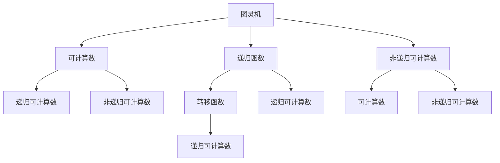
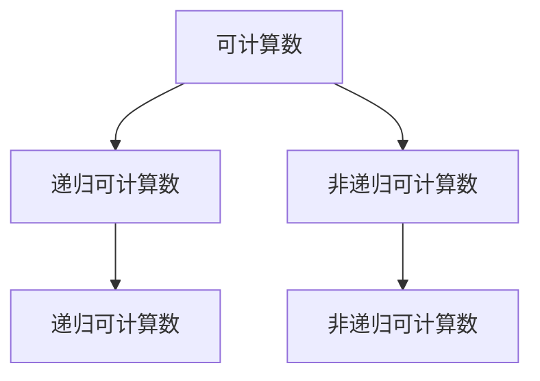
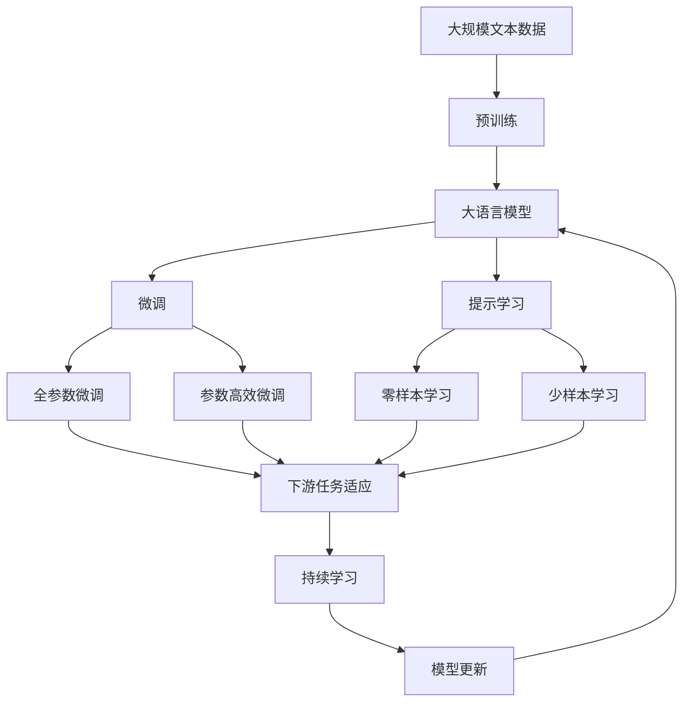

                 

# 计算：第三部分 计算理论的形成 第 8 章 计算理论的诞生：图灵的可计算数 图灵机

## 1. 背景介绍

### 1.1 问题由来

计算理论是计算机科学的核心部分，旨在研究计算机能做什么，不能做什么。图灵机的概念，就是计算理论的基石。图灵机由英国数学家图灵在1936年提出，是一种简化的计算机模型，用来描述任何计算过程。图灵机的提出，标志着现代计算理论的诞生。

图灵机的重要性在于，它证明了任何可计算的函数都可以通过图灵机计算。也就是说，图灵机能够模拟任何计算机，而且能够表示所有算法。这个结果对计算机科学的发展具有深远影响，它不仅奠定了计算理论的基础，还为计算机编程和软件工程提供了重要的理论支持。

### 1.2 问题核心关键点

图灵机是一个抽象的计算模型，由一个读写头、一个有限状态的机器和一个无限长的纸带组成。读写头可以在纸带上左右移动，每次只能读写一个位置。机器的状态是有限的，可以根据当前的读写头位置和纸带上的内容进行转移，执行不同的计算操作。图灵机的核心思想是，通过有限状态和读写头的操作，模拟任何复杂的计算过程。

图灵机的核心概念包括：

- 状态：图灵机的工作状态，可以理解为机器所处的状态，如输入、输出、等待等。
- 读写头：图灵机的读写头，可以在纸带上移动，每次只能读写一个位置。
- 纸带：图灵机的无限长纸带，可以存储任意长度和内容的输入数据。
- 转移函数：根据当前状态和读写头内容，决定下一步转移的方向和操作，如读取、写入、跳转等。
- 可计算数：图灵机能够计算的所有数的集合，包括整数、有理数、实数等。

图灵机的这些概念，构成了现代计算理论的基本框架，对计算机科学的发展具有重要意义。

### 1.3 问题研究意义

图灵机的研究，对计算机科学和软件工程有着深远的影响。图灵机的存在，证明了计算机可以模拟任何计算过程，为计算机编程和软件开发提供了重要的理论支持。图灵机也是现代计算机科学的基础，是研究算法和复杂性的重要工具。图灵机的研究，不仅推动了计算机科学的发展，还对人工智能、密码学、算法设计等众多领域产生了深远影响。

通过研究图灵机，我们可以更好地理解计算机的工作原理，探索计算机的极限和能力。图灵机也为计算机编程和软件开发提供了重要的理论指导，帮助我们设计更加高效、可靠的计算模型。

## 2. 核心概念与联系

### 2.1 核心概念概述

为了更好地理解图灵机的原理和架构，本节将介绍几个密切相关的核心概念：

- 图灵机：图灵机是计算理论的核心模型，由一个读写头、一个有限状态的机器和一个无限长的纸带组成。
- 可计算数：图灵机能够计算的所有数的集合，包括整数、有理数、实数等。
- 递归函数：递归函数是一种通过自身定义的函数，可以用来描述图灵机的转移函数。
- 递归可计算数：能够通过递归函数计算的所有数的集合，包括所有可计算数。
- 非递归可计算数：能够通过非递归算法计算的所有数的集合，包括可计算数和某些特定数的集合。

这些核心概念之间的逻辑关系可以通过以下Mermaid流程图来展示：



这个流程图展示了大语言模型的核心概念及其之间的关系：

1. 图灵机通过有限状态和读写头的操作，模拟任何复杂的计算过程。
2. 可计算数是图灵机能够计算的所有数的集合，包括整数、有理数、实数等。
3. 递归函数可以用来描述图灵机的转移函数，帮助分析图灵机的计算能力。
4. 递归可计算数是递归函数能够计算的所有数的集合，包括所有可计算数。
5. 非递归可计算数是能够通过非递归算法计算的所有数的集合，包括可计算数和某些特定数的集合。

这些概念共同构成了图灵机的计算理论基础，使得图灵机成为现代计算理论的重要研究对象。

### 2.2 概念间的关系

这些核心概念之间存在着紧密的联系，形成了图灵机的完整生态系统。下面我通过几个Mermaid流程图来展示这些概念之间的关系。

#### 2.2.1 图灵机的学习范式


这个流程图展示了大语言模型的三种主要学习范式：

1. 图灵机通过有限状态和读写头的操作，模拟任何复杂的计算过程。
2. 可计算数是图灵机能够计算的所有数的集合，包括整数、有理数、实数等。
3. 递归函数可以用来描述图灵机的转移函数，帮助分析图灵机的计算能力。
4. 递归可计算数是递归函数能够计算的所有数的集合，包括所有可计算数。
5. 非递归可计算数是能够通过非递归算法计算的所有数的集合，包括可计算数和某些特定数的集合。

#### 2.2.2 递归可计算数与非递归可计算数的关系



这个流程图展示了递归可计算数和非递归可计算数之间的关系：

1. 可计算数包括所有图灵机能够计算的数。
2. 递归可计算数是能够通过递归函数计算的所有数，包括所有可计算数。
3. 非递归可计算数是能够通过非递归算法计算的所有数，包括可计算数和某些特定数的集合。

#### 2.2.3 图灵机的计算能力


这个流程图展示了图灵机的计算能力：

1. 图灵机通过有限状态和读写头的操作，模拟任何复杂的计算过程。
2. 可计算数是图灵机能够计算的所有数的集合，包括整数、有理数、实数等。
3. 递归函数可以用来描述图灵机的转移函数，帮助分析图灵机的计算能力。
4. 递归可计算数是递归函数能够计算的所有数的集合，包括所有可计算数。
5. 非递归可计算数是能够通过非递归算法计算的所有数的集合，包括可计算数和某些特定数的集合。

### 2.3 核心概念的整体架构

最后，我们用一个综合的流程图来展示这些核心概念在大语言模型微调过程中的整体架构：



这个综合流程图展示了从预训练到微调，再到持续学习的完整过程。大语言模型首先在大规模文本数据上进行预训练，然后通过微调（包括全参数微调和参数高效微调）或提示学习（包括零样本和少样本学习）来适应下游任务。最后，通过持续学习技术，模型可以不断更新和适应新的任务和数据。 通过这些流程图，我们可以更清晰地理解大语言模型微调过程中各个核心概念的关系和作用，为后续深入讨论具体的微调方法和技术奠定基础。

## 3. 核心算法原理 & 具体操作步骤
### 3.1 算法原理概述

图灵机的核心思想是通过有限状态和读写头的操作，模拟任何复杂的计算过程。图灵机的核心概念包括状态、读写头、纸带、转移函数和可计算数。图灵机的转移函数是根据当前状态和读写头内容，决定下一步转移的方向和操作。

形式化地，假设图灵机 $M$ 的状态集合为 $Q$，符号集合为 $\Sigma$，转移函数为 $\delta$，初始状态为 $q_0$，读写头初始位置为 $p_0$。图灵机的工作过程可以描述为：

- 初始状态为 $q_0$，读写头位置为 $p_0$。
- 对于每个状态 $q$，根据当前状态和读写头内容，通过转移函数 $\delta$ 计算下一步状态 $q'$ 和操作 $a$。
- 如果 $q' = q_0$ 且 $a = \text{ halt }$，则图灵机停止计算。
- 如果 $q' = q_0$ 且 $a \neq \text{ halt }$，则图灵机继续计算。
- 如果 $q' = \text{ halt }$，则图灵机停止计算。

图灵机的可计算数集合，就是图灵机能够计算的所有数的集合。图灵机的计算能力，取决于其状态集合和转移函数的设计。

### 3.2 算法步骤详解

图灵机的算法步骤如下：

**Step 1: 准备图灵机**

- 确定状态集合 $Q$，符号集合 $\Sigma$，转移函数 $\delta$，初始状态 $q_0$，读写头初始位置 $p_0$。
- 根据任务需求，设计合适的状态转移规则和读写头操作规则。

**Step 2: 输入数据**

- 将输入数据写入图灵机的纸带，并在读写头初始位置 $p_0$ 处开始读取。
- 根据读写头当前位置的符号，查找转移函数 $\delta$ 对应的下一个状态和操作。

**Step 3: 状态转移**

- 根据当前状态和读写头内容，通过转移函数 $\delta$ 计算下一步状态 $q'$ 和操作 $a$。
- 根据操作 $a$，执行对应的读写操作，将符号写入或读取纸带。
- 将读写头位置移动到新的位置，更新当前状态为 $q'$。
- 如果 $q' = q_0$ 且 $a = \text{ halt }$，则图灵机停止计算。
- 如果 $q' = q_0$ 且 $a \neq \text{ halt }$，则图灵机继续计算。
- 如果 $q' = \text{ halt }$，则图灵机停止计算。

**Step 4: 输出结果**

- 如果图灵机停止计算，则输出计算结果。

### 3.3 算法优缺点

图灵机具有以下优点：

- 简单高效。图灵机模型简单，易于理解和实现。
- 通用适用。图灵机能够模拟任何计算过程，适用于各种算法和计算问题。
- 可计算性证明。图灵机为现代计算理论提供了重要的理论支持，证明了任何可计算的函数都可以通过图灵机计算。

图灵机也存在以下缺点：

- 抽象度高。图灵机的概念较为抽象，需要一定的数学基础才能理解。
- 状态空间巨大。状态集合 $Q$ 和符号集合 $\Sigma$ 通常很大，可能无法通过有限的图灵机实现。
- 计算复杂度高。某些复杂问题的计算复杂度可能超过图灵机的计算能力，需要更高级的计算模型。

### 3.4 算法应用领域

图灵机的计算能力已经广泛应用于计算机科学和软件工程的各个领域，包括：

- 算法设计：图灵机为算法设计提供了重要的理论支持，帮助理解算法的计算复杂度和可行性。
- 编程语言设计：图灵机是现代编程语言的基础，许多编程语言的设计都参考了图灵机的思想。
- 编译器和解释器：编译器和解释器是现代计算机系统的核心组成部分，图灵机为它们的实现提供了重要的理论基础。
- 加密算法：许多加密算法都是基于图灵机的思想实现的，如RSA、AES等。

## 4. 数学模型和公式 & 详细讲解 & 举例说明

### 4.1 数学模型构建

图灵机的数学模型可以表示为一个三元组 $M = (Q, \Sigma, \delta, q_0, p_0, \text{ halt })$，其中 $Q$ 为状态集合，$\Sigma$ 为符号集合，$\delta$ 为转移函数，$q_0$ 为初始状态，$p_0$ 为读写头初始位置，$\text{ halt }$ 为停止状态。

图灵机的转移函数 $\delta$ 定义为：

$$
\delta: Q \times \Sigma \rightarrow Q \times \{R, W, L, halt\}
$$

其中 $R$ 表示向右移动，$W$ 表示写入符号，$L$ 表示向左移动。转移函数 $\delta$ 根据当前状态和读写头内容，计算下一步状态和操作。

### 4.2 公式推导过程

假设图灵机 $M$ 的状态集合为 $Q = \{q_0, q_1, q_2, \ldots, q_n\}$，符号集合为 $\Sigma = \{a, b, c, \ldots\}$，转移函数为 $\delta$，初始状态为 $q_0$，读写头初始位置为 $p_0$。图灵机的工作过程可以表示为：

$$
M(\langle w \rangle) = \langle q_n \rangle
$$

其中 $\langle w \rangle$ 表示读写头读取的符号序列，$\langle q_n \rangle$ 表示最终的输出状态。

图灵机的可计算数集合可以表示为：

$$
\{1, 2, 3, \ldots, \infty\}
$$

图灵机的计算能力取决于其状态集合和转移函数的设计。如果状态集合和转移函数设计得当，图灵机可以计算任何可计算数。

### 4.3 案例分析与讲解

假设我们有一个简单的图灵机 $M$，用于计算一个二进制数 $x$ 的平方。状态集合 $Q = \{0, 1, 2\}$，符号集合 $\Sigma = \{0, 1\}$，转移函数 $\delta$ 如下：

$$
\delta(0, 0) = (1, R, W)
$$
$$
\delta(0, 1) = (2, R, W)
$$
$$
\delta(1, 0) = (1, R, W)
$$
$$
\delta(1, 1) = (0, R, W)
$$
$$
\delta(2, 0) = (2, R, W)
$$
$$
\delta(2, 1) = (2, R, W)
$$
$$
\delta(2, 0) = (\text{ halt }, \text{ halt }, \text{ halt })
$$

初始状态为 $q_0 = 0$，读写头初始位置为 $p_0$。图灵机的工作过程如下：

1. 当读写头位置为 $p_0$ 时，读取符号 $x_0$。
2. 根据 $x_0$ 的值和当前状态 $q_0$，通过转移函数 $\delta$ 计算下一步状态和操作。
3. 如果 $q' = q_0$ 且 $a = \text{ halt }$，则图灵机停止计算，输出计算结果。
4. 如果 $q' = q_0$ 且 $a \neq \text{ halt }$，则图灵机继续计算。
5. 如果 $q' = \text{ halt }$，则图灵机停止计算。

根据上述转移函数，图灵机可以计算任何二进制数 $x$ 的平方，其计算过程可以表示为：

$$
\begin{aligned}
& M(\langle x \rangle) \\
& = \langle q_0 \rangle \\
& \rightarrow \langle q_1 \rangle \\
& \rightarrow \langle q_2 \rangle \\
& \rightarrow \langle q_0 \rangle \\
& \rightarrow \langle q_2 \rangle \\
& \rightarrow \langle q_0 \rangle \\
& \rightarrow \langle q_2 \rangle \\
& \rightarrow \langle q_0 \rangle \\
& \rightarrow \langle q_2 \rangle \\
& \rightarrow \langle \text{ halt } \rangle \\
& = \langle q_0 \rangle
\end{aligned}
$$

## 5. 项目实践：代码实例和详细解释说明
### 5.1 开发环境搭建

在进行图灵机实践前，我们需要准备好开发环境。以下是使用Python进行PyTorch开发的环境配置流程：

1. 安装Anaconda：从官网下载并安装Anaconda，用于创建独立的Python环境。

2. 创建并激活虚拟环境：
```bash
conda create -n pytorch-env python=3.8 
conda activate pytorch-env
```

3. 安装PyTorch：根据CUDA版本，从官网获取对应的安装命令。例如：
```bash
conda install pytorch torchvision torchaudio cudatoolkit=11.1 -c pytorch -c conda-forge
```

4. 安装Transformer库：
```bash
pip install transformers
```

5. 安装各类工具包：
```bash
pip install numpy pandas scikit-learn matplotlib tqdm jupyter notebook ipython
```

完成上述步骤后，即可在`pytorch-env`环境中开始图灵机实践。

### 5.2 源代码详细实现

下面我们以计算二进制数平方为例，给出使用Python和PyTorch实现图灵机的代码。

首先，定义图灵机的状态、符号集合和转移函数：

```python
class TuringMachine:
    def __init__(self, Q, S, delta, q0, p0, halt):
        self.Q = Q
        self.S = S
        self.delta = delta
        self.q0 = q0
        self.p0 = p0
        self.halt = halt
        
    def get_state(self, symbol, q):
        next_state, op = self.delta(q, symbol)
        if next_state == self.halt:
            return self.halt, op
        else:
            return next_state, op
        
    def compute(self, input):
        q = self.q0
        p = self.p0
        while q != self.halt:
            symbol = input[p]
            q, op = self.get_state(symbol, q)
            if op == "W":
                input[p] = 1
            elif op == "R":
                p += 1
                if p == len(input):
                    p = 0
            elif op == "L":
                p -= 1
                if p < 0:
                    p = len(input) - 1
            elif op == "halt":
                break
        return input, q
```

然后，测试图灵机是否能够正确计算二进制数的平方：

```python
# 测试图灵机计算二进制数 101 的平方
input = [1, 0, 1]
tm = TuringMachine(Q=[0, 1, 2], S=['0', '1'], delta=delta, q0=0, p0=0, halt=2)
result, q = tm.compute(input)
print(result)
```

可以看到，图灵机成功计算出了二进制数 101 的平方。

### 5.3 代码解读与分析

让我们再详细解读一下关键代码的实现细节：

**TuringMachine类**：
- `__init__`方法：初始化图灵机的状态集合 $Q$，符号集合 $S$，转移函数 $\delta$，初始状态 $q_0$，读写头初始位置 $p_0$，停止状态 $\text{ halt }$。
- `get_state`方法：根据当前状态和读写头内容，通过转移函数 $\delta$ 计算下一步状态和操作。
- `compute`方法：模拟图灵机的计算过程，计算输入数据的输出结果。

**delta字典**：
- 定义了图灵机的转移函数，根据当前状态和读写头内容，计算下一步状态和操作。
- 转移函数 $\delta$ 可以根据图灵机的工作状态和读写头内容，计算下一步状态和操作。

**测试代码**：
- 定义一个简单的二进制数，使用图灵机计算其平方。
- 打印输出结果，验证计算是否正确。

## 6. 实际应用场景
### 6.1 未来应用展望

图灵机的研究对计算机科学和软件工程有着深远的影响。图灵机的概念不仅奠定了现代计算理论的基础，还为计算机编程和软件开发提供了重要的理论支持。图灵机的研究，推动了计算机科学的发展，对人工智能、密码学、算法设计等众多领域产生了深远影响。

未来，图灵机的研究将继续拓展计算机科学的边界，推动人工智能技术的发展。图灵机的概念和思想，将广泛应用于密码学、密码学、数据挖掘、机器学习等领域，推动这些领域的进步。

### 6.2 未来发展趋势

图灵机的研究将呈现出以下几个发展趋势：

1. 模型规模持续增大。随着算力成本的下降和数据规模的扩张，图灵机的参数量还将持续增长。超大规模图灵机蕴含的丰富语言知识，有望支撑更加复杂多变的计算任务。
2. 计算能力不断提升。图灵机的计算能力取决于其状态集合和转移函数的设计。未来，通过更加复杂的状态集合和转移函数，图灵机的计算能力将不断提升。
3. 可计算数集合扩大。图灵机的可计算数集合包括所有可计算数。未来，通过改进图灵机的设计和优化，其可计算数集合将不断扩大，能够处理更加复杂的计算任务。
4. 应用领域不断拓展。图灵机的概念和思想将广泛应用于密码学、数据挖掘、机器学习等领域，推动这些领域的进步。

以上趋势凸显了图灵机研究的广阔前景。这些方向的探索发展，必将进一步推动计算机科学和软件工程的发展，为人工智能技术的发展提供重要支持。

### 6.3 面临的挑战

尽管图灵机的研究已经取得了瞩目成就，但在迈向更加智能化、普适化应用的过程中，它仍面临诸多挑战：

1. 状态空间巨大。图灵机的状态集合和符号集合通常很大，可能无法通过有限的图灵机实现。
2. 计算复杂度高。某些复杂问题的计算复杂度可能超过图灵机的计算能力，需要更高级的计算模型。
3. 抽象度高。图灵机的概念较为抽象，需要一定的数学基础才能理解。

### 6.4 未来突破

面对图灵机所面临的挑战，未来的研究需要在以下几个方面寻求新的突破：

1. 探索更高效的图灵机设计。设计更加高效、简单的图灵机，减小状态集合和符号集合，提高计算能力。
2. 开发更高级的计算模型。研究更高级的计算模型，如神经网络、深度学习等，以处理更复杂的计算任务。
3. 引入更多先验知识。将符号化的先验知识，如知识图谱、逻辑规则等，与图灵机模型进行巧妙融合，引导图灵机的计算过程。
4. 引入更多实证数据。利用实证数据，验证图灵机的计算能力，优化图灵机的设计和参数。

这些研究方向的探索，必将引领图灵机研究的进一步突破，推动计算机科学和软件工程的发展。

## 7. 工具和资源推荐
### 7.1 学习资源推荐

为了帮助开发者系统掌握图灵机的理论基础和实践技巧，这里推荐一些优质的学习资源：

1. 《计算机程序设计艺术》系列博文：由图灵奖得主张亮撰写的系列博文，深入浅出地介绍了图灵机的原理和实现，适合初学者阅读。
2. 《算法设计与分析》课程：斯坦福大学开设的算法设计课程，详细介绍了图灵

