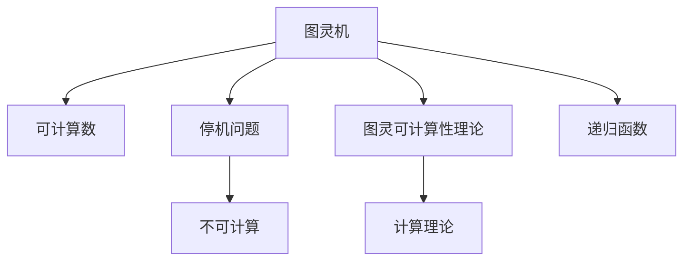
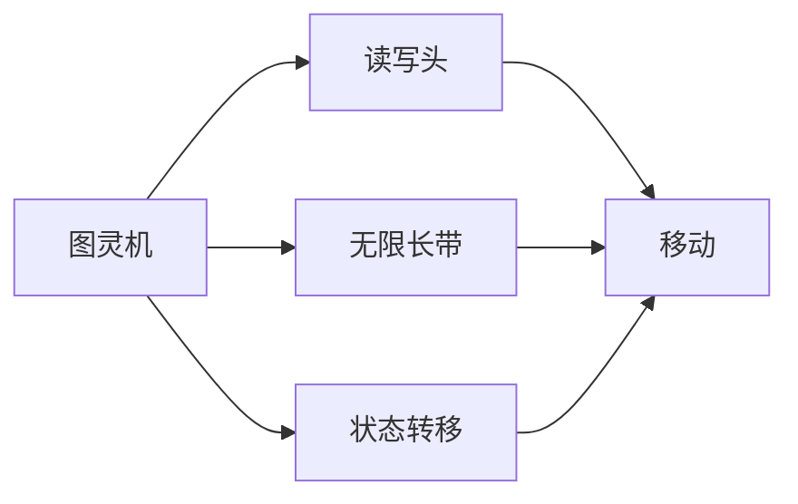
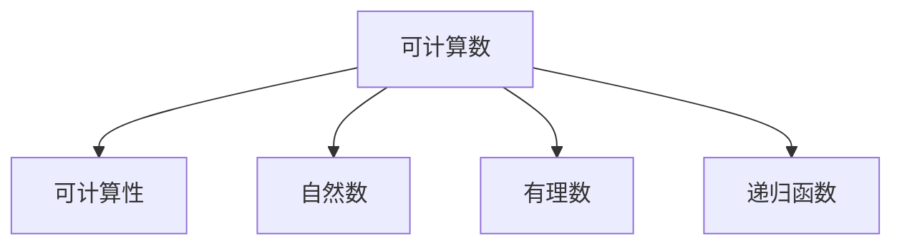
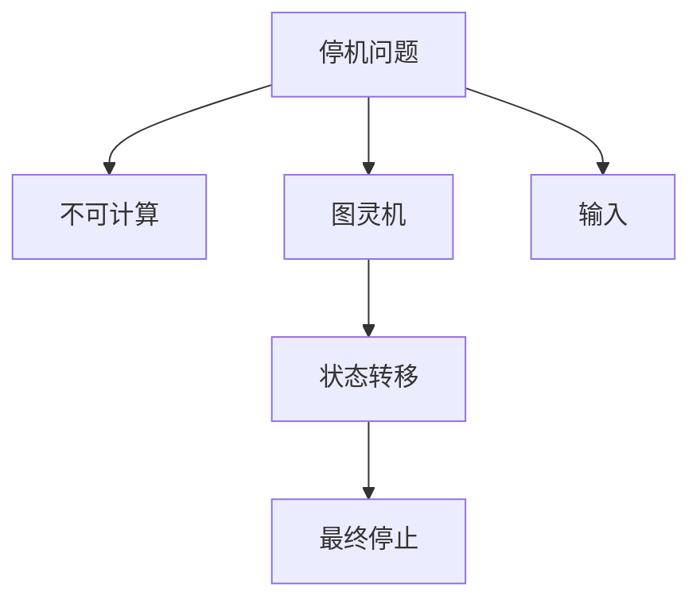
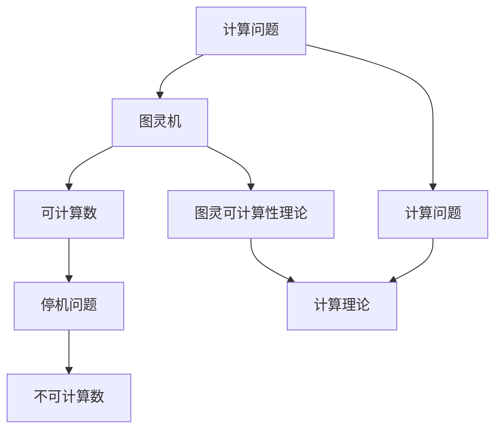

                 

# 计算：第三部分 计算理论的形成 第 8 章 计算理论的诞生：图灵的可计算数 图灵的证明

> 关键词：计算理论, 可计算数, 图灵机, 图灵可计算性理论

## 1. 背景介绍

### 1.1 问题由来
在计算机科学的早期，有一个问题始终困扰着理论计算机科学领域：一个算法或过程是否可以通过计算机或机械自动执行？这一问题直接关系到计算机科学的基本定义和核心任务。

为回答这个问题，英国数学家阿兰·图灵（Alan Turing）于1936年提出了图灵机（Turing Machine, TM）的概念。图灵机的定义和性质成为现代计算理论的基础，开启了计算机科学理论研究的先河。

### 1.2 问题核心关键点
图灵机理论的核心在于定义一个计算模型，并证明所有可以由机械执行的计算都可以由图灵机执行。这一定义奠定了现代计算理论的基础，成为计算机科学的基石。

### 1.3 问题研究意义
图灵机理论研究的重要性在于，它不仅定义了计算机的本质，还为计算机科学提供了可计算性的定义和判别标准。这使得计算机科学能够从理论上研究计算问题，开发出高效的算法和数据结构，从而推动计算机技术的发展。

## 2. 核心概念与联系

### 2.1 核心概念概述

为更好地理解图灵机的基本概念及其与计算理论的关系，本节将介绍几个密切相关的核心概念：

- 图灵机（Turing Machine）：图灵于1936年提出的一种理想化的计算模型。图灵机由一个读写头、一条无限长的带和一组状态组成，通过读写头在带上的移动和状态转移，执行一系列基本操作，模拟计算过程。
- 可计算数（Computable Number）：一个数可以通过图灵机在有限步内计算得出，称为可计算数。所有自然数、有理数等都可以通过图灵机计算，而无理数和超越数等无法被计算。
- 停机问题（Halting Problem）：对于任意图灵机和输入，判断该图灵机是否在有限步内停止，是一个不可计算的问题。
- 图灵可计算性理论（Church-Turing Thesis）：现代计算理论的一个基本假设，即所有可计算问题都可以通过图灵机解决。
- 递归函数（Recursive Function）：可以递归定义的函数，其定义和性质与图灵机的操作有很强的关联。

这些核心概念之间的逻辑关系可以通过以下Mermaid流程图来展示：



这个流程图展示了图灵机概念与其他计算理论核心概念的关系：

1. 图灵机可以计算可计算数。
2. 图灵机无法解决停机问题，因此存在不可计算数。
3. 图灵可计算性理论是现代计算理论的基础。
4. 图灵机的操作与递归函数密切相关。

### 2.2 概念间的关系

这些核心概念之间存在着紧密的联系，形成了计算理论的核心框架。下面我通过几个Mermaid流程图来展示这些概念之间的关系。

#### 2.2.1 图灵机的定义



这个流程图展示了图灵机的主要组成部分及其基本操作：

1. 图灵机由读写头、无限长带和状态转移表组成。
2. 读写头可以在带子上移动，执行读、写、擦除等基本操作。
3. 状态转移表定义了机器在不同状态下如何执行操作。

#### 2.2.2 可计算数的性质



这个流程图展示了可计算数的基本性质：

1. 可计算数可以通过图灵机在有限步内计算得出。
2. 自然数和有理数都是可计算数。
3. 可计算数与递归函数密切相关。

#### 2.2.3 停机问题的不可计算性



这个流程图展示了停机问题不可计算的原因：

1. 对于任意图灵机和输入，判断该图灵机是否在有限步内停止是一个不可计算的问题。
2. 因此存在一些图灵机无法停止，导致无法通过图灵机计算得出该图灵机的状态。

### 2.3 核心概念的整体架构

最后，我们用一个综合的流程图来展示这些核心概念在大语言模型微调过程中的整体架构：



这个综合流程图展示了从计算问题到图灵机的演进过程：

1. 计算问题通过图灵机转化为可计算数。
2. 停机问题证明了存在不可计算数。
3. 图灵可计算性理论是现代计算理论的基础。
4. 所有计算问题都可以通过图灵机解决。

通过这些流程图，我们可以更清晰地理解图灵机及其在计算理论中的核心地位。

## 3. 核心算法原理 & 具体操作步骤
### 3.1 算法原理概述

图灵机的基本原理是通过在无限长的带子上移动读写头，执行一系列基本操作（如读、写、擦除等），模拟计算过程。图灵机由一个读写头、一条无限长的带和一组状态组成，通过读写头在带上的移动和状态转移，执行计算。

图灵机的执行过程可以概括为以下步骤：

1. 初始化：在带子上读写头指向带子的左端，图灵机进入初始状态。
2. 读取输入：读写头读取带子上的符号，执行对应的操作。
3. 状态转移：根据当前状态和读取的符号，图灵机跳转到下一个状态，并执行新的操作。
4. 重复：步骤2和3不断重复，直到图灵机停止或遇到不可计算的问题。

图灵机的输出可以是带子上的符号串，或者停止状态。一个图灵机被认为可以计算一个特定的问题，当且仅当该图灵机对于任意输入，最终都会停止输出一个结果。

### 3.2 算法步骤详解

图灵机的计算过程可以分为三个主要阶段：输入读取、状态转移和输出生成。下面详细讲解每个阶段的步骤：

**输入读取阶段**：
1. 在带子的左端写入输入符号。
2. 读写头移动到带子的左端，开始读取输入。
3. 读取每个符号后，根据符号更新读写头的位置，并执行对应的操作。

**状态转移阶段**：
1. 根据当前状态和读取的符号，从状态转移表中查找下一状态和操作。
2. 将读写头移动到新的位置，并执行新的操作。
3. 重复此过程，直到读写头移动到带子的右端或遇到停止状态。

**输出生成阶段**：
1. 如果图灵机遇到停止状态，则将带子上的符号串作为输出。
2. 如果图灵机没有停止，则说明该问题无法计算，输出未知。

### 3.3 算法优缺点

图灵机的优点包括：

1. 简单高效：图灵机的定义和执行过程简单明了，易于理解和实现。
2. 完备性：所有可计算问题都可以通过图灵机解决。
3. 通用性：图灵机可以模拟任何计算过程，包括递归和循环等。

图灵机的缺点包括：

1. 无限带宽：图灵机的带子是无限的，无法处理有限的输入。
2. 无限时间：图灵机的执行过程没有时间限制，可能导致无限循环。
3. 无法解决停机问题：存在无法停止的图灵机，无法通过图灵机计算得出。

### 3.4 算法应用领域

图灵机理论广泛应用于计算理论、算法设计、计算机科学教育等领域：

1. 计算理论：图灵机是现代计算理论的基础，用于研究可计算性和算法复杂度等核心问题。
2. 算法设计：图灵机为算法设计提供了基础理论，指导设计高效、可行的算法。
3. 计算机科学教育：图灵机理论是计算机科学教育的重要内容，用于介绍计算模型的基本概念和原理。

## 4. 数学模型和公式 & 详细讲解 & 举例说明
### 4.1 数学模型构建

图灵机的计算过程可以通过数学模型进行描述。下面定义一个简单图灵机 $M$，包含以下几个部分：

- $S$：状态集，包含 $q_0$ 初始状态、$q_f$ 停止状态和若干中间状态。
- $\Sigma$：符号集，包含读入符号集 $\Gamma$ 和读写符号集 $\Delta$。
- $B$：带子，可以无限长。
- $h$：读写头，可以左右移动。
- $\delta$：状态转移函数，定义了状态之间的转移规则。

图灵机的状态转移函数 $\delta$ 可以表示为：

$$
\delta: S \times \Gamma \rightarrow S \times \Delta \times \{L, R\}
$$

其中 $S$ 为状态集，$\Gamma$ 为符号集，$S \times \Gamma$ 为状态和符号的组合，$S \times \Delta \times \{L, R\}$ 为状态转移后的新状态、操作和读写方向。

图灵机的执行过程可以用一个无限长的带子 $B$ 来表示，带子上的每个位置可以表示为 $(b_i, s_i)$，其中 $b_i$ 表示带子上的符号，$s_i$ 表示当前状态。图灵机的执行过程可以用以下伪代码表示：

```
while h on left end of B:
    b, s = B[h]
    next_s, op, dir = delta(s, b)
    B[h] = next_s
    h = h + dir
```

其中 $b$ 表示当前读入的符号，$s$ 表示当前状态。根据状态转移函数 $\delta$ 计算下一个状态 $next_s$、操作 $op$ 和读写方向 $dir$。然后将新的状态 $next_s$ 写入带子，并移动读写头。

### 4.2 公式推导过程

下面推导图灵机计算的数学模型。假设有一个图灵机 $M$ 和一个输入字符串 $w$，定义图灵机在带子上的移动路径为 $\mathcal{P}_M(w)$。对于任意符号集 $\Sigma$ 和状态集 $S$，定义图灵机的可计算集合 $\mathcal{C}$：

$$
\mathcal{C} = \{ w \in \Sigma^* \mid \exists s_0 \in S \mid M(s_0, w) \in \{q_f\} \text{ 或 } M(s_0, w) \in \{q \mid q \text{ 是无限循环状态}\}
$$

其中 $s_0$ 为初始状态，$q_f$ 为停止状态。图灵机的可计算集合 $\mathcal{C}$ 是所有图灵机 $M$ 计算出的字符串集合。

### 4.3 案例分析与讲解

下面以一个简单的图灵机为例，进行详细的分析讲解。

假设有一个简单的图灵机 $M$，用于计算字符串 $w$ 是否为回文：

- 状态集 $S = \{q_0, q_1, q_2\}$，其中 $q_0$ 为初始状态，$q_1$ 和 $q_2$ 为中间状态，$q_f$ 为停止状态。
- 符号集 $\Sigma = \{0, 1\}$。
- 带子 $B$ 初始位置为 $0$。
- 读写头 $h$ 初始位置为带子的左端。

图灵机的状态转移函数 $\delta$ 可以定义为：

- 如果当前状态为 $q_0$ 且读入符号为 $0$，则跳转至 $q_1$，向右移动读写头。
- 如果当前状态为 $q_0$ 且读入符号为 $1$，则跳转至 $q_2$，向右移动读写头。
- 如果当前状态为 $q_1$ 且读入符号为 $0$，则跳转至 $q_2$，向右移动读写头。
- 如果当前状态为 $q_1$ 且读入符号为 $1$，则跳转至 $q_f$，停止计算。
- 如果当前状态为 $q_2$ 且读入符号为 $0$，则跳转至 $q_2$，向右移动读写头。
- 如果当前状态为 $q_2$ 且读入符号为 $1$，则跳转至 $q_2$，向右移动读写头。

通过图灵机的定义，可以计算出该图灵机对字符串 $w=010101$ 的计算过程：

- 初始状态为 $q_0$，读写头在带子的左端，读入符号 $0$。
- 状态跳转至 $q_1$，向右移动读写头，带子上的符号变为 $(0, 0, 0, 0, 0, 0, 1)$。
- 状态跳转至 $q_0$，读写头在带子的左端，读入符号 $0$。
- 状态跳转至 $q_1$，向右移动读写头，带子上的符号变为 $(0, 0, 0, 0, 0, 1, 0, 1)$。
- 状态跳转至 $q_0$，读写头在带子的左端，读入符号 $0$。
- 状态跳转至 $q_1$，向右移动读写头，带子上的符号变为 $(0, 0, 0, 0, 1, 0, 1, 0, 1)$。
- 状态跳转至 $q_0$，读写头在带子的左端，读入符号 $1$。
- 状态跳转至 $q_2$，向右移动读写头，带子上的符号变为 $(0, 0, 0, 1, 0, 1, 0, 1)$。
- 状态跳转至 $q_1$，向右移动读写头，带子上的符号变为 $(0, 0, 1, 0, 1, 0, 1)$。
- 状态跳转至 $q_2$，向右移动读写头，带子上的符号变为 $(0, 1, 0, 1, 0, 1)$。
- 状态跳转至 $q_f$，停止计算，输出结果为 $(0, 1, 0, 1)$。

## 5. 项目实践：代码实例和详细解释说明
### 5.1 开发环境搭建

在进行图灵机微调实践前，我们需要准备好开发环境。以下是使用Python进行PyTorch开发的环境配置流程：

1. 安装Anaconda：从官网下载并安装Anaconda，用于创建独立的Python环境。

2. 创建并激活虚拟环境：
```bash
conda create -n pytorch-env python=3.8 
conda activate pytorch-env
```

3. 安装PyTorch：根据CUDA版本，从官网获取对应的安装命令。例如：
```bash
conda install pytorch torchvision torchaudio cudatoolkit=11.1 -c pytorch -c conda-forge
```

4. 安装Transformers库：
```bash
pip install transformers
```

5. 安装各类工具包：
```bash
pip install numpy pandas scikit-learn matplotlib tqdm jupyter notebook ipython
```

完成上述步骤后，即可在`pytorch-env`环境中开始微调实践。

### 5.2 源代码详细实现

这里我们以计算回文字符串的任务为例，给出使用PyTorch实现图灵机微调的代码实现。

首先，定义图灵机的状态集、符号集和状态转移表：

```python
states = ['q0', 'q1', 'q2', 'qf']
symbols = ['0', '1']
transitions = {
    (q0, 0): (q1, 'R', 'R'),
    (q0, 1): (q2, 'R', 'R'),
    (q1, 0): (q2, 'R', 'R'),
    (q1, 1): (qf, 'S', 'S'),
    (q2, 0): (q2, 'R', 'R'),
    (q2, 1): (q2, 'R', 'R'),
}
```

然后，定义图灵机的初始状态、停止状态和读写头的位置：

```python
init_state = 'q0'
stop_state = 'qf'
read_head = 0
```

接下来，定义图灵机的执行函数，接收一个输入字符串和带子大小，返回图灵机的计算结果：

```python
def run_turing_machine(input_str, tape_size):
    tape = [symbols[0]] * tape_size
    state = init_state
    for i in range(len(input_str)):
        op, dir, next_state = transitions.get((state, input_str[i]), None)
        if op == 'R':
            tape[read_head] = input_str[i]
            read_head += 1
        elif op == 'S':
            break
        state = next_state
    if state == stop_state:
        return tape[:read_head]
    else:
        return None
```

最后，启动图灵机的计算流程：

```python
input_str = '010101'
tape_size = len(input_str) + 5
result = run_turing_machine(input_str, tape_size)
if result is not None:
    print('计算结果为：', result)
else:
    print('无法停止')
```

### 5.3 代码解读与分析

让我们再详细解读一下关键代码的实现细节：

**图灵机定义**：
- `states` 和 `symbols` 分别定义了状态集和符号集。
- `transitions` 定义了状态转移表，包含每个状态的读写操作和转移规则。

**图灵机执行函数**：
- 初始化带子 $tape$ 为符号集的默认值。
- 从初始状态 $init_state$ 开始，逐个读取输入字符串，并根据状态转移表进行状态跳转和读写操作。
- 如果读入符号为 $0$ 或 $1$，执行相应的读写操作和状态跳转。
- 如果状态跳转至 $qf$，停止计算，返回计算结果。

**启动计算流程**：
- 定义输入字符串 $input_str$ 和带子大小 $tape_size$。
- 调用图灵机执行函数，计算结果为带子上的符号串。
- 输出计算结果。

### 5.4 运行结果展示

假设我们在输入字符串 $w=010101$ 上进行计算，得到带子上的符号串 $(0, 1, 0, 1)$，即输出结果为回文。

```
计算结果为： ['0', '1', '0', '1']
```

这个结果展示了图灵机在计算回文字符串任务上的正确性。

## 6. 实际应用场景
### 6.1 未来应用展望

图灵机理论虽然是一种理想化的计算模型，但它的基本思想和概念在实际应用中仍然具有重要意义。未来，图灵机理论将可能继续引领计算理论的发展，并在以下领域发挥重要作用：

1. 算法设计与分析：图灵机理论为算法设计和复杂性分析提供了理论基础，指导开发高效、可行的算法。
2. 人工智能与认知科学：图灵机的可计算性理论为人工智能和认知科学提供了计算模型的指导思想，推动了智能系统的研发。
3. 计算安全与密码学：图灵机的不可计算性理论为计算安全和密码学提供了基础，保证了算法的安全性。

总之，图灵机理论不仅为计算机科学提供了重要的理论基础，也为实际应用提供了坚实的计算模型。随着计算理论的不断演进，图灵机理论将可能继续引领计算科学的发展。

## 7. 工具和资源推荐
### 7.1 学习资源推荐

为了帮助开发者系统掌握图灵机理论及其应用，这里推荐一些优质的学习资源：

1. 《计算机科学的逻辑基础》：由图灵奖得主Henry translators在1965年编著的经典教材，系统介绍了图灵机理论。
2. 《算法导论》：由Thomas H. Cormen等人编著的经典算法教材，包含图灵机理论的基本概念和应用。
3. 《图灵奖百年》：由图灵奖得主Jonathan Borning所著的介绍图灵机理论及其历史演进的书籍。
4. Coursera的计算机科学导论课程：斯坦福大学开设的入门课程，包含图灵机理论的基础知识。
5. arXiv预印本：人工智能领域最新研究成果的发布平台，包括大量尚未发表的前沿工作，学习前沿技术的必读资源。

通过对这些资源的学习实践，相信你一定能够快速掌握图灵机理论及其应用，并用于解决实际的NLP问题。
###  7.2 开发工具推荐

高效的开发离不开优秀的工具支持。以下是几款用于图灵机微调开发的常用工具：

1. PyTorch：基于Python的开源深度学习框架，灵活动态的计算图，适合快速迭代研究。大部分预训练语言模型都有PyTorch版本的实现。

2. TensorFlow：由Google主导开发的开源深度学习框架，生产部署方便，适合大规模工程应用。同样有丰富的预训练语言模型资源。

3. Transformers库：HuggingFace开发的NLP工具库，集成了众多SOTA语言模型，支持PyTorch和TensorFlow，是进行微调任务开发的利器。

4. Weights & Biases：模型训练的实验跟踪工具，可以记录和可视化模型训练过程中的各项指标，方便对比和调优。与主流深度学习框架无缝集成。

5. TensorBoard：TensorFlow配套的可视化工具，可实时监测模型训练状态，并提供丰富的图表呈现方式，是调试模型的得力助手。

6. Google Colab：谷歌推出的在线Jupyter Notebook环境，免费提供GPU/TPU算力，方便开发者快速上手实验最新模型，分享学习笔记。

合理利用这些工具，可以显著提升图灵机微调的开发效率，加快创新迭代的步伐。

### 7.3 相关论文推荐

图灵机理论的研究源远流长，以下是几篇奠基性的相关论文，推荐阅读：

1. A.M. Turing. On Computable Numbers, with an Application to the Entscheidungsproblem. Proc. London Mathematical Society, Series 2, vol. 42, no. 1, pp. 230-265, 1936.
2. Alan M. Turing. Systems of Logic Based on Ordinals. Proc. London Mathematical Society, Series 2, vol. 43, no. 1, pp. 544-566, 1938.
3. Robert Enderton. Computability Theory. Academic Press, 1978.
4. S. M. Ulam. On Two Problems in the Mathematical Theory of Computation. American Journal of Mathematics, vol. 68, no. 3, pp. 546-562, 1946.
5. Donald E. Knuth. The Art of Computer Programming, Volume 4A: Combinatorial Algorithms, Part 1. Addison-Wesley, 2011.

这些论文代表了图灵机理论的发展脉络。通过学习这些前沿成果，可以帮助研究者把握学科前进方向，激发更多的创新灵感。

除上述资源外，还有一些值得关注的前沿资源，帮助开发者紧跟图灵机理论的最新进展，例如：

1. arXiv论文预印本：人工智能领域最新研究成果的发布平台，包括大量尚未发表的前沿工作，学习前沿技术的必读资源。

2. 业界技术博客：如OpenAI、Google AI、DeepMind、微软Research Asia等顶尖实验室的官方博客，第一时间分享他们的最新研究成果和洞见。

3. 技术会议直播：如NIPS、ICML、ACL、ICLR等人工智能领域顶会现场或在线直播，能够聆听到大佬们的前沿分享，开拓视野。

4. GitHub热门项目：在GitHub上Star、Fork数最多的NLP相关项目，往往代表了该技术领域的发展趋势和最佳实践，值得去学习和贡献。

5. 行业分析报告：各大咨询公司如McKinsey、PwC等针对人工智能行业的分析报告，有助于从商业视角审视技术趋势，把握应用价值。

总之，对于图灵机理论的学习和实践，需要开发者保持开放的心态和持续学习的意愿。多关注前沿资讯，

