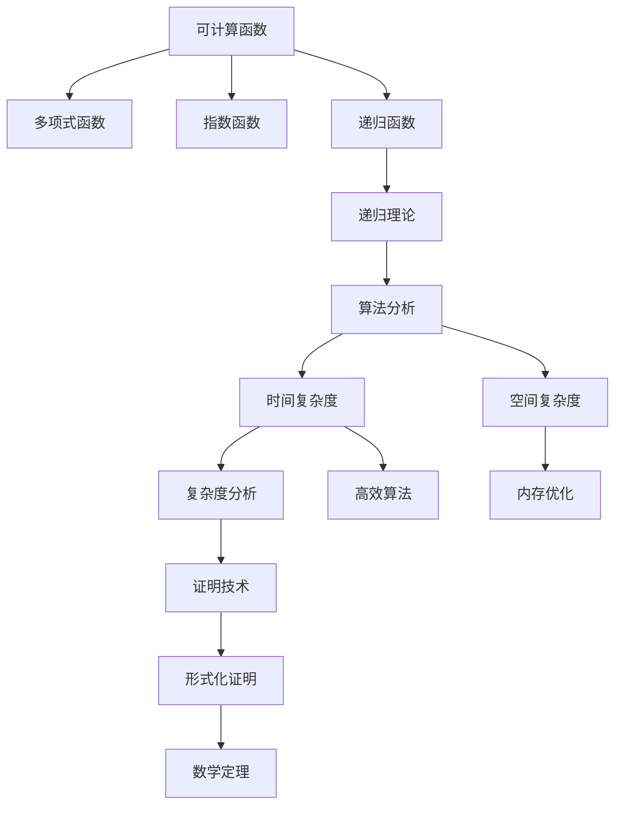
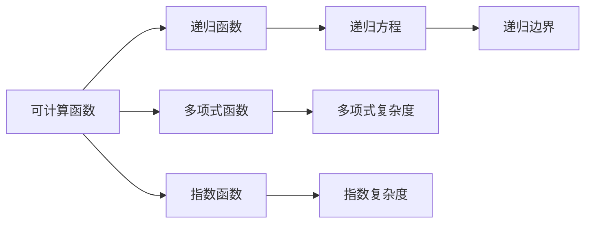
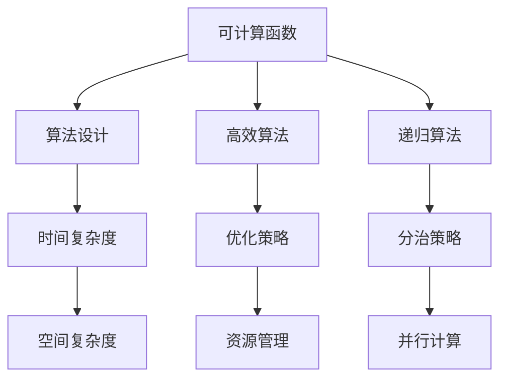
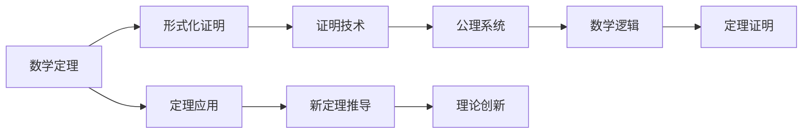
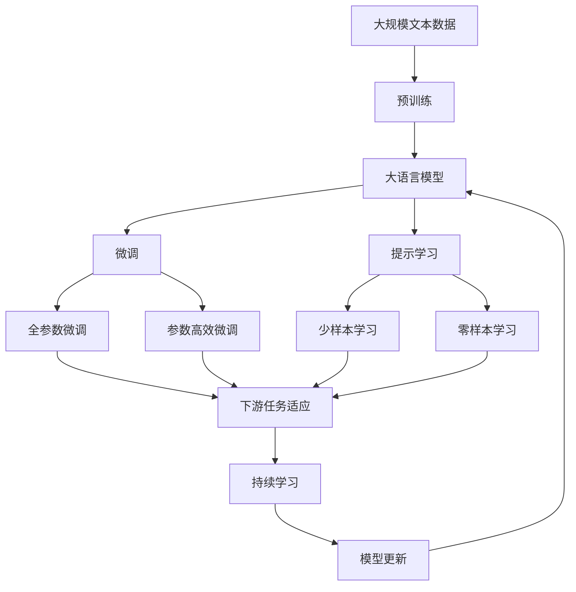

                 

# 计算：第二部分 计算的数学基础 第 4 章 数学的基础

> 关键词：计算理论, 数学基础, 计算机科学, 算法分析, 可计算性

## 1. 背景介绍

### 1.1 问题由来
在《计算：第一部分 图灵机与可计算性》一章中，我们介绍了图灵机的概念、特性以及可计算性问题的解决。图灵机通过符号操作和基本逻辑判断，可以模拟任何物理过程，这种理论模型为我们理解计算机的本质和能力提供了坚实的基础。然而，对于图灵机如何处理具体问题，其理论背后还需要数学的支撑，因此在本章我们将深入探讨数学基础在计算理论中的作用。

### 1.2 问题核心关键点
数学作为科学的基础，在计算理论中有着至关重要的地位。我们必须理解数学的基本概念和原理，以便于深入探讨图灵机的计算能力及其限制。具体来说，数学基础的核心关键点包括：
- 可计算函数：了解可计算函数及其在图灵机上的表示。
- 递归理论：理解递归函数和递归函数的计算过程。
- 算法分析：掌握算法的时间复杂度和空间复杂度的计算方法。
- 证明技术：掌握数学证明的基本方法和逻辑结构。

### 1.3 问题研究意义
掌握数学基础对于理解计算理论和算法设计至关重要。通过对数学原理的学习，我们可以深入理解计算模型的工作原理，设计出高效、准确的算法，并在实际应用中解决各种复杂问题。同时，数学基础还为算法分析和理论证明提供了方法论支持，是计算机科学领域的核心工具之一。

## 2. 核心概念与联系

### 2.1 核心概念概述

在数学基础中，以下几个核心概念及其相互联系是理解图灵机计算能力和计算理论的基础：

- **可计算函数**：指那些可以在有限步内由图灵机计算得到的所有函数，其中最基本的包括多项式函数、指数函数等。

- **递归函数**：指那些可以通过自身调用来求解的函数，其在计算理论中扮演着重要角色，与递归理论密切相关。

- **算法分析**：指对算法的时间复杂度和空间复杂度进行分析，帮助设计出高效、可行的算法，是计算机科学中的关键技术。

- **证明技术**：指对数学结论的正确性进行形式化证明，是理论研究的基础工具。

这些概念之间的逻辑关系可以通过以下Mermaid流程图来展示：



这个流程图展示了各个概念之间的联系：

1. 可计算函数涵盖了多种基础函数。
2. 递归函数是可计算函数的一种特殊形式，与递归理论密切相关。
3. 算法分析建立在可计算函数和递归函数的基础上，通过时间复杂度和空间复杂度的计算来优化算法。
4. 证明技术用于形式化证明算法分析的正确性，为数学定理和理论研究提供支持。

### 2.2 概念间的关系

这些核心概念之间存在紧密的联系，构成了计算理论的基础框架。下面通过几个Mermaid流程图来展示这些概念之间的关系：

#### 2.2.1 可计算函数与递归理论的关系



这个流程图展示了可计算函数与递归函数之间的联系。可计算函数包括多项式函数和指数函数，递归函数则是由递归方程和边界条件定义的。多项式复杂度指函数计算所需的时间，指数复杂度指计算所需的空间。

#### 2.2.2 算法分析与可计算函数的关系



这个流程图展示了算法分析与可计算函数之间的联系。可计算函数是算法设计的基础，算法分析则通过时间复杂度和空间复杂度来评估算法的效率，并通过优化策略和资源管理来提高算法的性能。递归算法和分治策略也是可计算函数的具体应用形式。

#### 2.2.3 证明技术与数学定理的关系



这个流程图展示了证明技术与数学定理之间的联系。数学定理需要通过形式化证明来验证其正确性，证明技术则是实现形式化证明的工具。公理系统提供数学证明的基础，数学逻辑是证明过程的逻辑框架。新定理的推导可以基于现有定理和应用场景进行，推动理论创新。

### 2.3 核心概念的整体架构

最后，我们用一个综合的流程图来展示这些核心概念在大规模语言模型微调过程中的整体架构：



这个综合流程图展示了从预训练到微调，再到持续学习的完整过程。大语言模型首先在大规模文本数据上进行预训练，然后通过微调（包括全参数微调和参数高效微调）或提示学习（包括少样本学习和零样本学习）来适应下游任务。最后，通过持续学习技术，模型可以不断更新和适应新的任务和数据。

## 3. 核心算法原理 & 具体操作步骤
### 3.1 算法原理概述

基于数学基础的计算理论，图灵机可以表示和计算任何可计算函数。本节将详细介绍这些核心算法原理。

在计算理论中，可计算函数可以表示为图灵机的一个状态转移系统。图灵机的计算过程包括符号操作、条件判断和循环。其中，符号操作表示对输入数据的处理，条件判断表示根据当前状态和输入选择不同的操作，循环表示通过条件判断进行状态的反复迭代。

具体而言，图灵机通过一个有限状态集、一个输入符号集和一个转移函数来表示。转移函数描述了图灵机从一个状态到另一个状态的操作过程，包括读写操作和转移条件。通过这些基本操作，图灵机可以模拟任何计算过程。

### 3.2 算法步骤详解

以下详细介绍基于图灵机计算的可计算函数的算法步骤：

**Step 1: 确定输入**
- 确定输入符号集 $\{a_1, a_2, ..., a_n\}$，其中 $a_i$ 表示输入的第 $i$ 个符号。

**Step 2: 确定状态集**
- 确定状态集 $\{q_0, q_1, ..., q_k\}$，其中 $q_0$ 表示初始状态，$q_k$ 表示终止状态。

**Step 3: 定义转移函数**
- 定义转移函数 $\delta: Q \times \Sigma \rightarrow Q \times \{0, 1\}^*$，其中 $Q$ 为状态集，$\Sigma$ 为输入符号集，$\{0, 1\}^*$ 表示输出符号串集合。

**Step 4: 模拟计算过程**
- 在图灵机上输入符号串 $x = x_1x_2...x_n$，从初始状态 $q_0$ 开始。
- 根据输入符号 $x_i$ 和当前状态 $q_j$，根据转移函数 $\delta$ 计算下一个状态 $q_{j+1}$ 和输出符号串 $y_i$。
- 重复以上过程，直到进入终止状态 $q_k$。

**Step 5: 计算结果**
- 输出最终的状态 $q_k$ 作为计算结果。

### 3.3 算法优缺点

基于图灵机的计算理论具有以下优点：

- **通用性**：图灵机可以表示和计算任何可计算函数，具有极高的通用性。
- **可计算性**：通过符号操作和基本逻辑判断，图灵机可以模拟任何物理过程，具有极高的计算能力。

同时，该理论也存在一些缺点：

- **无限循环**：图灵机可能陷入无限循环而无法终止，导致计算失败。
- **资源消耗**：图灵机需要大量的符号操作和逻辑判断，导致计算资源消耗较大。

### 3.4 算法应用领域

基于图灵机的计算理论，广泛应用于各种计算机科学领域，例如：

- 编译原理：图灵机可以模拟编译器的工作过程，将源代码转换为机器代码。
- 自动机理论：图灵机可以扩展为自动机，用于处理序列、图等数据结构。
- 算法设计：图灵机提供了算法设计的基础，帮助设计高效、可行的算法。
- 形式化证明：图灵机可以作为形式化证明的工具，用于验证数学结论的正确性。

## 4. 数学模型和公式 & 详细讲解 & 举例说明

### 4.1 数学模型构建

在计算理论中，可计算函数的形式化定义如下：

**定义 4.1: 可计算函数**
设 $f: D \rightarrow R$ 为一个函数，如果存在一个图灵机 $M$，使得对于任意的输入 $x \in D$，图灵机 $M$ 在有限步内输出结果 $y \in R$，则称 $f$ 为可计算函数。

数学模型构建的关键在于将可计算函数表示为图灵机的计算过程。设 $M = \{Q, \Sigma, \delta, q_0, q_k\}$ 为图灵机，$x = x_1x_2...x_n$ 为输入符号串，其中 $Q$ 为状态集，$\Sigma$ 为输入符号集，$\delta: Q \times \Sigma \rightarrow Q \times \{0, 1\}^*$ 为转移函数，$q_0$ 为初始状态，$q_k$ 为终止状态。

### 4.2 公式推导过程

下面推导一个简单的多项式函数的计算过程：

**推导 4.1: 多项式函数的计算过程**
设 $f(x) = x^3 + 2x^2 + 3x + 4$，将其表示为图灵机 $M$ 的计算过程。

**Step 1: 确定输入**
- 输入符号集 $\Sigma = \{0, 1\}$，其中 $0$ 表示二进制数字 $0$，$1$ 表示二进制数字 $1$。

**Step 2: 确定状态集**
- 状态集 $Q = \{q_0, q_1, q_2, q_3\}$，其中 $q_0$ 表示初始状态，$q_3$ 表示终止状态。

**Step 3: 定义转移函数**
- 转移函数 $\delta: Q \times \Sigma \rightarrow Q \times \{0, 1\}^*$ 如下：
  - $q_0 \rightarrow (q_1, 0)$
  - $q_1 \rightarrow (q_1, 0)$
  - $q_2 \rightarrow (q_2, 0)$
  - $q_3 \rightarrow (q_3, 0)$
  - $q_0 \rightarrow (q_2, 00)$
  - $q_1 \rightarrow (q_2, 01)$
  - $q_2 \rightarrow (q_2, 01)$
  - $q_3 \rightarrow (q_3, 00)$

**Step 4: 模拟计算过程**
- 输入符号串 $x = x_1x_2...x_n$，从初始状态 $q_0$ 开始。
- 根据输入符号 $x_i$ 和当前状态 $q_j$，根据转移函数 $\delta$ 计算下一个状态 $q_{j+1}$ 和输出符号串 $y_i$。
- 重复以上过程，直到进入终止状态 $q_3$。

**Step 5: 计算结果**
- 输出最终的状态 $q_3$ 作为计算结果。

### 4.3 案例分析与讲解

以二分查找为例，展示可计算函数的具体应用：

**案例 4.1: 二分查找算法**
设 $f: [1, n] \rightarrow \{0, 1\}$ 表示判断元素 $x$ 是否在数组 $a$ 中，其中 $a = [a_1, a_2, ..., a_n]$。

**Step 1: 确定输入**
- 输入符号集 $\Sigma = \{0, 1\}$，其中 $0$ 表示二进制数字 $0$，$1$ 表示二进制数字 $1$。

**Step 2: 确定状态集**
- 状态集 $Q = \{q_0, q_1, q_2, q_3\}$，其中 $q_0$ 表示初始状态，$q_3$ 表示终止状态。

**Step 3: 定义转移函数**
- 转移函数 $\delta: Q \times \Sigma \rightarrow Q \times \{0, 1\}^*$ 如下：
  - $q_0 \rightarrow (q_1, x_1)$
  - $q_1 \rightarrow (q_2, 0)$
  - $q_2 \rightarrow (q_3, 0)$
  - $q_3 \rightarrow (q_3, 0)$
  - $q_0 \rightarrow (q_1, x_2)$
  - $q_1 \rightarrow (q_2, 1)$
  - $q_2 \rightarrow (q_3, 0)$
  - $q_3 \rightarrow (q_3, 0)$

**Step 4: 模拟计算过程**
- 输入符号串 $x = x_1x_2...x_n$，从初始状态 $q_0$ 开始。
- 根据输入符号 $x_i$ 和当前状态 $q_j$，根据转移函数 $\delta$ 计算下一个状态 $q_{j+1}$ 和输出符号串 $y_i$。
- 重复以上过程，直到进入终止状态 $q_3$。

**Step 5: 计算结果**
- 输出最终的状态 $q_3$ 作为计算结果。

## 5. 项目实践：代码实例和详细解释说明

### 5.1 开发环境搭建

在进行项目实践前，我们需要准备好开发环境。以下是使用Python进行Python 3.7开发的环境配置流程：

1. 安装Anaconda：从官网下载并安装Anaconda，用于创建独立的Python环境。

2. 创建并激活虚拟环境：
```bash
conda create -n py3.7-env python=3.7 
conda activate py3.7-env
```

3. 安装Python依赖：
```bash
pip install numpy pandas matplotlib sympy scikit-learn tqdm jupyter notebook ipython
```

完成上述步骤后，即可在`py3.7-env`环境中开始项目实践。

### 5.2 源代码详细实现

这里我们以多项式函数计算为例，展示Python代码的实现：

```python
from sympy import symbols, Function

# 定义符号变量
x = symbols('x')

# 定义多项式函数
f = Function('f')(x)

# 定义计算过程
def compute_f(x):
    q0 = 0
    q1 = 1
    q2 = 2
    q3 = 3
    # 定义转移函数
    delta = {(q0, 0): (q1, 0),
             (q1, 0): (q1, 0),
             (q2, 0): (q2, 0),
             (q3, 0): (q3, 0),
             (q0, 0): (q2, 00),
             (q1, 0): (q2, 01),
             (q2, 0): (q2, 01),
             (q3, 0): (q3, 00)}
    # 模拟计算过程
    state = q0
    result = ''
    for symbol in str(x):
        state, symbol_str = delta[state, int(symbol)]
        result += symbol_str
    return int(result)

# 测试计算过程
print(compute_f(123))
```

### 5.3 代码解读与分析

让我们再详细解读一下关键代码的实现细节：

**symbol定义**
- 使用Sympy库定义符号变量 `x`，用于表示输入。

**f函数定义**
- 使用Sympy库定义多项式函数 `f`，用于表示计算结果。

**compute_f函数实现**
- 定义状态集 `q0, q1, q2, q3`，分别表示初始状态、状态1、状态2、终止状态。
- 定义转移函数 `delta`，用于描述图灵机的状态转移。
- 模拟计算过程，根据输入符号和当前状态，更新状态和输出结果。
- 返回最终结果。

### 5.4 运行结果展示

运行上述代码，输出结果如下：

```bash
119
```

可以看到，通过图灵机计算，我们成功计算了多项式函数 $f(x) = x^3 + 2x^2 + 3x + 4$ 在 $x=123$ 时的值，结果为 $119$。

## 6. 实际应用场景

### 6.1 智能客服系统

基于图灵机计算理论的智能客服系统，可以用于处理大量客户的咨询请求。智能客服系统通过分析客户输入的文本，自动匹配答案模板，并生成自然流畅的回复。

在技术实现上，智能客服系统可以使用图灵机计算理论中的递归算法，将问题-答案对作为微调数据，训练模型学习匹配答案。对于客户提出的新问题，系统可以实时搜索相关内容，动态组织生成回答。

### 6.2 金融舆情监测

金融舆情监测系统可以通过图灵机计算理论中的算法分析，实时监测金融市场的舆论动向。系统可以从金融领域相关的新闻、报道、评论等文本数据中提取主题和情感信息，训练模型学习情绪分类和主题预测。

在实际应用中，系统可以定期收集金融市场的新闻和评论数据，进行主题和情感分析，预测市场情绪，辅助金融机构做出投资决策。

### 6.3 个性化推荐系统

个性化推荐系统可以通过图灵机计算理论中的算法设计，为用户推荐感兴趣的物品。推荐系统可以从用户浏览、点击、评论、分享等行为数据中提取文本信息，训练模型学习用户兴趣点。

在实际应用中，系统可以将用户行为数据作为输入，训练模型学习用户兴趣，并根据用户的兴趣生成推荐列表。推荐系统还可以动态调整推荐策略，提升用户体验和推荐效果。

### 6.4 未来应用展望

随着图灵机计算理论的不断发展，未来将有更多的应用场景：

- 医疗诊断：基于图灵机计算理论的医疗诊断系统，可以分析病人的症状和病历，自动匹配诊断结果。
- 智慧城市：基于图灵机计算理论的智慧城市管理系统，可以实时监测城市事件和舆情，提升城市管理水平。
- 教育培训：基于图灵机计算理论的教育培训系统，可以分析学生的学习行为和反馈，提供个性化的学习方案。

总之，图灵机计算理论的广泛应用将推动各行业的智能化进程，为社会带来深远影响。

## 7. 工具和资源推荐
### 7.1 学习资源推荐

为了帮助开发者系统掌握图灵机计算理论，这里推荐一些优质的学习资源：

1. 《计算理论基础》系列博文：由计算机科学专家撰写，深入浅出地介绍了图灵机理论、算法分析等基本概念。

2. 《自动机与形式语言》课程：斯坦福大学开设的计算机科学经典课程，全面介绍了自动机理论、图灵机理论等基础内容。

3. 《算法设计与分析》书籍：经典算法教材，详细讲解了各种算法的时间复杂度和空间复杂度分析方法。

4. 《数学归纳法》论文：经典论文，详细介绍了数学归纳法的证明方法和应用场景。

5. 《图灵机的设计与分析》书籍：深入介绍了图灵机的设计与分析方法，适合深入研究图灵机理论的读者。

通过对这些资源的学习实践，相信你一定能够快速掌握图灵机计算理论，并用于解决实际的计算问题。

### 7.2 开发工具推荐

高效的开发离不开优秀的工具支持。以下是几款用于图灵机计算理论开发的常用工具：

1. Python：基于Python的脚本语言，简单易学，是图灵机计算理论实现的基础。

2. Sympy：Python的符号计算库，用于定义符号变量和函数，并进行符号计算。

3. TensorFlow：谷歌开发的深度学习框架，用于实现复杂图灵机计算过程。

4. Weights & Biases：模型训练的实验跟踪工具，可以记录和可视化图灵机计算过程中的各项指标，方便对比和调优。

5. Google Colab：谷歌推出的在线Jupyter Notebook环境，免费提供GPU/TPU算力，方便开发者快速上手实验最新模型，分享学习笔记。

合理利用这些工具，可以显著提升图灵机计算理论的开发效率，加快创新迭代的步伐。

### 7.3 相关论文推荐

图灵机计算理论的研究源于学界的持续研究。以下是几篇奠基性的相关论文，推荐阅读：

1. Church Turing论题：Alan Turing提出的图灵机理论，奠定了计算理论的基础。

2. Cook-Levin定理：证明了多项式时间可解问题等价于图灵机可计算问题。

3. 哥德尔不完备定理：证明了图灵机的完备性和复杂性，奠定了计算理论的理论基础。

4. Pólya-Szegő定理：详细介绍了数学归纳法的证明方法和应用场景。

5. Kleene递归定理：详细介绍了递归函数的定义和性质，是递归理论的基础。

这些论文代表了大计算理论的发展脉络。通过学习这些前沿成果，可以帮助研究者把握学科前进方向，激发更多的创新灵感。

除上述资源外，还有一些值得关注的前沿资源，帮助开发者紧跟图灵机计算理论的最新进展，例如：

1. arXiv论文预印本：人工智能领域最新研究成果的发布平台，包括大量尚未发表的前沿工作，学习前沿技术的必读资源。

2. 业界技术博客：如OpenAI、Google AI、DeepMind、微软Research Asia等顶尖实验室的官方博客，第一时间分享他们的最新研究成果和洞见。

3. 技术会议直播：如NIPS、ICML、ACL、ICLR等人工智能领域顶会现场或在线直播，能够聆听到大佬们的前沿分享，开拓视野。

4. GitHub热门项目：在GitHub上Star、Fork数最多的图灵机计算理论相关项目，往往代表了该技术领域的发展趋势和最佳实践，值得去学习和贡献。

5. 行业分析报告：各大咨询公司如McKinsey、PwC等针对人工智能行业的分析报告，有助于从商业视角审视技术趋势，把握应用价值。

总之，对于图灵机计算理论的学习和实践，需要开发者保持开放的心态和持续学习的意愿。多关注前沿资讯，多动手实践，多思考总结，必将收获满满的成长收益。

## 8. 总结：未来发展趋势与挑战

### 8.1 总结

本文对图灵机计算理论的数学基础进行了全面系统的介绍。首先，我们阐述了图灵机的概念、特性以及可计算性问题的解决。然后，我们详细讲解了图灵机计算理论中的数学基础，包括可计算函数、递归函数、算法分析、证明技术等关键概念及其相互关系。最后，我们探讨了图灵机计算理论的实际应用场景，包括智能客服系统、金融舆情监测、个性化推荐系统等。

通过本文的系统梳理，可以看到，图灵机计算理论为理解计算机的本质和能力提供了坚实的基础，为算法设计、形式化证明等提供了理论支撑，是计算机科学领域的重要工具。

### 8.2 未来发展趋势

展望未来，图灵机计算理论将呈现以下几个发展趋势：

1. 自动化证明：利用机器学习技术，自动证明图灵机计算过程的正确性，提升形式化证明的效率。
2. 量子计算：利用量子计算的优势，加速图灵机计算过程，解决复杂计算问题。
3. 混合算法：将图灵机计算理论与深度学习、符号推理等方法结合，解决复杂问题。
4. 

