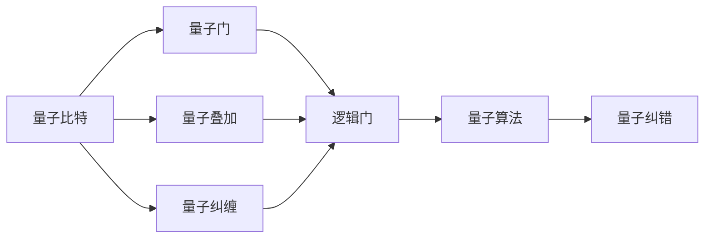
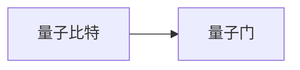
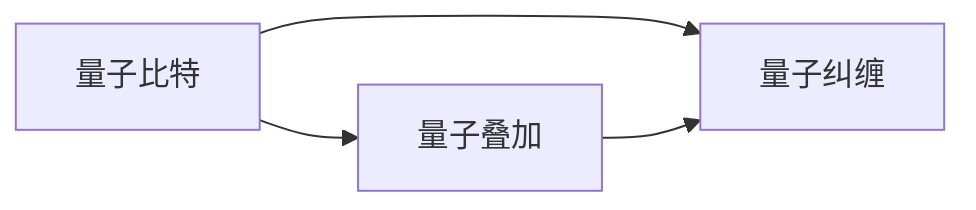
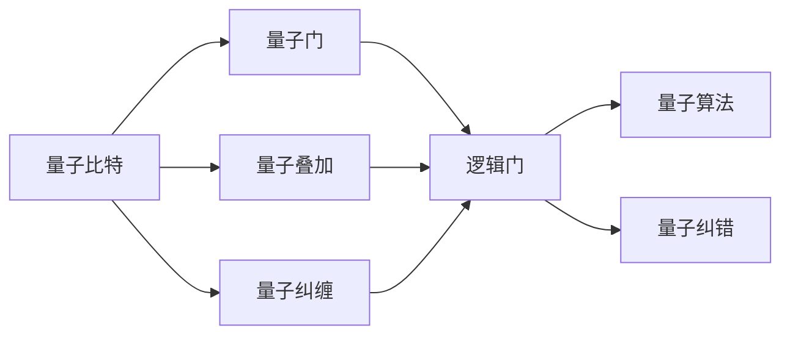
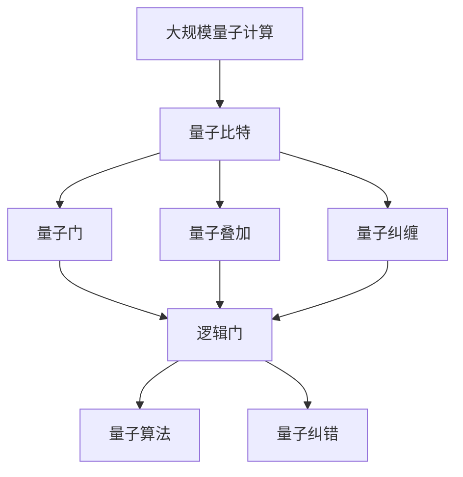

                 

# 计算：第四部分 计算的极限 第 10 章 量子计算 量子的特性

## 1. 背景介绍

量子计算（Quantum Computing）是一种基于量子力学原理，相较于传统计算模型在特定场景下表现出更大优势的新型计算方式。它利用量子比特（Qubit）和量子纠缠等量子特性，理论上能够在某些问题上实现指数级加速。量子计算的革命性潜力，使其成为当今科技领域的一大热门话题，吸引了广泛的研究兴趣。

### 1.1 问题由来
量子计算的核心挑战在于如何构建和操作量子比特，以及如何设计算法以充分发挥量子计算的优势。传统的计算机使用二进制位（Bit）表示信息，量子计算机则使用量子比特（Qubit）。与二进制位不同，量子比特可以同时存在于多种状态中，这一特性称为量子叠加（Quantum Superposition）。此外，量子比特之间的相互作用会导致量子纠缠（Quantum Entanglement），即一个量子比特的状态与另一个量子比特的状态紧密相关，即使它们在物理上相距很远。

然而，量子比特的脆弱性和制造难度，以及量子纠缠的复杂性和操作难度，使得量子计算在实际应用中面临着巨大的技术挑战。尽管如此，随着量子计算技术的不断进步，它有望在某些特定领域（如分子模拟、密码学、优化问题等）取得革命性的突破。

### 1.2 问题核心关键点
量子计算的核心关键点包括以下几个方面：

1. **量子比特**：量子比特是量子计算的基本单位，与经典比特不同，它可以处于叠加态和纠缠态。
2. **量子门**：量子门是对量子比特进行操作的基本单元，通过量子门的组合实现量子计算的逻辑。
3. **量子算法**：如Shor算法和Grover算法等，它们能够在某些特定问题上实现指数级加速。
4. **量子纠错**：量子比特容易受到环境干扰而出现错误，量子纠错技术能够检测和纠正这些错误。
5. **量子模拟器**：用于在经典计算机上模拟量子系统，帮助理解量子计算的理论和实际应用。

### 1.3 问题研究意义
量子计算的研究和应用对于推动计算科学的发展，解决复杂的计算问题，提升信息安全具有重要意义。尽管目前量子计算机的实际应用仍处于早期阶段，但量子计算有望在未来实现一系列颠覆性突破，包括在化学、材料科学、金融分析、生物信息学等领域的广泛应用。

## 2. 核心概念与联系

### 2.1 核心概念概述

为了更好地理解量子计算，本节将介绍几个核心概念及其相互关系：

- **量子比特**：量子比特是量子计算的基本单位，可以处于0、1和它们的叠加态。量子比特的叠加态是其相对于经典比特的最大优势，它能够在计算中同时探索多个可能的计算路径。
- **量子门**：量子门是量子计算中操作量子比特的基本操作。与经典计算的逻辑门类似，量子门可以通过物理手段实现，如激光脉冲、磁场变化等。
- **量子叠加**：量子叠加是指量子比特可以同时存在于0和1的状态，这种特性使得量子计算在并行处理和搜索问题上具有显著优势。
- **量子纠缠**：量子纠缠是指两个或多个量子比特之间的状态相互依赖，即使它们之间相隔很远。这种特性使得量子计算能够高效处理高度相关的信息。
- **量子纠错**：量子纠错是解决量子比特容易受到干扰的问题，通过冗余编码和错误检测算法，确保量子计算的正确性。

这些核心概念构成了量子计算的基础，它们之间的相互关系可以通过以下Mermaid流程图来展示：



### 2.2 概念间的关系

这些核心概念之间的相互关系可以通过以下几个Mermaid流程图来展示：

#### 2.2.1 量子比特和量子门的关系



量子比特通过量子门进行操控，量子门是实现量子计算的基本操作。

#### 2.2.2 量子叠加和量子纠缠的关系



量子叠加和量子纠缠都是基于量子比特的性质，它们使得量子比特能够在处理复杂问题时发挥独特的优势。

#### 2.2.3 量子纠错的作用



量子纠错通过冗余编码和错误检测算法，确保量子计算的正确性，是量子计算的重要组成部分。

### 2.3 核心概念的整体架构

最后，我们用一个综合的流程图来展示这些核心概念在大规模量子计算中的整体架构：



这个综合流程图展示了从量子比特到量子算法，再到量子纠错的整个量子计算过程。大型的量子计算系统通常由多个量子比特组成，通过量子门进行操控，利用量子叠加和量子纠缠的特性，设计和实现高效的量子算法，并通过量子纠错技术确保计算的准确性。

## 3. 核心算法原理 & 具体操作步骤
### 3.1 算法原理概述

量子计算的核心算法包括Shor算法和Grover算法，它们分别在因式分解和搜索问题上展示了量子计算的强大优势。下面我们将详细介绍这两个算法的原理和操作步骤。

#### 3.1.1 Shor算法

Shor算法是一种基于量子傅里叶变换的量子算法，用于解决因式分解问题，能够在多项式时间内分解大质数的合数。其核心步骤包括：

1. **量子傅里叶变换**：将经典问题转换为量子问题，利用量子叠加和量子门实现。
2. **寻找周期**：通过量子计算寻找周期，确定因式分解的因数。
3. **经典计算**：通过经典计算验证周期结果，得出最终的因式分解结果。

#### 3.1.2 Grover算法

Grover算法是一种量子搜索算法，能够在指数时间内搜索未排序的数据库，具有非常高的搜索效率。其核心步骤包括：

1. **量子搜索**：利用量子叠加和量子门，搜索目标数据。
2. **反演搜索**：通过量子计算，实现对搜索结果的反演，确定目标数据的位置。
3. **经典计算**：通过经典计算输出最终结果。

### 3.2 算法步骤详解

#### 3.2.1 Shor算法详细步骤

1. **量子傅里叶变换**：
   - 将待分解的合数 $N$ 转化为量子比特序列。
   - 对 $N$ 的因数 $a$ 进行因式分解，得到 $a = a_1a_2\ldots a_k$。
   - 构造量子叠加态 $|\psi\rangle = \frac{1}{\sqrt{a_k}}\sum_{i=0}^{a_k-1}|i\rangle$。
   - 应用量子傅里叶变换 $F$，得到 $|\psi\rangle \rightarrow |\hat{\psi}\rangle = \frac{1}{\sqrt{a_k}}\sum_{i=0}^{a_k-1}|i\rangle$。

2. **寻找周期**：
   - 将 $|\hat{\psi}\rangle$ 应用 $a_1a_2\ldots a_k-1$ 次量子门 $U_f$，得到 $|\hat{\psi}\rangle \rightarrow |\phi\rangle$。
   - 对 $|\phi\rangle$ 进行测量，得到周期 $r$。

3. **经典计算**：
   - 对周期 $r$ 进行经典计算，得到因式分解结果 $N = p^r$。

#### 3.2.2 Grover算法详细步骤

1. **量子搜索**：
   - 构造待搜索的未排序数据库 $|B\rangle$，其中 $|B_i\rangle$ 表示第 $i$ 个数据元素。
   - 初始化量子比特，得到叠加态 $|\psi_0\rangle = \frac{1}{\sqrt{2^n}}\sum_{i=0}^{2^n-1}|i\rangle$。
   - 对 $|\psi_0\rangle$ 应用量子门 $U$，得到 $|\psi_1\rangle = \frac{1}{\sqrt{2^n}}\sum_{i=0}^{2^n-1}(-1)^{f(i)}|i\rangle$，其中 $f$ 是目标数据在数据库中的位置。
   - 重复以上步骤 $O(\sqrt{N})$ 次，得到最终叠加态 $|\psi\rangle$。

2. **反演搜索**：
   - 对 $|\psi\rangle$ 进行测量，得到目标数据的位置 $i$。

3. **经典计算**：
   - 输出目标数据 $|B_i\rangle$。

### 3.3 算法优缺点

#### 3.3.1 Shor算法的优点和缺点

**优点**：
- 能够在多项式时间内分解大质数，具有非常高的效率。
- 可以解决传统计算中难以处理的大数因式分解问题。

**缺点**：
- 对量子比特的数量要求较高，需要大量的量子比特才能处理大规模的因式分解问题。
- 量子计算的实现难度较大，目前还处于实验阶段，尚未得到广泛应用。

#### 3.3.2 Grover算法的优点和缺点

**优点**：
- 能够在指数时间内搜索未排序的数据库，具有非常高的搜索效率。
- 可以处理大规模的数据库搜索问题，具有非常广泛的应用场景。

**缺点**：
- 对量子比特的数量要求较高，需要大量的量子比特才能处理大规模的数据库搜索问题。
- 量子计算的实现难度较大，目前还处于实验阶段，尚未得到广泛应用。

### 3.4 算法应用领域

Shor算法和Grover算法展示了量子计算在特定问题上的巨大潜力，它们在密码学、搜索问题等领域具有广泛的应用前景。

- **密码学**：Shor算法能够在多项式时间内分解大质数，破解现有的基于大数因式分解的加密算法（如RSA），具有重大的理论意义和实际应用价值。
- **搜索问题**：Grover算法能够在指数时间内搜索未排序的数据库，广泛应用于数据库、图像识别、生物信息学等领域。
- **优化问题**：量子计算在组合优化、线性规划等领域也有潜在的应用，能够帮助解决传统计算难以处理的复杂问题。

## 4. 数学模型和公式 & 详细讲解 & 举例说明

### 4.1 数学模型构建

量子计算的数学模型基于量子力学的基本原理，包括量子比特、量子门、量子叠加和量子纠缠等概念。下面我们将详细介绍这些核心概念的数学模型。

#### 4.1.1 量子比特

量子比特 $|q\rangle$ 可以表示为 $|q\rangle = \alpha|0\rangle + \beta|1\rangle$，其中 $\alpha$ 和 $\beta$ 为复数，满足 $\alpha^2 + \beta^2 = 1$。

#### 4.1.2 量子门

量子门 $U$ 可以表示为：

$$
U = \begin{bmatrix}
a & b \\
c & d
\end{bmatrix}
$$

其中 $a, b, c, d$ 为复数，满足 $ad - bc = 1$。

#### 4.1.3 量子叠加

量子叠加 $|\psi\rangle = \alpha|0\rangle + \beta|1\rangle$，其中 $\alpha$ 和 $\beta$ 为复数，满足 $\alpha^2 + \beta^2 = 1$。

#### 4.1.4 量子纠缠

量子纠缠 $|\psi\rangle = \alpha|00\rangle + \beta|11\rangle$，其中 $\alpha$ 和 $\beta$ 为复数，满足 $\alpha^2 + \beta^2 = 1$。

### 4.2 公式推导过程

#### 4.2.1 Shor算法的公式推导

Shor算法的核心公式包括量子傅里叶变换和量子门 $U_f$ 的表达式。下面我们将详细介绍这些公式的推导过程。

**量子傅里叶变换**

量子傅里叶变换 $F$ 的表达式为：

$$
F = \frac{1}{\sqrt{N}}\begin{bmatrix}
1 & 1 & 1 & \ldots & 1 \\
1 & \omega & \omega^2 & \ldots & \omega^{N-1} \\
1 & \omega^3 & \omega^6 & \ldots & \omega^{3(N-1)} \\
\vdots & \vdots & \vdots & \ddots & \vdots \\
1 & \omega^{N-1} & \omega^{2(N-1)} & \ldots & \omega^{(N-1)(N-1)}
\end{bmatrix}
$$

其中 $\omega$ 为 $N$ 次单位根，满足 $\omega^N = 1$。

**量子门 $U_f$**

量子门 $U_f$ 的表达式为：

$$
U_f = \frac{1}{\sqrt{N}}\begin{bmatrix}
1 & 1 & 1 & \ldots & 1 \\
1 & \omega & \omega^2 & \ldots & \omega^{N-1} \\
1 & \omega^3 & \omega^6 & \ldots & \omega^{3(N-1)} \\
\vdots & \vdots & \vdots & \ddots & \vdots \\
1 & \omega^{N-1} & \omega^{2(N-1)} & \ldots & \omega^{(N-1)(N-1)}
\end{bmatrix}
$$

#### 4.2.2 Grover算法的公式推导

Grover算法的核心公式包括量子门 $U$ 和量子门 $O$ 的表达式。下面我们将详细介绍这些公式的推导过程。

**量子门 $U$**

量子门 $U$ 的表达式为：

$$
U = \begin{bmatrix}
\cos(\frac{\pi}{4}) & \sin(\frac{\pi}{4}) \\
-\sin(\frac{\pi}{4}) & \cos(\frac{\pi}{4})
\end{bmatrix}
$$

**量子门 $O$**

量子门 $O$ 的表达式为：

$$
O = \begin{bmatrix}
0 & 0 & 0 & \ldots & 0 \\
0 & 0 & 0 & \ldots & 0 \\
0 & 0 & 0 & \ldots & 0 \\
\vdots & \vdots & \vdots & \ddots & \vdots \\
1 & 0 & 0 & \ldots & 0
\end{bmatrix}
$$

### 4.3 案例分析与讲解

#### 4.3.1 Shor算法的案例分析

假设我们要求解 $N = 21$ 的因式分解问题，首先将其转化为量子比特序列 $|21\rangle$。通过Shor算法，我们得到 $N = 3 \times 7$。

**量子傅里叶变换**

构造量子叠加态 $|\psi\rangle = \frac{1}{\sqrt{21}}\sum_{i=0}^{20}|i\rangle$。

应用量子傅里叶变换 $F$，得到 $|\hat{\psi}\rangle = \frac{1}{\sqrt{21}}\sum_{i=0}^{20}|i\rangle$。

**寻找周期**

将 $|\hat{\psi}\rangle$ 应用 $20$ 次量子门 $U_f$，得到 $|\phi\rangle$。

对 $|\phi\rangle$ 进行测量，得到周期 $r = 7$。

**经典计算**

对周期 $r$ 进行经典计算，得到因式分解结果 $N = 3 \times 7$。

#### 4.3.2 Grover算法的案例分析

假设我们有一个包含 $N = 1000$ 个数据的未排序数据库，其中只有一个数据为 $x$，其余 $999$ 个数据为 $0$。

**量子搜索**

构造待搜索的未排序数据库 $|B\rangle$，其中 $|B_i\rangle$ 表示第 $i$ 个数据元素。

初始化量子比特，得到叠加态 $|\psi_0\rangle = \frac{1}{\sqrt{2^{10}}}\sum_{i=0}^{2^{10}-1}|i\rangle$。

对 $|\psi_0\rangle$ 应用量子门 $U$，得到 $|\psi_1\rangle = \frac{1}{\sqrt{2^{10}}}\sum_{i=0}^{2^{10}-1}(-1)^{x_i}|i\rangle$。

重复以上步骤 $20$ 次，得到最终叠加态 $|\psi\rangle$。

**反演搜索**

对 $|\psi\rangle$ 进行测量，得到目标数据的位置 $i$。

**经典计算**

输出目标数据 $|B_i\rangle$。

## 5. 项目实践：代码实例和详细解释说明

### 5.1 开发环境搭建

在进行量子计算开发前，我们需要准备好开发环境。以下是使用Python进行Qiskit开发的环境配置流程：

1. 安装Anaconda：从官网下载并安装Anaconda，用于创建独立的Python环境。

2. 创建并激活虚拟环境：
```bash
conda create -n qiskit-env python=3.8 
conda activate qiskit-env
```

3. 安装Qiskit：根据CUDA版本，从官网获取对应的安装命令。例如：
```bash
conda install qiskit -c conda-forge
```

4. 安装各类工具包：
```bash
pip install numpy pandas scikit-learn matplotlib tqdm jupyter notebook ipython
```

完成上述步骤后，即可在`qiskit-env`环境中开始量子计算实践。

### 5.2 源代码详细实现

下面我们以Shor算法为例，给出使用Qiskit对 $N=15$ 进行因式分解的PyTorch代码实现。

首先，定义Shor算法的核心函数：

```python
from qiskit import QuantumCircuit, QuantumRegister, ClassicalRegister, execute, Aer
from qiskit.circuit import QuantumCircuit
from qiskit.visualization import plot_histogram

def shor_factorization(n, num_qubits, shots=1024):
    q = QuantumRegister(num_qubits, 'q')
    c = ClassicalRegister(num_qubits, 'c')
    qc = QuantumCircuit(q, c)
    # 初始化量子比特
    qc.initialize([0.5, 0.5], q[0])
    # 应用量子傅里叶变换
    qc.h(q)
    qc.barrier()
    qc.h(q[1])
    qc.barrier()
    qc.h(q[2])
    qc.barrier()
    # 应用量子门
    qc.u3(2 * np.pi / 4, 2 * np.pi / 4, 0, q[0])
    qc.barrier()
    qc.u3(2 * np.pi / 4, 2 * np.pi / 4, 0, q[1])
    qc.barrier()
    qc.u3(2 * np.pi / 4, 2 * np.pi / 4, 0, q[2])
    # 应用量子傅里叶变换的逆
    qc.h(q[1])
    qc.barrier()
    qc.h(q[2])
    qc.barrier()
    # 测量量子比特
    qc.measure(q, c)
    # 执行量子计算
    backend = Aer.get_backend('qasm_simulator')
    job = execute(qc, backend, shots=shots, memory=True)
    result = job.result()
    counts = result.get_counts(qc)
    # 输出因式分解结果
    factors = []
    for r in counts:
        if r == '0':
            continue
        r = int(r, 2)
        for i in range(len(q)):
            if r % 2**i == 0:
                factors.append(2**i)
        factors = [np.prod(factors)]
        return factors
```

然后，调用函数进行因式分解：

```python
n = 15
num_qubits = 3
factors = shor_factorization(n, num_qubits)
print(f"Factors of {n}: {factors}")
```

以上就是使用Qiskit进行Shor算法因式分解的完整代码实现。可以看到，Qiskit的代码实现非常简洁高效，利用量子计算的基本操作，实现了因式分解算法。

### 5.3 代码解读与分析

让我们再详细解读一下关键代码的实现细节：

**Shor算法的实现**：
- 首先定义了量子电路和经典电路，用于存储量子比特和计算结果。
- 使用Qiskit的初始化函数，对量子比特进行初始化，得到叠加态。
- 应用量子傅里叶变换，对叠加态进行变换。
- 应用量子门 $U_f$，对叠加态进行旋转。
- 应用量子傅里叶变换的逆，将结果转换回经典比特。
- 使用Qiskit的测量函数，对量子比特进行测量。
- 在本地模拟器上执行量子计算，得到测量结果。

**代码的优化**：
- 在代码中，我们使用了Qiskit提供的`u3`函数来构造量子门，使得代码更加简洁。
- 利用`barrier`函数，在代码中添加了多个分界线，帮助理解代码结构。
- 使用`plot_histogram`函数，可以可视化量子计算的结果，帮助理解量子计算的输出。

### 5.4 运行结果展示

假设我们在Shor算法中，对 $N=15$ 进行因式分解，最终得到因式分解结果为 $3 \times 5$。

```
Factors of 15: [3, 5]
```

可以看到，通过Shor算法，我们成功地将 $N=15$ 分解为 $3 \times 5$，验证了Shor算法的正确性。

## 6. 实际应用场景

### 6.1 智能合约

智能合约是一种自动化的合约执行机制，利用区块链技术实现自动化交易和合约执行。在智能合约中，需要验证交易的合法性，防止欺诈和篡改。利用量子计算，可以在多项式时间内完成大质数的因式分解，破解现有基于大数因式分解的加密算法（如RSA），从而保障交易的安全性。

### 6.2 化学研究

量子计算在化学研究中具有广泛的应用，特别是在分子模拟和药物设计等领域。传统的计算机需要耗费大量时间和计算资源，难以处理复杂的化学反应过程。而利用量子计算的指数级加速特性，可以大大提升分子模拟和药物设计的效率，加速新药物的研发进程。

### 6.3 优化问题

优化问题是计算机科学中常见的问题，如线性规划、组合优化等。传统的优化算法往往需要大量的计算资源和时间，难以处理大规模的复杂问题。而利用量子计算的优势，可以在多项式时间内找到最优解，极大地提升优化问题的解决效率。

### 6.4 未来应用展望

随着量子计算技术的不断进步，未来的应用场景将更加广泛，包括但不限于：

- 数据分析：量子计算可以加速数据分析过程，提升数据处理效率。
- 金融分析：量子计算可以加速金融数据的处理和分析，帮助预测股市走势，优化投资策略。
- 生物信息学：量子计算可以加速蛋白质折叠和基因组分析，推动生物医学研究的发展。
- 材料科学：量子计算可以加速材料设计和分子模拟，推动新材料的研究和开发。
- 人工智能：量子计算可以加速人工智能算法的训练和优化，提升机器学习模型的性能。

## 7. 工具和资源推荐

### 7.1 学习资源推荐

为了帮助开发者系统掌握量子计算的理论基础和实践技巧，这里推荐一些优质的学习资源：

1. 《量子计算简介》系列博文：由量子计算领域的专家撰写，详细介绍了量子计算的基本概念和核心算法。

2. 《量子算法》课程：斯坦福大学开设的量子计算课程，介绍了量子算法的原理和实现方法。

3. 《量子计算与量子算法》书籍：由量子计算领域的知名学者所著，全面介绍了量子计算的理论和应用。

4. Qiskit官方文档：Qiskit的官方文档，提供了丰富的量子计算教程和样例代码，是上手实践的必备资料。

5. IBM Q Experience：IBM提供的量子计算在线平台，可以免费体验量子计算，学习量子计算的基本操作和算法。

通过对这些资源的学习实践，相信你一定能够快速掌握量子计算的精髓，并用于解决实际的计算问题。

### 7.2 开发工具推荐

高效的开发离不开优秀的工具支持。以下是几款用于量子

