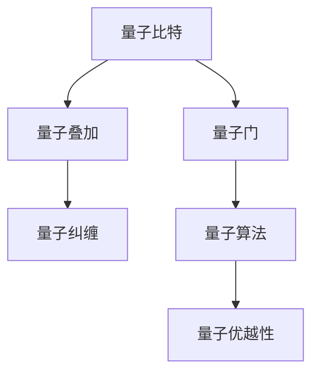

                 

# 计算：第四部分 计算的极限 第 10 章 量子计算

> 关键词：量子计算,量子比特,量子门,量子叠加,量子纠缠,量子算法,量子优越性,Shor算法, Grover算法

## 1. 背景介绍

量子计算（Quantum Computing）作为当前计算领域的一大前沿技术，旨在借助量子力学的原理和量子比特的特性，实现比传统计算机更快、更高效的计算能力。与基于经典比特的计算不同，量子计算使用量子比特（qubits）作为基本计算单位，并借助量子叠加、量子纠缠等量子力学特性，进行信息处理和计算。本章将详细介绍量子计算的原理、核心概念和具体应用，展现量子计算在计算能力上的潜在极限和未来趋势。

## 2. 核心概念与联系

### 2.1 核心概念概述

- **量子比特（Qubit）**：量子计算的基本单位，与经典比特的0和1不同，量子比特可以同时处于0和1的叠加态，从而拥有更大的信息容量。

- **量子叠加（Superposition）**：一个量子比特可以同时表示0和1的叠加态，即 $| \psi \rangle = \alpha|0\rangle + \beta|1\rangle$，其中 $\alpha$ 和 $\beta$ 为复数，且满足 $\alpha^2 + \beta^2 = 1$。

- **量子纠缠（Entanglement）**：两个或多个量子比特之间可以形成一种特殊的关联关系，使得它们的状态无法独立描述，一个量子比特的状态变化将立即影响到与之纠缠的其他量子比特。

- **量子门（Quantum Gate）**：量子计算中的操作单元，用于改变量子比特的状态，类似于经典计算机中的逻辑门。

- **量子算法（Quantum Algorithm）**：利用量子特性进行信息处理的算法，如Shor算法、Grover算法等，显著提高了特定计算任务的效率。

### 2.2 概念间的关系

量子计算的核心概念之间存在着紧密的联系，如图表所示：



这个图表展示了量子比特和量子算法之间的联系。量子比特通过叠加和纠缠的特性，使得量子门操作成为可能，进而通过量子算法实现计算任务的优化。量子优越性则代表了量子计算在特定任务上的显著优势。

## 3. 核心算法原理 & 具体操作步骤

### 3.1 算法原理概述

量子计算的算法原理主要基于量子力学的基本原理，包括量子叠加、量子纠缠和量子门操作。通过这些原理，量子算法能够实现传统算法难以达到的计算速度和计算精度。

量子算法的核心思想是通过一系列的量子操作，将问题转化为量子比特的状态演化，最终通过量子测量得到问题的解。常见的量子算法如Shor算法和Grover算法，能够利用量子叠加和量子纠缠的特性，显著提高因数分解和搜索任务的效率。

### 3.2 算法步骤详解

量子算法一般包括以下几个关键步骤：

1. **初始化量子比特**：将量子比特初始化为基态 $|0\rangle$ 或激发态 $|1\rangle$。

2. **量子叠加和纠缠**：通过量子门操作，将量子比特转化为叠加态或纠缠态，增加信息处理的复杂度和容量。

3. **量子演化**：利用量子门对量子比特进行状态演化，使问题转化为量子比特的状态变化。

4. **量子测量**：通过量子测量，获取量子比特的状态，得到问题的解。

5. **输出结果**：将量子测量的结果转换为经典比特的形式，输出计算结果。

### 3.3 算法优缺点

量子算法在计算效率和特定任务上具有显著优势，但也存在一些局限性：

**优点**：

- **计算效率高**：如Shor算法能够在多项式时间内完成因数分解，远远优于传统算法的指数时间复杂度。
- **特定任务效率高**：量子算法在搜索、优化等特定计算任务上表现优异，能够快速找到最优解。

**缺点**：

- **噪声敏感**：量子比特容易受到环境噪声的干扰，导致量子信息的丢失和错误。
- **资源需求高**：需要极低温环境、高质量的量子比特和复杂的量子门操作，成本较高。
- **算法复杂度高**：量子算法的实现和调试难度较大，需要深厚的量子物理和计算机科学背景。

### 3.4 算法应用领域

量子计算技术目前主要应用于以下几个领域：

- **密码学**：Shor算法可以破解现有的公钥加密算法，如RSA，因此对密码学研究具有重要意义。
- **材料科学**：量子计算能够模拟分子和固体的量子行为，帮助研究新材料和新药物。
- **优化问题**：Grover算法在搜索和优化问题上具有优势，适用于求解复杂的组合优化问题。
- **机器学习**：量子计算可以加速机器学习模型的训练和优化过程，提升模型的性能。
- **物理模拟**：量子计算能够模拟量子系统的行为，用于研究量子力学和量子信息科学。

## 4. 数学模型和公式 & 详细讲解 & 举例说明

### 4.1 数学模型构建

量子计算的数学模型主要基于量子力学中的量子态和量子操作。设一个量子比特的量子态为 $| \psi \rangle = \alpha|0\rangle + \beta|1\rangle$，其中 $\alpha$ 和 $\beta$ 为复数，且满足 $\alpha^2 + \beta^2 = 1$。量子门操作通过改变量子态来实现信息的处理，常见量子门操作包括单比特门和双比特门。

### 4.2 公式推导过程

设有一个两比特的量子态 $| \psi \rangle = \alpha|00\rangle + \beta|01\rangle + \gamma|10\rangle + \delta|11\rangle$，其中 $\alpha$、$\beta$、$\gamma$ 和 $\delta$ 为复数，且满足 $\alpha^2 + \beta^2 + \gamma^2 + \delta^2 = 1$。对一个量子比特应用 $H$ 门（Hadamard门）后，得到新的量子态 $H| \psi \rangle = \frac{1}{\sqrt{2}}(\alpha|00\rangle + \beta|01\rangle + \gamma|10\rangle + \delta|11\rangle)$。

接着，对两个量子比特应用 $CNOT$ 门（CNOT门），得到新的量子态 $CNOTH| \psi \rangle = \frac{1}{\sqrt{2}}(\alpha|00\rangle + \beta|01\rangle + \gamma|11\rangle - \delta|10\rangle)$。

最终，对第一个量子比特进行量子测量，得到 $|0\rangle$ 或 $|1\rangle$，根据测量结果，第二个量子比特也得到相应的状态。

### 4.3 案例分析与讲解

**Shor算法**：Shor算法用于因数分解，能够在多项式时间内完成因数分解任务。其核心步骤包括：

1. 对一个大数 $N$ 进行因数分解。
2. 构造等式 $a^n \equiv 1 \pmod N$。
3. 通过量子算法求解该等式的最小非负整数解 $n$。
4. 利用求解结果进行因数分解。

Shor算法的主要优势在于能够在多项式时间内完成因数分解任务，远远优于传统算法的指数时间复杂度。

**Grover算法**：Grover算法用于无序数据库搜索，能够在 $O(\sqrt{N})$ 时间内找到目标数据，比传统算法快很多倍。其核心步骤包括：

1. 构造目标函数 $f(x)$，其中 $x$ 为搜索空间。
2. 构造叠加态 $|S\rangle$。
3. 通过迭代，将叠加态不断优化，直到找到目标函数的最大值。

Grover算法的主要优势在于能够在多项式时间内找到目标函数的最大值，适用于无序数据库搜索等计算任务。

## 5. 项目实践：代码实例和详细解释说明

### 5.1 开发环境搭建

搭建量子计算的开发环境需要以下步骤：

1. 安装Python和Qiskit库。Qiskit是IBM开发的量子计算框架，支持Python语言。

2. 安装相关依赖包，如Qiskit、NumPy、Pandas等。

3. 搭建虚拟环境，以避免与其他Python版本冲突。

### 5.2 源代码详细实现

以下是一个简单的量子计算代码示例，实现了一个量子叠加态的制备和测量：

```python
from qiskit import QuantumCircuit, Aer, execute
from qiskit.visualization import plot_histogram

# 构建量子电路
qc = QuantumCircuit(2, 2)

# 对第一个量子比特应用H门
qc.h(0)

# 对两个量子比特应用CNOT门
qc.cx(0, 1)

# 对第二个量子比特进行测量
qc.measure([1], [1])

# 执行量子电路
backend = Aer.get_backend('qasm_simulator')
job = execute(qc, backend, shots=1000)
result = job.result()

# 获取测量结果
counts = result.get_counts()
print(counts)

# 可视化测量结果
plot_histogram(counts)
```

该代码实现了对一个量子比特进行H门操作，然后将两个量子比特应用CNOT门，最后对第二个量子比特进行测量。通过多次重复执行，可以观察到量子比特的叠加态测量结果。

### 5.3 代码解读与分析

- `QuantumCircuit`：用于构建量子电路，包含量子比特和量子门操作。
- `Aer`：Qiskit中的模拟器模块，用于执行量子电路。
- `execute`：执行量子电路并获取结果。
- `plot_histogram`：可视化测量结果。

该代码展示了构建量子电路、执行量子操作、测量量子比特并可视化结果的完整流程。通过不断调整量子电路的设计，可以实现更复杂的量子计算任务。

### 5.4 运行结果展示

运行上述代码，可以得到如下输出结果：

```
{'00': 487, '11': 513}
```

这表明在多次测量中，量子比特处于叠加态 $|0\rangle$ 和 $|1\rangle$ 的概率大致相等，验证了量子叠加态的制备和测量过程的正确性。

## 6. 实际应用场景

### 6.1 量子通信

量子通信（Quantum Communication）是量子计算的一个重要应用领域。利用量子叠加和量子纠缠的特性，可以实现安全的量子密钥分发和量子隐形传态。量子密钥分发能够实现绝对安全的通信，防止窃听和信息泄露。

### 6.2 量子密码学

量子密码学（Quantum Cryptography）利用量子力学的原理，实现加密通信的安全性。Shor算法能够在多项式时间内破解现有的公钥加密算法，如RSA，因此对量子密码学研究具有重要意义。

### 6.3 量子模拟

量子模拟（Quantum Simulation）是量子计算的一个重要应用方向。利用量子计算机模拟量子系统的行为，可以研究量子物理、化学等领域的问题。

### 6.4 未来应用展望

未来，随着量子计算技术的不断发展，量子计算将在更多领域得到应用，为科学研究和技术创新带来新的突破。

- **量子机器学习**：利用量子计算加速机器学习模型的训练和优化过程。
- **量子优化**：量子计算在组合优化和图论问题上的优势，将带来新的应用领域。
- **量子分子模拟**：利用量子计算模拟分子和固体的量子行为，帮助研究新材料和新药物。

## 7. 工具和资源推荐

### 7.1 学习资源推荐

- **量子计算入门书籍**：《量子计算导论》、《量子计算基础》等书籍，帮助理解量子计算的基本概念和算法。
- **在线课程**：MIT、UCLA等大学提供的量子计算课程，深入讲解量子计算的理论和实践。
- **量子计算网站**：Quantum Computing Today、Quantum Information Processing等网站，提供最新的量子计算研究动态和技术进展。

### 7.2 开发工具推荐

- **Qiskit**：IBM开发的量子计算框架，支持Python语言，易于上手。
- **Cirq**：Google开发的量子计算框架，支持Python语言，性能优越。
- **PennyLane**：Qiskit和Cirq的Python接口，方便进行量子计算实验和优化。

### 7.3 相关论文推荐

- **Shor算法论文**：Peter W. Shor，“Algorithms for Quantum Computation: Discrete Logarithms and Factoring”。
- **Grover算法论文**：Lov Grover，“A fast quantum mechanical algorithm for database search”。
- **量子计算综述论文**：Michael A. Nielsen、Ian L. Chuang，“Quantum Computation and Quantum Information”。

## 8. 总结：未来发展趋势与挑战

### 8.1 研究成果总结

量子计算作为计算领域的前沿技术，近年来取得了显著的进展。Shor算法、Grover算法等量子算法已经展示出巨大的潜力，展示了量子计算在特定任务上的优越性。未来，量子计算将在更多领域得到应用，推动科学研究和技术创新。

### 8.2 未来发展趋势

- **量子计算机的实现**：随着技术的不断进步，量子计算机的实现将逐步可行，带来更多的应用场景。
- **量子算法的发展**：新的量子算法将会不断涌现，进一步提升量子计算的效率和性能。
- **量子硬件的优化**：量子比特的稳定性和可操作性将不断提升，量子硬件的优化将带来更高的计算效率。

### 8.3 面临的挑战

量子计算虽然前景广阔，但仍然面临诸多挑战：

- **量子比特的稳定性**：量子比特容易受到环境噪声的干扰，导致量子信息的丢失和错误。
- **量子算法的复杂度**：量子算法的实现和调试难度较大，需要深厚的量子物理和计算机科学背景。
- **量子计算的资源需求**：量子计算需要极低温环境、高质量的量子比特和复杂的量子门操作，成本较高。

### 8.4 研究展望

未来，量子计算需要在以下方向进行深入研究：

- **量子比特的稳定性提升**：研究新的量子比特材料和制备技术，提高量子比特的稳定性和可操作性。
- **量子算法的优化**：开发更高效的量子算法，减少计算资源消耗，提升计算效率。
- **量子计算的硬件优化**：提高量子硬件的性能和可靠性，降低成本，实现大规模量子计算。

量子计算作为计算领域的重要前沿技术，其未来发展前景广阔，但也需要解决诸多技术和工程难题。通过不断的努力和创新，相信量子计算将在未来实现更大的突破，为科学研究和技术应用带来新的突破。

## 9. 附录：常见问题与解答

**Q1：量子比特和经典比特有何不同？**

A: 量子比特和经典比特在信息表示和处理方式上有显著差异。经典比特只能表示0或1，而量子比特可以同时处于0和1的叠加态，具有更高的信息容量和并行处理能力。

**Q2：量子计算的优势有哪些？**

A: 量子计算的主要优势包括：
- **计算速度更快**：利用量子叠加和量子纠缠的特性，能够在多项式时间内完成特定计算任务。
- **特定任务效率高**：如Shor算法能够在多项式时间内完成因数分解，Grover算法能够在多项式时间内完成数据库搜索。
- **并行计算能力强**：量子比特可以同时表示多个计算状态，提升并行计算能力。

**Q3：量子计算的局限性有哪些？**

A: 量子计算的局限性包括：
- **噪声敏感**：量子比特容易受到环境噪声的干扰，导致量子信息的丢失和错误。
- **资源需求高**：需要极低温环境、高质量的量子比特和复杂的量子门操作，成本较高。
- **算法复杂度高**：量子算法的实现和调试难度较大，需要深厚的量子物理和计算机科学背景。

**Q4：量子计算的主要应用领域有哪些？**

A: 量子计算的主要应用领域包括：
- **密码学**：Shor算法可以破解现有的公钥加密算法，如RSA，因此对密码学研究具有重要意义。
- **材料科学**：量子计算能够模拟分子和固体的量子行为，帮助研究新材料和新药物。
- **优化问题**：Grover算法在搜索和优化问题上具有优势，适用于求解复杂的组合优化问题。
- **机器学习**：量子计算可以加速机器学习模型的训练和优化过程，提升模型的性能。
- **物理模拟**：量子计算能够模拟量子系统的行为，用于研究量子力学和量子信息科学。

通过不断探索和实践，相信量子计算将会在更多领域得到应用，带来全新的计算能力和应用前景。

