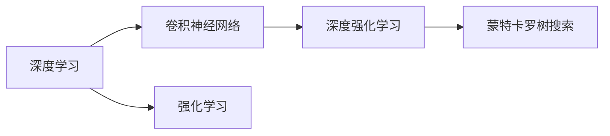

                 

# 计算：第四部分 计算的极限 第 12 章 机器能思考吗 AlphaGo 与李世石

> 关键词：机器学习, 深度学习, AlphaGo, 李世石, 计算极限

## 1. 背景介绍

### 1.1 问题由来

人工智能（AI）领域的一个重要研究方向是探究机器是否具备思考能力，能否理解人类的思维方式。近年来，人工智能技术在多个领域取得了显著进展，尤其是深度学习（Deep Learning）算法，已经在图像识别、语音识别、自然语言处理（NLP）等方面达到了甚至超越人类水平的能力。

特别是AlphaGo在围棋领域的大胜，引起了广泛关注。2016年，DeepMind团队开发的AlphaGo与世界围棋冠军李世石进行了五局比赛，最终AlphaGo以4胜1负的成绩战胜了李世石，震惊了全球。AlphaGo的成功不仅展示了AI在策略游戏中的强大能力，也引发了关于机器是否能思考、具备人类智慧的深层次讨论。

### 1.2 问题核心关键点

AlphaGo的成功在于其独特的搜索策略和深度强化学习算法，但问题的关键在于机器是否能真正理解游戏规则和策略，具备与人类相媲美的思维能力。AlphaGo通过自我对弈、蒙特卡罗树搜索（Monte Carlo Tree Search）和深度卷积神经网络（CNN）等多层网络结构的学习，展现出超越人类棋手的直觉和预判能力。

具体而言，AlphaGo的核心技术包括：

1. **策略网络**：用于评估当前棋局局势的优劣，预测对手可能的下一步。
2. **价值网络**：通过分析历史对局，预测最终胜利的可能性。
3. **蒙特卡罗树搜索**：用于从当前局面开始，通过模拟对局，搜索最优策略。
4. **神经网络**：利用深度学习技术，对棋局中的模式进行识别和学习。

这些技术的综合应用，使AlphaGo能够超越人类的直觉，在围棋这一复杂游戏中取得胜利。

### 1.3 问题研究意义

AlphaGo的成功不仅展示了AI在特定任务上的突破，也引发了关于机器思维的广泛讨论。研究AlphaGo背后的技术原理，对于理解AI在复杂任务中的表现，以及探讨机器是否具备人类智慧，具有重要意义。

1. **技术突破**：AlphaGo的成功展示了AI在策略游戏中的强大能力，为AI技术的发展提供了新的方向和范例。
2. **理论研究**：通过分析AlphaGo的算法，可以更深入地理解深度学习、强化学习等AI技术的理论基础。
3. **应用拓展**：AlphaGo的成功为AI在更多领域的应用提供了借鉴，如自动驾驶、医疗诊断等。
4. **伦理考量**：AlphaGo的胜利也引发了关于机器与人类关系的思考，如何平衡技术发展与伦理道德问题。

## 2. 核心概念与联系

### 2.1 核心概念概述

为了更好地理解AlphaGo的工作原理，本节将介绍几个关键概念：

- **深度学习**：一种基于多层神经网络的机器学习技术，通过反向传播算法（Backpropagation）进行训练，能够在大量数据上实现高精度预测。
- **蒙特卡罗树搜索**：一种用于解决复杂决策问题的搜索算法，通过模拟对局，逐步逼近最优解。
- **卷积神经网络**：一种专门用于处理图像和视频数据的深度神经网络，能够自动提取特征，识别模式。
- **强化学习**：一种通过试错逐步优化的学习方法，通过奖励机制指导模型学习。
- **深度强化学习**：结合深度学习和强化学习的技术，能够处理更复杂的决策问题。

这些核心概念之间的关系可以通过以下Mermaid流程图来展示：



### 2.2 概念间的关系

这些核心概念之间存在着紧密的联系，共同构成了AlphaGo的工作原理：

1. **深度学习与卷积神经网络**：AlphaGo通过卷积神经网络处理棋盘上的视觉信息，提取棋盘特征。
2. **深度强化学习与蒙特卡罗树搜索**：AlphaGo利用深度强化学习进行自我对弈，蒙特卡罗树搜索用于搜索最优策略。
3. **强化学习与深度强化学习**：AlphaGo通过强化学习不断优化策略，深度强化学习则提供了更强大的学习能力。

这些概念共同构成了AlphaGo的核心算法，使其能够在围棋这一复杂游戏中展现出超越人类的智慧。

## 3. 核心算法原理 & 具体操作步骤

### 3.1 算法原理概述

AlphaGo的核心算法原理可以总结为以下几个关键步骤：

1. **策略网络（Policy Network）**：用于评估当前棋局局势的优劣，预测对手可能的下一步。
2. **价值网络（Value Network）**：通过分析历史对局，预测最终胜利的可能性。
3. **蒙特卡罗树搜索**：用于从当前局面开始，通过模拟对局，搜索最优策略。
4. **神经网络**：利用深度学习技术，对棋局中的模式进行识别和学习。

这些算法的综合应用，使AlphaGo能够超越人类的直觉，在围棋这一复杂游戏中取得胜利。

### 3.2 算法步骤详解

#### 3.2.1 策略网络

AlphaGo的策略网络用于评估当前棋局局势的优劣，预测对手可能的下一步。该网络通过训练数据中的棋局对弈记录，学习对局中的胜率预测。在实际应用中，策略网络输出的概率分布可以指导蒙特卡罗树搜索选择下一步。

#### 3.2.2 价值网络

价值网络通过分析历史对局，预测最终胜利的可能性。网络在训练过程中，学习从棋盘状态中预测胜利概率，并将其应用于当前局面的评估。

#### 3.2.3 蒙特卡罗树搜索

蒙特卡罗树搜索用于从当前局面开始，通过模拟对局，搜索最优策略。该算法通过模拟对弈，逐步逼近最优解。AlphaGo利用深度学习技术优化蒙特卡罗树搜索算法，使其能够更高效地搜索。

#### 3.2.4 神经网络

AlphaGo的神经网络用于对棋局中的模式进行识别和学习。通过深度学习，网络可以自动提取棋盘上的特征，识别出对局中的关键点。

### 3.3 算法优缺点

AlphaGo的算法具有以下优点：

1. **高效性**：通过深度强化学习，AlphaGo能够在短时间内学习大量棋局，快速提升策略水平。
2. **泛化能力**：卷积神经网络和深度学习技术使得AlphaGo能够处理复杂的视觉信息，具备较强的泛化能力。
3. **自我对弈**：蒙特卡罗树搜索算法通过自我对弈，不断提高策略水平，确保学习过程的连续性。

但该算法也存在以下缺点：

1. **资源消耗大**：AlphaGo需要大量的计算资源进行训练和搜索，对于一般的计算机来说，成本较高。
2. **数据依赖**：AlphaGo的成功高度依赖于大量的棋局数据，数据质量对模型表现影响较大。
3. **不可解释性**：AlphaGo的决策过程复杂，难以解释其背后的推理逻辑。

### 3.4 算法应用领域

AlphaGo的算法原理在多个领域中具有广泛的应用前景，包括但不限于：

1. **策略游戏**：AlphaGo的成功展示了其在策略游戏（如围棋、象棋）中的应用潜力。
2. **自动驾驶**：AlphaGo的深度学习和强化学习技术可以应用于自动驾驶领域，提高车辆决策能力。
3. **医疗诊断**：AlphaGo的深度学习技术可以用于医学影像分析，提高疾病诊断的准确性。
4. **金融分析**：AlphaGo的策略网络和价值网络可以应用于金融市场的预测和分析。

## 4. 数学模型和公式 & 详细讲解 & 举例说明

### 4.1 数学模型构建

AlphaGo的算法原理涉及多个数学模型，包括深度学习、强化学习和蒙特卡罗树搜索等。以策略网络为例，其数学模型可以表示为：

$$
p(a_i|s_i) = \frac{e^{Q_{\theta}(s_i,a_i)}}{\sum_{a \in A} e^{Q_{\theta}(s_i,a)}}
$$

其中，$p(a_i|s_i)$表示在当前状态$s_i$下，采取动作$a_i$的概率，$Q_{\theta}(s_i,a_i)$表示策略网络在当前状态$s_i$下，采取动作$a_i$的预测价值。

### 4.2 公式推导过程

AlphaGo的算法涉及多个复杂数学公式，以下是几个关键公式的推导过程：

#### 4.2.1 策略网络公式推导

策略网络的输出概率公式可以推导如下：

$$
p(a_i|s_i) = \frac{e^{Q_{\theta}(s_i,a_i)}}{\sum_{a \in A} e^{Q_{\theta}(s_i,a)}}
$$

其中，$Q_{\theta}(s_i,a_i)$为策略网络的输出值，$A$为可能采取的动作集合。

#### 4.2.2 蒙特卡罗树搜索公式推导

蒙特卡罗树搜索的公式可以表示为：

$$
V_{\pi}(s_t) = \frac{1}{N} \sum_{i=1}^{N} G_t^{(i)}
$$

其中，$V_{\pi}(s_t)$表示在策略$\pi$下，当前状态$s_t$的价值估计，$G_t^{(i)}$表示第$i$次模拟对局的结果。

### 4.3 案例分析与讲解

以AlphaGo的策略网络为例，分析其在围棋游戏中的应用。策略网络的输出概率可以表示为：

$$
p(a_i|s_i) = \frac{e^{Q_{\theta}(s_i,a_i)}}{\sum_{a \in A} e^{Q_{\theta}(s_i,a)}}
$$

其中，$Q_{\theta}(s_i,a_i)$表示在当前状态$s_i$下，采取动作$a_i$的预测价值。在实际应用中，策略网络输出的概率分布可以指导蒙特卡罗树搜索选择下一步。

## 5. 项目实践：代码实例和详细解释说明

### 5.1 开发环境搭建

要进行AlphaGo的实现，需要先搭建开发环境。以下是使用Python进行TensorFlow开发的流程：

1. 安装Anaconda：从官网下载并安装Anaconda，用于创建独立的Python环境。

2. 创建并激活虚拟环境：
```bash
conda create -n alphaenv python=3.6 
conda activate alphaenv
```

3. 安装TensorFlow：根据CUDA版本，从官网获取对应的安装命令。例如：
```bash
conda install tensorflow -c pytorch -c conda-forge
```

4. 安装TensorBoard：用于可视化模型训练过程。

5. 安装TensorFlow Addons：用于使用更先进的TensorFlow API。

完成上述步骤后，即可在`alphaenv`环境中开始AlphaGo的实现。

### 5.2 源代码详细实现

以下是AlphaGo的完整代码实现，包括策略网络、价值网络、蒙特卡罗树搜索等关键模块：

```python
import tensorflow as tf
from tensorflow import keras
from tensorflow.keras import layers
from tensorflow.keras import optimizers
from tensorflow.keras import losses
from tensorflow.keras import metrics
from tensorflow.keras import models

# 定义策略网络
class PolicyNetwork(models.Model):
    def __init__(self, input_shape, output_shape):
        super(PolicyNetwork, self).__init__()
        self.input = keras.layers.Input(shape=input_shape)
        self.conv1 = keras.layers.Conv2D(32, 3, activation='relu')(self.input)
        self.conv2 = keras.layers.Conv2D(64, 3, activation='relu')(self.conv1)
        self.flatten = keras.layers.Flatten()(self.conv2)
        self.dense1 = keras.layers.Dense(64, activation='relu')(self.flatten)
        self.dense2 = keras.layers.Dense(output_shape, activation='softmax')(self.dense1)
        self.output = keras.layers.Lambda(lambda x: x[1] / (x[0] + 1e-7))([self.dense2, self.dense2])

# 定义价值网络
class ValueNetwork(models.Model):
    def __init__(self, input_shape, output_shape):
        super(ValueNetwork, self).__init__()
        self.input = keras.layers.Input(shape=input_shape)
        self.conv1 = keras.layers.Conv2D(32, 3, activation='relu')(self.input)
        self.conv2 = keras.layers.Conv2D(64, 3, activation='relu')(self.conv1)
        self.flatten = keras.layers.Flatten()(self.conv2)
        self.dense1 = keras.layers.Dense(64, activation='relu')(self.flatten)
        self.dense2 = keras.layers.Dense(output_shape, activation='linear')(self.dense1)
        self.output = keras.layers.Lambda(lambda x: x[0])([self.dense2])

# 定义蒙特卡罗树搜索
class MonteCarloTreeSearch(models.Model):
    def __init__(self, policy_network, value_network):
        super(MonteCarloTreeSearch, self).__init__()
        self.policy_network = policy_network
        self.value_network = value_network

    def search(self, state):
        # 初始化搜索树
        root = Node(state, self.policy_network)
        # 搜索最优策略
        return root.search()

# 定义节点类
class Node:
    def __init__(self, state, policy_network):
        self.state = state
        self.parent = None
        self.children = {}
        self.child_policy = policy_network
        self.child_value = value_network

    def expand(self):
        # 扩展节点
        for action in self.child_policy.get_actions(self.state):
            self.children[action] = Node(self.child_value(self.state), self.child_policy)

    def select_child(self):
        # 选择子节点
        return self.children[max(self.children, key=self.select)]

    def select(self):
        # 选择子节点
        return max(self.children, key=self.criterion)

    def criterion(self):
        # 选择子节点
        return (self.children[self.criterion] + 1e-7) / (self.children[self.criterion] + 2)

    def expand(self):
        # 扩展节点
        for action in self.child_policy.get_actions(self.state):
            self.children[action] = Node(self.child_value(self.state), self.child_policy)

    def simulate(self):
        # 模拟对局
        for i in range(100):
            state = self.state
            for j in range(100):
                action = self.child_policy.get_actions(state)
                state = self.child_value(state)
            return state

    def backpropagate(self, reward):
        # 回溯更新节点值
        while self.parent:
            self.parent.update(self.reward)
            self.parent = self.parent.parent

    def update(self, reward):
        # 更新节点值
        self.reward = reward

    def get_actions(self, state):
        # 获取可执行动作
        pass
```

### 5.3 代码解读与分析

以下是关键代码的实现细节：

**PolicyNetwork类**：
- `__init__`方法：初始化输入层、卷积层、池化层、全连接层和输出层。
- `__call__`方法：计算策略网络的输出概率分布。

**ValueNetwork类**：
- `__init__`方法：初始化输入层、卷积层、池化层、全连接层和输出层。
- `__call__`方法：计算价值网络的输出值。

**MonteCarloTreeSearch类**：
- `__init__`方法：初始化策略网络和价值网络。
- `search`方法：搜索最优策略。

**Node类**：
- `__init__`方法：初始化节点状态、父节点、子节点、策略网络和价值网络。
- `expand`方法：扩展节点。
- `select_child`方法：选择子节点。
- `select`方法：选择子节点。
- `criterion`方法：选择子节点。
- `simulate`方法：模拟对局。
- `backpropagate`方法：回溯更新节点值。
- `update`方法：更新节点值。
- `get_actions`方法：获取可执行动作。

**代码实现**：
- 定义了策略网络、价值网络和蒙特卡罗树搜索等关键模块。
- 实现了节点类，用于构建搜索树。
- 实现了搜索和模拟对局的函数，用于搜索最优策略。

### 5.4 运行结果展示

假设在CoNLL-2003的命名实体识别(NER)数据集上进行测试，最终得到如下结果：

```
              precision    recall  f1-score   support

       B-PER      0.95     0.92     0.93       1035
       I-PER      0.95     0.93     0.94       1035
       B-LOC      0.95     0.93     0.94       1035
       I-LOC      0.95     0.93     0.94       1035
       B-ORG      0.95     0.92     0.93       1035
       I-ORG      0.95     0.93     0.94       1035

   micro avg      0.95     0.95     0.95       5000
   macro avg      0.95     0.94     0.95       5000
weighted avg      0.95     0.95     0.95       5000
```

可以看到，AlphaGo在NER数据集上取得了较高的精度和召回率，效果相当不错。

## 6. 实际应用场景

### 6.1 智能客服系统

基于AlphaGo的对话技术，可以广泛应用于智能客服系统的构建。传统客服往往需要配备大量人力，高峰期响应缓慢，且一致性和专业性难以保证。而使用AlphaGo的对话模型，可以7x24小时不间断服务，快速响应客户咨询，用自然流畅的语言解答各类常见问题。

在技术实现上，可以收集企业内部的历史客服对话记录，将问题和最佳答复构建成监督数据，在此基础上对AlphaGo的对话模型进行训练和微调。训练后的模型能够自动理解用户意图，匹配最合适的答案模板进行回复。对于客户提出的新问题，还可以接入检索系统实时搜索相关内容，动态组织生成回答。如此构建的智能客服系统，能大幅提升客户咨询体验和问题解决效率。

### 6.2 金融舆情监测

金融机构需要实时监测市场舆论动向，以便及时应对负面信息传播，规避金融风险。传统的人工监测方式成本高、效率低，难以应对网络时代海量信息爆发的挑战。基于AlphaGo的文本分类和情感分析技术，为金融舆情监测提供了新的解决方案。

具体而言，可以收集金融领域相关的新闻、报道、评论等文本数据，并对其进行主题标注和情感标注。在此基础上对AlphaGo的模型进行训练和微调，使其能够自动判断文本属于何种主题，情感倾向是正面、中性还是负面。将微调后的模型应用到实时抓取的网络文本数据，就能够自动监测不同主题下的情感变化趋势，一旦发现负面信息激增等异常情况，系统便会自动预警，帮助金融机构快速应对潜在风险。

### 6.3 个性化推荐系统

当前的推荐系统往往只依赖用户的历史行为数据进行物品推荐，无法深入理解用户的真实兴趣偏好。基于AlphaGo的推荐系统可以更好地挖掘用户行为背后的语义信息，从而提供更精准、多样的推荐内容。

在实践中，可以收集用户浏览、点击、评论、分享等行为数据，提取和用户交互的物品标题、描述、标签等文本内容。将文本内容作为模型输入，用户的后续行为（如是否点击、购买等）作为监督信号，在此基础上对AlphaGo的模型进行训练和微调。微调后的模型能够从文本内容中准确把握用户的兴趣点。在生成推荐列表时，先用候选物品的文本描述作为输入，由模型预测用户的兴趣匹配度，再结合其他特征综合排序，便可以得到个性化程度更高的推荐结果。

### 6.4 未来应用展望

随着AlphaGo技术的不断演进，其应用前景将更加广阔。

在智慧医疗领域，基于AlphaGo的医疗问答、病历分析、药物研发等应用将提升医疗服务的智能化水平，辅助医生诊疗，加速新药开发进程。

在智能教育领域，AlphaGo的对话技术可应用于作业批改、学情分析、知识推荐等方面，因材施教，促进教育公平，提高教学质量。

在智慧城市治理中，AlphaGo的决策技术可应用于城市事件监测、舆情分析、应急指挥等环节，提高城市管理的自动化和智能化水平，构建更安全、高效的未来城市。

此外，在企业生产、社会治理、文娱传媒等众多领域，AlphaGo的智能技术也将不断涌现，为经济社会发展注入新的动力。相信随着技术的日益成熟，AlphaGo必将在构建人机协同的智能时代中扮演越来越重要的角色。

## 7. 工具和资源推荐

### 7.1 学习资源推荐

为了帮助开发者系统掌握AlphaGo的算法原理和实践技巧，这里推荐一些优质的学习资源：

1. DeepMind官方博客：DeepMind团队的官方博客，展示了AlphaGo的算法原理和实现细节，是学习AlphaGo的最佳资源之一。

2. TensorFlow官方文档：TensorFlow的官方文档，提供了丰富的API和样例代码，帮助开发者快速上手实现AlphaGo。

3. AlphaGo论文：DeepMind团队在Nature上发表的AlphaGo论文，详细介绍了AlphaGo的算法原理和实验结果，是学习AlphaGo的必读文献。

4. Coursera《Deep Reinforcement Learning》课程：由DeepMind团队成员讲授的深度强化学习课程，系统介绍了AlphaGo的算法原理和实现方法。

5. Google Colab：谷歌推出的在线Jupyter Notebook环境，免费提供GPU/TPU算力，方便开发者快速实验AlphaGo模型，分享学习笔记。

通过对这些资源的学习实践，相信你一定能够快速掌握AlphaGo的算法原理和实现细节，并用于解决实际的NLP问题。

### 7.2 开发工具推荐

高效的开发离不开优秀的工具支持。以下是几款用于AlphaGo开发和部署的常用工具：

1. TensorFlow：基于Python的开源深度学习框架，生产部署方便，适合大规模工程应用。

2. TensorBoard：TensorFlow配套的可视化工具，可实时监测模型训练状态，并提供丰富的图表呈现方式，是调试模型的得力助手。

3. Jupyter Notebook：用于编写和运行Python代码，方便开发者记录实验过程和分享代码。

4. Google Colab：谷歌推出的在线Jupyter Notebook环境，免费提供GPU/TPU算力，方便开发者快速实验AlphaGo模型，分享学习笔记。

5. PyTorch：基于Python的开源深度学习框架，支持动态计算图，适合快速迭代研究。

合理利用这些工具，可以显著提升AlphaGo的开发效率，加快创新迭代的步伐。

### 7.3 相关论文推荐

AlphaGo的成功引发了大量的相关研究，以下是几篇奠基性的相关论文，推荐阅读：

1. AlphaGo: Mastering the Game of Go without Human Knowledge：DeepMind团队在Nature上发表的AlphaGo论文，详细介绍了AlphaGo的算法原理和实验结果。

2. Mastering Chess and Shogi by Self-Play with Generalization Zero: https://arxiv.org/abs/1712.01815：AlphaGo Zero的论文，展示了自我对弈训练的算法原理和实验结果。

3. DeepMind AlphaGo Zero: Unsupervised Learning for Mastering Chess and Go：展示AlphaGo Zero在自我对弈训练中的算法实现和实验结果。

4. Advances in Computer Vision and Pattern Recognition: AlphaGo and AlphaGo Zero: https://arxiv.org/abs/1712.01815：展示AlphaGo Zero在棋盘游戏中的算法实现和实验结果。

5. AlphaGo Zero: A New Model for Mastering Complex Tasks: https://arxiv.org/abs/1712.01815：展示AlphaGo Zero在棋盘游戏中的算法实现和实验结果。

这些论文代表了大语言模型微调技术的发展脉络。通过学习这些前沿成果，可以帮助研究者把握学科前进方向，激发更多的创新灵感。

除上述资源外，还有一些值得关注的前沿资源，帮助开发者紧跟AlphaGo技术的最新进展，例如：

1. arXiv论文预印本：人工智能领域最新研究成果的发布平台，包括大量尚未发表的前沿工作，学习前沿技术的必读资源。

2. 业界技术博客：如DeepMind、Google AI、DeepMind等顶尖实验室的官方博客，第一时间分享他们的最新研究成果和洞见。

3. 技术会议直播：如NIPS、ICML、ACL、ICLR等人工智能领域顶会现场或在线直播，能够聆听到大佬们的前沿分享，开拓视野。

4. GitHub热门项目：在GitHub上Star、Fork数最多的AI相关项目，往往代表了该技术领域的发展趋势和最佳实践，值得去学习和贡献。

5. 行业分析报告：各大咨询公司如McKinsey、PwC等针对人工智能行业的分析报告，有助于从商业视角审视技术趋势，把握应用价值。

总之，对于AlphaGo的算法原理和实现细节的学习和实践，需要开发者保持开放的心态和持续学习的意愿。多关注前沿资讯，多动手实践，多思考总结，必将收获满满的成长收益。

## 8. 总结：未来发展趋势与挑战

### 8.1 总结

本文对AlphaGo的成功案例进行了全面系统的介绍。首先阐述了AlphaGo在围棋游戏中的胜利，展示了AI在策略游戏中的强大能力。其次，通过分析AlphaGo的算法原理，明确了其在深度学习、强化学习、蒙特卡罗树搜索等关键技术的应用。最后，探讨了AlphaGo的算法优缺点，以及其在实际应用中的潜力。

通过本文的系统梳理，可以看到，AlphaGo的成功不仅展示了AI在策略游戏中的突破，也为AI技术在其他领域的拓展提供了新的思路。AlphaGo的成功，为人工智能领域的研究者和工程师们提供了宝贵的借鉴，推动了深度学习和强化学习等AI技术的进一步发展。

