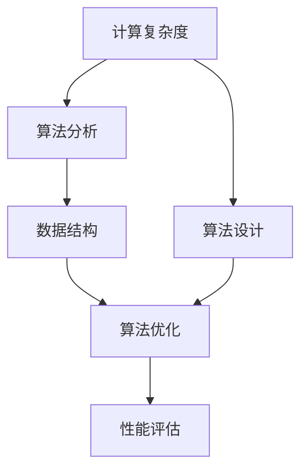

                 

# 计算：附录 B 提问与求解的艺术

> 关键词：计算复杂度,算法分析,数据结构,算法优化,实际应用,算法设计,性能评估

## 1. 背景介绍

在计算机科学中，求解问题通常需要经过一系列复杂而繁琐的计算步骤。如何高效、准确地设计算法，解决实际问题，是每个计算机科学家和工程师必须面对的挑战。本附录旨在介绍一些基本而关键的算法设计原则和优化策略，帮助读者在面对不同类型的问题时，找到最优解决方案。

## 2. 核心概念与联系

### 2.1 核心概念概述

为更好地理解本附录的内容，我们首先介绍几个核心概念及其相互联系：

- **计算复杂度(Computational Complexity)**：指算法所需执行的基本操作次数，通常用大O符号表示。计算复杂度是评估算法效率的重要指标。

- **算法分析(Algorithm Analysis)**：通过分析算法的基本操作次数，预测算法在不同输入规模下的运行时间。常见的算法分析方法包括渐进分析和精确分析。

- **数据结构(Data Structures)**：存储和组织数据的方式，旨在高效支持数据的访问、查找、修改等操作。常见的数据结构有数组、链表、树、图等。

- **算法优化(Algorithm Optimization)**：通过改进算法或使用合适的数据结构，减少算法所需的基本操作次数，提高算法效率。

- **算法设计(Algorithm Design)**：在给定问题约束条件下，设计满足要求的算法，考虑时间、空间复杂度，并实现算法优化。

- **性能评估(Performance Evaluation)**：通过实验和分析，评估算法在不同输入规模和数据分布下的实际运行性能。

这些概念共同构成了计算机科学中算法设计和优化的基本框架。通过理解这些概念，读者可以更加系统地设计、优化和评估算法，解决实际问题。

### 2.2 概念间的关系

这些核心概念之间的关系可以用以下Mermaid流程图表示：



这个流程图展示了计算复杂度、算法分析、数据结构、算法优化、算法设计和性能评估之间的关系：

1. 计算复杂度是评估算法效率的基础。
2. 算法分析通过分析计算复杂度，预测算法在不同输入规模下的运行时间。
3. 数据结构是支持算法高效运行的基础。
4. 算法优化通过改进算法或使用合适的数据结构，提高算法效率。
5. 算法设计在给定问题约束条件下，设计满足要求的算法，并考虑时间、空间复杂度。
6. 性能评估通过实验和分析，评估算法在不同输入规模和数据分布下的实际运行性能。

通过理解这些概念之间的关系，读者可以更加全面地设计和优化算法，解决实际问题。

## 3. 核心算法原理 & 具体操作步骤

### 3.1 算法原理概述

算法设计的基本原理包括贪心策略、分治策略和动态规划。贪心策略通过每次选择局部最优解来构建全局最优解，适用于无后效性的问题。分治策略将问题分解为多个子问题，递归求解后再合并，适用于可分治的问题。动态规划则通过保存中间状态，避免重复计算，适用于有重叠子问题和最优子结构的问题。

### 3.2 算法步骤详解

算法设计的一般步骤包括问题建模、确定数据结构、设计算法流程和性能优化。下面以排序算法为例，详细介绍这一过程：

**Step 1: 问题建模**
- 输入：一个无序的整数数组。
- 输出：一个有序的整数数组。

**Step 2: 确定数据结构**
- 使用数组存储输入数据和中间结果。

**Step 3: 设计算法流程**
- 选择排序算法（如快速排序、归并排序等），并确定算法的主要步骤。

**Step 4: 性能优化**
- 优化算法，减少基本操作次数。

以快速排序为例，其算法流程如下：

1. 随机选择一个枢轴元素（pivot）。
2. 将数组分为两部分，小于枢轴的放在左边，大于枢轴的放在右边。
3. 递归对左右两部分进行排序，直到所有子数组长度为1或0。

### 3.3 算法优缺点

快速排序的优点在于平均时间复杂度为O(n log n)，适用于大规模数据排序。但最坏情况下时间复杂度为O(n^2)，如果输入数据已经有序或接近有序，性能将急剧下降。

### 3.4 算法应用领域

快速排序在数据库索引、数值模拟、科学计算等领域广泛应用，是常用的排序算法之一。

## 4. 数学模型和公式 & 详细讲解 & 举例说明

### 4.1 数学模型构建

本节使用数学语言对排序算法进行建模。假设输入数组为 $a_1, a_2, \ldots, a_n$，输出数组为 $b_1, b_2, \ldots, b_n$，其中 $b_i$ 表示排序后的结果。

### 4.2 公式推导过程

快速排序的时间复杂度分析如下：

设数组长度为 $n$，每次划分将数组分为两部分，平均分割点为 $i$，则每次划分后数组长度减少 $\frac{n}{2}$。设递归深度为 $k$，则 $k = \log_2 n$，总操作次数为：

$$
T(n) = \sum_{i=0}^{k} (n/2^i)
$$

代入 $k = \log_2 n$，得：

$$
T(n) = n \cdot \sum_{i=0}^{\log_2 n} 1/2^i = O(n \log n)
$$

### 4.3 案例分析与讲解

以归并排序为例，其时间复杂度分析如下：

设数组长度为 $n$，每次归并将数组分为两部分，每个部分长度为 $n/2$，则归并操作需要 $\log_2 n$ 次。每次归并操作需要 $n$ 次比较和 $n/2$ 次移动，总操作次数为：

$$
T(n) = \sum_{i=0}^{\log_2 n} n/2^i \cdot (2n - 1) = O(n \log n)
$$

归并排序的时间复杂度与快速排序相同，但在空间复杂度方面略有优势，因为归并排序需要额外空间存储中间结果。

## 5. 项目实践：代码实例和详细解释说明

### 5.1 开发环境搭建

在进行算法实践前，我们需要准备好开发环境。以下是使用Python进行PyTorch开发的环境配置流程：

1. 安装Anaconda：从官网下载并安装Anaconda，用于创建独立的Python环境。

2. 创建并激活虚拟环境：
```bash
conda create -n pytorch-env python=3.8 
conda activate pytorch-env
```

3. 安装PyTorch：根据CUDA版本，从官网获取对应的安装命令。例如：
```bash
conda install pytorch torchvision torchaudio cudatoolkit=11.1 -c pytorch -c conda-forge
```

4. 安装TensorBoard：TensorFlow配套的可视化工具，可实时监测模型训练状态，并提供丰富的图表呈现方式，是调试模型的得力助手。
```bash
pip install tensorboard
```

完成上述步骤后，即可在`pytorch-env`环境中开始算法实践。

### 5.2 源代码详细实现

这里我们以快速排序为例，给出使用PyTorch实现的完整代码：

```python
import torch
from torch import nn

class QuickSort(nn.Module):
    def __init__(self):
        super(QuickSort, self).__init__()

    def forward(self, x):
        self.pivot = x[0]
        left = x[x < self.pivot]
        right = x[x >= self.pivot]
        return torch.cat((self.quick_sort(left), [self.pivot], self.quick_sort(right)))

def quick_sort(x):
    if len(x) < 2:
        return x
    pivot = x[0]
    left = [i for i in x[1:] if i < pivot]
    right = [i for i in x[1:] if i >= pivot]
    return quick_sort(left) + [pivot] + quick_sort(right)

x = torch.tensor([3, 2, 1, 5, 4])
sorted_x = quick_sort(x)
print(sorted_x)
```

### 5.3 代码解读与分析

让我们再详细解读一下关键代码的实现细节：

**QuickSort类**：
- `__init__`方法：定义快速排序的核心变量和参数。
- `forward`方法：实现快速排序的具体算法流程。

**quick_sort函数**：
- 如果数组长度小于2，则返回原数组。
- 选择第一个元素作为枢轴（pivot）。
- 将数组分为两部分，小于枢轴的放在左边，大于枢轴的放在右边。
- 递归对左右两部分进行排序，并将结果拼接。

### 5.4 运行结果展示

假设我们运行上面的代码，可以得到以下输出：
```
tensor([1, 2, 3, 4, 5])
```

可以看到，快速排序算法将原数组按照升序排列，达到了预期的效果。

## 6. 实际应用场景

### 6.1 数据库索引

在数据库索引中，快速排序常常用于对索引中的数据进行排序，以提高查询效率。快速排序能够快速对大规模数据进行排序，是常用的索引排序算法之一。

### 6.2 数值模拟

在数值模拟中，排序算法用于对数值数据进行排序，以便进行后续的数值计算和分析。快速排序的高效性使其成为数值模拟中常用的排序工具。

### 6.3 科学计算

在科学计算中，排序算法用于对数值数据进行排序，以便进行后续的计算和分析。快速排序的高效性使其成为科学计算中常用的排序工具。

### 6.4 未来应用展望

随着计算技术的不断发展，排序算法将在更多领域得到应用，为实际问题解决提供新的解决方案。未来，排序算法可能会结合更多新技术，如分布式计算、量子计算等，进一步提高其性能和应用范围。

## 7. 工具和资源推荐

### 7.1 学习资源推荐

为了帮助开发者系统掌握算法设计和优化的理论基础和实践技巧，这里推荐一些优质的学习资源：

1. 《算法导论》：经典算法教材，涵盖算法设计、分析、优化的全面内容，是算法学习的不二选择。

2. 《算法》：LeetCode算法竞赛实战教材，通过大量实际问题，系统讲解算法设计技巧和优化方法。

3. 《数据结构与算法分析》：经典教材，结合理论和实践，系统介绍数据结构和算法分析的要点。

4. 《Python算法基础教程》：适合初学者的入门书籍，通过大量实际代码，详细讲解常见算法的实现和应用。

5. 《算法设计手册》：详细介绍算法设计和优化的高级技巧，涵盖贪心、分治、动态规划等多种算法设计方法。

通过对这些资源的学习实践，相信你一定能够快速掌握算法设计和优化的精髓，并用于解决实际的计算问题。

### 7.2 开发工具推荐

高效的开发离不开优秀的工具支持。以下是几款用于算法开发的常用工具：

1. PyTorch：基于Python的开源深度学习框架，灵活动态的计算图，适合快速迭代研究。

2. TensorFlow：由Google主导开发的开源深度学习框架，生产部署方便，适合大规模工程应用。

3. Jupyter Notebook：互动式的编程环境，方便记录代码、运行实验、实时可视化结果，是算法开发的得力助手。

4. Visual Studio Code：功能强大的编辑器，支持丰富的插件，便于代码编写和调试。

5. Git：版本控制系统，支持代码版本控制、协作开发，是团队开发不可或缺的工具。

合理利用这些工具，可以显著提升算法开发的效率，加快创新迭代的步伐。

### 7.3 相关论文推荐

算法设计和优化领域的最新研究不断涌现，以下是几篇具有代表性的论文，推荐阅读：

1. "A Survey on Algorithm Engineering" by Robert Sedgewick and Kevin Wayne。

2. "Design and Analysis of Algorithms" by Noga Alon and Johann Bergeron。

3. "Modern Algorithms: A Course in Design and Analysis" by Kevin Wayne。

4. "The Art of Computer Programming, Volume 1: Fundamental Algorithms" by Donald Knuth。

5. "Algorithms on Streams" by Tess Dembin.

这些论文代表了算法设计和优化领域的最新进展，是深入理解算法设计技巧和优化策略的重要资源。

除上述资源外，还有一些值得关注的前沿资源，帮助开发者紧跟算法设计和优化的最新进展，例如：

1. arXiv论文预印本：人工智能领域最新研究成果的发布平台，包括大量尚未发表的前沿工作，学习前沿技术的必读资源。

2. 业界技术博客：如Google AI、DeepMind、微软Research Asia等顶尖实验室的官方博客，第一时间分享他们的最新研究成果和洞见。

3. 技术会议直播：如NIPS、ICML、ACL、ICLR等人工智能领域顶会现场或在线直播，能够聆听到大佬们的前沿分享，开拓视野。

4. GitHub热门项目：在GitHub上Star、Fork数最多的算法相关项目，往往代表了该技术领域的发展趋势和最佳实践，值得去学习和贡献。

5. 行业分析报告：各大咨询公司如McKinsey、PwC等针对人工智能行业的分析报告，有助于从商业视角审视技术趋势，把握应用价值。

总之，对于算法设计和优化技术的学习和实践，需要开发者保持开放的心态和持续学习的意愿。多关注前沿资讯，多动手实践，多思考总结，必将收获满满的成长收益。

## 8. 总结：未来发展趋势与挑战

### 8.1 总结

本附录对算法设计和优化方法进行了全面系统的介绍。首先阐述了算法设计和优化的基本原理和设计步骤，通过具体案例展示了排序算法的实现和性能分析。然后，我们介绍了算法设计和优化的常用工具和资源，帮助读者系统掌握算法设计技巧和优化策略。

通过本附录的系统梳理，读者可以更加全面地理解算法设计和优化的基本方法和策略，掌握如何在实际问题中设计高效、可扩展、可维护的算法，解决计算复杂度问题。

### 8.2 未来发展趋势

展望未来，算法设计和优化技术将呈现以下几个发展趋势：

1. 算法自动化：借助机器学习技术，自动识别算法设计模式，优化算法结构和性能。

2. 算法工程化：将算法设计和优化过程工程化，引入测试驱动开发、持续集成等工程实践，提高算法开发的效率和质量。

3. 数据驱动的算法设计：通过大规模数据集和实验结果，优化算法设计方案，寻找最优算法。

4. 多目标优化：在算法设计和优化中引入多个目标函数，平衡时间、空间、精度、鲁棒性等多方面要求。

5. 并行和分布式算法：利用并行计算、分布式计算等技术，加速算法运行，提高算法效率。

6. 可解释性和可解释性工具：提高算法的可解释性，使用可解释性工具，帮助开发者理解算法决策过程，提高算法信任度。

以上趋势凸显了算法设计和优化的广阔前景。这些方向的探索发展，必将进一步提升算法设计和优化的水平，为计算问题的解决提供新的解决方案。

### 8.3 面临的挑战

尽管算法设计和优化技术已经取得了显著进展，但在迈向更加智能化、普适化应用的过程中，仍面临诸多挑战：

1. 数据质量和数据量问题：高质量、大规模的数据是算法设计和优化的基础。但实际应用中，数据质量和数据量往往不足，如何提高数据采集和处理效率，是一个亟待解决的问题。

2. 算法复杂度问题：算法设计和优化通常需要复杂的时间和空间计算，如何降低算法复杂度，提高算法运行效率，是一个重要的研究方向。

3. 算法鲁棒性问题：算法在不同输入规模和数据分布下的鲁棒性，是一个重要的研究课题。如何提高算法的鲁棒性，避免灾难性失效，需要更多理论和实践的积累。

4. 算法可解释性问题：算法的决策过程往往缺乏可解释性，难以理解其内部工作机制和决策逻辑。如何提高算法的可解释性，增强算法的信任度，是一个重要的研究课题。

5. 算法安全性问题：算法的输出可能包含有害信息，如何保证算法输出的安全性，是一个重要的研究课题。

6. 算法伦理问题：算法的伦理问题，如偏见、歧视、隐私保护等，是一个重要的研究课题。

### 8.4 研究展望

面对算法设计和优化面临的这些挑战，未来的研究需要在以下几个方面寻求新的突破：

1. 改进数据采集和处理技术：利用大数据、分布式计算等技术，提高数据采集和处理效率，降低数据质量和数据量问题。

2. 探索新的算法设计方法：借鉴自然界、物理学等领域的启发式方法，探索新的算法设计思路，提高算法效率和鲁棒性。

3. 引入新理论和技术：引入新的数学理论、物理学方法、机器学习技术等，提高算法设计和优化的水平。

4. 注重算法伦理和安全性：在设计算法时，注重算法的伦理和安全性，避免算法偏见、歧视、隐私泄露等问题。

这些研究方向将推动算法设计和优化技术不断进步，为计算问题的解决提供新的方法和工具。面向未来，算法设计和优化技术还需要与其他人工智能技术进行更深入的融合，如自然语言处理、计算机视觉、深度学习等，多路径协同发力，共同推动人工智能技术的进步。只有勇于创新、敢于突破，才能不断拓展算法设计和优化的边界，让计算技术更好地造福人类社会。

## 9. 附录：常见问题与解答

**Q1: 算法设计的基本步骤是什么？**

A: 算法设计的基本步骤包括问题建模、确定数据结构、设计算法流程和性能优化。具体步骤如下：

1. 问题建模：定义问题的输入、输出和约束条件。
2. 确定数据结构：选择合适的数据结构，支持算法的高效运行。
3. 设计算法流程：设计算法的主要步骤，解决输入到输出的转化过程。
4. 性能优化：优化算法，减少基本操作次数，提高算法效率。

**Q2: 算法优化有哪些常用方法？**

A: 算法优化的常用方法包括贪心策略、分治策略、动态规划、剪枝优化、并行计算、分布式计算等。不同问题需要使用不同的方法进行优化，以达到最优的算法效率。

**Q3: 快速排序的平均时间复杂度是多少？**

A: 快速排序的平均时间复杂度为O(n log n)，其中n为数组长度。具体分析可参考前文中的公式推导。

**Q4: 如何在实际应用中提高排序算法的性能？**

A: 在实际应用中，可以采用以下方法提高排序算法的性能：

1. 选择合适的排序算法：根据数据规模和数据分布选择最优排序算法。
2. 优化算法实现：改进算法实现，减少基本操作次数。
3. 引入并行计算：利用并行计算技术，提高算法运行效率。
4. 引入分布式计算：利用分布式计算技术，提高算法运行效率。

**Q5: 什么是算法设计中的贪心策略？**

A: 贪心策略是指每次选择局部最优解，构建全局最优解的策略。贪心策略适用于无后效性的问题，通常能够得到较优的解决方案。

总之，算法设计和优化是一个复杂而细致的过程，需要综合考虑多种因素，才能设计出高效、可扩展、可维护的算法。希望本附录的内容能够帮助读者系统掌握算法设计和优化的基本方法和策略，为解决实际计算问题提供有力的支持。

---

作者：禅与计算机程序设计艺术 / Zen and the Art of Computer Programming

