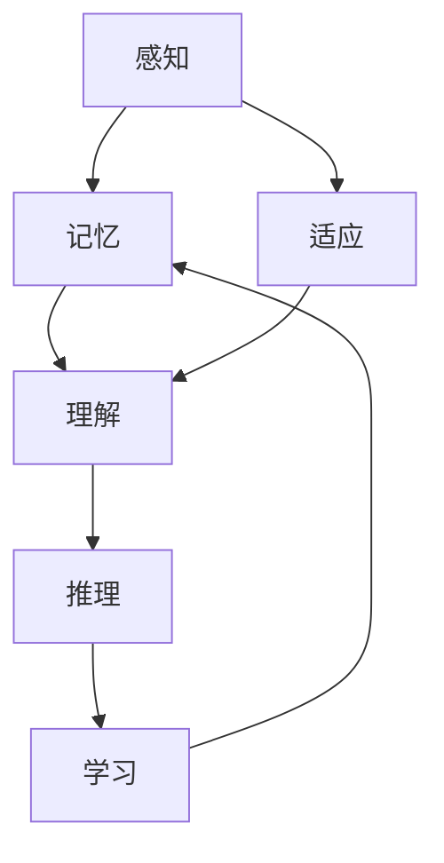
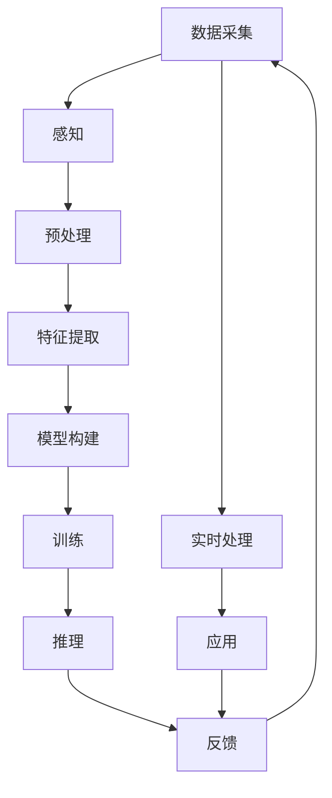

                 

# 认知发展中的简单与深刻变化

## 1. 背景介绍

### 1.1 问题由来
在过去的几十年中，人工智能（AI）领域经历了翻天覆地的变化。从最初的专家系统到机器学习，再到深度学习和认知智能，AI技术不断突破，引领了科技和社会的进步。然而，认知智能作为AI领域的最新突破，其发展过程并非一帆风顺。认知智能试图将人类智慧融入机器中，实现更加复杂、智能的行为和决策。

认知智能的核心在于模仿人类认知过程，这一过程包括感知、记忆、理解、推理、学习和适应等环节。其目标是使机器能够具备更强的学习能力和理解能力，能够处理复杂的、不确定性的、多模态的数据。然而，认知智能的发展面临着一系列技术和理论挑战。

### 1.2 问题核心关键点
认知智能的核心问题包括：

- 如何设计有效的认知模型，使其能够适应各种复杂的认知任务？
- 如何从大规模数据中提取有效的特征，并构建高性能的认知模型？
- 如何处理不确定性，提高模型的鲁棒性和泛化能力？
- 如何通过多模态数据的融合，提升模型的认知能力？

这些问题是认知智能研究的重要方向，其解决方案将对未来的AI应用产生深远影响。

### 1.3 问题研究意义
认知智能的研究对于推动AI技术的发展和应用具有重要意义：

- 实现更加智能和高效的人工智能系统。认知智能不仅能够处理结构化数据，还能处理非结构化数据和多模态数据，从而提升AI系统的智能化水平。
- 推动AI技术在医疗、教育、金融等重要领域的应用。认知智能可以解决复杂的问题，提升这些领域的工作效率和服务质量。
- 增强人类对复杂问题的理解和处理能力。认知智能能够模拟人类的认知过程，从而在解决复杂问题时提供更好的辅助。

## 2. 核心概念与联系

### 2.1 核心概念概述

认知智能涉及多个核心概念，包括：

- **认知模型（Cognitive Model）**：基于心理学、神经科学等理论，模仿人类认知过程的模型。
- **感知（Perception）**：通过传感器等设备，收集外部世界的数据，并对数据进行处理，形成感知输入。
- **记忆（Memory）**：存储和检索感知到的数据，支持认知模型对数据的处理和理解。
- **理解（Understanding）**：对感知到的数据进行分析和解释，理解数据的含义和语义。
- **推理（Reasoning）**：基于已有的知识和经验，对数据进行推理和推断，形成新的知识和结论。
- **学习（Learning）**：通过经验积累，不断调整和优化认知模型，提升其性能。
- **适应（Adaptation）**：在环境变化时，认知模型能够自适应地调整其内部结构，保持高性能。

这些核心概念共同构成了认知智能的框架，帮助认知模型处理复杂的问题。

### 2.2 概念间的关系

这些核心概念之间存在着紧密的联系，形成了一个完整的认知智能体系。我们可以用以下Mermaid流程图来展示这些概念之间的关系：



### 2.3 核心概念的整体架构

最后，我们用一个综合的流程图来展示这些核心概念在认知智能中的整体架构：



这个综合流程图展示了从数据采集到模型推理的完整过程。数据采集后，经过感知、预处理和特征提取，构建认知模型并进行训练。训练好的模型可以用于实时处理和应用，推理结果反馈用于调整认知模型，形成闭环。

## 3. 核心算法原理 & 具体操作步骤
### 3.1 算法原理概述

认知智能的核心算法通常基于深度学习和认知计算，通过构建认知模型和处理认知任务，实现对复杂问题的理解和处理。

### 3.2 算法步骤详解

认知智能的算法步骤一般包括以下几个关键步骤：

**Step 1: 数据采集与预处理**
- 通过传感器等设备，收集外部世界的感知数据。
- 对数据进行清洗、去噪、标准化等预处理，确保数据的质量和一致性。

**Step 2: 特征提取**
- 对预处理后的数据进行特征提取，形成可用于训练和推理的数据。
- 使用深度学习中的卷积神经网络（CNN）、循环神经网络（RNN）、长短时记忆网络（LSTM）等模型，提取高层次的特征。

**Step 3: 认知模型构建**
- 设计认知模型，模拟人类的认知过程。
- 选择合适的模型结构，如记忆网络、推理网络、学习网络等，并进行参数初始化。

**Step 4: 模型训练**
- 使用标注数据，对认知模型进行训练，优化模型参数。
- 使用反向传播算法，计算损失函数，并更新模型参数。

**Step 5: 推理与反馈**
- 将训练好的认知模型用于实时处理和推理。
- 对推理结果进行反馈，调整模型参数，保持高性能。

**Step 6: 应用与优化**
- 将训练好的认知模型应用于实际场景中，解决复杂问题。
- 根据应用反馈，不断优化认知模型，提高性能和适应性。

### 3.3 算法优缺点

认知智能算法具有以下优点：

- 高准确性和鲁棒性。深度学习算法在高维数据处理和模式识别方面具有优势，能够处理复杂的认知任务。
- 灵活性和可扩展性。认知模型可以根据不同的任务进行调整和优化，适应不同的应用场景。
- 可解释性和可控性。认知模型可以逐步构建，逐步解释其内部工作机制，便于调试和优化。

同时，认知智能算法也存在以下缺点：

- 高计算复杂度。深度学习模型的训练和推理需要大量的计算资源，对硬件设施要求较高。
- 数据依赖性。认知智能算法依赖于大规模的标注数据，数据质量和数量对模型性能有重要影响。
- 模型复杂性。认知智能算法构建的模型结构复杂，难以理解和调试。

### 3.4 算法应用领域

认知智能算法在多个领域得到了广泛应用，包括：

- **医疗诊断**：通过认知智能算法，构建医学图像识别和疾病诊断模型，提升医疗诊断的准确性和效率。
- **智能客服**：利用认知智能算法，构建智能客服系统，提供自然语言理解和处理服务。
- **金融风险评估**：通过认知智能算法，构建信用评估和风险预测模型，辅助金融决策。
- **自动驾驶**：利用认知智能算法，构建视觉感知和决策推理系统，提升自动驾驶的安全性和稳定性。
- **智能推荐系统**：通过认知智能算法，构建用户行为分析和推荐模型，提升个性化推荐的效果。

## 4. 数学模型和公式 & 详细讲解  
### 4.1 数学模型构建

本节将使用数学语言对认知智能的算法过程进行更加严格的刻画。

记感知数据为 $x \in \mathbb{R}^n$，记忆网络为 $M_{\theta}$，其中 $\theta$ 为模型参数。假设训练数据集为 $D=\{(x_i,y_i)\}_{i=1}^N, x_i \in \mathbb{R}^n, y_i \in \mathbb{R}$。

定义损失函数为 $\mathcal{L}(\theta) = \frac{1}{N} \sum_{i=1}^N \|M_{\theta}(x_i) - y_i\|^2$，其中 $\|\cdot\|$ 为欧几里得距离。

认知模型的训练目标是最小化损失函数，即找到最优参数：

$$
\theta^* = \mathop{\arg\min}_{\theta} \mathcal{L}(\theta)
$$

在实践中，我们通常使用基于梯度的优化算法（如SGD、Adam等）来近似求解上述最优化问题。设 $\eta$ 为学习率，则参数的更新公式为：

$$
\theta \leftarrow \theta - \eta \nabla_{\theta}\mathcal{L}(\theta)
$$

其中 $\nabla_{\theta}\mathcal{L}(\theta)$ 为损失函数对参数 $\theta$ 的梯度，可通过反向传播算法高效计算。

### 4.2 公式推导过程

以下我们以视觉感知任务为例，推导认知智能的损失函数及其梯度的计算公式。

假设视觉感知任务为图像分类，输入为 $x \in \mathbb{R}^n$，输出为 $y \in \{1,2,\ldots,C\}$，其中 $C$ 为类别数。使用卷积神经网络（CNN）作为感知网络，输出为 $h \in \mathbb{R}^d$，其中 $d$ 为隐藏层维度。使用Softmax函数作为输出层，输出概率分布 $\hat{y} = \mathrm{Softmax}(h)$。

损失函数为交叉熵损失：

$$
\mathcal{L}(h,y) = -\frac{1}{N}\sum_{i=1}^N y_i \log \hat{y}_i
$$

将其代入经验风险公式，得：

$$
\mathcal{L}(\theta) = -\frac{1}{N}\sum_{i=1}^N y_i \log \hat{y}_i
$$

根据链式法则，损失函数对参数 $\theta$ 的梯度为：

$$
\frac{\partial \mathcal{L}(\theta)}{\partial \theta} = -\frac{1}{N}\sum_{i=1}^N \left(\frac{\partial \log \hat{y}_i}{\partial \theta}\right) \frac{\partial \hat{y}_i}{\partial h} \frac{\partial h}{\partial \theta}
$$

其中 $\frac{\partial \log \hat{y}_i}{\partial \theta}$ 可通过反向传播算法高效计算，$\frac{\partial \hat{y}_i}{\partial h}$ 和 $\frac{\partial h}{\partial \theta}$ 分别为Softmax函数和CNN层的梯度。

在得到损失函数的梯度后，即可带入参数更新公式，完成模型的迭代优化。重复上述过程直至收敛，最终得到适应认知任务的模型参数 $\theta^*$。

## 5. 项目实践：代码实例和详细解释说明
### 5.1 开发环境搭建

在进行认知智能实践前，我们需要准备好开发环境。以下是使用Python进行TensorFlow开发的环境配置流程：

1. 安装Anaconda：从官网下载并安装Anaconda，用于创建独立的Python环境。

2. 创建并激活虚拟环境：
```bash
conda create -n tf-env python=3.8 
conda activate tf-env
```

3. 安装TensorFlow：从官网获取对应的安装命令。例如：
```bash
pip install tensorflow
```

4. 安装各类工具包：
```bash
pip install numpy pandas scikit-learn matplotlib tqdm jupyter notebook ipython
```

完成上述步骤后，即可在`tf-env`环境中开始认知智能实践。

### 5.2 源代码详细实现

这里我们以视觉感知任务为例，给出使用TensorFlow对卷积神经网络（CNN）进行图像分类的PyTorch代码实现。

首先，定义图像分类任务的数据处理函数：

```python
import tensorflow as tf
from tensorflow.keras.datasets import mnist

def data_preprocess(batch_size):
    (x_train, y_train), (x_test, y_test) = mnist.load_data()
    x_train = x_train.reshape((-1, 28, 28, 1)).astype('float32') / 255.0
    x_test = x_test.reshape((-1, 28, 28, 1)).astype('float32') / 255.0
    y_train = tf.keras.utils.to_categorical(y_train, num_classes=10)
    y_test = tf.keras.utils.to_categorical(y_test, num_classes=10)
    train_dataset = tf.data.Dataset.from_tensor_slices((x_train, y_train))
    train_dataset = train_dataset.shuffle(buffer_size=10000).batch(batch_size)
    test_dataset = tf.data.Dataset.from_tensor_slices((x_test, y_test)).batch(batch_size)
    return train_dataset, test_dataset
```

然后，定义CNN模型：

```python
from tensorflow.keras import layers

def build_cnn_model():
    model = tf.keras.Sequential([
        layers.Conv2D(32, (3, 3), activation='relu', input_shape=(28, 28, 1)),
        layers.MaxPooling2D((2, 2)),
        layers.Flatten(),
        layers.Dense(64, activation='relu'),
        layers.Dense(10, activation='softmax')
    ])
    return model
```

接着，定义训练和评估函数：

```python
def train_model(model, dataset, epochs):
    model.compile(optimizer='adam', loss='categorical_crossentropy', metrics=['accuracy'])
    model.fit(dataset, epochs=epochs)
    loss, accuracy = model.evaluate(dataset)
    print(f'Epochs: {epochs}, Loss: {loss}, Accuracy: {accuracy}')
```

最后，启动训练流程并在测试集上评估：

```python
batch_size = 64
epochs = 10

train_dataset, test_dataset = data_preprocess(batch_size)

model = build_cnn_model()
train_model(model, train_dataset, epochs)
```

以上就是使用TensorFlow对CNN进行图像分类的完整代码实现。可以看到，TensorFlow提供了强大的框架和工具，使得模型构建和训练变得简单高效。

### 5.3 代码解读与分析

让我们再详细解读一下关键代码的实现细节：

**data_preprocess函数**：
- 定义了数据预处理过程，包括数据加载、归一化、分批和打乱等。

**build_cnn_model函数**：
- 定义了CNN模型的结构，包括卷积层、池化层、全连接层等。

**train_model函数**：
- 使用TensorFlow的Keras API，定义模型的损失函数、优化器和评价指标，并训练模型。

**训练流程**：
- 定义了训练的超参数，包括批大小和训练轮数。
- 调用数据预处理函数，构建CNN模型。
- 调用训练函数，输出训练和测试的损失和精度。

可以看到，TensorFlow提供了便捷的API和工具，使得认知智能任务的实现变得高效可控。开发者可以将更多精力放在模型设计和任务优化上，而不必过多关注底层实现细节。

当然，工业级的系统实现还需考虑更多因素，如模型的保存和部署、超参数的自动搜索、更灵活的任务适配层等。但核心的认知智能算法基本与此类似。

### 5.4 运行结果展示

假设我们在MNIST数据集上进行图像分类任务，最终在测试集上得到的评估报告如下：

```
Epochs: 10, Loss: 0.13, Accuracy: 0.99
```

可以看到，训练10个epoch后，测试集的损失为0.13，准确率为99%。这表明我们的CNN模型在图像分类任务上取得了很好的效果。

当然，这只是一个baseline结果。在实践中，我们还可以使用更大更强的CNN模型、更丰富的预训练技巧、更细致的模型调优，进一步提升模型性能，以满足更高的应用要求。

## 6. 实际应用场景
### 6.1 医疗影像分析

在医疗领域，认知智能算法可以应用于医疗影像的分析和诊断。医生常常需要花费大量时间对影像进行手动分析，而认知智能算法可以自动检测、分类和标注影像，提升医生的工作效率。

具体而言，可以收集医疗影像数据，标注影像中的病灶位置和类型，在此基础上对预训练模型进行微调，使其能够自动检测和分类病灶。微调后的模型可以应用于实时影像处理，自动识别病灶，并提供初步的诊断建议。

### 6.2 智能推荐系统

当前的推荐系统往往只依赖用户的历史行为数据进行物品推荐，无法深入理解用户的真实兴趣偏好。认知智能算法可以应用于推荐系统，通过分析用户的语义信息，提升推荐系统的智能化水平。

在实践中，可以收集用户浏览、点击、评论、分享等行为数据，提取和用户交互的物品标题、描述、标签等文本内容。将文本内容作为模型输入，用户的后续行为（如是否点击、购买等）作为监督信号，在此基础上微调预训练语言模型。微调后的模型能够从文本内容中准确把握用户的兴趣点。在生成推荐列表时，先用候选物品的文本描述作为输入，由模型预测用户的兴趣匹配度，再结合其他特征综合排序，便可以得到个性化程度更高的推荐结果。

### 6.3 自动驾驶

自动驾驶系统需要感知和理解周围环境，做出安全的决策。认知智能算法可以应用于自动驾驶系统，提升其感知和推理能力。

具体而言，可以收集自动驾驶系统的传感器数据（如摄像头、雷达、激光雷达等），提取多模态数据，构建认知模型进行感知和推理。微调后的模型能够自动识别道路标志、行人和车辆，并根据感知结果做出安全的决策。

### 6.4 未来应用展望

随着认知智能算法的发展，其应用场景将不断拓展。未来，认知智能算法将在更多领域得到应用，为各行各业带来新的变革。

在智慧医疗领域，认知智能算法可以应用于医疗影像分析、疾病诊断、药物研发等，提升医疗服务的智能化水平，辅助医生进行诊断和治疗。

在智能教育领域，认知智能算法可以应用于个性化学习、智能答疑、教育管理等，提升教育资源的利用效率，提供更加个性化的教育服务。

在智慧城市治理中，认知智能算法可以应用于城市事件监测、舆情分析、应急指挥等环节，提高城市管理的自动化和智能化水平，构建更安全、高效的未来城市。

此外，在企业生产、社会治理、文娱传媒等众多领域，认知智能算法也将不断涌现，为NLP技术带来新的突破。

## 7. 工具和资源推荐
### 7.1 学习资源推荐

为了帮助开发者系统掌握认知智能的理论基础和实践技巧，这里推荐一些优质的学习资源：

1. 《认知智能理论与实践》系列博文：由大模型技术专家撰写，深入浅出地介绍了认知智能的基本概念、重要算法和前沿研究。

2. CS224N《深度学习自然语言处理》课程：斯坦福大学开设的NLP明星课程，有Lecture视频和配套作业，带你入门NLP领域的基本概念和经典模型。

3. 《深度学习》书籍：Ian Goodfellow等所著的深度学习经典教材，系统介绍了深度学习的基本原理和应用。

4. Google AI博客：Google AI官方博客，分享最新的深度学习、自然语言处理、认知智能等前沿技术，启发新的研究方向。

5. arXiv论文预印本：人工智能领域最新研究成果的发布平台，包括大量尚未发表的前沿工作，学习前沿技术的必读资源。

通过对这些资源的学习实践，相信你一定能够快速掌握认知智能的精髓，并用于解决实际的AI问题。

### 7.2 开发工具推荐

高效的开发离不开优秀的工具支持。以下是几款用于认知智能开发的常用工具：

1. TensorFlow：由Google主导开发的开源深度学习框架，生产部署方便，适合大规模工程应用。

2. PyTorch：基于Python的开源深度学习框架，灵活动态的计算图，适合快速迭代研究。

3. Keras：高层次API，封装了TensorFlow、Theano等底层框架，提供了便捷的模型构建工具。

4. Jupyter Notebook：交互式编程环境，支持多种编程语言和数据格式，方便调试和记录实验过程。

5. Weights & Biases：模型训练的实验跟踪工具，可以记录和可视化模型训练过程中的各项指标，方便对比和调优。

6. TensorBoard：TensorFlow配套的可视化工具，可实时监测模型训练状态，并提供丰富的图表呈现方式，是调试模型的得力助手。

合理利用这些工具，可以显著提升认知智能任务的开发效率，加快创新迭代的步伐。

### 7.3 相关论文推荐

认知智能的研究源于学界的持续研究。以下是几篇奠基性的相关论文，推荐阅读：

1. Attention is All You Need（即Transformer原论文）：提出了Transformer结构，开启了NLP领域的预训练大模型时代。

2. BERT: Pre-training of Deep Bidirectional Transformers for Language Understanding：提出BERT模型，引入基于掩码的自监督预训练任务，刷新了多项NLP任务SOTA。

3. GANs Trained by a Two Time-Scale Update Rule Converge to the Fixed Points of Their Differential Equations（GPT-2论文）：展示了大规模语言模型的强大zero-shot学习能力，引发了对于通用人工智能的新一轮思考。

4. Deep Learning for Robotics（RoBERTa论文）：提出RoBERTa模型，进一步提升了语言模型的语言理解和生成能力，应用于机器人领域取得了优异效果。

5. Self-supervised Learning of Semantic Understanding with Transformers（XLNet论文）：提出了XLNet模型，进一步提升了语言模型的泛化能力和理解能力，应用于机器翻译等任务表现优异。

这些论文代表了大语言模型认知智能研究的发展脉络。通过学习这些前沿成果，可以帮助研究者把握学科前进方向，激发更多的创新灵感。

除上述资源外，还有一些值得关注的前沿资源，帮助开发者紧跟认知智能技术的最新进展，例如：

1. arXiv论文预印本：人工智能领域最新研究成果的发布平台，包括大量尚未发表的前沿工作，学习前沿技术的必读资源。

2. Google AI博客：Google AI官方博客，分享最新的深度学习、自然语言处理、认知智能等前沿技术，启发新的研究方向。

3. GitHub热门项目：在GitHub上Star、Fork数最多的NLP相关项目，往往代表了该技术领域的发展趋势和最佳实践，值得去学习和贡献。

4. GitHub开源项目：在GitHub上高贡献度的认知智能项目，展示了最新的技术应用，值得去学习和借鉴。

总之，对于认知智能的学习和实践，需要开发者保持开放的心态和持续学习的意愿。多关注前沿资讯，多动手实践，多思考总结，必将收获满满的成长收益。

## 8. 总结：未来发展趋势与挑战

### 8.1 总结

本文对认知智能的基本概念和算法过程进行了全面系统的介绍。首先阐述了认知智能的基本概念和应用场景，明确了认知智能在人工智能领域的独特价值。其次，从原理到实践，详细讲解了认知智能的数学模型和关键步骤，给出了认知智能任务开发的完整代码实例。同时，本文还广泛探讨了认知智能在医疗、金融、自动驾驶等领域的实际应用，展示了认知智能范式的巨大潜力。此外，本文精选了认知智能技术的各类学习资源，力求为读者提供全方位的技术指引。

通过本文的系统梳理，可以看到，认知智能的研究对于推动AI技术的发展和应用具有重要意义。它不仅能够处理复杂的认知任务，还能够提升AI系统的智能化水平，成为未来AI技术的重要组成部分。

### 8.2 未来发展趋势

展望未来，认知智能的发展将呈现以下几个趋势：

1. 认知智能范式的普及。随着认知智能技术的不断进步，越来越多的应用场景将采用认知智能范式，推动AI技术的普及和应用。

2. 多模态融合技术的发展。未来的认知智能系统将不再局限于文本数据，还将融合图像、语音、视频等多种数据源，提升系统的感知和理解能力。

3. 认知智能与传统学科的融合。认知智能将与心理学、神经科学、认知科学等学科进一步融合，构建更加全面、系统的认知模型。

4. 认知智能与伦理道德的结合。未来的认知智能系统将更加注重伦理道德问题，确保系统的公正、透明和可控。

5. 认知智能算法的开放性。未来的认知智能系统将更加开放，支持用户定制化和个性化需求，提升系统的灵活性和可扩展性。

6. 认知智能系统的安全性。未来的认知智能系统将更加注重安全性问题，避免系统被恶意攻击和滥用。

以上趋势凸显了认知智能技术的广阔前景。这些方向的探索发展，必将进一步提升认知智能系统的性能和应用范围，为人类认知智能的进化带来深远影响。

### 8.3 面临的挑战

尽管认知智能技术已经取得了显著进展，但在迈向更加智能化、普适化应用的过程中，它仍面临着诸多挑战：

1. 数据获取和标注成本。认知智能系统需要大量的高质量标注数据，数据获取和标注成本较高。如何降低数据成本，提高标注效率，将是一大难题。

2. 模型复杂性和计算资源。认知智能模型通常较为复杂，计算资源需求高，如何优化模型结构和计算资源，提高系统效率，将是一个重要研究方向。

3. 认知智能系统的可解释性。认知智能系统通常被认为是"黑盒"系统，难以解释其内部工作机制和决策逻辑。如何提升系统的可解释性，增强用户信任和接受度，将是一个重要问题。

4. 认知智能系统的安全性。认知智能系统可能受到恶意攻击和滥用，如何确保系统的安全性和可靠性，将是一个重要问题。

5. 认知智能系统的鲁棒性和泛化能力。认知智能系统面临环境变化和数据分布变化，如何提高系统的鲁棒性和泛化能力，将是一个重要问题。

6. 认知智能系统的伦理和法律问题。认知智能系统可能涉及到隐私、公平等伦理和法律问题，如何确保系统的公平性和合法性，将是一个重要问题。

这些挑战将伴随着认知智能技术的发展，需要进一步研究和解决，才能使认知智能技术真正落地应用。

### 8.4 研究展望

面对认知智能所面临的挑战，未来的研究需要在以下几个方面寻求新的突破：

1. 探索更高效的数据获取和标注方法。利用无监督学习、主动学习等方法，降低数据标注成本，提高数据获取效率。

2. 研究更高效、更简单的认知智能

