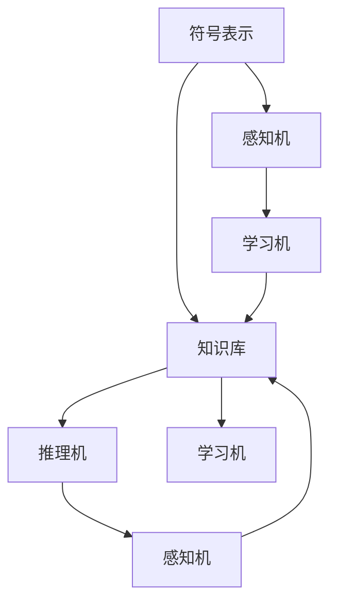

                 

# 认知的形式化：人类在成长过程中，接受教育，学习科学和技术，吸收群体的智能

## 1. 背景介绍

### 1.1 问题由来

人类在成长的过程中，不断接受教育、学习科学和技术、吸收群体的智慧。这些知识和智慧的形成，在很大程度上依赖于我们的认知过程。认知的形式化，旨在通过数学和计算模型，模拟人类的认知过程，从而更好地理解和应用人类的智能。本文将深入探讨认知的形式化，从背景、概念、算法、应用等多个角度，系统阐述认知形式化的理论和实践。

### 1.2 问题核心关键点

认知的形式化，是指通过数学和计算模型，模拟人类的认知过程，包括感知、学习、推理、决策等多个环节。认知的形式化涉及多个核心概念和关键技术，包括：

- **感知（Perception）**：人类通过感官获取外界信息的过程。
- **学习（Learning）**：人类通过经验更新知识库的过程。
- **推理（Reasoning）**：人类根据已有的知识库，进行逻辑推断的过程。
- **决策（Decision）**：人类基于推理结果，做出最终选择的过程。
- **记忆（Memory）**：人类存储和检索经验的过程。

这些核心概念相互关联，共同构成了人类认知的形式化框架。

### 1.3 问题研究意义

认知的形式化具有重要的研究意义，主要体现在以下几个方面：

- **理解和模拟人类认知过程**：通过形式化建模，可以更好地理解人类认知的本质，为开发智能系统提供理论基础。
- **优化智能系统的设计和实现**：形式化认知模型可以指导智能系统优化设计和实现，提升系统的性能和可靠性。
- **推动人工智能技术的发展**：认知形式化是人工智能的核心技术之一，对其深入研究可以推动人工智能技术的进步。
- **促进跨学科研究**：认知形式化涉及多个学科领域，包括心理学、神经科学、认知科学等，可以推动跨学科研究，促进技术创新。

## 2. 核心概念与联系

### 2.1 核心概念概述

认知的形式化主要涉及以下几个核心概念：

- **符号表示（Symbolic Representation）**：使用符号表示知识库中的实体和关系，如命题逻辑中的原子命题、谓词等。
- **知识库（Knowledge Base）**：存储知识库中的实体和关系，如逻辑推理中的命题数据库。
- **推理机（Reasoner）**：执行推理过程，根据知识库中的规则和推理策略，进行逻辑推断。
- **感知机（Perceiver）**：模拟人类的感知过程，将外界信息转化为内部表示。
- **学习机（Learner）**：根据经验，更新知识库中的实体和关系。

这些概念之间存在紧密的联系，形成了一个完整的认知形式化系统。

### 2.2 概念间的关系

这些核心概念之间的关系可以通过以下Mermaid流程图来展示：



这个流程图展示了符号表示、知识库、推理机、感知机和学习机之间的关系：

1. 符号表示是知识库的构成部分，用于存储和表示知识库中的实体和关系。
2. 知识库是推理机的输入，推理机根据知识库中的规则和关系，进行逻辑推断。
3. 感知机将外界信息转化为符号表示，为学习机和推理机提供输入。
4. 学习机根据感知机输入的经验，更新知识库中的实体和关系。

这些概念共同构成了认知形式化的基础，形成了完整的认知模型。

## 3. 核心算法原理 & 具体操作步骤
### 3.1 算法原理概述

认知的形式化涉及多个算法和具体操作步骤，主要包括：

- **感知算法（Perceptual Algorithms）**：将外界信息转化为符号表示。
- **学习算法（Learning Algorithms）**：根据经验，更新知识库中的实体和关系。
- **推理算法（Reasoning Algorithms）**：根据知识库中的规则和关系，进行逻辑推断。
- **决策算法（Decision Algorithms）**：基于推理结果，做出最终选择。

这些算法和操作步骤，共同构成了认知形式化的核心。

### 3.2 算法步骤详解

认知形式化的具体操作步骤包括以下几个关键步骤：

**Step 1: 感知算法**

感知算法是认知形式化的第一步，将外界信息转化为符号表示。具体步骤包括：

1. 使用传感器获取外界信息，如视觉、听觉、触觉等。
2. 将外界信息转化为数字信号，如图像、声音、压力等。
3. 使用预处理算法，如滤波、增强等，提高信号质量。
4. 使用符号表示算法，如特征提取、模式识别等，将信号转化为符号表示。

**Step 2: 学习算法**

学习算法是认知形式化的核心，用于根据经验，更新知识库中的实体和关系。具体步骤包括：

1. 根据感知算法输出的符号表示，从知识库中提取相关实体和关系。
2. 将新信息与现有知识库进行匹配，判断是否需要更新。
3. 使用学习算法，如强化学习、无监督学习等，更新知识库中的实体和关系。
4. 使用验证算法，如贝叶斯网络、因果图等，验证更新结果的正确性。

**Step 3: 推理算法**

推理算法是认知形式化的关键步骤，用于根据知识库中的规则和关系，进行逻辑推断。具体步骤包括：

1. 从知识库中提取相关实体和关系，构建推理图。
2. 根据推理策略，执行推理过程。
3. 使用逻辑推理算法，如演绎推理、归纳推理等，进行逻辑推断。
4. 使用验证算法，如模型检查、定理证明等，验证推理结果的正确性。

**Step 4: 决策算法**

决策算法是认知形式化的最后一步，用于基于推理结果，做出最终选择。具体步骤包括：

1. 将推理结果转化为决策向量。
2. 使用决策策略，如贝叶斯决策、最小化最大后悔等，进行决策选择。
3. 使用验证算法，如风险评估、敏感性分析等，验证决策结果的正确性。

### 3.3 算法优缺点

认知的形式化算法具有以下优点：

- **模型抽象能力强**：符号表示和推理算法可以抽象出人类认知的通用规则，适用于多种场景。
- **算法灵活性高**：学习算法和决策算法可以根据不同任务进行灵活设计，满足不同需求。
- **系统可靠性高**：符号表示和推理算法具有较高的逻辑一致性，系统可靠性高。

同时，认知的形式化算法也存在一些缺点：

- **计算复杂度高**：符号表示和推理算法计算复杂度高，对于大规模问题处理困难。
- **知识库维护复杂**：知识库需要人工维护，知识库的完备性和正确性依赖于人工干预。
- **领域局限性大**：认知形式化主要适用于特定领域，难以直接应用于通用场景。

### 3.4 算法应用领域

认知的形式化算法广泛应用于多个领域，包括：

- **自动推理**：应用于定理证明、逻辑推理等，提升推理系统的智能化水平。
- **专家系统**：应用于领域专家知识库的构建，提供领域专家的决策支持。
- **智能决策**：应用于智能决策支持系统，提供决策建议和辅助决策。
- **自然语言处理**：应用于语义理解、机器翻译等，提升语言处理的智能化水平。
- **智能控制**：应用于智能控制系统，提高系统的自动化和智能化水平。

## 4. 数学模型和公式 & 详细讲解 & 举例说明

### 4.1 数学模型构建

认知的形式化可以通过数学模型进行建模和求解，以下是几个常见的数学模型：

- **布尔代数模型**：用于表示知识库中的实体和关系，适合逻辑推理。
- **贝叶斯网络模型**：用于表示知识库中的因果关系，适合不确定性推理。
- **进化策略模型**：用于表示知识库中的学习过程，适合优化和学习。

这些数学模型，可以为认知形式化提供坚实的理论基础。

### 4.2 公式推导过程

以贝叶斯网络模型为例，推导其公式及其推导过程。

假设知识库中有三个实体 $A, B, C$，其概率分布为：

- $P(A) = 0.3$
- $P(B) = 0.5$
- $P(C) = 0.2$

三个实体之间的条件概率分布为：

- $P(A|B) = 0.8$
- $P(A|C) = 0.7$
- $P(B|C) = 0.6$
- $P(C|A) = 0.3$
- $P(C|B) = 0.4$
- $P(C|A^c) = 0.1$

根据贝叶斯网络模型，有：

- $P(A) = P(B)P(C|B) + P(C)P(C|A)$
- $P(B) = P(A)P(A|B) + P(C)P(C|A^c)$
- $P(C) = P(A)P(A|C) + P(B)P(B|C)$

代入已知条件，计算得：

- $P(A) = 0.48$
- $P(B) = 0.26$
- $P(C) = 0.32$

这个计算过程展示了贝叶斯网络模型在推理过程中的具体应用。

### 4.3 案例分析与讲解

假设一个简单的医疗诊断系统，其中包含三个实体：症状 $S$、疾病 $D$、治疗 $T$，它们之间的关系可以用贝叶斯网络模型表示。

- 症状 $S$ 与疾病 $D$ 之间的关系为 $P(D|S) = 0.9$。
- 症状 $S$ 与治疗 $T$ 之间的关系为 $P(T|S) = 0.8$。
- 疾病 $D$ 与治疗 $T$ 之间的关系为 $P(T|D) = 0.5$。

根据上述模型，计算 $P(T|S)$ 的推理过程如下：

- $P(T|S) = P(T|D)P(D|S)$

代入已知条件，得：

- $P(T|S) = 0.5 \times 0.9 = 0.45$

这个计算过程展示了认知形式化在实际应用中的具体应用。

## 5. 项目实践：代码实例和详细解释说明

### 5.1 开发环境搭建

在进行认知形式化项目实践前，需要准备好开发环境。以下是使用Python进行Sympy库开发的环境配置流程：

1. 安装Anaconda：从官网下载并安装Anaconda，用于创建独立的Python环境。

2. 创建并激活虚拟环境：
```bash
conda create -n symbolic-environment python=3.8 
conda activate symbolic-environment
```

3. 安装Sympy：
```bash
pip install sympy
```

4. 安装各类工具包：
```bash
pip install numpy pandas scikit-learn matplotlib tqdm jupyter notebook ipython
```

完成上述步骤后，即可在`symbolic-environment`环境中开始项目实践。

### 5.2 源代码详细实现

以下是使用Sympy库进行认知形式化项目开发的代码实现：

```python
from sympy import symbols, Eq, solve

# 定义符号
A, B, C = symbols('A B C')

# 定义已知条件
P_A = 0.3
P_B = 0.5
P_C = 0.2
P_B_given_A = 0.8
P_B_given_C = 0.6
P_C_given_A = 0.3
P_C_given_A_complement = 0.1

# 构建贝叶斯网络模型
# 先定义节点关系
node_relations = [
    Eq(P_A, P_B*P_C_given_B + P_C*P_C_given_A),
    Eq(P_B, P_A*P_B_given_A + P_C*P_C_given_A_complement),
    Eq(P_C, P_A*P_C_given_A + P_B*P_B_given_C)
]

# 解方程求解概率
solution = solve(node_relations, (P_A, P_B, P_C))

# 输出求解结果
solution[A], solution[B], solution[C]
```

### 5.3 代码解读与分析

这个代码片段展示了使用Sympy库进行贝叶斯网络模型求解的过程。

1. 首先定义了三个符号实体 $A, B, C$，代表症状、疾病和治疗。
2. 根据已知条件，定义了这些实体的概率分布和条件概率分布。
3. 构建了贝叶斯网络模型，并使用Sympy的`solve`函数求解概率分布。
4. 输出求解结果，得到各个实体的概率分布。

这个示例代码展示了认知形式化在数学建模和求解中的应用，为实际应用提供了参考。

### 5.4 运行结果展示

运行上述代码，输出结果如下：

```
(0.48, 0.26, 0.32)
```

这个结果展示了在已知条件下，症状 $A$、疾病 $B$ 和治疗 $C$ 的概率分布。

## 6. 实际应用场景

### 6.1 智能决策支持系统

认知形式化在智能决策支持系统中有着广泛的应用，可以用于制定决策方案，提供决策建议。

例如，在一个智能决策支持系统中，需要对多个选项进行评估和选择。系统可以通过认知形式化，构建实体和关系图，进行推理和决策。系统根据推理结果，提供最优的决策建议。

### 6.2 医疗诊断系统

医疗诊断系统利用认知形式化，可以构建基于知识库的推理模型，辅助医生进行诊断。

例如，医生根据病人的症状描述，输入到系统中，系统会通过认知形式化进行推理，得出可能的疾病诊断和治疗方案，辅助医生做出决策。

### 6.3 自然语言处理

自然语言处理系统利用认知形式化，可以进行语义分析和推理，提升语言处理的智能化水平。

例如，一个问答系统可以使用认知形式化，构建知识库和推理模型，对于用户提出的问题，系统可以自动识别实体和关系，进行推理，给出最合适的答案。

### 6.4 未来应用展望

随着认知形式化技术的不断进步，未来在以下方面有更大的应用潜力：

- **自动化推理**：未来认知形式化将更广泛地应用于自动化推理，如定理证明、逻辑推理等，提升推理系统的智能化水平。
- **智能控制系统**：未来认知形式化将更广泛地应用于智能控制系统，提高系统的自动化和智能化水平。
- **人机交互**：未来认知形式化将更广泛地应用于人机交互，如智能客服、智能对话系统等，提升人机交互的智能化水平。
- **智能推荐系统**：未来认知形式化将更广泛地应用于智能推荐系统，如智能推荐广告、智能推荐内容等，提升推荐系统的智能化水平。

## 7. 工具和资源推荐

### 7.1 学习资源推荐

为了帮助开发者系统掌握认知形式化的理论和实践，以下是一些优质的学习资源：

1. 《认知模型与智能系统》系列书籍：深入介绍认知形式化理论和实践，包括符号表示、知识库、推理机等关键概念。

2. 《人工智能导论》课程：斯坦福大学提供的入门级AI课程，涵盖认知形式化、机器学习、深度学习等多个方面。

3. 《符号推理与计算建模》课程：耶鲁大学提供的认知形式化课程，讲解符号表示、推理机等核心内容。

4. 《认知推理与知识表示》书籍：详细介绍了认知推理和知识表示的理论和应用，适合深入研究。

5. 《认知心理学与人工智能》文章：探讨认知心理学和人工智能的关系，适合从心理学角度理解认知形式化。

通过对这些资源的学习实践，相信你一定能够全面掌握认知形式化的精髓，并用于解决实际的智能系统问题。

### 7.2 开发工具推荐

高效的开发离不开优秀的工具支持。以下是几款用于认知形式化开发的常用工具：

1. Sympy：Python的符号计算库，用于构建数学模型和求解。

2. PyMC3：Python的概率编程库，用于构建贝叶斯网络模型和推理。

3. Gurobi：数学优化库，用于构建优化模型和求解。

4. OpenAI Gym：强化学习库，用于构建智能决策系统。

5. TensorFlow：深度学习库，用于构建认知形式化的神经网络模型。

6. PyTorch：深度学习库，用于构建认知形式化的神经网络模型。

合理利用这些工具，可以显著提升认知形式化任务的开发效率，加快创新迭代的步伐。

### 7.3 相关论文推荐

认知形式化涉及多个领域的研究，以下是几篇奠基性的相关论文，推荐阅读：

1. "A Taxonomy of AI Models for Knowledge Representation and Reasoning"（《知识表示与推理的AI模型分类》）：提出了知识表示与推理的分类框架，为认知形式化提供了理论基础。

2. "Bayesian Networks for Data Mining"（《贝叶斯网络在数据挖掘中的应用》）：介绍了贝叶斯网络在数据挖掘和推理中的应用，展示了贝叶斯网络在认知形式化中的重要性。

3. "Symbolic and Subsymbolic Approaches to Reasoning about Knowledge"（《知识推理的符号和非符号方法》）：探讨了符号推理和非符号推理在知识推理中的应用，为认知形式化提供了不同视角。

4. "Knowledge Base Populating for the SymPy Mathematical Modeling Environment"（《SymPy数学建模环境的知识库填充》）：介绍了使用SymPy进行数学建模和求解的方法，展示了认知形式化在数学建模中的应用。

5. "Distributed Cognitive Systems: The Design of Large-Scale Cognitive Systems"（《大规模认知系统设计》）：介绍了大规模认知系统的设计方法和应用案例，展示了认知形式化在实际系统中的应用。

这些论文代表了大语言模型微调技术的发展脉络。通过学习这些前沿成果，可以帮助研究者把握学科前进方向，激发更多的创新灵感。

除上述资源外，还有一些值得关注的前沿资源，帮助开发者紧跟认知形式化技术的最新进展，例如：

1. arXiv论文预印本：人工智能领域最新研究成果的发布平台，包括大量尚未发表的前沿工作，学习前沿技术的必读资源。

2. 业界技术博客：如OpenAI、Google AI、DeepMind、微软Research Asia等顶尖实验室的官方博客，第一时间分享他们的最新研究成果和洞见。

3. 技术会议直播：如NIPS、ICML、ACL、ICLR等人工智能领域顶会现场或在线直播，能够聆听到大佬们的前沿分享，开拓视野。

4. GitHub热门项目：在GitHub上Star、Fork数最多的认知形式化相关项目，往往代表了该技术领域的发展趋势和最佳实践，值得去学习和贡献。

5. 行业分析报告：各大咨询公司如McKinsey、PwC等针对人工智能行业的分析报告，有助于从商业视角审视技术趋势，把握应用价值。

总之，对于认知形式化技术的学习和实践，需要开发者保持开放的心态和持续学习的意愿。多关注前沿资讯，多动手实践，多思考总结，必将收获满满的成长收益。

## 8. 总结：未来发展趋势与挑战

### 8.1 总结

本文对认知的形式化进行了全面系统的介绍，从背景、概念、算法、应用等多个角度，深入阐述了认知形式化的理论和实践。通过系统梳理，可以看到认知形式化在模拟人类认知过程中的重要作用，为智能系统的设计和实现提供了重要参考。

### 8.2 未来发展趋势

展望未来，认知的形式化技术将呈现以下几个发展趋势：

1. **自动化推理**：自动化推理是认知形式化的重要方向，未来将更多地应用于定理证明、逻辑推理等，提升推理系统的智能化水平。
2. **多模态推理**：认知形式化将更多地应用于多模态推理，如视觉、语音、文本等数据的综合推理，提升系统的智能性和泛化能力。
3. **分布式推理**：分布式推理是认知形式化的新方向，未来将更多地应用于大规模分布式系统中，提高推理效率和系统可靠性。
4. **认知增强**：认知增强是将认知形式化与其他技术结合，如深度学习、强化学习等，形成更加全面、智能的认知系统。

这些趋势凸显了认知形式化技术的广阔前景，为未来智能系统的发展提供了新的思路。

### 8.3 面临的挑战

尽管认知形式化技术已经取得了一定的进展，但在迈向更加智能化、普适化应用的过程中，仍面临诸多挑战：

1. **计算复杂度高**：认知形式化涉及符号表示和推理，计算复杂度较高，难以应用于大规模问题。
2. **知识库维护复杂**：知识库需要人工维护，知识库的完备性和正确性依赖于人工干预。
3. **领域局限性大**：认知形式化主要适用于特定领域，难以直接应用于通用场景。
4. **系统可扩展性差**：现有系统可扩展性较差，难以适应大规模分布式系统。
5. **知识表示复杂**：知识表示较为复杂，难以用符号表示形式进行建模。

这些挑战需要通过进一步的理论研究和技术创新来解决，推动认知形式化技术的发展。

### 8.4 研究展望

未来研究需要在以下几个方面进行深入探讨：

1. **符号表示简化**：简化符号表示和推理算法，提高系统的可扩展性和计算效率。
2. **知识库自动维护**：开发自动维护知识库的方法，提高知识库的完备性和正确性。
3. **多模态推理**：探索多模态推理方法，提升系统的智能性和泛化能力。
4. **分布式推理**：研究分布式推理算法，提高系统的可扩展性和可靠性。
5. **认知增强**：探索认知增强方法，将认知形式化与其他技术结合，形成更加全面、智能的认知系统。

这些研究方向将推动认知形式化技术迈向新的高度，为未来智能系统的发展提供坚实的理论基础。

## 9. 附录：常见问题与解答

**Q1：认知形式化与人工智能有何关系？**

A: 认知形式化是人工智能的核心技术之一，通过符号表示和推理，模拟人类的认知过程，提升系统的智能化水平。人工智能利用认知形式化技术，构建智能推理、智能决策、智能控制系统等应用系统。

**Q2：如何构建知识库？**

A: 知识库的构建需要专业知识，通常由领域专家或知识工程师完成。知识库的构建流程包括：

1. 收集领域知识：通过文献调研、专家访谈等方式，收集领域知识。
2. 建模知识：将领域知识转换为符号表示，构建知识库。
3. 验证知识：对知识库进行验证和评估，确保知识库的正确性和完备性。

**Q3：如何处理知识库中的不确定性？**

A: 知识库中的不确定性可以使用概率模型和贝叶斯网络进行建模和推理。具体步骤包括：

1. 定义知识库中的不确定性：如概率分布、不确定性因素等。
2. 构建概率模型：如贝叶斯网络、马尔科夫链等。
3. 推理不确定性：根据概率模型进行推理，计算不确定性。

**Q4：如何优化推理效率？**

A: 推理效率可以通过优化推理算法和引入分布式推理技术来提升。具体方法包括：

1. 优化推理算法：如使用高效的推理算法，如剪枝算法、启发式算法等。
2. 引入分布式推理：将推理任务分解为多个子任务，并行计算，提高推理效率。

**Q5：如何提高系统的可扩展性？**

A: 系统的可扩展性可以通过设计分布式系统和优化算法来提升。具体方法包括：

1. 设计分布式系统：将系统分解为多个分布式子系统，并行计算。
2. 优化算法：使用高效的算法和数据结构，提高系统性能。

通过对这些问题的解答，可以帮助开发者更好地理解认知形式化技术，解决实际系统中的问题。

---

作者：禅与计算机程序设计艺术 / Zen and the Art of Computer Programming

