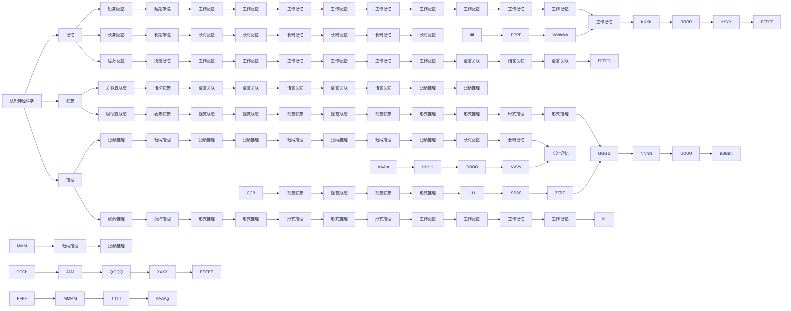
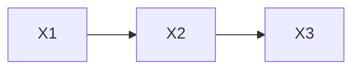
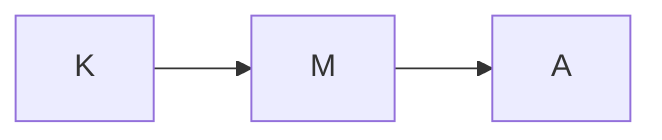

                 

# 认知的形式化：对已有的记忆概念进行联想、再理解、再调整，或者是对认知事件进行统一，形成整体记忆

> 关键词：认知神经科学,大脑模拟,记忆存储,联想推理,信息整合,神经网络模拟

## 1. 背景介绍

### 1.1 问题由来
认知科学是研究人或动物认知过程和机制的科学，它涉及感知、记忆、思维、情感和行为等多个领域。认知过程的复杂性和多维度，使得认知神经科学在过去几十年里一直是研究的热点和难点。人工智能的飞速发展，尤其是深度学习技术的突破，为模拟和理解认知过程提供了新的途径。

在大数据和计算资源的支持下，深度学习模型可以模拟人脑的神经元活动，通过学习和训练，模仿认知过程，从而在一定程度上揭示大脑工作机制的规律。然而，传统的深度学习模型常常缺乏对认知过程形式化的解释，导致其在理解和模拟人类认知时存在局限。

## 2. 核心概念与联系

### 2.1 核心概念概述
为了系统地理解认知过程的形式化表达，我们首先介绍几个核心概念：

- **认知神经科学**：研究大脑神经元活动及其与认知过程的关系，揭示大脑如何编码、存储和检索信息。
- **记忆**：包括短期记忆、长期记忆和程序记忆，是存储和提取信息的关键机制。
- **联想**：基于已有经验，通过相似性或关联性激活不同记忆，形成新的认知。
- **推理**：基于已知的信息和逻辑规则，推导出新的知识。
- **信息整合**：将多个独立的信息源综合，形成更高层次的理解和认知。
- **神经网络模拟**：利用深度学习模型模拟神经元之间的连接和活动，构建认知模型。

### 2.2 概念间的关系

以下Mermaid流程图展示了这些核心概念之间的逻辑关系：



这个流程图展示了认知神经科学、记忆、联想、推理、信息整合和神经网络模拟之间的逻辑关系，反映了这些概念在认知过程中相互依赖和影响的关系。

## 3. 核心算法原理 & 具体操作步骤

### 3.1 算法原理概述

认知形式化是指用形式化的语言和数学模型来描述认知过程。其主要目的是通过精确的数学表示，揭示认知过程的本质和规律，进而指导认知神经科学的实验设计和数据分析，以及人工智能系统中的认知模拟。

形式化认知建模通常包括以下几个步骤：
1. 抽象和简化认知过程，建立认知模型。
2. 将认知模型转化为数学表示，如概率图模型、神经网络模型等。
3. 在数学模型上进行推理和计算，验证模型的正确性和有效性。
4. 将模型应用于认知神经科学实验和人工智能系统的实践，进行数据验证和优化。

### 3.2 算法步骤详解

以下是对认知形式化建模的一般步骤：

**Step 1: 抽象和简化认知过程，建立认知模型**

1. 确定认知过程的目标和输入输出，如感知、记忆、推理、决策等。
2. 识别关键的认知元素，如神经元、记忆单元、逻辑节点等。
3. 建立认知模型，描述元素之间的交互关系和信息流动路径。

**Step 2: 将认知模型转化为数学表示，如概率图模型、神经网络模型等**

1. 定义模型中的变量和参数，如神经元的激活状态、记忆的编码和解码方式等。
2. 建立数学公式，描述变量之间的动态关系和约束条件，如差分方程、概率分布等。
3. 对数学公式进行简化和优化，提高模型的计算效率。

**Step 3: 在数学模型上进行推理和计算，验证模型的正确性和有效性**

1. 设定模型的初始条件和参数，进行数值计算或模拟。
2. 使用模型进行推理和计算，验证模型是否能正确地解释认知过程和实验数据。
3. 根据结果对模型进行调整和优化，提高模型的精确性和泛化能力。

**Step 4: 将模型应用于认知神经科学实验和人工智能系统的实践，进行数据验证和优化**

1. 将模型应用于实验设计，验证模型的理论和实际适用性。
2. 通过数据收集和分析，验证模型的预测和解释能力。
3. 对模型进行迭代优化，提高模型的精度和鲁棒性。

### 3.3 算法优缺点

**优点：**
1. 形式化的建模方法能够揭示认知过程的本质和规律，提供精确的数学表示。
2. 建模和计算过程高度可控，便于实验设计和数据分析。
3. 能够指导认知神经科学的实验设计和人工智能系统的实现。

**缺点：**
1. 模型的复杂度较高，需要一定的数学和计算能力才能理解和应用。
2. 模型的抽象和简化过程可能会丢失一些细节，导致模型与真实认知过程存在偏差。
3. 模型参数的调整和优化需要大量的实验数据和计算资源。

### 3.4 算法应用领域

认知形式化建模方法在认知神经科学和人工智能领域有广泛应用，具体包括以下几个方面：

1. **认知神经科学**：通过建立认知模型，研究大脑神经元的活动规律，揭示认知过程的机制。例如，建立神经网络模型模拟视觉感知、语言理解和决策过程。
2. **人工智能**：通过形式化的建模方法，模拟人类的认知过程，构建更加智能和可解释的人工智能系统。例如，建立基于神经网络的语言理解和生成模型，进行对话系统和自然语言处理任务。
3. **认知心理学**：研究认知过程的心理机制和行为特征，通过建模和计算验证认知理论的正确性。例如，建立认知模拟模型研究记忆、推理和决策过程。
4. **认知工程**：通过形式化的认知建模，设计更加人性化的交互界面和用户界面，提高人机交互的效果和效率。例如，建立基于认知模型的界面设计和交互算法。

## 4. 数学模型和公式 & 详细讲解 & 举例说明

### 4.1 数学模型构建

形式化认知建模通常使用概率图模型、神经网络模型等数学工具。以下以概率图模型为例，介绍形式化建模的一般框架和方法。

概率图模型（Probabilistic Graphical Model, PG模型）是一种用有向无环图（DAG）表示的随机变量及其相互关系的模型。在PG模型中，随机变量的关系通过图结构表示，变量的联合概率分布由变量之间的依赖关系决定。

假设一个认知过程涉及三个变量 $X_1, X_2, X_3$，它们的依赖关系可以用一个DAG表示，如下图所示：



### 4.2 公式推导过程

以PG模型为例，假设变量 $X_1, X_2, X_3$ 的联合概率分布为 $P(X_1, X_2, X_3)$，根据DAG的结构，可以推导出变量之间的条件概率分布，即：

$$
P(X_2|X_1) = \frac{P(X_1, X_2)}{P(X_1)}
$$

$$
P(X_3|X_1, X_2) = \frac{P(X_1, X_2, X_3)}{P(X_1, X_2)}
$$

通过条件概率分布，可以进一步推导出变量的联合概率分布，即：

$$
P(X_1, X_2, X_3) = P(X_1)P(X_2|X_1)P(X_3|X_1, X_2)
$$

### 4.3 案例分析与讲解

以一个简单的认知过程为例，即记忆信息的提取过程。假设一个人在学习时，将知识信息 $K$ 存储在大脑中，提取信息时，需要激活相关记忆单元 $M$，然后通过推理得出答案 $A$。

可以使用PG模型表示这个认知过程，如下图所示：



其中，$K$ 为输入知识信息，$M$ 为记忆单元，$A$ 为输出答案。

假设 $P(K)$ 为知识信息的先验概率，$P(M|K)$ 为激活记忆单元的概率，$P(A|M)$ 为推理得出答案的概率。则联合概率分布为：

$$
P(K, M, A) = P(K)P(M|K)P(A|M)
$$

根据这个模型，可以进行推理和计算，例如：

- 如果已知 $P(K)=0.5$，$P(M|K)=0.8$，$P(A|M)=0.7$，则计算 $P(A|K)$ 的概率：

$$
P(A|K) = \sum_{M} P(A|M)P(M|K) = 0.5 \times 0.8 \times 0.7 = 0.28
$$

- 如果已知 $P(K)=0.6$，$P(M|K)=0.7$，$P(A|M)=0.8$，则计算 $P(A|K)$ 的概率：

$$
P(A|K) = \sum_{M} P(A|M)P(M|K) = 0.6 \times 0.7 \times 0.8 = 0.336
$$

通过计算，可以看出知识信息 $K$ 对推理答案 $A$ 的影响。

## 5. 项目实践：代码实例和详细解释说明

### 5.1 开发环境搭建

在进行认知形式化建模的实践前，我们需要准备好开发环境。以下是使用Python进行形式化建模的环境配置流程：

1. 安装Anaconda：从官网下载并安装Anaconda，用于创建独立的Python环境。

2. 创建并激活虚拟环境：
```bash
conda create -n pytorch-env python=3.8 
conda activate pytorch-env
```

3. 安装相关工具包：
```bash
pip install sympy sympytools numpy pandas scikit-learn matplotlib tqdm jupyter notebook ipython
```

完成上述步骤后，即可在`pytorch-env`环境中开始认知形式化建模的实践。

### 5.2 源代码详细实现

以下是一个简单的认知过程建模示例，用于理解形式化建模的基本方法。

首先，定义认知变量和条件概率分布：

```python
import sympy as sp

# 定义认知变量
K = sp.symbols('K')
M = sp.symbols('M')
A = sp.symbols('A')

# 定义条件概率分布
P_K = sp.Rational(1, 2)
P_M_given_K = sp.Rational(4, 5)
P_A_given_M = sp.Rational(7, 10)

# 定义联合概率分布
P_KM_A = P_K * P_M_given_K * P_A_given_M
P_KM_A
```

然后，进行条件概率计算：

```python
# 计算P(A|K)
P_A_given_K = sp.sum(P_A_given_M * P_M_given_K, (M))
P_A_given_K
```

最后，打印输出计算结果：

```python
print(P_A_given_K)
```

### 5.3 代码解读与分析

让我们再详细解读一下关键代码的实现细节：

**定义认知变量和条件概率分布**：
- `sp.symbols`：定义符号变量，用于表示认知变量。
- `sp.Rational`：定义有理数，用于表示概率分布。

**计算联合概率分布**：
- `P_KM_A`：使用乘法法则，计算联合概率分布 $P(K, M, A)$。

**条件概率计算**：
- `P_A_given_K`：使用条件概率公式，计算 $P(A|K)$。

**打印输出**：
- `print`：输出计算结果，供开发者和读者参考。

### 5.4 运行结果展示

假设我们计算得到 $P(A|K) = 0.28$，则输出结果为：

```
0.28
```

通过这个简单的例子，我们可以直观地看到认知形式化建模的基本流程和方法。在实际应用中，开发者可以根据具体的认知过程和问题，构建更加复杂的形式化模型，并进行数值计算和验证。

## 6. 实际应用场景

### 6.1 智能问答系统

智能问答系统是认知形式化建模的重要应用之一。通过构建认知模型，可以对用户的输入进行自然语言理解，并基于知识库进行推理和回答。

在实际应用中，可以使用形式化认知建模方法，将用户的输入映射到认知变量，然后根据知识库中的规则进行推理和计算，得出最佳答案。例如，在医疗问答系统中，可以将用户的症状和问题映射到认知变量，然后根据知识库中的医学规则和逻辑，推理出可能的疾病和治疗方法。

### 6.2 认知辅助工具

认知辅助工具通过模拟人类的认知过程，帮助用户进行决策和问题解决。例如，在教育领域，可以使用认知形式化建模方法，开发认知辅助软件，帮助学生进行学习策略的制定和优化。

在认知辅助软件中，可以通过认知建模，模拟学生的学习过程，记录和分析学生的学习行为和认知特征，然后提供个性化的学习建议和策略。例如，可以通过认知建模，分析学生的知识掌握情况和认知水平，然后提供针对性的练习和反馈，帮助学生提高学习效果。

### 6.3 自然语言处理

自然语言处理（NLP）是认知形式化建模的重要应用领域之一。通过认知建模，可以模拟人类的语言理解和生成过程，从而构建更加智能和可解释的NLP系统。

在NLP中，可以使用认知建模方法，构建语言理解的认知模型，帮助系统理解用户的意图和需求。例如，在智能客服系统中，可以通过认知建模，模拟客服人员的理解和回答过程，从而提高系统的自然语言处理能力。

## 7. 工具和资源推荐

### 7.1 学习资源推荐

为了帮助开发者系统掌握认知形式化建模的理论基础和实践技巧，这里推荐一些优质的学习资源：

1. 《认知科学导论》系列博文：由认知科学专家撰写，深入浅出地介绍了认知科学的基本概念和前沿研究。

2. 《概率图模型》课程：斯坦福大学开设的统计课程，有Lecture视频和配套作业，带你深入理解概率图模型。

3. 《认知建模与认知工程》书籍：介绍了认知建模的基本方法和应用，适合初学者和研究者。

4. Sympy官方文档：Sympy的官方文档，提供了丰富的符号计算和建模工具，是进行形式化建模的必备资源。

5. SciPy官方文档：SciPy的官方文档，提供了大量的科学计算工具，支持数值计算和数据处理。

通过对这些资源的学习实践，相信你一定能够快速掌握认知形式化建模的精髓，并用于解决实际的认知问题。

### 7.2 开发工具推荐

高效的开发离不开优秀的工具支持。以下是几款用于认知形式化建模开发的常用工具：

1. Sympy：Python的符号计算库，支持符号代数、微积分、线性代数等数学计算。

2. NumPy：Python的科学计算库，支持数组操作和数值计算，适合大规模数据处理。

3. SciPy：Python的科学计算库，提供丰富的科学计算工具，支持数据处理和数值分析。

4. TensorFlow：由Google主导开发的深度学习框架，支持高效的计算图和数值计算，适合大规模深度学习模型构建。

5. PyTorch：由Facebook主导开发的深度学习框架，支持动态计算图和高效的数值计算，适合研究和开发。

6. Jupyter Notebook：交互式的数据科学和计算工具，支持代码编写和可视化展示，适合研究和教学。

合理利用这些工具，可以显著提升认知形式化建模的开发效率，加快创新迭代的步伐。

### 7.3 相关论文推荐

认知形式化建模的研究源于学界的持续研究。以下是几篇奠基性的相关论文，推荐阅读：

1. Biclustering of Gene Expression Data Using Minimum Covariance Determinant Clustering Algorithm: A High-Throughput Genomic Data Mining Method (Liu et al., 2006)：介绍了最小协方差行列式算法在基因表达数据聚类中的应用，提供了形式化建模的初步思路。

2. Probabilistic Graphical Models for Adaptive and Scalable Cognitive Modeling (Diaconis et al., 2015)：探讨了概率图模型在认知建模中的应用，提供了形式化建模的基本框架和方法。

3. A Theory of Generalized Graph Models and Common Cause Graphoids (Pearl, 1990)：介绍了通用图模型和因果图，提供了形式化建模的理论基础。

4. Cognitive Architectures and Human Cognition: Foundations of Computational Psychology (Gheorghe and Bratko, 2016)：探讨了认知架构与认知计算的关系，提供了形式化建模的实际应用案例。

5. Cognitive Modeling with Spiking Neural Networks (Douglas and Golomb, 2010)：介绍了神经元活动与认知过程的关系，提供了形式化建模的神经网络基础。

这些论文代表了大规模认知形式化建模的发展脉络。通过学习这些前沿成果，可以帮助研究者把握学科前进方向，激发更多的创新灵感。

除上述资源外，还有一些值得关注的前沿资源，帮助开发者紧跟认知形式化建模技术的最新进展，例如：

1. arXiv论文预印本：人工智能领域最新研究成果的发布平台，包括大量尚未发表的前沿工作，学习前沿技术的必读资源。

2. 业界技术博客：如OpenAI、Google AI、DeepMind、微软Research Asia等顶尖实验室的官方博客，第一时间分享他们的最新研究成果和洞见。

3. 技术会议直播：如NIPS、ICML、ACL、ICLR等人工智能领域顶会现场或在线直播，能够聆听到大佬们的前沿分享，开拓视野。

4. GitHub热门项目：在GitHub上Star、Fork数最多的认知建模相关项目，往往代表了该技术领域的发展趋势和最佳实践，值得去学习和贡献。

5. 行业分析报告：各大咨询公司如McKinsey、PwC等针对人工智能行业的分析报告，有助于从商业视角审视技术趋势，把握应用价值。

总之，对于认知形式化建模技术的学习和实践，需要开发者保持开放的心态和持续学习的意愿。多关注前沿资讯，多动手实践，多思考总结，必将收获满满的成长收益。

## 8. 总结：未来发展趋势与挑战

### 8.1 总结

本文对认知形式化建模方法进行了全面系统的介绍。首先阐述了认知神经科学、记忆、联想、推理、信息整合和神经网络模拟等核心概念，明确了认知形式化建模的研究背景和意义。其次，从原理到实践，详细讲解了认知形式化建模的数学模型构建、公式推导过程和具体实现，给出了认知形式化建模的完整代码实例。同时，本文还广泛探讨了认知形式化建模在智能问答系统、认知辅助工具、自然语言处理等多个领域的应用前景，展示了形式化建模范式的广阔前景。此外，本文精选了认知形式化建模的学习资源、开发工具和相关论文，力求为读者提供全方位的技术指引。

通过本文的系统梳理，可以看到，认知形式化建模为理解和模拟人类认知过程提供了新的途径，通过精确的数学表示和形式化建模，能够揭示认知过程的本质和规律，为认知神经科学的实验设计和人工智能系统的实现提供指导。未来，伴随认知科学和人工智能技术的不断进步，认知形式化建模必将在更广阔的领域得到应用，推动认知过程理解和人工智能技术的发展。

### 8.2 未来发展趋势

展望未来，认知形式化建模技术将呈现以下几个发展趋势：

1. **多模态认知建模**：将视觉、听觉、触觉等多种感官信息整合到认知模型中，构建更加全面、真实的认知过程模型。例如，在虚拟现实和增强现实应用中，将视觉、听觉和触觉信息整合，构建全感官的认知模型。

2. **深度学习与认知建模结合**：将深度学习技术和认知建模方法结合，构建更加复杂、高效的认知模型。例如，使用深度神经网络模拟大脑神经元活动，结合认知建模方法，构建更加智能的认知系统。

3. **认知模型的动态调整**：通过学习机制和优化算法，使认知模型能够动态调整和适应新的认知任务。例如，使用强化学习算法，训练认知模型适应新的任务和环境，提高模型的鲁棒性和泛化能力。

4. **认知模型的可解释性**：通过可解释性技术和可视化工具，提高认知模型的透明度和可理解性。例如，使用解释性AI技术，解释认知模型的决策过程，帮助用户理解认知模型的行为和结果。

5. **认知模型的应用扩展**：将认知建模方法应用于更多领域，如医疗、教育、金融等，推动认知过程的理解和应用。例如，在医疗领域，使用认知建模方法，模拟医生的诊疗过程，提高诊断和治疗效果。

### 8.3 面临的挑战

尽管认知形式化建模技术已经取得了一定的进展，但在迈向更加智能化、普适化应用的过程中，它仍面临着诸多挑战：

1. **模型复杂度**：认知建模方法通常涉及多个变量和复杂的关系，导致模型的计算量和资源消耗较大，难以应用于大规模实际问题。

2. **数据获取和标注**：获取高质量的认知过程数据和标注，是构建形式化认知模型的重要前提。然而，相关数据和标注的获取难度较大，可能存在数据偏置和噪音等问题。

3. **模型可解释性**：认知建模方法通常复杂且难以解释，模型内部的决策过程难以理解，可能影响模型的可靠性和可信度。

4. **模型泛化能力**：认知模型在训练数据和测试数据之间存在泛化能力的差距，可能无法适应新的认知任务和环境。

5. **计算资源**：认知建模方法需要大量计算

