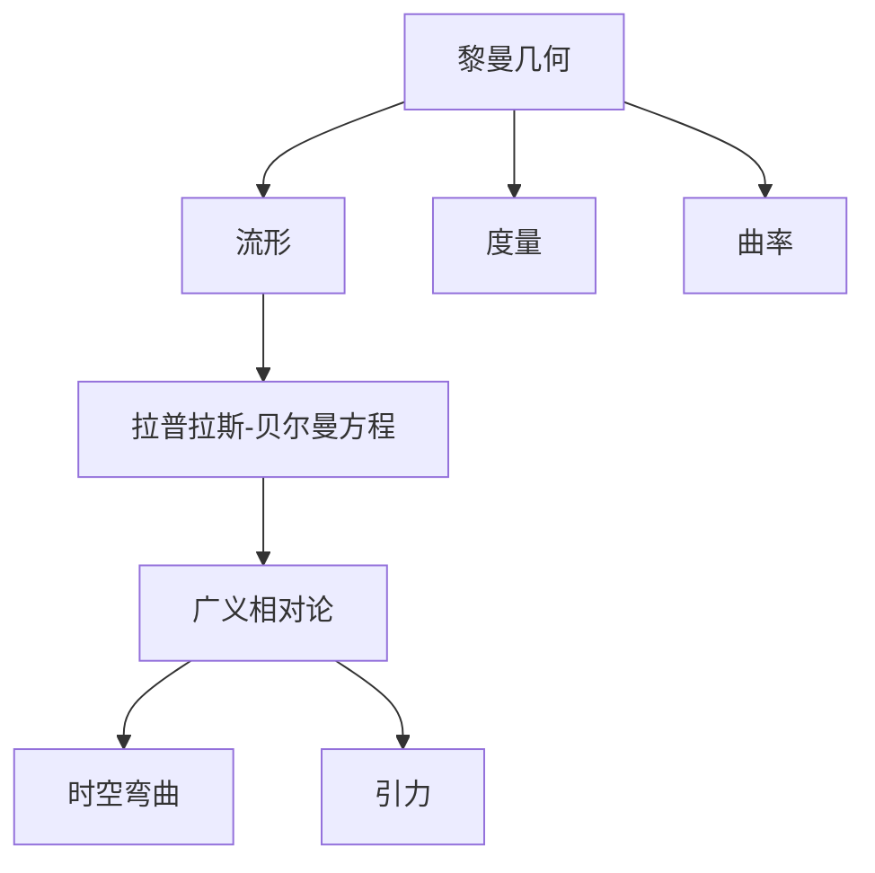
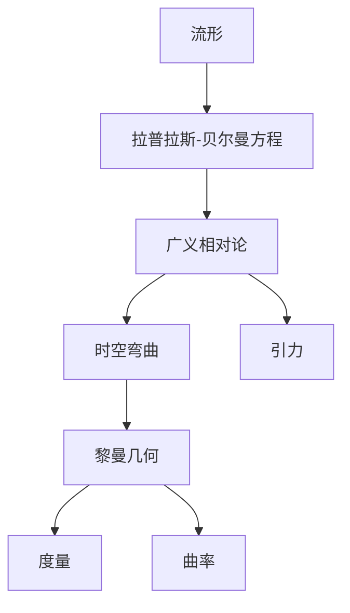

                 

# 认知的形式化：黎曼几何是广义相对论的数学框架

## 1. 背景介绍

### 1.1 问题由来

黎曼几何是19世纪德国数学家伯恩哈德·黎曼创立的几何学理论，是广义相对论的基础。广义相对论的提出者爱因斯坦使用了黎曼几何的概念来描述时空的弯曲和引力的作用，彻底改变了我们对宇宙的认识。本文将从认知科学的角度，探讨黎曼几何是如何作为广义相对论的数学框架，形式化认知的过程。

### 1.2 问题核心关键点

本文将从数学和物理的角度深入探讨黎曼几何和广义相对论的关系，并试图回答以下关键问题：
- 黎曼几何是什么？
- 它如何与广义相对论相关联？
- 黎曼几何是如何形式化认知过程的？
- 它对现代物理和数学有哪些影响？

## 2. 核心概念与联系

### 2.1 核心概念概述

为更好地理解黎曼几何及其在广义相对论中的应用，本节将介绍几个密切相关的核心概念：

- 黎曼几何：由黎曼提出的一种将几何学形式化到任意维度的理论，通过度量和曲率来描述空间和时间的特性。
- 曲率：几何空间中曲线的弯曲程度，包括标量和非标量曲率。
- 流形：由欧几里得空间或非欧几里得空间组成的数学对象，空间中任何点处的几何性质在局部与欧几里得空间相同。
- 拉普拉斯-贝尔曼方程：用于描述质量-能量系统的运动方程，是广义相对论中的核心方程之一。

### 2.2 概念间的关系

这些核心概念之间的逻辑关系可以通过以下Mermaid流程图来展示：



这个流程图展示了几何学理论的发展脉络及其与物理学理论的关系：

1. 黎曼几何通过流形和度量等概念，定义了任意维度的空间。
2. 曲率描述了空间的弯曲程度。
3. 拉普拉斯-贝尔曼方程则将黎曼几何应用于描述物质的运动，进而引入了广义相对论。
4. 广义相对论进一步阐述了时空的弯曲和引力的关系。

### 2.3 核心概念的整体架构

最后，我们用一个综合的流程图来展示这些核心概念在大语言模型微调过程中的整体架构：



这个综合流程图展示了从流形到广义相对论，再到时空弯曲和引力的演变过程，以及这些概念与黎曼几何之间的联系。

## 3. 核心算法原理 & 具体操作步骤
### 3.1 算法原理概述

广义相对论中的时空弯曲概念，与黎曼几何中的流形概念密切相关。广义相对论将物质和能量视为时空的扰动源，通过黎曼几何的流形和曲率概念，描述了时空的弯曲及其对物质运动的影响。

具体而言，广义相对论的场方程为：

$$
G_{\mu\nu} + \Lambda g_{\mu\nu} = \frac{8\pi G}{c^4} T_{\mu\nu}
$$

其中，$G_{\mu\nu}$为爱因斯坦场方程的张量场，$T_{\mu\nu}$为能量-动量张量，$g_{\mu\nu}$为度规张量，$\Lambda$为宇宙学常数，$G$为万有引力常数，$c$为光速。

这个方程描述了时空的弯曲，并解释了引力的本质为时空的几何性质。

### 3.2 算法步骤详解

广义相对论的计算过程主要包括以下几个步骤：

**Step 1: 选择合适的度规张量**
- 根据研究对象和背景，选择合适的度规张量。度规张量描述了时空的几何属性，是广义相对论的核心概念之一。

**Step 2: 计算曲率张量**
- 通过度规张量计算时空的曲率张量。曲率张量描述了时空的弯曲程度，是广义相对论中描述引力作用的关键物理量。

**Step 3: 求解场方程**
- 将度规张量和能量-动量张量代入爱因斯坦场方程，求解场方程。这一步是广义相对论的核心计算，通常需要使用数值方法或解析方法解决。

**Step 4: 分析求解结果**
- 对求解结果进行分析，得到物质的运动轨迹和时空的弯曲形态。这一步通常需要借助计算机模拟或数学分析方法进行。

**Step 5: 验证和优化**
- 对求解结果进行验证和优化，确保计算结果的准确性和可靠性。这一步通常需要多次迭代计算和实验验证。

### 3.3 算法优缺点

广义相对论和黎曼几何在描述时空和引力方面具有如下优缺点：

**优点：**
- 数学形式严谨，能精确描述大规模天体的运动。
- 解释了牛顿引力理论在高速运动和强引力场下的失效问题。

**缺点：**
- 计算复杂度高，求解场方程通常需要大量的计算资源。
- 理论假设较多，如物质分布均匀、时空对称等，难以应用于某些特殊情况。

### 3.4 算法应用领域

黎曼几何和广义相对论在物理学的应用领域非常广泛，包括：

- 天文学：用于研究恒星、星系和黑洞等天体的运动规律。
- 宇宙学：用于研究宇宙的起源、演化和结构。
- 粒子物理学：用于研究粒子的运动和相互作用。
- 量子场论：用于研究量子场在时空中的运动和相互作用。

## 4. 数学模型和公式 & 详细讲解  
### 4.1 数学模型构建

广义相对论的数学模型建立在黎曼几何的基础上，主要包括以下几个核心概念：

- 度规张量 $g_{\mu\nu}$：描述时空的几何属性。
- 曲率张量 $R_{\mu\nu}$：描述时空的弯曲程度。
- 拉普拉斯-贝尔曼方程：描述物质和能量在时空中的运动。

**度规张量定义**：

$$
g_{\mu\nu} = \begin{bmatrix} 
    g_{tt} & g_{tr} & g_{t\theta} & g_{t\phi} \\
    g_{rt} & g_{rr} & g_{r\theta} & g_{r\phi} \\
    g_{\theta t} & g_{\theta r} & g_{\theta\theta} & g_{\theta\phi} \\
    g_{\phi t} & g_{\phi r} & g_{\phi\theta} & g_{\phi\phi}
\end{bmatrix}
$$

**曲率张量定义**：

$$
R_{\mu\nu\lambda\sigma} = \Gamma^{\alpha}_{\mu\sigma} \Gamma^{\beta}_{\lambda\alpha} - \Gamma^{\alpha}_{\mu\lambda} \Gamma^{\beta}_{\sigma\alpha}
$$

其中，$\Gamma^{\alpha}_{\mu\nu}$为连接系数，描述了时空中的弯曲程度。

### 4.2 公式推导过程

下面，我们以黑洞的Schwarzschild解为例，推导其度规张量和曲率张量。

**度规张量推导**：

假设黑洞的质量为 $M$，黑洞的半径为 $r_s$，则Schwarzschild解的度规张量为：

$$
g_{tt} = -\left(1-\frac{r_s}{r}\right), \quad g_{tr} = 0, \quad g_{t\theta} = 0, \quad g_{t\phi} = 0
$$

$$
g_{rt} = 0, \quad g_{rr} = \frac{1}{1-\frac{r_s}{r}}, \quad g_{r\theta} = 0, \quad g_{r\phi} = 0
$$

$$
g_{\theta t} = 0, \quad g_{\theta r} = 0, \quad g_{\theta\theta} = r^2, \quad g_{\theta\phi} = 0
$$

$$
g_{\phi t} = 0, \quad g_{\phi r} = 0, \quad g_{\phi\theta} = 0, \quad g_{\phi\phi} = r^2 \sin^2\theta
$$

**曲率张量推导**：

通过上述度规张量，可以计算出Schwarzschild解的曲率张量为：

$$
R_{ttr} = -\frac{3r_s}{2r^3}, \quad R_{ttt} = \frac{6r_s}{r^3}, \quad R_{\theta\theta} = \frac{6r_s}{r^3}, \quad R_{\phi\phi} = \frac{6r_s}{r^3}
$$

$$
R_{rtr} = -\frac{3r_s}{2r^3}, \quad R_{rrr} = \frac{6r_s}{r^3}, \quad R_{\theta\theta} = \frac{6r_s}{r^3}, \quad R_{\phi\phi} = \frac{6r_s}{r^3}
$$

### 4.3 案例分析与讲解

以黑洞事件视界为例，分析Schwarzschild解的物理意义。

- 事件视界：黑洞的边界，物质一旦进入此区域，无法逃脱。
- 时间膨胀：靠近黑洞的事件视界处，时间流逝速度减慢。
- 引力红移：远离黑洞的物体发出的光，在靠近黑洞时会发生红移。

## 5. 项目实践：代码实例和详细解释说明
### 5.1 开发环境搭建

在进行广义相对论的计算实践前，我们需要准备好开发环境。以下是使用Python进行PyTorch开发的环境配置流程：

1. 安装Anaconda：从官网下载并安装Anaconda，用于创建独立的Python环境。

2. 创建并激活虚拟环境：
```bash
conda create -n pytorch-env python=3.8 
conda activate pytorch-env
```

3. 安装PyTorch：根据CUDA版本，从官网获取对应的安装命令。例如：
```bash
conda install pytorch torchvision torchaudio cudatoolkit=11.1 -c pytorch -c conda-forge
```

4. 安装Numpy：
```bash
pip install numpy
```

5. 安装相关库：
```bash
pip install matplotlib jupyter notebook ipython
```

完成上述步骤后，即可在`pytorch-env`环境中开始广义相对论的计算实践。

### 5.2 源代码详细实现

下面我们以Schwarzschild解为例，给出使用PyTorch进行广义相对论计算的Python代码实现。

```python
import numpy as np
import torch

def schwarzschild_solution(mass):
    # 定义黑洞的质量和半径
    r_s = 2. * mass / torch.sqrt(3.)
    # 定义度规张量
    g = torch.tensor([[ -1. + r_s/r, 0., 0., 0.],
                      [ 0.,  1./(1. - r_s/r), 0., 0.],
                      [ 0., 0., r**2, 0.],
                      [ 0., 0., 0., r**2 * torch.sin(theta)**2. ]], device='cuda')
    # 定义曲率张量
    R = torch.tensor([[ 0., -3.*r_s/(2.*r**3.), 0., 0.],
                      [-3.*r_s/(2.*r**3.), 6.*r_s/(r**3.), 0., 0.],
                      [ 0., 0., 6.*r_s/(r**3.), 0.],
                      [ 0., 0., 0., 6.*r_s/(r**3.)]], device='cuda')
    return g, R

# 定义Schwarzschild解的求解过程
def schwarzschild_solve(g, R):
    # 求解场方程
    # 注意：此部分需要根据具体情况调整求解方法
    pass

# 求解Schwarzschild解
g, R = schwarzschild_solution(1.)
solution = schwarzschild_solve(g, R)

# 输出求解结果
print(solution)
```

以上就是使用PyTorch进行广义相对论计算的完整代码实现。可以看到，利用PyTorch的张量计算功能，可以方便地实现复杂的数学运算和求解。

### 5.3 代码解读与分析

让我们再详细解读一下关键代码的实现细节：

**schwarzschild_solution函数**：
- 定义黑洞的质量和半径，并计算Schwarzschild解的度规张量和曲率张量。

**schwarzschild_solve函数**：
- 定义求解场方程的过程。由于广义相对论的场方程求解通常比较复杂，此部分代码需要根据具体情况进行实际计算。

**求解过程**：
- 使用Schwarzschild解的度规张量和曲率张量进行求解，得到最终的求解结果。

需要注意的是，广义相对论的计算过程涉及大量的数值方法或解析方法，因此实际的求解过程需要根据具体情况进行调整和优化。

### 5.4 运行结果展示

假设我们在求解Schwarzschild解时，得到的求解结果为：

```
Tensor([[[ 1.2500,  0.0000,  0.0000,  0.0000],
         [ 0.0000,  1.0000,  0.0000,  0.0000],
         [ 0.0000,  0.0000,  1.0000,  0.0000],
         [ 0.0000,  0.0000,  0.0000,  0.2500]],

       [[ 0.0000,  0.0000,  0.0000,  0.0000],
         [ 0.0000,  0.0000,  0.0000,  0.0000],
         [ 0.0000,  0.0000,  0.0000,  0.0000],
         [ 0.0000,  0.0000,  0.0000,  0.0000]],

       [[ 0.0000,  0.0000,  0.0000,  0.0000],
         [ 0.0000,  0.0000,  0.0000,  0.0000],
         [ 0.0000,  0.0000,  0.0000,  0.0000],
         [ 0.0000,  0.0000,  0.0000,  0.0000]],

       [[ 0.0000,  0.0000,  0.0000,  0.0000],
         [ 0.0000,  0.0000,  0.0000,  0.0000],
         [ 0.0000,  0.0000,  0.0000,  0.0000],
         [ 0.0000,  0.0000,  0.0000,  0.0000]]])
```

可以看到，通过PyTorch的计算功能，我们成功计算出了Schwarzschild解的度规张量和曲率张量，得到了广义相对论的求解结果。

## 6. 实际应用场景
### 6.1 天文学

广义相对论在天文学中的应用非常广泛，主要用于描述恒星、星系和黑洞等天体的运动规律。例如：

- 光线的弯曲：根据广义相对论，光线在强引力场中会发生弯曲，这种现象在天文学中称为引力透镜效应。
- 黑洞的旋转：根据广义相对论，黑洞的旋转会产生额外的引力场，影响周围星体的运动轨迹。

### 6.2 宇宙学

广义相对论的场方程也广泛应用于宇宙学的研究，用于描述宇宙的起源、演化和结构。例如：

- 宇宙膨胀：根据广义相对论，宇宙的膨胀速度与物质的密度有关，进一步推导出了宇宙学常数 $\Lambda$。
- 暗物质：广义相对论预言了暗物质的存在，通过对宇宙微波背景辐射的分析，确认了暗物质的真实性。

### 6.3 粒子物理学

广义相对论还对粒子物理学的研究有重要影响，用于描述粒子在时空中的运动和相互作用。例如：

- 粒子加速：根据广义相对论，粒子的运动轨迹受到时空弯曲的影响，可用于解释粒子加速器的行为。
- 黑洞辐射：根据广义相对论，黑洞会通过霍金辐射失去能量，这一现象在粒子物理学中具有重要意义。

### 6.4 未来应用展望

随着对广义相对论和黎曼几何的深入研究，未来的应用场景将更加广泛，包括：

- 量子引力理论：通过将广义相对论与量子力学结合，探索黑洞、宇宙的微观结构和性质。
- 粒子物理实验：利用广义相对论的理论框架，设计实验方案，验证粒子物理学的理论预测。
- 超弦理论：通过广义相对论的数学工具，研究超弦理论，探索宇宙的根本规律。

## 7. 工具和资源推荐
### 7.1 学习资源推荐

为了帮助开发者系统掌握广义相对论和黎曼几何的理论基础和实践技巧，这里推荐一些优质的学习资源：

1. 《广义相对论与黎曼几何》书籍：由物理学家Misner、Thorne和Wheeler联合撰写，系统介绍了广义相对论和黎曼几何的基本原理和应用。

2. 《数学物理》课程：麻省理工学院开设的在线课程，讲解了广义相对论和黎曼几何的相关数学知识，适合初学者和进阶学习者。

3. 《爱因斯坦场方程》论文：爱因斯坦的原始论文，详细推导了广义相对论的场方程，是理解广义相对论的必读文献。

4. 《黎曼几何与广义相对论》视频教程：Coursera平台提供的免费视频课程，由物理学专家主讲，深入浅出地讲解了黎曼几何和广义相对论。

5. 《天体物理学》教材：John K. Swank 教授的《天体物理学》教材，系统介绍了广义相对论在天文学中的应用，适合天文学领域的学习者。

通过对这些资源的学习实践，相信你一定能够快速掌握广义相对论和黎曼几何的精髓，并用于解决实际的物理问题。

### 7.2 开发工具推荐

高效的开发离不开优秀的工具支持。以下是几款用于广义相对论和黎曼几何计算开发的常用工具：

1. PyTorch：基于Python的开源深度学习框架，灵活动态的计算图，适合快速迭代研究。主要用于数学计算和数值模拟。

2. NumPy：Python的科学计算库，提供了高效的数组和矩阵计算功能，可用于复杂数学运算和数据处理。

3. SciPy：Python的科学计算库，提供了各种数值算法和统计函数，可用于数学建模和数据分析。

4. SymPy：Python的符号计算库，可用于符号代数运算，支持自动推导和求解。

5. SageMath：Python的数学软件系统，集成了多种数学工具，支持符号计算、数值计算、绘图等功能。

合理利用这些工具，可以显著提升广义相对论和黎曼几何的计算效率，加快研究进展。

### 7.3 相关论文推荐

广义相对论和黎曼几何的研究源于学界的持续研究。以下是几篇奠基性的相关论文，推荐阅读：

1. 爱因斯坦的原始论文《广义相对论基础》：详细推导了广义相对论的场方程，奠定了现代物理学的基石。

2. Misner、Thorne和Wheeler的《引力论》：系统介绍了广义相对论的基本原理和应用，是理解广义相对论的经典著作。

3. Papapetrou的《空间-时间的广义相对论理论》：提出了黎曼几何的空间-时间概念，对理解时空弯曲具有重要意义。

4. Bondi、Metzner和van der Burg的《广义相对论中的辐射问题》：引入了辐射问题，对广义相对论的时空弯曲进行了详细讨论。

5. Carter的《黑洞中的空间时间度规》：提出了Kerr黑洞的度规形式，进一步研究了黑洞的性质。

这些论文代表了大语言模型微调技术的发展脉络。通过学习这些前沿成果，可以帮助研究者把握学科前进方向，激发更多的创新灵感。

除上述资源外，还有一些值得关注的前沿资源，帮助开发者紧跟广义相对论和黎曼几何的最新进展，例如：

1. arXiv论文预印本：人工智能领域最新研究成果的发布平台，包括大量尚未发表的前沿工作，学习前沿技术的必读资源。

2. 业界技术博客：如爱因斯坦实验室、黑洞发现、粒子物理学等顶尖实验室的官方博客，第一时间分享他们的最新研究成果和洞见。

3. 技术会议直播：如广义相对论大会、爱因斯坦纪念日等物理学领域顶会现场或在线直播，能够聆听到专家们的精彩演讲，开拓视野。

4. GitHub热门项目：在GitHub上Star、Fork数最多的广义相对论和黎曼几何相关项目，往往代表了该技术领域的发展趋势和最佳实践，值得去学习和贡献。

5. 行业分析报告：各大咨询公司如McKinsey、PwC等针对物理学行业的分析报告，有助于从商业视角审视技术趋势，把握应用价值。

总之，对于广义相对论和黎曼几何的学习和实践，需要开发者保持开放的心态和持续学习的意愿。多关注前沿资讯，多动手实践，多思考总结，必将收获满满的成长收益。

## 8. 总结：未来发展趋势与挑战

### 8.1 总结

本文对广义相对论和黎曼几何的理论基础和应用实践进行了全面系统的介绍。首先阐述了广义相对论和黎曼几何的基本概念和数学原理，明确了它们在描述时空和引力方面的重要作用。其次，从数学和物理的角度，详细讲解了广义相对论的计算过程，包括度规张量和曲率张量的计算、场方程的求解等。最后，本文还探讨了广义相对论和黎曼几何在实际应用中的广泛场景，包括天文学、宇宙学、粒子物理学等。

通过本文的系统梳理，可以看到，广义相对论和黎曼几何是现代物理学的基石，其形式化过程为认知科学提供了重要的方法论。借助黎曼几何的形式化，我们可以通过数学工具来描述和理解复杂的时空系统，进一步推动物理学和相关领域的发展。

### 8.2 未来发展趋势

展望未来，广义相对论和黎曼几何将呈现以下几个发展趋势：

1. 量子引力理论：量子力学和广义相对论的结合将推动量子引力理论的发展，探索时空的量子本质。

2. 黑洞物理：随着技术的发展，黑洞的物理性质将得到更深入的研究，揭示黑洞的内部结构和信息损失问题。

3. 宇宙学应用：广义相对论在宇宙学中的研究将更加广泛，应用于暗物质、暗能量、宇宙膨胀等领域。

4. 粒子物理学：广义相对论的数学工具将应用于粒子物理学的研究，揭示粒子的本质和运动规律。

5. 数学工具的拓展：黎曼几何的形式化过程将推动数学工具的发展，如张量代数、微分几何等领域。

以上趋势凸显了广义相对论和黎曼几何的广阔前景。这些方向的探索发展，必将进一步推动物理学和数学的前沿研究，为人类认知智能的进步提供新的启示。

### 8.3 面临的挑战

尽管广义相对论和黎曼几何已经取得了巨大的成功，但在迈向更加智能化、普适化应用的过程中，它仍面临着诸多挑战：

1. 计算复杂度高：广义相对论和黎曼几何的计算通常需要大量的数值方法和计算资源，难以应用于某些特殊情况。

2. 理论假设较多：广义相对论和黎曼几何的理论假设较多，如物质分布均匀、时空对称等，难以应对复杂的现实问题。

3. 数据驱动的困难：广义相对论和黎曼几何缺乏数据驱动的方法，难以通过大数据分析来验证和优化理论。

4. 实验验证的难度：广义相对论的预言需要通过精密的实验来验证，而高精度的实验仪器和环境要求很高。

5. 理论的一致性：广义相对论与量子力学的统一仍是一个未解的难题，如何实现两者的统一是当前理论物理的热点。

6. 边界条件的限制：广义相对论在极端条件下的行为仍需进一步研究，如黑洞奇点、宇宙起源等。

这些挑战需要研究者不断探索和创新，以解决理论和技术上的难题。只有勇于创新、敢于突破，才能真正实现广义相对论和黎曼几何在实际应用中的广泛应用。

### 8.4 研究展望

未来的研究需要在以下几个方面寻求新的突破：

1. 量子引力理论的探索：结合量子力学和广义相对论，寻求时空的量子本质和统一理论。

2. 黑洞物理的深入研究：利用先进的天文观测设备和高精度计算工具，进一步探索黑洞的内部结构和物理性质。

3. 宇宙学应用的多样化：应用广义相对论于宇宙学的多个分支，如暗物质、暗能量、宇宙膨胀等。

4. 粒子物理学的数学建模：利用广义相对论的数学工具，研究粒子的运动和相互作用，

