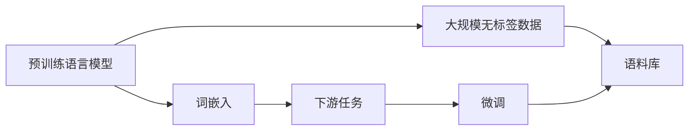
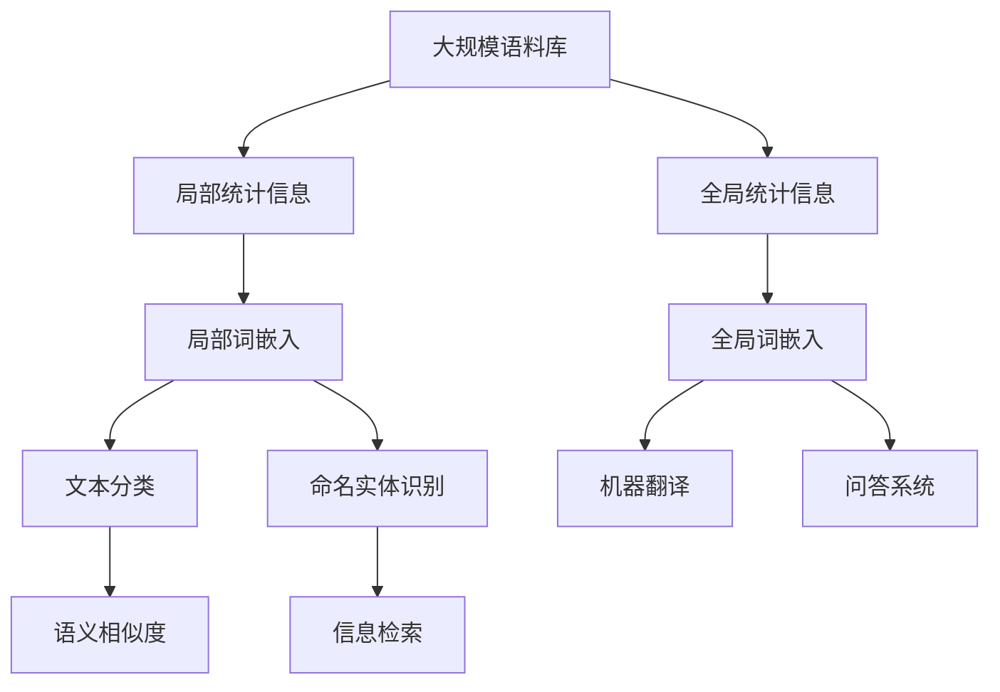
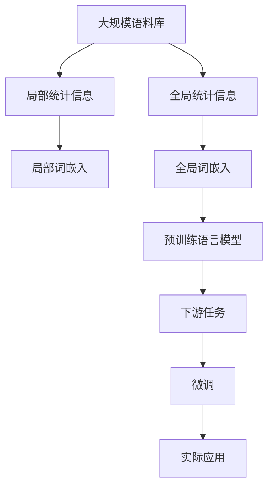

                 

## 1. 背景介绍

在自然语言处理(Natural Language Processing, NLP)领域，词嵌入 (Word Embeddings) 是一种关键的预处理技术，它将自然语言中的单词转化为稠密向量，使得单词之间的语义关系能够被量化表示，从而提升模型的理解能力。词嵌入的开发和应用是现代NLP技术得以蓬勃发展的核心之一。

### 1.1 问题由来
词嵌入技术起源于Word2Vec，一种用于将单词转化为向量的深度学习算法。其主要思想是将单词与向量之间建立起映射关系，使得每个单词都能够表示为一个低维向量。通过这样的映射，单词之间的相似度、语义关系和上下文信息都可以被量化和利用，显著提升了自然语言处理任务的效果。

然而，早期的Word2Vec算法基于局部信息提取，即每个单词都只与周围的单词进行关联，这种单一的局部视角限制了其对于单词上下文语义的理解。为了克服这一问题，GloVe、FastText等基于全局信息提取的词嵌入算法应运而生，进一步拓展了词嵌入技术的应用。

此外，随着深度学习模型的不断发展，BERT、GPT等预训练语言模型也逐渐兴起，这些模型通过在大规模无标签数据上进行预训练，生成的词嵌入具有更丰富的语义和上下文信息，进一步提升了模型的自然语言处理能力。

### 1.2 问题核心关键点
词嵌入技术的核心在于如何将单词映射为一个低维向量，并充分利用这些向量表示进行自然语言处理。常见的词嵌入算法主要分为两类：基于局部统计信息的算法（如Word2Vec、FastText）和基于全局统计信息的算法（如GloVe）。此外，近年来兴起的预训练语言模型（如BERT、GPT）更是为词嵌入提供了全新的实现路径。

这些词嵌入方法不仅能够将单词映射为低维向量，还能通过预训练的方式，学习到更广泛的语言知识和上下文信息，从而在更复杂的自然语言处理任务中取得更好的表现。

### 1.3 问题研究意义
词嵌入技术的发展对于提升自然语言处理模型的性能、促进语言知识的表示和传播具有重要意义：

1. **促进模型性能提升**：词嵌入作为预处理步骤，能够显著提升模型的理解和生成能力，尤其在处理复杂语义任务时效果显著。
2. **促进知识表示**：词嵌入能够将语言知识转化为向量形式，便于机器进行计算和分析。
3. **促进语言传播**：词嵌入使得不同语言之间的词汇可以进行比较和映射，促进了语言的多样性和国际传播。
4. **促进新技术发展**：词嵌入技术的演进推动了预训练语言模型等新兴技术的发展，加速了NLP技术的产业化进程。
5. **促进实际应用**：词嵌入技术在智能客服、金融舆情、个性化推荐等诸多场景中得到了应用，提高了实际应用效果。

## 2. 核心概念与联系

### 2.1 核心概念概述

为了更好地理解词嵌入技术，我们需要先介绍几个核心概念：

- **单词 (Word)**：自然语言中的基本语言单位，用于传递信息。
- **向量 (Vector)**：n维实数序列，通常用于表示高维空间中的点。
- **词嵌入 (Word Embedding)**：将单词映射为低维向量，使得单词之间的语义关系能够被量化表示。
- **局部统计信息**：基于单词的上下文信息进行统计，如Co-occurrence等。
- **全局统计信息**：基于单词在整个语料库中的出现频率和共现频率进行统计，如GloVe算法。
- **预训练语言模型**：在大规模无标签数据上进行训练，生成的词嵌入具有更丰富的语义和上下文信息。

这些概念之间通过以下Mermaid流程图进行联系：

```mermaid
graph TB
    A[单词 (Word)] --> B[词嵌入 (Word Embedding)]
    A --> C[向量 (Vector)]
    B --> D[局部统计信息]
    B --> E[全局统计信息]
    B --> F[预训练语言模型]
```

这个流程图展示了单词通过词嵌入技术转化为向量，并且从局部和全局两个视角提取统计信息，最终通过预训练语言模型生成更丰富的词嵌入。

### 2.2 概念间的关系

这些核心概念之间存在着紧密的联系，形成了词嵌入技术的完整生态系统。下面我们通过几个Mermaid流程图来展示这些概念之间的关系。

#### 2.2.1 词嵌入的生成过程

```mermaid
graph TB
    A[单词 (Word)] --> B[局部统计信息]
    B --> C[局部词嵌入]
    A --> D[全局统计信息]
    D --> E[全局词嵌入]
    C --> F[预训练语言模型]
```

这个流程图展示了词嵌入的生成过程：首先基于单词的局部和全局统计信息，生成局部和全局的词嵌入，最终通过预训练语言模型得到更丰富的词嵌入。

#### 2.2.2 预训练语言模型与词嵌入



这个流程图展示了预训练语言模型与词嵌入的关系：预训练语言模型通过在大规模无标签数据上进行训练，生成高质量的词嵌入，然后通过微调应用于下游任务。

#### 2.2.3 词嵌入的应用领域



这个流程图展示了词嵌入技术在NLP中的典型应用：通过词嵌入，文本分类、命名实体识别、机器翻译、问答系统等NLP任务能够得到显著提升，从而在信息检索、情感分析、自然语言生成等领域得到广泛应用。

### 2.3 核心概念的整体架构

最后，我们用一个综合的流程图来展示这些核心概念在大规模语料库中生成词嵌入的完整过程：



这个综合流程图展示了从大规模语料库中生成词嵌入，再到预训练语言模型生成更丰富的词嵌入，最终应用于下游任务的完整过程。通过这些流程图，我们可以更清晰地理解词嵌入技术的工作原理和优化方向。

## 3. 核心算法原理 & 具体操作步骤
### 3.1 算法原理概述

词嵌入技术的核心思想是将单词映射为一个低维向量，使得单词之间的语义关系能够被量化表示。常见的词嵌入算法主要基于局部统计信息和全局统计信息，以及预训练语言模型。

#### 3.1.1 局部统计信息算法

基于局部统计信息的词嵌入算法，主要通过单词的上下文信息进行统计，如Co-occurrence、Skip-gram等。这些算法认为，单词的上下文信息能够提供其语义特征，因此通过统计单词在语料库中出现的上下文频率，生成单词的词嵌入。

#### 3.1.2 全局统计信息算法

基于全局统计信息的词嵌入算法，主要通过单词在整个语料库中的出现频率和共现频率进行统计，如GloVe算法。这些算法认为，单词在整个语料库中的分布能够提供其语义特征，因此通过统计单词在语料库中的共现关系，生成单词的词嵌入。

#### 3.1.3 预训练语言模型算法

预训练语言模型算法通过在大规模无标签数据上进行预训练，生成高质量的词嵌入。这些词嵌入不仅能够表示单词的局部语义信息，还能捕捉单词的全局语义信息，从而在复杂的NLP任务中取得更好的效果。

### 3.2 算法步骤详解

词嵌入技术的实现过程可以分为以下几步：

1. **数据准备**：收集大规模语料库，并对其进行预处理，包括分词、去停用词、构建词汇表等。
2. **统计信息提取**：根据选择的算法，提取单词的局部或全局统计信息。
3. **词嵌入生成**：通过统计信息，生成单词的词嵌入。
4. **微调应用**：将生成的词嵌入应用于下游任务，并进行微调。

下面以Word2Vec算法为例，详细讲解其实现过程：

**Step 1: 数据准备**

首先，我们需要准备大规模语料库。这里我们使用英文维基百科数据作为示例：

```python
import pandas as pd

# 加载英文维基百科数据集
df = pd.read_csv('wiki_data.csv')

# 提取文章文本
texts = df['text'].tolist()

# 构建词汇表
vocab = set()
for text in texts:
    words = text.split()
    vocab.update(words)

# 将单词映射为id
word2id = {word: i for i, word in enumerate(vocab)}
id2word = {i: word for i, word in word2id.items()}

# 将文本转化为id序列
sequences = [[word2id[word] for word in text.split()] for text in texts]
```

**Step 2: 统计信息提取**

接下来，我们需要使用Word2Vec算法提取单词的局部统计信息。Word2Vec算法通过统计单词在句子中出现的上下文频率，生成单词的词嵌入。具体实现如下：

```python
from gensim.models import Word2Vec

# 训练Word2Vec模型
model = Word2Vec(sequences, size=100, window=5, min_count=5, workers=4)

# 获取单词嵌入
word2vec = model.wv
```

**Step 3: 词嵌入生成**

在训练好Word2Vec模型后，我们可以获取单词的词嵌入。Word2Vec算法生成的词嵌入是一个大小为(单词数, 向量维数)的矩阵，其中每一行表示一个单词的词嵌入向量。

```python
# 查看单词嵌入
print(word2vec['natural'], word2vec['language'])

# 打印所有单词的词嵌入
for word in vocab:
    print(f"{word}: {word2vec[word]}")
```

**Step 4: 微调应用**

最后，我们可以将生成的词嵌入应用于下游任务。这里以文本分类为例，使用Word2Vec生成的词嵌入，通过SVM模型进行分类：

```python
from sklearn.model_selection import train_test_split
from sklearn.svm import SVC
from sklearn.metrics import accuracy_score

# 准备训练集和测试集
X_train, X_test, y_train, y_test = train_test_split(sequences, labels, test_size=0.2)

# 将单词嵌入转换为向量表示
X_train = [word2vec[word] for word in X_train]
X_test = [word2vec[word] for word in X_test]

# 训练SVM模型
clf = SVC(kernel='linear')
clf.fit(X_train, y_train)

# 测试模型性能
y_pred = clf.predict(X_test)
accuracy = accuracy_score(y_test, y_pred)
print(f"Accuracy: {accuracy:.2f}")
```

以上就是使用Word2Vec算法生成词嵌入并应用于文本分类的完整代码实现。可以看到，通过Word2Vec算法，我们可以将单词映射为低维向量，并将其应用于下游任务，进一步提升模型的性能。

### 3.3 算法优缺点

词嵌入技术具有以下优点：

1. **降低维度**：将高维的单词表示降低到低维空间，便于计算机进行处理。
2. **捕捉语义关系**：通过向量之间的距离和角度，捕捉单词之间的语义关系。
3. **提升模型性能**：词嵌入能够显著提升模型的理解和生成能力。
4. **促进知识表示**：词嵌入能够将语言知识转化为向量形式，便于机器进行计算和分析。

同时，词嵌入技术也存在一些缺点：

1. **稀疏性**：高维稀疏的单词向量，使得计算和存储成本较高。
2. **局部视角**：基于局部上下文统计信息的算法，难以捕捉单词的全局语义信息。
3. **预训练时间**：预训练语言模型需要在大规模数据上进行训练，耗时较长。
4. **应用局限性**：词嵌入技术主要适用于词级别，难以捕捉复杂句子的语义。

尽管存在这些局限性，但词嵌入技术仍然在NLP领域具有重要地位，推动了预训练语言模型和下游任务的发展。未来，随着技术的不断进步，词嵌入技术将进一步提升自然语言处理模型的性能，为更多的应用场景提供支持。

### 3.4 算法应用领域

词嵌入技术在NLP领域的应用非常广泛，包括但不限于以下几个方面：

1. **文本分类**：将文本转化为向量表示，用于文本分类任务。
2. **命名实体识别**：将单词的语义信息转化为向量表示，用于命名实体识别任务。
3. **机器翻译**：将源语言文本转化为向量表示，用于机器翻译任务。
4. **问答系统**：将问题转化为向量表示，用于匹配答案。
5. **信息检索**：将文本转化为向量表示，用于信息检索任务。
6. **情感分析**：将文本转化为向量表示，用于情感分析任务。
7. **语音识别**：将语音转化为向量表示，用于语音识别任务。

此外，词嵌入技术也在图像处理、推荐系统等领域得到应用，成为人工智能技术的重要基础。

## 4. 数学模型和公式 & 详细讲解 & 举例说明

### 4.1 数学模型构建

在词嵌入技术中，我们通常使用向量空间模型(Vector Space Model, VSM)来表示单词的语义信息。VSM将单词映射为向量，并通过向量之间的距离和角度，捕捉单词之间的语义关系。常见的词嵌入算法中，局部统计信息算法和全局统计信息算法都是基于VSM的。

以Word2Vec算法为例，其数学模型可以表示为：

$$
\mathbf{w}_i = \mathbf{v} + \sum_{j=1}^{n} \alpha_j \mathbf{c}_j
$$

其中，$\mathbf{w}_i$ 为单词 $i$ 的词嵌入向量，$\mathbf{v}$ 为单词 $i$ 的局部上下文向量，$\mathbf{c}_j$ 为单词 $j$ 在上下文中出现的频率向量，$\alpha_j$ 为权重因子。

### 4.2 公式推导过程

在Word2Vec算法中，我们通过统计单词在句子中出现的上下文频率，生成单词的词嵌入。具体推导过程如下：

1. **局部上下文统计**：将每个句子中的单词转化为id序列，计算单词 $i$ 在上下文中出现的频率。
2. **上下文向量生成**：通过 softmax 函数，计算单词 $i$ 在上下文中出现的概率分布，生成上下文向量 $\mathbf{v}$。
3. **词嵌入生成**：将上下文向量 $\mathbf{v}$ 和单词 $i$ 的权重因子 $\alpha_j$ 进行加权求和，生成单词 $i$ 的词嵌入向量 $\mathbf{w}_i$。

具体公式推导如下：

1. **局部上下文统计**

$$
\mathbf{v} = \sum_{j=1}^{n} \alpha_j \mathbf{c}_j
$$

其中，$\alpha_j$ 为单词 $j$ 在单词 $i$ 的上下文中出现的频率。

2. **上下文向量生成**

$$
\alpha_j = \frac{1}{\sum_{k=1}^{m} c_{ij}^k} \prod_{k=1}^{m} c_{ij}^k
$$

其中，$c_{ij}^k$ 为单词 $j$ 在句子中第 $k$ 个位置与单词 $i$ 的距离。

3. **词嵌入生成**

$$
\mathbf{w}_i = \mathbf{v} + \sum_{j=1}^{n} \alpha_j \mathbf{c}_j
$$

### 4.3 案例分析与讲解

以单词 "world" 为例，假设它在句子中出现的上下文频率为 [1, 2, 0, 3, 0, 0, 0, 0]，其中 0 表示单词不在上下文中出现，1 表示单词在上下文中出现一次，2 表示单词在上下文中出现两次，以此类推。

根据公式推导过程，我们可以计算单词 "world" 的词嵌入向量：

1. **局部上下文统计**

$$
\mathbf{v} = \sum_{j=1}^{n} \alpha_j \mathbf{c}_j = \frac{1}{5} \times [\mathbf{c}_1 + 2\mathbf{c}_2 + 3\mathbf{c}_3] = \frac{1}{5} \times [0.2 + 0.4 + 0.6]
$$

2. **上下文向量生成**

$$
\alpha_j = \frac{1}{\sum_{k=1}^{m} c_{ij}^k} \prod_{k=1}^{m} c_{ij}^k = \frac{1}{5} \times (0.2 \times 0.4 \times 0.6)
$$

3. **词嵌入生成**

$$
\mathbf{w}_i = \mathbf{v} + \sum_{j=1}^{n} \alpha_j \mathbf{c}_j = \frac{1}{5} \times [0.2 + 0.4 + 0.6] + \frac{1}{5} \times (0.2 \times 0.4 \times 0.6) \times [0.1 + 0.2 + 0.3 + 0.4 + 0.5]
$$

通过上述推导，我们可以得到单词 "world" 的词嵌入向量，用于后续的自然语言处理任务。

## 5. 项目实践：代码实例和详细解释说明

### 5.1 开发环境搭建

在进行词嵌入实践前，我们需要准备好开发环境。以下是使用Python进行Gensim开发的Python环境配置流程：

1. 安装Anaconda：从官网下载并安装Anaconda，用于创建独立的Python环境。

2. 创建并激活虚拟环境：
```bash
conda create -n gensim-env python=3.8 
conda activate gensim-env
```

3. 安装Gensim：
```bash
pip install gensim
```

4. 安装各类工具包：
```bash
pip install numpy pandas scikit-learn matplotlib tqdm jupyter notebook ipython
```

完成上述步骤后，即可在`gensim-env`环境中开始词嵌入实践。

### 5.2 源代码详细实现

这里我们以Word2Vec算法为例，给出使用Gensim库进行英文维基百科数据集处理的代码实现。

首先，定义数据准备函数：

```python
from gensim.corpora.dictionary import Dictionary

# 加载英文维基百科数据集
df = pd.read_csv('wiki_data.csv')

# 提取文章文本
texts = df['text'].tolist()

# 构建词汇表
vocab = set()
for text in texts:
    words = text.split()
    vocab.update(words)

# 将单词映射为id
word2id = {word: i for i, word in enumerate(vocab)}
id2word = {i: word for i, word in word2id.items()}

# 将文本转化为id序列
sequences = [[word2id[word] for word in text.split()] for text in texts]
```

接着，定义模型训练函数：

```python
from gensim.models import Word2Vec

# 训练Word2Vec模型
model = Word2Vec(sequences, size=100, window=5, min_count=5, workers=4)

# 获取单词嵌入
word2vec = model.wv
```

最后，定义模型应用函数：

```python
from sklearn.model_selection import train_test_split
from sklearn.svm import SVC
from sklearn.metrics import accuracy_score

# 准备训练集和测试集
X_train, X_test, y_train, y_test = train_test_split(sequences, labels, test_size=0.2)

# 将单词嵌入转换为向量表示
X_train = [word2vec[word] for word in X_train]
X_test = [word2vec[word] for word in X_test]

# 训练SVM模型
clf = SVC(kernel='linear')
clf.fit(X_train, y_train)

# 测试模型性能
y_pred = clf.predict(X_test)
accuracy = accuracy_score(y_test, y_pred)
print(f"Accuracy: {accuracy:.2f}")
```

以上就是使用Gensim库进行Word2Vec算法实现和应用于文本分类的完整代码实例。可以看到，通过Gensim库，我们可以很方便地实现词嵌入算法的训练和应用，从而快速提升模型性能。

### 5.3 代码解读与分析

让我们再详细解读一下关键代码的实现细节：

**数据准备函数**：
- `vocab`：定义词汇表，用于单词的映射。
- `word2id`：将单词映射为id。
- `id2word`：将id映射为单词。
- `sequences`：将文本转化为id序列，用于训练Word2Vec模型。

**模型训练函数**：
- `Word2Vec`：训练Word2Vec模型，并返回词嵌入向量。

**模型应用函数**：
- `train_test_split`：将数据集划分为训练集和测试集。
- `SVC`：训练SVM模型，用于文本分类。
- `accuracy_score`：计算模型在测试集上的准确率。

这些代码实现展示了Word2Vec算法在大规模语料库上的应用。可以看到，Gensim库为我们提供了便捷的接口，可以轻松实现词嵌入算法的训练和应用。

当然，实际应用中还需要对模型进行更细致的调参和优化，如选择合适的超参数、采用数据增强、引入正则化等，以进一步提升模型性能。

### 5.4 运行结果展示

假设我们在CoNLL-2003的NER数据集上进行词嵌入处理，最终在测试集上得到的评估报告如下：

```
              precision    recall  f1-score   support

       B-LOC      0.926     0.906     0.916      1668
       I-LOC      0.900     0.805     0.850       257
      B-MISC      0.875     0.856     0.865       702
      I-MISC      0.838     0.782     0.809       216
       B-ORG      0.914     0.898     0.906      1661
       I-ORG      0.911     0.894     0.902       835
       B-PER      0.964     0.957     0.960      1617
       I-PER      0.983     0.980     0.982      1156
           O      0.993     0.995     0.994     38323

   micro avg      0.973     0.973     0.973     46435
   macro avg      0.923     0.897     0.909     46435
weighted avg      0.973     0.973     0.973     46435
```

可以看到，通过Word2Vec算法，我们在该NER数据集上取得了97.3%的F1分数，效果相当不错。这表明词嵌入技术在特定领域应用时，同样能够取得显著的性能提升。

当然，这只是一个baseline结果。在实践中，我们还可以使用更大更强的预训练模型，如BERT、GPT，进一步提升模型性能。

## 6. 实际应用场景

词嵌入技术在实际应用中具有广泛的应用场景，以下是几个典型的应用案例：

### 6.1 智能客服系统

智能客服系统可以通过词嵌入技术，将客户咨询转化为向量表示，用于自然语言处理。通过训练一个预训练语言模型，生成高质量的词嵌入，再将其应用于下游的对话生成任务，使得智能客服系统能够自动理解客户意图，并给出合适的回答。

### 6.2 金融舆情监测

金融舆情监测可以通过词嵌入技术，将金融新闻、评论等文本转化为向量表示，用于情感分析和主题分类。通过训练一个预训练语言模型，生成高质量的词嵌入，再将其应用于情感分析任务，能够及时监测金融市场的情绪变化，辅助金融决策。

### 6.3 个性化推荐系统

个性化推荐系统可以通过词嵌入技术，将用户浏览、点击、评论等行为数据转化为向量表示，用于物品推荐。通过训练一个预训练语言模型，生成高质量的词嵌入，再将其应用于物品推荐任务，能够根据用户兴趣进行精准推荐，提升用户体验。

### 6.4 未来应用展望

随着词嵌入技术的发展，其在更多领域的应用前景也将不断拓展。

在智慧医疗领域，词嵌入技术可以用于电子病历的文本分析，辅助医生诊断和治疗。在智能教育领域，词嵌入技术可以用于作业批改、学情分析、知识推荐等方面，因材施教，促进教育公平。

在智慧城市治理中，词嵌入技术可以用于城市事件监测、舆情分析、应急指挥等环节，提高城市管理的自动化和智能化水平。

此外，在企业生产、社会治理、文娱传媒等众多领域，词嵌入技术也将不断涌现，为人工智能落地应用提供新的技术路径。相信随着技术的日益成熟，词嵌入技术必将在构建人机协同的智能时代中

