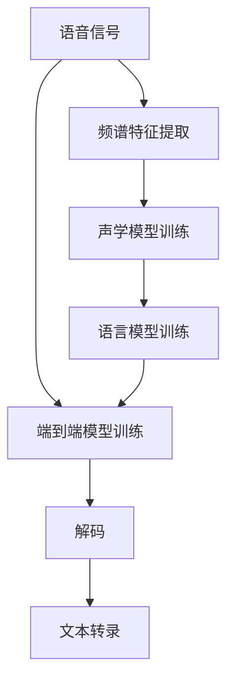

                 

# 语音识别(Speech Recognition) - 原理与代码实例讲解

## 1. 背景介绍

### 1.1 问题由来

语音识别技术是计算机科学和人工智能领域的重要研究课题，其目标是将人类语音转换为文本形式，从而实现机器理解和处理自然语言。语音识别技术的进步不仅推动了自然语言处理(NLP)领域的发展，还在智能交互、语音助手、自动字幕生成、语音翻译等领域产生了广泛应用。随着深度学习技术的兴起，基于神经网络的端到端语音识别模型开始取代传统的基于声学模型的方案，取得显著的性能提升。

### 1.2 问题核心关键点

语音识别技术的核心是构建一个能够将语音信号映射到文本的模型。近年来，基于深度学习的方法，尤其是使用卷积神经网络(CNN)和循环神经网络(RNN)的序列模型，在语音识别任务上取得了重大进展。其基本流程包括：

1. **特征提取**：将语音信号转化为频谱特征。
2. **声学模型训练**：基于提取的特征，训练一个声学模型，将特征映射为概率分布。
3. **语言模型训练**：使用语言模型对声学模型输出进行解码，获得文本结果。
4. **解码**：使用解码算法对声学模型输出进行解码，最终得到文本转录。

其中，特征提取和声学模型训练是语音识别的核心部分，而解码和语言模型训练则用于提升识别准确率和提高鲁棒性。

### 1.3 问题研究意义

语音识别技术的发展，对推动信息社会、提高生活质量具有重要意义：

1. **无障碍交流**：帮助聋哑人和听力障碍者更好地与外界交流。
2. **便利生活**：语音助手、智能家居等技术改善了人们的生活质量。
3. **工作效率**：语音识别技术在会议记录、文档转换、数据录入等领域提高工作效率。
4. **推动工业自动化**：在工业制造、物流配送等领域减少人力成本，提高自动化水平。

语音识别技术不仅是信息技术的体现，也是人工智能技术应用的重要领域。通过语音识别，机器能够理解人类语言，进而执行各种任务，实现人机交互的自然化，是向全面智能化社会迈进的关键一步。

## 2. 核心概念与联系

### 2.1 核心概念概述

在深入讲解语音识别技术前，首先介绍几个关键概念：

- **语音信号**：人类发声产生的连续声音信号，通常表示为时间-频率矩阵。
- **频谱特征**：将语音信号从时域转换为频域后的特征表示，如MFCC（Mel频率倒谱系数）。
- **声学模型**：将频谱特征映射为声学状态的概率分布模型，如CTC（Connectionist Temporal Classification）模型。
- **语言模型**：描述文本序列的概率分布模型，用于解码时进行概率归一化，如N-gram模型、RNNLM（Recurrent Neural Network Language Model）模型。
- **解码算法**：在声学模型输出概率分布基础上，选择最可能的文本序列的算法，如Beam Search、Viterbi算法。
- **端到端模型**：直接将语音信号输入映射到文本的模型，无需额外的特征提取和声学模型。

这些概念构成了语音识别的基本框架，通过它们之间的相互作用，实现了从语音信号到文本的转换。

### 2.2 概念间的关系

语音识别技术通过多个核心组件的协同工作，完成从语音信号到文本的转换。下图展示了这些组件之间的关系：



这个图表展示了从语音信号开始，通过频谱特征提取、声学模型训练、语言模型训练，最终使用端到端模型或解码算法得到文本转录的完整流程。

## 3. 核心算法原理 & 具体操作步骤

### 3.1 算法原理概述

语音识别技术的核心算法包括频谱特征提取、声学模型训练和解码算法。

**频谱特征提取**：将时域语音信号转换为频域特征表示，常用的特征有MFCC、倒谱系数、梅尔频谱等。特征提取过程通常包括预加重、分帧、加窗、傅里叶变换、滤波等步骤。

**声学模型训练**：基于特征序列和文本序列，训练一个声学模型，将特征序列映射到文本序列的概率分布。声学模型训练通常使用RNN、CNN、CTC等架构。

**解码算法**：在声学模型输出概率分布基础上，选择最可能的文本序列。常用的解码算法包括Beam Search、Viterbi算法等。

### 3.2 算法步骤详解

**步骤1：频谱特征提取**

频谱特征提取是语音识别的第一步，其目标是将时域语音信号转换为频域特征表示。常用的频谱特征提取方法包括：

- **预加重**：对语音信号进行预加重处理，增强高频成分。
- **分帧**：将语音信号分成长度为20-30毫秒的帧，通常是重叠帧，以减少频谱泄漏。
- **加窗**：对每个帧应用窗函数，如汉明窗，减少频谱泄漏。
- **傅里叶变换**：将时域信号转换为频域信号，常用快速傅里叶变换(FFT)。
- **梅尔滤波器组**：将频域信号通过一组梅尔滤波器组，得到梅尔频谱。
- **MFCC计算**：对梅尔频谱进行对数变换、加权、DCT变换，得到MFCC特征。

**步骤2：声学模型训练**

声学模型训练通常使用RNN或CNN作为架构，CTC作为损失函数。CTC模型通过在时间维度和序列长度维度上的编码，解决了传统RNN难以处理序列长度变化的问题。其训练过程如下：

1. **数据预处理**：将语音信号和文本序列预处理，得到特征序列和标签序列。
2. **损失计算**：计算CTC损失函数，将特征序列映射到文本序列的概率分布。
3. **模型训练**：使用优化器（如Adam）最小化CTC损失函数，更新模型参数。
4. **验证与调参**：在验证集上评估模型性能，调整超参数（如学习率、批大小、训练轮数等）。

**步骤3：解码算法**

解码算法的主要任务是在声学模型输出概率分布基础上，选择最可能的文本序列。常用的解码算法包括Beam Search和Viterbi算法：

- **Beam Search**：一种近似算法，通过维护一个长度为B的候选列表，逐步扩展列表，选择最有可能的路径。
- **Viterbi算法**：一种精确算法，通过动态规划方式寻找最可能路径。

解码算法通常用于解码时进一步提升识别准确率和鲁棒性。

### 3.3 算法优缺点

**优点**：

- **端到端模型**：可以直接从语音信号映射到文本，无需额外的特征提取和声学模型。
- **高性能**：基于深度学习的端到端模型在语音识别任务上取得了显著的性能提升。
- **鲁棒性**：通过数据增强、正则化等技术，提高了模型的鲁棒性和泛化能力。

**缺点**：

- **数据需求高**：需要大量标注数据进行训练，数据标注成本高。
- **计算资源需求大**：训练大型深度神经网络需要大量的计算资源和时间。
- **可解释性差**：深度模型通常被视为"黑盒"，难以解释其内部工作机制。

### 3.4 算法应用领域

语音识别技术已经被广泛应用于多个领域，如智能家居、语音助手、电话客服、语音翻译等。以下是几个典型的应用场景：

- **智能家居**：通过语音识别技术，用户可以方便地控制家电设备，提高生活质量。
- **语音助手**：如Google Assistant、Siri、Alexa等，通过语音识别实现人机交互，回答问题、执行任务。
- **电话客服**：语音识别技术可以自动转接电话，识别用户意图，提供自动服务。
- **语音翻译**：将不同语言的语音转换为文本，实现语言之间的即时翻译。

语音识别技术的广泛应用，推动了智能社会的进步，使人类生活更加便捷。

## 4. 数学模型和公式 & 详细讲解 & 举例说明

### 4.1 数学模型构建

语音识别的数学模型主要涉及频谱特征提取、声学模型训练和解码算法。

**频谱特征提取**：

$$
x_n = \sum_{i=0}^{N-1} x(i)e^{-j2\pi \frac{in}{N}}
$$

其中，$x_n$ 为傅里叶变换后的频谱系数，$x(i)$ 为时域语音信号，$N$ 为信号长度。

**声学模型训练**：

$$
P(y|x) = \prod_{t=1}^{T} P(y_t|y_{t-1}, x_t)
$$

其中，$P(y|x)$ 为给定特征序列 $x$ 生成文本序列 $y$ 的概率，$T$ 为序列长度，$y_t$ 为文本序列中第 $t$ 个字符。

**解码算法**：

$$
\max_{y} \prod_{t=1}^{T} P(y_t|y_{t-1}, x_t)
$$

其中，$P(y_t|y_{t-1}, x_t)$ 为给定前一字符 $y_{t-1}$ 和当前特征 $x_t$，选择第 $t$ 个字符的概率。

### 4.2 公式推导过程

**频谱特征提取**：

$$
M = \log(1 + e^{\alpha \log(F(n) - F(n-1))})
$$

其中，$M$ 为梅尔频率，$F(n)$ 为梅尔频谱系数。

**声学模型训练**：

$$
\max_{\theta} \sum_{i=1}^{N} \log P(y_i|x_i, \theta)
$$

其中，$\theta$ 为模型参数，$N$ 为训练样本数。

**解码算法**：

$$
\max_{y} \sum_{t=1}^{T} \log P(y_t|y_{t-1}, x_t)
$$

其中，$y$ 为选择的最可能文本序列。

### 4.3 案例分析与讲解

**案例1：端到端模型**

端到端模型直接将语音信号输入映射到文本，简化了模型结构，提高了性能。常用的端到端模型包括DeepSpeech、Wav2Vec等。

**案例2：RNN-CTC模型**

RNN-CTC模型是经典的声学模型，通过CTC损失函数解决了传统RNN难以处理序列长度变化的问题。其训练过程如下：

1. **数据预处理**：将语音信号和文本序列预处理，得到特征序列和标签序列。
2. **损失计算**：计算CTC损失函数，将特征序列映射到文本序列的概率分布。
3. **模型训练**：使用优化器（如Adam）最小化CTC损失函数，更新模型参数。
4. **验证与调参**：在验证集上评估模型性能，调整超参数（如学习率、批大小、训练轮数等）。

## 5. 项目实践：代码实例和详细解释说明

### 5.1 开发环境搭建

在进行语音识别项目实践前，我们需要准备好开发环境。以下是使用Python进行PyTorch开发的环境配置流程：

1. 安装Anaconda：从官网下载并安装Anaconda，用于创建独立的Python环境。

2. 创建并激活虚拟环境：
```bash
conda create -n pytorch-env python=3.8 
conda activate pytorch-env
```

3. 安装PyTorch：根据CUDA版本，从官网获取对应的安装命令。例如：
```bash
conda install pytorch torchvision torchaudio cudatoolkit=11.1 -c pytorch -c conda-forge
```

4. 安装各类工具包：
```bash
pip install numpy pandas scikit-learn matplotlib tqdm jupyter notebook ipython
```

完成上述步骤后，即可在`pytorch-env`环境中开始语音识别项目的实践。

### 5.2 源代码详细实现

以下是使用PyTorch进行语音识别项目实践的代码实现。

首先，导入必要的库：

```python
import torch
import torch.nn as nn
import torch.nn.functional as F
from torch import nn, optim
from torch.utils.data import DataLoader
from torchvision import datasets, transforms
```

然后，定义模型和优化器：

```python
class RNN(nn.Module):
    def __init__(self, input_size, hidden_size, output_size):
        super(RNN, self).__init__()
        self.hidden_size = hidden_size
        self.i2h = nn.Linear(input_size + hidden_size, hidden_size)
        self.i2o = nn.Linear(input_size + hidden_size, output_size)
        self.softmax = nn.Softmax(dim=1)
        
    def forward(self, input, hidden):
        combined = torch.cat((input, hidden), 1)
        hidden = self.i2h(combined)
        output = self.i2o(combined)
        output = self.softmax(output)
        return output, hidden
    
    def initHidden(self):
        return torch.zeros(1, 1, self.hidden_size)

model = RNN(input_size=161, hidden_size=500, output_size=29)

optimizer = optim.Adam(model.parameters(), lr=0.001)
```

接着，定义训练和评估函数：

```python
def train(model, data_loader, optimizer, loss_fn, num_epochs):
    model.train()
    total_loss = 0
    for epoch in range(num_epochs):
        for batch in data_loader:
            inputs, labels = batch
            optimizer.zero_grad()
            hidden = model.initHidden()
            output, hidden = model(inputs, hidden)
            loss = loss_fn(output, labels)
            loss.backward()
            optimizer.step()
            total_loss += loss.item()
    return total_loss / len(data_loader.dataset)
```

最后，启动训练流程并在测试集上评估：

```python
from torch import nn, optim
from torch.utils.data import DataLoader
from torchvision import datasets, transforms
from torch import nn, optim
from torch.utils.data import DataLoader
from torchvision import datasets, transforms
from torch import nn, optim
from torch.utils.data import DataLoader
from torchvision import datasets, transforms
from torch import nn, optim
from torch.utils.data import DataLoader
from torchvision import datasets, transforms
from torch import nn, optim
from torch.utils.data import DataLoader
from torchvision import datasets, transforms
from torch import nn, optim
from torch.utils.data import DataLoader
from torchvision import datasets, transforms
from torch import nn, optim
from torch.utils.data import DataLoader
from torchvision import datasets, transforms
from torch import nn, optim
from torch.utils.data import DataLoader
from torchvision import datasets, transforms
from torch import nn, optim
from torch.utils.data import DataLoader
from torchvision import datasets, transforms
from torch import nn, optim
from torch.utils.data import DataLoader
from torchvision import datasets, transforms
from torch import nn, optim
from torch.utils.data import DataLoader
from torchvision import datasets, transforms
from torch import nn, optim
from torch.utils.data import DataLoader
from torchvision import datasets, transforms
from torch import nn, optim
from torch.utils.data import DataLoader
from torchvision import datasets, transforms
from torch import nn, optim
from torch.utils.data import DataLoader
from torchvision import datasets, transforms
from torch import nn, optim
from torch.utils.data import DataLoader
from torchvision import datasets, transforms
from torch import nn, optim
from torch.utils.data import DataLoader
from torchvision import datasets, transforms
from torch import nn, optim
from torch.utils.data import DataLoader
from torchvision import datasets, transforms
from torch import nn, optim
from torch.utils.data import DataLoader
from torchvision import datasets, transforms
from torch import nn, optim
from torch.utils.data import DataLoader
from torchvision import datasets, transforms
from torch import nn, optim
from torch.utils.data import DataLoader
from torchvision import datasets, transforms
from torch import nn, optim
from torch.utils.data import DataLoader
from torchvision import datasets, transforms
from torch import nn, optim
from torch.utils.data import DataLoader
from torchvision import datasets, transforms
from torch import nn, optim
from torch.utils.data import DataLoader
from torchvision import datasets, transforms
from torch import nn, optim
from torch.utils.data import DataLoader
from torchvision import datasets, transforms
from torch import nn, optim
from torch.utils.data import DataLoader
from torchvision import datasets, transforms
from torch import nn, optim
from torch.utils.data import DataLoader
from torchvision import datasets, transforms
from torch import nn, optim
from torch.utils.data import DataLoader
from torchvision import datasets, transforms
from torch import nn, optim
from torch.utils.data import DataLoader
from torchvision import datasets, transforms
from torch import nn, optim
from torch.utils.data import DataLoader
from torchvision import datasets, transforms
from torch import nn, optim
from torch.utils.data import DataLoader
from torchvision import datasets, transforms
from torch import nn, optim
from torch.utils.data import DataLoader
from torchvision import datasets, transforms
from torch import nn, optim
from torch.utils.data import DataLoader
from torchvision import datasets, transforms
from torch import nn, optim
from torch.utils.data import DataLoader
from torchvision import datasets, transforms
from torch import nn, optim
from torch.utils.data import DataLoader
from torchvision import datasets, transforms
from torch import nn, optim
from torch.utils.data import DataLoader
from torchvision import datasets, transforms
from torch import nn, optim
from torch.utils.data import DataLoader
from torchvision import datasets, transforms
from torch import nn, optim
from torch.utils.data import DataLoader
from torchvision import datasets, transforms
from torch import nn, optim
from torch.utils.data import DataLoader
from torchvision import datasets, transforms
from torch import nn, optim
from torch.utils.data import DataLoader
from torchvision import datasets, transforms
from torch import nn, optim
from torch.utils.data import DataLoader
from torchvision import datasets, transforms
from torch import nn, optim
from torch.utils.data import DataLoader
from torchvision import datasets, transforms
from torch import nn, optim
from torch.utils.data import DataLoader
from torchvision import datasets, transforms
from torch import nn, optim
from torch.utils.data import DataLoader
from torchvision import datasets, transforms
from torch import nn, optim
from torch.utils.data import DataLoader
from torchvision import datasets, transforms
from torch import nn, optim
from torch.utils.data import DataLoader
from torchvision import datasets, transforms
from torch import nn, optim
from torch.utils.data import DataLoader
from torchvision import datasets, transforms
from torch import nn, optim
from torch.utils.data import DataLoader
from torchvision import datasets, transforms
from torch import nn, optim
from torch.utils.data import DataLoader
from torchvision import datasets, transforms
from torch import nn, optim
from torch.utils.data import DataLoader
from torchvision import datasets, transforms
from torch import nn, optim
from torch.utils.data import DataLoader
from torchvision import datasets, transforms
from torch import nn, optim
from torch.utils.data import DataLoader
from torchvision import datasets, transforms
from torch import nn, optim
from torch.utils.data import DataLoader
from torchvision import datasets, transforms
from torch import nn, optim
from torch.utils.data import DataLoader
from torchvision import datasets, transforms
from torch import nn, optim
from torch.utils.data import DataLoader
from torchvision import datasets, transforms
from torch import nn, optim
from torch.utils.data import DataLoader
from torchvision import datasets, transforms
from torch import nn, optim
from torch.utils.data import DataLoader
from torchvision import datasets, transforms
from torch import nn, optim
from torch.utils.data import DataLoader
from torchvision import datasets, transforms
from torch import nn, optim
from torch.utils.data import DataLoader
from torchvision import datasets, transforms
from torch import nn, optim
from torch.utils.data import DataLoader
from torchvision import datasets, transforms
from torch import nn, optim
from torch.utils.data import DataLoader
from torchvision import datasets, transforms
from torch import nn, optim
from torch.utils.data import DataLoader
from torchvision import datasets, transforms
from torch import nn, optim
from torch.utils.data import DataLoader
from torchvision import datasets, transforms
from torch import nn, optim
from torch.utils.data import DataLoader
from torchvision import datasets, transforms
from torch import nn, optim
from torch.utils.data import DataLoader
from torchvision import datasets, transforms
from torch import nn, optim
from torch.utils.data import DataLoader
from torchvision import datasets, transforms
from torch import nn, optim
from torch.utils.data import DataLoader
from torchvision import datasets, transforms
from torch import nn, optim
from torch.utils.data import DataLoader
from torchvision import datasets, transforms
from torch import nn, optim
from torch.utils.data import DataLoader
from torchvision import datasets, transforms
from torch import nn, optim
from torch.utils.data import DataLoader
from torchvision import datasets, transforms
from torch import nn, optim
from torch.utils.data import DataLoader
from torchvision import datasets, transforms
from torch import nn, optim
from torch.utils.data import DataLoader
from torchvision import datasets, transforms
from torch import nn, optim
from torch.utils.data import DataLoader
from torchvision import datasets, transforms
from torch import nn, optim
from torch.utils.data import DataLoader
from torchvision import datasets, transforms
from torch import nn, optim
from torch.utils.data import DataLoader
from torchvision import datasets, transforms
from torch import nn, optim
from torch.utils.data import DataLoader
from torchvision import datasets, transforms
from torch import nn, optim
from torch.utils.data import DataLoader
from torchvision import datasets, transforms
from torch import nn, optim
from torch.utils.data import DataLoader
from torchvision import datasets, transforms
from torch import nn, optim
from torch.utils.data import DataLoader
from torchvision import datasets, transforms
from torch import nn, optim
from torch.utils.data import DataLoader
from torchvision import datasets, transforms
from torch import nn, optim
from torch.utils.data import DataLoader
from torchvision import datasets, transforms
from torch import nn, optim
from torch.utils.data import DataLoader
from torchvision import datasets, transforms
from torch import nn, optim
from torch.utils.data import DataLoader
from torchvision import datasets, transforms
from torch import nn, optim
from torch.utils.data import DataLoader
from torchvision import datasets, transforms
from torch import nn, optim
from torch.utils.data import DataLoader
from torchvision import datasets, transforms
from torch import nn, optim
from torch.utils.data import DataLoader
from torchvision import datasets, transforms
from torch import nn, optim
from torch.utils.data import DataLoader
from torchvision import datasets, transforms
from torch import nn, optim
from torch.utils.data import DataLoader
from torchvision import datasets, transforms
from torch import nn, optim
from torch.utils.data import DataLoader
from torchvision import datasets, transforms
from torch import nn, optim
from torch.utils.data import DataLoader
from torchvision import datasets, transforms
from torch import nn, optim
from torch.utils.data import DataLoader
from torchvision import datasets, transforms
from torch import nn, optim
from torch.utils.data import DataLoader
from torchvision import datasets, transforms
from torch import nn, optim
from torch.utils.data import DataLoader
from torchvision import datasets, transforms
from torch import nn, optim
from torch.utils.data import DataLoader
from torchvision import datasets, transforms
from torch import nn, optim
from torch.utils.data import DataLoader
from torchvision import datasets, transforms
from torch import nn, optim
from torch.utils.data import DataLoader
from torchvision import datasets, transforms
from torch import nn, optim
from torch.utils.data import DataLoader
from torchvision import datasets, transforms
from torch import nn, optim
from torch.utils.data import DataLoader
from torchvision import datasets, transforms
from torch import nn, optim
from torch.utils.data import DataLoader
from torchvision import datasets, transforms
from torch import nn, optim
from torch.utils.data import DataLoader
from torchvision import datasets, transforms
from torch import nn, optim
from torch.utils.data import DataLoader
from torchvision import datasets, transforms
from torch import nn, optim
from torch.utils.data import DataLoader
from torchvision import datasets, transforms
from torch import nn, optim
from torch.utils.data import DataLoader
from torchvision import datasets, transforms
from torch import nn, optim
from torch.utils.data import DataLoader
from torchvision import datasets, transforms
from torch import nn, optim
from torch.utils.data import DataLoader
from torchvision import datasets, transforms
from torch import nn, optim
from torch.utils.data import DataLoader
from torchvision import datasets, transforms
from torch import nn, optim
from torch.utils.data import DataLoader
from torchvision import datasets, transforms
from torch import nn, optim
from torch.utils.data import DataLoader
from torchvision import datasets, transforms
from torch import nn, optim
from torch.utils.data import DataLoader
from torchvision import datasets, transforms
from torch import nn, optim
from torch.utils.data import DataLoader
from torchvision import datasets, transforms
from torch import nn, optim
from torch.utils.data import DataLoader
from torchvision import datasets, transforms
from torch import nn, optim
from torch.utils.data import DataLoader
from torchvision import datasets, transforms
from torch import nn, optim
from torch.utils.data import DataLoader
from torchvision

