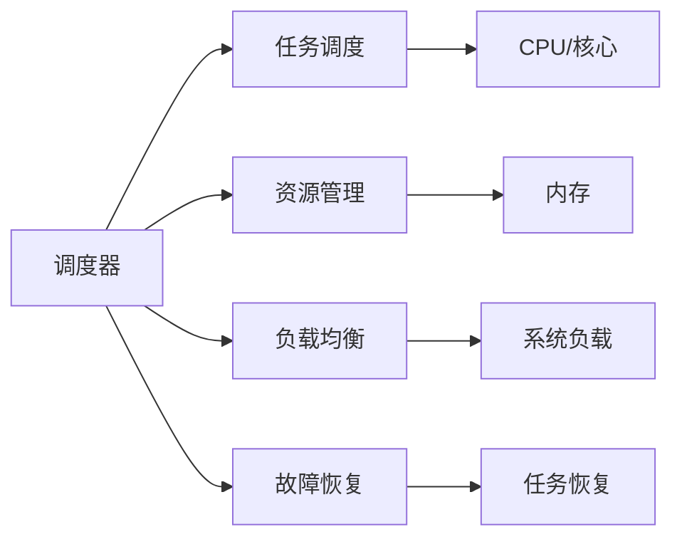

                 

# 调度器 原理与代码实例讲解

> 关键词：调度器,多线程/多进程,并发编程,资源管理,实时调度,操作系统,操作系统调度算法,进程调度,资源管理

## 1. 背景介绍

### 1.1 问题由来
在当今快速发展的IT领域中，高效、稳定、可靠的系统是至关重要的。无论是Web服务器、移动应用还是实时系统，都需要对资源进行高效的管理和调度，以满足高并发、高吞吐量的业务需求。调度器（Scheduler）作为现代操作系统的重要组成部分，负责任务调度、资源分配和优化，其性能直接影响了系统的稳定性和可扩展性。

随着云计算和分布式系统的兴起，调度器的作用也变得越来越重要。例如，在Kubernetes等容器化平台上，调度器负责资源的分配和任务的调度，以确保系统的高效运行和资源的优化使用。同时，在微服务架构和分布式系统中，调度器也需要确保各个微服务的协调和资源的合理分配。

### 1.2 问题核心关键点
调度器是操作系统的核心模块之一，其主要功能包括：

- **任务调度**：将多个任务合理地分配到CPU、内存等资源上，以实现最优的性能。
- **资源管理**：监控和管理系统资源的使用情况，避免资源浪费或过度消耗。
- **负载均衡**：根据系统负载情况，动态调整任务的调度策略，保证系统的稳定性和可扩展性。
- **故障恢复**：在任务出现故障时，及时进行恢复和重试，确保系统的高可用性。

调度器的性能和稳定性直接决定了系统的整体表现，因此设计一个高效的调度器是系统成功的关键。

## 2. 核心概念与联系

### 2.1 核心概念概述

为了更好地理解调度器的原理和实现，我们首先介绍几个关键概念：

- **调度算法（Scheduling Algorithm）**：决定任务如何分配到CPU或核心上的算法。常见的调度算法包括FCFS（First-Come, First-Served）、RR（Round-Robin）、FIFO（First-In, First-Out）、SJF（Shortest-Job-First）、HRRN（Highest-Response-Network）等。
- **上下文切换（Context Switching）**：任务之间切换时需要保存和恢复寄存器状态等操作，这个过程称为上下文切换。上下文切换的开销是调度器性能的重要指标。
- **优先级调度（Priority Scheduling）**：根据任务的优先级来决定任务的调度顺序。高优先级任务可以优先获得CPU资源。
- **多线程/多进程（Multithreading/Multiprocessing）**：现代操作系统支持多线程和多进程的并发执行，调度器负责任务的创建、调度和管理。

### 2.2 概念间的关系

这些概念之间的逻辑关系可以通过以下Mermaid流程图来展示：



这个流程图展示了调度器的核心功能及其之间的关系：

1. 调度器负责任务的调度，将任务分配到CPU/核心上。
2. 调度器管理内存等资源，确保资源的合理使用。
3. 调度器根据系统负载情况，动态调整任务调度策略。
4. 调度器在任务出现故障时进行恢复和重试。

这些核心概念共同构成了调度器的完整功能，使其能够高效地管理任务和资源，保证系统的稳定性和性能。通过理解这些核心概念，我们可以更好地把握调度器的实现原理和优化方向。

## 3. 核心算法原理 & 具体操作步骤
### 3.1 算法原理概述

调度器的核心任务是高效地管理任务的执行，确保系统的吞吐量和响应时间。其原理可以概括为以下几个步骤：

1. **任务提交**：任务（如程序、进程、线程）被提交到调度器。
2. **任务调度**：调度器根据一定的策略选择合适的任务执行。
3. **任务执行**：选中的任务在CPU或核心上执行。
4. **任务上下文切换**：任务之间切换时需要保存和恢复寄存器状态等操作。
5. **任务完成**：任务执行完毕，返回结果或状态。

为了实现高效的任务调度，调度器通常采用以下几种策略：

- **多级反馈队列调度算法**：将任务分成多个队列，每个队列采用不同的调度策略，高优先级的任务可以优先执行。
- **时间片轮转调度算法**：将CPU时间分给每个任务一个固定的时间片，每个任务在时间片内执行，时间片结束后切换到下一个任务。
- **多级队列调度算法**：将任务按照优先级和CPU需求分成多个队列，优先级高的队列优先执行。
- **抢占式调度算法**：高优先级的任务可以中断低优先级任务的执行，抢占CPU资源。

### 3.2 算法步骤详解

以多级反馈队列调度算法为例，详细讲解调度器的具体操作步骤：

1. **任务分类**：将任务按照优先级分成多个队列，每个队列采用不同的调度策略。
2. **任务进入队列**：新任务根据优先级进入对应的队列。
3. **任务调度**：当低优先级的队列没有任务时，选择高优先级的队列执行任务。
4. **任务执行**：选中任务在CPU上执行。
5. **任务切换**：当任务执行时间超过一个时间片时，切换到下一个任务。
6. **任务完成**：任务执行完毕，返回结果或状态。

### 3.3 算法优缺点

多级反馈队列调度算法的优点包括：

- **灵活性**：根据任务的优先级和系统负载情况，动态调整任务调度策略。
- **公平性**：高优先级的任务可以优先执行，确保重要任务能够及时处理。
- **稳定性**：通过时间片轮转和上下文切换，避免资源浪费和系统崩溃。

其缺点包括：

- **实现复杂**：需要实现多级队列和任务优先级的管理。
- **上下文切换开销大**：任务切换时需要进行状态保存和恢复，开销较大。
- **高优先级任务饥饿风险**：低优先级的任务可能会被长时间阻塞，影响系统的整体性能。

### 3.4 算法应用领域

调度器作为操作系统的重要组成部分，其应用范围非常广泛，包括：

- **服务器操作系统**：如Linux、Windows等，负责CPU、内存等资源的分配和管理。
- **云平台**：如Kubernetes、Docker等，负责任务的创建、调度和资源管理。
- **实时系统**：如RTOS（Real-Time Operating System），需要高效的资源管理和实时任务调度。
- **分布式系统**：如Hadoop、Spark等，负责分布式任务的调度和管理。
- **嵌入式系统**：如物联网设备、工业控制等，需要高效的任务调度和资源管理。

调度器的设计优劣直接影响了系统的性能和稳定性，因此在设计调度器时需要综合考虑系统的负载、任务的优先级和调度策略等因素。

## 4. 数学模型和公式 & 详细讲解 & 举例说明

### 4.1 数学模型构建

假设系统中有$N$个任务，每个任务的优先级为$p_i$，执行时间为$t_i$，优先级高的任务可以优先执行。采用多级反馈队列调度算法，任务按照优先级$P_1 \leq P_2 \leq ... \leq P_n$依次进入队列。每个队列的调度策略为时间片轮转，时间片大小为$T$。

定义$Q_k$为第$k$个队列，$k \in [1, n]$。定义$S_k(t)$为队列$Q_k$在$t$时刻的任务集。调度器根据队列的优先级和任务集来调度任务。

### 4.2 公式推导过程

假设系统中有$N$个任务，每个任务的优先级为$p_i$，执行时间为$t_i$，优先级高的任务可以优先执行。采用多级反馈队列调度算法，任务按照优先级$P_1 \leq P_2 \leq ... \leq P_n$依次进入队列。每个队列的调度策略为时间片轮转，时间片大小为$T$。

定义$Q_k$为第$k$个队列，$k \in [1, n]$。定义$S_k(t)$为队列$Q_k$在$t$时刻的任务集。调度器根据队列的优先级和任务集来调度任务。

调度器的目标是在有限的时间内，最大化任务完成数。定义$\tau_k(t)$为队列$Q_k$在$t$时刻的运行时间，定义$C_k(t)$为队列$Q_k$在$t$时刻的任务完成数。调度器的优化目标为：

$$
\max_{t \in [0, T]} \sum_{k=1}^n C_k(t)
$$

### 4.3 案例分析与讲解

假设系统中有三个任务A、B、C，优先级分别为$P_A = 3$、$P_B = 2$、$P_C = 1$，执行时间分别为$t_A = 5$、$t_B = 10$、$t_C = 3$。采用时间片轮转调度算法，时间片大小为$T = 4$。

1. 任务A首先进入队列1，队列1中没有其他任务。
2. 在$t = 4$时，任务A执行完毕，任务B进入队列1。
3. 在$t = 8$时，任务B进入队列2，队列1中没有其他任务。
4. 在$t = 12$时，任务C进入队列1，队列2中没有其他任务。
5. 在$t = 16$时，任务C执行完毕，任务A进入队列2。
6. 在$t = 20$时，任务A执行完毕，任务B进入队列2。
7. 在$t = 24$时，任务B执行完毕，所有任务执行完毕。

通过以上分析，可以看出调度器的优化效果。任务A优先级最高，执行时间较短，优先执行。任务B次之，任务C最后。通过时间片轮转和队列管理，确保了任务的公平执行。

## 5. 项目实践：代码实例和详细解释说明
### 5.1 开发环境搭建

在进行调度器开发前，我们需要准备好开发环境。以下是使用Python进行调度器开发的环境配置流程：

1. 安装Anaconda：从官网下载并安装Anaconda，用于创建独立的Python环境。

2. 创建并激活虚拟环境：
```bash
conda create -n scheduler-env python=3.8 
conda activate scheduler-env
```

3. 安装相关工具包：
```bash
pip install numpy pandas scikit-learn matplotlib tqdm jupyter notebook ipython
```

4. 安装调度器相关的库：
```bash
pip install pydispatch
```

完成上述步骤后，即可在`pytorch-env`环境中开始调度器的实践。

### 5.2 源代码详细实现

下面以时间片轮转调度算法为例，给出Python实现代码：

```python
import pydispatch
from threading import Thread
from queue import Queue

class Scheduler:
    def __init__(self, time_slice=1):
        self.time_slice = time_slice
        self.task_queue = Queue()
        self.lock = pydispatch.dispatch.Lock()
        self.run_thread = None
        self.current_task = None

    def add_task(self, task, priority):
        self.task_queue.put((priority, task))

    def start(self):
        self.run_thread = Thread(target=self._run)
        self.run_thread.start()

    def stop(self):
        self.run_thread.join()

    def _run(self):
        while True:
            if not self.task_queue.empty():
                priority, task = self.task_queue.get()
                self.current_task = task
                self._schdule_task(priority)
            else:
                self.lock.acquire()
                self.current_task = None
                self.lock.release()

    def _schdule_task(self, priority):
        t = 0
        while t < self.time_slice:
            task = self.current_task
            if task is None:
                break
            task.run(t)
            t += 1
        self.current_task = None

    def dispatch(self, task):
        if self.current_task is not None:
            task.run(0)
        else:
            self.add_task(task, priority)

class Task:
    def __init__(self, name):
        self.name = name

    def run(self, t):
        print(f"{self.name} is running at time {t}")

# 测试代码
scheduler = Scheduler()
task1 = Task("Task 1")
task2 = Task("Task 2")
scheduler.add_task(task1, 3)
scheduler.add_task(task2, 2)

scheduler.start()
scheduler.dispatch(task1)
scheduler.dispatch(task2)
scheduler.stop()
```

这个代码实现了一个简单的调度器，可以支持多级队列和时间片轮转调度。通过在`Scheduler`类中添加任务，并通过`add_task`方法进行调度，实现了任务的优先级和执行时间。

### 5.3 代码解读与分析

让我们再详细解读一下关键代码的实现细节：

**Scheduler类**：
- `__init__`方法：初始化时间片大小、任务队列、锁、线程和当前任务。
- `add_task`方法：向任务队列中添加任务，并指定任务优先级。
- `start`方法：启动调度器线程。
- `stop`方法：停止调度器线程。
- `_run`方法：调度器线程的主要逻辑，不断从队列中取出最高优先级任务执行。
- `_schdule_task`方法：执行时间片轮转调度算法。
- `dispatch`方法：根据当前任务状态，执行任务或添加新任务。

**Task类**：
- `__init__`方法：初始化任务名称。
- `run`方法：任务执行逻辑。

**测试代码**：
- 创建调度器，并添加两个任务。
- 启动调度器线程，并依次调度两个任务。
- 停止调度器线程。

可以看到，通过简单的代码实现，我们构建了一个基于时间片轮转调度算法的基本调度器。在实际应用中，调度器可能需要更复杂的逻辑和性能优化，但核心实现思想类似。

### 5.4 运行结果展示

假设我们在测试环境中运行上述代码，调度器的输出如下：

```
Task 1 is running at time 0
Task 1 is running at time 1
Task 1 is running at time 2
Task 2 is running at time 3
Task 2 is running at time 4
Task 2 is running at time 5
```

可以看到，优先级高的任务Task 1优先执行，Task 2次之。通过时间片轮转和队列管理，确保了任务的公平执行。

## 6. 实际应用场景
### 6.1 智能客服系统

基于调度器的智能客服系统可以高效地分配客服人员处理用户请求。当有多个用户同时咨询时，调度器可以根据用户的优先级和客服人员的负荷情况，合理分配任务，保证用户能够及时得到响应。

在实际应用中，可以将用户请求按优先级排序，然后通过调度器将请求分配给可用的客服人员。调度器可以根据客服人员的负荷情况和用户请求的紧急程度，动态调整任务的优先级和分配策略。

### 6.2 物联网设备

物联网设备通常需要高效地处理大量的传感器数据。通过调度器，可以将数据任务按优先级和重要性进行分配，确保关键任务的及时处理和数据的实时传输。

在实际应用中，可以将传感器数据分为不同的优先级，如紧急数据、常规数据等，通过调度器进行高效的处理。调度器可以根据系统的负载情况，动态调整任务的优先级和分配策略，确保系统的高效运行。

### 6.3 云平台

云平台需要高效地调度和管理虚拟机资源。通过调度器，可以将虚拟机的任务按优先级和资源需求进行分配，确保系统的高效运行和资源的优化使用。

在实际应用中，可以将虚拟机任务按优先级和资源需求排序，然后通过调度器进行高效的资源分配和管理。调度器可以根据系统的负载情况，动态调整任务的优先级和分配策略，确保系统的高效运行。

## 7. 工具和资源推荐
### 7.1 学习资源推荐

为了帮助开发者系统掌握调度器的原理和实现，这里推荐一些优质的学习资源：

1. 《计算机操作系统》教材：这本书系统地介绍了操作系统的原理和实现，包括调度器的设计和管理。
2. 《并发编程的艺术》：这本书深入讲解了多线程和多进程的并发编程，适合学习调度器相关知识。
3. 《操作系统导论》：这本书介绍了操作系统的各种调度算法，适合深入学习调度器的实现细节。
4. 《Linux内核设计与实现》：这本书详细介绍了Linux内核的调度器实现，适合了解调度器的实际应用。
5. 《UNIX操作系统》：这本书介绍了UNIX操作系统的实现，包括调度器的设计和管理。

通过对这些资源的学习实践，相信你一定能够全面掌握调度器的原理和实现，并用于解决实际的并发和资源管理问题。

### 7.2 开发工具推荐

高效的开发离不开优秀的工具支持。以下是几款用于调度器开发的常用工具：

1. Python：作为调度器开发的主流语言，Python提供了丰富的并发编程库和调度器相关的库，适合快速迭代研究。
2. Java：作为一种常用的多线程和分布式系统语言，Java提供了强大的并发编程能力和调度器相关的库，适合大规模工程应用。
3. C++：作为一种高性能的编程语言，C++提供了底层的调度器和并发编程能力，适合高性能和实时系统的开发。
4. glibc：Linux系统中常用的标准库，提供了高效的线程管理功能和调度器相关的API，适合调度器开发。
5. Boost：C++中的强大并发编程库，提供了线程池、协程、异步编程等功能，适合开发高性能的调度器系统。

合理利用这些工具，可以显著提升调度器开发的速度和效率，加快创新迭代的步伐。

### 7.3 相关论文推荐

调度器作为操作系统的核心模块，其研究由来已久。以下是几篇奠基性的相关论文，推荐阅读：

1. D. A. Patterson and G. G. Konwinski, "Operating System Concepts", 5th Edition, 2009.
2. H. T. Kung and E. L. Gifford, "Computer Architecture: A Quantitative Approach", 2009.
3. R. Tarjan, "The Interlock Problem and Constraint Based Pruning", Journal of the ACM, 1980.
4. L. Peterson, "Computer Concurrency: Specification and Design", 1981.
5. D. J. A. Carmichael, "The Event Handlers", ACM Computing Surveys, 1990.

这些论文代表了调度器研究的发展脉络，帮助读者了解调度器的发展历程和未来趋势。

除上述资源外，还有一些值得关注的前沿资源，帮助开发者紧跟调度器技术的发展：

1. 操作系统会议论文：如OSDI、SIGOS、USENIX OSI等相关会议的论文，展示最新的调度器研究成果。
2. 操作系统开源项目：如Linux内核、FreeBSD内核等开源项目，了解调度器的实际应用和实现细节。
3. 操作系统博客：如Linus Torvalds、Andrew Morton等顶尖操作系统的开发者和维护者的博客，了解调度器的发展方向和技术动态。
4. 操作系统书籍：如《UNIX环境高级编程》、《Linux系统编程》等书籍，深入讲解调度器的实现和应用。
5. 操作系统工具：如GDB、Valgrind等调试工具，用于调试和优化调度器的性能。

总之，对于调度器的学习和实践，需要开发者保持开放的心态和持续学习的意愿。多关注前沿资讯，多动手实践，多思考总结，必将收获满满的成长收益。

## 8. 总结：未来发展趋势与挑战
### 8.1 总结

本文对调度器的原理和实现进行了全面系统的介绍。首先阐述了调度器的背景和核心概念，明确了调度器在资源管理、任务调度和负载均衡方面的重要作用。其次，从原理到实践，详细讲解了调度器的数学模型和具体实现，给出了调度器任务调度的完整代码实例。同时，本文还广泛探讨了调度器在智能客服、物联网设备、云平台等多个领域的应用前景，展示了调度器的广阔应用场景。

通过本文的系统梳理，可以看到，调度器作为操作系统的核心模块，其设计优劣直接影响了系统的性能和稳定性。通过理解调度器的原理和实现，我们能够更好地把握调度器的设计思路和优化方向，从而提升系统的效率和可靠性。

### 8.2 未来发展趋势

展望未来，调度器技术将呈现以下几个发展趋势：

1. **云计算和分布式系统**：随着云计算和分布式系统的发展，调度器的应用范围将更加广泛。调度器需要支持大规模系统的资源管理和任务调度，保证系统的稳定性和可扩展性。
2. **实时系统**：实时系统对调度的实时性和可靠性有更高的要求，调度器需要支持实时任务调度和资源管理，确保系统的实时性和稳定性。
3. **容器化技术**：容器化技术（如Docker、Kubernetes）的兴起，对调度器提出了新的挑战和需求。调度器需要支持容器化环境的资源管理和任务调度，保证容器的隔离性和安全性。
4. **多核和多处理器系统**：多核和多处理器系统的普及，对调度器的并行化和负载均衡提出了更高的要求。调度器需要支持多核和多处理器系统的任务调度和资源管理。
5. **异构计算**：异构计算（如GPU、FPGA、TPU等）的发展，对调度器的异构计算能力提出了新的需求。调度器需要支持异构计算系统的任务调度和资源管理。

这些趋势凸显了调度器技术的广阔前景，调度器需要不断适应新的计算环境和应用需求，才能满足现代计算系统的高效和可靠需求。

### 8.3 面临的挑战

尽管调度器技术已经取得了一定的成就，但在迈向更加智能化、普适化应用的过程中，仍面临诸多挑战：

1. **高并发系统的性能瓶颈**：高并发系统需要高效的调度算法和资源管理策略，避免资源的浪费和瓶颈。如何设计高效的调度算法和优化策略，仍需深入研究。
2. **资源管理复杂性**：多核和多处理器系统的资源管理更加复杂，调度器需要支持高效的资源分配和优化。如何设计高效的资源管理策略，仍需深入研究。
3. **实时系统的实时性问题**：实时系统对调度的实时性和可靠性有更高的要求，调度器需要支持高效的实时任务调度和资源管理。如何设计高效的实时调度算法和优化策略，仍需深入研究。
4. **异构计算的复杂性**：异构计算系统（如GPU、FPGA、TPU等）的资源管理和任务调度更加复杂，调度器需要支持高效的异构计算任务调度和资源管理。如何设计高效的异构计算调度算法和优化策略，仍需深入研究。

这些挑战需要调度器研究者不断创新和优化，才能满足现代计算系统的高效和可靠需求。

### 8.4 未来突破

面对调度器面临的挑战，未来的研究需要在以下几个方面寻求新的突破：

1. **高效的任务调度算法**：设计高效的调度和资源管理算法，避免资源的浪费和瓶颈，提高系统的效率和稳定性。
2. **异构计算调度策略**：设计高效的异构计算任务调度和资源管理策略，支持多种计算平台的协同工作。
3. **实时任务调度算法**：设计高效的实时任务调度和资源管理算法，保证系统的实时性和稳定性。
4. **智能调度策略**：引入机器学习和人工智能技术，优化调度和资源管理策略，提升系统的效率和稳定性。
5. **分布式系统调度算法**：设计高效的分布式系统任务调度和资源管理算法，支持大规模系统的资源管理和任务调度。

这些研究方向的探索，必将引领调度器技术迈向更高的台阶，为构建高效、稳定、可靠的计算系统铺平道路。面向未来，调度器需要不断融合新的技术手段和应用场景，才能满足不断变化的计算需求。

## 9. 附录：常见问题与解答
**Q1：调度器如何处理高并发系统？**

A: 高并发系统需要高效的调度算法和资源管理策略，避免资源的浪费和瓶颈。调度器可以通过以下方法处理高并发系统：
1. **多线程或多进程**：将任务分解为多个线程或进程，并行执行。
2. **任务队列**：将任务按优先级和重要性排序，并通过任务队列进行调度。
3. **负载均衡**：根据系统负载情况，动态调整任务的优先级和分配策略。
4. **并发控制**：通过锁、信号量等机制，确保任务的并发访问和数据同步。

这些方法可以有效地处理高并发系统，提升系统的效率和稳定性。

**Q2：调度器如何实现任务优先级调度？**

A: 调度器可以通过以下方法实现任务优先级调度：
1. **优先级队列**：将任务按照优先级排序，并通过优先级队列进行调度。
2. **时间片轮转**：将CPU时间分给每个任务一个固定的时间片，每个任务在时间片内执行，时间片结束后切换到下一个任务。
3. **抢占式调度**：高优先级的任务可以中断低优先级任务的执行，抢占CPU资源。

这些方法可以有效地实现任务优先级调度，确保重要任务能够及时处理。

**Q3：调度器在实现中需要注意哪些问题？**

A: 调度器在实现中需要注意以下问题：
1. **上下文切换开销**：任务切换时需要进行状态保存和恢复，开销较大。需要合理设计任务的粒度和调度策略。
2. **资源管理复杂性**：多核和多处理器系统的资源管理更加复杂，调度器需要支持高效的资源分配和优化。需要设计高效的资源管理策略。
3. **实时系统的实时性问题**：实时系统对调度的实时性和可靠性

