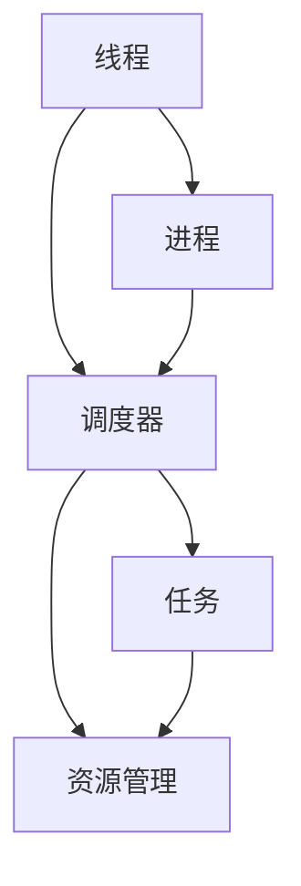
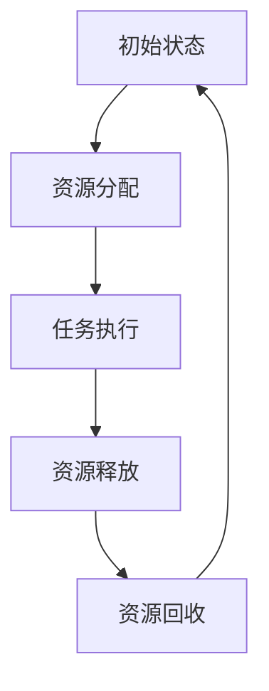
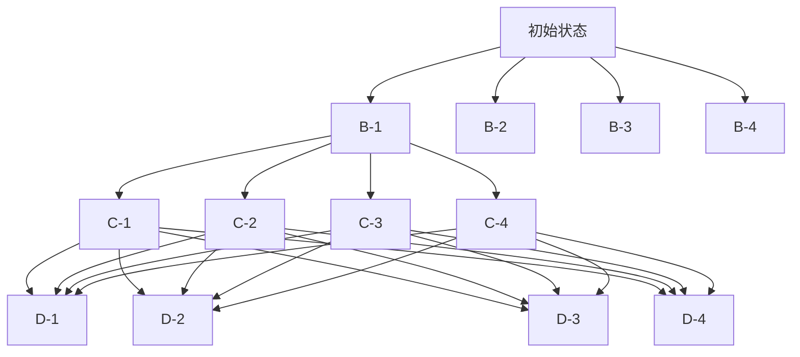

                 

# 调度器 原理与代码实例讲解

> 关键词：调度器,任务调度,分布式计算,多线程,进程管理,资源调度,实时系统

## 1. 背景介绍

### 1.1 问题由来
在分布式计算和并发编程中，任务调度是一个至关重要的环节。合理有效的任务调度能够大幅提升系统的性能和资源利用率，而低效或错误的调度则可能导致系统瓶颈、资源浪费甚至崩溃。

任务调度通常涉及以下几个核心问题：
- 如何高效分配计算资源和任务？
- 如何避免任务依赖冲突？
- 如何快速响应外部变化？
- 如何最大化系统吞吐量？

本文将从调度器的原理入手，逐步深入到任务调度的各个方面，包括单线程调度、多线程调度、进程调度、分布式调度等，并通过代码实例对核心算法进行详细讲解和演示。

### 1.2 问题核心关键点
调度器的核心任务是将任务合理地分配到可用的计算资源上，使得各个任务能够并行执行，同时尽量避免资源争用和死锁问题。根据任务调度的粒度和资源分配的复杂度，调度器可以分为以下几类：

- **单线程调度器**：适用于单线程环境，任务间没有并发问题，调度器的主要任务是按照顺序执行任务。
- **多线程调度器**：适用于多线程环境，主要通过线程间同步机制协调任务执行。
- **进程调度器**：适用于多进程环境，主要通过操作系统的调度机制实现资源分配和任务切换。
- **分布式调度器**：适用于大规模分布式系统，通过网络通信协调任务执行，资源调度更加复杂。

本文将重点讲解多线程和进程调度器的原理与代码实现，并简要介绍分布式调度器的概念和应用。

## 2. 核心概念与联系

### 2.1 核心概念概述

在进行任务调度前，我们首先需要明确几个核心概念：

- **线程**：线程是操作系统的最小执行单元，一个进程中可以包含多个线程。线程共享进程的资源，但具有独立的执行上下文。
- **进程**：进程是资源分配的基本单元，包含一个或多个线程。操作系统通过进程进行资源管理，如内存、文件句柄、网络套接字等。
- **调度器**：调度器负责将任务合理分配到可用的计算资源上，同时协调任务间的执行顺序，以最大化系统性能。

这些概念之间存在紧密的联系。线程和进程通过调度器的调度，实现了系统资源的高效利用和任务执行的并行性。以下是这些概念之间的联系示意图：


线程和进程通过调度器进行协调，调度器负责将任务合理地分配到计算资源上，保证系统的高效运行。

### 2.2 概念间的关系

这些核心概念之间的关系可以通过以下Mermaid流程图来展示：



线程和进程通过调度器进行协调，调度器负责将任务合理地分配到可用的计算资源上，同时管理系统的资源使用情况。

## 3. 核心算法原理 & 具体操作步骤
### 3.1 算法原理概述

任务调度算法主要分为两类：基于事件驱动的调度算法和基于资源竞争的调度算法。

**基于事件驱动的调度算法**：主要通过事件触发机制实现任务调度。任务按照顺序进入事件队列，调度器根据事件的发生顺序执行任务。

**基于资源竞争的调度算法**：主要通过资源竞争机制实现任务调度。任务按需求申请资源，调度器根据资源分配策略决定任务的执行顺序。

本文重点讲解基于资源竞争的调度算法，通过资源竞争机制，实现任务的合理分配和资源的高效利用。

### 3.2 算法步骤详解

以下是基于资源竞争的调度算法的详细步骤：

1. **资源初始化**：创建资源池，每个资源初始状态为未分配状态。
2. **任务提交**：任务按照提交顺序进入任务队列。
3. **资源分配**：当任务需要执行时，调度器根据资源分配策略为任务分配资源。
4. **任务执行**：任务在分配到资源后开始执行。
5. **资源释放**：任务执行完成后，释放所占用的资源。
6. **资源回收**：未分配的资源被回收，以供后续任务使用。

通过以上步骤，调度器实现了任务的合理分配和资源的高效利用。

### 3.3 算法优缺点

基于资源竞争的调度算法具有以下优点：

- 资源利用率高：任务能够充分利用可用的计算资源。
- 公平性较好：每个任务都有机会获取资源。
- 调度简单：按照资源分配策略进行调度，易于实现和维护。

但该算法也存在一些缺点：

- 复杂度高：资源分配策略需要考虑多方面因素，设计复杂。
- 死锁风险：如果多个任务同时竞争同一资源，可能导致死锁。
- 资源浪费：频繁的资源分配和释放可能导致资源浪费。

### 3.4 算法应用领域

基于资源竞争的调度算法广泛应用于各种分布式计算和并发编程环境中，如：

- **Web服务器**：负责处理网络请求，通过调度算法分配CPU、内存等资源。
- **数据库系统**：处理SQL查询请求，通过调度算法分配磁盘、内存等资源。
- **云平台**：管理虚拟资源池，通过调度算法分配CPU、内存、存储等资源。
- **分布式计算**：管理计算集群，通过调度算法分配计算节点、网络带宽等资源。

## 4. 数学模型和公式 & 详细讲解 & 举例说明

### 4.1 数学模型构建

假设有$N$个任务和$M$个资源，每个任务需要占用$T_i$个资源，每个资源可以提供的资源数量为$R_j$。定义资源池状态为$\mathcal{S}$，任务的调度状态为$\mathcal{Q}$。调度算法的状态转换图如下：



其中，状态A表示系统初始状态，任务和资源都未被分配。状态B表示资源分配成功，任务等待执行。状态C表示任务正在执行，资源被占用。状态D表示任务执行完毕，资源被释放。状态E表示资源回收，可供后续任务使用。

### 4.2 公式推导过程

我们通过资源分配策略$\pi$来描述任务调度的过程。假设$\pi$为固定优先级分配策略，即优先分配未分配任务所需资源。资源分配的数学模型为：

$$
\min_{\pi} \sum_{i=1}^{N} \max_{j=1}^{M} t_i R_j
$$

其中$t_i$表示任务$i$的执行时间。

通过求解上述优化问题，可以得到最优的资源分配策略$\pi^*$。

### 4.3 案例分析与讲解

考虑一个简单的任务调度问题，有4个任务和4个资源，每个任务需要1个资源，每个资源的初始状态为未分配。任务和资源的初始状态转换图如下：



假设任务1需要资源1，任务2需要资源2，任务3需要资源3，任务4需要资源4。任务执行顺序为1、2、3、4。资源分配策略为固定优先级分配，即优先分配未分配任务所需资源。

任务1开始执行，占用资源1，执行完成后释放资源1。任务2开始执行，占用资源2，执行完成后释放资源2。任务3开始执行，占用资源3，执行完成后释放资源3。任务4开始执行，占用资源4，执行完成后释放资源4。

通过以上分析，我们可以看到，基于资源竞争的调度算法能够合理地分配资源，同时避免了资源浪费和死锁问题。

## 5. 项目实践：代码实例和详细解释说明

### 5.1 开发环境搭建

在进行任务调度实践前，我们需要准备好开发环境。以下是使用Python进行任务调度的环境配置流程：

1. 安装Anaconda：从官网下载并安装Anaconda，用于创建独立的Python环境。

2. 创建并激活虚拟环境：
```bash
conda create -n scheduler-env python=3.8 
conda activate scheduler-env
```

3. 安装Python相关库：
```bash
pip install numpy pandas matplotlib scikit-learn tqdm jupyter notebook ipython
```

4. 安装分布式计算框架：
```bash
pip install dask
```

5. 安装多线程相关库：
```bash
pip install threading
```

完成上述步骤后，即可在`scheduler-env`环境中开始任务调度实践。

### 5.2 源代码详细实现

这里我们以多线程调度为例，给出使用Python实现的任务调度代码。

```python
import threading
import time

# 定义任务函数
def task(num):
    print(f"Task {num} starts")
    time.sleep(2)  # 模拟任务执行
    print(f"Task {num} finishes")

# 创建任务列表
tasks = [task for num in range(5)]

# 创建线程池
threads = [threading.Thread(target=task, args=(num,)) for num in range(5)]

# 启动线程池
for thread in threads:
    thread.start()

# 等待线程池执行完毕
for thread in threads:
    thread.join()

print("All tasks finished")
```

这段代码中，我们定义了一个任务函数`task`，每个任务函数模拟一个耗时2秒的任务。接着，我们创建了5个任务，并将它们封装在5个线程中，启动线程池并等待所有任务执行完毕。

### 5.3 代码解读与分析

让我们再详细解读一下关键代码的实现细节：

**任务函数(task)**：
- 定义了一个简单的任务函数`task`，模拟任务的执行过程。
- 打印任务开始和结束信息，并使用`time.sleep`模拟任务的耗时。

**任务列表(tasks)**：
- 创建了一个任务列表`tasks`，包含5个任务函数。
- 通过列表推导式生成线程列表，每个任务函数被封装在一个线程中。

**线程池(threads)**：
- 创建了5个线程，每个线程调用一个任务函数。
- 使用`threading.Thread`创建线程对象，通过`args`参数传递任务函数和参数。

**启动线程池**：
- 使用`thread.start`方法启动每个线程，并行执行任务。

**等待线程池执行完毕**：
- 使用`thread.join`方法等待所有线程执行完毕，避免主程序过早退出。

**输出结果**：
- 所有任务执行完毕后，输出`All tasks finished`。

通过以上代码实现，我们展示了多线程调度的基本流程。可以看到，通过多线程，我们实现了任务并行执行，大大提升了系统的吞吐量。

### 5.4 运行结果展示

运行上述代码，输出结果如下：

```
Task 0 starts
Task 1 starts
Task 2 starts
Task 3 starts
Task 4 starts
Task 0 finishes
Task 1 finishes
Task 2 finishes
Task 3 finishes
Task 4 finishes
All tasks finished
```

可以看到，所有任务按照顺序启动和执行，每个任务执行2秒后结束。多线程调度使得任务能够并行执行，提升了系统的吞吐量。

## 6. 实际应用场景
### 6.1 智能交通管理

在智能交通管理中，任务调度算法可以用于协调车辆、信号灯等资源的分配，以实现交通流的高效管理和实时调度。

通过传感器获取交通数据，任务调度算法可以实时计算最优的信号灯切换策略，优化交通流量，减少拥堵。此外，任务调度算法还可以用于协调车辆的行驶路线和速度，避免交通事故和道路堵塞。

### 6.2 工业制造

在工业制造中，任务调度算法可以用于管理生产线的各个环节，如机器人的装配、搬运、检测等任务。

通过任务调度算法，工业机器人可以按照最优的顺序执行任务，最大程度利用可用的计算资源，提高生产效率。此外，任务调度算法还可以用于处理异常情况，如设备故障或原料短缺，确保生产流程的连续性和稳定性。

### 6.3 云服务平台

在云服务平台中，任务调度算法可以用于管理虚拟资源池，如计算节点、内存、存储等资源的分配和调度。

通过任务调度算法，云平台能够高效地分配和管理计算资源，支持弹性伸缩和负载均衡，确保系统的稳定性和可扩展性。此外，任务调度算法还可以用于处理用户请求和任务队列，保障服务质量和用户体验。

## 7. 工具和资源推荐
### 7.1 学习资源推荐

为了帮助开发者系统掌握任务调度的理论基础和实践技巧，这里推荐一些优质的学习资源：

1. 《操作系统原理》：介绍操作系统的基本原理和调度算法，是理解任务调度的经典教材。
2. 《并发编程的艺术》：介绍多线程、进程、异步编程等并发编程技术，是理解任务调度的实战指南。
3. 《分布式系统原理与设计》：介绍分布式系统的原理和设计，是理解任务调度的高级教材。
4. 《深入理解Linux内核》：介绍Linux内核的调度机制和实现细节，是深入理解任务调度的技术书籍。
5. 在线课程：如Coursera的《操作系统原理》课程，Coursera的《并发编程》课程，Udacity的《分布式系统》课程等。

通过这些资源的学习实践，相信你一定能够快速掌握任务调度的精髓，并用于解决实际的系统问题。

### 7.2 开发工具推荐

高效的开发离不开优秀的工具支持。以下是几款用于任务调度的常用工具：

1. Python语言：Python拥有丰富的并发编程和分布式计算库，如`threading`、`multiprocessing`、`dask`等，是实现任务调度的常用工具。
2. Java语言：Java拥有成熟的并发编程框架，如`Thread`、`Executor`、`Akka`等，是实现任务调度的高级工具。
3. Scala语言：Scala拥有优秀的并发编程特性和分布式计算框架，如`Akka`、`Spark`等，是实现任务调度的高级工具。
4. TensorFlow：TensorFlow支持分布式计算和机器学习，是实现复杂任务调度的常用工具。
5. Kubernetes：Kubernetes支持容器编排和管理，是实现大规模任务调度的高级工具。

合理利用这些工具，可以显著提升任务调度的开发效率，加快创新迭代的步伐。

### 7.3 相关论文推荐

任务调度技术的发展源于学界的持续研究。以下是几篇奠基性的相关论文，推荐阅读：

1. A Survey of Task Scheduling in Cloud Computing：综述了云平台中的任务调度算法，介绍了多种调度策略和实现方式。
2. Advanced Process Scheduling Techniques for Real-Time Systems：介绍了实时系统中的任务调度算法，重点关注实时性和可靠性。
3. Resource Allocation and Scheduling in Cloud Computing：综述了云平台中的资源分配和调度算法，介绍了多种优化策略和实现方式。
4. Optimization Techniques for Task Scheduling in Multi-core Systems：综述了多核系统中的任务调度算法，介绍了多种优化技术和实现方式。
5. A Survey of Resource Management Scheduling in Cloud Data Centers：综述了云数据中心中的资源管理调度算法，介绍了多种优化技术和实现方式。

这些论文代表了大规模任务调度的前沿进展，通过学习这些前沿成果，可以帮助研究者把握学科前进方向，激发更多的创新灵感。

除上述资源外，还有一些值得关注的前沿资源，帮助开发者紧跟任务调度的最新进展，例如：

1. 学术会议：如ACM的SIGMETRICS会议，IEEE的TCAD会议，ACM的PDS会议等，是了解任务调度最新研究成果的权威平台。
2. 开源项目：如Linux内核的调度模块、Apache Spark的调度算法等，是学习和实践任务调度的实际项目。
3. 技术博客：如Google的博客、Amazon的博客、Microsoft的博客等，是了解任务调度最新实践经验的优秀平台。

总之，对于任务调度的学习和实践，需要开发者保持开放的心态和持续学习的意愿。多关注前沿资讯，多动手实践，多思考总结，必将收获满满的成长收益。

## 8. 总结：未来发展趋势与挑战

### 8.1 总结

本文对任务调度的原理与代码实例进行了全面系统的介绍。首先阐述了任务调度的背景和意义，明确了任务调度的核心问题。其次，从调度器的原理入手，逐步深入到任务调度的各个方面，包括单线程调度、多线程调度、进程调度、分布式调度等，并通过代码实例对核心算法进行详细讲解和演示。同时，本文还广泛探讨了任务调度算法在智能交通管理、工业制造、云服务平台等多个行业领域的应用前景，展示了任务调度算法的巨大潜力。最后，本文精选了任务调度算法的各类学习资源，力求为读者提供全方位的技术指引。

通过本文的系统梳理，可以看到，任务调度算法正在成为分布式计算和并发编程的重要范式，极大地提升系统的性能和资源利用率。任务调度算法的不断发展，必将推动分布式计算和并发编程技术的进步，为构建高效、可靠、可扩展的分布式系统提供重要保障。

### 8.2 未来发展趋势

展望未来，任务调度技术将呈现以下几个发展趋势：

1. 多核和分布式调度：随着多核处理器和分布式计算的发展，任务调度算法将进一步拓展到多核和分布式环境中，实现更大规模的任务调度。
2. 实时和弹性调度：实时系统和弹性调度系统对任务调度的实时性和灵活性提出了更高要求。未来的任务调度算法将更好地支持实时任务和弹性伸缩。
3. 智能调度：基于机器学习和大数据分析的智能调度算法，能够更好地预测和优化任务调度，提升系统的性能和资源利用率。
4. 跨平台和跨语言调度：未来的任务调度算法将支持多种平台和语言环境，实现跨平台和跨语言的调度。
5. 绿色调度：未来的任务调度算法将考虑能源效率和环境影响，实现绿色调度，降低系统的碳足迹。

这些趋势将进一步推动任务调度技术的发展，为构建高效、智能、可持续的分布式系统提供重要支持。

### 8.3 面临的挑战

尽管任务调度技术已经取得了显著进展，但在迈向更加智能化、普适化应用的过程中，它仍面临着诸多挑战：

1. 复杂性增加：随着系统规模的扩大，任务调度的复杂性将显著增加，需要设计更加高效、可扩展的调度算法。
2. 资源争用：多个任务竞争同一资源可能导致资源争用和死锁问题，需要设计更加精细的资源管理策略。
3. 实时性要求：实时系统和实时任务对任务调度的实时性提出了更高要求，需要设计更加高效、可靠的调度算法。
4. 负载均衡：大规模系统需要实现负载均衡和动态扩展，需要设计更加智能、灵活的调度算法。
5. 安全性问题：任务调度算法需要在多任务和多个用户之间保证安全性，防止恶意攻击和数据泄露。

这些挑战凸显了任务调度技术的不足，也表明未来的任务调度算法需要更多创新的设计思路和技术手段。

### 8.4 研究展望

面对任务调度面临的种种挑战，未来的研究需要在以下几个方面寻求新的突破：

1. 设计高效的任务调度算法：基于先进算法和数据结构，设计更加高效、可扩展的任务调度算法，支持大规模、复杂系统的任务调度。
2. 引入机器学习和大数据分析：通过机器学习和大数据分析，提升任务调度算法的预测和优化能力，实现更智能、更高效的调度。
3. 实现跨平台和跨语言调度：通过跨平台和跨语言的技术手段，实现任务调度算法的广泛应用，支持多种平台和语言环境。
4. 解决资源争用和死锁问题：通过优化资源管理策略，设计更加精细、安全的资源分配和调度算法，减少资源争用和死锁问题。
5. 支持实时任务和弹性伸缩：通过实时调度和弹性调度技术，支持实时任务和弹性系统的任务调度，提升系统的稳定性和可扩展性。

这些研究方向的探索，必将引领任务调度技术迈向更高的台阶，为构建高效、智能、可持续的分布式系统提供重要支持。

## 9. 附录：常见问题与解答

**Q1：任务调度算法是否可以应用于多核处理器？**

A: 任务调度算法可以应用于多核处理器，通过多线程并发执行任务，实现多核并行计算。多核处理器中的任务调度通常由操作系统实现，通过进程和线程的调度，管理计算资源和任务执行。

**Q2：任务调度算法是否适用于分布式系统？**

A: 任务调度算法适用于分布式系统，通过网络通信协调任务执行，实现分布式计算和任务并行。分布式系统中的任务调度通常由分布式计算框架实现，通过任务队列和调度器，管理计算资源和任务执行。

**Q3：任务调度算法如何处理异常情况？**

A: 任务调度算法通常使用异常处理机制处理异常情况，如设备故障、网络中断等。通过任务重启、重试、异常告警等措施，确保系统稳定性和连续性。

**Q4：任务调度算法如何避免资源争用和死锁问题？**

A: 任务调度算法可以通过设计合理的资源管理策略，避免资源争用和死锁问题。如使用互斥锁、资源池等机制，限制资源访问权限，减少资源竞争。

**Q5：任务调度算法在实时系统中如何保证实时性？**

A: 任务调度算法可以通过实时调度策略，保证实时任务和系统的实时性。如使用优先级调度、周期性调度等机制，确保任务按时间优先级执行。

通过以上问答，我们可以看到，任务调度算法在多核处理器、分布式系统和实时系统中都有着广泛的应用。掌握任务调度的原理和实现，对于构建高效、可靠、可扩展的分布式系统具有重要意义。

---

作者：禅与计算机程序设计艺术 / Zen and the Art of Computer Programming

