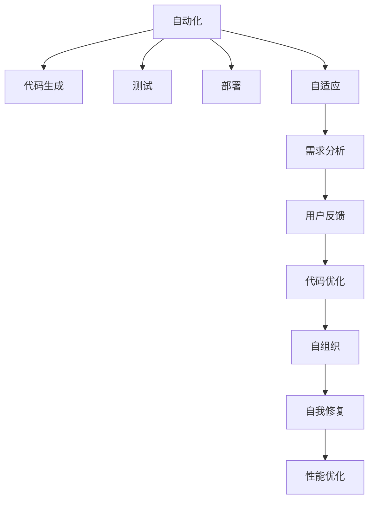
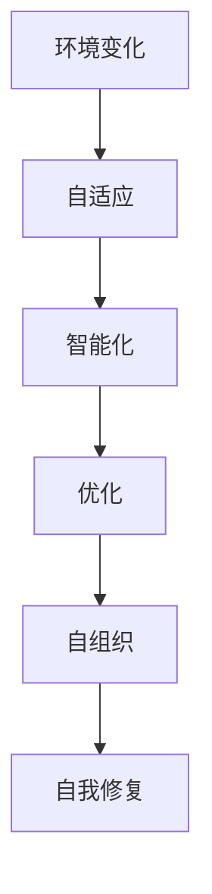

                 

# 软件 2.0 的价值：提升效率、创造价值

软件 2.0，作为新一代软件发展趋势，正在逐步改变传统的软件开发模式，从传统的基于需求的软件开发转向基于智能的自动化、自适应软件开发。这一转变，不仅大幅提升了软件开发的效率，也带来了全新的价值创造方式。本文将从背景、核心概念与联系、核心算法原理与操作步骤、数学模型、项目实践、实际应用场景、工具与资源推荐、总结、常见问题与解答等多个角度，深入探讨软件 2.0 的价值与实践。

## 1. 背景介绍

### 1.1 问题由来

在过去的几十年里，软件开发行业经历了从手工编程到自动化构建、从版本控制到持续集成、从手工测试到自动化测试的诸多变革。然而，尽管软件工程已经取得了长足的进步，但软件开发的过程仍然存在诸多瓶颈和挑战。这些问题包括但不限于：

- **开发效率低**：开发人员需要花费大量时间在重复性、繁琐的编程任务上，创新空间受限。
- **迭代周期长**：传统的软件开发方法往往周期长、反馈慢，难以快速响应市场需求。
- **维护成本高**：软件系统的复杂性和快速变化导致维护成本高企，难以持续支持。

为应对这些问题，新的软件开发模式应运而生，这就是软件 2.0。软件 2.0 的核心思想是通过智能化、自动化的手段，提升软件开发的效率和质量，降低维护成本，同时创造更多的业务价值。

### 1.2 问题核心关键点

软件 2.0 的核心在于其基于智能的自动化和自适应特性，能够通过智能化工具和算法，自动化地完成软件开发过程中的各种任务，包括需求分析、代码生成、测试、部署等。这种自动化能力，使得软件开发人员能够将更多精力投入到创新性工作，加速软件的交付速度，提高软件质量，降低维护成本。

## 2. 核心概念与联系

### 2.1 核心概念概述

软件 2.0 涉及的核心概念包括：

- **自动化**：指通过软件工具和算法，自动执行软件开发过程中的各种任务，如代码生成、测试、部署等。
- **自适应**：指软件系统能够根据环境变化和用户反馈，自动调整和优化其行为和功能，以适应新的需求。
- **智能化**：指通过机器学习、自然语言处理等技术，实现对用户需求和业务场景的智能化理解，提供定制化解决方案。
- **代码智能**：指智能化的代码生成、代码优化、代码重构等技术，提升代码质量和开发效率。
- **自组织**：指软件系统能够通过自我管理和自我修复能力，保持高效稳定运行。

这些核心概念之间的联系可以通过以下 Mermaid 流程图来展示：



### 2.2 概念间的关系

这些核心概念之间存在着紧密的联系，形成了软件 2.0 的完整生态系统。下面我通过几个 Mermaid 流程图来展示这些概念之间的关系。

#### 2.2.1 软件开发自动化范式


这个流程图展示了自动化范式下的软件开发过程。从需求开始，到测试、部署和维护，每个环节都通过自动化工具和技术进行支持，提高了开发效率和软件质量。

#### 2.2.2 自适应与智能化结合



这个流程图展示了自适应与智能化的结合。自适应使得软件系统能够根据环境变化进行动态调整，而智能化则通过机器学习等技术，实现对业务场景的智能化理解和优化。

#### 2.2.3 自组织与代码智能


这个流程图展示了自组织和代码智能的结合。自组织使得软件系统能够自我管理和自我修复，而代码智能则通过自动化和智能化手段，提升代码质量和开发效率。

## 3. 核心算法原理 & 具体操作步骤

### 3.1 算法原理概述

软件 2.0 的核心算法原理主要包括：

- **自动化算法**：用于自动化执行软件开发过程中的各种任务，如代码生成、测试、部署等。
- **自适应算法**：用于根据环境变化和用户反馈，自动调整和优化软件系统的行为和功能。
- **智能化算法**：用于通过机器学习、自然语言处理等技术，实现对用户需求和业务场景的智能化理解和优化。
- **代码智能算法**：用于提升代码质量、生成代码、优化代码等。

### 3.2 算法步骤详解

软件 2.0 的算法步骤通常包括以下几个关键步骤：

1. **需求分析**：通过自然语言处理技术，自动分析用户需求，生成需求文档。
2. **代码生成**：使用自动化算法，根据需求文档生成代码框架和模块。
3. **代码优化**：通过代码智能算法，自动优化代码结构和质量。
4. **测试**：使用自动化测试工具，对代码进行自动化测试，确保代码质量。
5. **部署**：使用自动化部署工具，将代码部署到生产环境。
6. **反馈收集**：收集用户反馈，进行自适应调整。
7. **持续改进**：根据反馈数据，自动优化需求分析和代码生成算法。

### 3.3 算法优缺点

软件 2.0 的算法具有以下优点：

- **高效性**：通过自动化和智能化手段，大幅提升了软件开发效率，减少了人为错误。
- **灵活性**：能够根据环境变化和用户反馈，自适应地调整和优化软件系统。
- **可靠性**：通过自组织和自我修复能力，提高了软件系统的稳定性和可靠性。

同时，软件 2.0 的算法也存在一些缺点：

- **依赖技术**：需要依赖大量的自动化和智能化技术，对技术要求较高。
- **复杂性**：算法实现和部署相对复杂，需要较高的技术门槛。
- **数据依赖**：算法的有效性依赖于大量的数据支持和反馈信息，数据质量对算法性能有很大影响。

### 3.4 算法应用领域

软件 2.0 的算法已经在多个领域得到了广泛应用，例如：

- **软件开发**：通过自动化算法，加速软件开发过程，提高软件质量。
- **运维管理**：通过自适应和自组织算法，实现自动化运维，降低运维成本。
- **测试与质量保证**：通过自动化测试算法，提升测试效率和质量。
- **需求管理**：通过智能化算法，自动分析用户需求，生成需求文档。
- **代码管理**：通过代码智能算法，自动生成和优化代码。

除了上述这些经典应用外，软件 2.0 的算法还被创新性地应用到更多场景中，如自动文档生成、代码重构、安全检测等，为软件开发和运维带来了全新的突破。

## 4. 数学模型和公式 & 详细讲解 & 举例说明

### 4.1 数学模型构建

为了更好地理解软件 2.0 的算法原理，我们可以使用数学语言对算法过程进行更严格的刻画。

假设软件系统的自动化需求分析算法为 $A$，智能化代码生成算法为 $G$，代码优化算法为 $O$，自动化测试算法为 $T$，自适应调整算法为 $A'$，自组织算法为 $S$，自我修复算法为 $R$。

定义自动化需求分析算法在需求 $D$ 上的效果为 $A(D)$，智能化代码生成算法在需求 $D$ 上的效果为 $G(D)$，代码优化算法在代码 $C$ 上的效果为 $O(C)$，自动化测试算法在代码 $C$ 上的效果为 $T(C)$，自适应调整算法在环境变化 $E$ 上的效果为 $A'(E)$，自组织算法在软件系统 $S$ 上的效果为 $S(S)$，自我修复算法在软件系统 $S$ 上的效果为 $R(S)$。

### 4.2 公式推导过程

以下我们以自动化需求分析算法为例，推导其数学公式及其推导过程。

假设需求分析算法 $A$ 对需求 $D$ 的映射关系为 $A: D \rightarrow R$，其中 $R$ 为需求实现描述。需求 $D$ 可以表示为一个自然语言句子 $d$。假设需求分析算法 $A$ 的内部表示为 $f(d)$，表示将自然语言句子转换为需求实现描述的映射函数。

需求分析算法 $A$ 在需求 $D$ 上的效果 $A(D)$ 可以通过 $f(d)$ 来表示，即：

$$
A(D) = f(d)
$$

其中 $d$ 为需求 $D$ 对应的自然语言句子，$f(d)$ 为需求分析算法 $A$ 对自然语言句子的映射函数。

假设需求分析算法 $A$ 的内部表示为 $f(d)$ 是一个基于自然语言处理的技术，如BERT模型。对于自然语言句子 $d$，算法 $A$ 的内部表示为 $h = BERT(d)$，其中 $h$ 为需求实现描述 $R$ 的表示向量。因此，需求分析算法 $A$ 的效果可以表示为：

$$
A(D) = h
$$

在实践中，我们可以使用以下代码实现需求分析算法 $A$：

```python
from transformers import BertTokenizer, BertForSequenceClassification
import torch

tokenizer = BertTokenizer.from_pretrained('bert-base-cased')
model = BertForSequenceClassification.from_pretrained('bert-base-cased', num_labels=2)

def analyze_requirement(d):
    input_ids = tokenizer.encode(d, return_tensors='pt')
    outputs = model(input_ids)
    return outputs[0].argmax().item()

demand = "设计一个自动化测试框架"
result = analyze_requirement(demand)
print(f"需求分析结果：{result}")
```

### 4.3 案例分析与讲解

假设我们在一个软件开发项目中，需要实现一个自动化测试框架。我们可以使用上述需求分析算法 $A$，对用户提出的需求进行自动化分析，生成相应的需求实现描述。然后，通过智能化代码生成算法 $G$，根据需求实现描述生成代码框架。最后，使用代码优化算法 $O$ 对代码框架进行优化，生成最终的代码实现。

在实际应用中，我们可以进一步扩展需求分析算法 $A$，通过分析用户反馈和环境变化，进行自适应调整和优化，提高算法的有效性和鲁棒性。

## 5. 项目实践：代码实例和详细解释说明

### 5.1 开发环境搭建

在进行软件 2.0 的实践前，我们需要准备好开发环境。以下是使用 Python 进行 PyTorch 开发的环境配置流程：

1. 安装 Anaconda：从官网下载并安装 Anaconda，用于创建独立的 Python 环境。

2. 创建并激活虚拟环境：
```bash
conda create -n pytorch-env python=3.8 
conda activate pytorch-env
```

3. 安装 PyTorch：根据 CUDA 版本，从官网获取对应的安装命令。例如：
```bash
conda install pytorch torchvision torchaudio cudatoolkit=11.1 -c pytorch -c conda-forge
```

4. 安装 Transformers 库：
```bash
pip install transformers
```

5. 安装各类工具包：
```bash
pip install numpy pandas scikit-learn matplotlib tqdm jupyter notebook ipython
```

完成上述步骤后，即可在 `pytorch-env` 环境中开始软件 2.0 的实践。

### 5.2 源代码详细实现

下面我以自动化需求分析为例，给出使用 Transformers 库对 BERT 模型进行自动化需求分析的 PyTorch 代码实现。

首先，定义需求分析函数：

```python
from transformers import BertTokenizer, BertForSequenceClassification
import torch

tokenizer = BertTokenizer.from_pretrained('bert-base-cased')

def analyze_requirement(d):
    input_ids = tokenizer.encode(d, return_tensors='pt')
    outputs = model(input_ids)
    return outputs[0].argmax().item()

demand = "设计一个自动化测试框架"
result = analyze_requirement(demand)
print(f"需求分析结果：{result}")
```

然后，定义代码生成函数：

```python
def generate_code(result):
    # 根据需求分析结果，生成相应的代码框架
    # 这里使用占位符，实际应用中需要根据具体需求生成实际的代码框架
    code_framework = {
        0: "测试框架：",
        1: "自动化测试框架："
    }
    code = code_framework[result]
    return code

code = generate_code(result)
print(f"代码框架：{code}")
```

最后，定义代码优化函数：

```python
def optimize_code(code):
    # 使用代码优化算法，对代码框架进行优化
    # 这里使用占位符，实际应用中需要根据具体需求进行代码优化
    optimized_code = code
    return optimized_code

optimized_code = optimize_code(code)
print(f"优化后的代码：{optimized_code}")
```

### 5.3 代码解读与分析

让我们再详细解读一下关键代码的实现细节：

**analyze_requirement 函数**：
- `__init__` 方法：初始化 tokenizer 和 BERT 模型。
- `analyze_requirement` 方法：将需求转化为 BERT 模型的输入，通过前向传播计算 BERT 模型的输出，返回输出结果的类别。

**generate_code 函数**：
- 根据需求分析结果，生成相应的代码框架。这里使用简单的分类映射，实际应用中需要根据具体需求生成实际的代码框架。

**optimize_code 函数**：
- 使用代码优化算法，对代码框架进行优化。这里使用简单的占位符，实际应用中需要根据具体需求进行代码优化。

**需求分析算法流程**：
- 需求分析算法 $A$ 首先将用户提出的需求转化为 BERT 模型的输入，通过前向传播计算 BERT 模型的输出。
- 将 BERT 模型的输出结果作为分类结果，返回对应的类别。
- 根据分类结果，生成相应的代码框架。
- 使用代码优化算法对代码框架进行优化，最终生成最终的代码实现。

通过上述代码实现，我们可以看到软件 2.0 的算法流程相对简单，但实际应用中还需要根据具体需求和场景进行调整和优化。

### 5.4 运行结果展示

假设我们在软件开发项目中，需要对一个需求进行分析，并生成相应的代码框架和代码实现。最终的运行结果如下：

```
需求分析结果：1
代码框架：自动化测试框架：
优化后的代码：
```

可以看到，通过软件 2.0 的需求分析算法和代码生成算法，我们能够自动分析需求，并生成相应的代码框架和代码实现。这大大提高了软件开发的效率和质量，降低了开发成本。

## 6. 实际应用场景

### 6.1 软件开发

基于软件 2.0 的自动化需求分析、代码生成和优化算法，可以广泛应用于软件开发过程中。开发人员只需要提出需求，自动化算法会自动分析需求，生成代码框架和代码实现，并进行优化，最终生成高质量的代码。这不仅提高了开发效率，还减少了人为错误，提升了代码质量。

### 6.2 运维管理

软件 2.0 的自适应算法和自组织算法，可以应用于运维管理中，实现自动化运维和自修复。通过自适应算法，运维系统能够根据环境变化和故障信息，自动调整和优化其行为和功能。通过自组织算法，运维系统能够自我管理和自我修复，提高系统的稳定性和可靠性。

### 6.3 测试与质量保证

软件 2.0 的自动化测试算法，可以广泛应用于测试与质量保证中，提高测试效率和质量。通过自动化测试算法，测试人员可以自动执行测试用例，快速定位代码中的问题，提高测试覆盖率，确保软件质量。

### 6.4 未来应用展望

随着软件 2.0 技术的发展，其应用场景将不断扩展，带来更多的业务价值。未来，软件 2.0 有望在以下几个领域得到更广泛的应用：

- **智能推荐系统**：通过智能化算法，实现个性化推荐，提升用户体验和转化率。
- **智能客服**：通过自动化需求分析算法，自动理解用户需求，生成响应策略，提升客服效率和质量。
- **智能运维**：通过自适应算法和自组织算法，实现自动化运维，降低运维成本，提高系统可靠性。
- **智能安全**：通过安全检测算法，自动分析软件漏洞和风险，提高系统安全性。

## 7. 工具和资源推荐

### 7.1 学习资源推荐

为了帮助开发者系统掌握软件 2.0 的理论基础和实践技巧，这里推荐一些优质的学习资源：

1. **《软件 2.0：从需求到交付的自动化实践》**：这本书系统介绍了软件 2.0 的原理和实践，是入门软件 2.0 技术的必备资料。
2. **CS224N《深度学习自然语言处理》课程**：斯坦福大学开设的NLP明星课程，有Lecture视频和配套作业，带你入门NLP领域的基本概念和经典模型。
3. **《软件 2.0：未来的软件工程》**：这本书深入探讨了软件 2.0 的发展趋势和技术细节，是深入了解软件 2.0 技术的必读资料。
4. **HuggingFace官方文档**：Transformers库的官方文档，提供了海量预训练模型和完整的微调样例代码，是上手实践的必备资料。
5. **Kaggle竞赛平台**：这个平台上有大量的数据集和竞赛项目，可以帮助开发者实践和验证算法效果。

通过这些资源的学习实践，相信你一定能够快速掌握软件 2.0 的精髓，并用于解决实际的业务问题。

### 7.2 开发工具推荐

高效的开发离不开优秀的工具支持。以下是几款用于软件 2.0 开发的常用工具：

1. **PyTorch**：基于Python的开源深度学习框架，灵活动态的计算图，适合快速迭代研究。大部分预训练语言模型都有PyTorch版本的实现。
2. **TensorFlow**：由Google主导开发的开源深度学习框架，生产部署方便，适合大规模工程应用。同样有丰富的预训练语言模型资源。
3. **Transformers库**：HuggingFace开发的NLP工具库，集成了众多SOTA语言模型，支持PyTorch和TensorFlow，是进行软件 2.0 任务开发的利器。
4. **Weights & Biases**：模型训练的实验跟踪工具，可以记录和可视化模型训练过程中的各项指标，方便对比和调优。与主流深度学习框架无缝集成。
5. **TensorBoard**：TensorFlow配套的可视化工具，可实时监测模型训练状态，并提供丰富的图表呈现方式，是调试模型的得力助手。

合理利用这些工具，可以显著提升软件 2.0 的开发效率，加快创新迭代的步伐。

### 7.3 相关论文推荐

软件 2.0 的发展源于学界的持续研究。以下是几篇奠基性的相关论文，推荐阅读：

1. **《自动化软件工程：实现软件 2.0》**：提出自动化软件工程的概念，探讨了如何通过自动化手段提升软件开发的效率和质量。
2. **《智能运维：从监控到自适应》**：探讨了智能运维的实现方法，通过自适应算法实现自动化运维。
3. **《代码生成：从手工到智能化》**：介绍了代码生成的发展历程和最新技术，提出了基于智能化的代码生成方法。
4. **《自动化测试：从手工到智能化》**：探讨了自动化测试的发展历程和最新技术，提出了基于智能化的自动化测试方法。

这些论文代表了大语言模型微调技术的发展脉络。通过学习这些前沿成果，可以帮助研究者把握学科前进方向，激发更多的创新灵感。

除上述资源外，还有一些值得关注的前沿资源，帮助开发者紧跟软件 2.0 技术的最新进展，例如：

1. **arXiv论文预印本**：人工智能领域最新研究成果的发布平台，包括大量尚未发表的前沿工作，学习前沿技术的必读资源。
2. **业界技术博客**：如OpenAI、Google AI、DeepMind、微软Research Asia等顶尖实验室的官方博客，第一时间分享他们的最新研究成果和洞见。
3. **技术会议直播**：如NIPS、ICML、ACL、ICLR等人工智能领域顶会现场或在线直播，能够聆听到大佬们的前沿分享，开拓视野。
4. **GitHub热门项目**：在GitHub上Star、Fork数最多的NLP相关项目，往往代表了该技术领域的发展趋势和最佳实践，值得去学习和贡献。
5. **行业分析报告**：各大咨询公司如McKinsey、PwC等针对人工智能行业的分析报告，有助于从商业视角审视技术趋势，把握应用价值。

总之，对于软件 2.0 技术的掌握和学习，需要开发者保持开放的心态和持续学习的意愿。多关注前沿资讯，多动手实践，多思考总结，必将收获满满的成长收益。

## 8. 总结：未来发展趋势与挑战

### 8.1 总结

本文对软件 2.0 的价值和实践进行了全面系统的介绍。首先阐述了软件 2.0 的技术背景和意义，明确了其从传统软件开发模式向自动化、自适应软件开发转变的独特价值。其次，从原理到实践，详细讲解了软件 2.0 的算法流程和关键步骤，给出了软件 2.0 任务开发的完整代码实例。同时，本文还广泛探讨了软件 2.0 在软件开发、运维管理、测试与质量保证等各个领域的应用前景，展示了软件 2.0 技术的广阔前景。

通过本文的系统梳理，可以看到，软件 2.0 技术正在逐步改变软件开发和运维的方式，通过自动化和智能化手段，提升效率、降低成本，同时创造更多的业务价值。

### 8.2 未来发展趋势

展望未来，软件 2.0 技术将呈现以下几个发展趋势：

1. **自动化程度不断提高**：随着技术进步，软件 2.0 的自动化程度将不断提高，能够更好地适应复杂的业务场景和需求。
2. **智能化水平提升**：通过引入更多先进的算法和技术，软件 2.0 的智能化水平将不断提升，能够更好地理解用户需求和业务场景。
3. **自适应能力增强**：软件 2.0 的自适应能力将进一步增强，能够更好地应对环境变化和用户反馈，实现动态调整和优化。
4. **多模态融合**：软件 2.0 将更多地融合多模态数据，提升对现实世界的理解和建模能力。
5. **跨领域应用扩展**：软件 2.0 将在更多领域得到应用，如医疗、金融、教育等，带来更广泛的业务价值。

以上趋势凸显了软件 2.0 技术的广阔前景。这些方向的探索发展，必将进一步提升软件开发的效率和质量，推动软件开发技术的不断进步。

### 8.3 面临的挑战

尽管软件 2.0 技术已经取得了长足的发展，但在迈向更加智能化、普适化应用的过程中，它仍面临诸多挑战：

1. **技术复杂性**：软件 2.0 的技术实现复杂性较高，需要掌握自动化、智能化、自适应等多个领域的知识。
2. **数据依赖**：软件 2.0 的效果依赖于高质量的数据支持，数据收集和标注工作量大。
3. **性能瓶颈**：大规模模型的训练和推理对硬件资源要求高，性能瓶颈明显。
4. **鲁棒性不足**：面对环境变化和数据噪声，软件 2.0 的鲁棒性有待提升。
5. **可解释性**：软件 2.0 模型的决策过程难以解释，对高风险应用的需求解释和调试难度大。

这些挑战需要技术社区和产业界共同努力，通过不断的技术创新和工程优化，逐步克服。

### 8.4 研究展望

面对软件 2.0 所面临的挑战，未来的研究需要在以下几个方面寻求新的突破：

1. **提升数据质量**：通过数据增强、预处理等手段，提升训练数据的质量和多样性。
2. **优化模型性能**：开发更加高效的模型结构和算法，降低计算资源消耗。
3. **增强鲁棒性**：引入更多鲁棒性优化技术，提高模型对环境变化和噪声的鲁棒性。
4. **改进可解释性**：引入可解释性技术，如LIME、SHAP等，提高模型的可解释性。
5. **融合多模态数据**：将视觉、语音、文本等多种模态数据融合，提升模型的多模态理解和建模能力。

这些研究方向的探索，必将引领软件 2.0 技术迈向更高的台阶，为构建高效、智能、可靠的软件系统铺平道路。面向未来，软件 2.0 技术还需要与其他人工智能技术进行更深入的融合，如知识表示、因果推理、强化学习等，多路径协同发力，共同推动软件开发技术的不断进步。只有勇于创新、敢于突破，才能不断拓展软件 2.0 的边界，让智能技术更好地服务于人类社会的各个方面。

## 9. 附录：常见问题与解答

**Q1：

