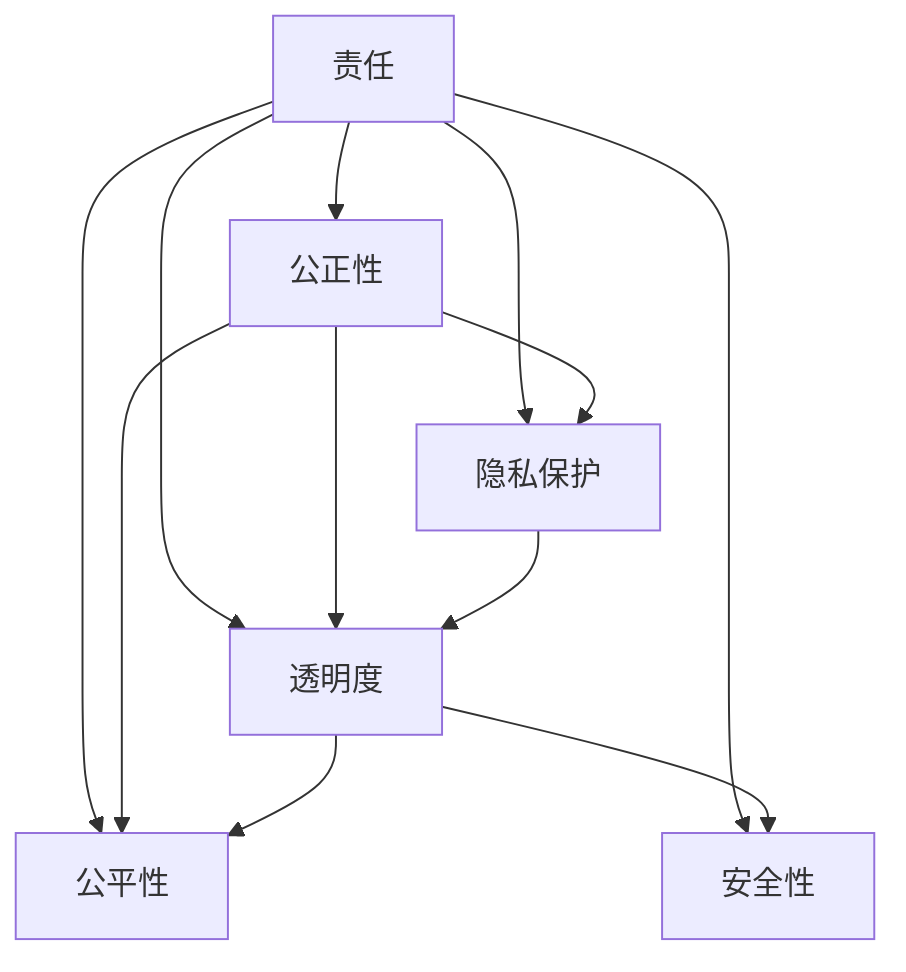

                 

# 软件 2.0 的伦理规范：人工智能的责任

> 关键词：人工智能责任、伦理规范、机器道德、公平性、透明度、隐私保护

## 1. 背景介绍

随着人工智能技术的飞速发展，特别是深度学习和神经网络技术的广泛应用，“软件 2.0”的概念应运而生。相较于传统的软件，软件 2.0 更加智能化，能够自动学习和优化，从数据中挖掘出有用的知识。这些技术的强大能力带来了巨大的商业和社会价值，但也引发了一系列伦理和道德问题。例如，人工智能算法可能存在的偏见、隐私侵犯问题以及缺乏透明度的决策过程等，都引起了公众和监管机构的高度关注。如何构建一个负责任的、道德的人工智能系统，成为当前人工智能领域亟待解决的问题。

### 1.1 软件 2.0 的核心特征

软件 2.0 的核心特征包括：
- **自主学习**：能够从大量数据中自动学习和优化，无需人工干预。
- **自动化决策**：能够根据输入数据自动生成输出，且这一过程无需人工干预。
- **泛化能力**：不仅能在训练数据上表现良好，还能在新数据上表现优异。
- **自适应性**：能够根据环境变化进行调整和优化。

这些特征使得软件 2.0 在处理大规模、复杂的数据集时表现出色，但也带来了伦理和道德上的挑战。

### 1.2 伦理问题的紧迫性

随着人工智能在各个领域的广泛应用，伦理问题变得愈发紧迫。例如，自动驾驶汽车在决策过程中可能面临的道德困境，人脸识别技术可能导致的隐私侵犯问题，以及算法偏见导致的就业歧视问题等，都迫切需要构建一个负责任的、道德的人工智能系统。

## 2. 核心概念与联系

### 2.1 核心概念概述

在讨论人工智能的责任和伦理规范时，有几个核心概念是不可或缺的：

- **责任**：软件 2.0 系统在操作和决策时必须承担的责任，包括但不限于确保系统行为的透明性、公正性和安全性。
- **公正性**：确保所有用户都能公平地获得人工智能服务，避免因算法偏见而导致的歧视。
- **隐私保护**：保护用户数据不被滥用，确保用户的隐私权益得到尊重。
- **透明度**：软件 2.0 系统的决策过程应透明，用户和监管机构应能理解和审查系统的决策逻辑。
- **公平性**：确保不同用户群体在接受人工智能服务时，能够获得相同的质量和效果。
- **安全性**：系统应避免对用户或社会造成潜在危害。

这些概念构成了构建负责任的人工智能系统的基础，需要被深入理解和严格执行。

### 2.2 概念间的关系

通过一个简单的Mermaid流程图，我们可以清晰地展示这些核心概念之间的关系：



这个流程图展示了责任如何通过不同的机制（如公正性、隐私保护、透明度、公平性、安全性）来维护和实现。每个机制都与责任密切相关，但各自的侧重点不同。

## 3. 核心算法原理 & 具体操作步骤

### 3.1 算法原理概述

构建负责任的人工智能系统，首先需要理解软件 2.0 的算法原理。在软件 2.0 中，算法通常包括数据预处理、特征提取、模型训练和预测等多个步骤。为了确保算法的公正性、透明度和安全性，我们需要在设计算法时考虑以下几个方面：

- **数据预处理**：确保训练数据的多样性和代表性，避免因数据偏见而导致的算法偏见。
- **特征提取**：选择恰当的特征，避免因特征选择不当而导致的算法不公平。
- **模型训练**：使用公正、透明和可解释的模型，确保训练过程的公平性和可解释性。
- **预测过程**：使用透明、可解释的预测模型，确保预测过程的公正性和安全性。

### 3.2 算法步骤详解

以下是一个详细的算法步骤：

1. **数据预处理**：
   - 收集数据集：收集尽可能多样化的数据集，确保数据集的多样性和代表性。
   - 数据清洗：去除噪声数据和不相关的特征。
   - 数据分割：将数据集分为训练集、验证集和测试集。

2. **特征提取**：
   - 特征选择：选择对模型预测有帮助的特征。
   - 特征处理：对特征进行归一化、标准化等处理。

3. **模型训练**：
   - 选择合适的模型：如决策树、随机森林、神经网络等。
   - 设置超参数：如学习率、迭代次数等。
   - 模型训练：使用训练集进行模型训练，优化模型参数。

4. **预测过程**：
   - 模型评估：在验证集上评估模型性能。
   - 模型预测：使用测试集进行预测。
   - 结果解释：对预测结果进行解释，确保预测过程透明和可解释。

### 3.3 算法优缺点

软件 2.0 的算法设计有以下优点：

- **自动化**：自动化程度高，减少了人工干预。
- **准确性**：基于大量数据训练的模型，具有较高的预测准确性。

同时，软件 2.0 的算法也存在一些缺点：

- **透明性不足**：模型通常被视为“黑盒”，难以理解其内部决策过程。
- **公平性问题**：可能存在数据偏见和算法偏见，导致不公正的预测结果。
- **隐私侵犯**：在处理个人数据时，可能存在隐私侵犯的风险。
- **安全性问题**：模型可能被恶意攻击者利用，导致安全问题。

### 3.4 算法应用领域

软件 2.0 的算法设计不仅适用于学术研究，在实际应用中也得到了广泛应用。例如：

- **医疗诊断**：使用深度学习模型进行医学图像分析，帮助医生进行疾病诊断。
- **金融风控**：使用机器学习模型进行信用评估和风险控制，保护金融安全。
- **自然语言处理**：使用自然语言处理技术进行情感分析、机器翻译等。

这些应用领域都要求软件 2.0 系统具有高准确性、高透明性和高安全性。

## 4. 数学模型和公式 & 详细讲解

### 4.1 数学模型构建

构建软件 2.0 的数学模型通常包括数据预处理、特征提取、模型训练和预测等多个步骤。以下是一个简单的数学模型：

- **输入**：输入数据 $x$。
- **特征提取**：将输入数据 $x$ 转换为特征向量 $z$。
- **模型训练**：使用训练数据集 $\{x_i, y_i\}_{i=1}^n$ 训练模型 $f$。
- **预测**：对新数据 $x'$ 进行预测 $y'$。

数学表达式为：
$$
y' = f(z') = f(Wz' + b)
$$

其中 $W$ 为模型参数，$b$ 为偏置项。

### 4.2 公式推导过程

以线性回归模型为例，推导模型训练和预测的公式：

- **训练数据集**：$(x_1, y_1), (x_2, y_2), ..., (x_n, y_n)$。
- **目标函数**：均方误差损失函数：
$$
L = \frac{1}{2} \sum_{i=1}^n (y_i - f(x_i))^2
$$

- **梯度下降**：使用梯度下降算法最小化目标函数 $L$：
$$
\frac{\partial L}{\partial W} = - \frac{1}{n} \sum_{i=1}^n (y_i - f(x_i))x_i
$$
$$
\frac{\partial L}{\partial b} = - \frac{1}{n} \sum_{i=1}^n (y_i - f(x_i))
$$

### 4.3 案例分析与讲解

以信用评分为例，分析软件 2.0 在金融领域的应用：

1. **数据预处理**：收集客户的个人信息、交易记录等数据，并进行清洗和标准化。
2. **特征提取**：提取客户的收入、信用历史等特征。
3. **模型训练**：使用随机森林、逻辑回归等模型进行训练。
4. **预测过程**：根据客户的最新信息，使用训练好的模型进行信用评分预测。

## 5. 项目实践：代码实例和详细解释说明

### 5.1 开发环境搭建

在搭建开发环境时，我们需要安装Python、PyTorch、TensorFlow等深度学习框架，以及必要的开发工具，如Jupyter Notebook、Git等。

### 5.2 源代码详细实现

以下是一个简单的线性回归模型的实现代码：

```python
import torch
import torch.nn as nn
import torch.optim as optim

# 定义线性回归模型
class LinearRegression(nn.Module):
    def __init__(self, n_features):
        super(LinearRegression, self).__init__()
        self.linear = nn.Linear(n_features, 1)

    def forward(self, x):
        return self.linear(x)

# 加载数据集
train_data = torch.randn(100, 1)
train_labels = train_data + 2

# 训练模型
model = LinearRegression(1)
criterion = nn.MSELoss()
optimizer = optim.SGD(model.parameters(), lr=0.01)

for epoch in range(100):
    optimizer.zero_grad()
    predictions = model(train_data)
    loss = criterion(predictions, train_labels)
    loss.backward()
    optimizer.step()

# 预测新数据
test_data = torch.randn(10, 1)
predictions = model(test_data)
print(predictions)
```

### 5.3 代码解读与分析

以上代码实现了一个简单的线性回归模型，通过梯度下降算法进行训练，并对新数据进行预测。

- **定义模型**：使用PyTorch定义线性回归模型，包含一个线性层。
- **加载数据**：生成随机训练数据和标签。
- **训练模型**：使用梯度下降算法优化模型参数，最小化均方误差损失函数。
- **预测新数据**：使用训练好的模型对新数据进行预测。

## 6. 实际应用场景

### 6.4 未来应用展望

随着人工智能技术的不断进步，软件 2.0 的应用场景将越来越广泛，涵盖更多领域。例如：

- **医疗诊断**：使用人工智能技术进行医学图像分析，辅助医生进行疾病诊断和治疗。
- **金融风控**：使用机器学习模型进行信用评估和风险控制，保护金融安全。
- **自然语言处理**：使用自然语言处理技术进行情感分析、机器翻译等，提升人类与机器的交互体验。

未来，软件 2.0 技术将进一步深化对人类社会的理解，推动各行业的智能化转型，构建更加公平、透明、安全的社会。

## 7. 工具和资源推荐

### 7.1 学习资源推荐

- **在线课程**：Coursera、edX等平台上的深度学习课程。
- **书籍**：《深度学习》、《机器学习实战》等书籍。
- **论文**：arXiv、Google Scholar等平台上的相关论文。

### 7.2 开发工具推荐

- **Jupyter Notebook**：用于编写和运行代码，方便分享和协作。
- **Git**：版本控制工具，方便团队协作和管理代码。
- **TensorFlow**：深度学习框架，支持多种模型和算法。

### 7.3 相关论文推荐

- **《公平性、透明性和解释性在人工智能中的角色》**：探讨了人工智能系统在设计和实现中应考虑的公平性、透明性和解释性问题。
- **《AI伦理与治理：框架与实践》**：提出了人工智能系统在伦理和治理方面的框架和实践建议。

## 8. 总结：未来发展趋势与挑战

### 8.1 研究成果总结

本文讨论了软件 2.0 的伦理规范问题，并提出了一些构建负责任人工智能系统的建议。主要结论如下：

- **数据预处理**：确保数据集的多样性和代表性。
- **特征提取**：选择恰当的特征，避免因特征选择不当而导致的算法不公平。
- **模型训练**：使用公正、透明和可解释的模型，确保训练过程的公平性和可解释性。
- **预测过程**：使用透明、可解释的预测模型，确保预测过程的公正性和安全性。

### 8.2 未来发展趋势

未来，软件 2.0 的伦理规范将更加受到关注，具体趋势包括：

- **透明度提升**：透明度将成为人工智能系统的基本要求，确保用户和监管机构能够理解和审查系统的决策逻辑。
- **公平性增强**：通过数据预处理、特征选择和算法设计，增强系统的公平性和公正性。
- **隐私保护加强**：采取更严格的隐私保护措施，确保用户数据不被滥用。
- **安全性提升**：加强对系统安全的监测和防护，避免对用户或社会造成潜在危害。

### 8.3 面临的挑战

尽管软件 2.0 的发展前景广阔，但也面临一些挑战：

- **技术复杂性**：构建负责任的人工智能系统需要复杂的技术手段和专业人才。
- **伦理问题复杂性**：伦理问题的解决需要跨学科的合作和广泛的社会参与。
- **法律和政策风险**：人工智能系统的发展需要符合法律和政策要求，避免法律和政策风险。

### 8.4 研究展望

未来的研究方向包括：

- **伦理理论研究**：构建人工智能伦理理论框架，指导伦理规范的制定和应用。
- **技术创新**：开发更加公正、透明、安全的人工智能算法和技术。
- **社会参与**：加强社会对人工智能技术的参与和监督，推动人工智能技术的健康发展。

## 9. 附录：常见问题与解答

### 9.1 如何确保数据集的多样性和代表性？

答案：可以通过数据收集、数据清洗和数据增强等方法，确保数据集的多样性和代表性。具体方法包括：
- **数据收集**：从多个来源收集数据，确保数据集的多样性。
- **数据清洗**：去除噪声数据和不相关的特征，提高数据质量。
- **数据增强**：通过数据增强技术，如回译、近义替换等，扩充数据集。

### 9.2 如何处理算法偏见问题？

答案：处理算法偏见问题可以通过以下方法：
- **数据预处理**：确保数据集的多样性和代表性，避免因数据偏见而导致的算法偏见。
- **特征选择**：选择对模型预测有帮助的特征，避免因特征选择不当而导致的算法不公平。
- **模型训练**：使用公正、透明和可解释的模型，确保训练过程的公平性和可解释性。

### 9.3 如何保护用户隐私？

答案：保护用户隐私可以通过以下方法：
- **数据匿名化**：对用户数据进行匿名化处理，确保数据无法被识别。
- **数据加密**：对用户数据进行加密处理，确保数据在传输和存储过程中不被泄露。
- **访问控制**：设置严格的访问控制措施，确保只有授权人员可以访问用户数据。

### 9.4 如何确保算法的透明性？

答案：确保算法的透明性可以通过以下方法：
- **模型可解释性**：使用可解释性模型，如决策树、线性回归等，确保模型决策过程透明。
- **模型可视化**：使用可视化工具，如TensorBoard，展示模型的决策过程。
- **解释工具**：使用解释工具，如LIME、SHAP等，解释模型的决策过程。

### 9.5 如何确保算法的安全性？

答案：确保算法的安全性可以通过以下方法：
- **数据加密**：对用户数据进行加密处理，确保数据在传输和存储过程中不被泄露。
- **访问控制**：设置严格的访问控制措施，确保只有授权人员可以访问用户数据。
- **异常检测**：使用异常检测技术，及时发现和防范潜在的攻击行为。

通过以上讨论，我们希望能对软件 2.0 的伦理规范问题有一个更深入的理解，并构建更加公正、透明、安全的人工智能系统。

