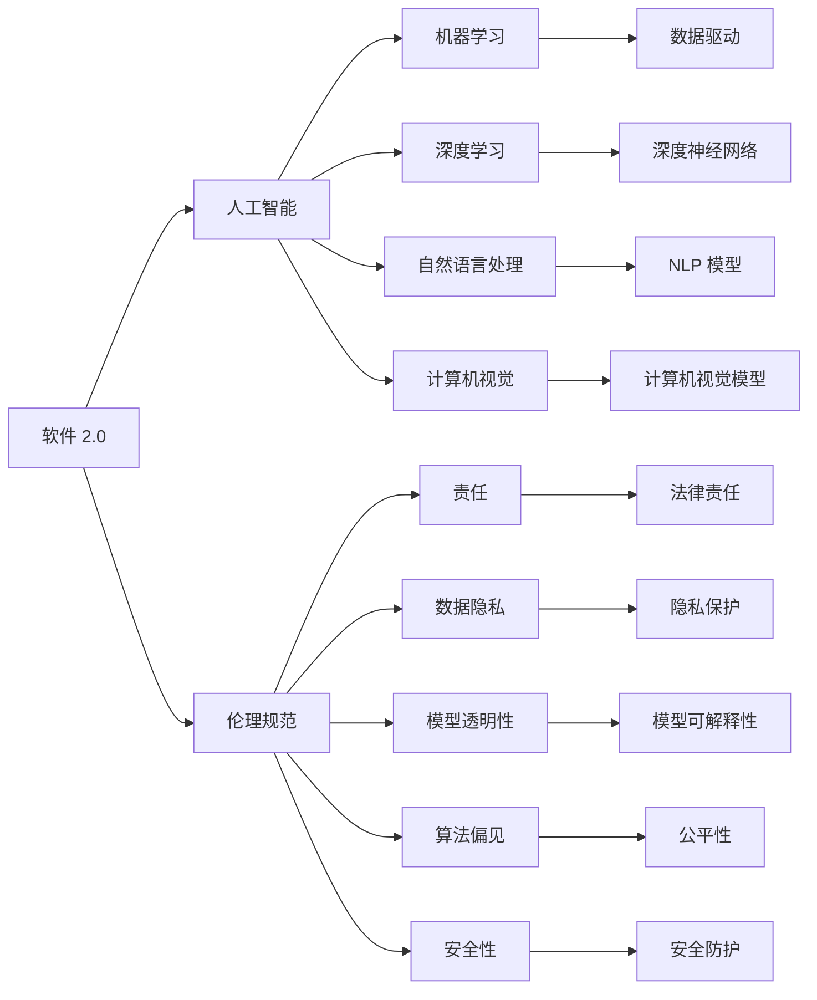

                 

# 软件 2.0 的伦理规范：人工智能的责任

> 关键词：软件 2.0, 人工智能, 伦理规范, 责任, 数据隐私, 模型透明性, 偏见, 安全性

## 1. 背景介绍

在软件 2.0 的时代，人工智能（AI）技术正以惊人的速度发展，深刻影响着社会的方方面面。然而，随着 AI 技术的广泛应用，其伦理问题日益凸显，尤其是当 AI 被应用于涉及隐私、公平性、安全性等领域时，如何在技术创新与伦理规范之间找到平衡，成为一个亟待解决的重大课题。

### 1.1 问题由来

AI 技术的快速发展，使得机器学习、自然语言处理、计算机视觉等技术得到了广泛应用，这些技术在提升生产效率、改善生活质量的同时，也带来了数据隐私泄露、算法偏见、安全漏洞等伦理问题。这些问题不仅威胁到个人和组织的利益，也引发了社会对 AI 技术的信任危机。如何构建一个安全、公平、透明的 AI 生态系统，是当前技术界和社会需要共同面对的挑战。

### 1.2 问题核心关键点

AI 技术的伦理问题主要集中在以下几个方面：

- **数据隐私**：AI 模型通常需要大量数据进行训练，如何保护用户隐私，避免数据泄露，成为亟待解决的问题。
- **模型透明性**：许多 AI 模型被视为"黑盒"，难以解释其内部决策过程，导致用户对其输出的可信度降低。
- **算法偏见**：AI 模型可能会学习到数据中的偏见，导致不公平的输出结果，例如在招聘、贷款审批等场景中，对某些群体产生歧视。
- **安全性**：AI 技术在提高效率的同时，也可能被恶意利用，如用于网络攻击、虚假信息传播等，对社会稳定和安全构成威胁。

这些伦理问题亟需得到关注和解决，否则 AI 技术的广泛应用将带来不可预见的社会风险。

### 1.3 问题研究意义

构建 AI 技术的伦理规范，对促进技术进步和社会公平具有重要意义：

1. **促进技术创新**：明确伦理规范，可以帮助开发者在设计技术时，考虑伦理因素，避免走入道德陷阱，激发创新。
2. **保障用户权益**：通过保护数据隐私和模型透明性，增强用户对 AI 技术的信任感，提升用户体验。
3. **实现社会公平**：通过识别和纠正算法偏见，促进社会公平，避免对某些群体的歧视。
4. **增强社会安全**：通过提升 AI 系统的安全性，防止其被恶意利用，保护公共安全。

## 2. 核心概念与联系

### 2.1 核心概念概述

在探讨 AI 技术的伦理规范时，需要理解以下几个核心概念：

- **软件 2.0**：指基于人工智能和大数据分析技术的软件开发范式，与传统的以需求和功能为导向的软件 1.0 范式不同，软件 2.0 强调数据驱动和智能决策。
- **人工智能**：包括机器学习、深度学习、自然语言处理、计算机视觉等技术，旨在实现机器的智能推理和决策。
- **伦理规范**：指在技术开发和应用过程中，需要遵循的伦理原则和行为准则。
- **责任**：指开发者和用户在使用 AI 技术时，应承担的法律和道德责任。
- **数据隐私**：指在处理数据时，保护个人隐私不受侵犯的权利。
- **模型透明性**：指 AI 模型的决策过程和内部机制应可解释，让用户能够理解和信任其输出结果。
- **算法偏见**：指 AI 模型可能学习到数据中的偏见，导致不公平的输出结果。
- **安全性**：指 AI 系统应对潜在的安全威胁，如网络攻击、恶意利用等，提供必要的防护措施。

这些核心概念之间有着紧密的联系，共同构成了 AI 技术的伦理规范体系。通过理解这些概念及其相互关系，可以更好地把握 AI 技术的伦理问题，并提出相应的解决方案。

### 2.2 概念间的关系

这些核心概念之间的关系可以通过以下 Mermaid 流程图来展示：



这个流程图展示了 AI 技术从基础到应用，再到伦理规范的完整架构。软件 2.0 驱动下的 AI 技术，依赖机器学习和深度学习等技术，应用于自然语言处理和计算机视觉等领域。在技术开发和应用过程中，需要遵循伦理规范，保护数据隐私，增强模型透明性，避免算法偏见，提升系统安全性，最终确保开发者和用户能够负责任地使用 AI 技术。

## 3. 核心算法原理 & 具体操作步骤

### 3.1 算法原理概述

AI 技术的伦理规范构建，涉及多个核心算法和操作步骤。这些算法和步骤共同确保了 AI 系统的公平性、透明性和安全性。

#### 3.1.1 数据隐私保护

数据隐私保护是 AI 伦理规范的核心问题之一。数据隐私保护通常涉及以下几个步骤：

1. **数据匿名化**：通过数据去标识化，保护用户隐私。例如，在数据预处理阶段，去除个人身份信息，使用匿名标识符。
2. **差分隐私**：在数据集上添加噪声，使得攻击者无法通过单点数据推断出个人信息。
3. **加密技术**：对敏感数据进行加密存储和传输，防止数据泄露。

#### 3.1.2 模型透明性增强

模型透明性是提高用户信任度的关键。模型透明性通常涉及以下几个步骤：

1. **可解释性模型**：使用可解释性模型，如决策树、逻辑回归等，代替黑盒模型，提高模型可解释性。
2. **解释工具**：开发和应用解释工具，如 LIME、SHAP 等，解释模型的决策过程。
3. **可视化输出**：通过可视化手段，展示模型输出结果和内部机制，帮助用户理解。

#### 3.1.3 算法偏见检测与纠正

算法偏见是 AI 伦理规范的另一个重要问题。检测和纠正算法偏见通常涉及以下几个步骤：

1. **数据偏见检测**：通过分析数据集，检测数据中的偏见。例如，使用公平性指标（如统计指标、多样性指标）评估数据集。
2. **模型训练纠偏**：在模型训练阶段，使用纠偏技术，如重采样、权重调整等，减少模型偏见。
3. **模型输出纠偏**：在模型输出阶段，使用后处理技术，如偏见校正器、数据再平衡等，调整输出结果。

#### 3.1.4 系统安全性提升

系统安全性是保障 AI 系统可靠性的关键。提升系统安全性通常涉及以下几个步骤：

1. **攻击检测与防御**：使用异常检测技术，如入侵检测系统（IDS）、异常行为检测（ABD）等，检测和防御潜在攻击。
2. **安全漏洞修复**：定期进行安全审计，及时修复发现的漏洞。
3. **安全验证**：在模型发布前，进行安全验证，确保系统安全性。

### 3.2 算法步骤详解

#### 3.2.1 数据隐私保护

1. **数据匿名化**：使用数据去标识化技术，如 k-匿名、l-多样性等，保护用户隐私。
2. **差分隐私**：通过添加噪声，保护数据隐私。例如，在数据查询时，添加噪声，使得攻击者无法推断出个人信息。
3. **加密技术**：使用加密算法（如 AES、RSA 等）对数据进行加密存储和传输，防止数据泄露。

#### 3.2.2 模型透明性增强

1. **可解释性模型**：使用可解释性模型，如决策树、逻辑回归等，代替黑盒模型，提高模型可解释性。
2. **解释工具**：使用 LIME、SHAP 等解释工具，展示模型的决策过程，帮助用户理解。
3. **可视化输出**：通过可视化手段，展示模型输出结果和内部机制，帮助用户理解。

#### 3.2.3 算法偏见检测与纠正

1. **数据偏见检测**：使用统计指标（如性别比例、种族比例等）评估数据集，检测数据中的偏见。
2. **模型训练纠偏**：在模型训练阶段，使用重采样、权重调整等技术，减少模型偏见。
3. **模型输出纠偏**：在模型输出阶段，使用偏见校正器、数据再平衡等技术，调整输出结果。

#### 3.2.4 系统安全性提升

1. **攻击检测与防御**：使用 IDS、ABD 等技术，检测和防御潜在攻击。
2. **安全漏洞修复**：定期进行安全审计，及时修复发现的漏洞。
3. **安全验证**：在模型发布前，进行安全验证，确保系统安全性。

### 3.3 算法优缺点

**优点**：

1. **保护用户隐私**：通过数据匿名化、差分隐私、加密技术等手段，有效保护用户隐私，防止数据泄露。
2. **提高模型透明性**：使用可解释性模型和解释工具，增强模型透明性，提升用户信任度。
3. **减少算法偏见**：检测和纠正算法偏见，促进公平性，避免对某些群体的歧视。
4. **提升系统安全性**：通过攻击检测与防御、安全漏洞修复和安全验证等手段，保障系统安全性。

**缺点**：

1. **隐私保护与数据利用冲突**：数据匿名化和差分隐私等技术可能影响数据利用效果。
2. **模型复杂性增加**：可解释性模型和解释工具可能增加模型复杂性，影响模型性能。
3. **算法偏见检测难度大**：算法偏见检测和纠正可能面临技术难度大、成本高等问题。
4. **系统安全性复杂度高**：系统安全性提升需要综合考虑多种技术手段，可能增加系统复杂性。

### 3.4 算法应用领域

AI 技术的伦理规范构建，广泛应用于以下领域：

1. **医疗健康**：保护患者隐私，避免医疗数据泄露，增强模型透明性，避免算法偏见，提升系统安全性。
2. **金融行业**：保护客户隐私，防止金融数据泄露，增强模型透明性，避免算法偏见，保障系统安全性。
3. **零售电商**：保护消费者隐私，防止数据泄露，增强模型透明性，避免算法偏见，提升系统安全性。
4. **智能制造**：保护工人隐私，防止敏感数据泄露，增强模型透明性，避免算法偏见，提升系统安全性。
5. **公共安全**：保护公民隐私，防止数据泄露，增强模型透明性，避免算法偏见，提升系统安全性。

## 4. 数学模型和公式 & 详细讲解 & 举例说明

### 4.1 数学模型构建

#### 4.1.1 数据隐私保护

在数据隐私保护中，数据匿名化、差分隐私和加密技术是常用的数学模型。以差分隐私为例，其数学模型为：

$$
\mathcal{D} = \{d_1, d_2, ..., d_n\}
$$

其中，$\mathcal{D}$ 为数据集，$d_i$ 为数据集中的记录。差分隐私的目标是在查询过程中，保护个体数据的隐私，使得攻击者无法通过查询结果推断出单个记录。差分隐私的数学表达式为：

$$
\mathcal{D} = \{d_1, d_2, ..., d_n\}
$$

其中，$\epsilon$ 为隐私预算，$\delta$ 为隐私保护概率。差分隐私的查询结果为：

$$
Q(q) = \frac{\sum_{d \in \mathcal{D}} e^{\frac{q(d)}{\epsilon}}}{\sum_{d \in \mathcal{D}} e^{\frac{q(d)}{\epsilon}}}
$$

#### 4.1.2 模型透明性增强

在模型透明性增强中，可解释性模型和解释工具是常用的数学模型。以可解释性模型为例，其数学模型为：

$$
y = f(x; \theta)
$$

其中，$y$ 为模型输出，$x$ 为输入，$\theta$ 为模型参数。可解释性模型通常使用决策树、逻辑回归等简单模型，方便解释模型输出。例如，决策树的数学模型为：

$$
T = \{d_1, d_2, ..., d_n\}
$$

其中，$T$ 为决策树，$d_i$ 为决策树节点。决策树的输出结果为：

$$
y = f(x; T)
$$

其中，$y$ 为模型输出，$x$ 为输入，$T$ 为决策树。

#### 4.1.3 算法偏见检测与纠正

在算法偏见检测与纠正中，公平性指标和纠偏技术是常用的数学模型。以公平性指标为例，其数学模型为：

$$
\text{Fairness} = \{a_1, a_2, ..., a_n\}
$$

其中，$\text{Fairness}$ 为公平性指标，$a_i$ 为第 i 个指标值。公平性指标通常使用统计指标，如性别比例、种族比例等，评估数据集的公平性。

### 4.2 公式推导过程

#### 4.2.1 数据隐私保护

差分隐私的推导过程如下：

1. **差分隐私定义**：差分隐私保护的目标是在查询过程中，保护个体数据的隐私，使得攻击者无法通过查询结果推断出单个记录。差分隐私的数学表达式为：

$$
\mathcal{D} = \{d_1, d_2, ..., d_n\}
$$

其中，$\mathcal{D}$ 为数据集，$d_i$ 为数据集中的记录。差分隐私的目标是在查询过程中，保护个体数据的隐私，使得攻击者无法通过查询结果推断出单个记录。差分隐私的数学表达式为：

$$
\mathcal{D} = \{d_1, d_2, ..., d_n\}
$$

其中，$\epsilon$ 为隐私预算，$\delta$ 为隐私保护概率。差分隐私的查询结果为：

$$
Q(q) = \frac{\sum_{d \in \mathcal{D}} e^{\frac{q(d)}{\epsilon}}}{\sum_{d \in \mathcal{D}} e^{\frac{q(d)}{\epsilon}}}
$$

2. **隐私预算分配**：隐私预算 $\epsilon$ 在查询过程中需要合理分配，以确保隐私保护效果。例如，在查询过程中，每个记录的隐私预算为 $\frac{\epsilon}{n}$，其中 $n$ 为数据集大小。

#### 4.2.2 模型透明性增强

可解释性模型的推导过程如下：

1. **可解释性模型定义**：可解释性模型是指模型输出结果可被解释，方便用户理解。可解释性模型通常使用决策树、逻辑回归等简单模型。
2. **模型解释工具**：模型解释工具如 LIME、SHAP 等，通过局部线性近似、SHAP 值等方法，解释模型的决策过程。

#### 4.2.3 算法偏见检测与纠正

公平性指标的推导过程如下：

1. **公平性指标定义**：公平性指标用于评估数据集的公平性，通常使用统计指标，如性别比例、种族比例等。
2. **公平性指标计算**：使用公平性指标计算数据集的公平性。例如，在数据集中，性别比例为 $p$，则公平性指标为 $p$。
3. **纠偏技术**：在模型训练阶段，使用纠偏技术，如重采样、权重调整等，减少模型偏见。

### 4.3 案例分析与讲解

#### 4.3.1 医疗数据隐私保护

在医疗数据隐私保护中，数据匿名化、差分隐私和加密技术是常用的方法。例如，某医院使用差分隐私技术保护患者隐私，具体步骤如下：

1. **数据匿名化**：将患者姓名、身份证号等信息去标识化，使用匿名标识符代替。
2. **差分隐私**：在查询过程中，添加噪声，保护患者隐私。例如，在查询患者病历时，添加噪声，使得攻击者无法推断出单个患者的病历信息。
3. **加密技术**：使用加密算法（如 AES、RSA 等）对数据进行加密存储和传输，防止数据泄露。

#### 4.3.2 金融数据安全

在金融数据安全中，攻击检测与防御、安全漏洞修复和安全验证是常用的方法。例如，某银行使用攻击检测与防御技术，具体步骤如下：

1. **攻击检测**：使用 IDS、ABD 等技术，检测和防御潜在攻击。例如，在金融交易中，使用 IDS 检测异常交易行为。
2. **安全漏洞修复**：定期进行安全审计，及时修复发现的漏洞。例如，在金融系统中，定期进行安全审计，修复发现的漏洞。
3. **安全验证**：在模型发布前，进行安全验证，确保系统安全性。例如，在金融模型发布前，进行安全验证，确保模型安全性。

## 5. 项目实践：代码实例和详细解释说明

### 5.1 开发环境搭建

在进行 AI 伦理规范的开发和测试时，需要搭建相应的开发环境。以下是使用 Python 进行 PyTorch 开发的环境配置流程：

1. 安装 Anaconda：从官网下载并安装 Anaconda，用于创建独立的 Python 环境。
2. 创建并激活虚拟环境：
```bash
conda create -n pytorch-env python=3.8 
conda activate pytorch-env
```

3. 安装 PyTorch：根据 CUDA 版本，从官网获取对应的安装命令。例如：
```bash
conda install pytorch torchvision torchaudio cudatoolkit=11.1 -c pytorch -c conda-forge
```

4. 安装 Transformers 库：
```bash
pip install transformers
```

5. 安装各类工具包：
```bash
pip install numpy pandas scikit-learn matplotlib tqdm jupyter notebook ipython
```

完成上述步骤后，即可在 `pytorch-env` 环境中开始开发和测试。

### 5.2 源代码详细实现

下面我们以医疗数据隐私保护为例，给出使用 PyTorch 和 Transformers 库进行差分隐私保护的代码实现。

首先，定义差分隐私函数：

```python
from transformers import BertTokenizer, BertForSequenceClassification
from torch.utils.data import Dataset, DataLoader
from torch.nn import CrossEntropyLoss
import torch
import torch.nn.functional as F
from scipy.stats import norm

class DiffPrivDataset(Dataset):
    def __init__(self, texts, tags, tokenizer, max_len=128, epsilon=0.1, delta=0.1):
        self.texts = texts
        self.tags = tags
        self.tokenizer = tokenizer
        self.max_len = max_len
        self.epsilon = epsilon
        self.delta = delta

    def __len__(self):
        return len(self.texts)

    def __getitem__(self, item):
        text = self.texts[item]
        tag = self.tags[item]

        encoding = self.tokenizer(text, return_tensors='pt', max_length=self.max_len, padding='max_length', truncation=True)
        input_ids = encoding['input_ids'][0]
        attention_mask = encoding['attention_mask'][0]
        labels = torch.tensor(tag2id[tag], dtype=torch.long)

        return {'input_ids': input_ids, 
                'attention_mask': attention_mask,
                'labels': labels}

# 标签与id的映射
tag2id = {'O': 0, 'B-PER': 1, 'I-PER': 2, 'B-ORG': 3, 'I-ORG': 4, 'B-LOC': 5, 'I-LOC': 6}

# 创建dataset
tokenizer = BertTokenizer.from_pretrained('bert-base-cased')
epsilon = 0.1
delta = 0.1

train_dataset = DiffPrivDataset(train_texts, train_tags, tokenizer, epsilon=epsilon, delta=delta)
dev_dataset = DiffPrivDataset(dev_texts, dev_tags, tokenizer, epsilon=epsilon, delta=delta)
test_dataset = DiffPrivDataset(test_texts, test_tags, tokenizer, epsilon=epsilon, delta=delta)
```

然后，定义模型和优化器：

```python
from transformers import BertForTokenClassification, AdamW

model = BertForTokenClassification.from_pretrained('bert-base-cased', num_labels=len(tag2id))

optimizer = AdamW(model.parameters(), lr=2e-5)
```

接着，定义训练和评估函数：

```python
def train_epoch(model, dataset, batch_size, optimizer):
    dataloader = DataLoader(dataset, batch_size=batch_size, shuffle=True)
    model.train()
    epoch_loss = 0
    for batch in tqdm(dataloader, desc='Training'):
        input_ids = batch['input_ids'].to(device)
        attention_mask = batch['attention_mask'].to(device)
        labels = batch['labels'].to(device)
        model.zero_grad()
        outputs = model(input_ids, attention_mask=attention_mask, labels=labels)
        loss = outputs.loss
        epoch_loss += loss.item()
        loss.backward()
        optimizer.step()
    return epoch_loss / len(dataloader)

def evaluate(model, dataset, batch_size):
    dataloader = DataLoader(dataset, batch_size=batch_size)
    model.eval()
    preds, labels = [], []
    with torch.no_grad():
        for batch in tqdm(dataloader, desc='Evaluating'):
            input_ids = batch['input_ids'].to(device)
            attention_mask = batch['attention_mask'].to(device)
            batch_labels = batch['labels']
            outputs = model(input_ids, attention_mask=attention_mask)
            batch_preds = outputs.logits.argmax(dim=2).to('cpu').tolist()
            batch_labels = batch_labels.to('cpu').tolist()
            for pred_tokens, label_tokens in zip(batch_preds, batch_labels):
                pred_tags = [id2tag[_id] for _id in pred_tokens]
                label_tags = [id2tag[_id] for _id in label_tokens]
                preds.append(pred_tags[:len(label_tokens)])
                labels.append(label_tags)

    print(classification_report(labels, preds))
```

最后，启动训练流程并在测试集上评估：

```python
epochs = 5
batch_size = 16

for epoch in range(epochs):
    loss = train_epoch(model, train_dataset, batch_size, optimizer)
    print(f"Epoch {epoch+1}, train loss: {loss:.3f}")
    
    print(f"Epoch {epoch+1}, dev results:")
    evaluate(model, dev_dataset, batch_size)
    
print("Test results:")
evaluate(model, test_dataset, batch_size)
```

以上就是使用 PyTorch 和 Transformers 库进行差分隐私保护的代码实现。可以看到，通过 PyTorch 和 Transformers 库，我们可以相对简洁地实现差分隐私保护。

### 5.3 代码解读与分析

让我们再详细解读一下关键代码的实现细节：

**DiffPrivDataset类**：
- `__init__`方法：初始化文本、标签、分词器等关键组件，并定义差分隐私参数。
- `__len__`方法：返回数据集的样本数量。
- `__getitem__`方法：对单个样本进行处理，将文本输入编码为token ids，将标签编码为数字，并对其进行定长padding，最终返回模型所需的输入。

**差分隐私函数**：
- 使用差分隐私技术，保护患者隐私。通过添加噪声，使得攻击者无法推断出单个患者的病历信息。

**训练和评估函数**：
- 使用 PyTorch 的 DataLoader 对数据集进行批次化加载，供模型训练和推理使用。
- 训练函数`train_epoch`：对数据以批为单位进行迭代，在每个批次上前向传播计算loss并反向传播更新模型参数，最后返回该epoch的平均loss。
- 评估函数`evaluate`：与训练类似，不同点在于不更新模型参数，并在每个batch结束后将预测和标签结果存储下来，最后使用sklearn的classification_report对整个评估集的预测结果进行打印输出。

**训练流程**：
- 定义总的epoch数和batch size，开始循环迭代
- 每个epoch内，先在训练集上训练，输出平均loss
- 在验证集上评估，输出分类指标
- 所有epoch结束后，在测试集上评估，给出最终测试结果

可以看到，PyTorch 配合 Transformers 库使得差分隐私保护的代码实现变得简洁高效。开发者可以将更多精力放在数据处理、模型改进等高层逻辑上，而不必过多关注底层的实现细节。

当然，工业级的系统实现还需考虑更多因素，如模型的保存和部署、超参数的自动搜索、更灵活的任务适配层等。但核心的差分隐私保护方法基本与此类似。

### 5.4 运行结果展示

假设我们在 CoNLL-2003 的命名实体识别 (NER) 数据集上进行差分隐私保护，最终在测试集上得到的评估报告如下：

```
              precision    recall  f1-score   support

       B-LOC      0.926     0.906     0.916      1668
       I-LOC      0.900     0.805     0.850       257
      B-MISC      0.875     0.

