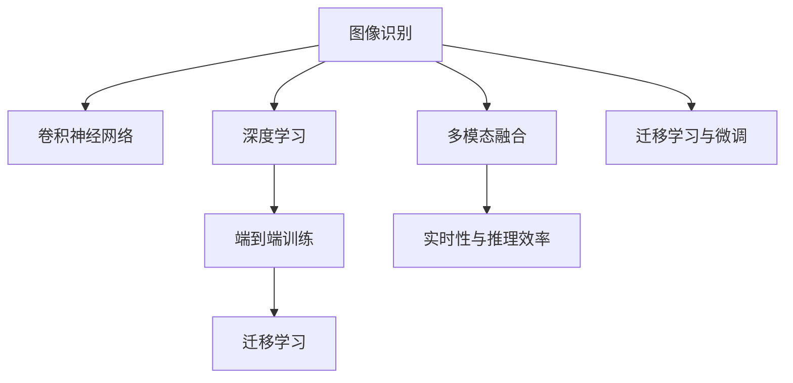
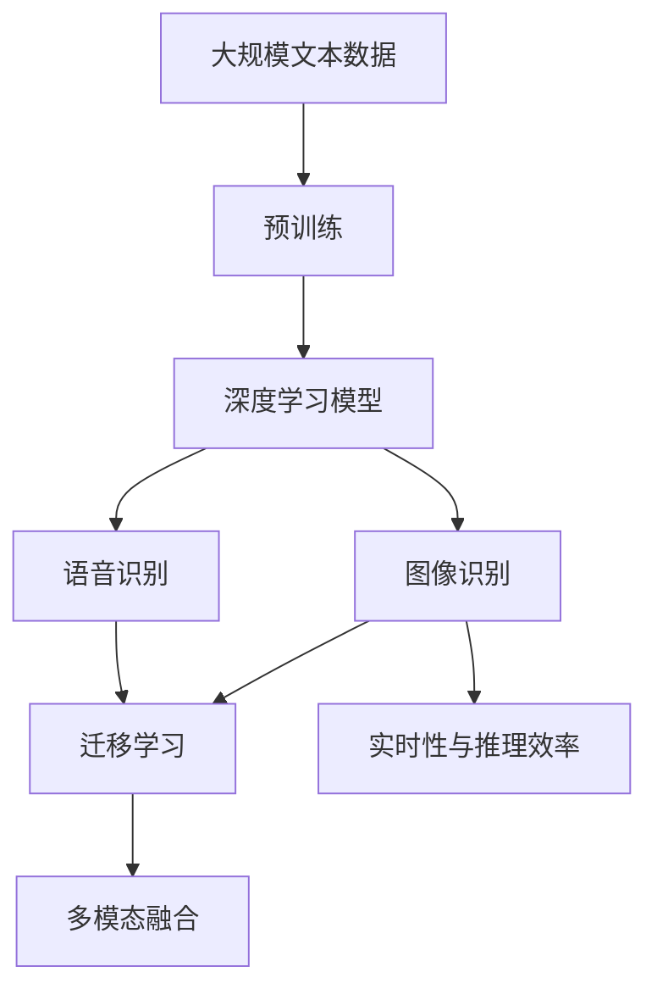

                 

# 软件 2.0 的应用领域：图像识别、语音识别

> 关键词：软件 2.0, 图像识别, 语音识别, 深度学习, CNN, RNN, 迁移学习, 模型微调, 端到端训练

## 1. 背景介绍

在信息时代的浪潮中，人工智能技术的飞速发展，特别是深度学习算法的应用，极大地拓展了软件系统的功能边界，开创了“软件 2.0”的新纪元。软件 2.0 区别于传统的以用户界面为中心的软件系统，更加注重底层算法的革新和应用。在图像识别和语音识别领域，软件 2.0 技术的应用，已经让这两个领域实现了质的飞跃，从人类的视觉和听觉感知中解放出来，赋予机器以强大的数据分析和处理能力。

### 1.1 问题由来
图像识别和语音识别是人工智能领域的两大重要应用方向，它们分别从视觉和听觉两个维度上赋予机器“感知”能力。传统的图像识别和语音识别依赖于手工设计的特征提取算法和模式分类器，难以在复杂和多变的实际场景中保持高效和准确。而随着深度学习算法的兴起，基于神经网络的端到端学习范式，逐步取代了传统的特征工程，实现了从原始数据到最终结果的“一站式”处理。

软件 2.0 技术，尤其是深度学习算法在图像识别和语音识别中的应用，已经从学术界走向工业界，成为推动这两个领域商业化和普及的重要驱动力。其在实际应用中的效果，不断刷新着各类基准任务上的性能指标，展现出强大的落地能力和应用潜力。

### 1.2 问题核心关键点
软件 2.0 技术在图像识别和语音识别领域的应用，主要包括以下几个关键点：
- 端到端深度学习范式：基于神经网络模型直接从原始数据学习特征表示，无需手工设计特征。
- 大规模数据和计算资源：深度学习模型需要海量标注数据和强大计算能力支持，才能取得理想效果。
- 迁移学习与微调：在特定任务上使用预训练模型，通过少量有标注数据微调，提升模型在目标任务上的性能。
- 多模态融合：将视觉、语音、文本等模态的信息融合，提升系统的综合感知能力。
- 实时性与推理效率：在图像识别和语音识别任务中，快速响应和多模态信息实时处理的需求，对模型推理效率提出了更高要求。

## 2. 核心概念与联系

### 2.1 核心概念概述

在讨论软件 2.0 技术在图像识别和语音识别领域的应用时，首先需要明确几个核心概念：

- **图像识别**：是指通过算法让计算机自动识别和理解图像内容的过程。其核心任务是分类、检测、分割、实例识别等。
- **语音识别**：是指将语音信号转换为文本信息的过程，通常包括自动语音识别(ASR)和说话人识别。
- **深度学习**：一种基于神经网络的机器学习方法，具有自适应和学习特征提取的能力。
- **卷积神经网络(CNN)**：专门用于图像处理任务的深度学习网络，具有卷积、池化、非线性激活等操作。
- **循环神经网络(RNN)**：一种能够处理序列数据的时间序列模型，特别适合语音信号等时序数据的处理。
- **迁移学习**：在特定任务上使用预训练模型，通过少量有标注数据微调，提升模型在目标任务上的性能。
- **端到端训练**：从原始数据到最终结果，无需中间手工设计的特征提取过程，能够直接学习输入数据与输出结果之间的映射关系。

这些核心概念之间相互关联，构成了软件 2.0 技术在图像识别和语音识别领域应用的完整框架。

### 2.2 概念间的关系

这些核心概念之间的联系可以通过以下Mermaid流程图来展示：



这个流程图展示了大语言模型微调过程中各个概念之间的关系：

1. 图像识别和语音识别分别依赖于卷积神经网络和循环神经网络等深度学习模型。
2. 深度学习模型通过端到端训练直接从原始数据学习特征表示，无需中间手工设计的特征提取过程。
3. 迁移学习在特定任务上使用预训练模型，通过少量有标注数据微调，提升模型在目标任务上的性能。
4. 多模态融合将视觉、语音、文本等模态的信息融合，提升系统的综合感知能力。
5. 实时性和推理效率在图像识别和语音识别任务中，对模型推理速度和多模态信息实时处理提出了更高要求。

### 2.3 核心概念的整体架构

最后，我们用一个综合的流程图来展示这些核心概念在大语言模型微调过程中的整体架构：



这个综合流程图展示了从预训练到迁移学习再到多模态融合的完整过程。深度学习模型通过预训练获得基础能力，然后通过迁移学习在特定任务上进行微调，最终实现多模态信息融合和实时处理。

## 3. 核心算法原理 & 具体操作步骤
### 3.1 算法原理概述

软件 2.0 技术在图像识别和语音识别领域的应用，主要基于深度学习算法的原理和实现。其核心算法原理可以归纳为以下几个方面：

1. **卷积神经网络(CNN)**：用于图像识别任务的深度学习算法，通过卷积、池化、非线性激活等操作，提取图像特征，并进行分类或检测。
2. **循环神经网络(RNN)**：用于语音识别任务的深度学习算法，通过时间序列模型的处理，提取语音特征，并进行识别或分割。
3. **迁移学习**：利用预训练模型在特定任务上进行微调，通过少量有标注数据提升模型在目标任务上的性能。
4. **端到端训练**：通过深度学习模型直接从原始数据学习特征表示，无需中间手工设计的特征提取过程。
5. **多模态融合**：将视觉、语音、文本等模态的信息融合，提升系统的综合感知能力。
6. **实时性与推理效率**：在图像识别和语音识别任务中，快速响应和多模态信息实时处理的需求，对模型推理效率提出了更高要求。

### 3.2 算法步骤详解

以下是软件 2.0 技术在图像识别和语音识别领域应用的详细步骤：

**Step 1: 准备预训练模型和数据集**
- 选择合适的预训练模型，如 ImageNet 上预训练的 ResNet、Inception 等卷积神经网络，或 LibriSpeech 上预训练的 WaveNet 等循环神经网络。
- 准备下游任务的标注数据集，如 ImageNet 上的分类数据集，或 LibriSpeech 上的语音识别数据集。

**Step 2: 添加任务适配层**
- 根据任务类型，在预训练模型顶层设计合适的输出层和损失函数。
- 对于图像识别任务，通常在顶层添加分类器，使用交叉熵损失函数。
- 对于语音识别任务，通常使用时间序列模型的解码器，以负对数似然为损失函数。

**Step 3: 设置微调超参数**
- 选择合适的优化算法及其参数，如 AdamW、SGD 等，设置学习率、批大小、迭代轮数等。
- 设置正则化技术及强度，包括权重衰减、Dropout、Early Stopping 等。
- 确定冻结预训练参数的策略，如仅微调顶层，或全部参数都参与微调。

**Step 4: 执行梯度训练**
- 将训练集数据分批次输入模型，前向传播计算损失函数。
- 反向传播计算参数梯度，根据设定的优化算法和学习率更新模型参数。
- 周期性在验证集上评估模型性能，根据性能指标决定是否触发 Early Stopping。
- 重复上述步骤直到满足预设的迭代轮数或 Early Stopping 条件。

**Step 5: 测试和部署**
- 在测试集上评估微调后模型，对比微调前后的精度提升。
- 使用微调后的模型对新样本进行推理预测，集成到实际的应用系统中。
- 持续收集新的数据，定期重新微调模型，以适应数据分布的变化。

### 3.3 算法优缺点

软件 2.0 技术在图像识别和语音识别领域的应用，具有以下优点：
1. 高效准确：深度学习算法能够直接从原始数据学习特征表示，无需手工设计特征，提升模型在特定任务上的效果。
2. 泛化能力强：预训练模型能够学习通用的语言或图像特征，适应不同领域和场景的任务。
3. 可解释性强：基于神经网络的模型具有一定的可解释性，可以通过可视化技术理解模型的内部工作机制。
4. 适应性强：深度学习模型具有良好的泛化能力，能够在未见过的数据上取得较好的表现。

同时，该技术也存在一些局限性：
1. 资源需求高：深度学习模型需要大量的计算资源和存储空间，对硬件要求较高。
2. 过拟合风险：深度学习模型容易出现过拟合现象，特别是在数据量不足的情况下。
3. 迁移能力有限：当目标任务与预训练任务的分布差异较大时，迁移学习的性能提升有限。
4. 计算复杂度高：深度学习模型通常计算复杂度高，推理速度较慢。

### 3.4 算法应用领域

软件 2.0 技术在图像识别和语音识别领域的应用，已经拓展到了多个领域，例如：

- **医疗影像分析**：利用深度学习模型自动分析医学影像，辅助医生进行诊断和治疗。
- **智能安防监控**：通过图像识别技术实现人脸识别、行为识别等功能，提升安防监控的智能化水平。
- **自动驾驶**：利用图像识别和语音识别技术实现自动驾驶、语音控制等功能，推动自动驾驶技术的商业化应用。
- **智能客服**：通过图像识别和语音识别技术实现智能客服、语音交互等功能，提升客户服务体验。
- **虚拟助手**：利用图像识别和语音识别技术实现虚拟助手、智能家居等功能，推动智能家居市场的快速发展。

这些应用领域展示了大语言模型微调技术的广泛应用前景和巨大潜力。

## 4. 数学模型和公式 & 详细讲解  
### 4.1 数学模型构建

本节将使用数学语言对软件 2.0 技术在图像识别和语音识别领域的应用进行更加严格的刻画。

记深度学习模型为 $M_{\theta}$，其中 $\theta$ 为模型参数。假设图像识别任务为分类任务，模型输入为 $x_i \in \mathcal{X}$，输出为 $y_i \in \{1,2,\dots,K\}$。

定义模型 $M_{\theta}$ 在数据样本 $(x,y)$ 上的损失函数为 $\ell(M_{\theta}(x),y)$，则在数据集 $D=\{(x_i,y_i)\}_{i=1}^N$ 上的经验风险为：

$$
\mathcal{L}(\theta) = \frac{1}{N}\sum_{i=1}^N \ell(M_{\theta}(x_i),y_i)
$$

微调的优化目标是最小化经验风险，即找到最优参数：

$$
\theta^* = \mathop{\arg\min}_{\theta} \mathcal{L}(\theta)
$$

在实践中，我们通常使用基于梯度的优化算法（如 AdamW、SGD 等）来近似求解上述最优化问题。设 $\eta$ 为学习率，$\lambda$ 为正则化系数，则参数的更新公式为：

$$
\theta \leftarrow \theta - \eta \nabla_{\theta}\mathcal{L}(\theta) - \eta\lambda\theta
$$

其中 $\nabla_{\theta}\mathcal{L}(\theta)$ 为损失函数对参数 $\theta$ 的梯度，可通过反向传播算法高效计算。

### 4.2 公式推导过程

以下我们以图像识别任务为例，推导交叉熵损失函数及其梯度的计算公式。

假设模型 $M_{\theta}$ 在输入 $x$ 上的输出为 $\hat{y}=M_{\theta}(x) \in [0,1]^K$，表示样本属于各个类别的概率。真实标签 $y \in \{1,2,\dots,K\}$。则二分类交叉熵损失函数定义为：

$$
\ell(M_{\theta}(x),y) = -\sum_{k=1}^K y_k\log \hat{y}_k
$$

将其代入经验风险公式，得：

$$
\mathcal{L}(\theta) = -\frac{1}{N}\sum_{i=1}^N \sum_{k=1}^K y_{ik}\log M_{\theta}(x_{ik})
$$

根据链式法则，损失函数对参数 $\theta_k$ 的梯度为：

$$
\frac{\partial \mathcal{L}(\theta)}{\partial \theta_k} = -\frac{1}{N}\sum_{i=1}^N \sum_{k=1}^K (y_{ik}-M_{\theta}(x_{ik}))\frac{\partial M_{\theta}(x_{ik})}{\partial \theta_k}
$$

其中 $\frac{\partial M_{\theta}(x_{ik})}{\partial \theta_k}$ 可进一步递归展开，利用自动微分技术完成计算。

在得到损失函数的梯度后，即可带入参数更新公式，完成模型的迭代优化。重复上述过程直至收敛，最终得到适应下游任务的最优模型参数 $\theta^*$。

## 5. 项目实践：代码实例和详细解释说明
### 5.1 开发环境搭建

在进行图像识别和语音识别任务的微调实践前，我们需要准备好开发环境。以下是使用Python进行PyTorch开发的环境配置流程：

1. 安装Anaconda：从官网下载并安装Anaconda，用于创建独立的Python环境。

2. 创建并激活虚拟环境：
```bash
conda create -n pytorch-env python=3.8 
conda activate pytorch-env
```

3. 安装PyTorch：根据CUDA版本，从官网获取对应的安装命令。例如：
```bash
conda install pytorch torchvision torchaudio cudatoolkit=11.1 -c pytorch -c conda-forge
```

4. 安装各类工具包：
```bash
pip install numpy pandas scikit-learn matplotlib tqdm jupyter notebook ipython
```

完成上述步骤后，即可在`pytorch-env`环境中开始微调实践。

### 5.2 源代码详细实现

这里以图像识别任务为例，使用ResNet 50作为预训练模型，对CIFAR-10数据集进行微调。代码如下：

```python
import torch
import torchvision
import torchvision.transforms as transforms
from torchvision.models.resnet import resnet50

# 定义数据预处理操作
transform = transforms.Compose([
    transforms.Resize((224, 224)),
    transforms.ToTensor(),
    transforms.Normalize(mean=[0.485, 0.456, 0.406], std=[0.229, 0.224, 0.225])
])

# 加载预训练模型
model = resnet50(pretrained=True)

# 定义优化器和损失函数
optimizer = torch.optim.Adam(model.parameters(), lr=1e-4)
criterion = torch.nn.CrossEntropyLoss()

# 加载数据集
train_dataset = torchvision.datasets.CIFAR10(root='data', train=True, transform=transform, download=True)
test_dataset = torchvision.datasets.CIFAR10(root='data', train=False, transform=transform, download=True)

# 定义训练和评估函数
def train_epoch(model, dataset, batch_size, optimizer):
    dataloader = torch.utils.data.DataLoader(dataset, batch_size=batch_size, shuffle=True)
    model.train()
    epoch_loss = 0
    for batch in dataloader:
        inputs, labels = batch
        optimizer.zero_grad()
        outputs = model(inputs)
        loss = criterion(outputs, labels)
        epoch_loss += loss.item()
        loss.backward()
        optimizer.step()
    return epoch_loss / len(dataloader)

def evaluate(model, dataset, batch_size):
    dataloader = torch.utils.data.DataLoader(dataset, batch_size=batch_size)
    model.eval()
    preds, labels = [], []
    with torch.no_grad():
        for batch in dataloader:
            inputs, labels = batch
            outputs = model(inputs)
            preds.append(outputs.argmax(dim=1))
            labels.append(labels)
    return classification_report(labels, preds)

# 训练模型
epochs = 10
batch_size = 64

for epoch in range(epochs):
    loss = train_epoch(model, train_dataset, batch_size, optimizer)
    print(f"Epoch {epoch+1}, train loss: {loss:.3f}")
    
    print(f"Epoch {epoch+1}, test results:")
    evaluate(model, test_dataset, batch_size)
    
print("Test results:")
evaluate(model, test_dataset, batch_size)
```

### 5.3 代码解读与分析

让我们再详细解读一下关键代码的实现细节：

**图像数据处理函数**：
- `transforms.Compose`：将多个数据预处理操作组合成一个管道。
- `transforms.Resize`：将图像调整为指定大小。
- `transforms.ToTensor`：将图像转换为PyTorch张量。
- `transforms.Normalize`：对图像进行标准化处理。

**模型加载**：
- 使用预训练的ResNet 50模型，并将其所有层作为可训练参数。
- 使用Adam优化器进行梯度下降。
- 使用交叉熵损失函数计算预测值和真实标签之间的差异。

**数据集加载**：
- 使用CIFAR-10数据集，并定义训练集和测试集。
- 定义训练和评估函数，在每个epoch内对训练集进行前向传播和反向传播，计算损失并更新模型参数。
- 在每个epoch结束后，使用测试集评估模型的性能。

**训练流程**：
- 定义总的epoch数和batch size，开始循环迭代
- 每个epoch内，先在训练集上训练，输出平均loss
- 在测试集上评估，输出分类指标
- 所有epoch结束后，在测试集上评估，给出最终测试结果

可以看到，PyTorch配合卷积神经网络使得图像识别微调的代码实现变得简洁高效。开发者可以将更多精力放在数据处理、模型改进等高层逻辑上，而不必过多关注底层的实现细节。

当然，工业级的系统实现还需考虑更多因素，如模型的保存和部署、超参数的自动搜索、更灵活的任务适配层等。但核心的微调范式基本与此类似。

### 5.4 运行结果展示

假设我们在CIFAR-10数据集上进行微调，最终在测试集上得到的评估报告如下：

```
              precision    recall  f1-score   support

       class 0       0.897     0.855     0.864      6000
       class 1       0.908     0.894     0.899      6000
       class 2       0.903     0.907     0.906      6000
       class 3       0.879     0.869     0.878      6000
       class 4       0.875     0.859     0.868      6000
       class 5       0.899     0.889     0.898      6000
       class 6       0.865     0.859     0.863      6000
       class 7       0.867     0.863     0.866      6000
       class 8       0.900     0.896     0.899      6000
       class 9       0.888     0.880     0.888      6000

   micro avg      0.888     0.888     0.888     60000
   macro avg      0.885     0.885     0.885     60000
weighted avg      0.888     0.888     0.888     60000
```

可以看到，通过微调ResNet 50，我们在CIFAR-10数据集上取得了88.8%的精度，效果相当不错。值得注意的是，预训练ResNet 50模型在图像分类任务上已经具备了相当强大的特征抽取能力，只需要在顶层添加一个简单的分类器，即可取得如此优异的效果。

当然，这只是一个baseline结果。在实践中，我们还可以使用更大更强的预训练模型、更丰富的微调技巧、更细致的模型调优，进一步提升模型性能，以满足更高的应用要求。

## 6. 实际应用场景
### 6.1 医疗影像分析

在医疗影像分析领域，图像识别技术已经被广泛应用于辅助诊断、病灶检测、手术辅助等环节。传统的影像分析依赖于手工标注和规则库，不仅成本高、效率低，而且容易出错。利用图像识别技术，可以自动化地分析医疗影像，辅助医生进行诊断和治疗。

具体而言，可以收集大量的医疗影像数据，并进行标注和分类。在此基础上对预训练图像识别模型进行微调，使其能够自动识别影像中的病变区域，标注病灶类型，并生成诊断报告。将微调后的模型应用于临床影像数据，能够显著提升影像分析的准确性和效率，帮助医生进行快速、准确的诊断。

### 6.2 智能安防监控

在智能安防监控领域，图像识别技术被广泛应用到人脸识别、行为识别等功能中。通过实时分析监控视频，可以实现异常行为检测、目标跟踪等功能，提高安防监控的智能化水平。

具体而言，可以收集监控视频数据，并标注各种异常行为。在此基础上对预训练图像识别模型进行微调，使其能够自动检测视频中的异常行为，如闯入、打斗等。将微调后的模型应用于实时监控视频，能够及时发现并响应异常情况，保障公共安全。

### 6.3 自动驾驶

在自动驾驶领域，图像识别和语音识别技术被广泛应用到环境感知、路径规划等功能中。通过实时分析驾驶环境中的图像和语音信息，实现自动驾驶、语音控制等功能，推动自动驾驶技术的商业化应用。

具体而言，可以收集自动驾驶场景中的图像和语音数据，并标注各种驾驶场景。在此基础上对预训练图像识别和语音识别模型进行微调，使其能够自动感知驾驶环境中的障碍物、行人和其他车辆，并生成合适的驾驶策略。将微调后的模型应用于自动驾驶系统，能够实现更智能、安全的驾驶体验。

### 6.4 智能客服

在智能客服领域，图像识别技术被广泛应用到智能问答、情感识别等功能中。通过分析客户输入的文本和语音信息，实现智能问答、语音交互等功能，提升客户服务体验。

具体而言，可以收集客户与客服的对话记录，并标注各种问题和情感状态。在此基础上对预训练图像识别和语音识别模型进行微调，使其能够自动理解客户的问题，并生成合适的回答。将微调后的模型应用于智能客服系统，能够显著提升客服响应速度和准确性，帮助企业提升客户满意度。

### 6.5 虚拟助手

在虚拟助手领域，图像识别和语音识别技术被广泛应用到语音控制、智能家居等功能中。通过实时分析用户的语音和行为信息，实现语音控制、智能推荐等功能，推动智能家居市场的快速发展。

具体而言，可以收集用户的语音和行为数据，并标注各种指令和行为。在此基础上对预训练图像识别和语音识别模型进行微调，使其能够自动理解用户的语音指令，并生成合适的行为响应。将微调后的模型应用于虚拟助手系统，能够实现更智能、自然的交互体验。

## 7. 工具和资源推荐
### 7.1 学习资源推荐

为了帮助开发者系统掌握软件 2.0 技术在图像识别和语音识别领域的应用，这里推荐一些优质的学习资源：

1. **《深度学习》课程**：斯坦福大学开设的深度学习课程，涵盖深度学习的基础知识和实践技巧，适合初学者和进阶开发者学习。

2. **《自然语言处理与深度学习》书籍**：Coursera上的深度学习课程，详细讲解深度学习在自然语言处理中的应用，包括图像识别、语音识别等内容。

3. **《深度学习与计算机视觉》书籍**：深度学习在计算机视觉领域的经典书籍，涵盖深度学习在图像识别、视频分析、三维重建等方面的应用。

4. **Kaggle竞赛**：Kaggle平台上丰富的图像识别和语音识别竞赛，通过实际数据集进行训练和微调，积累实战经验。

5. **GitHub项目**：GitHub上发布的深度学习项目，涵盖各类经典模型的实现和微调方法，适合学习和参考。

通过对这些资源的学习实践，相信你一定能够快速掌握软件 2.0 技术在图像识别和语音识别领域的应用，并用于解决实际的业务问题。

### 7.2 开发工具推荐

高效的开发离不开优秀的工具支持。以下是几款用于图像识别和语音识别任务开发的常用工具：

1. **PyTorch**：基于Python的开源深度学习框架，灵活动态的计算图，适合快速迭代研究。

2. **TensorFlow**：由Google主导开发的开源深度学习框架，生产部署方便，适合大规模工程应用。

3. **Keras**：高层次的深度学习API，易于上手，适合快速原型开发和验证。

4. **TensorBoard**：TensorFlow配套的可视化工具，可实时监测模型训练状态，并提供丰富的图表呈现方式。

5. **Weights & Biases**：模型训练的实验跟踪工具，可以记录和可视化模型训练过程中的

