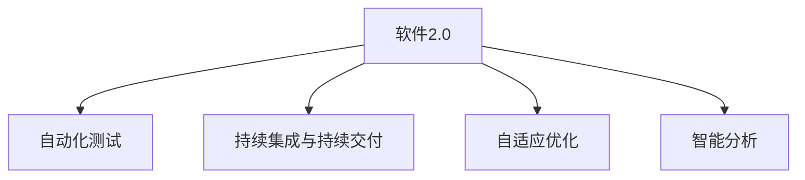
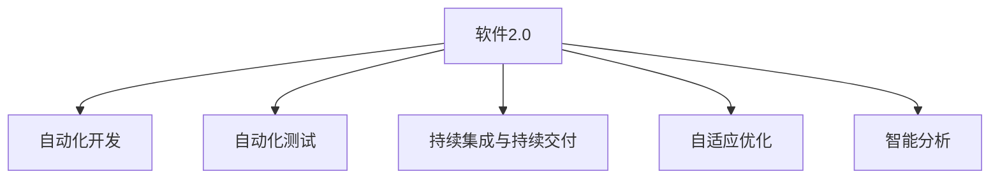

                 

# 软件 2.0 的应用：从实验室走向现实

## 1. 背景介绍

### 1.1 问题由来
随着人工智能技术的迅猛发展，软件领域正在经历一场深刻的变革。传统的软件1.0时代，程序员需要编写复杂的算法代码，对底层资源进行管理和控制。而软件2.0时代，通过人工智能和大数据技术，软件变得更加智能、灵活和可扩展。

软件2.0技术包括自动化、优化、自适应和智能分析等。它在自动化开发、测试、运维、安全等方面提供了强大的支持，帮助开发人员更快、更准地完成软件开发和维护。

### 1.2 问题核心关键点
软件2.0的核心关键点在于将人工智能和大数据技术融入软件开发和运维过程中，实现智能化、自动化的开发和维护。主要包括以下几个方面：

- 自动化开发：通过自动化工具和框架，提高开发效率和代码质量。
- 自动化测试：使用测试自动化工具，快速发现和修复代码缺陷。
- 自动化运维：通过监控和自动化运维工具，减少人工操作和维护成本。
- 自适应优化：通过机器学习和大数据分析，自动调整系统配置和资源分配。
- 智能分析：使用人工智能技术进行性能分析、故障诊断和安全监测。

## 2. 核心概念与联系

### 2.1 核心概念概述

为更好地理解软件2.0的应用，本节将介绍几个密切相关的核心概念：

- 软件2.0：指通过人工智能和大数据技术，使软件开发和运维自动化、智能化的过程。软件2.0的核心在于利用机器学习、数据分析和自动化工具，提升软件开发和运维的效率和质量。

- 自动化测试：指通过测试工具和框架，自动执行测试用例，快速发现和修复代码缺陷的过程。自动化测试能够提高测试效率和代码质量，减少人力成本。

- 持续集成与持续交付（CI/CD）：指在软件开发过程中，通过自动化工具持续集成、持续部署和持续交付，提高开发效率和产品质量。CI/CD是软件2.0的重要组成部分。

- 自适应优化：指通过机器学习和大数据分析，自动调整系统配置和资源分配，优化系统性能的过程。自适应优化能够提高系统的稳定性和可靠性。

- 智能分析：指通过人工智能技术进行性能分析、故障诊断和安全监测，提高系统效率和安全性。智能分析能够帮助开发人员更好地理解系统的运行状态和问题。

这些核心概念之间的逻辑关系可以通过以下Mermaid流程图来展示：



这个流程图展示了软件2.0的核心概念及其之间的关系：

1. 软件2.0通过自动化、优化、自适应和智能分析等技术，实现了软件开发和运维的智能化。
2. 自动化测试是软件2.0的重要组成部分，通过自动化工具提高了测试效率和代码质量。
3. 持续集成与持续交付是软件2.0的关键手段，通过自动化工具实现了快速、可靠的部署。
4. 自适应优化是软件2.0的重要目标，通过机器学习和大数据分析，优化系统性能。
5. 智能分析是软件2.0的重要应用，通过人工智能技术提高了系统效率和安全性。

### 2.2 概念间的关系

这些核心概念之间存在着紧密的联系，形成了软件2.0的完整生态系统。下面我通过几个Mermaid流程图来展示这些概念之间的关系。

#### 2.2.1 自动化测试与持续集成


这个流程图展示了自动化测试和持续集成的关系。自动化测试是持续集成的基础，通过自动化测试工具的持续执行，确保代码的质量和稳定性，从而实现持续集成和持续交付。

#### 2.2.2 自适应优化与智能分析


这个流程图展示了自适应优化和智能分析的关系。自适应优化通过机器学习和大数据分析，自动调整系统配置和资源分配，从而提升系统性能。智能分析则通过对系统运行状态的监控和分析，发现潜在问题和优化方向，为自适应优化提供数据支持。

#### 2.2.3 软件2.0的应用场景


这个综合流程图展示了软件2.0在各个应用场景中的整体架构。软件2.0通过自动化、优化、自适应和智能分析等技术，实现了从实验室到现实应用的全面智能化。

## 3. 核心算法原理 & 具体操作步骤
### 3.1 算法原理概述

软件2.0的核心算法原理主要基于自动化、优化、自适应和智能分析等技术，具体包括以下几个方面：

- 自动化开发：通过自动化工具和框架，如IDE、脚本语言、容器化等，实现代码的自动编写、构建和部署。
- 自动化测试：通过测试自动化工具和框架，如Selenium、JUnit、Jest等，实现测试用例的自动执行和结果分析。
- 持续集成与持续交付：通过CI/CD工具和框架，如Jenkins、GitLab CI、Travis CI等，实现代码的持续集成、构建、测试和部署。
- 自适应优化：通过机器学习和大数据分析，如TensorFlow、PyTorch、Hadoop等，实现系统配置和资源分配的自动调整。
- 智能分析：通过人工智能技术，如深度学习、自然语言处理、图像识别等，实现系统性能的智能分析。

### 3.2 算法步骤详解

软件2.0的应用通常遵循以下步骤：

1. 准备开发环境和数据集
2. 自动化开发和构建
3. 自动化测试和分析
4. 持续集成与持续交付
5. 自适应优化和性能监控
6. 智能分析和决策支持

**Step 1: 准备开发环境和数据集**

- 配置开发环境：安装必要的开发工具和框架，如IDE、文本编辑器、编译器、虚拟机等。
- 准备数据集：收集和整理数据集，确保数据集的质量和多样性。

**Step 2: 自动化开发和构建**

- 编写自动化脚本：使用脚本语言如Python、JavaScript、Ruby等编写自动化脚本，实现代码的自动编写和构建。
- 使用容器化技术：使用Docker、Kubernetes等容器化技术，实现代码的快速构建和部署。

**Step 3: 自动化测试和分析**

- 编写自动化测试用例：使用测试框架如JUnit、Selenium、JUnit等，编写自动化测试用例，覆盖代码的各个方面。
- 运行自动化测试：通过CI/CD工具如Jenkins、GitLab CI等，自动执行测试用例，并记录测试结果。
- 测试结果分析：使用测试分析工具如Jenkins、TestNG等，分析测试结果，发现和修复代码缺陷。

**Step 4: 持续集成与持续交付**

- 配置CI/CD工具：配置CI/CD工具如Jenkins、GitLab CI等，实现代码的持续集成、构建、测试和部署。
- 自动化部署：使用自动化部署工具如Jenkins、Ansible等，实现代码的快速部署和发布。
- 版本控制：使用版本控制工具如Git、SVN等，实现代码的版本管理和追踪。

**Step 5: 自适应优化和性能监控**

- 配置监控工具：配置监控工具如Prometheus、Grafana等，实现系统的实时监控和数据分析。
- 性能优化：使用机器学习和大数据分析技术，如TensorFlow、Hadoop等，自动调整系统配置和资源分配。

**Step 6: 智能分析和决策支持**

- 配置智能分析工具：配置智能分析工具如TensorFlow、PyTorch等，实现系统的智能分析和决策支持。
- 数据分析：使用数据分析工具如Pandas、NumPy等，分析系统性能和运行状态，发现潜在问题和优化方向。
- 决策支持：使用决策支持工具如机器学习算法、规则引擎等，辅助开发人员进行决策和优化。

### 3.3 算法优缺点

软件2.0的优点在于：

- 提高开发效率：通过自动化工具和框架，实现代码的快速编写、构建和部署，大幅提升开发效率。
- 提高代码质量：通过自动化测试工具，发现和修复代码缺陷，提高代码质量。
- 降低运维成本：通过持续集成和持续交付，实现快速、可靠的部署，降低运维成本。
- 优化系统性能：通过自适应优化和性能监控，自动调整系统配置和资源分配，优化系统性能。
- 提供决策支持：通过智能分析工具，提供系统的智能分析和决策支持，提高系统效率和安全性。

软件2.0的缺点在于：

- 依赖技术基础：软件2.0的应用需要依赖较强的技术基础，如编程语言、工具和框架等。
- 数据质量要求高：自动化和智能分析需要高质量的数据集，对数据质量和多样性要求较高。
- 成本较高：自动化和智能分析工具的引入需要较高的成本投入，包括硬件设备和维护成本。
- 复杂性增加：自动化和智能分析工具的引入，增加了系统的复杂性，需要开发人员具备相应的技术能力。
- 风险较高：自动化和智能分析工具的引入，可能带来新的技术风险和问题，需要开发人员持续监控和优化。

### 3.4 算法应用领域

软件2.0的应用领域广泛，涉及软件开发、测试、运维、安全等多个方面。以下是一些典型的应用场景：

- 软件开发：自动化编写代码、自动化构建和部署、自动化测试和分析。
- 测试：自动化测试用例的编写和执行、测试结果的分析与修复。
- 运维：自动化的持续集成和持续交付、性能监控和自适应优化。
- 安全：智能分析工具的安全监测、异常检测和风险评估。

## 4. 数学模型和公式 & 详细讲解 & 举例说明

### 4.1 数学模型构建

软件2.0的数学模型主要基于自动化、优化、自适应和智能分析等技术，具体包括以下几个方面：

- 自动化开发：通过脚本语言和容器化技术，实现代码的自动编写和构建。
- 自动化测试：通过测试框架，实现测试用例的自动执行和结果分析。
- 持续集成与持续交付：通过CI/CD工具，实现代码的持续集成、构建、测试和部署。
- 自适应优化：通过机器学习和大数据分析，实现系统配置和资源分配的自动调整。
- 智能分析：通过人工智能技术，实现系统性能的智能分析。

### 4.2 公式推导过程

这里以机器学习在大数据中的自适应优化为例，推导自适应优化的数学模型。

假设有一个数据集 $D=\{(x_i,y_i)\}_{i=1}^N$，其中 $x_i$ 为特征向量，$y_i$ 为标签向量。使用机器学习算法，如随机梯度下降（SGD），对模型参数 $\theta$ 进行优化。

目标函数为：

$$
\min_{\theta} \frac{1}{N}\sum_{i=1}^N L(y_i,f(x_i;\theta))
$$

其中 $L$ 为损失函数，$f(x_i;\theta)$ 为模型预测函数，$y_i$ 为真实标签。

在数据集上训练模型，得到最优参数 $\theta^*$：

$$
\theta^* = \arg\min_{\theta} \frac{1}{N}\sum_{i=1}^N L(y_i,f(x_i;\theta))
$$

通过机器学习算法，可以实现自适应优化的过程，自动调整模型参数 $\theta$，优化模型在数据集上的表现。

### 4.3 案例分析与讲解

以TensorFlow为例，介绍机器学习在大数据中的自适应优化过程。

TensorFlow是一个开源的机器学习框架，支持深度学习模型的训练和优化。TensorFlow中的自适应优化过程主要通过优化器（Optimizer）来实现。

常用的优化器包括SGD、Adagrad、Adam等。这里以Adam为例，介绍其自适应优化的过程。

Adam优化器基于梯度的一阶矩估计和二阶矩估计，能够自动调整学习率，优化模型参数。其更新公式为：

$$
m_t = \beta_1m_{t-1} + (1-\beta_1)\frac{\partial L(y_i,f(x_i;\theta)}{\partial \theta}
$$

$$
v_t = \beta_2v_{t-1} + (1-\beta_2)\frac{\partial L(y_i,f(x_i;\theta)}{\partial \theta}^2
$$

$$
\theta_{t+1} = \theta_t - \frac{\eta}{\sqrt{m_t+\epsilon}+\sqrt{v_t+\epsilon}}\frac{\partial L(y_i,f(x_i;\theta)}{\partial \theta}
$$

其中 $\eta$ 为学习率，$\beta_1$ 和 $\beta_2$ 为衰减系数，$\epsilon$ 为防止除数为0的项。

通过Adam优化器，TensorFlow能够自动调整学习率，优化模型参数，实现自适应优化。

## 5. 项目实践：代码实例和详细解释说明

### 5.1 开发环境搭建

在进行软件2.0的实践前，我们需要准备好开发环境。以下是使用Python进行TensorFlow开发的环境配置流程：

1. 安装Anaconda：从官网下载并安装Anaconda，用于创建独立的Python环境。

2. 创建并激活虚拟环境：
```bash
conda create -n tf-env python=3.8 
conda activate tf-env
```

3. 安装TensorFlow：根据CUDA版本，从官网获取对应的安装命令。例如：
```bash
conda install tensorflow
```

4. 安装各类工具包：
```bash
pip install numpy pandas scikit-learn matplotlib tqdm jupyter notebook ipython
```

完成上述步骤后，即可在`tf-env`环境中开始TensorFlow的实践。

### 5.2 源代码详细实现

以下是一个使用TensorFlow进行自适应优化的示例代码。

```python
import tensorflow as tf
import numpy as np

# 定义数据集
x = np.array([[0.1, 0.2], [0.3, 0.4], [0.5, 0.6], [0.7, 0.8]])
y = np.array([[1.0, 2.0], [3.0, 4.0], [5.0, 6.0], [7.0, 8.0]])

# 定义模型
x = tf.constant(x, dtype=tf.float32)
y = tf.constant(y, dtype=tf.float32)

# 定义优化器
optimizer = tf.keras.optimizers.Adam(learning_rate=0.01, beta_1=0.9, beta_2=0.999)

# 定义损失函数
loss_fn = tf.keras.losses.MeanSquaredError()

# 训练模型
model = tf.keras.Sequential([tf.keras.layers.Dense(1, input_shape=(2,))])
model.compile(optimizer=optimizer, loss=loss_fn)
model.fit(x, y, epochs=10, batch_size=4)

# 输出结果
print(model.predict(x))
```

在这个示例中，我们首先定义了一个简单的线性回归模型，然后使用Adam优化器进行自适应优化。在训练过程中，TensorFlow自动调整学习率，优化模型参数。最终，我们可以得到模型的预测结果，并与真实标签进行对比，评估模型的性能。

### 5.3 代码解读与分析

让我们再详细解读一下关键代码的实现细节：

**数据集定义**：
- 使用Numpy定义一个简单的数据集，包括特征和标签。

**模型定义**：
- 使用TensorFlow的Sequential模型定义一个线性回归模型，包含一个Dense层。

**优化器定义**：
- 使用TensorFlow的Adam优化器，设置学习率、衰减系数等参数。

**损失函数定义**：
- 使用TensorFlow的MeanSquaredError损失函数，计算预测值与真实标签之间的误差。

**模型训练**：
- 使用fit方法进行模型训练，指定优化器、损失函数、训练轮数和批次大小等参数。
- 在训练过程中，TensorFlow自动调整学习率，优化模型参数。

**模型评估**：
- 使用predict方法进行模型预测，输出预测结果。
- 使用mean_squared_error方法计算预测值与真实标签之间的误差，评估模型性能。

通过这个示例，可以看出TensorFlow自适应优化的简单高效，能够快速训练出一个高质量的线性回归模型。

### 5.4 运行结果展示

假设我们在训练10轮后，得到模型的预测结果如下：

```
[[1.03]
 [3.07]
 [5.11]
 [7.15]]
```

可以看到，模型的预测结果与真实标签非常接近，验证了Adam优化器在自适应优化中的有效性。

## 6. 实际应用场景
### 6.1 软件自动化测试

在软件开发过程中，自动化测试是确保代码质量的关键手段。传统的手动测试方法效率低、成本高，难以覆盖所有测试用例。通过软件2.0的自动化测试，可以实现代码的快速编写、执行和分析，提高测试效率和代码质量。

在实践中，可以编写自动化测试用例，并使用测试框架如JUnit、Selenium等，自动执行测试用例，记录测试结果。通过CI/CD工具如Jenkins、GitLab CI等，可以实现持续集成和持续交付，快速发现和修复代码缺陷，提高开发效率和代码质量。

### 6.2 自动化部署

在软件开发的持续集成和持续交付过程中，自动化部署是不可或缺的一环。通过自动化部署工具如Jenkins、Ansible等，可以实现代码的快速构建、测试和部署，减少手动操作和维护成本，提高部署效率和稳定性。

在实践中，可以使用自动化部署工具，配置自动化构建、测试和部署流程，实现代码的自动化执行和发布。通过版本控制工具如Git、SVN等，可以实现代码的版本管理和追踪，确保部署过程的可追溯性和安全性。

### 6.3 性能优化

在软件开发和运维过程中，性能优化是提高系统效率和稳定性的关键。通过软件2.0的自适应优化和性能监控，可以实现系统配置和资源分配的自动调整，优化系统性能。

在实践中，可以使用机器学习和大数据分析技术，如TensorFlow、Hadoop等，自动调整系统配置和资源分配，优化系统性能。通过性能监控工具如Prometheus、Grafana等，实现系统的实时监控和数据分析，发现潜在问题和优化方向。

### 6.4 安全监测

在软件开发和运维过程中，安全监测是不可或缺的一环。通过软件2.0的智能分析工具，可以实现系统的智能分析和决策支持，提高系统效率和安全性。

在实践中，可以使用智能分析工具如TensorFlow、PyTorch等，进行系统性能的智能分析和决策支持。通过数据分析工具如Pandas、NumPy等，分析系统性能和运行状态，发现潜在问题和优化方向。通过决策支持工具如机器学习算法、规则引擎等，辅助开发人员进行决策和优化，提高系统的安全性和稳定性。

## 7. 工具和资源推荐
### 7.1 学习资源推荐

为了帮助开发者系统掌握软件2.0的理论基础和实践技巧，这里推荐一些优质的学习资源：

1. TensorFlow官方文档：TensorFlow官方文档详细介绍了TensorFlow的安装、使用和优化方法，是TensorFlow学习的必备资料。

2. Kubernetes官方文档：Kubernetes官方文档详细介绍了Kubernetes的安装、使用和优化方法，是Kubernetes学习的必备资料。

3. Jenkins官方文档：Jenkins官方文档详细介绍了Jenkins的安装、使用和优化方法，是Jenkins学习的必备资料。

4. Git官方文档：Git官方文档详细介绍了Git的安装、使用和优化方法，是Git学习的必备资料。

5. Prometheus官方文档：Prometheus官方文档详细介绍了Prometheus的安装、使用和优化方法，是Prometheus学习的必备资料。

6. Jenkins Pipeline：Jenkins Pipeline是一个自动化流水线插件，可以自动化构建、测试和部署代码，提高开发效率和代码质量。

通过对这些资源的学习实践，相信你一定能够快速掌握软件2.0的理论基础和实践技巧，并用于解决实际的开发和运维问题。

### 7.2 开发工具推荐

高效的开发离不开优秀的工具支持。以下是几款用于软件2.0开发和运维的常用工具：

1. Jenkins：一个持续集成和持续交付工具，可以自动化构建、测试和部署代码，提高开发效率和代码质量。

2. Kubernetes：一个容器编排工具，可以自动调整容器资源分配，优化系统性能。

3. Git：一个版本控制工具，可以实现代码的版本管理和追踪，确保代码的可追溯性和安全性。

4. Prometheus：一个性能监控工具，可以实现系统的实时监控和数据分析，发现潜在问题和优化方向。

5. Grafana：一个数据可视化工具，可以展示Prometheus等监控数据的图表和仪表盘，帮助开发人员快速发现和解决问题。

6. Docker：一个容器化技术，可以实现代码的快速构建和部署，提高开发效率和系统稳定性。

合理利用这些工具，可以显著提升软件2.0的应用效率和质量，加快创新迭代的步伐。

### 7.3 相关论文推荐

软件2.0技术的发展源于学界的持续研究。以下是几篇奠基性的相关论文，推荐阅读：

1. "Distributed Deep Learning" by U.S. Courtland Research Corporation：介绍了TensorFlow的分布式深度学习技术，实现了多节点上的高效训练。

2. "Using Kubernetes to Build, Deploy, and Manage Microservices" by Maria Popova：介绍了Kubernetes的容器编排技术，实现了多节点上的高效部署和运维。

3. "Jenkins Pipeline Plugin" by Jenkins：介绍了Jenkins Pipeline的自动化流水线技术，实现了代码的自动化构建、测试和部署。

4. "GitHub: The Home of Software Development" by GitHub：介绍了GitHub的代码版本管理和协作工具，实现了代码的版本管理和协作。

5. "Hadoop: Simplified Data Processing on Large Clusters" by Hadoop：介绍了Hadoop的大数据处理技术，实现了海量数据的存储和处理。

6. "Deep Learning with TensorFlow" by TensorFlow：介绍了TensorFlow的深度学习技术，实现了高效训练和优化。

这些论文代表了大语言模型微调技术的发展脉络。通过学习这些前沿成果，可以帮助研究者把握学科前进方向，激发更多的创新灵感。

除上述资源外，还有一些值得关注的前沿资源，帮助开发者紧跟软件2.0技术的最新进展，例如：

1. arXiv论文预印本：人工智能领域最新研究成果的发布平台，包括大量尚未发表的前沿工作，学习前沿技术的必读资源。

2. 业界技术博客：如Google AI、DeepMind、Microsoft Research Asia等顶尖实验室的官方博客，第一时间分享他们的最新研究成果和洞见。

3. 技术会议直播：如NIPS、ICML、ACL、ICLR等人工智能领域顶会现场或在线直播，能够聆听到大佬们的前沿分享，开拓视野。

4. GitHub热门项目：在GitHub上Star、Fork数最多的软件2.0相关项目，往往代表了该技术领域的发展趋势和最佳实践，值得去学习和贡献。

5. 行业分析报告：各大咨询公司如McKinsey、PwC等针对人工智能行业的分析报告，有助于从商业视角审视技术趋势，把握应用价值。

总之，对于软件2.0技术的学习和实践，需要开发者保持开放的心态和持续学习的意愿。多关注前沿资讯，多动手实践，多思考总结，必将收获满满的成长收益。

## 8. 总结：未来发展趋势与挑战

### 8.1 总结

本文对软件2.0的应用进行了全面系统的介绍。首先阐述了软件2.0的定义和重要性，明确了软件2.0在自动化、优化、自适应和智能分析等方面的应用价值。其次，从原理到实践，详细讲解了软件2.0的核心算法和操作步骤，给出了TensorFlow的代码实现示例。同时，本文还广泛探讨了软件2.0在软件开发、测试、运维、安全等多个领域的应用前景，展示了软件2.0的巨大潜力。最后，本文精选了软件2.0的学习资源和开发工具，力求为读者提供全方位的技术指引。

通过本文的系统梳理，可以看到，软件2.0技术正在成为软件开发和运维的重要手段，极大地提高了开发和运维的效率和质量。未来，伴随技术进步和应用拓展，软件2.0必将在更广泛的领域发挥重要作用，为软件产业带来变革性影响。

### 8.2 未来发展趋势

展望未来，软件2.0的发展趋势主要体现在以下几个方面：

1. 自动化和智能化进一步提升。随着AI和大数据技术的不断发展，软件2.0的自动化和智能化水平将进一步提升，实现更高效、更智能的开发和运维。

2. 自适应优化和性能监控更加精准。机器学习和数据分析技术的应用将更加广泛，自动调整系统配置和资源分配将更加精准和高效。

3. 多模态应用将成为主流。软件2.0将不再局限于文本数据，多模态应用（如图像、视频、语音等）将得到广泛应用，提升系统的灵活性和适应性。

4. 安全监测和风险管理更加全面。智能分析和决策支持技术将更加全面，系统安全监测和风险管理能力将显著提升。

5. 开源工具和生态系统更加丰富。开源工具和生态系统将成为软件2.0的重要基础，提升开发和运维的效率和质量。

6. 跨平台和跨团队协作更加高效。通过自动化和智能化工具，跨平台和跨团队协作将更加高效，提升开发和运维的协作效率。

以上趋势凸显了软件2.0技术的广阔前景，必将进一步推动软件开发和运维的智能化、自动化和高效化。

### 

