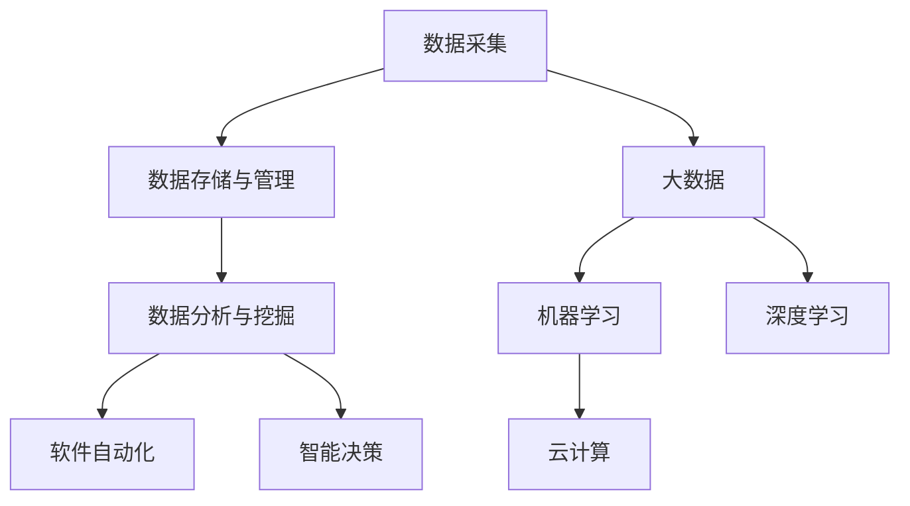

                 

# 软件 2.0 的时代：数据驱动一切

> 关键词：数据驱动, 软件2.0, 人工智能, 大数据, 机器学习, 云计算

## 1. 背景介绍

### 1.1 问题由来

随着科技的迅猛发展，数据已成为推动各行各业进步的关键驱动力。在过去的几十年里，数据正逐渐从被动的“副产品”转变为主动的“资产”。企业在运营、创新、竞争等方面，都越来越依赖于对数据的深度挖掘和高效利用。在这一背景下，软件2.0应运而生。

软件2.0的核心思想是“数据驱动一切”，即通过数据来指导软件的研发、部署和优化，从而实现软件性能的持续提升和应用的不断创新。与传统软件1.0相比，软件2.0更加注重数据的价值，强调数据的中心地位，利用机器学习和人工智能技术，进行数据的自动化处理和智能决策。

### 1.2 问题核心关键点

软件2.0的关键在于如何有效利用数据，实现软件的智能化和自动化。其核心包括以下几个方面：

- 数据采集：收集多源异构的数据，包括结构化数据、非结构化数据、实时数据等，为后续分析和应用提供基础。
- 数据存储与管理：采用分布式存储、数据湖等技术，对大规模数据进行高效管理和维护。
- 数据分析与挖掘：利用统计分析、机器学习、深度学习等方法，从数据中提取有价值的信息和知识。
- 软件自动化：通过自动化测试、持续集成、持续交付等技术，实现软件的快速迭代和部署。
- 智能决策：结合数据分析和人工智能技术，自动生成算法和策略，提升软件性能和用户体验。

### 1.3 问题研究意义

软件2.0技术的研究，对于推动软件的智能化、自动化和高效化，具有重要意义：

1. 提升软件质量：通过数据分析和自动化技术，可以及时发现和修复软件缺陷，提升软件的稳定性和可靠性。
2. 加速产品创新：数据驱动的软件研发，能够快速响应市场变化，加速产品迭代，保持竞争优势。
3. 降低开发成本：自动化流程减少了人力投入，提高了开发效率，降低了项目成本。
4. 提升用户体验：数据分析和智能决策，可以更好地理解用户需求和行为，优化软件设计和功能，提升用户体验。
5. 驱动业务转型：数据驱动的软件应用，能够挖掘潜在的商业价值，推动企业转型升级。

## 2. 核心概念与联系

### 2.1 核心概念概述

为了更好地理解软件2.0时代，本节将介绍几个关键概念：

- 数据驱动：通过数据来指导软件的研发、部署和优化，实现软件性能的持续提升和应用的不断创新。
- 软件2.0：新一代软件架构范式，以数据为核心，通过机器学习和人工智能技术，实现软件的智能化和自动化。
- 大数据：超大规模的数据集，具有多样性、高速性、真实性等特点，可用于支持数据分析和智能决策。
- 机器学习：一种基于数据的智能方法，通过算法和模型，从数据中学习和预测，提升决策能力。
- 深度学习：机器学习的高级形式，利用多层神经网络，进行复杂模式识别和特征提取。
- 云计算：基于互联网的计算模式，提供高效、灵活、可扩展的计算资源，支持数据存储和处理。

这些核心概念之间存在着紧密的联系，形成了软件2.0时代的完整生态系统。下面我们通过几个Mermaid流程图来展示这些概念之间的关系：



这个流程图展示了数据驱动的软件2.0生态系统，从数据采集到存储、分析、自动化和决策的完整流程：

1. 数据采集：收集多源异构的数据，为后续分析和应用提供基础。
2. 数据存储与管理：采用分布式存储、数据湖等技术，对大规模数据进行高效管理和维护。
3. 数据分析与挖掘：利用统计分析、机器学习、深度学习等方法，从数据中提取有价值的信息和知识。
4. 软件自动化：通过自动化测试、持续集成、持续交付等技术，实现软件的快速迭代和部署。
5. 智能决策：结合数据分析和人工智能技术，自动生成算法和策略，提升软件性能和用户体验。

## 3. 核心算法原理 & 具体操作步骤
### 3.1 算法原理概述

软件2.0时代的核心算法原理，主要基于机器学习和深度学习。以下是几个关键算法和模型的概述：

- 监督学习：通过有标注的数据，训练机器学习模型，进行预测和分类。监督学习算法包括线性回归、逻辑回归、决策树、支持向量机等。
- 无监督学习：利用未标注的数据，训练机器学习模型，进行聚类、降维等。无监督学习算法包括K-means、PCA、LDA等。
- 强化学习：通过与环境的交互，训练智能体进行决策。强化学习算法包括Q-learning、DQN、Actor-Critic等。
- 深度学习：利用多层神经网络，进行复杂模式识别和特征提取。深度学习算法包括卷积神经网络、循环神经网络、自编码器等。

### 3.2 算法步骤详解

软件2.0的算法步骤，通常包括以下几个关键环节：

1. 数据预处理：对原始数据进行清洗、归一化、特征工程等预处理操作，提高数据质量。
2. 模型选择与训练：选择合适的机器学习或深度学习模型，并利用标注数据进行训练。
3. 模型评估与调优：通过交叉验证、A/B测试等方法，评估模型性能，并进行参数调优。
4. 模型部署与应用：将训练好的模型部署到生产环境，进行实时预测和应用。

### 3.3 算法优缺点

软件2.0的算法主要优点包括：

- 准确性高：机器学习和深度学习模型经过大量数据训练，能够取得较高的预测准确性。
- 泛化能力强：经过训练的模型，能够在新的数据集上泛化良好。
- 自动化程度高：自动化机器学习和深度学习流程，能够显著提升研发效率。

但同时，这些算法也存在一些缺点：

- 数据需求高：机器学习和深度学习需要大量标注数据，数据收集和标注成本较高。
- 模型复杂度高：深度学习模型结构复杂，训练和调优难度较大。
- 可解释性差：部分算法和模型存在“黑盒”问题，难以解释其内部决策逻辑。

### 3.4 算法应用领域

软件2.0的算法广泛应用于各个领域，以下是几个典型的应用场景：

- 金融领域：利用大数据和深度学习模型，进行风险评估、欺诈检测、智能投顾等应用。
- 医疗领域：通过数据分析和机器学习，进行疾病诊断、药物研发、健康管理等应用。
- 电商领域：利用推荐系统、情感分析等技术，提升用户体验和销售转化率。
- 制造业：采用预测性维护、质量控制等技术，提高生产效率和产品质量。
- 能源领域：利用大数据和机器学习，进行能源消耗预测、电网优化等应用。
- 智慧城市：通过数据融合和智能决策，实现交通管理、公共安全、环境监测等应用。

## 4. 数学模型和公式 & 详细讲解 & 举例说明

### 4.1 数学模型构建

软件2.0的数学模型构建，主要基于机器学习和深度学习的基本框架。以线性回归模型为例，其数学模型可以表示为：

$$
y = \beta_0 + \beta_1x_1 + \beta_2x_2 + ... + \beta_nx_n
$$

其中，$y$为预测结果，$x_i$为输入特征，$\beta_i$为模型参数。

### 4.2 公式推导过程

以线性回归模型为例，其最小二乘法的推导过程如下：

1. 目标函数：
$$
J(\beta) = \frac{1}{2}\sum_{i=1}^n (y_i - \beta_0 - \beta_1x_{1,i} - ... - \beta_nx_{n,i})^2
$$

2. 求解参数$\beta_i$：
$$
\frac{\partial J(\beta)}{\partial \beta_i} = -\sum_{i=1}^n (y_i - \beta_0 - \beta_1x_{1,i} - ... - \beta_nx_{n,i})x_{i,i} = 0
$$

3. 解方程：
$$
\beta_i = \frac{\sum_{i=1}^n (y_i - \bar{y})x_{i,i}}{\sum_{i=1}^n x_{i,i}^2}
$$

其中，$\bar{y}$为样本均值。

### 4.3 案例分析与讲解

以电商推荐系统为例，利用协同过滤算法进行推荐分析：

1. 数据预处理：收集用户的历史行为数据，包括浏览、点击、购买等行为。
2. 模型训练：利用矩阵分解技术，对用户和物品进行隐式特征表示，构建相似度矩阵。
3. 推荐预测：基于相似度矩阵，进行用户和物品的相似度计算，生成推荐列表。
4. 模型评估：通过点击率、转化率等指标，评估推荐系统的性能，并进行调优。

## 5. 项目实践：代码实例和详细解释说明
### 5.1 开发环境搭建

在进行软件2.0项目实践前，我们需要准备好开发环境。以下是使用Python进行TensorFlow开发的环境配置流程：

1. 安装Anaconda：从官网下载并安装Anaconda，用于创建独立的Python环境。

2. 创建并激活虚拟环境：
```bash
conda create -n tf-env python=3.8 
conda activate tf-env
```

3. 安装TensorFlow：根据CUDA版本，从官网获取对应的安装命令。例如：
```bash
conda install tensorflow -c conda-forge -c pypi
```

4. 安装必要的库：
```bash
pip install numpy pandas matplotlib scikit-learn tensorflow
```

5. 安装必要的工具：
```bash
pip install tqdm jupyter notebook ipython
```

完成上述步骤后，即可在`tf-env`环境中开始项目实践。

### 5.2 源代码详细实现

这里我们以电商推荐系统为例，给出使用TensorFlow进行协同过滤推荐算法的PyTorch代码实现。

首先，定义推荐系统的数据预处理函数：

```python
import numpy as np
import pandas as pd
from sklearn.decomposition import TruncatedSVD

def preprocess_data(data_path):
    data = pd.read_csv(data_path)
    user_ids = data['user_id'].unique()
    item_ids = data['item_id'].unique()
    user_item_matrix = np.zeros((len(user_ids), len(item_ids)))
    for i, row in data.iterrows():
        user_id = user_ids.index(row['user_id'])
        item_id = item_ids.index(row['item_id'])
        user_item_matrix[user_id][item_id] = row['rating']
    return user_item_matrix, user_ids, item_ids
```

然后，定义推荐模型的训练和预测函数：

```python
from tensorflow.keras.layers import Input, Embedding, Dense, Flatten, dot
from tensorflow.keras.models import Model

def train_recommender(user_item_matrix, user_ids, item_ids):
    user_dim = user_item_matrix.shape[0]
    item_dim = user_item_matrix.shape[1]
    
    user_vector = Input(shape=(item_dim,))
    item_vector = Input(shape=(user_dim,))
    dot_product = dot([user_vector, item_vector], axes=1)
    prediction = Flatten()(dot_product)
    model = Model([user_vector, item_vector], prediction)
    model.compile(optimizer='adam', loss='mse')
    model.fit([user_item_matrix, user_item_matrix], user_item_matrix)
    
    def recommend(user_id, item_ids):
        user_vector = model.get_layer('user_vector').get_weights()[0]
        item_vector = model.get_layer('item_vector').get_weights()[0]
        user_item_vector = np.zeros((1, item_dim))
        user_item_vector[0][user_ids.index(user_id)] = np.dot(user_vector, item_vector)
        return pd.DataFrame({'score': [np.dot(user_item_matrix[user_id], user_item_vector)]}, index=item_ids)
```

最后，启动训练流程并在测试集上评估：

```python
user_item_matrix, user_ids, item_ids = preprocess_data('data.csv')

train_size = int(len(user_ids) * 0.8)
train_user_item_matrix = user_item_matrix[:train_size]
train_user_ids = user_ids[:train_size]
train_item_ids = item_ids[:train_size]
test_user_item_matrix = user_item_matrix[train_size:]
test_user_ids = user_ids[train_size:]
test_item_ids = item_ids[train_size:]

train_recommender(train_user_item_matrix, train_user_ids, train_item_ids)

for user_id in test_user_ids:
    recommendation = recommend(user_id, test_item_ids)
    print(recommendation)
```

以上就是使用TensorFlow进行电商推荐系统协同过滤算法的完整代码实现。可以看到，通过TensorFlow，我们可以方便地搭建和训练推荐模型，快速生成推荐列表。

### 5.3 代码解读与分析

让我们再详细解读一下关键代码的实现细节：

**preprocess_data函数**：
- 读取原始数据，提取用户和物品的ID，构建用户和物品的评分矩阵。

**train_recommender函数**：
- 定义输入层、嵌入层、点积层、Flatten层和输出层，构建推荐模型。
- 编译模型，设置优化器和损失函数。
- 训练模型，进行预测。
- 定义推荐函数，根据用户ID和物品ID生成推荐列表。

**train函数**：
- 划分训练集和测试集，进行模型训练。
- 在测试集上评估推荐系统性能。

**recommend函数**：
- 获取用户和物品的向量表示，计算用户和物品的评分。
- 生成推荐列表，并输出评分。

通过这些代码，我们可以看到，TensorFlow提供了丰富的工具和框架，使得数据驱动的软件2.0开发变得简便高效。开发者可以快速迭代和优化算法，提升推荐系统性能。

## 6. 实际应用场景
### 6.1 金融风控系统

在金融领域，利用大数据和机器学习技术，可以构建风险评估和欺诈检测系统。通过收集用户的交易记录、信用信息等数据，训练机器学习模型，识别潜在的风险点和欺诈行为。

具体而言，可以构建信用评分模型，根据用户的还款记录、信用历史、职业信息等，预测用户的信用风险。还可以构建欺诈检测模型，利用用户行为特征、设备信息等，识别异常交易和欺诈行为。

### 6.2 医疗诊断系统

在医疗领域，利用大数据和机器学习技术，可以构建疾病诊断和健康管理系统。通过收集患者的病历记录、体征数据、实验室检测结果等，训练机器学习模型，辅助医生进行诊断和治疗。

具体而言，可以构建疾病预测模型，根据患者的症状、家族史、生活习惯等，预测患病风险。还可以构建健康管理系统，根据患者的生活数据，进行健康评估和生活建议。

### 6.3 智能制造系统

在制造业领域，利用大数据和机器学习技术，可以构建预测性维护和质量控制系统。通过收集设备的运行数据、维护记录等，训练机器学习模型，预测设备故障和质量问题。

具体而言，可以构建预测性维护模型，根据设备的运行状态、历史故障数据等，预测设备故障时间。还可以构建质量控制系统，根据产品的检测数据、生产工艺等，预测产品质量缺陷。

### 6.4 智慧城市系统

在智慧城市领域，利用大数据和机器学习技术，可以构建交通管理、公共安全、环境监测等系统。通过收集城市运行数据、用户行为数据等，训练机器学习模型，优化城市管理和运行。

具体而言，可以构建交通管理系统，根据交通流量、路况信息等，优化交通信号控制和路线规划。还可以构建公共安全系统，根据监控视频、警报信息等，识别异常行为和安全隐患。

## 7. 工具和资源推荐
### 7.1 学习资源推荐

为了帮助开发者系统掌握软件2.0的理论基础和实践技巧，这里推荐一些优质的学习资源：

1. 《深度学习入门与实战》系列博文：由大模型技术专家撰写，深入浅出地介绍了深度学习的基本概念和实战技巧。

2. Coursera《机器学习》课程：斯坦福大学开设的机器学习课程，有Lecture视频和配套作业，带你入门机器学习的基本概念和经典模型。

3. 《Python机器学习实战》书籍：详细介绍了机器学习和深度学习算法的实现和应用，提供了大量实际案例。

4. Kaggle：数据科学竞赛平台，提供大量数据集和竞赛题目，助力机器学习和深度学习的学习和实践。

5. GitHub开源项目：在GitHub上Star、Fork数最多的机器学习和深度学习相关项目，往往代表了该技术领域的发展趋势和最佳实践，值得去学习和贡献。

通过对这些资源的学习实践，相信你一定能够快速掌握软件2.0的精髓，并用于解决实际的工程问题。

### 7.2 开发工具推荐

高效的开发离不开优秀的工具支持。以下是几款用于软件2.0开发的常用工具：

1. TensorFlow：由Google主导开发的深度学习框架，生产部署方便，适合大规模工程应用。

2. PyTorch：基于Python的开源深度学习框架，灵活动态的计算图，适合快速迭代研究。

3. Jupyter Notebook：在线编程环境，支持多种编程语言和数据可视化，方便代码编写和调试。

4. Scikit-Learn：Python机器学习库，提供简单易用的机器学习算法和工具。

5. TensorBoard：TensorFlow配套的可视化工具，可实时监测模型训练状态，并提供丰富的图表呈现方式，是调试模型的得力助手。

6. Weights & Biases：模型训练的实验跟踪工具，可以记录和可视化模型训练过程中的各项指标，方便对比和调优。

合理利用这些工具，可以显著提升软件2.0开发的效率，加快创新迭代的步伐。

### 7.3 相关论文推荐

软件2.0技术的发展源于学界的持续研究。以下是几篇奠基性的相关论文，推荐阅读：

1. Deep Learning（深度学习）：Goodfellow等著，深度学习领域的经典著作，涵盖深度学习的基本原理和应用。

2. Pattern Recognition and Machine Learning（模式识别与机器学习）：Christopher Bishop著，机器学习领域的权威教材，详细介绍了机器学习的基本理论和算法。

3. Reinforcement Learning: An Introduction（强化学习入门）：Sutton和Barto著，强化学习领域的经典教材，介绍了强化学习的基本概念和算法。

4. Neural Networks and Deep Learning（神经网络和深度学习）：Michael Nielsen著，深度学习领域的入门读物，涵盖神经网络和深度学习的基本原理和应用。

5. Google AI Blog（Google AI博客）：Google AI官方博客，分享最新的研究进展和应用实践，了解前沿动态的好去处。

这些论文代表了大模型微调技术的发展脉络。通过学习这些前沿成果，可以帮助研究者把握学科前进方向，激发更多的创新灵感。

除上述资源外，还有一些值得关注的前沿资源，帮助开发者紧跟软件2.0技术的最新进展，例如：

1. arXiv论文预印本：人工智能领域最新研究成果的发布平台，包括大量尚未发表的前沿工作，学习前沿技术的必读资源。

2. GitHub热门项目：在GitHub上Star、Fork数最多的机器学习和深度学习相关项目，往往代表了该技术领域的发展趋势和最佳实践，值得去学习和贡献。

3. 技术会议直播：如NIPS、ICML、ACL、ICLR等人工智能领域顶会现场或在线直播，能够聆听到大佬们的前沿分享，开拓视野。

4. 技术博客：如DeepMind、Google AI、Microsoft Research Asia等顶尖实验室的官方博客，第一时间分享他们的最新研究成果和洞见。

总之，对于软件2.0技术的学习和实践，需要开发者保持开放的心态和持续学习的意愿。多关注前沿资讯，多动手实践，多思考总结，必将收获满满的成长收益。

## 8. 总结：未来发展趋势与挑战

### 8.1 总结

本文对软件2.0时代的背景和核心概念进行了全面系统的介绍。首先阐述了软件2.0的兴起背景和关键意义，明确了数据驱动范式在软件研发中的重要地位。其次，从算法原理到操作步骤，详细讲解了软件2.0的核心算法，包括监督学习、无监督学习、强化学习、深度学习等。同时，本文还探讨了软件2.0的实际应用场景，包括金融风控、医疗诊断、智能制造、智慧城市等，展示了软件2.0技术的广泛应用前景。此外，本文精选了软件2.0技术的各类学习资源，力求为读者提供全方位的技术指引。

通过本文的系统梳理，可以看到，软件2.0时代正引领着软件开发的全新范式，通过数据驱动的方式，实现软件性能的持续提升和应用的不断创新。未来，伴随着大数据、人工智能等技术的不断突破，软件2.0技术必将迎来更加广阔的发展空间，推动软件技术的全面智能化和自动化。

### 8.2 未来发展趋势

展望未来，软件2.0技术将呈现以下几个发展趋势：

1. 数据治理和隐私保护：随着数据量的不断增加，数据治理和隐私保护将成为软件2.0的重要课题。如何有效地管理、保护和利用数据，将直接决定软件2.0的应用效果。

2. 自动化程度提升：自动化流程将继续优化，利用机器学习和深度学习技术，自动生成算法和策略，提升软件性能和用户体验。

3. 多模态融合：未来软件2.0将更加注重多模态数据的整合，结合视觉、语音、文本等多种数据源，进行更全面、更深入的分析和决策。

4. 自适应算法：基于动态数据和环境，开发更加灵活、自适应的算法，提升软件系统的鲁棒性和可扩展性。

5. 跨领域应用：软件2.0技术将更加广泛地应用于各个领域，通过跨领域的知识融合，实现更加全面、精细化的应用。

6. 实时分析和预测：利用实时数据流，进行实时分析和预测，实现智能化决策和实时优化。

以上趋势凸显了软件2.0技术的广阔前景。这些方向的探索发展，将进一步提升软件系统的性能和应用范围，为人工智能技术的发展提供更加坚实的技术基础。

### 8.3 面临的挑战

尽管软件2.0技术已经取得了显著进展，但在迈向更加智能化、自动化应用的过程中，仍面临诸多挑战：

1. 数据质量问题：数据采集、处理和标注存在一定的复杂性和不确定性，可能存在噪音和偏差。如何提高数据质量，保障数据的准确性和可靠性，是软件2.0应用的重要挑战。

2. 模型复杂度高：深度学习模型结构复杂，训练和调优难度较大。如何设计更高效、更简洁的模型，降低计算资源消耗，是软件2.0开发的关键课题。

3. 可解释性差：部分算法和模型存在“黑盒”问题，难以解释其内部决策逻辑。如何增强模型的可解释性，使其输出更加透明、可信，是软件2.0应用的重要需求。

4. 隐私和伦理问题：大规模数据的使用，可能带来隐私和安全问题。如何保护用户隐私，避免数据滥用，是软件2.0应用的重要保障。

5. 硬件资源消耗大：深度学习模型对计算资源的要求较高，可能存在计算资源不足的问题。如何优化模型和算法，减少硬件资源消耗，是软件2.0应用的重要方向。

6. 技术门槛高：深度学习和机器学习技术，对从业者的技术和知识要求较高。如何降低技术门槛，普及软件2.0技术，是软件2.0应用的重要课题。

这些挑战需要通过技术创新和政策引导，逐步加以解决，从而推动软件2.0技术的全面普及和应用。

### 8.4 研究展望

面对软件2.0技术所面临的诸多挑战，未来的研究需要在以下几个方面寻求新的突破：

1. 数据治理和隐私保护：开发更加高效、安全的数据治理和隐私保护技术，保障数据的质量和安全。

2. 模型简洁化和高效化：设计更加简洁、高效的算法和模型，降低计算资源消耗，提升模型性能。

3. 可解释性增强：引入可解释性技术，增强模型的输出解释，使其更加透明、可信。

4. 多模态数据融合：利用多模态数据，提升系统的全面性和精细度。

5. 实时分析和预测：结合实时数据流，进行实时分析和预测，实现智能化决策和实时优化。

6. 跨领域应用拓展：开发跨领域应用，实现不同领域知识的融合和协同。

7. 开源社区支持：建立开源社区，促进技术共享和协作，加速软件2.0技术的普及和应用。

这些研究方向将引领软件2.0技术的不断进步，推动软件技术的全面智能化和自动化，为人类社会的数字化转型提供更加坚实的技术支撑。

## 9. 附录：常见问题与解答

**Q1：软件2.0与传统软件1.0有何区别？**

A: 软件2.0与传统软件1.0的主要区别在于其开发和部署方式。软件1.0通常依赖于人工编程和调试，缺乏自动化的能力。而软件2.0则通过数据驱动的方式，自动生成算法和策略，实现软件的智能化和自动化。

**Q2：软件2.0开发需要哪些关键技术？**

A: 软件2.0开发需要以下关键技术：

1. 大数据技术：用于数据采集、存储、处理和分析。

2. 机器学习和深度学习：用于数据建模和预测。

3. 自动化技术：用于自动生成算法和策略，实现软件自动化。

4. 云计算技术：用于提供高效、灵活、可扩展的计算

