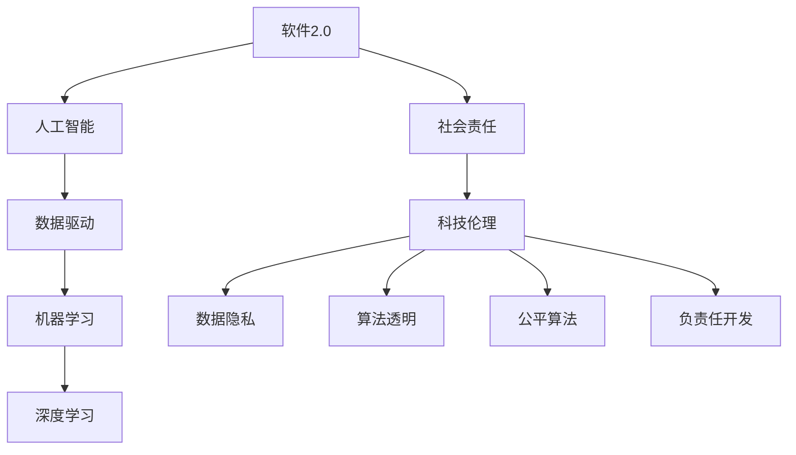
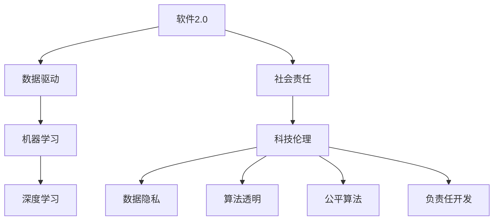
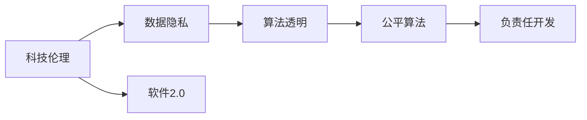
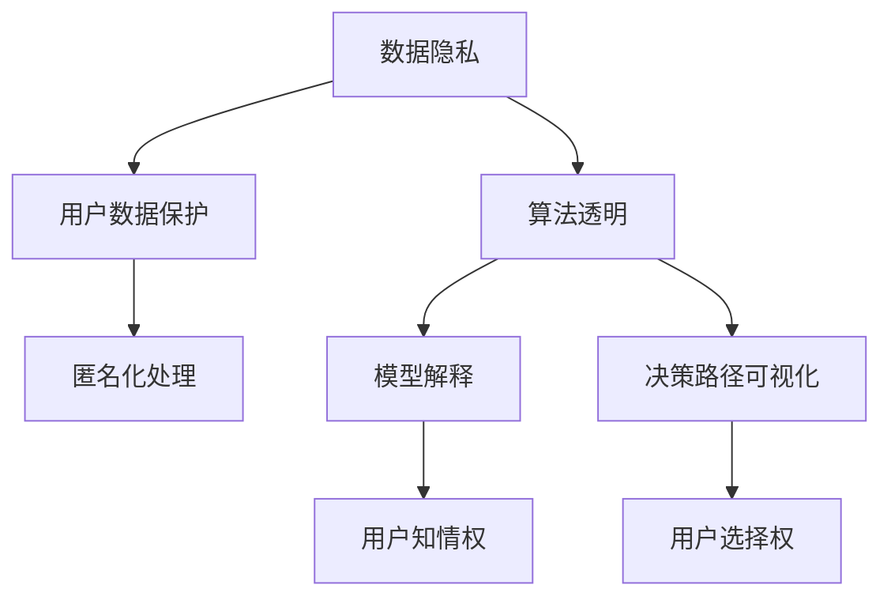
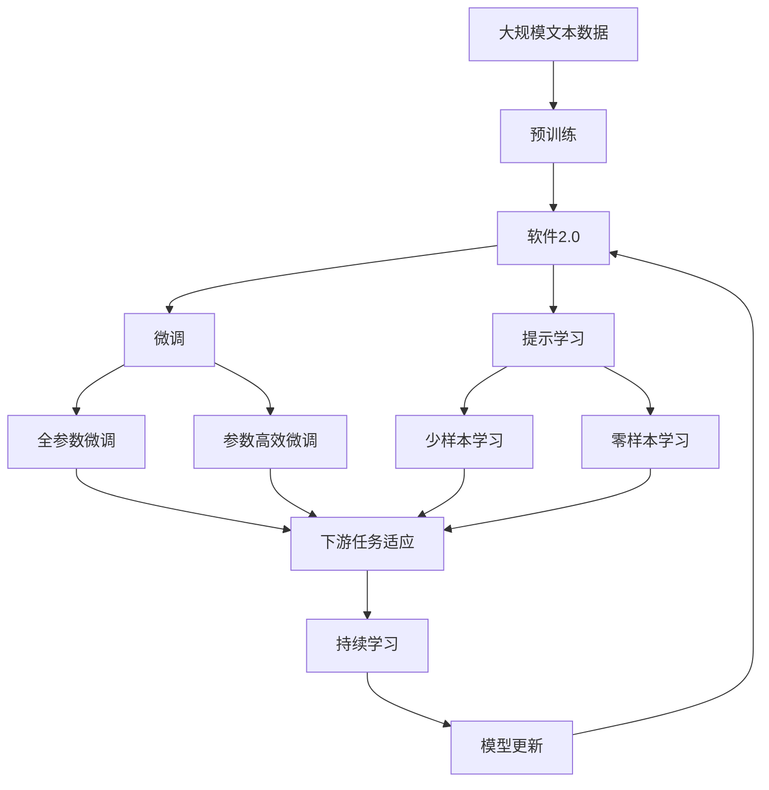

                 

# 软件 2.0 的社会责任：科技向善

> 关键词：软件2.0, 人工智能, 社会责任, 科技伦理, 人工智能向善, 数据隐私, 算法透明, 公平算法, 负责任开发

## 1. 背景介绍

### 1.1 问题由来

随着科技的不断进步，人工智能（AI）和软件技术的飞速发展，我们进入了一个新的时代——软件2.0时代。软件2.0以数据为中心，强调机器学习和大数据分析的应用，能够自动学习、优化和进化，从而实现智能化的决策和操作。然而，随之而来的还有一系列新的挑战和问题，尤其是软件2.0对社会责任的影响，以及科技向善的必要性。

### 1.2 问题核心关键点

软件2.0的社会责任问题主要集中在以下几个方面：

- **数据隐私和安全**：软件2.0依赖大量数据，如何保护用户隐私和数据安全，防止数据泄露和滥用，成为亟待解决的问题。
- **算法透明和可解释性**：复杂的机器学习模型往往难以解释其决策过程，如何确保算法透明，提升算法的可解释性，增强用户信任，是软件2.0的重要挑战。
- **公平性和偏见**：算法偏见和数据偏差可能导致不公平的结果，如何设计公平算法，避免算法歧视，是软件2.0需要关注的重要问题。
- **负责任开发和治理**：软件开发过程中应如何负责任地进行开发，遵循伦理规范，确保软件系统的长期稳定性和安全性。

### 1.3 问题研究意义

研究软件2.0的社会责任，对于保障用户权益、促进科技进步、构建公平和谐的社会环境具有重要意义：

- **保障用户权益**：通过确保数据隐私和算法透明，保障用户知情权和选择权，保护用户不受侵害。
- **推动科技进步**：只有遵循伦理规范，负责任地开发软件，才能赢得公众信任，推动科技的可持续健康发展。
- **构建和谐社会**：通过设计公平算法，避免算法偏见，促进社会公平和谐，减少社会冲突。
- **促进产业升级**：负责任的软件开发和治理，有助于提高软件系统的质量和可靠性，推动产业升级和数字化转型。

## 2. 核心概念与联系

### 2.1 核心概念概述

为更好地理解软件2.0的社会责任，本节将介绍几个密切相关的核心概念：

- **软件2.0**：以数据为中心，强调机器学习和大数据分析，能够自动学习、优化和进化的软件系统。
- **人工智能**：通过模拟人类智能行为，实现自动决策和操作的技术。
- **社会责任**：科技在社会发展中应承担的责任，包括保障用户权益、促进公平和谐等。
- **科技伦理**：科技发展应遵循的伦理规范，涉及数据隐私、算法透明、公平性等方面。
- **科技向善**：利用科技推动社会进步，造福人类社会。
- **数据隐私**：保护用户个人信息，防止数据滥用和泄露。
- **算法透明**：确保算法决策过程透明，用户能够理解和信任算法结果。
- **公平算法**：设计无偏差的算法，避免算法歧视，促进社会公平。
- **负责任开发**：在软件开发过程中，遵循伦理规范，确保软件的长期稳定性和安全性。

这些核心概念之间的逻辑关系可以通过以下Mermaid流程图来展示：



这个流程图展示了大语言模型的核心概念及其之间的关系：

1. 软件2.0以人工智能为核心，依赖数据驱动和机器学习技术。
2. 机器学习中的深度学习是其重要组成部分，用于复杂数据模式的识别和预测。
3. 软件2.0在发展过程中应承担社会责任，包括科技伦理、数据隐私、算法透明等方面。
4. 科技伦理涉及数据隐私保护、算法透明和公平性等多个方面，是软件2.0社会责任的重要组成部分。

### 2.2 概念间的关系

这些核心概念之间存在着紧密的联系，形成了软件2.0的社会责任的完整生态系统。下面我们通过几个Mermaid流程图来展示这些概念之间的关系。

#### 2.2.1 软件2.0的学习范式



这个流程图展示了大语言模型的学习范式及其与社会责任的联系。软件2.0以数据为中心，通过机器学习和深度学习实现学习与进化。在发展过程中，软件2.0应遵循科技伦理规范，确保数据隐私和算法透明，设计公平算法，进行负责任的开发。

#### 2.2.2 科技伦理与软件2.0的关系



这个流程图展示了科技伦理与软件2.0的关系。科技伦理是软件2.0发展的基石，确保数据隐私和算法透明，设计公平算法，进行负责任的开发，才能赢得公众信任，推动科技的可持续健康发展。

#### 2.2.3 数据隐私和算法透明的应用场景



这个流程图展示了数据隐私和算法透明在实际应用中的具体应用场景。通过数据匿名化处理，保护用户隐私，确保用户知情权和选择权。算法透明则通过模型解释和决策路径可视化，使用户能够理解和信任算法结果。

### 2.3 核心概念的整体架构

最后，我们用一个综合的流程图来展示这些核心概念在大语言模型微调过程中的整体架构：



这个综合流程图展示了从预训练到微调，再到持续学习的完整过程。软件2.0首先在大规模文本数据上进行预训练，然后通过微调（包括全参数微调和参数高效微调）或提示学习（包括少样本学习和零样本学习）来适应下游任务。最后，通过持续学习技术，软件2.0可以不断学习新知识，同时保持已学习的知识，而不会出现灾难性遗忘。

## 3. 核心算法原理 & 具体操作步骤
### 3.1 算法原理概述

软件2.0的社会责任问题，可以通过以下算法来理解和解决：

1. **数据隐私保护算法**：通过数据匿名化、差分隐私等技术，保护用户隐私，防止数据泄露和滥用。
2. **算法透明化技术**：通过模型解释、决策路径可视化等技术，确保算法透明，提升用户信任。
3. **公平算法设计**：通过数据预处理、算法优化等技术，设计公平算法，避免算法偏见。
4. **负责任开发框架**：通过自动化测试、代码审查、伦理规范等技术，确保软件的长期稳定性和安全性。

### 3.2 算法步骤详解

#### 3.2.1 数据隐私保护算法

1. **数据匿名化**：通过对数据进行脱敏处理，如去除或替换敏感信息，保护用户隐私。常用的方法包括数据掩蔽、扰动、泛化等。
2. **差分隐私**：通过在数据处理中加入噪声，保护个体隐私，防止数据泄露。常用的方法包括拉普拉斯噪声、高斯噪声等。
3. **隐私计算**：通过在计算过程中不直接处理敏感数据，保护用户隐私，防止数据泄露。常用的方法包括同态加密、多方安全计算等。

#### 3.2.2 算法透明化技术

1. **模型解释**：通过特征重要性分析、局部可解释模型等技术，解释模型决策过程，提升用户信任。常用的方法包括LIME、SHAP、CHX等。
2. **决策路径可视化**：通过可视化技术，展示算法决策路径，帮助用户理解算法结果。常用的方法包括GNN、LIME等。

#### 3.2.3 公平算法设计

1. **数据预处理**：通过数据清洗、特征选择等技术，去除数据偏差，确保数据集的代表性和公平性。
2. **算法优化**：通过引入公平性约束、公平损失函数等技术，优化算法设计，避免算法偏见。
3. **公平性评估**：通过公平性指标（如Disparate Impact、Equalized Odds等）评估算法公平性，确保算法无歧视。

#### 3.2.4 负责任开发框架

1. **自动化测试**：通过单元测试、集成测试、压力测试等技术，确保软件系统的稳定性和可靠性。
2. **代码审查**：通过代码审查、代码审计等技术，发现和修复潜在的安全漏洞和逻辑错误。
3. **伦理规范**：通过制定和遵循伦理规范，确保软件系统的合法性和道德性。

### 3.3 算法优缺点

**数据隐私保护算法的优点**：
- **保护用户隐私**：通过数据匿名化、差分隐私等技术，保护用户隐私，防止数据泄露和滥用。
- **提升用户信任**：通过保护用户隐私，增强用户对软件的信任，促进用户使用。

**数据隐私保护算法的缺点**：
- **数据精度降低**：数据匿名化和差分隐私等技术，可能会降低数据的精度和可用性，影响模型性能。
- **计算复杂度高**：隐私计算等技术，通常需要较大的计算资源和较长的计算时间，增加了系统的复杂性。

**算法透明化技术的优点**：
- **提升用户信任**：通过模型解释、决策路径可视化等技术，增强用户对算法的信任，促进用户使用。
- **促进算法改进**：通过用户反馈，识别和优化算法中的问题和不足，提升算法性能。

**算法透明化技术的缺点**：
- **模型复杂度增加**：模型解释和决策路径可视化等技术，可能会增加模型的复杂度，影响模型的效率。
- **用户理解难度大**：复杂的模型解释技术，可能难以被非专业人士理解，增加用户使用门槛。

**公平算法设计的优点**：
- **避免算法偏见**：通过数据预处理、算法优化等技术，设计公平算法，避免算法偏见。
- **提升社会公平性**：通过公平算法设计，促进社会公平和谐，减少社会冲突。

**公平算法设计的缺点**：
- **数据处理复杂**：数据预处理和算法优化等技术，通常需要较高的技术水平和资源投入，增加了系统复杂性。
- **模型性能下降**：公平算法设计可能会影响模型性能，需要平衡模型性能和公平性。

**负责任开发框架的优点**：
- **系统可靠性高**：通过自动化测试、代码审查等技术，确保软件系统的稳定性和可靠性。
- **遵循伦理规范**：通过制定和遵循伦理规范，确保软件系统的合法性和道德性。

**负责任开发框架的缺点**：
- **开发成本高**：自动化测试、代码审查等技术，需要较高的技术水平和资源投入，增加了开发成本。
- **开发周期长**：负责任开发框架通常需要较长的开发周期，增加了项目风险。

### 3.4 算法应用领域

数据隐私保护算法、算法透明化技术、公平算法设计和负责任开发框架，在多个领域得到了广泛应用：

- **医疗健康**：在医疗健康领域，通过数据隐私保护算法，保护患者隐私，确保数据安全。通过算法透明化技术，提升患者对医疗系统的信任。通过公平算法设计，避免医疗系统中的偏见，促进医疗公平。通过负责任开发框架，确保医疗系统的稳定性和安全性。

- **金融服务**：在金融服务领域，通过数据隐私保护算法，保护客户隐私，防止数据泄露和滥用。通过算法透明化技术，提升客户对金融系统的信任。通过公平算法设计，避免金融系统中的偏见，促进金融公平。通过负责任开发框架，确保金融系统的稳定性和安全性。

- **教育领域**：在教育领域，通过数据隐私保护算法，保护学生隐私，防止数据泄露和滥用。通过算法透明化技术，提升学生对教育系统的信任。通过公平算法设计，避免教育系统中的偏见，促进教育公平。通过负责任开发框架，确保教育系统的稳定性和安全性。

- **智能交通**：在智能交通领域，通过数据隐私保护算法，保护车辆和用户隐私，防止数据泄露和滥用。通过算法透明化技术，提升用户对智能交通系统的信任。通过公平算法设计，避免智能交通系统中的偏见，促进交通公平。通过负责任开发框架，确保智能交通系统的稳定性和安全性。

以上这些领域的应用，展示了数据隐私保护算法、算法透明化技术、公平算法设计和负责任开发框架的广泛适用性，它们在实际应用中发挥了重要的作用，保障了用户的权益，促进了社会的公平和谐。

## 4. 数学模型和公式 & 详细讲解 & 举例说明

### 4.1 数学模型构建

在软件2.0的社会责任问题中，数学模型和公式扮演着重要的角色。以下是几个核心数学模型和公式的详细构建和讲解：

#### 4.1.1 差分隐私

差分隐私是一种通过在数据处理中加入噪声，保护个体隐私的技术。其数学公式为：

$$
\begin{aligned}
\mathcal{L}(S, Q) &= \mathbb{E}_{x \sim Q}[\log f(x) - \log f(x')] \\
&\leq \delta \log(\frac{1}{\epsilon} + 1)
\end{aligned}
$$

其中，$\mathcal{L}(S, Q)$ 表示在数据集 $S$ 上，噪声处理后的数据集 $Q$ 与原始数据集 $S$ 之间的隐私损失，$\delta$ 表示隐私差分参数，$\epsilon$ 表示隐私保护参数。通过调整 $\delta$ 和 $\epsilon$ 的值，可以控制隐私损失的大小，保护个体隐私。

#### 4.1.2 特征重要性分析

特征重要性分析是一种通过计算各个特征对模型输出的贡献度，解释模型决策过程的技术。常用的方法包括 SHAP、LIME 等。其数学公式为：

$$
\text{SHAP值} = \mathbb{E}_{x \sim D}[\mathbb{E}_{\hat{y} \sim M}[\log f(x) - \log f(x')]]
$$

其中，$x$ 表示输入特征，$y$ 表示输出，$D$ 表示特征分布，$M$ 表示模型，$f(x)$ 表示模型输出，$x'$ 表示随机特征。通过计算每个特征的 SHAP值，可以解释模型决策过程，提升用户信任。

#### 4.1.3 公平性指标

公平性指标是一种用于评估算法公平性的技术。常用的指标包括 Disparate Impact（DI）和 Equalized Odds（EO）等。其数学公式为：

$$
\text{Disparate Impact} = \frac{\text{TPR}_{\text{positive}} - \text{TPR}_{\text{negative}}}{\text{TPR}_{\text{negative}}}
$$

其中，$\text{TPR}_{\text{positive}}$ 表示正类样本的真实阳性率，$\text{TPR}_{\text{negative}}$ 表示负类样本的真实阳性率。通过计算 Disparate Impact 值，可以评估算法是否存在偏见，确保算法公平性。

#### 4.1.4 自动化测试

自动化测试是一种通过自动化工具检测软件系统错误和缺陷的技术。常用的方法包括单元测试、集成测试、压力测试等。其数学模型为：

$$
\text{测试覆盖率} = \frac{\text{被测试的代码行数}}{\text{总代码行数}}
$$

其中，测试覆盖率表示被测试的代码行数占总代码行数的比例。通过自动化测试，可以确保软件系统的稳定性和可靠性。

### 4.2 公式推导过程

#### 4.2.1 差分隐私

差分隐私的数学推导过程如下：

假设数据集 $S$ 中有 $n$ 个样本，每个样本 $x_i$ 有 $m$ 个特征。在加入噪声 $\Delta$ 后，得到处理后的数据集 $Q$。通过差分隐私公式，可以计算隐私损失 $\mathcal{L}(S, Q)$：

$$
\begin{aligned}
\mathcal{L}(S, Q) &= \sum_{i=1}^n \log \frac{f(x_i)}{f(x_i') - \Delta} \\
&= \mathbb{E}_{x \sim Q}[\log f(x) - \log f(x')] \\
&\leq \delta \log(\frac{1}{\epsilon} + 1)
\end{aligned}
$$

其中，$f(x)$ 表示原始数据集 $S$ 上的模型输出，$f(x')$ 表示处理后的数据集 $Q$ 上的模型输出。通过调整 $\delta$ 和 $\epsilon$ 的值，可以控制隐私损失的大小，保护个体隐私。

#### 4.2.2 特征重要性分析

特征重要性分析的数学推导过程如下：

假设模型 $M$ 的输出为 $y$，输入特征 $x$ 有 $m$ 个。通过 SHAP值公式，可以计算每个特征的重要性：

$$
\text{SHAP值} = \sum_{i=1}^m \Delta_i \cdot f(x_i)
$$

其中，$\Delta_i$ 表示随机特征 $x_i$，$f(x_i)$ 表示模型输出。通过计算每个特征的 SHAP值，可以解释模型决策过程，提升用户信任。

#### 4.2.3 公平性指标

公平性指标的数学推导过程如下：

假设数据集 $S$ 中有 $n$ 个样本，每个样本 $x_i$ 有 $m$ 个特征。通过 Disparate Impact 公式，可以计算算法是否存在偏见：

$$
\text{Disparate Impact} = \frac{\text{TPR}_{\text{positive}} - \text{TPR}_{\text{negative}}}{\text{TPR}_{\text{negative}}}
$$

其中，$\text{TPR}_{\text{positive}}$ 表示正类样本的真实阳性率，$\text{TPR}_{\text{negative}}$ 表示负类样本的真实阳性率。通过计算 Disparate Impact 值，可以评估算法是否存在偏见，确保算法公平性。

#### 4.2.4 自动化测试

自动化测试的数学模型推导如下：

假设软件系统有 $n$ 个测试用例，每个测试用例 $i$ 有 $m$ 个断言。通过测试覆盖率公式，可以计算测试用例的覆盖率：

$$
\text{测试覆盖率} = \frac{\sum_{i=1}^n \text{断言数}}{\text{总断言数}}
$$

其中，总断言数表示系统中的断言总数。通过自动化测试，可以确保软件系统的稳定性和可靠性。

### 4.3 案例分析与讲解

#### 4.3.1 医疗健康领域

在医疗健康领域，数据隐私保护算法、算法透明化技术、公平算法设计和负责任开发框架都得到了广泛应用：

- **数据隐私保护算法**：通过数据匿名化和差分隐私技术，保护患者隐私，防止数据泄露和滥用。例如，某医疗系统通过差分隐私技术，保护患者医疗记录，确保数据安全。
- **算法透明化技术**：通过模型解释和决策路径可视化技术，提升患者对医疗系统的信任。例如，某医疗系统通过 LIME 技术，解释医生诊断决策，帮助患者理解诊断过程。
- **公平算法设计**：通过数据预处理和算法优化技术，设计公平算法，避免医疗系统中的偏见。例如，某医疗系统通过公平算法设计，确保不同种族、性别、年龄群体的公平诊断和治疗。
- **负责任开发框架**：通过自动化测试和代码审查技术，确保医疗系统的稳定性和安全性。例如，某医疗系统通过自动化测试，发现和修复系统漏洞，确保系统的稳定运行。

#### 4.3.2 金融服务领域

在金融服务领域，数据隐私保护算法、算法透明化技术、公平算法设计和负责任开发框架同样得到了广泛应用：

- **数据隐私保护算法**：通过数据匿名化和差分隐私技术，保护客户隐私，防止数据泄露和滥用。例如，某金融公司通过差分隐私技术，保护客户交易记录，确保数据安全。
- **算法透明化技术**：通过模型解释和决策路径可视化技术，提升客户对金融系统的信任。例如，某金融公司通过 SHAP 技术，解释贷款审批决策，帮助客户理解审批过程。
- **公平算法设计**：通过数据预处理和算法优化技术，设计公平算法，避免金融系统中的偏见。例如，某金融公司通过公平算法设计，确保不同性别、种族、收入群体的公平贷款审批。
- **负责任开发框架**：通过自动化测试和代码审查技术，确保金融系统的稳定性和安全性。例如，某金融公司通过自动化测试，发现和修复系统漏洞，确保系统的稳定运行。

以上这些案例，展示了数据隐私保护算法、算法透明化技术、公平算法设计和负责任开发框架在实际应用中的广泛适用性，它们在实际应用中发挥了重要的作用，保障了用户的权益，促进了社会的公平和谐。

## 5. 项目实践：代码实例和详细解释说明

### 5.1 开发环境搭建

在进行软件2.0的社会责任实践前，我们需要准备好开发环境。以下是使用Python进行PyTorch开发的环境配置流程：

1. 安装Anaconda：从官网下载并安装Anaconda，用于创建独立的Python环境。

2. 创建并激活虚拟环境：
```bash
conda create -n pytorch-env python=3.8 
conda activate pytorch-env
```

3. 安装PyTorch：根据CUDA版本，从官网获取对应的安装命令。例如：
```bash
conda install pytorch torchvision torchaudio cudatoolkit=11.1 -c pytorch -c conda-forge
```

4. 安装Transformers库：
```bash
pip install transformers
```

5. 安装各类工具包：
```bash
pip install numpy pandas scikit-learn matplotlib tqdm jupyter notebook ipython
```

完成上述步骤后，即可在`pytorch-env`环境中开始社会责任实践。

### 5.2 源代码详细实现

这里我们以医疗健康领域的数据隐私保护算法为例，给出使用Transformers库对BERT模型进行差分隐私保护的PyTorch代码实现。

首先，定义差分隐私保护函数：

```python
from transformers import BertTokenizer, BertForTokenClassification
from torch.utils.data import Dataset
import torch
import torch.nn.functional as F
from torch.distributions import GaussianNoise

class MyDataset(Dataset):
    def __init__(self, texts, tags, tokenizer, max_len=128):
        self.texts = texts
        self.tags = tags
        self.tokenizer = tokenizer
        self.max_len = max_len
        
    def __len__(self):
        return len(self.texts)
    
    def __getitem__(self, item):
        text = self.texts[item]
        tags = self.tags[item]
        
        encoding = self.tokenizer(text, return_tensors='pt', max_length=self.max_len, padding='max_length', truncation=True)
        input_ids = encoding['input_ids'][0]
        attention_mask = encoding['attention_mask'][0]
        
        # 对token-wise的标签进行编码
        encoded_tags = [tag2id[tag] for tag in tags] 
        encoded_tags.extend([tag2id['O']] * (self.max_len - len(encoded_tags)))
        labels = torch.tensor(encoded_tags, dtype=torch.long)
        
        # 差分隐私处理
        noise = GaussianNoise(0.1)
        noisy_labels = noise.sample(labels.shape).to(torch.long) + labels
        return {'input_ids': input_ids, 
                'attention_mask': attention_mask,
                'noisy_labels': noisy_labels}

# 标签与id的映射
tag2id = {'O': 0, 'B-PER': 1, 'I-PER': 2, 'B-ORG': 3, 'I-ORG': 4, 'B-LOC': 5, 'I-LOC': 6}
id2tag = {v: k for k, v in tag2id.items()}

# 创建dataset
tokenizer = BertTokenizer.from_pretrained('bert-base-cased')

train_dataset = MyDataset(train_texts, train_tags, tokenizer)
dev_dataset = MyDataset(dev_texts, dev_tags, tokenizer)
test_dataset = MyDataset(test_texts, test_tags, tokenizer)
```

然后，定义模型和优化器：

```python
from transformers import BertForTokenClassification, AdamW

model = BertForTokenClassification.from_pretrained('bert-base-cased', num_labels=len(tag2

