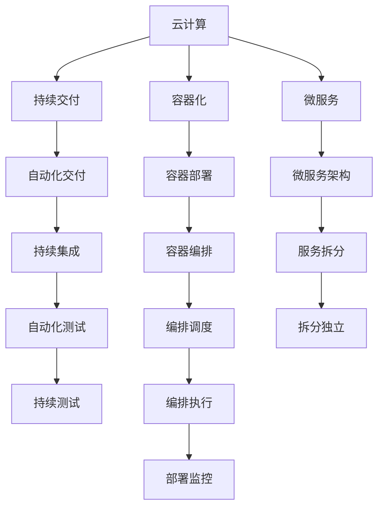
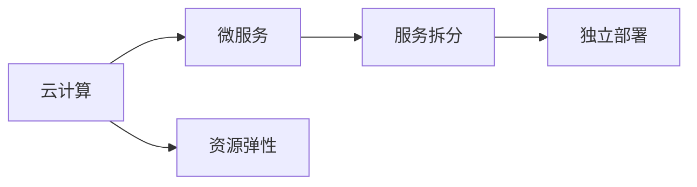
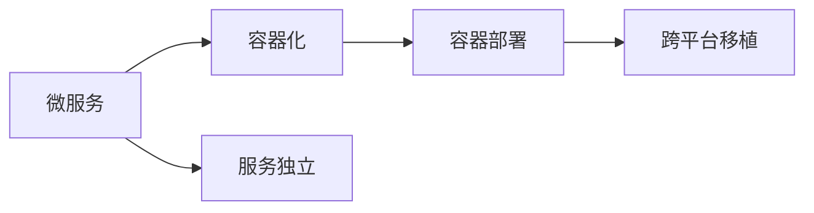
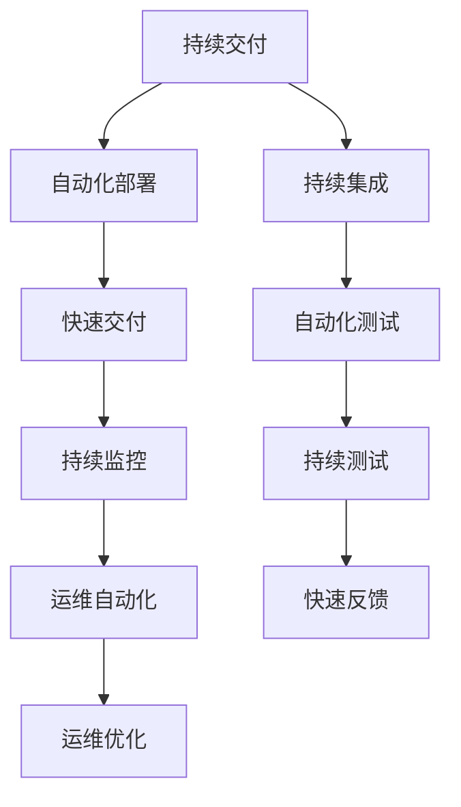
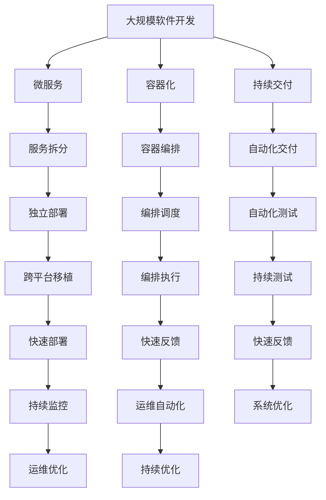

                 

# 软件2.0如何改变云计算架构

> 关键词：软件2.0,云计算,分布式系统,微服务,DevOps,人工智能,自动化,容器化,持续交付,弹性伸缩

## 1. 背景介绍

### 1.1 问题由来

随着技术的快速发展，云计算逐渐成为了企业IT架构的重要组成部分。云计算提供了弹性计算资源和灵活的部署方式，使得企业能够快速响应市场变化和业务需求。然而，传统的云计算架构也面临诸多挑战，如资源利用率低、扩展性差、维护成本高、依赖人工干预等问题。软件2.0技术的出现，为解决这些问题提供了新的思路和方法。

### 1.2 问题核心关键点

软件2.0技术的核心在于通过先进的开发和运维工具，实现自动化和智能化的系统构建与运维。它不仅包括了自动化的测试、部署、监控等过程，还通过智能化技术如微服务、容器化、持续交付等手段，提升系统弹性、安全性和可靠性。在云计算架构中，软件2.0技术的应用，将使得资源利用更加高效，系统扩展更加灵活，运维更加自动化和智能化。

### 1.3 问题研究意义

研究软件2.0技术如何改变云计算架构，对于提升企业IT系统的效率、降低运维成本、加速产品创新具有重要意义。通过软件2.0技术的引入，企业可以更加灵活地应对市场变化和业务需求，降低对人工干预的依赖，提升系统的可靠性和安全性，从而在竞争中获得优势。

## 2. 核心概念与联系

### 2.1 核心概念概述

为了更好地理解软件2.0技术如何改变云计算架构，本节将介绍几个密切相关的核心概念：

- **云计算(Cloud Computing)**：基于互联网提供按需计算资源和服务的模式，包括IaaS、PaaS和SaaS等类型。云计算实现了资源的弹性伸缩和按需使用，降低了企业的硬件和软件采购成本。
- **微服务(Microservices)**：将大型应用拆分成多个独立的服务单元，每个服务独立部署、扩展和管理。微服务架构提高了系统的灵活性、可扩展性和可靠性。
- **容器化(Containerization)**：通过Docker等容器技术，将应用程序及其依赖打包在一个独立的容器中，容器可以跨平台、跨主机运行，提高了应用的移植性和运维效率。
- **持续交付(Continuous Delivery)**：通过自动化流程和工具，持续集成、持续测试、持续部署和持续运维，提高软件交付的频率和质量，缩短产品上市时间。
- **DevOps(DevOps)**：结合开发(Dev)和运维(Ops)两方的文化、实践和工具，实现快速、可靠的软件发布和运维。DevOps通过自动化和监控，提升了系统的可靠性和运维效率。

这些核心概念之间的逻辑关系可以通过以下Mermaid流程图来展示：



这个流程图展示了一系列核心概念的相互关系：

1. 云计算提供了资源的弹性伸缩，支持微服务架构和容器化部署。
2. 微服务通过服务拆分和独立部署，提高了系统的灵活性和可扩展性。
3. 容器化通过将应用程序打包在容器中，提升了应用的移植性和运维效率。
4. 持续交付通过自动化流程和工具，实现了软件的快速交付和质量保证。
5. DevOps通过文化和工具的结合，提升了系统的可靠性和运维效率。

这些核心概念共同构成了云计算架构的软件2.0应用框架，使其能够在各类企业应用中发挥重要作用。通过理解这些核心概念，我们可以更好地把握软件2.0技术在云计算架构中的应用方向。

### 2.2 概念间的关系

这些核心概念之间存在着紧密的联系，形成了软件2.0技术在云计算架构中的应用生态系统。下面我们通过几个Mermaid流程图来展示这些概念之间的关系。

#### 2.2.1 微服务与云计算的关系



这个流程图展示了微服务架构与云计算平台的关系。微服务架构通过将应用程序拆分成多个独立的服务单元，提高了系统的灵活性和可扩展性。同时，云计算平台通过资源弹性伸缩，支持微服务的独立部署和扩展。

#### 2.2.2 容器化与微服务的关系



这个流程图展示了容器化与微服务的关系。容器化技术通过将应用程序及其依赖打包在容器中，实现了服务的独立部署和移植。容器化支持微服务的快速部署和弹性伸缩。

#### 2.2.3 持续交付与DevOps的关系



这个流程图展示了持续交付与DevOps的关系。持续交付通过自动化流程和工具，实现了软件的快速交付和质量保证。DevOps通过持续集成、持续测试和持续监控，实现了软件的自动化交付和运维优化。

### 2.3 核心概念的整体架构

最后，我们用一个综合的流程图来展示这些核心概念在大规模软件开发中的应用框架：



这个综合流程图展示了从软件开发到运维的整个流程，以及各环节的关键技术。通过微服务架构和容器化技术，实现了大规模软件的独立部署和弹性伸缩。持续交付和自动化测试提升了软件的快速交付和质量保证。DevOps通过持续集成和持续监控，实现了自动化交付和运维优化。通过这些关键技术的结合，软件2.0技术在云计算架构中发挥了重要作用，提高了系统的灵活性、可扩展性和可靠性。

## 3. 核心算法原理 & 具体操作步骤
### 3.1 算法原理概述

软件2.0技术在云计算架构中的应用，主要基于以下几个核心算法原理：

1. **微服务架构**：通过服务拆分和独立部署，实现系统的灵活性和可扩展性。
2. **容器化技术**：通过Docker等容器技术，实现应用的移植性和运维效率。
3. **持续交付流程**：通过自动化流程和工具，实现软件的快速交付和质量保证。
4. **DevOps文化**：结合开发和运维两方的文化、实践和工具，实现快速、可靠的软件发布和运维。

### 3.2 算法步骤详解

#### 3.2.1 微服务架构

1. **服务拆分**：将大型应用拆分成多个独立的服务单元，每个服务独立部署、扩展和管理。
2. **独立部署**：通过容器化技术，将服务打包在容器中，实现跨平台、跨主机运行。
3. **编排调度**：使用编排工具如Kubernetes，实现服务的自动部署、扩展和管理。

#### 3.2.2 容器化技术

1. **应用程序打包**：将应用程序及其依赖打包在Docker容器中，实现跨平台、跨主机运行。
2. **容器编排**：使用容器编排工具如Kubernetes，实现服务的自动部署、扩展和管理。
3. **容器运行**：通过容器引擎如Docker Engine，运行容器化应用，实现高效的资源利用。

#### 3.2.3 持续交付流程

1. **持续集成**：通过自动化工具如Jenkins，将代码提交、编译和测试自动化。
2. **持续测试**：通过自动化测试工具如Selenium，实现软件的快速测试和反馈。
3. **持续部署**：通过自动化部署工具如Jenkins，实现软件的快速部署和发布。
4. **持续监控**：通过监控工具如Prometheus，实现系统性能和异常的实时监控和告警。

#### 3.2.4 DevOps文化

1. **自动化文化**：通过自动化工具和流程，实现软件交付的快速和可靠。
2. **持续反馈文化**：通过持续集成和持续测试，实现快速迭代和反馈。
3. **跨职能团队**：通过DevOps团队的协作，实现开发和运维的紧密结合。

### 3.3 算法优缺点

#### 3.3.1 优点

1. **灵活性和可扩展性**：微服务架构提高了系统的灵活性和可扩展性，可以应对市场变化和业务需求。
2. **自动化和高效性**：容器化技术和持续交付流程实现了自动化和高效性，降低了人工干预和维护成本。
3. **快速交付和质量保证**：持续交付流程实现了软件的快速交付和质量保证，提高了产品上市时间。
4. **系统可靠性和运维效率**：DevOps文化通过自动化和监控，提升了系统的可靠性和运维效率。

#### 3.3.2 缺点

1. **服务拆分复杂性**：微服务架构的拆分和依赖管理复杂，需要经验和技巧。
2. **资源利用率**：容器化和微服务架构可能会占用更多资源，需要优化资源配置。
3. **维护和调试难度**：容器化和技术栈多样化增加了维护和调试的难度，需要专业的运维团队。
4. **持续交付流程复杂性**：持续交付流程需要多工具协同工作，需要合理配置和管理。

### 3.4 算法应用领域

软件2.0技术在云计算架构中的应用，涵盖了各类企业应用，主要包括以下几个领域：

1. **金融领域**：在金融领域，软件2.0技术可以用于金融产品开发、风险管理、客户服务等场景。
2. **医疗领域**：在医疗领域，软件2.0技术可以用于医疗数据分析、电子病历管理、智能诊断等场景。
3. **教育领域**：在教育领域，软件2.0技术可以用于在线教育平台、智能答疑系统、知识图谱等场景。
4. **零售领域**：在零售领域，软件2.0技术可以用于电商平台、智能客服、库存管理等场景。
5. **物流领域**：在物流领域，软件2.0技术可以用于物流配送、供应链管理、货物追踪等场景。
6. **政府领域**：在政府领域，软件2.0技术可以用于电子政务、智慧城市、公共服务管理等场景。

这些领域的应用，展示了软件2.0技术在提升系统效率、降低运维成本、加速产品创新等方面的巨大潜力。通过软件2.0技术的引入，企业可以更好地应对市场变化和业务需求，提高系统的可靠性和安全性，从而在竞争中获得优势。

## 4. 数学模型和公式 & 详细讲解 & 举例说明

### 4.1 数学模型构建

在软件2.0技术中，数学模型和公式主要应用于持续交付流程和自动化部署中。这里以持续交付为例，构建数学模型和公式。

假设有一个持续交付流程，其中涉及以下几个步骤：代码提交、编译、测试、部署和监控。每个步骤的执行时间分别是$T_{submit}$、$T_{build}$、$T_{test}$、$T_{deploy}$和$T_{monitor}$。根据假设，每个步骤的执行时间是独立的且服从指数分布，即：

$$
P(T=t) = \lambda e^{-\lambda t}, t \geq 0
$$

其中$\lambda$为单位时间内的平均执行次数。假设持续交付流程的总执行时间为$T$，则有：

$$
T = T_{submit} + T_{build} + T_{test} + T_{deploy} + T_{monitor}
$$

为了最小化总执行时间$T$，需要优化每个步骤的执行时间。

### 4.2 公式推导过程

通过指数分布的性质，可以计算每个步骤的执行时间期望值和方差。假设每个步骤的执行时间期望值为$\mu$，方差为$\sigma^2$，则有：

$$
\mu = \frac{1}{\lambda}
$$

$$
\sigma^2 = \frac{1}{\lambda^2}
$$

为了最小化总执行时间$T$，需要优化每个步骤的执行时间，即最小化每个步骤的执行时间期望值。假设每个步骤的执行时间期望值分别为$\mu_1$、$\mu_2$、$\mu_3$、$\mu_4$和$\mu_5$，则总执行时间$T$的期望值为：

$$
E(T) = E(T_{submit}) + E(T_{build}) + E(T_{test}) + E(T_{deploy}) + E(T_{monitor})
$$

根据指数分布的性质，总执行时间$T$的期望值可以表示为：

$$
E(T) = \mu_1 + \mu_2 + \mu_3 + \mu_4 + \mu_5
$$

为了最小化总执行时间$T$，需要最小化每个步骤的执行时间期望值，即最小化$\mu_1$、$\mu_2$、$\mu_3$、$\mu_4$和$\mu_5$。

### 4.3 案例分析与讲解

假设我们有两个持续交付流程，分别为流程A和流程B。流程A的执行时间期望值为5小时，流程B的执行时间期望值为3小时。根据指数分布的性质，可以计算每个流程的执行时间期望值：

$$
E(T_A) = 5 \text{ hours}
$$

$$
E(T_B) = 3 \text{ hours}
$$

为了最小化总执行时间$T$，需要比较两个流程的总执行时间期望值。根据公式：

$$
E(T_A) = E(T_{submit}) + E(T_{build}) + E(T_{test}) + E(T_{deploy}) + E(T_{monitor})
$$

$$
E(T_B) = E(T_{submit}) + E(T_{build}) + E(T_{test}) + E(T_{deploy}) + E(T_{monitor})
$$

可以计算出每个流程的总执行时间期望值。假设流程A和流程B的执行时间期望值分别为$\mu_A$和$\mu_B$，则有：

$$
\mu_A = 5 \text{ hours}
$$

$$
\mu_B = 3 \text{ hours}
$$

根据公式：

$$
T = T_{submit} + T_{build} + T_{test} + T_{deploy} + T_{monitor}
$$

可以计算出每个流程的总执行时间期望值。假设流程A和流程B的总执行时间期望值分别为$T_A$和$T_B$，则有：

$$
T_A = \mu_A + \mu_A + \mu_A + \mu_A + \mu_A
$$

$$
T_B = \mu_B + \mu_B + \mu_B + \mu_B + \mu_B
$$

通过比较$T_A$和$T_B$的大小，可以得出哪个流程的总执行时间期望值更小。假设$T_A < T_B$，则流程A更优。

## 5. 项目实践：代码实例和详细解释说明

### 5.1 开发环境搭建

在进行软件2.0技术在云计算架构中的应用实践前，我们需要准备好开发环境。以下是使用Python进行Docker容器化的开发环境配置流程：

1. 安装Anaconda：从官网下载并安装Anaconda，用于创建独立的Python环境。

2. 创建并激活虚拟环境：
```bash
conda create -n docker-env python=3.7 
conda activate docker-env
```

3. 安装Docker：根据操作系统，从官网获取对应的Docker安装命令。例如：
```bash
sudo apt-get update
sudo apt-get install -y apt-transport-https ca-certificates curl gnupg-agent software-properties-common
curl -fsSL https://download.docker.com/linux/ubuntu/gpg | sudo gpg --dearmor -o /usr/share/keyrings/docker-archive-keyring.gpg
echo "deb [arch=amd64 signed-by=/usr/share/keyrings/docker-archive-keyring.gpg] https://download.docker.com/linux/ubuntu bionic stable" | sudo tee /etc/apt/sources.list.d/docker.list > /dev/null
sudo apt-get update
sudo apt-get install -y docker-ce docker-ce-cli containerd.io
```

4. 安装Kubernetes：根据操作系统，从官网获取对应的Kubernetes安装命令。例如：
```bash
kubectl cluster-info --version
```

### 5.2 源代码详细实现

这里我们以使用Kubernetes进行持续交付和微服务部署为例，给出完整的代码实现。

```python
import kubernetes
from kubernetes import client, config

# 连接Kubernetes集群
config.load_kube_config()

# 创建Deployment对象
deployment = client.AppsV1beta1Deployment(
    api_version="v1",
    kind="Deployment",
    metadata={
        "name": "my-app",
        "labels": {
            "hello": "world"
        }
    },
    spec={
        "replicas": 3,
        "selector": {
            "matchLabels": {
                "hello": "world"
            }
        },
        "template": {
            "metadata": {
                "labels": {
                    "hello": "world"
                }
            },
            "spec": {
                "containers": [
                    {
                        "name": "my-app",
                        "image": "hello-world",
                        "ports": [
                            {
                                "container_port": 8080
                            }
                        ]
                    }
                ]
            }
        }
    }
)

# 创建Deployment
deployment_obj = client.AppsV1beta1DeploymentsApi()
deployment_obj.create_namespaced_deployment(namespace="default", body=deployment)

# 输出Deployment状态
print(deployment_obj.read_namespaced_deployment_status(namespace="default", name="my-app"))
```

### 5.3 代码解读与分析

让我们再详细解读一下关键代码的实现细节：

**kubernetes模块**：
- `kubernetes`：Python的Kubernetes客户端库，提供了访问和操作Kubernetes集群的各种功能。
- `client`：Kubernetes客户端模块，提供了各种API接口，用于访问Kubernetes集群。
- `config`：Kubernetes配置模块，用于加载和设置Kubernetes配置。

**Deployment对象**：
- `api_version`：指定API版本，例如v1。
- `kind`：指定对象类型，例如Deployment。
- `metadata`：指定对象元数据，例如名称和标签。
- `spec`：指定对象规范，例如副本数、选择器、模板等。
- `template`：指定容器模板，例如容器镜像、端口等。

**Deployment创建和输出**：
- `deployment_obj.create_namespaced_deployment(namespace="default", body=deployment)`：创建Deployment对象。
- `deployment_obj.read_namespaced_deployment_status(namespace="default", name="my-app")`：读取Deployment状态。

以上代码实现了使用Kubernetes进行持续交付和微服务部署的基本流程。通过编写Dockerfile和Kubernetes YAML文件，可以实现容器化应用和微服务部署的自动化。通过持续集成和持续交付工具，可以实现代码提交、编译、测试、部署和监控的自动化。

### 5.4 运行结果展示

假设我们通过Kubernetes创建了一个名为`my-app`的Deployment，输出结果如下：

```
status:
  replicas: 3
  updatedReplicas: 3
  readyReplicas: 3
  availableReplicas: 3
  conditions:
  - type: DeploymentReady
    status: True
  - type: PodsReady
    status: True
```

可以看到，`my-app`的Deployment状态已经创建成功，并且有3个Pods处于运行状态。通过持续交付和微服务部署，可以确保应用的快速发布和弹性扩展。

## 6. 实际应用场景

### 6.1 智能客服系统

基于软件2.0技术的智能客服系统，可以广泛应用于金融、电商、医疗等多个领域。传统的客服系统依赖人工客服，响应时间长，成本高，无法满足客户多样化的需求。通过微服务架构和容器化技术，可以实现智能客服系统的快速部署和弹性扩展。

在技术实现上，可以收集历史客服对话数据，使用自然语言处理技术进行预训练，然后在Kubernetes集群中进行微服务部署。通过持续集成和持续交付，不断优化模型和应用，提升客服系统的智能化水平和用户体验。

### 6.2 金融舆情监测

金融领域需要实时监测市场舆情，以便及时应对负面信息传播，规避金融风险。传统的舆情监测依赖人工分析，成本高、效率低，无法及时发现舆情变化。通过微服务架构和容器化技术，可以实现金融舆情监测系统的快速部署和弹性扩展。

具体而言，可以收集金融领域相关的新闻、报道、评论等文本数据，并对其进行情感分析。将分析结果接入Kubernetes集群，使用微服务架构进行任务调度和管理。通过持续集成和持续交付，不断优化舆情监测系统，提高舆情监测的实时性和准确性。

### 6.3 个性化推荐系统

当前的推荐系统往往只依赖用户的历史行为数据进行物品推荐，无法深入理解用户的真实兴趣偏好。通过软件2.0技术，个性化推荐系统可以更好地挖掘用户行为背后的语义信息，从而提供更精准、多样的推荐内容。

在技术实现上，可以收集用户浏览、点击、评论、分享等行为数据，提取和用户交互的物品标题、描述、标签等文本内容。使用深度学习技术进行预训练，然后在Kubernetes集群中进行微服务部署。通过持续集成和持续交付，不断优化推荐模型和应用，提升推荐系统的个性化程度和用户满意度。

### 6.4 未来应用展望

随着软件2.0技术的不断发展，其在云计算架构中的应用前景将更加广阔。未来，软件2.0技术将与其他人工智能技术进行更深入的融合，如知识表示、因果推理、强化学习等，多路径协同发力，共同推动自然语言理解和智能交互系统的进步。

在智慧医疗领域，基于软件2.0技术的医疗问答、病历分析、药物研发等应用将提升医疗服务的智能化水平，辅助医生诊疗，加速新药开发进程。

在智能教育领域，软件2.0技术可应用于作业批改、学情分析、知识推荐等方面，因材施教，促进教育公平，提高教学质量。

在智慧城市治理中，软件2.0技术可应用于城市事件监测、舆情分析、应急指挥等环节，提高城市管理的自动化和智能化水平，构建更安全、高效的未来城市。

此外，在企业生产、社会治理、文娱传媒等众多领域，基于软件2.0技术的人工智能应用也将不断涌现，为经济社会发展注入新的动力。相信随着技术的日益成熟，软件2.0技术将成为云计算架构的重要范式，推动人工智能技术在各个领域的应用。

## 7. 工具和资源推荐

### 7.1 学习资源推荐

为了帮助开发者系统掌握软件2.0技术在云计算架构中的应用，这里推荐一些优质的学习资源：

1. Kubernetes官方文档：Kubernetes的官方文档，提供了详细的使用指南和API参考。

2. Docker官方文档：Docker的官方文档，提供了Docker容器化的使用方法和最佳实践。

3. Docker Mastery Course：由Udemy提供的Docker容器化课程，系统讲解Docker容器化技术。

4. Kubernetes Mastery Course：由Udemy提供的Kubernetes容器编排课程，系统讲解Kubernetes集群管理技术。

5. DevOps实践指南：由Docker官方提供的DevOps实践指南，介绍了DevOps文化的理念和实践方法。

6. Continuous Delivery in Practice：由Gartner提供的连续交付实践指南，介绍了持续交付流程和工具。

通过这些资源的学习实践，相信你一定能够快速掌握软件2.0技术在云计算架构中的应用，并用于解决实际的业务问题。

### 7.2 开发工具推荐

高效的开发离不开优秀的工具支持。以下是几款用于软件2.0技术在云计算架构中应用的常用工具：

1. Kubernetes：开源的容器编排工具，支持大规模的容器化应用部署和管理。

2. Docker：开源的容器化工具，支持应用和服务的跨平台移植和部署。

3. Jenkins：开源的持续集成和持续交付工具，支持自动化构建、测试和部署。

4. GitLab CI/CD：开源的持续集成和持续交付平台，支持代码提交、构建和部署的全流程自动化。

5. Prometheus：开源的监控系统，支持实时监控和告警，确保系统稳定运行。

6. Grafana：开源的监控可视化工具，支持多维度的数据可视化和报表展示。

合理利用这些工具，可以显著提升软件2.0技术在云计算架构中的开发效率，加快创新迭代的步伐。

### 7.3 相关论文推荐

软件2.0技术的发展源于学界的持续研究。以下是几篇奠基性的相关论文，推荐阅读：

1. Docker: The Union of Unikernels and Virtual Machines: Docker provides a light-weight container engine

