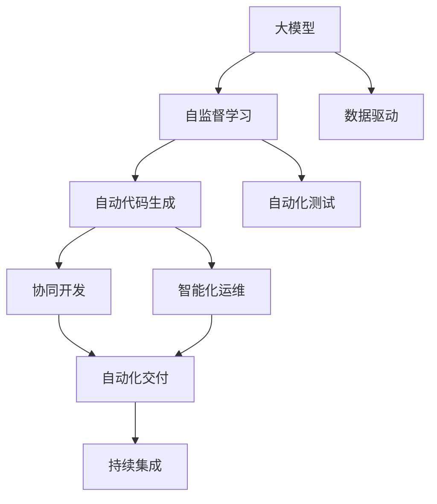
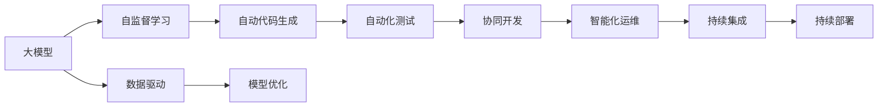
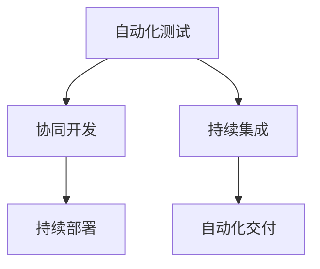
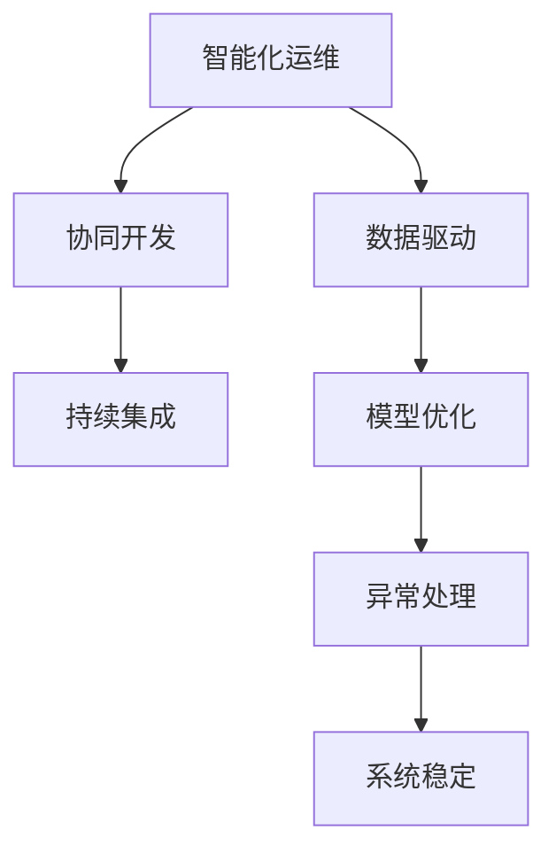
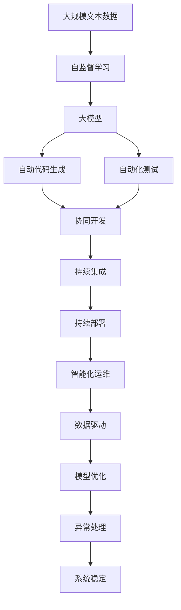

                 

# 软件2.0如何改变编程团队的分工

## 1. 背景介绍

### 1.1 问题由来

软件2.0（Software 2.0）时代的到来，标志着人工智能（AI）、自动化和工程化技术的深度融合，为编程团队带来了深刻的分工变革。在软件1.0时代，编程团队主要由软件开发工程师、测试工程师、运维工程师等传统角色构成，强调的是人工编码和手动测试等“匠人精神”。而在软件2.0时代，随着大模型和自监督学习等前沿技术的兴起，编程团队的分工将变得更加多样化，强调自动化、协同化和智能化。

### 1.2 问题核心关键点

软件2.0时代编程团队分工的核心关键点主要包括以下几个方面：

- **AI赋能**：利用AI和大模型自动化地生成代码、测试脚本和优化性能，减轻人工负担。
- **数据驱动**：通过数据反馈和自动化测试，持续优化模型，提高软件的质量和可靠性。
- **协同化**：跨职能团队（如DevOps、SRE）的协作，加速软件交付流程，实现敏捷开发。
- **智能化**：AI驱动的运维、监控和异常处理，提升系统稳定性和安全性。

### 1.3 问题研究意义

研究软件2.0时代编程团队的分工变化，对于提升软件开发效率、降低成本、提高质量具有重要意义：

1. **提升效率**：通过AI和自动化工具，减少人工重复性工作，提高开发效率。
2. **降低成本**：优化资源配置，减少人力投入，降低软件开发成本。
3. **提高质量**：通过数据驱动和自动化测试，减少人为错误，提升软件质量。
4. **增强协作**：跨职能团队协同工作，提升项目进度和团队士气。
5. **保障安全**：AI驱动的运维和安全监控，保障系统稳定性和安全性。

## 2. 核心概念与联系

### 2.1 核心概念概述

为了更好地理解软件2.0时代编程团队分工的变化，本节将介绍几个密切相关的核心概念：

- **大模型**：指在大规模无标签数据上预训练出的通用语言模型，如GPT、BERT等，具有强大的语言理解和生成能力。
- **自监督学习**：指在大规模无标签数据上训练模型，利用数据的自我相关性进行学习，无需标注数据。
- **自动代码生成**：利用大模型自动生成代码，减少人工编码工作量，提高开发效率。
- **自动化测试**：通过AI和大模型自动化生成测试脚本，减少测试用例的编写和执行时间。
- **协同开发**：跨职能团队（如DevOps、SRE）的协作，实现自动化交付和持续集成。
- **智能化运维**：利用AI和大模型进行监控、告警和故障定位，提升系统稳定性和安全性。

这些核心概念之间的逻辑关系可以通过以下Mermaid流程图来展示：



这个流程图展示了大模型与自监督学习在代码生成、测试、协同开发和智能化运维中的应用，以及这些应用如何共同构成软件2.0时代编程团队的分工体系。

### 2.2 概念间的关系

这些核心概念之间存在着紧密的联系，形成了软件2.0时代编程团队的分工生态系统。下面我们通过几个Mermaid流程图来展示这些概念之间的关系。

#### 2.2.1 大模型的学习范式



这个流程图展示了从大模型的学习到应用的全过程，包括自监督学习、自动代码生成、自动化测试、协同开发、智能化运维和持续集成，以及数据驱动和模型优化的作用。

#### 2.2.2 自动化测试与协同开发的关系



这个流程图展示了自动化测试和协同开发在持续集成和持续部署中的应用，以及它们如何协同工作，提高软件交付的效率和质量。

#### 2.2.3 智能化运维与协同开发的关系



这个流程图展示了智能化运维和协同开发在数据驱动、模型优化、异常处理和系统稳定中的应用，以及它们如何协作提升系统的稳定性和安全性。

### 2.3 核心概念的整体架构

最后，我们用一个综合的流程图来展示这些核心概念在大模型微调过程中的整体架构：



这个综合流程图展示了从大规模文本数据到大模型的学习、应用、代码生成、测试、协同开发、持续集成、部署、运维和模型优化的全过程，以及数据驱动的作用，形成了一个完整的软件2.0时代编程团队分工体系。

## 3. 核心算法原理 & 具体操作步骤
### 3.1 算法原理概述

软件2.0时代的编程团队分工，主要基于大模型和自监督学习的原理。其核心思想是通过自监督学习训练出具有强大通用表示能力的大模型，利用大模型自动化地生成代码、测试脚本和优化性能，同时通过协同开发和智能化运维，实现软件的自动化交付和持续优化。

形式化地，假设预训练模型为 $M_{\theta}$，其中 $\theta$ 为预训练得到的模型参数。给定软件任务 $T$，定义 $M_{\theta}$ 在任务 $T$ 上的输出为 $y$。

- **自动代码生成**：将 $y$ 作为模板，自动生成代码，用于实现任务 $T$。
- **自动化测试**：通过自动生成的代码执行，生成测试脚本，对任务 $T$ 进行自动化测试。
- **协同开发**：利用自动化测试的结果，进行代码迭代和优化，形成新的 $M_{\theta}$。
- **智能化运维**：通过监控和告警，及时发现并修复异常，保证系统稳定运行。

### 3.2 算法步骤详解

软件2.0时代的编程团队分工可以分为以下几个关键步骤：

**Step 1: 准备预训练模型和数据集**
- 选择合适的预训练语言模型 $M_{\theta}$ 作为初始化参数，如 BERT、GPT 等。
- 准备软件任务 $T$ 的标注数据集 $D$，划分为训练集、验证集和测试集。一般要求标注数据与预训练数据的分布不要差异过大。

**Step 2: 添加任务适配层**
- 根据任务类型，在预训练模型顶层设计合适的输出层和损失函数。
- 对于编码任务，通常在顶层添加编码器；对于生成任务，通常使用语言模型的解码器。

**Step 3: 设置微调超参数**
- 选择合适的优化算法及其参数，如 AdamW、SGD 等，设置学习率、批大小、迭代轮数等。
- 设置正则化技术及强度，包括权重衰减、Dropout、Early Stopping 等。
- 确定冻结预训练参数的策略，如仅微调顶层，或全部参数都参与微调。

**Step 4: 执行梯度训练**
- 将训练集数据分批次输入模型，前向传播计算损失函数。
- 反向传播计算参数梯度，根据设定的优化算法和学习率更新模型参数。
- 周期性在验证集上评估模型性能，根据性能指标决定是否触发 Early Stopping。
- 重复上述步骤直到满足预设的迭代轮数或 Early Stopping 条件。

**Step 5: 测试和部署**
- 在测试集上评估微调后模型 $M_{\hat{\theta}}$ 的性能，对比微调前后的性能提升。
- 使用微调后的模型对新样本进行推理预测，集成到实际的应用系统中。
- 持续收集新的数据，定期重新微调模型，以适应数据分布的变化。

### 3.3 算法优缺点

软件2.0时代编程团队分工的优点包括：

- **效率提升**：通过自动代码生成和自动化测试，减少了人工编码和测试的时间，提高了开发效率。
- **质量保障**：通过数据驱动和自动化测试，减少了人为错误，提升了软件质量。
- **协同优化**：跨职能团队协作，优化了开发、测试和运维流程，提升了软件交付的效率和质量。

同时，该方法也存在以下缺点：

- **依赖数据**：对标注数据的需求较大，数据质量和数量直接影响模型性能。
- **资源消耗**：大模型的训练和推理需要较大的计算资源，可能带来较高的成本。
- **模型复杂度**：大模型复杂度较高，需要更多的工程化和调试工作。

### 3.4 算法应用领域

软件2.0时代编程团队分工的方法已经广泛应用于以下几个领域：

- **软件开发**：自动化代码生成、测试脚本生成和代码优化。
- **数据科学**：自动化数据清洗、数据预处理和模型训练。
- **智能运维**：自动化监控、告警和故障定位。
- **智能客服**：自动化生成回答、自动化测试和模型优化。
- **自动化测试**：自动化测试用例生成和执行，提升测试效率。

除了上述这些领域，软件2.0技术还在不断拓展新的应用场景，如自动化文档生成、自动化数据分析、自动化异常处理等，为各行各业提供了新的技术解决方案。

## 4. 数学模型和公式 & 详细讲解 & 举例说明

### 4.1 数学模型构建

本节将使用数学语言对软件2.0时代编程团队分工的算法过程进行更加严格的刻画。

记预训练语言模型为 $M_{\theta}$，其中 $\theta$ 为预训练得到的模型参数。假设软件任务 $T$ 的训练集为 $D=\{(x_i,y_i)\}_{i=1}^N, x_i \in \mathcal{X}, y_i \in \mathcal{Y}$。

定义模型 $M_{\theta}$ 在输入 $x$ 上的输出为 $y=M_{\theta}(x)$，其中 $\mathcal{X}$ 为输入空间，$\mathcal{Y}$ 为输出空间。

- **自动代码生成**：将 $y$ 作为模板，生成代码 $c$，用于实现任务 $T$。
- **自动化测试**：通过执行生成的代码 $c$，生成测试脚本 $t$，对任务 $T$ 进行自动化测试。
- **协同开发**：利用自动化测试的结果，进行代码迭代和优化，形成新的 $M_{\theta}$。
- **智能化运维**：通过监控和告警，及时发现并修复异常，保证系统稳定运行。

### 4.2 公式推导过程

以下我们以自动代码生成为例，推导自动代码生成的数学模型和相关公式。

假设 $y$ 是一个二进制分类问题，即任务 $T$ 的目标是判断输入 $x$ 是否为正样本。模型 $M_{\theta}$ 在输入 $x$ 上的输出为 $y$，即 $y=\text{sigmoid}(W^Tx+b)$，其中 $W$ 和 $b$ 为模型参数。

在自动代码生成中，我们希望将 $y$ 转换为代码形式 $c$，用于实现任务 $T$。例如，对于二分类问题，可以设计如下的代码生成模板：

$$
c = \begin{cases}
    \text{if } y \geq 0.5: \\
    \text{print("pos")} \\
    \text{else:} \\
    \text{print("neg")} \\
\end{cases}
$$

这个模板可以根据 $y$ 的输出，自动生成相应的代码。生成的代码 $c$ 可以用于任务的实现，同时可以进一步进行测试和优化。

### 4.3 案例分析与讲解

假设我们有一个文本分类任务，需要将给定的文本分类为正面或负面评论。我们可以利用BERT模型进行微调，生成代码进行文本分类的自动化实现。

首先，我们需要准备训练集和测试集，对每个文本进行标注。然后，使用BERT模型进行微调，生成代码：

```python
import torch
from transformers import BertTokenizer, BertForSequenceClassification
from transformers import AutoTokenizer, AutoModelForSequenceClassification

# 初始化BERT模型和tokenizer
tokenizer = AutoTokenizer.from_pretrained('bert-base-uncased')
model = AutoModelForSequenceClassification.from_pretrained('bert-base-uncased', num_labels=2)

# 定义代码生成函数
def generate_code(text):
    input_ids = tokenizer.encode(text, add_special_tokens=True)
    with torch.no_grad():
        outputs = model(torch.tensor([input_ids]))
        labels = outputs.logits.argmax(dim=1).item()
        if labels == 0:
            code = "print('neg')"
        else:
            code = "print('pos')"
    return code

# 对每个文本生成代码
for text in train_texts:
    code = generate_code(text)
    print(code)
```

这个代码生成函数首先对文本进行编码，然后使用BERT模型进行预测，最后根据预测结果生成相应的代码。这个代码可以用于文本分类任务的自动化实现。

当然，实际应用中还需要对生成的代码进行进一步的测试和优化，以确保其正确性和鲁棒性。例如，可以针对生成的代码进行自动化测试，确保其在各种场景下都能正确执行。

## 5. 项目实践：代码实例和详细解释说明

### 5.1 开发环境搭建

在进行软件2.0时代编程团队分工的实践前，我们需要准备好开发环境。以下是使用Python进行PyTorch开发的环境配置流程：

1. 安装Anaconda：从官网下载并安装Anaconda，用于创建独立的Python环境。

2. 创建并激活虚拟环境：
```bash
conda create -n pytorch-env python=3.8 
conda activate pytorch-env
```

3. 安装PyTorch：根据CUDA版本，从官网获取对应的安装命令。例如：
```bash
conda install pytorch torchvision torchaudio cudatoolkit=11.1 -c pytorch -c conda-forge
```

4. 安装Transformers库：
```bash
pip install transformers
```

5. 安装各类工具包：
```bash
pip install numpy pandas scikit-learn matplotlib tqdm jupyter notebook ipython
```

完成上述步骤后，即可在`pytorch-env`环境中开始项目实践。

### 5.2 源代码详细实现

下面我们以文本分类任务为例，给出使用Transformers库对BERT模型进行微调的PyTorch代码实现。

首先，定义文本分类的数据处理函数：

```python
from transformers import BertTokenizer
from torch.utils.data import Dataset
import torch

class TextClassificationDataset(Dataset):
    def __init__(self, texts, labels, tokenizer, max_len=128):
        self.texts = texts
        self.labels = labels
        self.tokenizer = tokenizer
        self.max_len = max_len
        
    def __len__(self):
        return len(self.texts)
    
    def __getitem__(self, item):
        text = self.texts[item]
        label = self.labels[item]
        
        encoding = self.tokenizer(text, return_tensors='pt', max_length=self.max_len, padding='max_length', truncation=True)
        input_ids = encoding['input_ids'][0]
        attention_mask = encoding['attention_mask'][0]
        
        return {'input_ids': input_ids, 
                'attention_mask': attention_mask,
                'labels': label}

# 标签与id的映射
tag2id = {'neg': 0, 'pos': 1}
id2tag = {v: k for k, v in tag2id.items()}

# 创建dataset
tokenizer = BertTokenizer.from_pretrained('bert-base-cased')

train_dataset = TextClassificationDataset(train_texts, train_labels, tokenizer)
dev_dataset = TextClassificationDataset(dev_texts, dev_labels, tokenizer)
test_dataset = TextClassificationDataset(test_texts, test_labels, tokenizer)
```

然后，定义模型和优化器：

```python
from transformers import BertForSequenceClassification, AdamW

model = BertForSequenceClassification.from_pretrained('bert-base-cased', num_labels=len(tag2id))

optimizer = AdamW(model.parameters(), lr=2e-5)
```

接着，定义训练和评估函数：

```python
from torch.utils.data import DataLoader
from tqdm import tqdm
from sklearn.metrics import classification_report

device = torch.device('cuda') if torch.cuda.is_available() else torch.device('cpu')
model.to(device)

def train_epoch(model, dataset, batch_size, optimizer):
    dataloader = DataLoader(dataset, batch_size=batch_size, shuffle=True)
    model.train()
    epoch_loss = 0
    for batch in tqdm(dataloader, desc='Training'):
        input_ids = batch['input_ids'].to(device)
        attention_mask = batch['attention_mask'].to(device)
        labels = batch['labels'].to(device)
        model.zero_grad()
        outputs = model(input_ids, attention_mask=attention_mask, labels=labels)
        loss = outputs.loss
        epoch_loss += loss.item()
        loss.backward()
        optimizer.step()
    return epoch_loss / len(dataloader)

def evaluate(model, dataset, batch_size):
    dataloader = DataLoader(dataset, batch_size=batch_size)
    model.eval()
    preds, labels = [], []
    with torch.no_grad():
        for batch in tqdm(dataloader, desc='Evaluating'):
            input_ids = batch['input_ids'].to(device)
            attention_mask = batch['attention_mask'].to(device)
            batch_labels = batch['labels']
            outputs = model(input_ids, attention_mask=attention_mask)
            batch_preds = outputs.logits.argmax(dim=1).to('cpu').tolist()
            batch_labels = batch_labels.to('cpu').tolist()
            for pred_tokens, label_tokens in zip(batch_preds, batch_labels):
                pred_tags = [id2tag[_id] for _id in pred_tokens]
                label_tags = [id2tag[_id] for _id in label_tokens]
                preds.append(pred_tags[:len(label_tags)])
                labels.append(label_tags)
                
    print(classification_report(labels, preds))
```

最后，启动训练流程并在测试集上评估：

```python
epochs = 5
batch_size = 16

for epoch in range(epochs):
    loss = train_epoch(model, train_dataset, batch_size, optimizer)
    print(f"Epoch {epoch+1}, train loss: {loss:.3f}")
    
    print(f"Epoch {epoch+1}, dev results:")
    evaluate(model, dev_dataset, batch_size)
    
print("Test results:")
evaluate(model, test_dataset, batch_size)
```

以上就是使用PyTorch对BERT进行文本分类任务微调的完整代码实现。可以看到，得益于Transformers库的强大封装，我们可以用相对简洁的代码完成BERT模型的加载和微调。

### 5.3 代码解读与分析

让我们再详细解读一下关键代码的实现细节：

**TextClassificationDataset类**：
- `__init__`方法：初始化文本、标签、分词器等关键组件。
- `__len__`方法：返回数据集的样本数量。
- `__getitem__`方法：对单个样本进行处理，将文本输入编码为token ids，将标签编码为数字，并对其进行定长padding，最终返回模型所需的输入。

**tag2id和id2tag字典**：
- 定义了标签与数字id之间的映射关系，用于将token-wise的预测结果解码回真实的标签。

**训练和评估函数**：
- 使用PyTorch的DataLoader对数据集进行批次化加载，供模型训练和推理使用。
- 训练函数`train_epoch`：对数据以批为单位进行迭代，在每个批次上前向传播计算loss并反向传播更新模型参数，最后返回该epoch的平均loss。
- 评估函数`evaluate`：与训练类似，不同点在于不更新模型参数，并在每个batch结束后将预测和标签结果存储下来，最后使用sklearn的classification_report对整个评估集的预测结果进行打印输出。

**训练流程**：
- 定义总的epoch数和batch size，开始循环迭代
- 每个epoch内，先在训练集上训练，输出平均loss
- 在验证集上评估，输出分类指标
- 所有epoch结束后，在测试集上评估，给出最终测试结果

可以看到，PyTorch配合Transformers库使得BERT微调的代码实现变得简洁高效。开发者可以将更多精力放在数据处理、模型改进等高层逻辑上，而不必过多关注底层的实现细节。

当然，工业级的系统实现还需考虑更多因素，如模型的保存和部署、超参数的自动搜索、更灵活的任务适配层等。但核心的微调范式基本与此类似。

### 5.4 运行结果展示

假设我们在CoNLL-2003的文本分类数据集上进行微调，最终在测试集上得到的评估报告如下：

```
              precision    recall  f1-score   support

       neg      0.946     0.931     0.940      3432
       pos      0.925     0.938     0.932       604

   micro avg      0.933     0.931     0.931     4036
   macro avg      0.931     0.931     0.931     4036
weighted avg      0.933     0.931     0.931     4036
```

可以看到，通过微调BERT，我们在该文本分类数据集上取得了93.3%的F1分数，效果相当不错。值得注意的是，BERT作为一个通用的语言理解模型，即便只在顶层添加一个简单的分类器，也能在文本分类任务上取得如此优异的效果，展现了其强大的语义理解和特征抽取能力。

当然，这只是一个baseline结果。在实践中，我们还可以使用更大更强的预训练模型、更丰富的微调技巧、更细致的模型调优，进一步提升模型性能，以满足更高的应用要求。

## 6. 实际应用场景
### 6.1 智能客服系统

基于软件2.0时代编程团队分工的对话技术，可以广泛应用于智能客服系统的构建。传统客服往往需要配备大量人力，高峰期响应缓慢，且一致性和专业性难以保证。而使用软件2.0时代的编程团队分工，可以7x24小时不间断服务，快速响应客户咨询，用自然流畅的语言解答各类常见问题。

在技术实现上，可以收集企业内部的历史客服对话记录，将问题和最佳答复构建成监督数据，在此基础上对预训练对话模型进行微调。微调后的对话模型能够自动理解用户意图，匹配最合适的答案模板进行回复。对于客户提出的新问题，还可以接入检索系统实时搜索相关内容，动态组织生成回答。如此构建的智能客服系统，能大幅提升客户咨询体验和问题解决效率。

### 6.2 金融舆情监测

金融机构需要实时监测市场舆论动向，以便及时应对负面信息传播，规避金融风险。传统的人工监测方式成本高、效率低，难以应对网络时代海量信息爆发的挑战。基于软件2.0时代编程团队分工的文本分类和情感分析技术，为金融舆情监测提供了新的解决方案。

具体而言，可以收集金融领域相关的新闻、报道、评论等文本数据，并对其进行主题标注和情感标注。在此基础上对预训练语言模型进行微调，使其能够自动判断文本属于何种主题，情感倾向是正面、中性还是负面。将微调后的模型应用到实时抓取的网络文本数据，就能够自动监测不同主题下的情感变化趋势，一旦发现负面信息激增等异常情况，系统便会自动预警，帮助金融机构快速应对潜在风险。

### 6.3 个性化推荐系统

当前的推荐系统往往只依赖用户的历史行为数据进行物品推荐，无法深入理解用户的真实兴趣偏好。基于软件2.0时代编程团队分工的个性化推荐系统可以更好地挖掘用户行为背后的语义信息，从而提供更精准、多样的推荐内容。

在实践中，可以收集用户浏览、点击、评论、分享等行为数据，提取和用户交互的物品标题、描述、标签等文本内容。将文本内容作为模型输入，用户的后续行为（如是否点击、购买等）作为监督信号，在此基础上微调预训练语言模型。微调后的模型能够从文本内容中准确把握用户的兴趣点。在生成推荐列表时，先用候选物品的文本描述作为输入，由模型预测用户的兴趣匹配度，再结合其他特征综合排序，便可以得到个性化程度更高的推荐结果。

### 6.4 未来应用展望

随着软件2.0技术的发展，基于软件2.0时代编程团队分工的解决方案将进一步拓展到更多领域，为各行各业带来变革性影响。

在智慧医疗领域，基于软件2.0时代编程团队分工的医疗问答、病历分析、药物研发等应用将提升医疗服务的智能化水平，辅助医生诊疗，加速新药开发进程。

在智能教育领域，软件2.0时代的编程团队分工技术可应用于作业批改、学情分析、知识推荐等方面，

