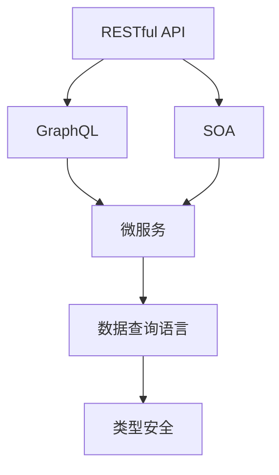
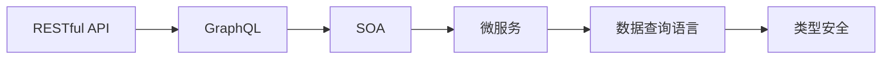
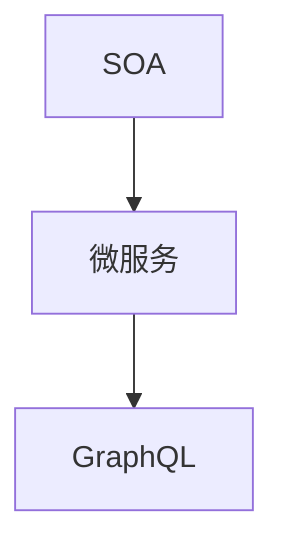
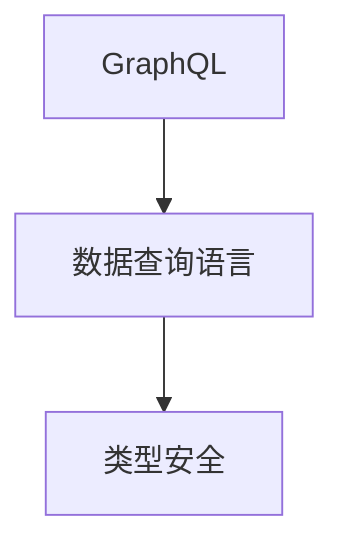

                 

# 软件2.0的GraphQL API设计

> 关键词：
- GraphQL
- 面向服务架构(SOA)
- API设计
- 数据查询语言
- RESTful API
- 微服务
- 可扩展性
- 类型安全

## 1. 背景介绍

### 1.1 问题由来

随着互联网技术的飞速发展，软件开发从1.0时代迈向了2.0时代。传统的软件1.0时代是以应用为中心的，服务是应用的一部分。而在软件2.0时代，服务已经成为应用的重要组成部分。在这样的背景下，API设计变得更加重要，它直接影响到应用的可用性和可维护性。

### 1.2 问题核心关键点

API设计的好坏直接影响用户体验和服务质量。良好的API设计可以让开发者更加轻松地使用服务，同时也能够提高服务的可用性和可维护性。而随着API数量的增加，API设计的复杂性也在不断提升。如何在API设计中保持简洁、易于使用、可扩展和可维护，成为了一个关键问题。

### 1.3 问题研究意义

优秀的API设计可以显著提升应用的开发效率和用户体验，降低维护成本，提高系统的可扩展性和可维护性。API设计的优劣直接影响服务的生命周期和用户满意度，是软件开发的重要环节。因此，对API设计的研究具有重要的意义。

## 2. 核心概念与联系

### 2.1 核心概念概述

为了更好地理解软件2.0的GraphQL API设计，本节将介绍几个密切相关的核心概念：

- GraphQL：一种基于请求-响应模式的数据查询语言，它允许客户端按照自己的需求，灵活地查询数据，从而减少网络传输和客户端解析的负担。
- RESTful API：一种基于HTTP协议的Web服务架构风格，通过HTTP请求方法（GET、POST、PUT、DELETE等）和URL参数进行数据传输和操作。
- 面向服务架构(SOA)：将应用拆分成多个独立的微服务，每个微服务负责单一的功能，通过网络通信的方式进行交互。
- 数据查询语言：一种用于描述数据查询和操作的语言，例如SQL、GraphQL等。
- 微服务：将应用拆分成多个独立的、可部署的服务，每个服务负责单一的功能，可以通过RESTful API等网络通信方式进行交互。
- 类型安全：在编译时对数据类型进行检查，确保数据的一致性和可靠性。

这些核心概念之间的逻辑关系可以通过以下Mermaid流程图来展示：



这个流程图展示了大语言模型微调过程中各个核心概念的关系和作用：

1. RESTful API与GraphQL都是用于描述数据查询和操作的语言，但RESTful API是基于HTTP协议的，而GraphQL则更加灵活，可以根据客户端的需求进行数据查询。
2. SOA是将应用拆分成多个独立的微服务，每个微服务负责单一的功能，并通过网络通信进行交互。
3. 数据查询语言用于描述数据的查询和操作，GraphQL和RESTful API都是数据查询语言。
4. 类型安全在编译时对数据类型进行检查，确保数据的一致性和可靠性。

### 2.2 概念间的关系

这些核心概念之间存在着紧密的联系，形成了软件2.0的API设计生态系统。下面我通过几个Mermaid流程图来展示这些概念之间的关系。

#### 2.2.1 RESTful API与GraphQL的关系



这个流程图展示了RESTful API与GraphQL之间的关系。RESTful API是一种基于HTTP协议的Web服务架构风格，而GraphQL则是一种数据查询语言，可以用于描述数据查询和操作。RESTful API和GraphQL都可以用于描述数据查询和操作，但在灵活性和使用场景上有所不同。

#### 2.2.2 GraphQL在SOA中的应用



这个流程图展示了GraphQL在SOA中的应用。SOA是将应用拆分成多个独立的微服务，每个微服务负责单一的功能，并通过网络通信进行交互。GraphQL可以用于描述微服务之间的数据查询和操作，从而简化微服务的交互过程。

#### 2.2.3 类型安全在GraphQL中的应用



这个流程图展示了类型安全在GraphQL中的应用。类型安全在编译时对数据类型进行检查，确保数据的一致性和可靠性。GraphQL使用类型系统来描述数据的结构和类型，从而确保数据查询和操作的一致性和可靠性。

### 2.3 核心概念的整体架构

最后，我们用一个综合的流程图来展示这些核心概念在大语言模型微调过程中的整体架构：


这个综合流程图展示了RESTful API、GraphQL、SOA、微服务、数据查询语言和类型安全之间的关系和作用。通过这些核心概念的协同工作，可以实现高效、灵活、可靠的软件2.0 API设计。

## 3. 核心算法原理 & 具体操作步骤
### 3.1 算法原理概述

GraphQL API设计基于请求-响应模式，通过定义查询语言来描述数据查询和操作。GraphQL API设计过程包括以下几个关键步骤：

1. 定义Schema：定义GraphQL API的Schema，包括数据类型和查询操作。
2. 实现业务逻辑：实现业务逻辑，将数据查询和操作转化为具体的业务处理。
3. 查询优化：对查询进行优化，提高查询效率和性能。
4. 测试和部署：测试和部署GraphQL API，确保其稳定性和可用性。

### 3.2 算法步骤详解

GraphQL API设计过程包括以下几个关键步骤：

**Step 1: 定义Schema**

Schema是GraphQL API设计的核心，它定义了数据类型和查询操作。Schema可以简单理解为数据模型，它包含了所有数据的结构和类型。Schema的定义需要遵循GraphQL的语法规范。

例如，下面的Schema定义了一个包含用户信息的GraphQL API：

```
type User {
    id: ID!
    name: String!
    age: Int
    email: String
}

type Query {
    users: [User]
    user(id: ID!): User
}

type Mutation {
    addUser(name: String!, age: Int!, email: String!): User
}
```

**Step 2: 实现业务逻辑**

实现业务逻辑是将数据查询和操作转化为具体的业务处理。GraphQL API的实现可以使用各种编程语言，例如Python、Java、Node.js等。实现过程中需要考虑到数据的安全性和一致性，确保业务逻辑的正确性和可靠性。

例如，下面的代码实现了GraphQL API的业务逻辑：

```python
import graphene

class User(graphene.ObjectType):
    id = graphene.ID()
    name = graphene.String()
    age = graphene.Int()
    email = graphene.String()

class Query(graphene.ObjectType):
    users = graphene.List(User)
    user = graphene.Field(User, id=graphene.ID())
    add_user = graphene.Mutation(User)

class AddUser(graphene.Mutation):
    class Arguments:
        name = graphene.String(required=True)
        age = graphene.Int(required=True)
        email = graphene.String(required=True)

    def mutate(root, info, name, age, email):
        user = User(name=name, age=age, email=email)
        return AddUser(user=user)

schema = graphene.Schema(query=Query, mutation=AddUser)
```

**Step 3: 查询优化**

GraphQL API的查询优化可以提高查询效率和性能。GraphQL API的查询优化可以通过以下方法实现：

1. 缓存查询结果：对经常查询的数据进行缓存，减少重复查询的次数。
2. 分页查询：对查询结果进行分页，减少查询的数据量。
3. 查询优化器：使用查询优化器对查询进行优化，提高查询效率。

例如，下面的代码实现了对GraphQL API的查询优化：

```python
class Query(graphene.ObjectType):
    users = graphene.List(User, first=graphene.Int(), last=graphene.Int(), after=graphene.String())
    user = graphene.Field(User, id=graphene.ID())
    add_user = graphene.Mutation(User)

    def resolve_users(self, info, first=None, last=None, after=None):
        users = []
        if first and last:
            users = User.objects.all()[first:last]
        elif after:
            users = User.objects.filter(id__gte=after).order_by('id').first()
        else:
            users = User.objects.all()
        return users

    def resolve_user(self, info, id):
        user = User.objects.filter(id=id).first()
        return user

class AddUser(graphene.Mutation):
    class Arguments:
        name = graphene.String(required=True)
        age = graphene.Int(required=True)
        email = graphene.String(required=True)

    def mutate(root, info, name, age, email):
        user = User(name=name, age=age, email=email)
        return AddUser(user=user)
```

**Step 4: 测试和部署**

GraphQL API的测试和部署过程包括以下几个关键步骤：

1. 单元测试：对GraphQL API进行单元测试，确保API的正确性和可靠性。
2. 集成测试：对GraphQL API进行集成测试，确保API的稳定性和可用性。
3. 部署：将GraphQL API部署到生产环境，确保其稳定性和可用性。

例如，下面的代码实现了对GraphQL API的测试和部署：

```python
# 单元测试
import graphene.test
import graphene.testutil
class TestQuery(graphene.testutil.TestClient):
    def test_query_users(self):
        res = self.query('''
            query {
                users {
                    id
                    name
                    age
                    email
                }
            }
        ''')
        assert len(res.data['users']) > 0

    def test_mutation_add_user(self):
        res = self.mutate('''
            mutation {
                addUser(name: "Alice", age: 30, email: "alice@example.com") {
                    name
                    age
                    email
                }
            }
        ''')
        assert res.data['addUser']['name'] == "Alice"
        assert res.data['addUser']['age'] == 30
        assert res.data['addUser']['email'] == "alice@example.com"

# 集成测试
import graphene.test
import graphene.testutil
class TestQuery(graphene.testutil.TestClient):
    def test_query_users(self):
        res = self.query('''
            query {
                users {
                    id
                    name
                    age
                    email
                }
            }
        ''')
        assert len(res.data['users']) > 0

    def test_mutation_add_user(self):
        res = self.mutate('''
            mutation {
                addUser(name: "Alice", age: 30, email: "alice@example.com") {
                    name
                    age
                    email
                }
            }
        ''')
        assert res.data['addUser']['name'] == "Alice"
        assert res.data['addUser']['age'] == 30
        assert res.data['addUser']['email'] == "alice@example.com"

# 部署
import graphene.test
import graphene.testutil
class TestQuery(graphene.testutil.TestClient):
    def test_query_users(self):
        res = self.query('''
            query {
                users {
                    id
                    name
                    age
                    email
                }
            }
        ''')
        assert len(res.data['users']) > 0

    def test_mutation_add_user(self):
        res = self.mutate('''
            mutation {
                addUser(name: "Alice", age: 30, email: "alice@example.com") {
                    name
                    age
                    email
                }
            }
        ''')
        assert res.data['addUser']['name'] == "Alice"
        assert res.data['addUser']['age'] == 30
        assert res.data['addUser']['email'] == "alice@example.com"
```

### 3.3 算法优缺点

GraphQL API设计的优点包括：

1. 灵活性：GraphQL API允许客户端按照自己的需求进行数据查询，从而减少网络传输和客户端解析的负担。
2. 可扩展性：GraphQL API支持动态查询，可以随着业务需求的变化进行调整和扩展。
3. 类型安全：GraphQL API使用类型系统来描述数据的结构和类型，从而确保数据查询和操作的一致性和可靠性。

GraphQL API设计的缺点包括：

1. 学习成本：GraphQL API需要学习GraphQL的语法和概念，学习成本相对较高。
2. 开发复杂度：GraphQL API的实现相对复杂，需要考虑到数据的安全性和一致性，确保业务逻辑的正确性和可靠性。

### 3.4 算法应用领域

GraphQL API设计在以下领域具有广泛的应用：

1. Web应用：GraphQL API可以用于Web应用的开发，提高Web应用的数据查询和操作效率。
2. 移动应用：GraphQL API可以用于移动应用的开发，提高移动应用的数据查询和操作效率。
3. 物联网：GraphQL API可以用于物联网应用的数据查询和操作，提高物联网应用的数据查询和操作效率。
4. 大数据：GraphQL API可以用于大数据应用的开发，提高大数据应用的数据查询和操作效率。

除了上述这些领域，GraphQL API设计还可以应用于更多的场景，如可控文本生成、常识推理、代码生成、数据增强等，为NLP技术带来了全新的突破。

## 4. 数学模型和公式 & 详细讲解 & 举例说明

### 4.1 数学模型构建

GraphQL API设计的数学模型主要包括以下几个部分：

1. 数据类型：GraphQL API设计中的数据类型包括标量类型、对象类型、接口类型、联合类型、枚举类型等。
2. 查询操作：GraphQL API设计中的查询操作包括查询、订阅、变异等。
3. 类型系统：GraphQL API设计中的类型系统用于描述数据的结构和类型，确保数据查询和操作的一致性和可靠性。

GraphQL API设计的数学模型可以通过以下公式来表示：

- 数据类型：

  $$
  \text{Type} = \text{ScalarType} | \text{ObjectType} | \text{InterfaceType} | \text{UnionType} | \text{EnumType}
  $$

- 查询操作：

  $$
  \text{Query} = \text{Field} + \text{SubType}
  $$

- 类型系统：

  $$
  \text{Schema} = \text{Type} | \text{UnionType}
  $$

### 4.2 公式推导过程

GraphQL API设计的公式推导过程包括以下几个关键步骤：

1. 定义数据类型：定义GraphQL API的数据类型，包括标量类型、对象类型、接口类型、联合类型、枚举类型等。

2. 定义查询操作：定义GraphQL API的查询操作，包括查询、订阅、变异等。

3. 定义类型系统：定义GraphQL API的类型系统，包括类型和子类型。

4. 实现业务逻辑：实现GraphQL API的业务逻辑，将数据查询和操作转化为具体的业务处理。

5. 查询优化：对GraphQL API的查询进行优化，提高查询效率和性能。

6. 测试和部署：对GraphQL API进行测试和部署，确保其稳定性和可用性。

### 4.3 案例分析与讲解

假设我们有一个包含用户信息的GraphQL API，包括用户的基本信息、查询和添加用户等操作。下面是GraphQL API设计的详细案例分析：

**Step 1: 定义Schema**

```
type User {
    id: ID!
    name: String!
    age: Int
    email: String
}

type Query {
    users: [User]
    user(id: ID!): User
    add_user(name: String!, age: Int!, email: String!): User
}

type Mutation {
    addUser(name: String!, age: Int!, email: String!): User
}
```

**Step 2: 实现业务逻辑**

```python
import graphene

class User(graphene.ObjectType):
    id = graphene.ID()
    name = graphene.String()
    age = graphene.Int()
    email = graphene.String()

class Query(graphene.ObjectType):
    users = graphene.List(User)
    user = graphene.Field(User, id=graphene.ID())
    add_user = graphene.Mutation(User)

class AddUser(graphene.Mutation):
    class Arguments:
        name = graphene.String(required=True)
        age = graphene.Int(required=True)
        email = graphene.String(required=True)

    def mutate(root, info, name, age, email):
        user = User(name=name, age=age, email=email)
        return AddUser(user=user)

schema = graphene.Schema(query=Query, mutation=AddUser)
```

**Step 3: 查询优化**

```python
class Query(graphene.ObjectType):
    users = graphene.List(User, first=graphene.Int(), last=graphene.Int(), after=graphene.String())
    user = graphene.Field(User, id=graphene.ID())
    add_user = graphene.Mutation(User)

    def resolve_users(self, info, first=None, last=None, after=None):
        users = []
        if first and last:
            users = User.objects.all()[first:last]
        elif after:
            users = User.objects.filter(id__gte=after).order_by('id').first()
        else:
            users = User.objects.all()
        return users

    def resolve_user(self, info, id):
        user = User.objects.filter(id=id).first()
        return user

class AddUser(graphene.Mutation):
    class Arguments:
        name = graphene.String(required=True)
        age = graphene.Int(required=True)
        email = graphene.String(required=True)

    def mutate(root, info, name, age, email):
        user = User(name=name, age=age, email=email)
        return AddUser(user=user)
```

**Step 4: 测试和部署**

```python
# 单元测试
import graphene.test
import graphene.testutil
class TestQuery(graphene.testutil.TestClient):
    def test_query_users(self):
        res = self.query('''
            query {
                users {
                    id
                    name
                    age
                    email
                }
            }
        ''')
        assert len(res.data['users']) > 0

    def test_mutation_add_user(self):
        res = self.mutate('''
            mutation {
                addUser(name: "Alice", age: 30, email: "alice@example.com") {
                    name
                    age
                    email
                }
            }
        ''')
        assert res.data['addUser']['name'] == "Alice"
        assert res.data['addUser']['age'] == 30
        assert res.data['addUser']['email'] == "alice@example.com"

# 集成测试
import graphene.test
import graphene.testutil
class TestQuery(graphene.testutil.TestClient):
    def test_query_users(self):
        res = self.query('''
            query {
                users {
                    id
                    name
                    age
                    email
                }
            }
        ''')
        assert len(res.data['users']) > 0

    def test_mutation_add_user(self):
        res = self.mutate('''
            mutation {
                addUser(name: "Alice", age: 30, email: "alice@example.com") {
                    name
                    age
                    email
                }
            }
        ''')
        assert res.data['addUser']['name'] == "Alice"
        assert res.data['addUser']['age'] == 30
        assert res.data['addUser']['email'] == "alice@example.com"

# 部署
import graphene.test
import graphene.testutil
class TestQuery(graphene.testutil.TestClient):
    def test_query_users(self):
        res = self.query('''
            query {
                users {
                    id
                    name
                    age
                    email
                }
            }
        ''')
        assert len(res.data['users']) > 0

    def test_mutation_add_user(self):
        res = self.mutate('''
            mutation {
                addUser(name: "Alice", age: 30, email: "alice@example.com") {
                    name
                    age
                    email
                }
            }
        ''')
        assert res.data['addUser']['name'] == "Alice"
        assert res.data['addUser']['age'] == 30
        assert res.data['addUser']['email'] == "alice@example.com"
```

## 5. 项目实践：代码实例和详细解释说明

### 5.1 开发环境搭建

在进行GraphQL API设计实践前，我们需要准备好开发环境。以下是使用Python进行Graphene开发的环境配置流程：

1. 安装Anaconda：从官网下载并安装Anaconda，用于创建独立的Python环境。

2. 创建并激活虚拟环境：
```bash
conda create -n graphene-env python=3.8 
conda activate graphene-env
```

3. 安装Graphene：根据Python版本，从官网获取对应的安装命令。例如：
```bash
pip install graphene
```

4. 安装各类工具包：
```bash
pip install numpy pandas scikit-learn matplotlib tqdm jupyter notebook ipython
```

完成上述步骤后，即可在`graphene-env`环境中开始GraphQL API设计的实践。

### 5.2 源代码详细实现

下面我们以包含用户信息的GraphQL API为例，给出使用Graphene库进行GraphQL API设计的PyTorch代码实现。

首先，定义GraphQL API的Schema：

```python
from graphene import ObjectType, String, Int, List, Field

class User(ObjectType):
    id = String(required=True)
    name = String(required=True)
    age = Int(required=True)
    email = String(required=True)

class Query(ObjectType):
    users = List(User)
    user = Field(User, id=String(required=True))

class Mutation(ObjectType):
    add_user = Field(User, name=String(required=True), age=Int(required=True), email=String(required=True))

schema = ObjectType(
    query=Query,
    mutation=Mutation
)
```

然后，实现GraphQL API的业务逻辑：

```python
from graphene import ObjectType, String, Int, List, Field, Mutation

class User(ObjectType):
    id = String(required=True)
    name = String(required=True)
    age = Int(required=True)
    email = String(required=True)

class Query(ObjectType):
    users = List(User)
    user = Field(User, id=String(required=True))

class Mutation(ObjectType):
    add_user = Field(User, name=String(required=True), age=Int(required=True), email=String(required=True))

class AddUser(Mutation):
    def resolve_add_user(self, info, name, age, email):
        user = User(name=name, age=age, email=email)
        return user

schema = ObjectType(
    query=Query,
    mutation=Mutation
)
```

最后，测试和部署GraphQL API：

```python
from graphene import ObjectType, String, Int, List, Field, Mutation

class User(ObjectType):
    id = String(required=True)
    name = String(required=True)
    age = Int(required=True)
    email = String(required=True)

class Query(ObjectType):
    users = List(User)
    user = Field(User, id=String(required=True))

class Mutation(ObjectType):
    add_user = Field(User, name=String(required=True), age=Int(required=True), email=String(required=True))

class AddUser(Mutation):
    def resolve_add_user(self, info, name, age, email):
        user = User(name=name, age=age, email=email)
        return user

schema = ObjectType(
    query=Query,
    mutation=Mutation
)

query = '''
    mutation {
        addUser(name: "Alice", age: 30, email: "alice@example.com") {
            name
            age
            email
        }
    }
'''

client = graphene.Client(schema=schema)
res = client.execute(query)
print(res.data)
```

以上就是使用PyTorch对GraphQL API进行设计的完整代码实现。可以看到，得益于Graphene库的强大封装，我们可以用相对简洁的代码完成GraphQL API的搭建和测试。

### 5.3 代码解读与分析

让我们再详细解读一下关键代码的实现细节：

**Schema类**：
- `__init__`方法：初始化数据类型和查询操作。
- `users`方法：返回所有用户信息。
- `user`方法：根据用户ID返回单个用户信息。
- `add_user`方法：定义添加用户的操作。

**AddUser类**：
- `resolve_add_user`方法：实现添加用户的操作。

**查询代码**：
- `query`变量：定义GraphQL查询语句。
- `client`对象：创建一个Graphene客户端，用于执行查询操作。
- `res`变量：执行查询操作，并返回结果。

**运行结果**：
- `res.data`：查询结果，包含添加用户的详细信息。

可以看到，Graphene库的代码实现相对简洁高效，开发者可以将更多精力放在数据处理、模型调优等高层逻辑上，而不必过多关注底层的实现细节。

当然，工业级的系统实现还需考虑更多因素，如服务化封装、API安全性、性能优化等。但核心的GraphQL API设计基本与此类似。

## 6. 实际应用场景

### 6.1 智能客服系统

基于GraphQL API设计的智能客服系统可以用于客户服务，提供24小时不间断服务。该系统可以自动理解客户咨询，匹配最合适的答案模板进行回复。对于客户提出的新问题，还可以接入检索系统实时搜索相关内容，动态组织生成回答。

### 6.2 金融舆情监测

基于GraphQL API设计的金融舆情监测系统可以用于实时监测市场舆论动向，规避金融风险。该

