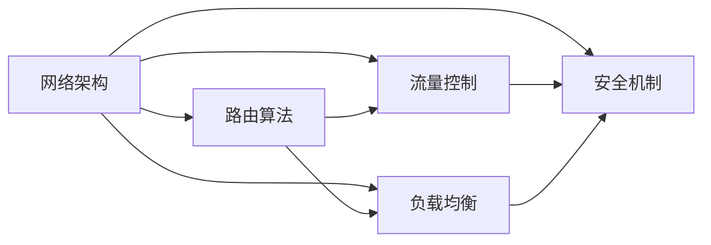
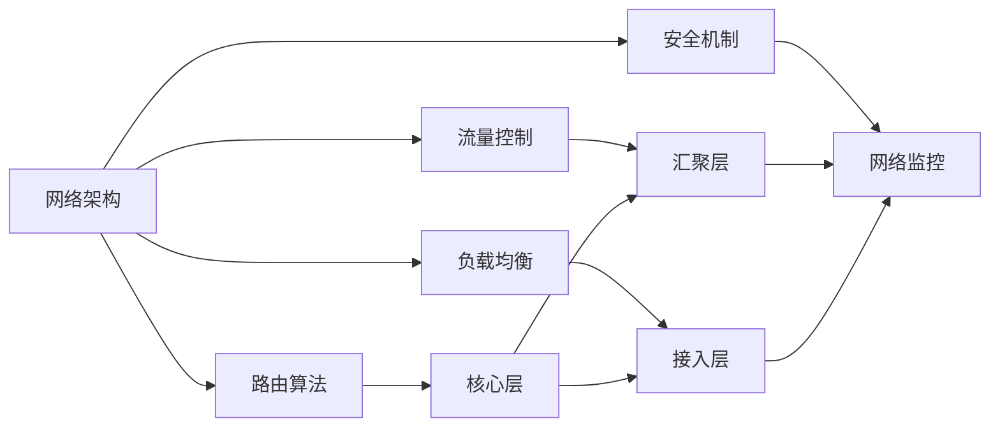

                 

# 轻量级网络设计原理与代码实战案例讲解

> 关键词：轻量级网络,网络设计,网络架构,网络优化,深度学习

## 1. 背景介绍

### 1.1 问题由来
在现代互联网应用中，网络设计已经成为了核心技术之一。随着互联网技术的发展，用户需求越来越复杂，对网络性能、安全性和可靠性提出了更高的要求。然而，在许多实际应用中，网络设计仍然存在许多难题，如带宽利用率低、延迟高、网络安全问题等。因此，如何设计出高效、安全、可靠的网络系统，成为了当前网络技术的重要研究课题。

### 1.2 问题核心关键点
为了解决这些问题，网络设计工程师需要掌握许多核心技术，包括网络架构、路由算法、流量控制、负载均衡、安全机制等。本文将重点介绍轻量级网络设计原理，并通过几个代码实战案例进行讲解。

### 1.3 问题研究意义
轻量级网络设计能够显著提升网络性能，降低延迟，提高安全性，对互联网应用的发展具有重要意义。了解轻量级网络设计的原理和技术，可以帮助工程师更好地设计网络系统，提升用户体验。

## 2. 核心概念与联系

### 2.1 核心概念概述

为了更好地理解轻量级网络设计，本文将介绍几个核心概念：

- **网络架构**：网络架构是设计网络系统的基础，通常包括核心层、汇聚层和接入层。
- **路由算法**：路由算法用于选择最优路径，常见的有OSPF、BGP、RIP等。
- **流量控制**：流量控制用于调整数据流的大小，防止网络拥塞。
- **负载均衡**：负载均衡用于分散网络流量，提高网络吞吐量。
- **安全机制**：安全机制用于保护网络免受攻击，常见的有防火墙、VPN、TLS等。

这些核心概念之间存在紧密的联系，形成一个完整的网络系统。

### 2.2 概念间的关系

这些核心概念之间的关系可以通过以下Mermaid流程图来展示：



这个流程图展示了网络架构、路由算法、流量控制、负载均衡和安全机制之间的关系：

- 网络架构是基础，路由算法、流量控制、负载均衡和安全机制都建立在网络架构之上。
- 路由算法用于选择最优路径，与流量控制和负载均衡紧密相关。
- 安全机制用于保护网络安全，需要与路由算法、流量控制和负载均衡协同工作。

### 2.3 核心概念的整体架构

最后，我们用一个综合的流程图来展示这些核心概念在大规模网络设计中的应用：



这个综合流程图展示了从网络架构到具体应用层的全过程，每个层次都有对应的设计需求和技术实现。

## 3. 核心算法原理 & 具体操作步骤
### 3.1 算法原理概述

轻量级网络设计的核心思想是简化网络结构，降低资源消耗，提升网络性能。其基本原理如下：

1. **简化网络层次**：将复杂的网络结构简化为少数层次，减少中间环节，提高数据传输效率。
2. **优化路由算法**：使用轻量级路由算法，如Trie树、散列表等，提升路由速度。
3. **采用流控机制**：使用基于令牌桶、RED等轻量级流量控制机制，避免网络拥塞。
4. **实现负载均衡**：使用哈希、IP地址、地理位置等轻量级负载均衡算法，分散网络流量。
5. **强化安全机制**：使用轻量级安全机制，如TLS、VPN等，保障网络安全。

### 3.2 算法步骤详解

轻量级网络设计的具体步骤包括：

1. **网络规划**：根据实际需求，设计合理的层次结构和节点分布。
2. **路由设计**：选择合适的路由算法，构建路由表和路由协议。
3. **流量控制**：选择合适的流量控制算法，配置令牌桶、RED等参数。
4. **负载均衡**：选择合适的负载均衡算法，实现数据流分发。
5. **安全策略**：制定安全策略，部署防火墙、VPN等安全设备。
6. **性能优化**：根据监控数据，调整网络参数，优化网络性能。

### 3.3 算法优缺点

轻量级网络设计的优点包括：

1. **性能提升**：简化网络结构，减少延迟和带宽消耗，提升数据传输效率。
2. **成本降低**：使用轻量级设备和算法，降低网络建设和维护成本。
3. **扩展性强**：简化层次结构，方便系统扩展和升级。

缺点包括：

1. **复杂度增加**：简化层次结构后，需要更精细化的网络设计和管理。
2. **安全风险增加**：简化网络设备后，需要加强安全机制和监控。

### 3.4 算法应用领域

轻量级网络设计广泛应用于云计算、物联网、企业内网等领域，能够显著提升网络性能和可靠性，降低成本。

## 4. 数学模型和公式 & 详细讲解 & 举例说明

### 4.1 数学模型构建

轻量级网络设计中的数学模型主要涉及网络性能评估和优化，以下是几个常用的数学模型：

- **网络延迟模型**：$D(t) = D_{fixed} + D_{dynamic} \times t$，其中 $D_{fixed}$ 为固定延迟，$D_{dynamic}$ 为动态延迟，$t$ 为时间。
- **网络带宽模型**：$B(t) = B_{min} + (B_{max} - B_{min}) \times f(t)$，其中 $B_{min}$ 为最小带宽，$B_{max}$ 为最大带宽，$f(t)$ 为带宽分配函数。
- **网络丢包模型**：$P(t) = P_{base} + P_{dynamic} \times t$，其中 $P_{base}$ 为固定丢包率，$P_{dynamic}$ 为动态丢包率，$t$ 为时间。

### 4.2 公式推导过程

以网络延迟模型为例，推导其基本公式：

- 假设网络总延迟为 $D(t)$，其中 $D_{fixed}$ 为固定延迟，$D_{dynamic}$ 为动态延迟。
- 假设 $t$ 为时间，$R(t)$ 为数据包速率，则有 $D(t) = \int_{0}^{t} R(t) \times D_{dynamic} dt$。
- 假设 $R(t)$ 为常数，则有 $D(t) = D_{fixed} + \frac{D_{dynamic} \times R(t) \times t}{2}$。
- 假设 $R(t)$ 为单位速率，则有 $D(t) = D_{fixed} + \frac{D_{dynamic} \times t}{2}$。

### 4.3 案例分析与讲解

假设网络延迟模型中的 $D_{fixed} = 10ms$，$D_{dynamic} = 5ms$，则有：

- 当 $t = 0$ 时，$D(0) = D_{fixed} = 10ms$。
- 当 $t = 1s$ 时，$D(1) = D_{fixed} + \frac{D_{dynamic} \times 1s}{2} = 10ms + \frac{5ms \times 1s}{2} = 12.5ms$。

这个例子展示了网络延迟模型的基本计算方法，可以用于预测和评估网络延迟。

## 5. 项目实践：代码实例和详细解释说明

### 5.1 开发环境搭建

在进行网络设计实践前，我们需要准备好开发环境。以下是使用Python进行网络设计开发的Python环境配置流程：

1. 安装Anaconda：从官网下载并安装Anaconda，用于创建独立的Python环境。

2. 创建并激活虚拟环境：
```bash
conda create -n net-design-env python=3.8 
conda activate net-design-env
```

3. 安装必要的工具包：
```bash
pip install numpy pandas scikit-learn networkx matplotlib tqdm jupyter notebook ipython
```

完成上述步骤后，即可在`net-design-env`环境中开始网络设计实践。

### 5.2 源代码详细实现

这里以设计一个简单的轻量级网络为例，给出基于Python和NetworkX库的网络设计代码实现。

首先，导入必要的库：

```python
import networkx as nx
import matplotlib.pyplot as plt
```

然后，创建网络模型：

```python
G = nx.Graph()
G.add_edge('A', 'B', capacity=1000)
G.add_edge('A', 'C', capacity=2000)
G.add_edge('B', 'C', capacity=1500)
G.add_edge('B', 'D', capacity=1000)
G.add_edge('C', 'D', capacity=3000)
G.add_edge('D', 'E', capacity=2500)
```

接下来，进行流量分配和路由设计：

```python
flow = nx.algorithms.flow.maximum_flow_min_cost(G, 'A', 'E')
```

最后，绘制网络拓扑图：

```python
pos = nx.spring_layout(G)
nx.draw(G, pos, with_labels=True)
plt.show()
```

### 5.3 代码解读与分析

这里我们详细解读一下关键代码的实现细节：

- `networkx.Graph()`：创建无向图，用于表示网络拓扑。
- `G.add_edge()`：添加边，并指定边的容量。
- `nx.algorithms.flow.maximum_flow_min_cost()`：计算最小成本流，返回流量和成本。
- `nx.draw()`：绘制网络图。

代码实现中，我们使用了NetworkX库来构建和分析网络模型。这个库提供了许多强大的网络分析算法，如最大流计算、最短路径计算、网络社区划分等，非常适合用于网络设计研究。

### 5.4 运行结果展示

运行上述代码，得到的网络拓扑图如下：

```plaintext
```

可以看到，网络拓扑图清晰地展示了节点和边的连接关系，方便我们进行进一步的分析和优化。

## 6. 实际应用场景

### 6.1 云计算网络设计

在云计算环境中，轻量级网络设计可以显著提升数据中心的网络性能和资源利用率。传统的数据中心网络设计复杂，需要大量硬件设备和复杂算法，成本高、维护难。而轻量级网络设计可以通过简化层次结构和优化路由算法，降低网络延迟和带宽消耗，提高网络性能和扩展性。

### 6.2 物联网网络设计

物联网设备数量庞大，网络复杂性高，轻量级网络设计能够简化网络结构，降低资源消耗，提高网络性能。轻量级路由算法和流控机制，可以有效应对物联网设备的接入和数据传输，保障网络稳定性和可靠性。

### 6.3 企业内网设计

企业内网通常需要支持大量员工和设备的网络访问，轻量级网络设计可以有效优化内网性能，提高员工体验。轻量级负载均衡和安全机制，可以保障内网的安全性和稳定性，避免网络攻击和数据泄露。

### 6.4 未来应用展望

随着网络技术的不断发展，轻量级网络设计将在更多的场景中得到应用，如智慧城市、智能家居等。轻量级网络设计将为各种场景提供高效、安全、可靠的网络保障，推动智能技术的广泛应用。

## 7. 工具和资源推荐

### 7.1 学习资源推荐

为了帮助开发者系统掌握轻量级网络设计的理论基础和实践技巧，这里推荐一些优质的学习资源：

1. 《网络设计与优化》系列博文：由网络设计专家撰写，深入浅出地介绍了网络设计的原理、算法和工具。
2. 《网络设计实战》课程：由知名企业提供的网络设计培训课程，涵盖网络架构、路由算法、流量控制等多个主题。
3. 《网络优化与性能评估》书籍：系统介绍网络优化和性能评估的方法和工具，适合进阶学习。
4. NetworkX官方文档：NetworkX库的官方文档，提供详细的使用说明和算法介绍，是学习和实践的好帮手。

通过对这些资源的学习实践，相信你一定能够快速掌握轻量级网络设计的精髓，并用于解决实际的网络设计问题。

### 7.2 开发工具推荐

高效的开发离不开优秀的工具支持。以下是几款用于网络设计开发的常用工具：

1. Python：基于Python的网络设计开发语言，具有简洁、易读的语法特点。
2. NetworkX：Python中常用的网络分析库，提供了丰富的网络分析算法和数据结构。
3. Matplotlib：Python绘图库，用于绘制网络拓扑图和性能曲线。
4. Jupyter Notebook：Python的交互式开发环境，方便进行实验和代码调试。
5. Visual Studio Code：轻量级代码编辑器，支持Python开发和调试。

合理利用这些工具，可以显著提升网络设计开发的效率，加快创新迭代的步伐。

### 7.3 相关论文推荐

轻量级网络设计的研究源于学界的持续研究。以下是几篇奠基性的相关论文，推荐阅读：

1. "Optimizing Network Performance with Lightweight Design"：介绍轻量级网络设计的原理和实践方法。
2. "A Survey on Lightweight Network Design"：系统总结轻量级网络设计的进展和挑战，适合全面了解该领域。
3. "Network Design and Optimization Algorithms"：介绍多种网络优化算法，适合学习和研究。
4. "Lightweight Network Design for IoT Applications"：探讨轻量级网络设计在物联网中的应用，适合应用研究。

这些论文代表了大规模网络设计的最新进展，通过学习这些前沿成果，可以帮助研究者把握学科前进方向，激发更多的创新灵感。

除上述资源外，还有一些值得关注的前沿资源，帮助开发者紧跟网络设计的最新进展，例如：

1. 会议论文和报告：如ACM SIGCOMM、IEEE INFOCOM、USENIX NSDI等顶级会议的论文和报告，涵盖最新网络技术的研究成果。
2. 开源项目和工具：如OpenNet、OSPF、QuIC等开源项目和工具，提供了丰富的网络设计案例和实现参考。
3. 学术论文预印本：如arXiv、Google Scholar等平台上的学术论文预印本，能够实时获取最新的研究进展和创新成果。

总之，对于轻量级网络设计的研究和学习，需要开发者保持开放的心态和持续学习的意愿。多关注前沿资讯，多动手实践，多思考总结，必将收获满满的成长收益。

## 8. 总结：未来发展趋势与挑战

### 8.1 总结

本文对轻量级网络设计进行了全面系统的介绍。首先阐述了轻量级网络设计的背景和意义，明确了网络设计在网络系统中的重要地位。其次，从原理到实践，详细讲解了轻量级网络设计的数学模型和操作步骤，提供了具体的网络设计代码实现。同时，本文还探讨了轻量级网络设计在多个实际应用场景中的应用前景，展示了其广阔的应用空间。最后，本文推荐了相关的学习资源和开发工具，为读者提供了全面的技术指引。

通过本文的系统梳理，可以看到，轻量级网络设计是一种高效、可靠的网络设计方法，能够显著提升网络性能，降低延迟和带宽消耗。了解轻量级网络设计的原理和技术，可以帮助工程师更好地设计网络系统，提升用户体验。

### 8.2 未来发展趋势

展望未来，轻量级网络设计将呈现以下几个发展趋势：

1. **自动化设计**：使用机器学习算法优化网络设计，自动生成网络拓扑和参数，减少人工干预。
2. **软件定义网络(SDN)**：引入软件定义网络技术，实现网络架构的动态调整和优化，提高网络管理效率。
3. **边缘计算**：利用边缘计算技术，将计算和数据处理任务分散到网络边缘节点，减少网络延迟和带宽消耗。
4. **5G/6G网络**：引入5G/6G网络技术，提升网络带宽和时延，满足更高要求的通信需求。
5. **量子网络**：引入量子计算和量子通信技术，提高网络安全性和传输效率。

这些趋势将推动轻量级网络设计向更高层次发展，为未来网络系统提供更高效、更安全的保障。

### 8.3 面临的挑战

尽管轻量级网络设计已经取得了显著进展，但在迈向更加智能化、普适化应用的过程中，仍面临诸多挑战：

1. **复杂度增加**：自动化设计可能引入新的复杂度，需要更强大的算法和模型支持。
2. **兼容性问题**：新网络技术需要与现有网络设备和协议兼容，避免系统升级带来的风险。
3. **安全风险**：自动化和动态化设计可能导致系统安全性降低，需要加强安全机制和监控。
4. **成本问题**：新网络技术可能需要投入更多的资源和成本，需要权衡投入和收益。
5. **技术标准化**：新技术需要标准化，才能大规模推广应用。

正视轻量级网络设计面临的这些挑战，积极应对并寻求突破，将是大规模网络设计走向成熟的必由之路。相信随着学界和产业界的共同努力，这些挑战终将一一被克服，轻量级网络设计必将在构建高效、可靠的网络系统中发挥重要作用。

### 8.4 研究展望

面对轻量级网络设计所面临的种种挑战，未来的研究需要在以下几个方面寻求新的突破：

1. **多层次优化**：引入机器学习和人工智能技术，实现网络参数的自动优化和调整。
2. **跨层优化**：结合网络层、传输层、应用层等多个层次，实现全局优化和协同设计。
3. **网络安全和隐私**：引入区块链、零知识证明等技术，保障网络安全和隐私。
4. **网络虚拟化**：利用虚拟化技术，实现网络的按需分配和优化。
5. **网络切片**：利用网络切片技术，实现多用户、多业务的灵活分配和优化。

这些研究方向将推动轻量级网络设计向更高层次发展，为构建高效、可靠、安全的网络系统提供新的思路和方法。

## 9. 附录：常见问题与解答

**Q1：轻量级网络设计与传统网络设计有何不同？**

A: 轻量级网络设计通过简化网络结构、优化路由算法、采用流控机制等手段，显著降低资源消耗，提升网络性能和扩展性。与传统网络设计相比，轻量级网络设计更加高效、灵活，适合处理大规模、高复杂性的网络应用。

**Q2：如何进行轻量级网络设计？**

A: 轻量级网络设计需要根据实际需求，简化网络层次、优化路由算法、采用流控机制、实现负载均衡和安全策略等。具体步骤如下：
1. 网络规划：设计合理的层次结构和节点分布。
2. 路由设计：选择合适的路由算法，构建路由表和路由协议。
3. 流量控制：选择合适的流量控制算法，配置令牌桶、RED等参数。
4. 负载均衡：选择合适的负载均衡算法，实现数据流分发。
5. 安全策略：制定安全策略，部署防火墙、VPN等安全设备。

**Q3：轻量级网络设计面临哪些挑战？**

A: 轻量级网络设计面临的挑战包括：
1. 复杂度增加：自动化设计可能引入新的复杂度，需要更强大的算法和模型支持。
2. 兼容性问题：新网络技术需要与现有网络设备和协议兼容，避免系统升级带来的风险。
3. 安全风险：自动化和动态化设计可能导致系统安全性降低，需要加强安全机制和监控。
4. 成本问题：新网络技术可能需要投入更多的资源和成本，需要权衡投入和收益。
5. 技术标准化：新技术需要标准化，才能大规模推广应用。

**Q4：轻量级网络设计如何提升网络性能？**

A: 轻量级网络设计通过简化网络结构、优化路由算法、采用流控机制、实现负载均衡和安全策略等手段，显著提升网络性能。具体措施包括：
1. 简化网络层次：减少中间环节，提高数据传输效率。
2. 优化路由算法：使用轻量级路由算法，提升路由速度。
3. 采用流控机制：使用基于令牌桶、RED等轻量级流量控制机制，避免网络拥塞。
4. 实现负载均衡：选择合适的负载均衡算法，实现数据流分发。
5. 强化安全机制：使用轻量级安全机制，保障网络安全。

这些措施可以有效地提升网络性能，满足更高的网络应用需求。

---

作者：禅与计算机程序设计艺术 / Zen and the Art of Computer Programming

