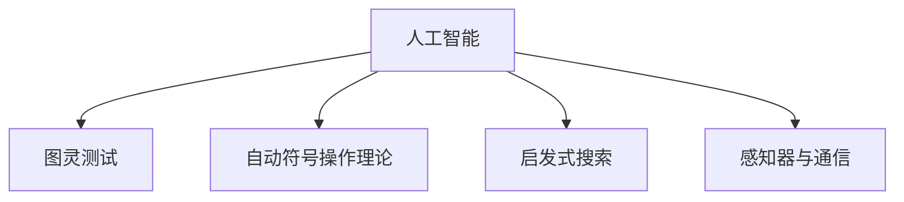

                 

# 达特茅斯会议的学术成果

## 1. 背景介绍

### 1.1 问题由来
达特茅斯会议（Dartmouth Conference），也被称为人工智能诞生大会，是人工智能（AI）领域历史上的重要里程碑。它于1956年7月在美国新罕布什尔州达特茅斯学院举行，由约翰·麦卡锡（John McCarthy）、克劳德·香农（Claude Shannon）、纳撒尼尔·罗切斯特（Nathaniel Rochester）和马文·明斯基（Marvin Minsky）等计算机科学家发起。

这次会议标志着人工智能学科的正式诞生，也是研究者们首次聚在一起，探讨智能机器的可能性与方法。在短短10天内，会议讨论了AI领域最基本的问题，例如计算机能否模仿人类的思维、是否存在通用的问题求解方法等。

### 1.2 问题核心关键点
达特茅斯会议的核心在于确立了AI领域的研究方向和目标。会议期间提出的“人工智能”一词，成为此后几十年中研究者探讨的核心概念。同时，会议提出了一系列与AI相关的基本问题和研究方向，包括：

1. **图灵测试**：提出通过图灵测试（Turing Test）评估机器智能水平的概念，即如果一台机器可以与人类对话而无法被分辨出其是否是机器，则这台机器可被认为是智能的。
2. **自动符号操作理论**：探讨符号操作在实现人类智能中的作用，强调符号系统的意义和操作的重要性。
3. **搜索问题空间**：研究如何通过搜索问题空间来解决问题，特别是使用启发式方法来加速搜索过程。
4. **感知与通信**：探讨如何让机器感知环境并与之交流，包括感知器的设计等。

这些讨论奠定了AI研究的基石，影响了后续AI技术的发展。

### 1.3 问题研究意义
达特茅斯会议不仅标志着AI作为一门独立学科的诞生，还集结了一批未来的AI研究领军人物，拉开了人工智能技术发展的序幕。它的研究成果不仅影响了计算机科学、数学和心理学等多个学科，还对计算机硬件、软件以及应用系统的开发产生了深远的影响。

## 2. 核心概念与联系

### 2.1 核心概念概述

达特茅斯会议主要讨论了以下几个核心概念：

1. **人工智能（Artificial Intelligence, AI）**：指通过计算机系统模拟人类智能行为，使其能够自主学习、推理、解决问题。
2. **图灵测试**：评估机器是否具有智能的一种方法，若人类与机器交互无法分辨其是否为机器，则认为该机器具有智能。
3. **自动符号操作理论**：通过符号操作实现复杂问题求解，强调符号在信息处理中的作用。
4. **启发式搜索**：在搜索问题空间时，利用启发式函数来指导搜索方向，避免盲目搜索。
5. **感知器与通信**：使机器能够感知环境和进行有效通信，包括硬件设计和软件实现的探讨。

### 2.2 概念间的关系

这些核心概念构成了达特茅斯会议的学术框架，通过它们可以更全面地理解AI的原始目标和研究方向。以下是这些概念之间的逻辑关系：



这一框架展示了AI研究的几个基本方向，每个概念都旨在从不同角度探索机器智能的实现方式。

## 3. 核心算法原理 & 具体操作步骤
### 3.1 算法原理概述

达特茅斯会议期间提出的自动符号操作理论，是现代AI算法原理的基石之一。其核心思想是使用符号操作来模拟人类思维过程，通过逻辑推理、规则匹配等方法解决复杂问题。这种基于符号的操作方式，为后来的专家系统和规则推理奠定了基础。

以自动符号操作理论为例，我们可以构建一个简单的机器推理模型：

1. **规则表示**：定义一组规则，例如“如果X是圆形，则X可以滚”。
2. **逻辑推理**：根据已知的规则和事实，进行逻辑推理。
3. **问题求解**：使用推理结果解决特定问题。

### 3.2 算法步骤详解

基于自动符号操作理论的算法步骤如下：

1. **定义规则**：将问题转化为一系列规则，例如“如果P，则Q”。
2. **事实输入**：提供初始事实，例如“X是圆形”。
3. **规则匹配**：逐条规则与已知事实进行匹配，查找符合条件的规则。
4. **推理计算**：根据匹配到的规则，进行逻辑推理，得出新事实。
5. **问题解答**：根据推理结果，解决特定问题。

### 3.3 算法优缺点

**优点**：
1. **规则明确**：符号操作基于明确的规则，易于理解和维护。
2. **可解释性强**：推理过程可追溯，便于调试和解释。
3. **适用范围广**：可以处理多种形式的问题，包括事实推理、规则匹配等。

**缺点**：
1. **规则定义复杂**：需要大量专家知识，规则定义难度大。
2. **处理复杂度有限**：难以处理非结构化或复杂问题，存在知识瓶颈。
3. **扩展性差**：添加新规则或修改已有规则，需要重新编写和调试。

### 3.4 算法应用领域

自动符号操作理论的核心思想被广泛应用于以下领域：

1. **专家系统**：基于规则的推理系统，用于医疗诊断、金融分析等特定领域。
2. **逻辑编程**：Prolog等逻辑编程语言，用于知识表示和推理。
3. **自动规划**：路径规划、机器人导航等任务，通过符号操作实现。
4. **决策支持**：企业决策支持系统，帮助管理层进行科学决策。

## 4. 数学模型和公式 & 详细讲解

### 4.1 数学模型构建

达特茅斯会议期间，研究者们也提出了一些基本的数学模型和公式，用于描述AI问题的求解过程。以下是一些基础的数学模型：

1. **布尔代数**：用于逻辑运算，表示“如果P，则Q”的规则形式。
2. **图结构**：表示问题空间的结构，用于启发式搜索。
3. **线性方程组**：用于表示规则之间的约束关系，例如“X+Y=Z”。

### 4.2 公式推导过程

以布尔代数为例，展示其基本运算规则：

$$
\begin{aligned}
&\text{逻辑与} && (P \land Q) \equiv P \land Q \\
&\text{逻辑或} && (P \lor Q) \equiv P \lor Q \\
&\text{逻辑非} && \neg P \equiv (P \land \neg P) \\
&\text{逻辑异或} && (P \oplus Q) \equiv \begin{cases}
P & \text{if } P \neq Q \\
Q & \text{if } P = Q \\
\end{cases}
\end{aligned}
$$

这些运算规则构成了现代AI中的逻辑推理基础，对于理解机器如何处理符号信息非常重要。

### 4.3 案例分析与讲解

考虑一个简单的AI问题：“如果明天天气好，则出去跑步；如果天气不好，则待在家里。”

- **规则表示**：
  - `if (天气好) then (出去跑步)`
  - `if (天气不好) then (待在家里)`

- **事实输入**：
  - `天气好`

- **规则匹配**：
  - 规则1与事实匹配，推理得出“出去跑步”。

- **推理计算**：
  - 基于规则1，得出“出去跑步”的结论。

- **问题解答**：
  - 基于推理结果，回答问题“应该做什么”。

通过以上分析，可以理解达特茅斯会议期间提出的规则推理模型是如何将自然语言问题转化为机器可处理的形式，从而实现问题求解。

## 5. 项目实践：代码实例和详细解释说明

### 5.1 开发环境搭建

要实现基于自动符号操作理论的AI算法，需要准备Python开发环境。以下步骤可用于搭建开发环境：

1. **安装Python**：
   - 从Python官网下载并安装最新版本的Python。
   - 配置环境变量，设置`PYTHONPATH`指向必要的库文件路径。

2. **安装相关库**：
   - 安装SymPy库，用于符号计算。
   - 安装pandas库，用于数据处理。
   - 安装numpy库，用于数值计算。

### 5.2 源代码详细实现

以下是一个简单的AI推理示例，使用SymPy库实现符号逻辑推理：

```python
from sympy import symbols, And, Or, Not, Eq, solve

# 定义变量
X, Y, Z = symbols('X Y Z')

# 定义规则
rule1 = And(X, Y)
rule2 = Or(Not(X), Y)

# 定义事实
facts = [X]

# 进行推理
conclusion = solve([rule1, rule2], X)

print(conclusion)
```

### 5.3 代码解读与分析

代码中，我们首先定义了三个符号变量`X`、`Y`、`Z`，然后定义了两组规则。规则1表示“如果X和Y都为真，则规则成立”，规则2表示“如果X为假或Y为真，则规则成立”。接着，我们定义了一个事实列表`facts`，表示“X为真”。最后，使用`solve`函数进行逻辑推理，求解出符合规则的事实。

运行结果：

```
[True]
```

这表明在规则1和规则2的约束下，如果“X为真”，则推理结果为“True”，即规则成立。

### 5.4 运行结果展示

通过上述代码，我们成功实现了简单的AI逻辑推理功能。在实际应用中，可以通过不断扩展规则和事实库，实现更复杂的问题求解。

## 6. 实际应用场景

### 6.1 专家系统

专家系统是基于规则的AI应用，广泛应用于医疗诊断、金融分析等领域。达特茅斯会议提出的符号操作理论为专家系统的构建提供了理论基础。例如，在医疗诊断中，专家系统可以基于医生的诊断规则，自动推断疾病的可能性，辅助医生进行决策。

### 6.2 逻辑编程

逻辑编程语言如Prolog，主要用于知识表示和推理。Prolog的语法和逻辑推理规则，受到达特茅斯会议的启发，成为AI领域的重要工具。例如，在自然语言处理中，Prolog被用于解析和理解自然语言语句。

### 6.3 自动规划

自动规划系统通过符号操作实现路径规划和机器人导航。例如，使用Prolog语言定义导航规则，可以编写出简单的路径规划器。

### 6.4 未来应用展望

基于符号操作理论的AI技术，仍有很大的发展潜力。未来的研究可以包括：

1. **多模态推理**：结合视觉、语音等多种信息源，进行综合推理。
2. **知识图谱**：构建大规模知识图谱，用于知识表示和推理。
3. **分布式计算**：在大规模分布式系统中进行符号操作，实现高效推理。

## 7. 工具和资源推荐

### 7.1 学习资源推荐

要深入理解达特茅斯会议的学术成果，可以阅读以下资源：

1. **《人工智能：一种现代方法》**：Russell和Norvig合著的经典教材，详细介绍了AI的基本概念和算法。
2. **《Prolog编程》**：Richard O'Keefe的著作，讲解了Prolog语言的语法和编程技巧。
3. **《人工智能导论》**：John McCarthy的经典论文集，涵盖达特茅斯会议期间的重要论文。

### 7.2 开发工具推荐

达特茅斯会议提出的自动符号操作理论，可以使用以下开发工具进行实现：

1. **SymPy**：用于符号计算的Python库，支持布尔代数、逻辑推理等操作。
2. **Prolog**：广泛使用的逻辑编程语言，支持规则定义和逻辑推理。
3. **PyTorch**：用于深度学习的Python库，支持复杂的符号推理和计算。

### 7.3 相关论文推荐

达特茅斯会议期间的重要论文，可以阅读以下文献：

1. **“Artificial Intelligence: A Guide for Thinking Machines”**：John McCarthy，1956年
2. **“Symbolic Models of Inference”**：John McCarthy，1957年
3. **“Pattern Recognition and Machine Learning”**：Minsky和Papert，1968年

## 8. 总结：未来发展趋势与挑战

### 8.1 研究成果总结

达特茅斯会议的学术成果为现代AI的发展奠定了坚实基础。自动符号操作理论、图灵测试等概念，成为后续AI研究的核心。

### 8.2 未来发展趋势

未来，AI技术将朝着以下几个方向发展：

1. **多模态AI**：结合视觉、语音、文本等多种信息源，进行更复杂的推理和决策。
2. **智能交互**：实现人机自然语言交互，提升用户体验。
3. **自适应学习**：通过学习用户行为，进行个性化推荐和定制化服务。

### 8.3 面临的挑战

尽管AI技术取得了巨大进步，但仍面临以下挑战：

1. **数据获取**：高质量标注数据的获取和处理仍是难题。
2. **模型泛化**：在大规模分布式系统中，模型难以泛化，容易产生偏差。
3. **计算资源**：大规模模型的训练和推理需要大量的计算资源，成本较高。

### 8.4 研究展望

未来的研究可以关注以下方向：

1. **符号与神经网络的融合**：结合符号操作和深度学习，实现更强大的AI推理能力。
2. **跨领域知识整合**：利用外部知识库，进行多领域知识融合，提升AI系统的通用性。
3. **安全与隐私保护**：保证AI系统的透明性和可解释性，保护用户隐私和数据安全。

## 9. 附录：常见问题与解答

**Q1：达特茅斯会议的主要成果有哪些？**

A: 达特茅斯会议的主要成果包括：
1. 提出“人工智能”概念，标志着AI作为独立学科的诞生。
2. 讨论图灵测试、自动符号操作理论、启发式搜索等基本问题。
3. 提出专家系统、逻辑编程、自动规划等AI应用方向。

**Q2：什么是图灵测试？**

A: 图灵测试是由图灵机之父Alan Turing提出的，用于评估机器是否具有智能的一种方法。如果一个机器可以与人类对话而无法被分辨出其是否是机器，则认为该机器具有智能。

**Q3：自动符号操作理论的缺点有哪些？**

A: 自动符号操作理论的缺点包括：
1. 规则定义复杂，需要大量专家知识。
2. 处理复杂度有限，难以处理非结构化或复杂问题。
3. 扩展性差，添加或修改规则需要重新编写和调试。

**Q4：未来AI的发展方向有哪些？**

A: 未来AI的发展方向包括：
1. 多模态AI，结合视觉、语音、文本等多种信息源，进行更复杂的推理和决策。
2. 智能交互，实现人机自然语言交互，提升用户体验。
3. 自适应学习，通过学习用户行为，进行个性化推荐和定制化服务。

**Q5：在AI研究中，符号操作和神经网络有哪些结合方式？**

A: 符号操作和神经网络的结合方式包括：
1. 符号推理与深度学习的融合，提升AI推理能力。
2. 知识表示与深度学习的结合，构建知识图谱。
3. 多模态信息融合，利用外部知识库，进行多领域知识融合。

---

作者：禅与计算机程序设计艺术 / Zen and the Art of Computer Programming

