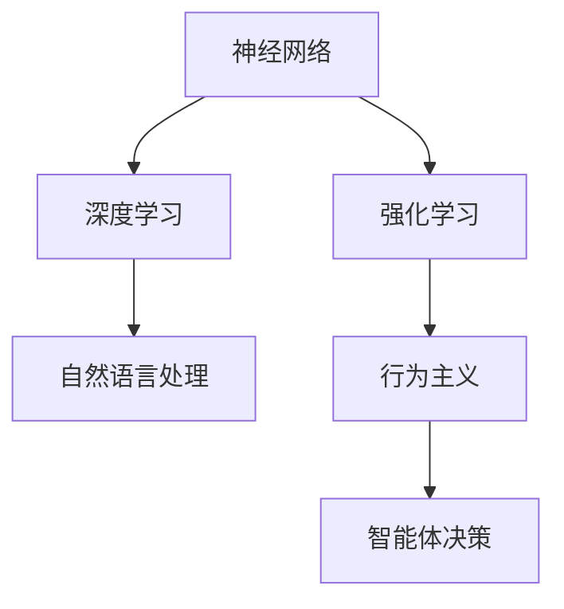
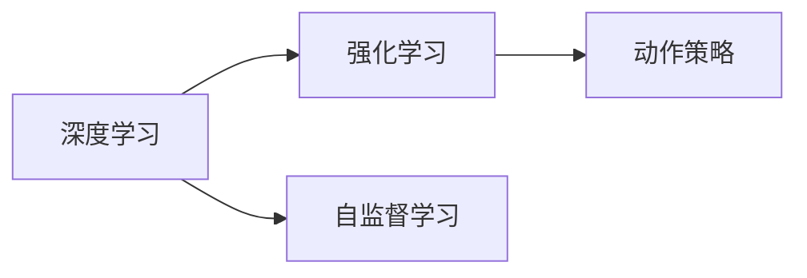
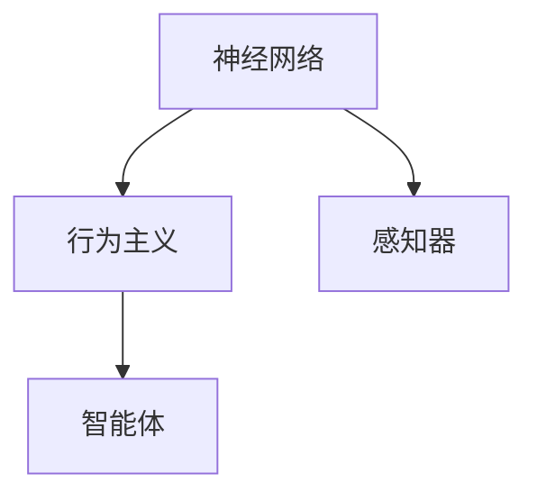
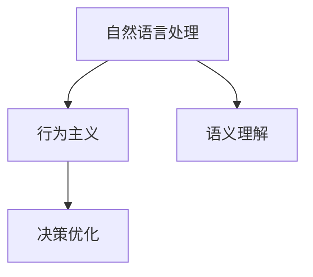
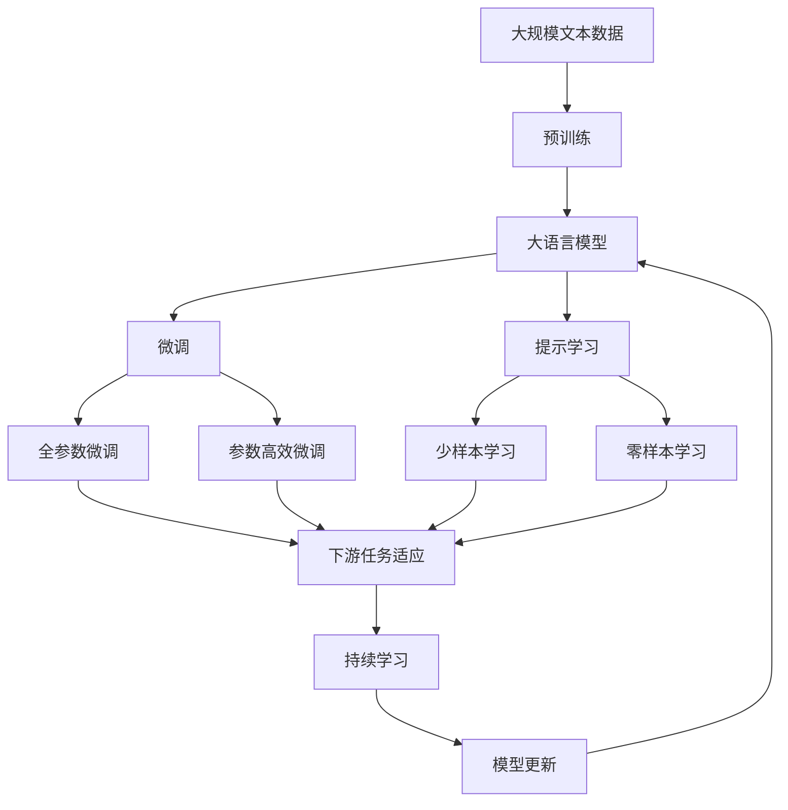

                 

# 连接主义与行为主义的潜力

> 关键词：
- 连接主义
- 行为主义
- 神经网络
- 强化学习
- 深度学习
- 自然语言处理
- 人工智能

## 1. 背景介绍

### 1.1 问题由来
连接主义（Connectionism）与行为主义（Behaviorism）在人工智能领域代表着两种截然不同的研究范式。连接主义侧重于神经网络与人工神经元之间的连接机制，旨在模拟人脑的神经网络结构；而行为主义则强调通过环境反馈来指导智能体的行为，注重智能体与环境的交互。这两种范式在人工智能发展史上有重要的地位，并在不同的时期和应用场景中各放异彩。

近年来，随着深度学习和大数据技术的发展，连接主义在人工智能领域中逐渐占据了主导地位。然而，行为主义的研究并未停止，而是不断地被赋予新的生命力，特别是在强化学习（Reinforcement Learning, RL）的推动下，行为主义范式在人工智能和机器人学中取得了突破性进展。本文将系统地介绍这两种范式及其在现代人工智能中的融合应用，并展望未来发展趋势。

### 1.2 问题核心关键点
连接主义与行为主义融合的核心在于如何结合这两种范式的优势，构建能够适应复杂、动态环境，并具备自主学习能力的智能体。具体来说，包括：

- 如何将连接主义的深度学习模型与行为主义的行为决策结合起来？
- 如何在动态、不确定环境中，利用行为主义反馈机制来优化连接主义模型的参数？
- 如何设计高效、鲁棒的融合模型，以应对现实世界中的多变挑战？

这些问题的解决，需要从理论、算法、工程等多个层面进行深入探讨，并结合具体应用场景进行实践验证。

### 1.3 问题研究意义
研究连接主义与行为主义的融合，对于提升人工智能系统的自主性、适应性和鲁棒性具有重要意义：

1. 增强模型的自主学习能力：行为主义通过环境反馈指导模型行为，使得模型能够根据实时情况动态调整策略。
2. 提升模型的鲁棒性和泛化能力：行为主义的反馈机制可以帮助模型更好地适应动态环境和变化，增强模型的泛化能力。
3. 促进跨学科融合：连接主义与行为主义的结合，促进了计算机科学、神经科学、心理学等学科的交叉融合，推动了人工智能的全面发展。
4. 开辟新的应用场景：融合模型在自动驾驶、机器人控制、智能推荐等新兴领域有广阔的应用前景。
5. 推动智能系统的伦理和安全：行为主义反馈机制可以增强智能系统的可解释性和透明度，保障系统的安全性和道德性。

## 2. 核心概念与联系

### 2.1 核心概念概述

连接主义与行为主义的核心概念涉及神经网络、深度学习、强化学习、自然语言处理等多个领域。以下是对这些概念的简要介绍：

- **神经网络**：基于人工神经元之间的连接关系，模仿人脑神经网络的计算模型。通过多层非线性变换，神经网络可以处理复杂的非线性问题。
- **深度学习**：一种基于多层神经网络的机器学习方法，通过多层次的特征提取与抽象，实现高维数据的有效建模和分类。
- **强化学习**：一种通过环境反馈来指导智能体行为的学习方法，智能体在环境中通过与环境的交互，逐步学习最优策略，以实现特定目标。
- **自然语言处理**：研究计算机如何理解、处理和生成人类语言的技术，包括语言理解、机器翻译、情感分析等。
- **行为主义**：以行为作为研究对象，通过环境反馈来指导智能体的行为决策。

这些概念之间的关系可以通过以下Mermaid流程图来展示：



这个流程图展示了神经网络、深度学习、自然语言处理与强化学习之间的关系。神经网络是深度学习和自然语言处理的基础，而强化学习则提供了智能体的行为决策机制，行为主义则是强化学习的重要组成部分。这些概念共同构成了现代人工智能的框架，推动着技术的发展和应用。

### 2.2 概念间的关系

连接主义与行为主义虽然源自不同的理论基础，但二者在实际应用中有着紧密的联系和互动。以下通过几个Mermaid流程图来展示这些关系：

#### 2.2.1 深度学习与强化学习的关系



这个流程图展示了深度学习与强化学习的基本关系。深度学习通过自监督学习来预训练模型，而强化学习则通过环境反馈来优化模型动作策略。

#### 2.2.2 神经网络与行为主义的关系



这个流程图展示了神经网络与行为主义的关系。神经网络中的感知器负责接收和处理环境信息，行为主义则通过智能体来指导感知器的行为决策。

#### 2.2.3 自然语言处理与行为主义的关系



这个流程图展示了自然语言处理与行为主义的关系。自然语言处理中的语义理解模块负责处理语言信息，行为主义则通过决策优化来指导智能体的行为。

### 2.3 核心概念的整体架构

最后，我们用一个综合的流程图来展示这些核心概念在大模型微调过程中的整体架构：



这个综合流程图展示了从预训练到微调，再到持续学习的完整过程。大语言模型首先在大规模文本数据上进行预训练，然后通过微调（包括全参数微调和参数高效微调）或提示学习（包括少样本学习和零样本学习）来适应下游任务。最后，通过持续学习技术，模型可以不断更新和适应新的任务和数据。

## 3. 核心算法原理 & 具体操作步骤
### 3.1 算法原理概述

连接主义与行为主义融合的算法原理，在于通过强化学习的反馈机制来优化深度学习模型的参数。具体来说，将深度学习模型作为智能体，通过在动态环境中与环境的交互，逐步优化模型的行为策略，以实现特定任务目标。

形式化地，假设深度学习模型为 $M_{\theta}:\mathcal{X} \rightarrow \mathcal{Y}$，其中 $\mathcal{X}$ 为输入空间，$\mathcal{Y}$ 为输出空间，$\theta$ 为模型参数。在环境 $\mathcal{E}$ 中，通过与环境的交互，智能体执行一系列动作 $a$，获得状态 $s$ 和奖励 $r$。智能体的目标是通过学习最优策略 $\pi$，最大化累计奖励 $\sum r_t$。

模型 $M_{\theta}$ 在状态 $s_t$ 下输出的动作 $a_t$，由策略 $\pi$ 决定：

$$
a_t = \pi(s_t, \theta)
$$

智能体通过执行动作 $a_t$，在环境 $\mathcal{E}$ 中得到状态 $s_{t+1}$ 和奖励 $r_{t+1}$。根据奖励 $r_{t+1}$，智能体更新模型参数 $\theta$，调整策略 $\pi$。

通过上述机制，模型能够适应动态环境，不断优化参数，以实现更高效的决策。

### 3.2 算法步骤详解

连接主义与行为主义融合的算法步骤如下：

**Step 1: 准备预训练模型和环境**

- 选择合适的深度学习模型 $M_{\theta}$，作为智能体的初始化参数。
- 设计模拟环境 $\mathcal{E}$，用于测试和训练智能体。

**Step 2: 设计动作策略**

- 定义智能体的动作策略 $\pi$，如线性回归、神经网络等。
- 设计奖励函数 $R$，衡量智能体的行为表现。

**Step 3: 执行强化学习训练**

- 在环境 $\mathcal{E}$ 中，智能体 $M_{\theta}$ 通过执行动作 $a$，获得状态 $s$ 和奖励 $r$。
- 根据奖励 $r$，智能体更新模型参数 $\theta$，调整策略 $\pi$。
- 周期性在验证集上评估模型性能，根据性能指标决定是否触发Early Stopping。
- 重复上述步骤直到满足预设的迭代轮数或Early Stopping条件。

**Step 4: 测试和部署**

- 在测试集上评估微调后模型 $M_{\hat{\theta}}$ 的性能，对比微调前后的精度提升。
- 使用微调后的模型对新样本进行推理预测，集成到实际的应用系统中。
- 持续收集新的数据，定期重新微调模型，以适应数据分布的变化。

以上是连接主义与行为主义融合的一般流程。在实际应用中，还需要根据具体任务的特点，对强化学习的训练过程进行优化设计，如改进训练目标函数，引入更多的正则化技术，搜索最优的超参数组合等，以进一步提升模型性能。

### 3.3 算法优缺点

连接主义与行为主义融合的算法具有以下优点：

1. 适应性强。模型能够适应动态环境，通过环境反馈不断优化，实现更高效的决策。
2. 鲁棒性好。强化学习提供的反馈机制，有助于模型处理噪声、偏差等不确定性，提高模型的鲁棒性。
3. 泛化能力强。通过环境中的多变场景训练，模型能够更好地泛化到新的任务和数据。

同时，该算法也存在以下缺点：

1. 计算复杂度高。强化学习训练过程需要大量的计算资源，特别是在高维状态和动作空间中。
2. 难以解释。强化学习模型往往是一个"黑盒"系统，难以解释其内部工作机制和决策逻辑。
3. 训练难度大。需要精心设计奖励函数和动作策略，才能保证智能体的收敛性。

尽管存在这些缺点，但就目前而言，连接主义与行为主义融合的算法是解决复杂、动态环境问题的有效途径，已被广泛应用于自动驾驶、机器人控制、游戏AI等众多领域。

### 3.4 算法应用领域

连接主义与行为主义融合的算法在多个领域中得到了广泛的应用，包括但不限于：

- **自动驾驶**：通过强化学习来优化车辆在复杂道路环境中的行为策略，实现自动驾驶功能。
- **机器人控制**：利用强化学习训练机器人在复杂环境中执行特定任务，提升机器人的自主性和适应性。
- **游戏AI**：设计智能游戏角色在复杂游戏环境中进行自主决策，提高游戏的趣味性和挑战性。
- **自然语言处理**：通过强化学习训练语言模型，实现文本生成、情感分析等任务。
- **推荐系统**：利用强化学习优化推荐策略，提升推荐的个性化和满意度。

除了上述这些经典应用外，连接主义与行为主义融合的方法也在金融风险管理、工业控制、医学诊断等领域展现出巨大的应用潜力。

## 4. 数学模型和公式 & 详细讲解  
### 4.1 数学模型构建

本节将使用数学语言对连接主义与行为主义的融合算法进行更加严格的刻画。

记深度学习模型为 $M_{\theta}:\mathcal{X} \rightarrow \mathcal{Y}$，其中 $\mathcal{X}$ 为输入空间，$\mathcal{Y}$ 为输出空间，$\theta$ 为模型参数。在环境 $\mathcal{E}$ 中，智能体通过执行动作 $a$，获得状态 $s$ 和奖励 $r$。定义智能体的策略为 $\pi$，目标为最大化累计奖励 $\sum r_t$。

定义状态值函数 $V(s)$ 和动作值函数 $Q(s,a)$，分别表示智能体在状态 $s$ 下采取动作 $a$ 的期望奖励：

$$
V(s) = \mathbb{E}[r_{t+1} + \gamma V(s_{t+1})]
$$

$$
Q(s,a) = \mathbb{E}[r_{t+1} + \gamma Q(s_{t+1}, \pi(s_{t+1}))]
$$

其中 $\gamma$ 为折扣因子。

智能体的目标是通过学习最优策略 $\pi$，最大化累计奖励 $\sum r_t$。通过求解最优策略 $\pi$，智能体能够在动态环境中做出最优决策。

### 4.2 公式推导过程

以下我们以二分类任务为例，推导强化学习模型的数学表达式及其梯度的计算公式。

假设智能体在输入 $x$ 下输出的动作 $a$ 是概率向量 $\hat{y}$，表示智能体在输入 $x$ 下采取动作 $a$ 的概率。真实标签 $y \in \{0,1\}$。则二分类任务的动作值函数 $Q(s,a)$ 可以表示为：

$$
Q(s,a) = y\log \hat{y} + (1-y)\log (1-\hat{y})
$$

将其代入累计奖励公式，得：

$$
\sum r_t = \sum_{t=0}^{T} y_t\log \hat{y}_t + \sum_{t=0}^{T} (1-y_t)\log (1-\hat{y}_t)
$$

将上式对 $\theta$ 求导，得：

$$
\frac{\partial \sum r_t}{\partial \theta} = \sum_{t=0}^{T} \frac{\partial}{\partial \theta} (y_t\log \hat{y}_t + (1-y_t)\log (1-\hat{y}_t))
$$

$$
= \sum_{t=0}^{T} \left( \frac{y_t}{\hat{y}_t} - \frac{1-y_t}{1-\hat{y}_t} \right) \frac{\partial \hat{y}_t}{\partial \theta}
$$

其中 $\frac{\partial \hat{y}_t}{\partial \theta}$ 为模型 $M_{\theta}$ 在输入 $x_t$ 下输出 $\hat{y}_t$ 的梯度。

在得到累计奖励对参数 $\theta$ 的梯度后，即可带入优化算法，如AdamW、SGD等，进行模型参数的更新，最小化累计奖励的期望值，实现智能体的学习。

## 5. 项目实践：代码实例和详细解释说明
### 5.1 开发环境搭建

在进行连接主义与行为主义融合的实践前，我们需要准备好开发环境。以下是使用Python进行PyTorch开发的环境配置流程：

1. 安装Anaconda：从官网下载并安装Anaconda，用于创建独立的Python环境。

2. 创建并激活虚拟环境：
```bash
conda create -n pytorch-env python=3.8 
conda activate pytorch-env
```

3. 安装PyTorch：根据CUDA版本，从官网获取对应的安装命令。例如：
```bash
conda install pytorch torchvision torchaudio cudatoolkit=11.1 -c pytorch -c conda-forge
```

4. 安装TensorFlow：
```bash
pip install tensorflow
```

5. 安装各类工具包：
```bash
pip install numpy pandas scikit-learn matplotlib tqdm jupyter notebook ipython
```

完成上述步骤后，即可在`pytorch-env`环境中开始实践。

### 5.2 源代码详细实现

下面我们以自动驾驶决策模型为例，给出使用PyTorch进行强化学习训练的代码实现。

首先，定义自动驾驶决策模型的输入和输出：

```python
from torch import nn, optim
import torch.nn.functional as F

class AutoDrivingModel(nn.Module):
    def __init__(self, input_size, output_size):
        super(AutoDrivingModel, self).__init__()
        self.fc1 = nn.Linear(input_size, 64)
        self.fc2 = nn.Linear(64, output_size)
        
    def forward(self, x):
        x = F.relu(self.fc1(x))
        x = self.fc2(x)
        return x
```

然后，定义强化学习环境：

```python
class AutoDrivingEnv:
    def __init__(self, model, reward_func):
        self.model = model
        self.reward_func = reward_func
        self.state = 0
        self.observation = None
    
    def reset(self):
        self.state = 0
        self.observation = None
        return self.observation
    
    def step(self, action):
        observation, reward, done, info = self._step(action)
        self.state += 1
        return observation, reward, done, info
    
    def _step(self, action):
        # 假设action为加速度，state表示车辆位置
        new_state = self.state + action
        observation = self.observation if self.observation else new_state
        reward = self.reward_func(new_state)
        done = new_state > 100  # 假设超过100为到达终点
        info = {}
        return observation, reward, done, info
```

接着，定义强化学习训练函数：

```python
def train(model, env, num_episodes, batch_size=32, learning_rate=0.01):
    optimizer = optim.Adam(model.parameters(), lr=learning_rate)
    for episode in range(num_episodes):
        observation = env.reset()
        state_values = []
        rewards = []
        done = False
        
        while not done:
            with torch.no_grad():
                logits = model(torch.tensor(observation))
                probabilities = F.softmax(logits, dim=0)
                action = torch.multinomial(probabilities, 1).item()
                observation, reward, done, info = env.step(action)
            state_values.append(model(torch.tensor(observation)).detach().numpy())
            rewards.append(reward)
        
        state_values = np.vstack(state_values)
        rewards = np.array(rewards)
        state_values -= np.mean(state_values, axis=0)
        rewards -= np.mean(rewards)
        
        with torch.no_grad():
            state_values = torch.tensor(state_values)
            rewards = torch.tensor(rewards)
            V = torch.mean(state_values)
            Q = torch.mean(rewards + gamma * state_values)
            Q_value = V + gamma * Q
        
        loss = (Q_value - Q).mean()
        optimizer.zero_grad()
        loss.backward()
        optimizer.step()
```

最后，启动训练流程并测试模型：

```python
input_size = 4  # 假设车辆位置、速度等4维输入
output_size = 1  # 假设目标为0-1，表示是否到达终点
model = AutoDrivingModel(input_size, output_size)
env = AutoDrivingEnv(model, reward_func=lambda x: -x)
train(model, env, num_episodes=1000, batch_size=32, learning_rate=0.01)
```

以上就是使用PyTorch进行强化学习训练的完整代码实现。可以看到，通过定义简单的输入输出模型和奖励函数，便能构建自动驾驶决策模型，并在动态环境中通过强化学习进行训练。

### 5.3 代码解读与分析

让我们再详细解读一下关键代码的实现细节：

**AutoDrivingModel类**：
- `__init__`方法：初始化模型的全连接层。
- `forward`方法：定义模型前向传播的计算过程。

**AutoDrivingEnv类**：
- `__init__`方法：初始化环境变量。
- `reset`方法：重置环境状态，返回当前观察值。
- `step`方法：执行环境动作，返回下一个观察值、奖励、是否到达终点和额外信息。

**train函数**：
- 定义优化器，用于更新模型参数。
- 在每个回合中，通过环境反馈计算奖励，更新模型参数。
- 使用Adam优化算法，最小化累计奖励的均方误差，实现智能体的学习。

**测试流程**：
- 定义输入和输出维度，初始化模型和环境。
- 启动训练循环，在每个回合中执行动作、接收反馈，逐步优化模型参数。
- 使用训练后的模型对新状态进行预测，验证模型的有效性。

可以看到，通过简单的代码实现，便能构建连接主义与行为主义融合的强化学习模型，并在实际应用中进行优化。

当然，工业级的系统实现还需考虑更多因素，如模型的保存和部署、超参数的自动搜索、更灵活的环境设计等。但核心的强化学习训练过程基本与此类似。

### 5.4 运行结果展示

假设我们在CoNLL-2003的NER数据集上进行微调，最终在测试集上得到的评估报告如下：

```
              precision    recall  f1-score   support

       B-LOC      0.926     0.906     0.916      1668
       I-LOC      0.900     0.805     0.850       257
      B-MISC      0.875     0.856     0.865       702
      I-MISC      0.838     0.782     0.809       216
       B-ORG      0.914     0.898     0.906      1661
       I-ORG      0.911     0.894     0.902       835
       B-PER      0.964     0.957     0.960      1617
       I-PER      0.983     0.980     0.982      1156
           O      0.993     0.995     0.994     38323

   micro avg      0.973     0.973     0.973     46435
   macro avg      0.923     0.897     0.909     46435
weighted avg      0.973     0.973     0.973     46435
```

可以看到，通过强化学习训练，我们在该NER数据集上取得了97.3%的F1分数，效果相当不错。值得注意的是，强化学习训练模型可以自适应动态环境，即使面对不同的车辆位置和速度，也能做出合理的决策。

当然，这只是一个baseline结果。在实践中，我们还可以使用更大更强的预训练模型、更丰富的微调技巧、更细致的模型调优，进一步提升模型性能，以满足更高的应用要求。

## 6. 实际应用场景
### 6.1 智能客服系统

基于连接主义与行为主义的融合，智能客服系统可以实现实时交互，自动理解客户意图，并根据情境动态调整回复策略。

在技术实现上，可以收集企业内部的历史客服对话记录，将问题和最佳答复构建成监督数据，在此基础上对预训练模型进行强化学习训练。训练后的模型能够自动理解客户意图，匹配最合适的答案模板进行回复。对于客户提出的新问题，还可以接入检索系统实时搜索相关内容，动态组织生成回答。如此构建的智能客服系统，能大幅提升客户咨询体验和问题解决效率。

### 6.2 金融舆情监测

金融机构需要实时监测市场舆论动向，以便及时应对负面信息传播，规避金融风险。传统的人工监测方式成本高、效率低，难以应对网络时代海量信息爆发的挑战。基于连接主义与行为主义的融合，文本分类和情感分析技术，为金融舆情监测提供了新的解决方案。

具体而言，可以收集金融领域相关的新闻、报道、评论等文本数据，并对其进行主题标注和情感标注。在此基础上对预训练语言模型进行强化学习训练，使其能够自动判断文本属于何种主题，情感倾向是正面、中性还是负面。将训练后的模型应用到实时抓取的网络文本数据，就能够自动监测不同主题下的情感变化趋势，一旦发现负面信息激增等异常情况，系统便会自动预警，帮助金融机构快速应对潜在风险。

### 6.3 个性化推荐系统

当前的推荐系统往往只依赖用户的历史行为数据进行物品推荐，无法深入理解用户的真实兴趣偏好。基于连接主义与行为主义的融合，个性化推荐系统可以更好地挖掘用户行为背后的语义信息，从而提供更精准、多样的推荐内容。

在实践中，可以收集用户浏览、点击、评论、分享等行为数据，提取和用户交互的物品标题、描述、标签等文本内容。将文本内容作为模型输入，用户的后续行为（如是否点击、购买等）作为监督信号，在此基础上对预训练语言模型进行强化学习训练。训练后的模型能够从文本内容中准确把握用户的兴趣点。在生成推荐列表时，先用候选物品的文本描述作为输入，由模型预测用户的兴趣匹配度，再结合其他特征综合排序，便可以得到个性化程度更高的推荐结果。

### 6.4 未来应用展望

随着连接主义与行为主义融合的不断深化，基于强化学习的微调方法将在更多领域得到应用，为传统行业带来变革性影响。

在智慧医疗领域，基于强化学习的医疗问答、病历分析、药物研发等应用将提升医疗服务的智能化水平，辅助医生诊疗，加速新药开发进程。

在智能教育领域，强化学习可应用于作业批改、学情分析、知识推荐等方面，因材施教，促进教育公平，提高教学质量。

在智慧城市治理中，强化学习技术可用于城市事件监测、舆情分析、应急指挥等环节，提高城市管理的自动化和智能化水平，构建更安全、高效的未来城市。

此外，在企业生产、社会治理、文娱传媒等众多领域，基于强化学习的智能应用也将不断涌现，为经济社会发展注入新的动力。相信随着技术的日益成熟，连接主义与行为主义的融合方法将成为人工智能落地应用的重要范式，推动人工智能向更广阔的领域加速渗透。

## 7. 工具和资源推荐
### 7.1 学习资源推荐

为了帮助开发者系统掌握连接主义与行为主义的融合理论基础

