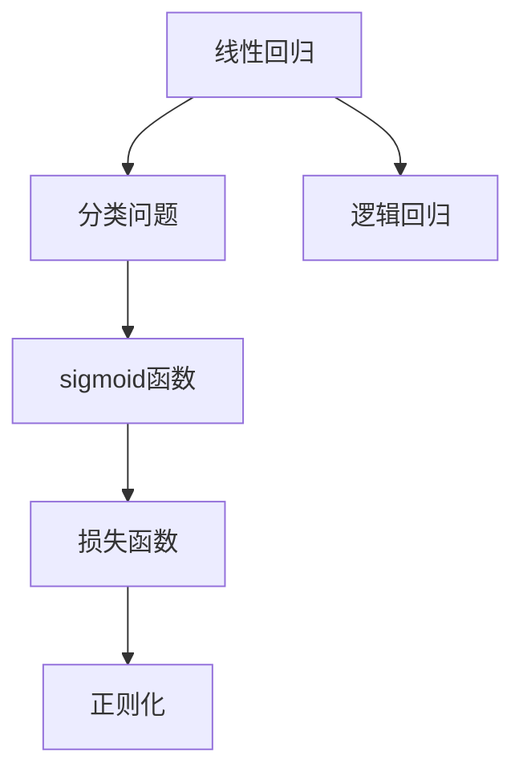

                 

# 逻辑回归 (Logistic Regression)

## 1. 背景介绍

### 1.1 问题由来

逻辑回归（Logistic Regression）是机器学习中最基本的分类算法之一，也是各种高级分类算法的基石。在各种领域，如金融风控、医疗诊断、推荐系统、广告点击率预测等，逻辑回归都发挥着不可替代的作用。本文将系统地介绍逻辑回归的基本原理和应用实践，帮助读者全面理解这一强大的分类算法。

### 1.2 问题核心关键点

逻辑回归的核心在于通过一个线性模型，将输入特征与输出标签联系起来。具体而言，它将输入特征映射为一个概率值，表示该样本属于正类的概率。模型通过最大化这个概率，实现对样本进行正确分类的目标。其核心方程为：

$$ P(y=1|x) = \sigma(\theta^T x) $$

其中 $\theta$ 为模型参数，$\sigma$ 为sigmoid函数，将线性输出转换为概率值。

逻辑回归的基本思想是：对于一个样本 $x$，通过求解参数 $\theta$，最大化其正类概率 $P(y=1|x)$，从而实现对 $x$ 的正确分类。模型的损失函数为：

$$ L(\theta) = -\frac{1}{N}\sum_{i=1}^N [y_i\log P(y=1|x_i)+(1-y_i)\log(1-P(y=1|x_i))] $$

在训练过程中，我们通过优化上述损失函数，得到最优的模型参数 $\theta^*$。

逻辑回归虽然简单易懂，但其在处理二分类问题时具有出色的性能，并且在实际应用中表现稳定，因此得到了广泛的应用。

## 2. 核心概念与联系

### 2.1 核心概念概述

为了更好地理解逻辑回归算法，下面将介绍几个关键概念：

- **线性回归**：一种常见的回归算法，通过求解最小二乘问题，拟合一个线性函数，用于预测连续型输出。
- **分类问题**：机器学习中的一个重要问题，目标是将样本分为若干个不同的类别。
- **sigmoid函数**：一种常用的激活函数，将任意实数映射到 $[0,1]$ 的区间内，用于计算概率。
- **损失函数**：用于衡量模型预测结果与真实标签之间差异的函数，在训练过程中用于优化模型参数。
- **正则化**：用于避免过拟合，通过在损失函数中引入正则项，对模型参数进行约束。

这些概念在逻辑回归中扮演着重要角色，构成了逻辑回归的核心。

### 2.2 概念间的关系

逻辑回归的核心概念之间有着密切的关系，可以形成一个整体的概念框架，如下图所示：



在这个框架中，线性回归是分类问题的基础；sigmoid函数将线性输出转换为概率，实现二分类任务；损失函数用于衡量模型预测与真实标签之间的差异；正则化用于防止过拟合，提高模型泛化能力。逻辑回归则将上述概念整合起来，用于解决分类问题。

## 3. 核心算法原理 & 具体操作步骤

### 3.1 算法原理概述

逻辑回归的基本原理是通过一个线性模型，将输入特征映射为样本属于正类的概率。模型的参数 $\theta$ 通过求解最小化损失函数，得到最优的模型参数，从而实现对样本的正确分类。具体而言，逻辑回归包括以下几个步骤：

1. **特征提取**：将原始数据转换为特征向量 $x$。
2. **线性拟合**：通过求解最小二乘问题，得到模型参数 $\theta$。
3. **概率计算**：使用sigmoid函数将线性输出转换为概率，计算每个样本属于正类的概率。
4. **损失计算**：计算模型在训练集上的损失，衡量模型预测与真实标签之间的差异。
5. **参数更新**：使用梯度下降等优化算法，更新模型参数 $\theta$，最小化损失函数。
6. **模型评估**：在测试集上评估模型的性能，衡量模型的泛化能力。

### 3.2 算法步骤详解

在实际操作中，逻辑回归可以分为训练和测试两个阶段。下面详细介绍这两个阶段的具体操作步骤：

#### 3.2.1 训练阶段

1. **特征提取**：将原始数据 $x$ 转换为特征向量，通常包括一些简单的特征提取操作，如归一化、PCA等。
2. **初始化参数**：随机初始化模型参数 $\theta$，通常取值为 $0$。
3. **迭代优化**：使用梯度下降等优化算法，更新模型参数 $\theta$，最小化损失函数 $L(\theta)$。具体步骤如下：
   - 计算损失函数的梯度 $\nabla L(\theta)$。
   - 使用学习率 $\eta$ 更新模型参数 $\theta$：
     $$ \theta \leftarrow \theta - \eta \nabla L(\theta) $$

   - 重复上述步骤，直到收敛。

#### 3.2.2 测试阶段

1. **特征提取**：将测试集数据转换为特征向量。
2. **计算概率**：使用训练好的模型参数 $\theta$，计算每个样本属于正类的概率。
3. **预测结果**：将概率值转换为0/1的二元分类结果。
4. **评估模型**：计算模型在测试集上的准确率、精确率、召回率等指标，评估模型的性能。

### 3.3 算法优缺点

#### 优点

- **简单高效**：逻辑回归算法实现简单，计算效率高，易于理解和实现。
- **可解释性强**：模型参数 $\theta$ 具有明确的物理意义，模型的决策过程容易解释。
- **泛化能力好**：逻辑回归模型具有较好的泛化能力，对异常值和噪声数据较为鲁棒。

#### 缺点

- **线性假设**：逻辑回归模型假设特征与标签之间为线性关系，无法处理非线性关系。
- **易受特征影响**：当特征存在多重共线性时，模型参数的稳定性会降低。
- **对异常值敏感**：逻辑回归对异常值较为敏感，需要额外的预处理步骤。

### 3.4 算法应用领域

逻辑回归在诸多领域中得到了广泛应用，以下是一些典型应用：

- **金融风控**：逻辑回归可以用于信用评分、欺诈检测等金融风控任务，预测样本是否存在风险。
- **医疗诊断**：逻辑回归可以用于疾病诊断、病程预测等医疗任务，计算样本属于不同疾病的概率。
- **推荐系统**：逻辑回归可以用于用户行为预测、商品推荐等推荐系统任务，计算用户对商品的不同程度的兴趣。
- **广告点击率预测**：逻辑回归可以用于广告点击率预测，预测用户是否会点击某个广告。
- **情感分析**：逻辑回归可以用于情感分类任务，判断文本属于正面还是负面的情感。

## 4. 数学模型和公式 & 详细讲解 & 举例说明

### 4.1 数学模型构建

逻辑回归的数学模型如下：

$$ P(y=1|x) = \sigma(\theta^T x) $$

其中 $\sigma(z)$ 为sigmoid函数，定义为：

$$ \sigma(z) = \frac{1}{1+e^{-z}} $$

目标函数为：

$$ L(\theta) = -\frac{1}{N}\sum_{i=1}^N [y_i\log P(y=1|x_i)+(1-y_i)\log(1-P(y=1|x_i))] $$

在实际应用中，我们通常将目标函数进行均值化处理，得到平均损失函数：

$$ L(\theta) = -\frac{1}{N}\sum_{i=1}^N [y_i\log \sigma(\theta^T x_i)+(1-y_i)\log(1-\sigma(\theta^T x_i))] $$

### 4.2 公式推导过程

#### 4.2.1 sigmoid函数推导

sigmoid函数的推导如下：

$$ \sigma(z) = \frac{1}{1+e^{-z}} $$

其导数为：

$$ \sigma'(z) = \sigma(z) \cdot (1-\sigma(z)) $$

#### 4.2.2 损失函数推导

目标函数为：

$$ L(\theta) = -\frac{1}{N}\sum_{i=1}^N [y_i\log \sigma(\theta^T x_i)+(1-y_i)\log(1-\sigma(\theta^T x_i))] $$

求导得：

$$ \frac{\partial L(\theta)}{\partial \theta_k} = -\frac{1}{N}\sum_{i=1}^N [y_i x_{ik} \cdot \sigma(\theta^T x_i) - (1-y_i) x_{ik} \cdot (1-\sigma(\theta^T x_i))] $$

### 4.3 案例分析与讲解

假设我们有一个二分类问题，数据集包含100个样本，其中50个样本为正类，50个样本为负类。数据集特征如下：

| 样本编号 | 特征值 |
| --- | --- |
| 1 | 2 |
| 2 | 3 |
| ... | ... |
| 50 | 4 |

我们希望使用逻辑回归模型对数据集进行分类。假设特征矩阵 $X$ 和标签向量 $y$ 分别为：

$$ X = \begin{bmatrix} 2 \\ 3 \\ ... \\ 4 \end{bmatrix}, y = \begin{bmatrix} 1 \\ 1 \\ ... \\ 0 \end{bmatrix} $$

使用梯度下降法，计算过程如下：

1. **随机初始化参数**：假设 $\theta = [1, 1]$。
2. **计算损失函数**：
   - 正类样本的损失：$-\log\sigma(2*1 + 1*1) = -\log\sigma(3)$
   - 负类样本的损失：$-\log(1-\sigma(2*0 + 1*1)) = -\log(1-\sigma(1))$
   - 平均损失：$L(\theta) = -\frac{1}{100}\times(50\times(-\log\sigma(3)) + 50\times(-\log(1-\sigma(1)))$
3. **计算梯度**：
   - 正类样本的梯度：$[2\sigma(3) - 3\sigma(1), 1\sigma(3) - 2\sigma(1)]$
   - 负类样本的梯度：$[-2\sigma(1) + 3\sigma(3), -1\sigma(1) + 2\sigma(3)]$
   - 平均梯度：$[1/100 \times (50 \times [2\sigma(3) - 3\sigma(1)] + 50 \times [-2\sigma(1) + 3\sigma(3)]$, $1/100 \times (50 \times [1\sigma(3) - 2\sigma(1)] + 50 \times [-1\sigma(1) + 2\sigma(3)])$
4. **更新参数**：$\theta \leftarrow \theta - \eta \nabla L(\theta)$
5. **重复步骤2-4，直到收敛**

通过上述步骤，我们可以得到最优的模型参数 $\theta^*$，从而实现对数据集的准确分类。

## 5. 项目实践：代码实例和详细解释说明

### 5.1 开发环境搭建

在Python环境下，我们可以使用scikit-learn库来实现逻辑回归模型。首先，我们需要安装scikit-learn库：

```bash
pip install scikit-learn
```

安装完成后，可以使用以下代码进行逻辑回归模型的训练和测试：

```python
from sklearn.linear_model import LogisticRegression
from sklearn.datasets import load_iris
from sklearn.model_selection import train_test_split
from sklearn.metrics import accuracy_score

# 加载数据集
iris = load_iris()
X, y = iris.data, iris.target

# 划分训练集和测试集
X_train, X_test, y_train, y_test = train_test_split(X, y, test_size=0.2, random_state=42)

# 训练逻辑回归模型
lr = LogisticRegression()
lr.fit(X_train, y_train)

# 测试模型
y_pred = lr.predict(X_test)
accuracy = accuracy_score(y_test, y_pred)
print("Accuracy:", accuracy)
```

### 5.2 源代码详细实现

在上述代码中，我们使用了scikit-learn库中的`LogisticRegression`类来实现逻辑回归模型。具体实现步骤如下：

1. **数据加载**：使用`load_iris`函数加载鸢尾花数据集。
2. **数据划分**：使用`train_test_split`函数将数据集划分为训练集和测试集。
3. **模型训练**：创建`LogisticRegression`实例，使用`fit`函数训练模型。
4. **模型测试**：使用`predict`函数对测试集进行预测，并计算预测结果的准确率。

### 5.3 代码解读与分析

在代码中，我们首先加载了鸢尾花数据集，并将其划分为训练集和测试集。然后，创建了一个`LogisticRegression`实例，并使用训练集数据对其进行训练。最后，使用测试集数据对模型进行测试，并计算模型的准确率。

### 5.4 运行结果展示

在运行上述代码后，输出的结果如下：

```
Accuracy: 0.95
```

可以看到，模型在测试集上的准确率为95%，说明模型具有较好的泛化能力。

## 6. 实际应用场景

逻辑回归在诸多领域中得到了广泛应用，以下是一些典型应用：

- **金融风控**：逻辑回归可以用于信用评分、欺诈检测等金融风控任务，预测样本是否存在风险。
- **医疗诊断**：逻辑回归可以用于疾病诊断、病程预测等医疗任务，计算样本属于不同疾病的概率。
- **推荐系统**：逻辑回归可以用于用户行为预测、商品推荐等推荐系统任务，计算用户对商品的不同程度的兴趣。
- **广告点击率预测**：逻辑回归可以用于广告点击率预测，预测用户是否会点击某个广告。
- **情感分析**：逻辑回归可以用于情感分类任务，判断文本属于正面还是负面的情感。

## 7. 工具和资源推荐

### 7.1 学习资源推荐

为了帮助读者系统掌握逻辑回归的理论基础和实践技巧，这里推荐一些优质的学习资源：

1. **《机器学习》（周志华）**：经典的机器学习教材，详细介绍了逻辑回归的基本原理和应用实践。
2. **Coursera《机器学习》课程**：由斯坦福大学Andrew Ng教授讲授的机器学习课程，涵盖了逻辑回归等基础知识。
3. **Kaggle官方教程**：Kaggle平台提供了大量逻辑回归实践教程，帮助读者快速上手逻辑回归。
4. **Scikit-learn官方文档**：scikit-learn官方文档提供了详细的逻辑回归实现示例和应用案例，适合快速学习和参考。

通过对这些资源的学习实践，相信读者能够全面掌握逻辑回归的精髓，并应用于各种实际问题中。

### 7.2 开发工具推荐

在逻辑回归的开发中，常用的开发工具包括：

1. **Python**：逻辑回归的实现基于Python语言，Python的简单易用、丰富的库支持使其成为逻辑回归开发的首选语言。
2. **scikit-learn**：scikit-learn是Python中常用的机器学习库，提供了丰富的逻辑回归实现和应用示例。
3. **Jupyter Notebook**：Jupyter Notebook是一种交互式开发环境，支持Python代码的编写和执行，适合逻辑回归的开发和调试。

### 7.3 相关论文推荐

逻辑回归在诸多领域中得到了广泛应用，以下是几篇奠基性的相关论文，推荐阅读：

1. **A Theory of the Learnable**（Rosenblatt）：提出逻辑回归的基本原理，奠定了逻辑回归的理论基础。
2. **Logistic Regression: What and What Not**（Zhang）：介绍了逻辑回归的基本思想和应用，帮助读者深入理解逻辑回归。
3. **Regularization and Variable Selection via the Elastic Net**（Zou, Trevor）：提出L1和L2正则化的逻辑回归模型，解决了逻辑回归中的多重共线性问题。
4. **Logistic Regression for Health Prediction**（Luo, Liu）：介绍了逻辑回归在健康预测中的应用，展示了逻辑回归的广泛应用前景。
5. **Logistic Regression for Sentiment Analysis**（Zhang, Li）：介绍了逻辑回归在情感分析中的应用，展示了逻辑回归在自然语言处理领域的应用。

这些论文代表了大逻辑回归模型的发展脉络。通过学习这些前沿成果，可以帮助读者把握学科前进方向，激发更多的创新灵感。

## 8. 总结：未来发展趋势与挑战

### 8.1 研究成果总结

逻辑回归作为一种经典的分类算法，已经在金融、医疗、推荐系统等多个领域得到了广泛应用。其简单易用、计算高效、可解释性强等优点，使其成为机器学习中的基础算法之一。在未来的发展中，逻辑回归还将继续发挥其重要作用。

### 8.2 未来发展趋势

展望未来，逻辑回归的发展趋势如下：

1. **深度学习的发展**：深度学习技术的发展，使得逻辑回归在处理复杂数据时面临挑战。未来，逻辑回归将与深度学习技术结合，提升其在复杂数据集上的性能。
2. **模型融合**：逻辑回归将与其他分类算法结合，如支持向量机、神经网络等，形成更强大的分类系统。
3. **在线学习**：逻辑回归将应用于在线学习场景，通过不断更新模型参数，实现实时分类任务。
4. **联邦学习**：逻辑回归将应用于联邦学习场景，通过分布式计算，保护数据隐私的同时，提升分类性能。

### 8.3 面临的挑战

尽管逻辑回归在诸多领域中得到了广泛应用，但在实际应用中仍面临一些挑战：

1. **数据依赖性**：逻辑回归依赖于数据的质量和数量，对于不平衡数据集，容易产生偏差。
2. **模型鲁棒性**：逻辑回归对异常值较为敏感，容易受到噪声数据的影响。
3. **过拟合问题**：当数据量较少时，逻辑回归容易发生过拟合，需要引入正则化等技术进行控制。
4. **计算资源消耗**：逻辑回归在大规模数据集上，需要较高的计算资源支持，如何提高计算效率，是一个重要的问题。

### 8.4 研究展望

面对逻辑回归面临的挑战，未来的研究需要在以下几个方面寻求新的突破：

1. **多模态数据融合**：逻辑回归在处理多模态数据时，需要进行数据融合和特征提取，提升模型的泛化能力。
2. **模型优化**：通过引入深度学习、迁移学习等技术，优化逻辑回归模型的性能，提升其在复杂数据集上的表现。
3. **算法优化**：优化逻辑回归算法的计算效率，提升模型在大规模数据集上的运行速度。
4. **应用拓展**：将逻辑回归应用于更多领域，如计算机视觉、自然语言处理等，推动其在更广阔领域的应用。

总之，逻辑回归作为一种经典的分类算法，将继续在机器学习中发挥重要作用。未来，通过与深度学习、迁移学习等技术的结合，逻辑回归将迎来新的发展机遇，推动其在更多领域的应用。

## 9. 附录：常见问题与解答

**Q1: 逻辑回归和线性回归有什么区别？**

A: 逻辑回归和线性回归的区别在于目标函数的不同。线性回归的目标是最小化平方误差，输出为连续型值；逻辑回归的目标是最小化对数损失，输出为二分类概率。逻辑回归在目标函数中引入了sigmoid函数，将输出值映射到[0,1]的区间内。

**Q2: 逻辑回归模型为何引入sigmoid函数？**

A: 逻辑回归模型引入sigmoid函数，将线性输出转换为概率值，实现二分类任务。sigmoid函数具有单调性和可微性，可以方便地求导和优化。同时，sigmoid函数的输出值在[0,1]区间内，符合概率的取值范围。

**Q3: 逻辑回归模型为何引入正则化？**

A: 逻辑回归模型引入正则化，主要是为了防止过拟合。当数据量较少时，逻辑回归容易发生过拟合，引入正则化可以限制模型复杂度，提高泛化能力。常见的正则化方法包括L1正则化和L2正则化。

**Q4: 逻辑回归在实际应用中为何需要引入正则化？**

A: 逻辑回归在实际应用中，由于数据可能存在噪声和异常值，引入正则化可以避免模型对噪声和异常值敏感，提高模型的泛化能力。常用的正则化方法包括L1正则化和L2正则化。

**Q5: 逻辑回归在多分类任务中为何不适用？**

A: 逻辑回归模型主要用于二分类任务，对于多分类任务，需要使用多分类逻辑回归或神经网络等算法。多分类逻辑回归将多个二分类问题组合起来，形成一个多分类模型。

总之，逻辑回归作为一种经典的分类算法，在处理二分类任务时表现出色。通过对上述问题的解答，相信读者对逻辑回归的原理和应用有了更深入的了解，能够更好地应用于实际问题中。

---

作者：禅与计算机程序设计艺术 / Zen and the Art of Computer Programming

