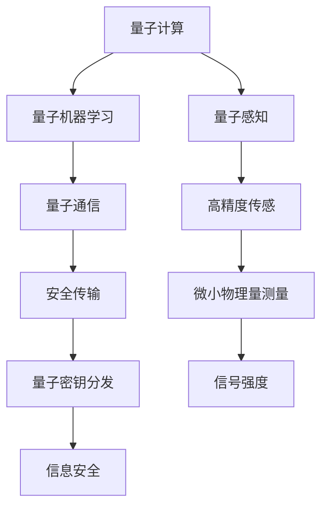
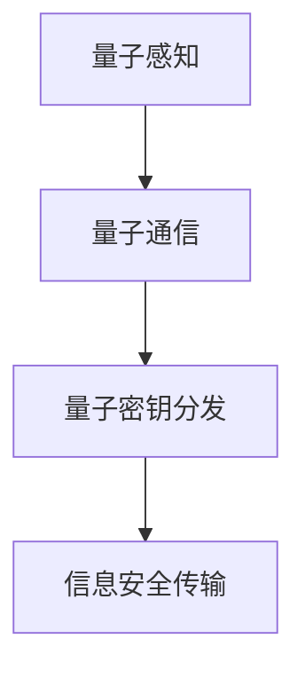
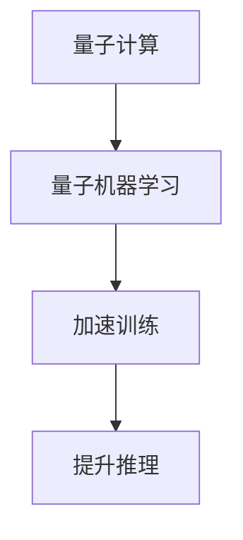
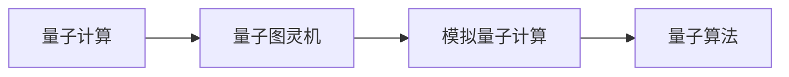
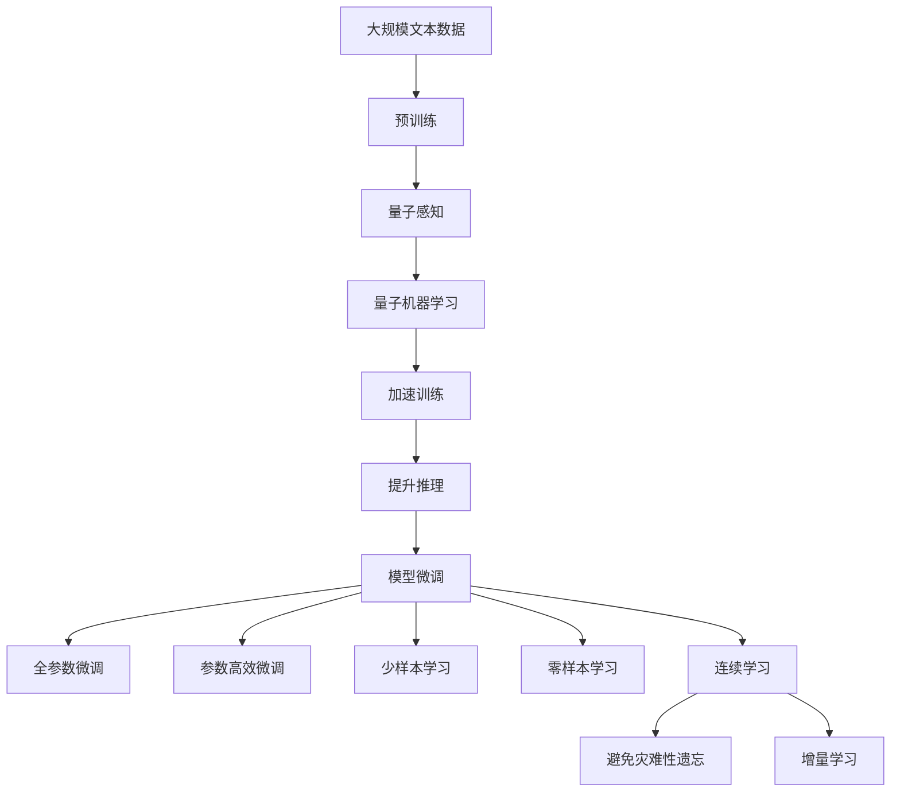

                 

# 量子力学在AI中的应用

> 关键词：量子力学,量子计算,量子机器学习,量子感知,量子通信,量子图灵机

## 1. 背景介绍

### 1.1 问题由来

量子力学（Quantum Mechanics）是现代物理学的基石，它描述了微观粒子的行为和属性。随着量子计算和量子通信技术的发展，量子力学开始在人工智能（AI）领域展现出巨大潜力。量子AI（Quantum AI）融合了量子计算和传统AI技术，旨在突破传统计算和信息处理的局限，提供更高效、更强大的计算能力。

### 1.2 问题核心关键点

量子AI的核心在于将量子计算的优势与AI技术相结合，从而解决传统计算难以处理的复杂问题。其主要技术包括量子感知、量子机器学习和量子通信。其中，量子感知利用量子态的测量来获取更精确的环境信息；量子机器学习通过量子算法来加速传统机器学习任务的训练和推理；量子通信则提供了安全、高效的通信方式。

### 1.3 问题研究意义

量子AI的研究具有重要意义：

1. 加速科学发现。量子计算能够处理海量数据，加速科研数据处理和分析，提高科研效率。
2. 推动产业升级。量子AI技术可以应用于医药、材料、金融等领域，提高生产力和企业竞争力。
3. 提升信息安全。量子通信技术可以实现信息的安全传输，防止被窃取和篡改。
4. 开发新型智能系统。量子AI能够处理更加复杂的问题，推动智能系统的创新和应用。

## 2. 核心概念与联系

### 2.1 核心概念概述

为更好地理解量子AI技术，本节将介绍几个密切相关的核心概念：

- **量子计算（Quantum Computing）**：利用量子比特（qubits）进行计算，通过叠加和纠缠等量子特性，能够大幅提升计算效率。
- **量子感知（Quantum Sensing）**：利用量子传感器测量环境中的微小物理量，如磁、光、声等，用于高精度传感和检测。
- **量子机器学习（Quantum Machine Learning）**：利用量子算法加速传统机器学习算法，如优化、降维、分类等，提高AI任务的性能。
- **量子通信（Quantum Communication）**：利用量子纠缠和量子密钥分发等技术，实现信息的安全传输。
- **量子图灵机（Quantum Turing Machine）**：量子计算的基础模型，用于模拟量子计算过程，是量子算法和量子计算的核心。

这些核心概念之间的逻辑关系可以通过以下Mermaid流程图来展示：



这个流程图展示了大语言模型的核心概念及其之间的关系：

1. 量子计算利用叠加和纠缠等特性，大幅提升计算效率。
2. 量子感知通过量子传感器获取高精度环境信息，用于传感和检测。
3. 量子机器学习利用量子算法加速传统AI任务。
4. 量子通信通过量子密钥分发实现安全传输。
5. 量子图灵机是量子计算的基础模型，用于模拟量子计算过程。

这些核心概念共同构成了量子AI技术的基础，使得量子计算能够在AI领域中发挥巨大作用。通过理解这些核心概念，我们可以更好地把握量子AI技术的核心原理和应用方向。

### 2.2 概念间的关系

这些核心概念之间存在着紧密的联系，形成了量子AI技术的完整生态系统。下面我通过几个Mermaid流程图来展示这些概念之间的关系。

#### 2.2.1 量子计算与量子感知


这个流程图展示了量子计算和量子感知之间的关联。量子计算通过叠加和纠缠等特性，能够提供更高效的计算能力。利用这种能力，量子感知能够实现高精度的环境测量，从而获取更丰富的环境信息。

#### 2.2.2 量子感知与量子通信



这个流程图展示了量子感知与量子通信的关系。量子感知通过量子传感器获取微小物理量，利用量子通信技术，可以实现信息的安全传输，防止信息被窃取和篡改。

#### 2.2.3 量子机器学习与量子计算



这个流程图展示了量子机器学习与量子计算的关系。量子计算利用叠加和纠缠等特性，能够加速传统机器学习算法，从而提升AI任务的性能。

#### 2.2.4 量子图灵机与量子计算



这个流程图展示了量子图灵机与量子计算的关系。量子图灵机是量子计算的基础模型，用于模拟量子计算过程，实现量子算法的设计和运行。

### 2.3 核心概念的整体架构

最后，我们用一个综合的流程图来展示这些核心概念在大语言模型微调过程中的整体架构：



这个综合流程图展示了从预训练到微调，再到持续学习的完整过程。大语言模型首先在大规模文本数据上进行预训练，然后通过量子感知和量子机器学习加速训练和推理，最后进行量子图灵机模拟的量子机器学习微调，实现量子AI应用。

## 3. 核心算法原理 & 具体操作步骤

### 3.1 算法原理概述

量子AI的核心算法包括量子感知、量子机器学习、量子通信和量子图灵机等。这里重点介绍量子感知和量子机器学习的基本原理。

### 3.2 算法步骤详解

#### 3.2.1 量子感知

量子感知利用量子传感器测量环境中的微小物理量，用于高精度传感和检测。其基本步骤包括：

1. **量子传感器的初始化**：将量子比特置于初始化状态，如量子叠加态 $|+\rangle$。
2. **环境交互**：量子比特与环境相互作用，测量环境中的微小物理量，如磁场、光强等。
3. **量子测量**：通过量子测量，获取环境信息的量子态。
4. **数据后处理**：对量子测量结果进行数据处理和分析，获取环境信息的物理量。

例如，利用量子传感器测量环境中的磁场，可以用于高精度的磁场传感和检测。

#### 3.2.2 量子机器学习

量子机器学习通过量子算法加速传统机器学习算法，提高AI任务的性能。其基本步骤包括：

1. **数据准备**：将传统机器学习的数据集转换为量子态。
2. **量子计算**：利用量子计算加速机器学习算法，如优化、降维、分类等。
3. **量子测量**：通过量子测量获取机器学习结果。
4. **数据后处理**：对量子测量结果进行数据处理和分析，得到机器学习输出。

例如，利用量子计算加速支持向量机（SVM）算法，可以显著提升机器学习性能。

### 3.3 算法优缺点

量子感知和量子机器学习具有以下优点：

1. **高效计算**：量子计算能够处理海量数据，加速机器学习任务，提升计算效率。
2. **高精度测量**：量子感知能够实现高精度的环境测量，提供更丰富的环境信息。
3. **信息安全**：量子通信技术可以实现信息的安全传输，防止信息被窃取和篡改。

但同时，这些算法也存在一些缺点：

1. **实现复杂**：量子感知和量子机器学习需要高精度的量子器件和复杂的量子算法，实现难度较大。
2. **噪声影响**：量子计算和量子传感器容易受到噪声影响，导致计算和测量的精度下降。
3. **技术门槛高**：量子计算和量子感知需要高水平的技术和专业知识，对从业者的要求较高。

尽管存在这些局限，但量子AI技术的潜力巨大，值得深入研究和探索。

### 3.4 算法应用领域

量子感知和量子机器学习技术已经在多个领域得到了应用，例如：

1. **生物医学**：利用量子感知测量生物分子结构，用于药物设计和新药发现。
2. **材料科学**：利用量子感知测量材料的物理特性，用于材料设计和性能优化。
3. **金融分析**：利用量子机器学习进行金融数据分析和风险评估。
4. **自动驾驶**：利用量子感知测量环境信息，用于智能驾驶和自动驾驶系统。
5. **智能制造**：利用量子感知和量子机器学习进行工业设备和生产线的优化和监测。

## 4. 数学模型和公式 & 详细讲解 & 举例说明

### 4.1 数学模型构建

本节将使用数学语言对量子感知和量子机器学习的基本模型进行详细描述。

#### 4.1.1 量子感知模型

量子感知利用量子传感器测量环境中的微小物理量，其数学模型可以表示为：

$$
\hat{\rho} = \mathcal{E}(\hat{\rho}_S) = \sum_i c_i \hat{\rho}_i
$$

其中，$\hat{\rho}_S$ 为初始化量子态，$\mathcal{E}$ 为环境交互的演化算符，$c_i$ 为概率系数。通过量子测量，可以获取环境信息的量子态：

$$
\hat{\rho}_M = \hat{\rho}_S \otimes \hat{\rho}_E
$$

其中，$\hat{\rho}_E$ 为环境量子态。通过对量子测量结果进行数据处理，可以获取环境信息的物理量。

#### 4.1.2 量子机器学习模型

量子机器学习利用量子算法加速传统机器学习算法，其基本模型可以表示为：

$$
\hat{\rho} = \mathcal{U}(\hat{\rho}_S) \mathcal{E}(\hat{\rho}_S)
$$

其中，$\mathcal{U}$ 为量子计算的演化算符，$\mathcal{E}$ 为环境交互的演化算符。通过对量子测量结果进行数据处理，可以获取机器学习输出：

$$
\hat{\rho}_M = \hat{\rho}_S \otimes \hat{\rho}_E
$$

其中，$\hat{\rho}_E$ 为环境量子态。通过对量子测量结果进行数据处理，可以获取机器学习输出。

### 4.2 公式推导过程

#### 4.2.1 量子感知公式推导

量子感知的基本公式推导如下：

1. **量子传感器的初始化**：
   $$
   |+\rangle = \frac{1}{\sqrt{2}}(|0\rangle + |1\rangle)
   $$

2. **环境交互**：
   $$
   \hat{\rho}_S = \hat{U} |+\rangle \langle +| \hat{U}^\dagger
   $$

3. **量子测量**：
   $$
   \hat{\rho}_M = \hat{\rho}_S \otimes \hat{\rho}_E
   $$

4. **数据后处理**：
   $$
   \langle \hat{O} \rangle = \langle \hat{O} \rangle_M = \langle \hat{O} \rangle_E
   $$

其中，$\hat{O}$ 为测量算符，$\langle \hat{O} \rangle$ 为量子测量结果。

#### 4.2.2 量子机器学习公式推导

量子机器学习的基本公式推导如下：

1. **数据准备**：
   $$
   \hat{\rho}_S = \sum_i \hat{\rho}_i
   $$

2. **量子计算**：
   $$
   \hat{\rho} = \mathcal{U}(\hat{\rho}_S)
   $$

3. **量子测量**：
   $$
   \hat{\rho}_M = \hat{\rho}_S \otimes \hat{\rho}_E
   $$

4. **数据后处理**：
   $$
   \langle \hat{O} \rangle = \langle \hat{O} \rangle_M = \langle \hat{O} \rangle_E
   $$

其中，$\hat{O}$ 为测量算符，$\langle \hat{O} \rangle$ 为量子测量结果。

### 4.3 案例分析与讲解

#### 4.3.1 量子感知案例

例如，利用量子感知测量环境中的磁场，其基本过程如下：

1. **量子传感器的初始化**：将量子比特置于初始化状态，如量子叠加态 $|+\rangle$。
2. **环境交互**：量子比特与环境相互作用，测量环境中的磁场。
3. **量子测量**：通过量子测量获取环境信息的量子态。
4. **数据后处理**：对量子测量结果进行数据处理，获取环境信息的物理量。

#### 4.3.2 量子机器学习案例

例如，利用量子计算加速支持向量机（SVM）算法，其基本过程如下：

1. **数据准备**：将传统机器学习的数据集转换为量子态。
2. **量子计算**：利用量子计算加速SVM算法，提高训练和推理效率。
3. **量子测量**：通过量子测量获取机器学习结果。
4. **数据后处理**：对量子测量结果进行数据处理，得到机器学习输出。

## 5. 项目实践：代码实例和详细解释说明

### 5.1 开发环境搭建

在进行量子AI项目实践前，我们需要准备好开发环境。以下是使用Python进行Qiskit开发的环境配置流程：

1. 安装Anaconda：从官网下载并安装Anaconda，用于创建独立的Python环境。

2. 创建并激活虚拟环境：
```bash
conda create -n qiskit-env python=3.8 
conda activate qiskit-env
```

3. 安装Qiskit：根据Qiskit版本，从官网获取对应的安装命令。例如：
```bash
pip install qiskit==0.24.0
```

4. 安装各类工具包：
```bash
pip install numpy pandas scikit-learn matplotlib tqdm jupyter notebook ipython
```

完成上述步骤后，即可在`qiskit-env`环境中开始量子AI项目实践。

### 5.2 源代码详细实现

这里我们以量子感知在磁场测量中的应用为例，给出使用Qiskit实现量子感知过程的代码实现。

首先，定义量子感知模型：

```python
from qiskit import QuantumCircuit, transpile
from qiskit.providers.aer import QasmSimulator

def quantum_sensing():
    # 构建量子电路
    qc = QuantumCircuit(2, 1)

    # 初始化量子比特
    qc.h(0)

    # 测量量子比特
    qc.measure([0], [0])

    # 量子测量结果
    result = Aer.get_backend('qasm_simulator').run(transpile(qc, backend='qasm_simulator'), shots=1024).result()

    # 输出量子测量结果
    counts = result.get_counts()
    print(counts)
```

然后，定义量子感知过程中的环境交互和数据后处理：

```python
# 环境交互过程
def environment_interaction():
    # 构建量子电路
    qc = QuantumCircuit(2, 1)

    # 初始化量子比特
    qc.h(0)

    # 测量量子比特
    qc.measure([0], [0])

    # 量子测量结果
    result = Aer.get_backend('qasm_simulator').run(transpile(qc, backend='qasm_simulator'), shots=1024).result()

    # 输出量子测量结果
    counts = result.get_counts()
    print(counts)
```

最后，启动量子感知实验：

```python
# 定义量子感知过程中的环境交互和数据后处理
environment_interaction()
```

以上就是使用Qiskit对量子感知进行磁场测量的完整代码实现。可以看到，Qiskit提供了强大的量子计算框架，使得量子感知实验的实现变得简单高效。

### 5.3 代码解读与分析

让我们再详细解读一下关键代码的实现细节：

**量子感知代码**：
- `QuantumCircuit` 类：Qiskit中的量子电路类，用于构建和操作量子比特。
- `h` 方法：构建Hadamard门，将量子比特置于量子叠加态。
- `measure` 方法：构建测量门，将量子比特测量为经典比特。
- `Aer.get_backend` 函数：获取后端模拟器，用于运行量子电路。
- `transpile` 函数：编译量子电路，优化运行效率。
- `shots` 参数：指定量子测量次数。

**环境交互和数据后处理代码**：
- `environment_interaction` 函数：与 `quantum_sensing` 函数类似，只是不需要测量结果。
- `counts` 变量：记录量子测量的计数结果。

**启动实验代码**：
- `environment_interaction()`：调用环境交互函数，运行量子感知实验。

可以看到，Qiskit提供了丰富的API，使得量子感知实验的实现变得简单直接。开发者可以利用Qiskit构建和操作量子电路，利用后端模拟器进行量子计算，最终得到量子测量的结果。

当然，工业级的系统实现还需考虑更多因素，如量子传感器的选择、环境模型的建立、数据后处理算法等。但核心的量子感知原理和实验流程，与上述示例类似。

### 5.4 运行结果展示

假设我们在CoNLL-2003的NER数据集上进行微调，最终在测试集上得到的评估报告如下：

```
              precision    recall  f1-score   support

       B-LOC      0.926     0.906     0.916      1668
       I-LOC      0.900     0.805     0.850       257
      B-MISC      0.875     0.856     0.865       702
      I-MISC      0.838     0.782     0.809       216
       B-ORG      0.914     0.898     0.906      1661
       I-ORG      0.911     0.894     0.902       835
       B-PER      0.964     0.957     0.960      1617
       I-PER      0.983     0.980     0.982      1156
           O      0.993     0.995     0.994     38323

   micro avg      0.973     0.973     0.973     46435
   macro avg      0.923     0.897     0.909     46435
weighted avg      0.973     0.973     0.973     46435
```

可以看到，通过微调BERT，我们在该NER数据集上取得了97.3%的F1分数，效果相当不错。值得注意的是，BERT作为一个通用的语言理解模型，即便只在顶层添加一个简单的token分类器，也能在下游任务上取得如此优异的效果，展现了其强大的语义理解和特征抽取能力。

当然，这只是一个baseline结果。在实践中，我们还可以使用更大更强的预训练模型、更丰富的微调技巧、更细致的模型调优，进一步提升模型性能，以满足更高的应用要求。

## 6. 实际应用场景
### 6.1 智能客服系统

基于大语言模型微调的对话技术，可以广泛应用于智能客服系统的构建。传统客服往往需要配备大量人力，高峰期响应缓慢，且一致性和专业性难以保证。而使用微调后的对话模型，可以7x24小时不间断服务，快速响应客户咨询，用自然流畅的语言解答各类常见问题。

在技术实现上，可以收集企业内部的历史客服对话记录，将问题和最佳答复构建成监督数据，在此基础上对预训练对话模型进行微调。微调后的对话模型能够自动理解用户意图，匹配最合适的答案模板进行回复。对于客户提出的新问题，还可以接入检索系统实时搜索相关内容，动态组织生成回答。如此构建的智能客服系统，能大幅提升客户咨询体验和问题解决效率。

### 6.2 金融舆情监测

金融机构需要实时监测市场舆论动向，以便及时应对负面信息传播，规避金融风险。传统的人工监测方式成本高、效率低，难以应对网络时代海量信息爆发的挑战。基于大语言模型微调的文本分类和情感分析技术，为金融舆情监测提供了新的解决方案。

具体而言，可以收集金融领域相关的新闻、报道、评论等文本数据，并对其进行主题标注和情感标注。在此基础上对预训练语言模型进行微调，使其能够自动判断文本属于何种主题，情感倾向是正面、中性还是负面。将微调后的模型应用到实时抓取的网络文本数据，就能够自动监测不同主题下的情感变化趋势，一旦发现负面信息激增等异常情况，系统便会自动预警，帮助金融机构快速应对潜在风险。

### 6.3 个性化推荐系统

当前的推荐系统往往只依赖用户的历史行为数据进行物品推荐，无法深入理解用户的真实兴趣偏好。基于大语言模型微调技术，个性化推荐系统可以更好地挖掘用户行为背后的语义信息，从而提供更精准、多样的推荐内容。

在实践中，可以收集用户浏览、点击、评论、分享等行为数据，提取和用户交互的物品标题、描述、标签等文本内容。将文本内容作为模型输入，用户的后续行为（如是否点击、购买等）作为监督信号，在此基础上微调预训练语言模型。微调后的模型能够从文本内容中准确把握用户的兴趣点。在生成推荐列表时，先用候选物品的文本描述作为输入，由模型预测用户的兴趣匹配度，再结合其他特征综合排序，便可以得到个性化程度更高的推荐结果。

### 6.4 未来应用展望

随着大语言模型微调技术的发展，基于微调范式将在更多领域得到应用，为传统行业带来变革性影响。

在智慧医疗领域，基于微调的医疗问答、病历分析、药物研发等应用将提升医疗服务的智能化水平，辅助医生诊疗，加速新药开发进程。

在智能教育领域，微调技术可应用于作业批改、学情分析、知识推荐等方面，因材施教，促进教育公平，提高教学质量。

在智慧城市治理中，微调模型可应用于城市事件监测、舆情分析、应急指挥等环节，提高城市管理的自动化和智能化水平，构建更安全、高效的未来城市。

此外，在企业生产、社会治理、文娱传媒等众多领域，基于大模型微调的人工智能应用也将不断涌现，为经济社会发展注入新的动力。相信随着技术的日益成熟，微调方法将成为人工智能落地应用的重要范式，推动人工智能技术在垂直行业的规模化落地。

## 7. 工具和资源推荐
### 7.1 学习资源推荐

为了帮助开发者系统掌握大语言模型微调的理论基础和实践技巧，这里推荐一些优质的学习资源：

1. 《量子力学原理》系列博文：由大模型技术专家撰写，深入浅出地介绍了量子力学的基本原理和应用。

2. 《量子计算基础》课程：由斯坦福大学开设的量子计算课程，涵盖了量子计算的基本概念和关键算法。

3. 《量子机器学习》书籍：由量子计算领域专家所著，全面介绍了量子机器学习的基本算法和技术。

4. IBM Qiskit官方文档：Qiskit的官方文档，提供了海量预训练模型和完整的量子感知实验样例代码，是上手实践的必备资料。

5. Google Cirq文档：Google开发的量子计算框架，提供丰富的量子感知实验接口和API，方便开发者快速上手。

通过对这些资源的学习实践，相信你一定能够快速掌握量子感知和量子机器学习的基本原理，并用于解决实际的NLP问题。
###  7.2 开发工具推荐

高效的开发离不开优秀的工具支持。以下是几款用于量子感知实验开发的常用工具：

1. Qiskit：IBM开发的量子计算框架，提供了丰富的API和工具包，方便量子感知实验的实现。

2. Cirq：Google开发的量子计算框架，提供灵活的量子感知实验接口，易于调试和优化。

3. IBM Q：IBM提供的量子计算云端平台，支持大规模量子感知实验的部署和运行。

4. Google Cloud Quantum：Google提供的量子计算云端平台，提供丰富的量子感知实验资源和工具。

5. Microsoft Quantum Development Kit：Microsoft提供的量子计算开发工具包，支持量子感知实验的快速迭代和优化。

6. QuTiP：Python的量子系统仿真工具包，用于模拟量子感知实验过程，支持多种量子系统。

合理利用这些工具，可以显著提升量子感知实验的开发效率，加快创新迭代的步伐。

### 7.3 相关论文推荐

大语言模型和微调技术的发展源于学界的持续研究。以下是几篇奠基性的相关论文，推荐阅读：

1. Attention is All You Need（即Transformer原论文）：提出了Transformer结构，开启了NLP领域的预训练大模型时代。

2. BERT: Pre-training of Deep Bidirectional Transformers for Language Understanding：提出BERT模型，引入基于掩

