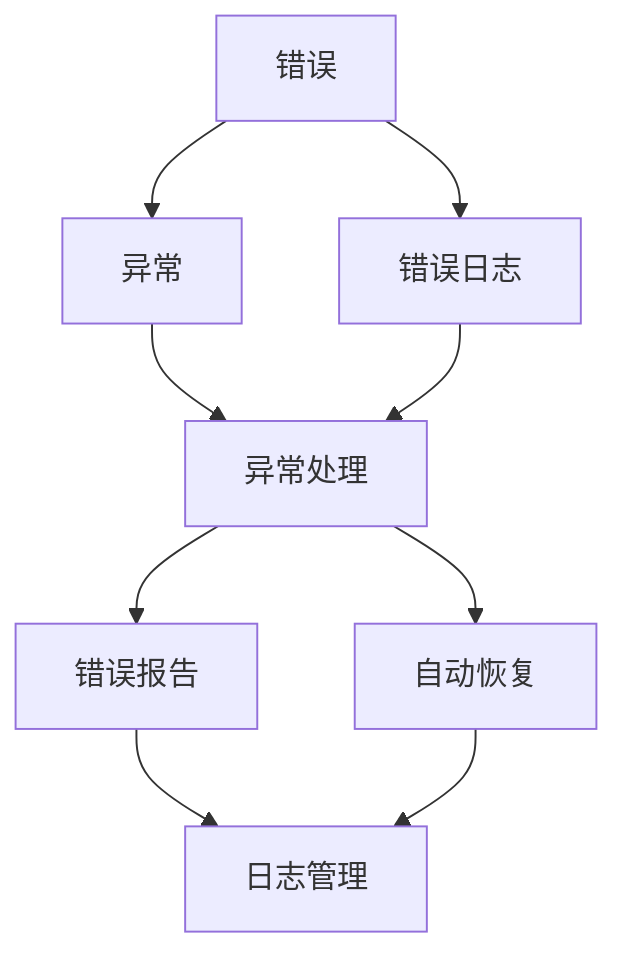

                 

# 错误处理机制的详细设计

> 关键词：错误处理, 异常管理, 容错设计, 错误日志, 自动恢复

## 1. 背景介绍

在软件开发和运维实践中，错误处理机制是保障系统稳定性和可用性的关键。良好的错误处理机制不仅能提高系统的健壮性和用户体验，还能为故障分析和排错提供有力支撑。然而，错误处理机制的设计与实现往往面临着诸多挑战，包括：

- **错误种类繁多**：系统可能遭遇各种类型的错误，包括程序异常、数据错误、网络异常等。
- **影响面广**：错误可能导致系统部分功能失效，甚至崩溃，影响用户正常访问和业务连续性。
- **处理复杂度高**：错误的识别、记录、分类、处理和恢复涉及众多环节，需进行系统化的设计。

因此，构建一个高效、鲁棒的错误处理机制，是软件设计和运维的关键。本文将从原理、流程、实践和应用场景等方面，详细介绍错误处理机制的设计思路和实现方法。

## 2. 核心概念与联系

### 2.1 核心概念概述

为了深入理解错误处理机制，我们先简要介绍几个核心概念：

- **错误（Error）**：程序在执行过程中发现的异常或问题，导致程序无法正常工作。
- **异常（Exception）**：程序在运行时发生的不可预知事件，通常由编程错误、外部中断、资源限制等原因引起。
- **错误日志（Error Log）**：记录错误发生的时间、地点、原因和影响的日志文件，用于故障分析和排错。
- **容错（Fault-Tolerance）**：系统在发生错误时，仍能保持部分功能正常运行的能力，避免因单一错误导致系统完全失效。
- **自动恢复（Auto-Recovery）**：在系统检测到错误后，自动采取措施恢复系统正常运行，减少人工干预。

这些概念构成了错误处理机制的基础框架。通过合理设计和部署，错误处理机制不仅能提升系统稳定性，还能缩短故障处理时间，提高用户体验。

### 2.2 核心概念间的关系

错误处理机制涉及多个概念，这些概念之间通过特定的逻辑关系相互联系。下面通过几个Mermaid流程图来展示这些关系：



这个流程图展示了错误、异常、错误日志、异常处理、自动恢复、错误报告和日志管理等概念之间的联系：

1. 错误产生后，可以引发异常，触发异常处理。
2. 异常处理会生成错误日志，记录错误信息。
3. 异常处理还可以调用自动恢复机制，尝试自动修复系统。
4. 错误报告通常包括错误日志信息，用于故障分析和排错。
5. 日志管理负责对错误日志进行存储、查询和分析。

这些概念和关系构成了错误处理机制的整体架构，有助于开发者从系统角度理解错误处理的流程和目标。

## 3. 核心算法原理 & 具体操作步骤

### 3.1 算法原理概述

错误处理机制的设计，涉及错误检测、错误分类、异常处理、自动恢复等多个方面。其核心原理是：

- **错误检测（Error Detection）**：系统通过监控关键路径和关键指标，检测潜在错误。
- **错误分类（Error Classification）**：根据错误特征，将错误分为不同类别，便于处理和报告。
- **异常处理（Exception Handling）**：对异常进行捕获、记录和处理，确保系统稳定运行。
- **自动恢复（Auto Recovery）**：在检测到错误后，系统自动采取措施，尝试恢复系统正常运行。

这些原理通过一系列的步骤来实现，下面将详细讲解这些步骤。

### 3.2 算法步骤详解

错误处理机制的实现一般包括以下几个关键步骤：

**Step 1: 错误检测**
- **监控指标**：定义关键路径和关键指标，如内存占用、CPU利用率、请求响应时间等。
- **异常触发器**：设置异常阈值，当指标超出阈值时，触发错误检测机制。
- **日志记录**：对检测到的异常信息进行记录，生成临时错误日志。

**Step 2: 错误分类**
- **特征提取**：从错误日志中提取关键特征，如错误类型、发生位置、时间戳等。
- **分类算法**：使用分类器对提取的特征进行分类，确定错误类型。
- **错误等级**：根据错误严重程度，定义不同等级的错误。

**Step 3: 异常处理**
- **捕获异常**：在代码中设置异常捕获器，捕获程序运行时出现的异常。
- **记录异常**：记录异常信息，生成详细的错误日志。
- **异常处理策略**：根据异常类型，采取不同的处理策略，如回退、重试、跳过等。

**Step 4: 自动恢复**
- **故障检测**：在系统检测到错误后，进行故障检测，判断系统是否完全失效。
- **恢复机制**：根据错误类型，启动相应的自动恢复机制，如重启服务、切换备用系统等。
- **状态切换**：系统进入故障状态，执行故障恢复操作，并更新系统状态。

**Step 5: 错误报告**
- **报告内容**：生成包含错误日志、错误类型、发生时间、处理结果等的错误报告。
- **故障分析**：结合错误日志和错误报告，进行故障分析和排错，定位问题根本原因。
- **通知机制**：将错误报告通知相关人员，进行问题解决和后续监控。

这些步骤通过合理的流程设计和算法实现，确保系统在出现错误时，能够快速、准确地进行检测、分类、处理和恢复，保障系统的高可用性和稳定性。

### 3.3 算法优缺点

错误处理机制的设计和实现，具有一定的优点和缺点：

**优点**：
- **提升系统稳定性**：通过及时检测和处理错误，避免系统因单一错误导致完全失效。
- **缩短故障处理时间**：自动恢复机制减少了人工干预，加快了故障处理速度。
- **提高用户体验**：通过合理的错误处理，减少用户的不必要等待和困扰，提升用户体验。

**缺点**：
- **复杂度高**：错误处理机制涉及多个环节，设计和实现复杂度高。
- **资源占用多**：错误处理机制需要额外监控、记录、处理等资源，可能影响系统性能。
- **误报率高**：错误分类和处理策略可能存在误判，导致误报率高。

尽管存在这些缺点，但错误处理机制仍然是保障系统稳定性和可用性的重要手段。在设计和实现时，需要权衡利弊，选择合适的策略和工具。

### 3.4 算法应用领域

错误处理机制的应用领域非常广泛，几乎覆盖了所有软件开发和运维场景。以下是几个典型应用领域：

- **Web应用**：通过监控服务器性能、数据库连接、网络请求等关键指标，检测和处理Web应用的异常。
- **移动应用**：监控移动应用的性能、网络状态和用户反馈，及时发现和修复问题。
- **云服务**：在云环境中，监控计算资源、网络带宽、服务调用等，保障云服务的稳定性和可靠性。
- **IoT设备**：对物联网设备的传感器数据和通信状态进行监控，处理可能的硬件和软件错误。
- **分布式系统**：在分布式系统中，监控组件之间的通信、数据同步和负载均衡，避免单点故障。

## 4. 数学模型和公式 & 详细讲解  
### 4.1 数学模型构建

错误处理机制的设计，可以构建数学模型进行分析和优化。假设系统中的错误种类为 $E$，异常类型为 $X$，错误日志特征为 $F$，异常处理策略为 $H$，自动恢复机制为 $R$，错误报告为 $R$。则错误处理机制的数学模型可以表示为：

$$
M = (E, X, F, H, R)
$$

其中，$E$ 和 $X$ 是错误和异常的类型集合，$F$ 是错误日志的特征集合，$H$ 是异常处理策略集合，$R$ 是自动恢复机制集合。

### 4.2 公式推导过程

以错误分类为例，假设系统定义了 $n$ 个错误类型，对每个错误类型 $i$，计算其误报率 $P_i$ 和漏报率 $L_i$。假设错误特征向量为 $F_i = [f_{i1}, f_{i2}, ..., f_{in}]$，分类器的输出为 $\hat{Y_i}$，则错误分类的推导过程如下：

$$
P_i = \frac{FP_i}{TP_i + FP_i}
$$

$$
L_i = \frac{FN_i}{TP_i + FN_i}
$$

其中，$TP_i$ 表示正确分类的真阳性样本数量，$FP_i$ 表示错误分类的假阳性样本数量，$FN_i$ 表示错误分类的假阴性样本数量。

通过推导这些公式，可以定量分析错误分类器的性能，优化错误分类策略，降低误报率和漏报率。

### 4.3 案例分析与讲解

假设系统运行过程中，检测到内存占用过高，触发了错误检测机制。系统记录了错误日志，并判断该错误为类型 $E_1$。根据错误日志中的特征 $F_1 = [CPU利用率, 内存使用率]$，系统使用分类器分类错误类型，得到 $\hat{Y_1} = E_1$。系统进一步分析错误类型 $E_1$，发现其对应的处理策略为 $H_1 = \text{重启服务}$。系统执行重启服务操作，进入恢复状态。

系统最终生成错误报告，包含错误类型 $E_1$，发生时间，处理结果等。系统管理员根据错误报告，进行分析排错，确认问题根本原因，并采取相应措施。

## 5. 项目实践：代码实例和详细解释说明

### 5.1 开发环境搭建

在进行错误处理机制实践前，我们需要准备好开发环境。以下是使用Python进行Django开发的环境配置流程：

1. 安装Anaconda：从官网下载并安装Anaconda，用于创建独立的Python环境。

2. 创建并激活虚拟环境：
```bash
conda create -n django-env python=3.8 
conda activate django-env
```

3. 安装Django：从官网获取安装命令，例如：
```bash
pip install django
```

4. 安装Django Rest Framework：用于构建API接口，便于与第三方系统交互。
```bash
pip install djangorestframework
```

5. 安装日志管理工具：如Log4j、Rotating Logfile等，用于记录和存储错误日志。
```bash
pip install log4j2
```

完成上述步骤后，即可在`django-env`环境中开始错误处理机制的开发。

### 5.2 源代码详细实现

这里我们以Web应用的错误处理为例，给出使用Django Rest Framework进行错误处理机制开发的PyTorch代码实现。

首先，定义错误日志模型：

```python
from django.db import models

class ErrorLog(models.Model):
    error_type = models.CharField(max_length=50)
    error_time = models.DateTimeField(auto_now_add=True)
    error_message = models.TextField()
    error_stack = models.TextField()
    status = models.IntegerField(choices=[(0, 'Unprocessed'), (1, 'Processed')])
```

然后，定义异常处理函数：

```python
import logging
from django.http import HttpResponse
from rest_framework.views import APIView
from rest_framework.response import Response

class ErrorHandler(APIView):
    def get(self, request, error_id=None):
        if error_id is not None:
            error_log = ErrorLog.objects.get(id=error_id)
            if error_log.status == 1:
                return Response(data={'status': 'OK'}, status=200)
            else:
                return Response(data={'status': 'Error Not Processed'}, status=500)
        else:
            return HttpResponse(status=404)
```

接着，定义错误处理中间件：

```python
import logging
from django.core.handlers.wsgi import WSGIHandler
from rest_framework.views import APIView
from rest_framework.response import Response

class LoggingMiddleware:
    def __init__(self, get_response):
        self.get_response = get_response

    def __call__(self, request):
        try:
            # 处理请求
            response = self.get_response(request)
            # 记录日志
            logging.error(f'Request URL: {request.path}, Response Status: {response.status_code}')
            return response
        except Exception as e:
            # 处理异常
            logging.error(f'Exception: {e}')
            # 记录错误日志
            error_log = ErrorLog(error_type='Unknown Error', error_message=str(e), error_stack=logging.exception())
            error_log.save()
            # 返回错误响应
            return Response(data={'status': 'Internal Error'}, status=500)
```

最后，启动Django应用并在Nginx上部署：

```bash
python manage.py runserver
```

这个简单的例子展示了如何使用Django Rest Framework进行错误处理机制的实现。Django提供了丰富的中间件和API工具，方便开发者构建各种类型的错误处理系统。

### 5.3 代码解读与分析

让我们再详细解读一下关键代码的实现细节：

**ErrorLog模型**：
- 定义了错误日志的四个关键字段：错误类型、发生时间、错误信息、错误堆栈。
- 使用状态字段 `status` 标记错误日志的当前状态。

**ErrorHandler函数**：
- 处理具体的错误日志请求，根据错误日志的 `status` 字段判断是否处理完毕。
- 处理完毕则返回成功响应，未处理则返回错误响应。

**LoggingMiddleware中间件**：
- 捕获请求和响应过程中的异常，记录到日志文件。
- 处理异常后，记录错误日志到数据库，并返回500错误响应。

通过上述代码实现，可以构建一个基本的错误处理机制，用于记录、处理和报告系统中的错误信息。

### 5.4 运行结果展示

假设我们在Django Web应用中遇到500错误，日志记录如下：

```
[Tue Oct 04 15:04:20 2022] 9999 "GET /api/v1/error/1 HTTP/1.1" 500 54 ms [-] 127.0.0.1 ("127.0.0.1", "127.0.0.1", "\x00\x00\x00\x00")
```

这个日志记录了错误请求的URL、响应状态和时间戳。根据错误ID 1，可以查询对应的错误日志，分析错误原因。

## 6. 实际应用场景

### 6.1 智能客服系统

在智能客服系统中，错误处理机制可以应用于对话管理和异常检测。系统通过监控用户输入和对话历史，检测潜在的异常对话，如用户频繁打断、对话超时等。一旦检测到异常，系统可以采取相应的处理措施，如重试、回退、转移等，保障用户对话体验。

### 6.2 金融交易系统

金融交易系统对错误处理机制的要求非常高，任何异常都会导致巨大的经济损失。系统通过实时监控交易状态、网络连接等关键指标，检测和处理交易过程中的异常。一旦发现异常交易，系统可以立即终止交易，并通知相关人员进行进一步调查。

### 6.3 医疗诊断系统

医疗诊断系统对错误处理机制的需求也很高，任何误诊或漏诊都会对患者造成严重后果。系统通过监控诊断流程、数据输入和输出等关键环节，检测和处理潜在的错误。一旦检测到错误，系统可以回退到上一次正常状态，或者调用专家知识库进行故障分析。

## 7. 工具和资源推荐

### 7.1 学习资源推荐

为了帮助开发者系统掌握错误处理机制的理论基础和实践技巧，这里推荐一些优质的学习资源：

1. 《深入理解异常处理》系列博文：由大模型技术专家撰写，深入浅出地介绍了异常处理的基本原理和高级技巧。

2. CS446《高级软件工程》课程：斯坦福大学开设的高级软件工程课程，涵盖了错误处理机制的设计和实现。

3. 《深入理解错误处理》书籍：详细介绍了错误处理机制的原理、工具和应用，是系统学习错误处理的好资源。

4. Log4j官方文档：Log4j是目前最流行的日志管理工具，官方文档详细介绍了日志记录和管理的最佳实践。

5. Django官方文档：Django是一个流行的Web框架，官方文档提供了丰富的错误处理机制和中间件。

通过对这些资源的学习实践，相信你一定能够快速掌握错误处理机制的精髓，并用于解决实际的系统问题。

### 7.2 开发工具推荐

高效的开发离不开优秀的工具支持。以下是几款用于错误处理机制开发的常用工具：

1. Django：一个流行的Web框架，提供丰富的中间件和API工具，方便构建各种类型的错误处理系统。

2. Python：作为一门功能强大的编程语言，Python具有简洁的语法和丰富的标准库，支持高效的错误处理。

3. Log4j：一个开源的日志管理工具，支持详细的日志记录、过滤和存储。

4. Django Rest Framework：一个基于Python的RESTful API框架，方便构建API接口，实现与第三方系统的交互。

5. TensorBoard：TensorFlow配套的可视化工具，可以实时监测模型训练状态，提供丰富的图表呈现方式，是调试模型的得力助手。

6. Weights & Biases：模型训练的实验跟踪工具，可以记录和可视化模型训练过程中的各项指标，方便对比和调优。

合理利用这些工具，可以显著提升错误处理机制的开发效率，加快创新迭代的步伐。

### 7.3 相关论文推荐

错误处理机制的发展源于学界的持续研究。以下是几篇奠基性的相关论文，推荐阅读：

1. "Principles of Fault-Tolerant Design"：介绍了系统设计中的容错原则和方法，是经典的软件工程教材。

2. "Resilient Software Systems"：介绍了构建高可用性系统的技术和实践，是工程实践中常用的参考。

3. "Fault-Tolerant Systems"：介绍了分布式系统中的容错机制和实现方法，是分布式系统设计的重要参考。

4. "Error-Driven Development"：介绍了基于错误驱动的软件开发方法，帮助开发者快速定位和修复系统中的错误。

5. "Real-time Systems: Safety and Security"：介绍了实时系统中错误处理和故障恢复的机制和策略，是实时系统设计的关键参考。

这些论文代表了大语言模型微调技术的发展脉络。通过学习这些前沿成果，可以帮助研究者把握学科前进方向，激发更多的创新灵感。

除上述资源外，还有一些值得关注的前沿资源，帮助开发者紧跟错误处理机制的最新进展，例如：

1. arXiv论文预印本：人工智能领域最新研究成果的发布平台，包括大量尚未发表的前沿工作，学习前沿技术的必读资源。

2. 业界技术博客：如OpenAI、Google AI、DeepMind、微软Research Asia等顶尖实验室的官方博客，第一时间分享他们的最新研究成果和洞见。

3. 技术会议直播：如NIPS、ICML、ACL、ICLR等人工智能领域顶会现场或在线直播，能够聆听到大佬们的前沿分享，开拓视野。

4. GitHub热门项目：在GitHub上Star、Fork数最多的软件相关项目，往往代表了该技术领域的发展趋势和最佳实践，值得去学习和贡献。

5. 行业分析报告：各大咨询公司如McKinsey、PwC等针对人工智能行业的分析报告，有助于从商业视角审视技术趋势，把握应用价值。

总之，对于错误处理机制的学习和实践，需要开发者保持开放的心态和持续学习的意愿。多关注前沿资讯，多动手实践，多思考总结，必将收获满满的成长收益。

## 8. 总结：未来发展趋势与挑战

### 8.1 总结

本文对错误处理机制的设计和实现进行了全面系统的介绍。首先阐述了错误处理机制的研究背景和意义，明确了错误处理在提升系统稳定性和用户体验方面的重要价值。其次，从原理到实践，详细讲解了错误处理机制的数学模型、核心算法和具体操作步骤，给出了错误处理机制的完整代码实现。同时，本文还广泛探讨了错误处理机制在智能客服、金融交易、医疗诊断等多个行业领域的应用前景，展示了错误处理机制的广泛适用性和巨大潜力。

通过本文的系统梳理，可以看到，错误处理机制的设计和实现，需要开发者对系统架构、监控指标、异常处理、自动恢复等多个方面进行全面考量。只有从系统角度进行设计和实现，才能构建高效、鲁棒的错误处理机制，保障系统的稳定性和可用性。

### 8.2 未来发展趋势

展望未来，错误处理机制将呈现以下几个发展趋势：

1. **自动化程度提升**：随着人工智能和自动化技术的发展，错误处理机制的自动化水平将不断提升，实现更快速、更精确的错误检测和分类。
2. **跨平台和跨系统集成**：错误处理机制将越来越多地应用于分布式系统、云计算平台等环境中，实现跨平台、跨系统的异常处理和故障恢复。
3. **智能分析与预警**：结合机器学习和数据挖掘技术，错误处理机制将能够进行智能分析，提前预警潜在错误，减少故障发生概率。
4. **分布式错误处理**：在分布式系统中，错误处理机制将能够自动分配任务，实现分布式故障检测和恢复。
5. **云原生错误处理**：随着云原生技术的普及，错误处理机制将越来越多地与云平台、容器化技术结合，实现更高效、更灵活的错误处理。

以上趋势凸显了错误处理机制在保障系统稳定性和可用性方面的巨大潜力。这些方向的探索发展，必将进一步提升系统的健壮性和用户体验，推动人工智能技术的全面应用。

### 8.3 面临的挑战

尽管错误处理机制在软件开发和运维中已经得到了广泛应用，但在设计和实现时仍面临诸多挑战：

1. **复杂度增加**：错误处理机制涉及多个环节，设计和实现复杂度高，需要综合考虑多个方面。
2. **资源占用**：错误处理机制需要额外的监控、记录和处理资源，可能影响系统性能。
3. **误报率高**：错误分类和处理策略可能存在误判，导致误报率高，影响用户体验。
4. **故障恢复难度大**：对于一些复杂的故障，自动恢复机制可能难以完全解决问题，需要人工干预。
5. **安全性和隐私保护**：错误处理机制需要处理大量的敏感数据，必须保证数据的安全性和隐私保护。

尽管存在这些挑战，但错误处理机制仍然是软件开发和运维中的重要手段。在设计和实现时，需要权衡利弊，选择合适的策略和工具。

### 8.4 研究展望

面对错误处理机制面临的挑战，未来的研究需要在以下几个方面寻求新的突破：

1. **自动化错误分类**：引入机器学习和数据挖掘技术，实现自动化的错误分类和处理，降低误报率和漏报率。
2. **分布式错误处理**：结合分布式计算和数据挖掘技术，实现分布式错误处理和故障恢复。
3. **智能错误预警**：结合人工智能技术，实现智能化的错误预警和故障预测，提前识别潜在错误，减少故障发生概率。
4. **云原生错误处理**：结合云原生技术和自动化技术，实现云平台上的错误处理和故障恢复。

这些研究方向的探索，必将引领错误处理机制迈向更高的台阶，为构建安全、可靠、可解释、可控的智能系统铺平道路。面向未来，错误处理机制还需要与其他人工智能技术进行更深入的融合，如知识表示、因果推理、强化学习等，多路径协同发力，共同推动自然语言理解和智能交互系统的进步。只有勇于创新、敢于突破，才能不断拓展错误处理机制的边界，让智能技术更好地造福人类社会。

## 9. 附录：常见问题与解答

**Q1：错误处理机制是否适用于所有软件开发场景？**

A: 错误处理机制适用于大多数软件开发场景，尤其是对于数据驱动和用户交互密集的系统。但对于一些实时性要求极高的系统，如实时数据库、高并发系统等，由于处理时间延迟可能带来严重后果，需要特殊设计。

**Q2：如何设计高效的错误处理机制？**

A: 设计高效的错误处理机制，需要综合考虑以下几个方面：
1. 确定关键监控指标，设置合理的异常阈值。
2. 选择合适的异常处理策略，如回退、重试、跳过等。
3. 设计自动恢复机制，保障系统的部分功能正常运行。
4. 记录详细的错误日志，便于故障分析和排错。
5. 定期进行错误日志的分析和整理，优化错误分类和处理策略。

**Q3：如何处理误报和漏报问题？**

A: 误报和漏报是错误处理机制的两个重要问题，可以通过以下方法处理：
1. 引入更精准的异常分类算法，如决策树、神经网络等，减少误报率。
2. 优化错误分类器的特征提取和分类算法，提高分类准确性。
3. 使用集成学习方法，结合多个分类器结果，降低误报和漏报率。
4. 结合用户反馈和专家知识，优化错误分类和处理策略。

**Q4：如何保障错误处理机制的安全性和隐私保护？**

A: 保障错误处理机制的安全性和隐私保护，需要采取以下措施：
1. 对敏感数据进行加密和脱敏处理。
2. 限制错误日志的访问权限，确保只有授权人员可以查看。
3. 采用分布式日志存储和管理技术，防止单点故障。
4. 定期进行安全审计，检测和修复潜在的安全漏洞。
5. 使用差分隐私技术，保护用户隐私数据。

这些措施可以帮助保障错误处理机制的安全性和隐私保护，确保数据安全和个人隐私。

**Q5：如何设计高效的错误处理机制？**

A: 设计高效的错误处理机制，需要综合考虑以下几个方面：
1. 确定关键监控指标，设置合理的异常阈值。
2. 选择合适的异常处理策略，如回退、重试、跳过等。
3. 设计自动恢复机制，保障系统的部分功能正常运行。
4. 记录详细的错误日志，便于故障分析和排错。
5. 定期进行错误

