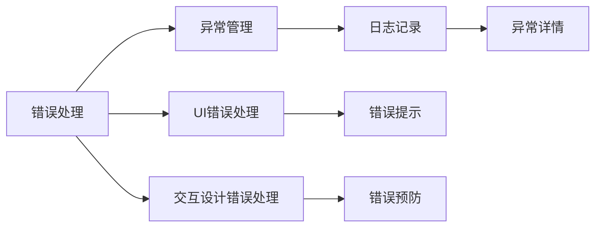
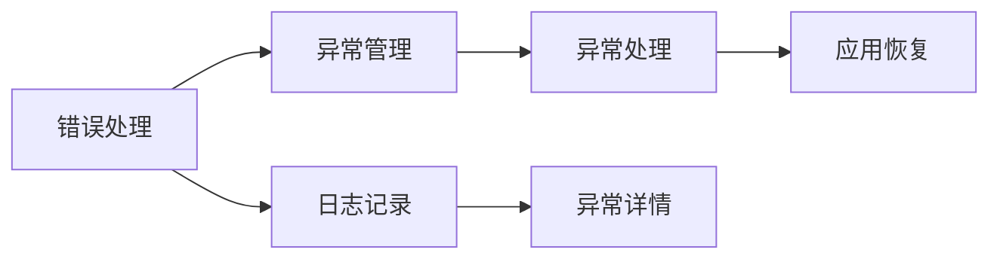
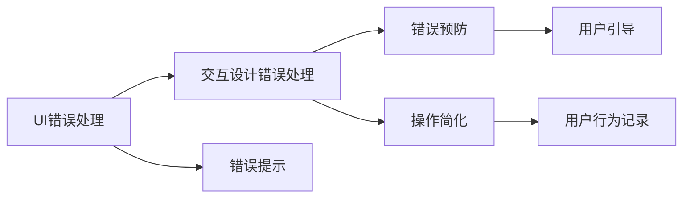
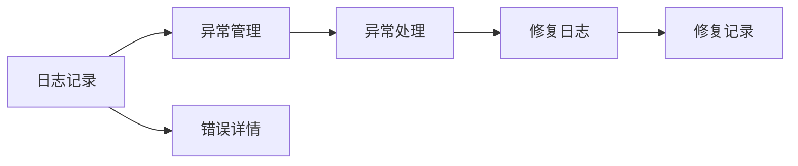
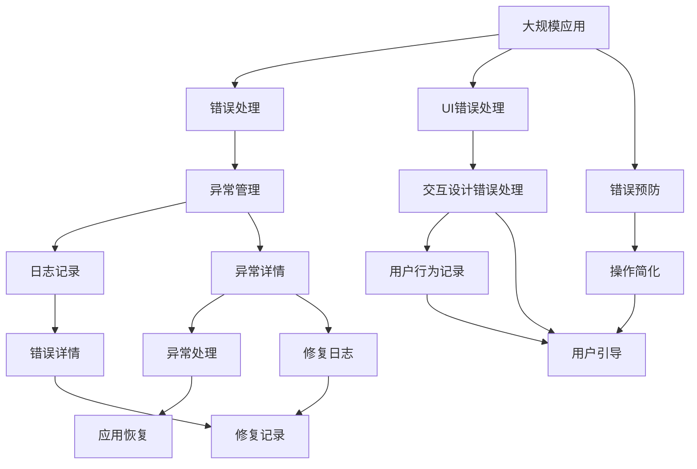

                 

# 错误处理：提供更好的用户体验

> 关键词：
- 错误处理
- 用户体验
- 异常管理
- 用户界面(UI)
- 交互设计
- 反馈机制
- 错误日志

## 1. 背景介绍

在现代软件开发中，错误处理已经成为为用户提供良好用户体验不可或缺的一部分。一个稳定、可靠的应用程序可以帮助用户减少挫败感，提高使用频率，从而促进业务增长。同时，错误处理还可以帮助开发团队更快地定位问题，优化产品，从而提升开发效率。

然而，错误处理绝非易事。实践中，很多应用在错误处理方面做得远远不够，导致用户频繁遇到“失败”的体验。本文将系统梳理错误处理的理论基础和实践方法，帮助开发者构建更加稳定、高效的错误处理机制，提升用户体验。

## 2. 核心概念与联系

### 2.1 核心概念概述

为更好地理解错误处理，本节将介绍几个密切相关的核心概念：

- **错误处理(Error Handling)**：指在应用中检测、报告和解决错误的机制。错误处理的核心目标是捕获和处理异常，防止应用崩溃，提升用户体验。
- **异常管理(Exception Management)**：指在错误发生时，捕获异常并采取相应措施的过程。异常管理关注如何有效地捕获异常，如何优雅地处理异常，并如何防止异常的传播。
- **用户界面(UI)错误处理**：指如何设计UI，以告知用户发生了错误，并提供有用的帮助信息。好的UI错误处理设计可以显著提升用户体验，帮助用户快速定位和解决问题。
- **交互设计(Interactive Design)错误处理**：指如何设计交互流程，以最小化错误发生的可能性，并在错误发生时提供清晰的指导。交互设计错误处理强调从源头上减少错误，降低用户操作复杂度。
- **错误日志(Error Log)**：指记录错误发生时应用的上下文信息，包括错误类型、位置、时间戳等。错误日志对于诊断和修复错误至关重要，也是开发团队记录产品性能的关键工具。

这些概念之间的联系可以通过以下Mermaid流程图来展示：



这个流程图展示了一系列错误处理相关的概念及其之间的关系：

1. 错误处理通过异常管理捕获异常，并记录错误日志。
2. UI错误处理通过错误提示告知用户错误发生，并提供帮助信息。
3. 交互设计错误处理通过预防错误和简化流程，最小化错误的发生。
4. 日志记录保存异常详情，供开发团队诊断和修复。

### 2.2 概念间的关系

这些核心概念之间存在着紧密的联系，形成了错误处理系统的完整生态系统。下面我们通过几个Mermaid流程图来展示这些概念之间的关系。

#### 2.2.1 错误处理与异常管理



这个流程图展示了一个错误处理系统的基本流程：

1. 错误处理通过异常管理捕获异常，并记录日志。
2. 异常管理对捕获的异常进行详细处理，并可能采取修复措施。
3. 日志记录保存异常详情，供后续分析使用。

#### 2.2.2 UI错误处理与交互设计错误处理



这个流程图展示了UI错误处理和交互设计错误处理的关系：

1. 交互设计错误处理通过预防错误和简化流程，最小化错误的发生。
2. UI错误处理通过错误提示告知用户错误发生，并提供帮助信息。
3. 错误预防和操作简化可以显著减少错误发生的可能性。
4. 用户引导和操作简化可以帮助用户快速定位和解决问题。

#### 2.2.3 日志记录在错误处理中的作用



这个流程图展示了日志记录在错误处理中的作用：

1. 日志记录保存异常详情，供异常管理使用。
2. 异常管理对捕获的异常进行详细处理，并可能采取修复措施。
3. 修复日志记录修复过程，便于后续分析。
4. 错误详情和修复日志有助于开发团队诊断和修复问题。

### 2.3 核心概念的整体架构

最后，我们用一个综合的流程图来展示这些核心概念在大规模错误处理系统中的整体架构：



这个综合流程图展示了从应用层到错误处理系统各层面的整体架构：

1. 错误处理通过异常管理捕获异常，并记录日志。
2. UI错误处理和交互设计错误处理通过错误提示、用户引导和操作简化，提升用户体验。
3. 日志记录保存异常详情，供异常管理和开发团队诊断和修复使用。
4. 错误预防和操作简化可以最小化错误的发生。
5. 异常管理对捕获的异常进行详细处理，并可能采取修复措施。
6. 修复日志记录修复过程，便于后续分析。

## 3. 核心算法原理 & 具体操作步骤
### 3.1 算法原理概述

错误处理的核心是异常管理。异常管理通过捕获、记录和处理异常，确保应用的稳定运行。在实际应用中，异常管理通常包括以下几个步骤：

1. **异常检测**：检测应用运行过程中是否发生了异常。
2. **异常分类**：根据异常的类型和严重程度，将异常分为不同级别。
3. **异常处理**：针对不同级别的异常，采取相应的处理措施。
4. **异常恢复**：在异常处理后，恢复应用至正常运行状态。

### 3.2 算法步骤详解

#### 3.2.1 异常检测

异常检测是异常管理的第一步，通常通过以下几种方式实现：

1. **断言(Assertion)**：在代码中使用断言来检测逻辑错误。断言在代码运行时检查条件是否满足，如果条件不满足，则抛出异常。
2. **异常处理框架**：使用如Python的try-except结构、Java的try-catch结构等框架，捕获可能出现的异常。
3. **日志监控**：通过日志监控系统，实时监测应用的运行状态，检测异常的发生。

#### 3.2.2 异常分类

异常分类的目的是将不同类型的异常进行区分，以便采取不同的处理措施。常见的异常分类方式包括：

1. **严重性级别(Severity Level)**：将异常分为致命错误(Fatal)、严重错误(Serious)、一般错误(Warning)和信息性错误(Info)。
2. **异常类型(Type)**：根据异常的类别（如网络异常、数据库异常、逻辑异常等）进行分类。
3. **上下文信息(Context)**：记录异常发生的时间和位置，提供更多上下文信息。

#### 3.2.3 异常处理

异常处理是异常管理的关键步骤，通常通过以下几种方式实现：

1. **日志记录**：将异常详情记录到日志中，便于后续分析。
2. **通知用户**：通过UI和交互设计，告知用户发生了什么错误，并提供有用的帮助信息。
3. **异常回滚**：在异常发生时，回滚至之前的稳定状态，防止应用崩溃。
4. **故障转移**：在异常处理过程中，自动将请求转移到备用系统或服务。

#### 3.2.4 异常恢复

异常恢复的目的是在异常处理后，恢复应用至正常运行状态，具体步骤包括：

1. **修复异常**：针对具体异常，采取相应的修复措施。
2. **更新状态**：更新应用状态，确保系统恢复正常。
3. **通知用户**：在异常恢复后，告知用户问题已经解决，可以继续使用应用。

### 3.3 算法优缺点

异常管理在提升用户体验方面具有以下几个优点：

1. **防止应用崩溃**：及时捕获和处理异常，防止应用意外崩溃，提升用户体验。
2. **提供有用的帮助信息**：通过UI和交互设计，提供有用的错误提示和帮助信息，让用户快速定位和解决问题。
3. **优化系统性能**：通过日志记录和异常回滚，优化系统性能，提升系统的稳定性和可靠性。

然而，异常管理也存在一些缺点：

1. **性能开销**：异常处理需要额外的时间和资源，可能会影响应用的性能。
2. **复杂度增加**：异常管理增加了系统的复杂度，可能会引入新的问题和漏洞。
3. **过度处理**：过多的异常处理可能导致用户体验反而变得更差，增加用户的学习成本。

### 3.4 算法应用领域

异常管理在软件开发和系统运维中有着广泛的应用，具体包括：

1. **Web应用**：检测和处理Web应用的异常，包括HTTP错误、数据库错误、逻辑错误等。
2. **移动应用**：检测和处理移动应用的异常，包括网络错误、设备错误、应用错误等。
3. **桌面应用**：检测和处理桌面应用的异常，包括系统错误、文件错误、用户输入错误等。
4. **嵌入式系统**：检测和处理嵌入式系统的异常，包括硬件错误、驱动程序错误、配置错误等。
5. **物联网系统**：检测和处理物联网设备的异常，包括传感器错误、通信错误、资源错误等。

## 4. 数学模型和公式 & 详细讲解  
### 4.1 数学模型构建

异常管理的数学模型主要涉及异常检测、异常分类、异常处理和异常恢复四个方面。

#### 4.1.1 异常检测模型

异常检测模型主要关注如何检测应用运行过程中的异常。常用的异常检测模型包括：

1. **基于规则的异常检测**：根据预设的规则，检测异常的发生。规则可以是断言、正则表达式等。
2. **基于模型的异常检测**：使用机器学习模型检测异常的发生，如时间序列分析、聚类分析等。
3. **基于日志的异常检测**：通过分析日志文件中的模式，检测异常的发生。

#### 4.1.2 异常分类模型

异常分类模型主要关注如何将不同类型的异常进行区分。常用的异常分类模型包括：

1. **基于决策树的异常分类**：使用决策树算法对异常进行分类，根据特征（如错误类型、严重性级别、上下文信息等）进行划分。
2. **基于支持向量机的异常分类**：使用支持向量机算法对异常进行分类，根据特征向量（如异常时间、异常位置等）进行划分。
3. **基于深度学习的异常分类**：使用深度学习模型对异常进行分类，如卷积神经网络、循环神经网络等。

#### 4.1.3 异常处理模型

异常处理模型主要关注如何对不同类型的异常采取不同的处理措施。常用的异常处理模型包括：

1. **基于规则的异常处理**：根据预设的规则，对异常进行分类和处理。
2. **基于策略的异常处理**：根据不同的策略（如回滚、通知、转移等）对异常进行处理。
3. **基于深度学习的异常处理**：使用深度学习模型对异常进行处理，如生成对抗网络等。

#### 4.1.4 异常恢复模型

异常恢复模型主要关注如何在异常处理后，恢复应用至正常运行状态。常用的异常恢复模型包括：

1. **基于回滚的异常恢复**：通过回滚至之前的稳定状态，恢复应用至正常运行状态。
2. **基于故障转移的异常恢复**：在异常发生时，自动将请求转移到备用系统或服务。
3. **基于重试的异常恢复**：在异常处理后，自动重试失败的请求，确保请求成功。

### 4.2 公式推导过程

以异常检测模型为例，常用的基于规则的异常检测方法包括：

1. **断言检测**：使用Python中的`assert`语句检测条件是否满足，如果条件不满足，则抛出异常。

   $$
   \begin{equation}
   \text{assertion检测} = \begin{cases}
   0, & \text{条件满足} \\
   1, & \text{条件不满足}
   \end{cases}
   \end{equation}
   $$

2. **正则表达式检测**：使用正则表达式检测文本中的模式，如果模式不匹配，则抛出异常。

   $$
   \begin{equation}
   \text{正则表达式检测} = \begin{cases}
   0, & \text{模式匹配} \\
   1, & \text{模式不匹配}
   \end{cases}
   \end{equation}
   $$

3. **日志文件检测**：通过分析日志文件中的模式，检测异常的发生。

   $$
   \begin{equation}
   \text{日志文件检测} = \begin{cases}
   0, & \text{异常未发生} \\
   1, & \text{异常发生}
   \end{cases}
   \end{equation}
   $$

### 4.3 案例分析与讲解

以一个简单的Web应用为例，演示异常处理的基本流程：

1. **异常检测**：在Web应用中使用断言检测用户输入是否合法，如检测输入是否为空、是否符合格式要求等。
2. **异常分类**：根据异常的类型和严重程度，将异常分为致命错误、严重错误、一般错误和信息性错误。
3. **异常处理**：在异常发生时，记录异常详情，并通知用户发生了什么错误，提供有用的帮助信息。
4. **异常恢复**：在异常处理后，恢复应用至正常运行状态，确保用户可以继续使用Web应用。

## 5. 项目实践：代码实例和详细解释说明
### 5.1 开发环境搭建

在进行异常处理实践前，我们需要准备好开发环境。以下是使用Python进行Flask开发的环境配置流程：

1. 安装Python：从官网下载并安装Python 3.8版本。
2. 安装Flask：使用pip安装Flask框架，命令如下：

   ```bash
   pip install Flask
   ```

3. 安装SQLAlchemy：Flask中常用到的ORM工具，用于数据库操作。

   ```bash
   pip install SQLAlchemy
   ```

4. 安装Flask-RESTful：用于构建RESTful API接口。

   ```bash
   pip install Flask-RESTful
   ```

5. 安装Flask-CORS：用于处理跨域请求。

   ```bash
   pip install Flask-CORS
   ```

完成上述步骤后，即可在开发环境中进行异常处理实践。

### 5.2 源代码详细实现

下面是一个简单的Flask应用示例，演示了如何实现基本的异常处理功能。

```python
from flask import Flask, request, jsonify
from flask_restful import Resource, Api
from sqlalchemy import create_engine
from sqlalchemy.orm import sessionmaker
from sqlalchemy.ext.declarative import declarative_base

# 初始化Flask应用
app = Flask(__name__)
api = Api(app)

# 初始化数据库连接
engine = create_engine('sqlite:///database.db')
Base = declarative_base()

# 定义数据模型
class User(Base):
    __tablename__ = 'users'

    id = Column(Integer, primary_key=True)
    username = Column(String)
    password = Column(String)

# 创建会话
Session = sessionmaker(bind=engine)

# 定义异常处理类
class ExceptionHandler(Resource):
    def post(self):
        try:
            data = request.get_json()
            username = data['username']
            password = data['password']
            session = Session()
            user = session.query(User).filter_by(username=username, password=password).first()
            if user:
                return jsonify({'message': '登录成功'})
            else:
                raise ValueError('用户名或密码错误')
        except ValueError as e:
            return jsonify({'message': str(e)}), 400

# 定义API接口
api.add_resource(ExceptionHandler, '/exception')

if __name__ == '__main__':
    app.run(debug=True)
```

这个简单的Flask应用实现了一个登录接口，使用SQLAlchemy连接SQLite数据库，并定义了一个异常处理类。在异常处理类中，使用try-except结构捕获用户输入错误，并在异常发生时返回有用的错误信息。

### 5.3 代码解读与分析

让我们再详细解读一下关键代码的实现细节：

**Flask应用初始化**：
- `Flask`：初始化Flask应用。
- `Api`：初始化RESTful API接口。
- `create_engine`：创建SQLite数据库连接。
- `declarative_base`：定义数据模型。
- `sessionmaker`：创建会话。

**数据模型**：
- `User`类：定义用户数据模型，包括用户名和密码。

**异常处理类**：
- `ExceptionHandler`类：定义异常处理逻辑，使用try-except结构捕获用户输入错误，并在异常发生时返回有用的错误信息。

**API接口**：
- `/api/exception`：定义异常处理的API接口，通过POST请求提交用户名和密码，返回登录结果或错误信息。

**应用运行**：
- `if __name__ == '__main__':`：在应用运行时，调用`app.run(debug=True)`启动Flask应用。

可以看到，Flask框架提供了简单易用的异常处理机制，使得开发者可以快速构建和部署异常处理应用。在实际开发中，还需要根据具体业务场景，灵活组合各种异常处理方式，以应对各种不同类型的异常。

### 5.4 运行结果展示

假设我们运行上述Flask应用，并尝试提交无效的用户名和密码，将收到以下错误信息：

```json
{
  "message": "用户名或密码错误"
}
```

这个错误信息清晰地告知了用户发生了什么错误，并提供了有用的帮助信息，帮助用户快速定位和解决问题。

## 6. 实际应用场景
### 6.1 智能客服系统

智能客服系统需要处理大量的用户请求，错误处理是提升用户体验的关键环节。在智能客服系统中，错误处理主要涉及以下方面：

1. **输入验证**：对用户输入的文本、语音、图片等数据进行验证，防止无效输入。
2. **业务逻辑错误**：在处理用户请求时，检测业务逻辑错误，如资源不存在、请求格式错误等。
3. **系统异常**：在处理请求时，检测系统异常，如数据库连接错误、网络错误等。

**智能客服系统的错误处理**：

1. **输入验证**：使用正则表达式检测用户输入是否符合格式要求，如是否为合法的电话号码、身份证号等。
2. **业务逻辑错误**：检测请求中的业务逻辑错误，如是否存在无效参数、是否符合业务规则等。
3. **系统异常**：检测系统异常，如数据库连接错误、网络错误等。

**实际应用案例**：

- **输入验证**：在智能客服系统中，使用正则表达式检测用户输入的身份证号码是否合法，防止用户输入无效的身份证号。
- **业务逻辑错误**：在处理用户请求时，检测请求中的业务逻辑错误，如是否存在无效参数、是否符合业务规则等。
- **系统异常**：在处理请求时，检测系统异常，如数据库连接错误、网络错误等，并采取相应的处理措施。

### 6.2 金融舆情监测

金融舆情监测系统需要实时监控市场舆论动向，错误处理是确保系统稳定运行的关键环节。在金融舆情监测系统中，错误处理主要涉及以下方面：

1. **数据采集错误**：检测数据采集错误，如数据格式错误、数据缺失等。
2. **算法错误**：检测算法错误，如模型参数错误、算法实现错误等。
3. **系统异常**：检测系统异常，如网络错误、数据库错误等。

**金融舆情监测系统的错误处理**：

1. **数据采集错误**：检测数据采集错误，如数据格式错误、数据缺失等，并采取相应的处理措施。
2. **算法错误**：检测算法错误，如模型参数错误、算法实现错误等，并采取相应的处理措施。
3. **系统异常**：检测系统异常，如网络错误、数据库错误等，并采取相应的处理措施。

**实际应用案例**：

- **数据采集错误**：在金融舆情监测系统中，检测数据采集错误，如数据格式错误、数据缺失等，并采取相应的处理措施，确保数据完整性和准确性。
- **算法错误**：在金融舆情监测系统中，检测算法错误，如模型参数错误、算法实现错误等，并采取相应的处理措施，确保算法模型的稳定性和可靠性。
- **系统异常**：在金融舆情监测系统中，检测系统异常，如网络错误、数据库错误等，并采取相应的处理措施，确保系统稳定运行。

### 6.3 个性化推荐系统

个性化推荐系统需要处理用户的行为数据，错误处理是提升用户体验和推荐效果的关键环节。在个性化推荐系统中，错误处理主要涉及以下方面：

1. **用户行为错误**：检测用户行为错误，如用户行为数据缺失、用户行为数据异常等。
2. **推荐算法错误**：检测推荐算法错误，如推荐算法实现错误、推荐算法参数错误等。
3. **系统异常**：检测系统异常，如系统资源错误、网络错误等。

**个性化推荐系统的错误处理**：

1. **用户行为错误**：检测用户行为错误，如用户行为数据缺失、用户行为数据异常等，并采取相应的处理措施。
2. **推荐算法错误**：检测推荐算法错误，如推荐算法实现错误、推荐算法参数错误等，并采取相应的处理措施。
3. **系统异常**：检测系统异常，如系统资源错误、网络错误等，并采取相应的处理措施。

**实际应用案例**：

- **用户行为错误**：在个性化推荐系统中，检测用户行为数据缺失、用户行为数据异常等错误，并采取相应的处理措施，确保用户行为数据完整性和准确性。
- **推荐算法错误**：在个性化推荐系统中，检测推荐算法实现错误、推荐算法参数错误等错误，并采取相应的处理措施，确保推荐算法模型的稳定性和可靠性。
- **系统异常**：在个性化推荐系统中，检测系统异常，如系统资源错误、网络错误等，并采取相应的处理措施，确保系统稳定运行。

### 6.4 未来应用展望

随着技术的发展，错误处理的应用领域将更加广泛，未来可能涉及以下方面：

1. **自适应错误处理**：通过机器学习算法，自适应地调整异常检测和分类策略，提高错误处理的准确性和效率。
2. **多渠道错误处理**：在多种渠道（如Web、移动应用、物联网设备等）中实现统一的错误处理机制，提升用户体验。
3. **智能错误预测**：通过数据分析和机器学习算法，预测潜在的错误发生，提前采取预防措施，减少错误的发生。
4. **跨领域错误处理**：在跨领域的应用中，实现统一的错误处理机制，确保系统在不同场景下的一致性。

总之，错误处理将在未来的人工智能系统中发挥越来越重要的作用，成为提升用户体验和系统稳定性的关键技术。随着技术的不断进步，错误处理将变得更加智能、灵活和高效，为人类社会带来更多的便利和福利。

## 7. 工具和资源推荐
### 7.1 学习资源推荐

为了帮助开发者系统掌握异常处理的理论基础和实践方法，这里推荐一些优质的学习资源：

1. **《异常处理最佳实践指南》**：由HackerRank提供的一本关于异常处理的书籍，介绍了各种异常处理的技术和最佳实践，适合初学者入门。
2. **《Python异常处理指南》**：一本详细讲解Python异常处理的书籍，介绍了Python中各种异常处理的技术和最佳实践，适合有一定经验的开发者阅读。
3. **《异常处理技巧与实践》**：一本关于异常处理的技术文章集，涵盖了各种异常处理的技术和实践案例，适合进阶开发者阅读。
4. **《Java异常处理指南》**：一本详细讲解Java异常处理的书籍，介绍了Java中各种异常处理的技术和最佳实践，适合Java开发者阅读。
5. **《C++异常处理指南》：一本详细讲解C++异常处理的书籍，介绍了C++中各种异常处理的技术和最佳实践，适合C++开发者阅读。

通过对这些资源的学习实践，相信你一定能够快速掌握异常处理的精髓，并用于解决实际的开发问题。

### 7.2 开发工具推荐

高效的开发离不开优秀的工具支持。以下是几款用于异常处理开发的常用工具：

1. **Visual Studio Code**：一款轻量级且功能强大的IDE，提供了丰富的异常处理插件和工具，支持多种编程语言。
2. **PyCharm**：一款面向Python开发的IDE，提供了丰富的异常处理工具和插件，支持异常处理最佳实践。
3. **Eclipse**：一款面向Java开发的IDE，提供了丰富的异常处理工具和插件，支持异常处理最佳实践。
4. **Xcode**：一款面向C++开发的IDE，提供了丰富的异常处理工具和插件，支持异常处理最佳实践。
5. **IntelliJ IDEA**：一款支持多种编程语言的IDE，提供了丰富的异常处理工具和插件，支持异常处理最佳实践。

合理利用这些工具，可以显著提升异常处理的开发效率，加快创新

