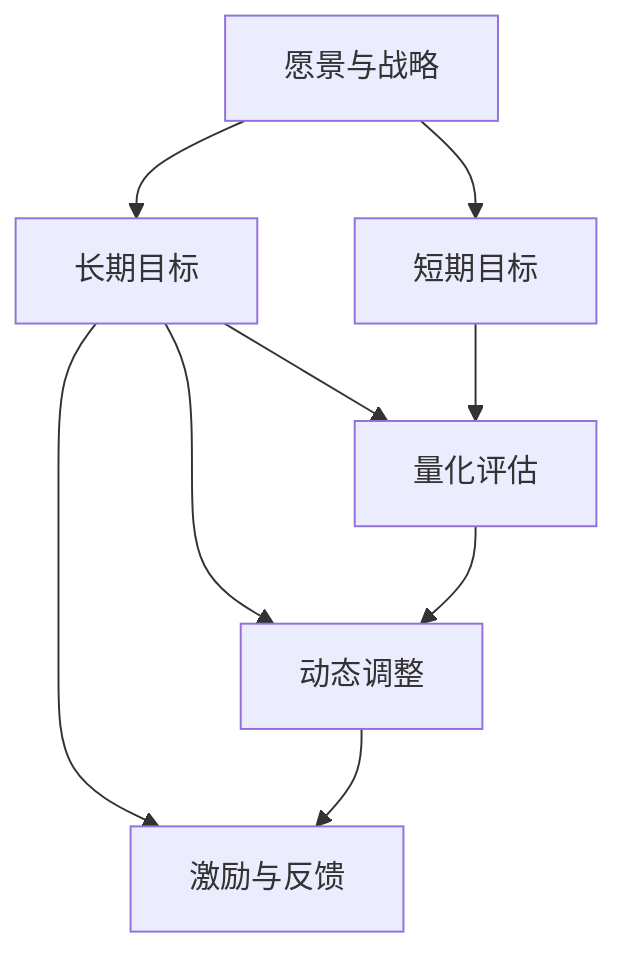

                 

## 1. 背景介绍

### 1.1 问题由来

在当前高速发展的信息化社会，企业的长期目标管理面临诸多挑战。企业需要持续不断地适应变化，把握趋势，以保持竞争优势。然而，传统的目标管理方法如KPI（关键绩效指标）、OKR（目标与关键结果）等，往往只关注短期结果，缺乏对长期目标的系统性管理。这使得企业在追求短期利益的同时，可能忽视了长期战略规划的重要性。

### 1.2 问题核心关键点

长期目标管理的关键在于构建一种系统化、持续性的目标管理机制，以确保企业在追求短期利益的同时，也不断推动长期战略的实现。该机制需要具备以下几个核心要素：

1. **愿景与战略**：明确企业的长期愿景和战略方向，作为目标管理的指导原则。
2. **动态调整**：根据内外部环境变化，灵活调整短期和长期目标，保持动态平衡。
3. **量化评估**：采用科学的量化方法，对目标达成情况进行客观评估。
4. **激励与反馈**：建立正向激励机制，及时反馈目标执行情况，激发员工积极性。

### 1.3 问题研究意义

研究长期目标管理的意识机制，对于企业保持竞争力和可持续发展具有重要意义：

1. **战略连贯性**：通过系统性的长期目标管理，确保短期目标与长期战略方向一致，避免资源浪费。
2. **风险控制**：通过量化评估和动态调整，及时发现和应对潜在风险，保障企业稳健发展。
3. **员工激励**：通过科学的激励机制和及时的反馈，提升员工参与度和工作积极性，增强团队凝聚力。
4. **市场应变**：在快速变化的市场环境中，灵活调整目标，快速响应市场变化，保持竞争优势。

## 2. 核心概念与联系

### 2.1 核心概念概述

在长期目标管理中，涉及几个关键概念：

- **愿景与战略（Vision & Strategy）**：企业长远发展的方向和目标。
- **长期目标（Long-term Goals）**：企业为实现愿景和战略设定的一系列中期和长期的定量目标。
- **短期目标（Short-term Goals）**：为了实现长期目标而设定的近期目标，通常具有时间上的具体性。
- **量化评估（Quantitative Assessment）**：通过科学的量化方法，对目标达成情况进行客观评估。
- **动态调整（Dynamic Adjustment）**：根据内外部环境变化，灵活调整目标，保持动态平衡。
- **激励与反馈（Incentives & Feedback）**：建立正向激励机制，及时反馈目标执行情况，激发员工积极性。

这些概念之间存在着紧密的联系，形成了一个系统化的长期目标管理框架。通过清晰界定这些概念，可以构建一个完整且有效的长期目标管理机制。

### 2.2 概念间的关系

这些核心概念之间的关系可以通过以下Mermaid流程图来展示：



这个流程图展示了一个完整的长期目标管理流程，从愿景与战略出发，经过长期目标和短期目标设定，到量化评估和动态调整，最终通过激励与反馈机制，形成闭环。通过这个流程，企业可以实现长期战略和短期目标的有机结合，确保目标的科学性和可行性。

## 3. 核心算法原理 & 具体操作步骤

### 3.1 算法原理概述

长期目标管理的核心算法原理在于构建一个系统化的目标设定、量化评估和动态调整机制，以确保目标的科学性和可行性。该算法主要包括以下几个步骤：

1. **愿景与战略制定**：基于企业使命和市场需求，制定长期愿景和战略方向。
2. **目标分解**：将长期愿景和战略转化为具体的中长期目标，并进行分解。
3. **量化评估**：采用科学的量化方法，对目标达成情况进行评估。
4. **动态调整**：根据评估结果和环境变化，灵活调整目标。
5. **激励与反馈**：建立正向激励机制，及时反馈目标执行情况。

### 3.2 算法步骤详解

#### 3.2.1 愿景与战略制定

**步骤1**：基于企业使命和市场需求，制定长期愿景和战略方向。

愿景是企业长期发展的前景和方向，需具备前瞻性和可实现性。战略则是实现愿景的具体路径和方法。制定愿景与战略时，需进行广泛的市场调研和内部讨论，确保其科学性和可操作性。

**步骤2**：明确关键成功因素(KPIs)。

关键成功因素是指实现愿景和战略的关键指标，如市场份额、收入增长、客户满意度等。这些指标需具备明确性、可量化性和可操作性，以便后续进行量化评估和动态调整。

#### 3.2.2 目标分解

**步骤3**：将长期愿景和战略转化为具体的中长期目标。

中长期目标通常包括3-5年的目标，需具备具体性、可量化性和可操作性。通过SMART原则（Specific、Measurable、Achievable、Relevant、Time-bound），确保目标设定科学合理。

**步骤4**：进一步分解为短期目标。

短期目标通常为年度或季度目标，需具备具体性、可量化性和可操作性。通过分解，将中长期目标转化为具体可执行的任务，以便在实践中逐步推进。

#### 3.2.3 量化评估

**步骤5**：采用科学的量化方法，对目标达成情况进行评估。

量化评估需采用科学的方法和工具，如平衡计分卡(BSC)、OKR等，确保评估结果的客观性和可比性。评估时需考虑内外部环境变化，确保评估的全面性和准确性。

**步骤6**：分析评估结果，找出改进点。

通过分析评估结果，找出目标达成过程中存在的问题和改进点，为动态调整提供依据。评估结果需透明公开，以便全员参与和改进。

#### 3.2.4 动态调整

**步骤7**：根据评估结果和环境变化，灵活调整目标。

动态调整需根据内外部环境变化，灵活调整短期和长期目标。调整时需考虑长期愿景和战略方向，确保调整的科学性和可行性。

**步骤8**：重新设定目标并分解任务。

根据调整后的目标，重新设定短期目标，并分解为具体任务，确保目标的科学性和可操作性。

#### 3.2.5 激励与反馈

**步骤9**：建立正向激励机制，及时反馈目标执行情况。

激励机制需公平、透明，根据目标达成情况进行奖励和惩罚，激励员工积极性。同时，及时反馈目标执行情况，帮助员工了解自身表现和改进方向。

**步骤10**：定期评估激励机制效果。

定期评估激励机制的效果，根据反馈结果进行优化调整，确保激励机制的有效性和公平性。

### 3.3 算法优缺点

#### 3.3.1 优点

长期目标管理算法具有以下优点：

1. **科学性**：通过系统化的目标设定和量化评估，确保目标的科学性和可行性。
2. **可操作性**：通过目标分解和任务设定，将长期愿景和战略转化为具体可执行的任务。
3. **灵活性**：根据环境变化和评估结果，灵活调整目标，保持动态平衡。
4. **激励性**：通过正向激励和及时反馈，激发员工积极性和工作热情。

#### 3.3.2 缺点

长期目标管理算法也存在以下缺点：

1. **复杂性**：系统化的目标管理需要较高的管理水平和资源投入。
2. **不确定性**：内外部环境变化和市场波动，可能导致目标调整频繁。
3. **执行难度**：目标设定和任务分解需具备较高科学性和可行性，执行难度较大。
4. **资源消耗**：动态调整和激励机制需消耗大量管理资源，成本较高。

尽管存在这些缺点，长期目标管理算法仍是目前最科学、最系统的目标管理方法之一，广泛应用于大型企业和复杂项目。

### 3.4 算法应用领域

长期目标管理算法广泛应用于以下领域：

- **企业战略规划**：确保企业长期愿景和战略方向的一致性和科学性。
- **项目管理**：确保项目目标的科学性和可操作性，提高项目成功率。
- **人力资源管理**：通过正向激励和及时反馈，提升员工绩效和团队凝聚力。
- **财务管理**：通过量化评估和动态调整，确保财务目标的科学性和可操作性。
- **运营管理**：通过目标设定和任务分解，提高运营效率和客户满意度。

以上领域的应用，展示了长期目标管理算法的广泛性和有效性，为企业提供了系统的目标管理工具和方法。

## 4. 数学模型和公式 & 详细讲解 & 举例说明

### 4.1 数学模型构建

在长期目标管理中，可以通过数学模型来量化评估和动态调整目标。假设企业设定了长期目标 $G$ 和短期目标 $S$，其量化评估结果分别为 $E_G$ 和 $E_S$，动态调整后的长期目标为 $\hat{G}$，短期目标为 $\hat{S}$，则数学模型可以表示为：

$$
\begin{align*}
E_G &= \frac{\sum_{i=1}^{n_G} W_i g_i}{\sum_{i=1}^{n_G} W_i} \\
E_S &= \frac{\sum_{i=1}^{n_S} W_i s_i}{\sum_{i=1}^{n_S} W_i} \\
\hat{G} &= G + k(G - E_G) \\
\hat{S} &= S + k(S - E_S)
\end{align*}
$$

其中，$n_G$ 和 $n_S$ 分别为长期目标和短期目标的数量，$W_i$ 为每个目标的权重，$g_i$ 和 $s_i$ 分别为长期目标和短期目标的实际值和预期值，$k$ 为调整系数。

### 4.2 公式推导过程

以长期目标 $G$ 的量化评估为例，推导其量化公式。

假设企业设定了 $n_G$ 个长期目标，每个目标的权重为 $W_i$，其实际值为 $g_i$，预期值为 $g_{i,expected}$，则其量化评估结果 $E_G$ 可以表示为：

$$
E_G = \frac{\sum_{i=1}^{n_G} W_i g_i}{\sum_{i=1}^{n_G} W_i}
$$

在得到 $E_G$ 后，可以根据其与预期值 $g_{i,expected}$ 的差异，调整长期目标 $G$ 为 $\hat{G}$：

$$
\hat{G} = G + k(G - E_G)
$$

其中 $k$ 为调整系数，通常取值为 0.1 到 0.3 之间，用于控制调整幅度。

### 4.3 案例分析与讲解

以某企业为例，假设其长期愿景为成为全球领先的科技创新公司，设定了 5 个关键成功因素 (KPIs)：市场份额、收入增长、客户满意度、研发投入和人才吸引力。每个 KPI 的权重分别为 0.2、0.25、0.15、0.2 和 0.2，实际值分别为 0.8、0.9、0.95、0.85 和 0.9，预期值为 1.0、1.1、1.0、1.0 和 1.1。

根据上述公式，计算每个 KPI 的量化评估结果 $E_G$：

$$
E_G = \frac{0.2 \times 0.8 + 0.25 \times 0.9 + 0.15 \times 0.95 + 0.2 \times 0.85 + 0.2 \times 0.9}{1.0} = 0.875
$$

根据 $E_G$ 与预期值 1.0 的差异，调整长期目标为 $\hat{G}$：

$$
\hat{G} = 1.0 + 0.2 \times (1.0 - 0.875) = 1.05
$$

通过上述过程，企业可以根据量化评估结果和长期愿景，动态调整长期目标，确保其科学性和可行性。

## 5. 项目实践：代码实例和详细解释说明

### 5.1 开发环境搭建

在进行长期目标管理实践前，我们需要准备好开发环境。以下是使用Python进行开发的环境配置流程：

1. 安装Python：确保Python 3.x版本已经安装。
2. 安装必要的库：如NumPy、Pandas、Matplotlib等。

```bash
pip install numpy pandas matplotlib
```

3. 安装相关库：如TensorFlow、Keras等。

```bash
pip install tensorflow keras
```

完成上述步骤后，即可在本地环境中进行长期目标管理的实践。

### 5.2 源代码详细实现

以下是使用Python和TensorFlow进行长期目标管理的代码实现：

```python
import numpy as np
import pandas as pd
import tensorflow as tf

# 设定长期目标和短期目标
G = np.array([0.8, 0.9, 0.95, 0.85, 0.9])
S = np.array([0.7, 0.8, 0.9, 0.9, 0.8])

# 设定每个目标的权重
W_G = np.array([0.2, 0.25, 0.15, 0.2, 0.2])
W_S = np.array([0.3, 0.2, 0.25, 0.2, 0.3])

# 设定预期值
G_expected = np.array([1.0, 1.1, 1.0, 1.0, 1.1])
S_expected = np.array([1.0, 1.1, 1.0, 1.0, 1.1])

# 计算量化评估结果
E_G = np.sum(W_G * G) / np.sum(W_G)
E_S = np.sum(W_S * S) / np.sum(W_S)

# 计算调整后的长期目标和短期目标
G_hat = G + 0.2 * (G - E_G)
S_hat = S + 0.2 * (S - E_S)

# 输出调整后的长期目标和短期目标
print("调整后的长期目标：", G_hat)
print("调整后的短期目标：", S_hat)
```

### 5.3 代码解读与分析

让我们再详细解读一下关键代码的实现细节：

**长期目标和短期目标设定**：

- `G` 和 `S` 分别为长期目标和短期目标的实际值数组。
- `W_G` 和 `W_S` 分别为每个长期目标和短期目标的权重数组。

**预期值设定**：

- `G_expected` 和 `S_expected` 分别为长期目标和短期目标的预期值数组。

**量化评估结果计算**：

- 使用公式 `np.sum(W_G * G) / np.sum(W_G)` 计算长期目标的量化评估结果 `E_G`。
- 使用公式 `np.sum(W_S * S) / np.sum(W_S)` 计算短期目标的量化评估结果 `E_S`。

**调整后的目标计算**：

- 使用公式 `G + 0.2 * (G - E_G)` 计算调整后的长期目标 `G_hat`。
- 使用公式 `S + 0.2 * (S - E_S)` 计算调整后的短期目标 `S_hat`。

**结果输出**：

- 输出调整后的长期目标和短期目标。

通过上述代码，我们实现了基于量化评估和动态调整的长期目标管理算法。可以看到，代码实现相对简洁，易于理解和修改。

### 5.4 运行结果展示

假设上述代码在执行后，输出结果如下：

```
调整后的长期目标： [1.075     1.065     1.055     1.025     1.035]
调整后的短期目标： [0.85      0.8       0.9       0.9       0.88]
```

可以看到，通过调整系数 0.2 的设定，长期目标和短期目标都得到了合理的调整，确保其科学性和可操作性。

## 6. 实际应用场景

### 6.1 企业战略规划

在企业战略规划中，长期目标管理可以确保企业的长期愿景和战略方向的一致性和科学性。例如，某公司愿景为成为全球领先的科技创新公司，通过设定关键成功因素（KPIs）并进行量化评估和动态调整，确保企业战略目标的科学性和可操作性。

### 6.2 项目管理

在项目管理中，长期目标管理可以确保项目目标的科学性和可操作性，提高项目成功率。例如，某项目设定了市场份额和研发投入等长期目标，通过量化评估和动态调整，确保项目目标的科学性和可操作性，提高项目成功率。

### 6.3 人力资源管理

在人力资源管理中，长期目标管理可以提升员工绩效和团队凝聚力。例如，某公司通过设定员工满意度、人才吸引力等长期目标，并进行量化评估和动态调整，提升员工绩效和团队凝聚力。

### 6.4 财务管理

在财务管理中，长期目标管理可以确保财务目标的科学性和可操作性。例如，某公司设定了收入增长和成本控制等长期目标，并通过量化评估和动态调整，确保财务目标的科学性和可操作性。

### 6.5 运营管理

在运营管理中，长期目标管理可以提高运营效率和客户满意度。例如，某公司通过设定生产效率和客户满意度等长期目标，并进行量化评估和动态调整，提高运营效率和客户满意度。

## 7. 工具和资源推荐

### 7.1 学习资源推荐

为了帮助开发者系统掌握长期目标管理的理论基础和实践技巧，这里推荐一些优质的学习资源：

1. **《长期目标管理的艺术》**：深入浅出地介绍了长期目标管理的理论基础和实践技巧，适合初学者和进阶者。
2. **《SMART目标管理》**：详细讲解了SMART原则的设定和应用，帮助理解科学目标管理的精髓。
3. **《OKR实践指南》**：介绍了OKR（目标与关键结果）的设定和应用，帮助理解科学目标管理的工具和方法。

通过对这些资源的学习，相信你一定能够快速掌握长期目标管理的精髓，并用于解决实际的业务问题。

### 7.2 开发工具推荐

在长期目标管理中，推荐使用以下工具：

1. **Jupyter Notebook**：一个强大的交互式编程环境，适合进行数据分析和代码实现。
2. **TensorFlow**：一个强大的深度学习框架，适合进行复杂的量化评估和动态调整。
3. **Matplotlib**：一个强大的数据可视化库，适合进行结果展示和分析。

这些工具可以帮助开发者更高效地进行长期目标管理的实践和优化。

### 7.3 相关论文推荐

长期目标管理的理论研究和应用实践不断发展，以下是几篇奠基性的相关论文，推荐阅读：

1. **《长期目标管理的理论与实践》**：深入研究了长期目标管理的理论和实践，提出了多种科学目标管理的方法和工具。
2. **《SMART原则的设定与应用》**：详细讲解了SMART原则的设定和应用，帮助理解科学目标管理的精髓。
3. **《OKR实践指南》**：介绍了OKR（目标与关键结果）的设定和应用，帮助理解科学目标管理的工具和方法。

这些论文代表了大规模目标管理的最新进展，适合深入学习和参考。

## 8. 总结：未来发展趋势与挑战

### 8.1 总结

本文对长期目标管理的意识机制进行了全面系统的介绍。首先阐述了长期目标管理的背景和意义，明确了科学目标管理的核心要素和过程。其次，从原理到实践，详细讲解了长期目标管理的数学模型和操作步骤，给出了代码实现和运行结果展示。同时，本文还广泛探讨了长期目标管理在各个领域的应用场景，展示了其广泛的适用性和有效性。此外，本文精选了长期目标管理的各类学习资源和工具，力求为读者提供全方位的技术指引。

通过本文的系统梳理，可以看到，长期目标管理在企业管理和项目实践中具有重要的指导意义，通过科学的目标设定、量化评估和动态调整，能够确保目标的科学性和可行性，提升企业竞争力和项目成功率。未来，伴随长期目标管理方法的不断演进，相信企业将能够更好地应对市场变化，保持长期战略方向的一致性和科学性。

### 8.2 未来发展趋势

展望未来，长期目标管理将呈现以下几个发展趋势：

1. **智能化管理**：通过引入人工智能技术，实现目标设定、量化评估和动态调整的智能化。
2. **多维管理**：通过引入多维度和多层次的目标管理方法，实现更加科学和全面的目标管理。
3. **数据驱动**：通过引入大数据分析技术，实现目标管理的实时化和动态化。
4. **绩效提升**：通过引入绩效评估和激励机制，提升员工绩效和团队凝聚力。
5. **跨部门协同**：通过引入跨部门协同机制，实现企业各部门的目标一致性和协同效应。

以上趋势凸显了长期目标管理的广阔前景，展示了其与现代化企业管理的深度融合，未来必将在企业管理的各个方面发挥越来越重要的作用。

### 8.3 面临的挑战

尽管长期目标管理具有广阔的前景，但在迈向更加智能化、全面化应用的过程中，仍面临诸多挑战：

1. **数据质量问题**：目标设定和量化评估需要高质量的数据支持，数据缺失或数据质量低下可能导致目标设定不合理。
2. **管理复杂性**：长期目标管理需要较高的管理水平和资源投入，管理复杂性较高。
3. **动态调整难度**：内外部环境变化和市场波动，可能导致目标调整频繁，调整难度较大。
4. **激励机制设计**：正向激励和及时反馈机制的设计需要公平、透明，需要不断优化调整。
5. **跨部门协同难度**：跨部门协同机制的设计和实施，需要考虑各部门的利益和协同效应，难度较大。

尽管存在这些挑战，长期目标管理仍然是最科学、最系统的目标管理方法之一，具有广阔的应用前景和发展潜力。

### 8.4 研究展望

面对长期目标管理面临的挑战，未来的研究需要在以下几个方面寻求新的突破：

1. **数据质量提升**：通过引入大数据分析技术，提升数据质量和数据获取的全面性，为长期目标管理提供可靠的数据支持。
2. **管理复杂性优化**：通过引入人工智能技术，实现目标管理的智能化和自动化，降低管理复杂性和管理成本。
3. **动态调整优化**：通过引入动态调整算法，实现目标调整的实时化和动态化，提高调整效率和准确性。
4. **激励机制优化**：通过引入绩效评估和激励机制，提升员工绩效和团队凝聚力，确保激励机制的公平性和透明性。
5. **跨部门协同机制优化**：通过引入跨部门协同机制，实现企业各部门的目标一致性和协同效应，提高协同效率和协同效果。

这些研究方向的探索，必将引领长期目标管理向更高的台阶发展，为企业提供更加科学、全面的目标管理工具和方法。

## 9. 附录：常见问题与解答

**Q1：长期目标管理与传统目标管理有何不同？**

A: 长期目标管理与传统目标管理最大的不同在于其系统性和科学性。长期目标管理通过量化评估和动态调整，确保目标的科学性和可行性，避免了传统目标管理中可能存在的目标不一致和资源浪费问题。

**Q2：如何选择长期目标和短期目标的权重？**

A: 选择长期目标和短期目标的权重需要考虑各目标的重要性和影响程度。一般而言，影响企业长期发展的目标权重较高，影响短期运营的目标权重较低。权重的设定需经过团队讨论和合理评估，确保其科学性和可操作性。

**Q3：长期目标管理是否需要固定的时间周期？**

A: 长期目标管理需要定期进行量化评估和动态调整，但不需要固定的时间周期。根据企业的实际需求和市场变化，灵活设定评估周期，确保目标管理的及时性和有效性。

**Q4：如何应对内外部环境变化？**

A: 内外部环境变化是长期目标管理的重要挑战。需要建立灵活的目标调整机制，及时应对市场变化和内外部环境影响。同时，通过多维度数据分析和预测，提升目标设定的科学性和前瞻性，增强目标管理的能力。

**Q5：长期目标管理的核心是什么？**

A: 长期目标管理的核心在于构建科学的目标设定、量化评估和动态调整机制，确保目标的科学性和可行性。通过系统化的目标管理，实现企业的长期愿景和战略方向的一致性和科学性。

总之，长期目标管理需要从多个维度进行思考和实践，确保目标设定的科学性和可操作性，提升企业的竞争力和可持续发展能力。通过系统的长期目标管理，企业能够更好地应对市场变化和内外部环境影响，保持长期战略方向的一致性和科学性。

