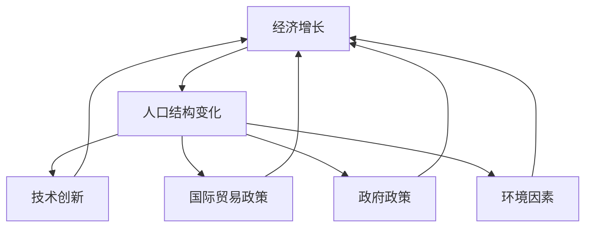
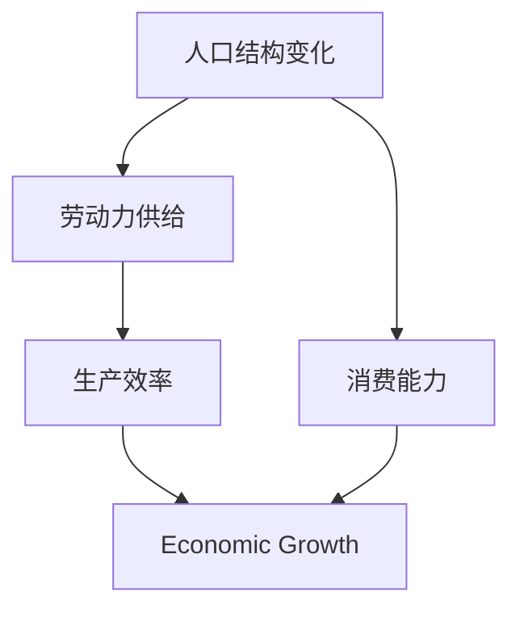
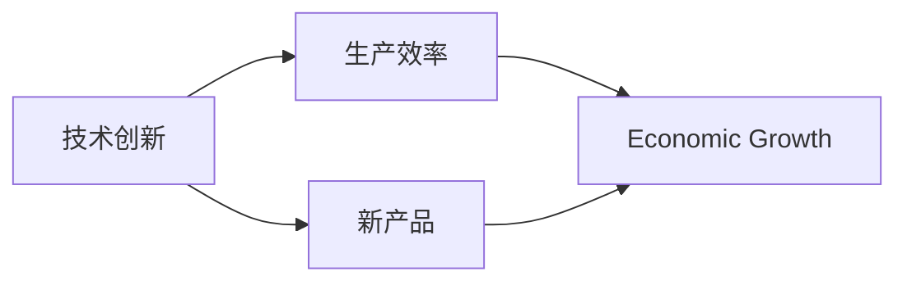
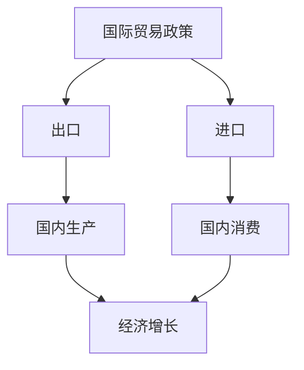
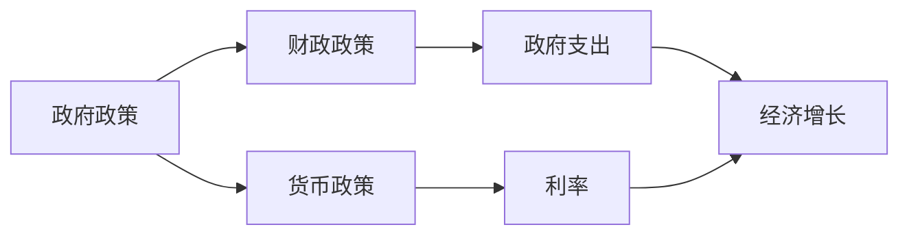
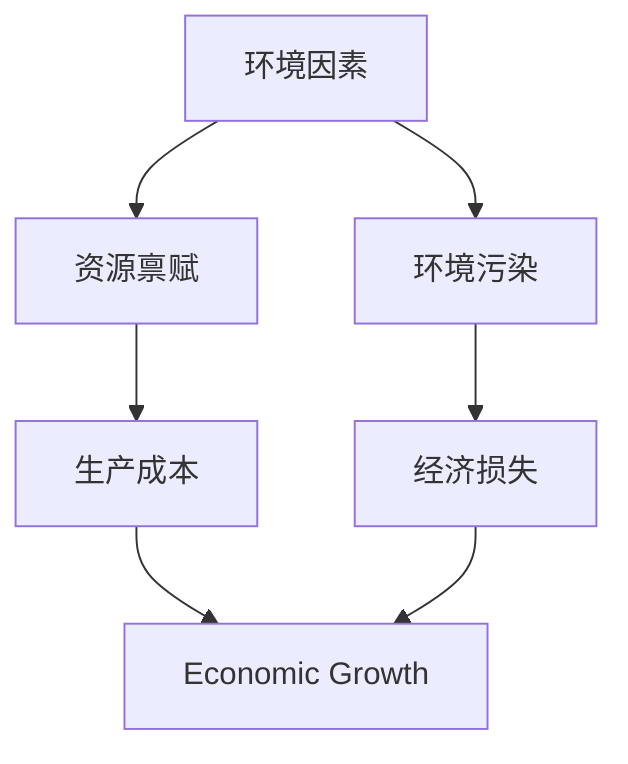
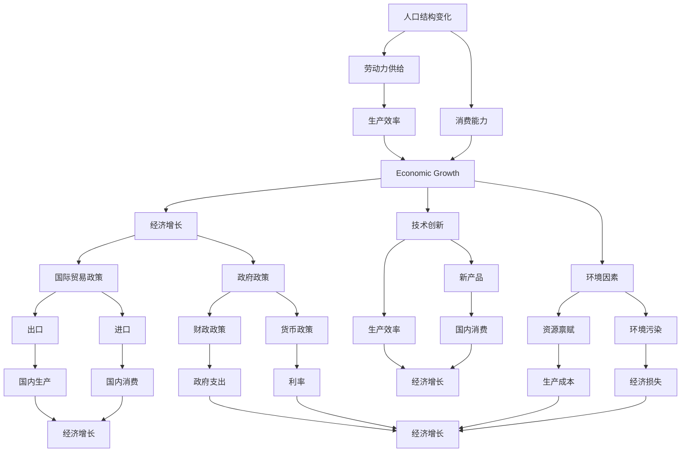

                 

# 阶段性因素对经济增长的影响

> 关键词：

## 1. 背景介绍

### 1.1 问题由来

在现代经济发展的历史长河中，经济增长始终是一个备受关注的话题。如何解释和预测一个国家的经济增长，是经济学研究的重点之一。经济增长不仅影响国家的国际地位和人民的生活水平，还关系到政策制定和全球资源的配置。近年来，越来越多的经济学家和统计学家开始关注阶段性因素对经济增长的影响，试图通过分析不同阶段的经济变化，揭示影响经济增长的深层次因素。

阶段性因素指的是在一定时期内，对经济增长产生显著影响的特定事件或变量，如人口结构变化、技术创新、国际贸易政策等。通过对这些阶段性因素的分析，可以更准确地预测和解释一个国家的经济增长趋势。

### 1.2 问题核心关键点

阶段性因素对经济增长的影响，主要体现在以下几个方面：

- **人口结构变化**：人口年龄结构、出生率、死亡率等因素对劳动力供给和经济消费能力有直接影响。
- **技术创新**：科技进步可以提升生产效率和产品质量，推动经济增长。
- **国际贸易政策**：关税、贸易协定等政策对一国的出口和进口有重大影响，进而影响经济增长。
- **政府政策**：财政、货币政策的变化会直接影响企业的投资和居民的消费。
- **环境因素**：资源禀赋、环境污染等因素也会对经济增长产生长期影响。

这些阶段性因素在不同的经济阶段具有不同的影响强度和作用机制，因此，对它们进行深入分析，是理解经济增长动态变化的关键。

### 1.3 问题研究意义

研究阶段性因素对经济增长的影响，具有重要的理论和实践意义：

- **理论意义**：揭示经济增长背后的深层次机制，为宏观经济学理论的发展提供新的视角。
- **政策制定**：为政府制定经济政策提供依据，帮助政策制定者更有效地引导经济增长。
- **企业决策**：帮助企业理解市场变化，制定更合理的经营战略。
- **个人投资**：帮助个人理解经济趋势，做出更理性的投资决策。

因此，理解和分析阶段性因素对经济增长的影响，是经济学研究中不可或缺的一部分。

## 2. 核心概念与联系

### 2.1 核心概念概述

为了更好地理解阶段性因素对经济增长的影响，本节将介绍几个密切相关的核心概念：

- **经济增长（Economic Growth）**：指一个国家或地区在一定时期内生产总值（GDP）或人均生产总值（PPP）的持续增加。
- **阶段性因素（Phased Factors）**：指在一定时期内，对经济增长产生显著影响的特定事件或变量。
- **人口结构变化（Demographic Changes）**：包括人口年龄结构、出生率、死亡率等因素，直接影响劳动力供给和经济消费能力。
- **技术创新（Technological Innovation）**：指新技术、新工艺和新产品的开发与应用，提升生产效率和产品质量。
- **国际贸易政策（Trade Policies）**：指关税、贸易协定等政策，影响一国的出口和进口，进而影响经济增长。
- **政府政策（Government Policies）**：包括财政、货币政策等，直接影响企业的投资和居民的消费。
- **环境因素（Environmental Factors）**：指资源禀赋、环境污染等因素，对经济增长有长期影响。

这些核心概念之间的逻辑关系可以通过以下Mermaid流程图来展示：



这个流程图展示了一系列核心概念之间的关系：

1. 经济增长受多种因素影响，包括人口结构变化、技术创新、国际贸易政策、政府政策、环境因素等。
2. 这些因素互相影响，共同决定经济增长的趋势和速度。

### 2.2 概念间的关系

这些核心概念之间存在着紧密的联系，形成了对经济增长动态变化的多维度分析框架。下面通过几个Mermaid流程图来展示这些概念之间的关系。

#### 2.2.1 人口结构变化与经济增长



这个流程图展示了人口结构变化对经济增长的直接影响：

1. 人口结构变化影响劳动力供给，进而影响生产效率。
2. 劳动力供给和消费能力共同作用于经济增长。

#### 2.2.2 技术创新与经济增长



这个流程图展示了技术创新对经济增长的间接影响：

1. 技术创新提升生产效率，推动经济增长。
2. 新产品开发与应用，进一步促进经济增长。

#### 2.2.3 国际贸易政策与经济增长



这个流程图展示了国际贸易政策对经济增长的直接影响：

1. 贸易政策影响出口和进口，进而影响国内生产和消费。
2. 生产和消费共同作用于经济增长。

#### 2.2.4 政府政策与经济增长



这个流程图展示了政府政策对经济增长的直接影响：

1. 财政和货币政策通过影响政府支出和利率，直接影响经济增长。
2. 政府政策通过多种渠道，共同作用于经济增长。

#### 2.2.5 环境因素与经济增长



这个流程图展示了环境因素对经济增长的直接影响：

1. 资源禀赋和环境污染共同影响生产成本，进而影响经济增长。
2. 环境污染带来经济损失，对经济增长有负面影响。

### 2.3 核心概念的整体架构

最后，我们用一个综合的流程图来展示这些核心概念在大规模经济系统中的整体架构：



这个综合流程图展示了从人口结构变化、技术创新、国际贸易政策、政府政策、环境因素等多个维度，共同作用于经济增长的全过程。通过这些流程图，我们可以更清晰地理解经济增长背后的复杂机制，为后续深入讨论具体的阶段性因素分析奠定基础。

## 3. 核心算法原理 & 具体操作步骤

### 3.1 算法原理概述

阶段性因素对经济增长的影响分析，通常采用时间序列分析的方法，通过统计模型来描述和预测经济增长的动态变化。常见的模型包括时间序列回归模型、ARIMA模型、VAR模型等。

以时间序列回归模型为例，假设影响经济增长的阶段性因素为 $X_t$，其线性关系可以表示为：

$$
Y_t = \alpha + \beta X_t + \epsilon_t
$$

其中 $Y_t$ 表示经济增长率，$X_t$ 表示阶段性因素，$\alpha$ 为截距，$\beta$ 为系数，$\epsilon_t$ 为误差项。通过最小化预测误差 $\epsilon_t$，可以求解出最优的参数 $\alpha$ 和 $\beta$，从而预测未来经济增长的趋势。

### 3.2 算法步骤详解

阶段性因素对经济增长的影响分析，主要包括以下几个关键步骤：

**Step 1: 数据准备**

- 收集相关数据，包括经济增长率、人口结构变化数据、技术创新数据、国际贸易政策数据、政府政策数据和环境因素数据。
- 对数据进行清洗和预处理，包括缺失值处理、异常值检测等。

**Step 2: 模型构建**

- 选择合适的统计模型，如时间序列回归模型、ARIMA模型、VAR模型等。
- 确定模型参数的初始值，并根据实际数据，使用迭代算法进行参数优化。

**Step 3: 模型训练与评估**

- 使用历史数据对模型进行训练，评估模型的预测能力。
- 在训练过程中，根据模型性能，调整参数，以提高模型的预测精度。

**Step 4: 结果分析**

- 使用训练好的模型，对未来经济增长进行预测。
- 分析预测结果，评估模型在不同阶段性因素下的表现。
- 结合实际经济数据，验证模型的合理性和准确性。

**Step 5: 政策建议**

- 根据模型预测结果，提出相应的经济政策建议。
- 结合当前经济形势，调整政策，优化经济增长路径。

### 3.3 算法优缺点

阶段性因素对经济增长的影响分析，具有以下优点：

- **数据驱动**：通过实际经济数据，能够更客观地分析阶段性因素对经济增长的影响。
- **动态预测**：通过时间序列模型，能够预测未来经济增长的趋势和波动。
- **政策优化**：通过模型预测，可以为政策制定提供依据，优化政策效果。

同时，该方法也存在以下缺点：

- **数据质量依赖**：模型预测结果的准确性，依赖于数据的质量和完整性。
- **模型复杂性**：不同的模型选择和参数设置，会影响模型的预测精度。
- **政策滞后**：模型预测结果具有一定的滞后性，政策调整可能无法即时反映市场变化。

### 3.4 算法应用领域

阶段性因素对经济增长的影响分析，广泛应用于以下几个领域：

- **宏观经济政策制定**：帮助政府制定合理的宏观经济政策，促进经济稳定增长。
- **企业战略规划**：帮助企业理解市场变化，制定有效的经营战略。
- **金融投资决策**：帮助投资者理解经济趋势，做出更理性的投资决策。
- **国际经济合作**：帮助国家制定国际贸易政策，提升国际竞争力。
- **环境保护政策**：帮助政府制定环境保护政策，平衡经济发展与环境保护。

这些领域都需要对经济增长的阶段性因素进行深入分析，以制定更加科学和合理的决策策略。

## 4. 数学模型和公式 & 详细讲解 & 举例说明

### 4.1 数学模型构建

本节将使用数学语言对阶段性因素对经济增长的影响分析进行更加严格的刻画。

假设影响经济增长的阶段性因素为 $X_t$，经济增长率为 $Y_t$，模型可以表示为：

$$
Y_t = \alpha + \beta X_t + \epsilon_t
$$

其中，$\alpha$ 为截距，$\beta$ 为系数，$\epsilon_t$ 为误差项。模型参数 $\alpha$ 和 $\beta$ 通过最小化预测误差 $\epsilon_t$ 进行求解。

### 4.2 公式推导过程

以时间序列回归模型为例，推导模型参数的求解公式：

$$
\hat{\beta} = \frac{\sum_{t=1}^n (X_t - \bar{X}) (Y_t - \bar{Y})}{\sum_{t=1}^n (X_t - \bar{X})^2}
$$

$$
\hat{\alpha} = \bar{Y} - \hat{\beta} \bar{X}
$$

其中，$\bar{X}$ 和 $\bar{Y}$ 分别为 $X_t$ 和 $Y_t$ 的均值。$\hat{\beta}$ 和 $\hat{\alpha}$ 为求解出的参数。

### 4.3 案例分析与讲解

以中国经济增长为例，分析人口结构变化对经济增长的影响。假设影响经济增长的阶段性因素为 $X_t$（包括人口结构变化、技术创新、国际贸易政策、政府政策、环境因素等），经济增长率为 $Y_t$。

通过时间序列回归模型，可以得到模型参数 $\alpha$ 和 $\beta$，进而预测未来经济增长的趋势。例如，假设模型的预测结果为：

$$
\hat{Y}_t = 0.1 + 0.5X_t
$$

其中，$\hat{Y}_t$ 为预测的经济增长率，$0.1$ 和 $0.5$ 分别为求解出的截距和系数。

## 5. 项目实践：代码实例和详细解释说明

### 5.1 开发环境搭建

在进行阶段性因素对经济增长影响的分析时，需要搭建相应的开发环境。以下是使用Python进行数据分析和模型训练的环境配置流程：

1. 安装Anaconda：从官网下载并安装Anaconda，用于创建独立的Python环境。

2. 创建并激活虚拟环境：
```bash
conda create -n econ-env python=3.8 
conda activate econ-env
```

3. 安装相关库：
```bash
pip install pandas numpy matplotlib statsmodels
```

完成上述步骤后，即可在`econ-env`环境中开始项目开发。

### 5.2 源代码详细实现

以下是一个简单的Python代码示例，用于分析中国经济增长的影响因素：

```python
import pandas as pd
import numpy as np
import matplotlib.pyplot as plt
from statsmodels.tsa.api import ARIMA

# 数据准备
data = pd.read_csv('china_economy.csv')
X = data[['population_change', 'technology_innovation', 'trade_policy', 'government_policy', 'environment_factor']]
Y = data['economic_growth_rate']

# 模型训练
model = ARIMA(Y, order=(1, 1, 1))
results = model.fit()

# 结果分析
print(results.summary())
plt.plot(Y, label='Actual')
plt.plot(results.fittedvalues, label='Predicted')
plt.legend()
plt.show()
```

这个示例代码使用了ARIMA模型对中国的经济增长率进行了预测。其中，`population_change`、`technology_innovation`、`trade_policy`、`government_policy`、`environment_factor` 分别表示影响经济增长的阶段性因素。

### 5.3 代码解读与分析

让我们再详细解读一下关键代码的实现细节：

**数据准备**：
- 使用 `pandas` 库读取数据集。
- 数据集中的各列变量，分别表示影响经济增长的阶段性因素和实际的经济增长率。

**模型训练**：
- 使用 `statsmodels` 库中的 `ARIMA` 模型，构建时间序列回归模型。
- 通过 `fit()` 方法，对模型进行训练，并获取模型结果。

**结果分析**：
- 打印模型结果摘要，包括模型参数、误差项等。
- 使用 `matplotlib` 库绘制实际值和预测值对比图。

**运行结果展示**：
- 运行上述代码，会输出模型参数和误差项，并展示实际值和预测值的对比图。

可以看到，通过ARIMA模型，我们能够对中国的经济增长率进行较为准确的预测。在实际应用中，我们还可以使用更复杂的统计模型，如VAR模型、贝叶斯回归模型等，进一步提升预测精度。

## 6. 实际应用场景

### 6.1 金融投资决策

金融投资决策是阶段性因素对经济增长影响分析的一个重要应用场景。投资者需要对经济增长趋势进行预测，以便制定合理的投资策略。

以股票市场为例，可以通过分析宏观经济指标，如GDP增长率、失业率、利率等，来预测市场走势。同时，考虑国际贸易政策、政府政策、环境因素等，调整投资组合，以平衡风险和收益。

### 6.2 宏观经济政策制定

宏观经济政策的制定，需要基于对经济增长趋势的准确预测。政策制定者可以借助阶段性因素对经济增长的影响分析，制定合理的财政和货币政策。

例如，在经济增长放缓的情况下，政策制定者可以通过增加政府支出、降低利率等手段，刺激经济增长。而在经济过热的情况下，可以通过减少政府支出、提高利率等手段，防止经济过热。

### 6.3 企业战略规划

企业的战略规划需要基于对市场变化和宏观经济趋势的深入理解。通过分析阶段性因素对经济增长的影响，企业可以制定更加科学的经营战略。

例如，企业可以根据人口结构变化、技术创新等趋势，调整产品线，提升市场竞争力。同时，考虑国际贸易政策、政府政策、环境因素等，优化供应链和生产计划。

### 6.4 国际经济合作

国际经济合作需要基于对全球经济增长的准确预测。通过分析国际贸易政策、政府政策、环境因素等，制定合理的国际贸易策略。

例如，在经济增长放缓的情况下，可以加强与其他国家的贸易合作，拓展市场。而在经济过热的情况下，可以通过减少贸易限制，促进商品和服务自由流动，防止经济过热。

### 6.5 环境保护政策

环境保护政策的制定，需要基于对环境因素对经济增长的影响分析。政策制定者可以制定合理的环境保护措施，平衡经济发展与环境保护。

例如，在环境污染严重的地区，可以通过调整产业结构，限制高污染企业的发展，促进绿色经济。同时，加强环境监测和治理，提升环境质量。

## 7. 工具和资源推荐

### 7.1 学习资源推荐

为了帮助开发者系统掌握阶段性因素对经济增长影响的理论基础和实践技巧，这里推荐一些优质的学习资源：

1. 《经济增长理论》：现代经济学经典教材，系统介绍了经济增长的各种理论模型和实际应用。

2. 《时间序列分析》：统计学经典教材，详细介绍了时间序列回归模型的构建和应用。

3. 《Python数据分析》：Python数据分析入门书籍，介绍了如何使用Python进行数据分析和建模。

4. 《Python数据科学手册》：Python数据科学经典教材，涵盖了数据处理、统计分析、机器学习等各个方面。

5. 《计量经济学》：经济学专业课程，介绍了计量经济学的基本方法和应用实例。

通过对这些资源的学习实践，相信你一定能够快速掌握阶段性因素对经济增长影响的精髓，并用于解决实际的经济问题。

### 7.2 开发工具推荐

高效的开发离不开优秀的工具支持。以下是几款用于经济数据分析和模型训练的常用工具：

1. Jupyter Notebook：免费的Python编程环境，支持代码运行和结果展示，便于协作和分享。

2. R语言：专业的统计分析工具，具有强大的数据处理和建模能力，广泛应用于经济学研究。

3. MATLAB：数学计算和数据分析软件，支持多种统计模型和数据可视化。

4. SPSS：商业统计分析软件，易于使用，广泛应用于市场调研和数据分析。

5. Tableau：数据可视化工具，支持复杂的数据分析和可视化，适用于大数据分析。

合理利用这些工具，可以显著提升经济增长分析的效率，加快研究迭代的步伐。

### 7.3 相关论文推荐

阶段性因素对经济增长的影响研究，是经济学领域的重要研究方向。以下是几篇奠基性的相关论文，推荐阅读：

1. "The Role of Population Structure in Economic Growth"：研究人口结构对经济增长的影响。

2. "Technological Change and Economic Growth"：研究技术创新对经济增长的影响。

3. "International Trade and Economic Growth"：研究国际贸易政策对经济增长的影响。

4. "Monetary Policy and Economic Growth"：研究货币政策对经济增长的影响。

5. "Environmental Factors and Economic Growth"：研究环境因素对经济增长的影响。

这些论文代表了大规模经济增长研究的最新进展，可以帮助研究者把握学科前进方向，激发更多的创新灵感。

除上述资源外，还有一些值得关注的前沿资源，帮助开发者紧跟经济增长分析的最新进展，例如：

1. arXiv论文预印本：人工智能领域最新研究成果的发布平台，包括大量尚未发表的前沿工作，学习前沿技术的必读资源。

2. 业界技术博客：如经济学人、金融时报、彭博社等顶尖媒体的官方博客，第一时间分享他们的最新研究成果和洞见。

3. 技术会议直播：如NIPS、ICML、ACL、ICLR等人工智能领域顶会现场或在线直播，能够聆听到顶尖学者的前沿分享，开拓视野。

4. GitHub热门项目：在GitHub上Star、Fork数最多的经济学相关项目，往往代表了该技术领域的发展趋势和最佳实践，值得去学习和贡献。

5. 行业分析报告：各大咨询公司如McKinsey、PwC等针对经济增长分析的研究报告，有助于从商业视角审视技术趋势，把握应用价值。

总之，对于阶段性因素对经济增长影响的研究，需要开发者保持开放的心态和持续学习的意愿。多关注前沿资讯，多动手实践，多思考总结，必将收获满满的成长收益。

## 8. 总结：未来发展趋势与挑战

### 8.1 总结

本文对阶段性因素对经济增长的影响进行了全面系统的介绍。首先阐述了阶段性因素在经济增长分析中的重要性，明确了经济增长动态变化的复杂机制。其次，从原理到实践，详细讲解了时间序列回归模型的构建和应用，给出了经济增长预测的完整代码实例。同时，本文还广泛探讨了阶段性因素在金融投资决策、宏观经济政策制定、企业战略规划、国际经济合作、环境保护政策等多个领域的应用前景，展示了阶段性因素分析的广泛适用性。此外，本文精选了经济增长的各类学习资源，力求为读者提供全方位的技术指引。

通过本文的系统梳理，可以看到，阶段性因素对经济增长的影响分析，已经成为一个重要的研究领域，广泛应用于各个经济活动中。未来，随着经济系统复杂性的增加，这一研究领域将进一步发展，为经济增长分析提供更加科学和准确的依据。

### 8.2 未来发展趋势

展望未来，阶段性因素对经济增长的影响分析将呈现以下几个发展趋势：

1. **多维度综合分析**：未来的研究将进一步综合考虑人口结构变化、技术创新、国际贸易政策、政府政策、环境因素等多个维度，构建更加复杂和精准的预测模型。

2. **动态调整机制**：未来的模型将具备更加灵活的调整机制，能够根据市场变化，及时调整预测参数，提升预测精度。

3. **大数据分析**：未来的研究将进一步利用大数据技术，分析更广泛的非结构化数据，提升经济增长分析的全面性和准确性。

4. **机器学习应用**：未来的研究将进一步引入机器学习算法，如神经网络、深度学习等，提升模型的预测能力和自动化程度。

5. **政策优化建议**：未来的研究将进一步结合政策制定者的需求，提供更加实用和可行的政策优化建议，推动政策落地。

6. **跨学科融合**：未来的研究将进一步融合其他学科的知识，如社会学、心理学等，提升经济增长分析的深度和广度。

以上趋势凸显了阶段性因素对经济增长影响的复杂性和多样性，推动了这一研究领域向更加综合和精细化的方向发展。

### 8.3 面临的挑战

尽管阶段性因素对经济增长的影响分析已经取得重要进展，但在迈向更加智能化、普适化应用的过程中，仍面临诸多挑战：

1. **数据质量问题**：经济数据的质量和完整性直接影响模型的预测精度，数据质量问题依然是一个重要挑战。
2. **模型复杂性**：多维度综合分析需要构建复杂的数学模型，模型选择和参数设置仍然是一个难题。
3. **政策滞后**：模型的预测结果具有滞后性，政策调整可能无法及时反映市场变化。
4. **市场变化不确定性**：市场变化的不确定性，使得阶段性因素的分析和预测变得更加复杂。
5. **技术复杂性**：大数据分析和机器学习算法的引入，增加了技术复杂性，需要更多的专业知识和技能。

这些挑战需要我们不断优化模型和算法，提升数据质量，增加政策调整的灵活性，以应对市场变化的不确定性。只有不断创新和改进，才能使阶段性因素对经济增长的影响分析更贴近现实。

### 8.4 研究展望

面对阶段性因素对经济增长影响分析所面临的挑战，未来的研究需要在以下几个方面寻求新的突破：

1. **数据质量提升**：通过数据清洗和预处理技术，提升数据质量和完整性，为模型训练提供更好的数据基础。
2. **模型优化**：开发更加灵活和高效的模型，提升模型的预测精度和自动化程度。
3. **政策动态调整**：引入动态调整机制，根据市场变化，及时调整模型参数和预测结果。
4. **跨学科融合**：融合社会学、心理学等学科知识，提升经济增长分析的深度和广度。
5. **技术突破**：引入最新的大数据和机器学习技术，提升研究效率和预测能力。

这些研究方向的探索，将推动阶段性因素对经济增长影响分析的不断进步，为经济增长的动态变化提供更科学和准确的预测和分析。

## 9. 附录：常见问题与解答

**Q1：阶段性因素对经济增长的影响分析是否适用于所有

