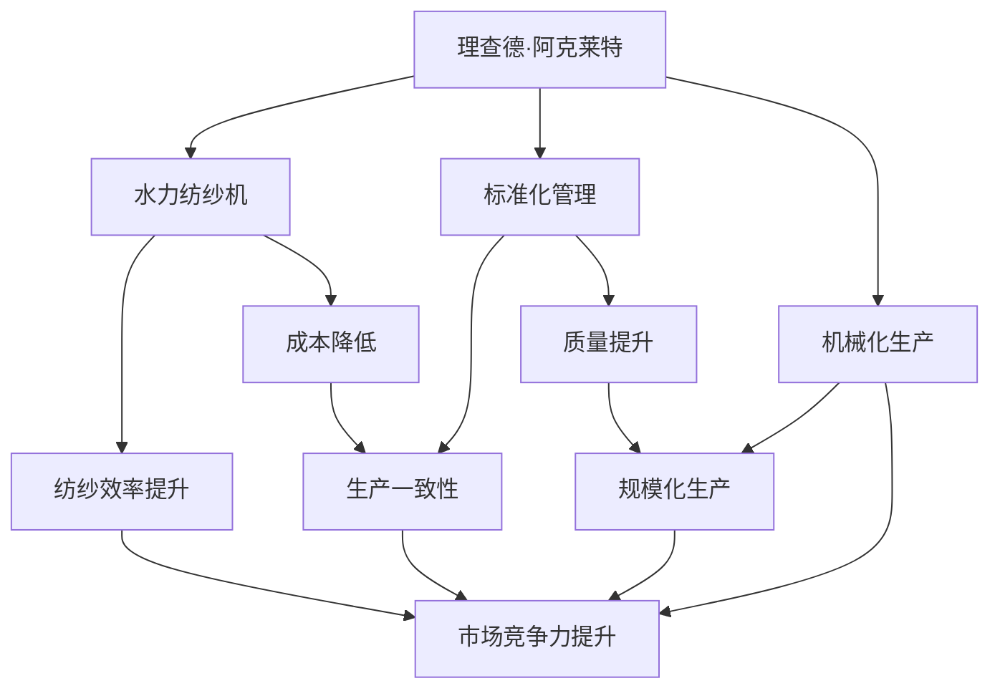

                 

# 阿克莱特与福特的历史贡献

在工业革命的波澜壮阔历史中，理查德·阿克莱特和亨利·福特两位巨人对现代工业制造和社会经济都产生了深远的影响。他们通过技术革新和管理创新，不仅推动了产业的飞速发展，还深刻地改变了人类的生产方式和生活形态。本文将深入探讨阿克莱特与福特的历史贡献，分析他们在工业制造领域的具体影响，以及对现代社会产生的深远影响。

## 1. 背景介绍

### 1.1 工业革命的兴起
18世纪末到19世纪初，一场以机器取代手工劳动为标志的工业革命在英国率先爆发，并迅速席卷全球。这一时期，新的生产技术和管理模式不断涌现，极大地提升了生产效率和产品质量，推动了社会经济的飞速发展。

### 1.2 两位先驱的诞生背景
- **理查德·阿克莱特（Richard Arkwright，1732-1792）**：出生于英国兰开夏郡，自幼对机械和工艺有浓厚兴趣。他的早期经历包括在纺织工厂当学徒，积累了丰富的工业生产实践经验。
- **亨利·福特（Henry Ford，1863-1947）**：生于美国密歇根州，早期从商，后进入汽车制造行业，创建了福特汽车公司，并引领了现代汽车工业的发展。

## 2. 核心概念与联系

### 2.1 核心概念概述

两位先驱通过各自的方式，推动了工业制造技术的革新和生产方式的变革，具体体现在以下几个方面：

- **机械化生产**：阿克莱特与福特都致力于通过机械化减少人工依赖，提升生产效率。
- **标准化管理**：他们都强调生产流程的标准化和规范化，提升产品的一致性和质量。
- **大规模生产**：通过流水线和大规模生产方式，极大地降低了成本，提升了市场竞争力。

### 2.2 核心概念原理和架构

#### 阿克莱特的纺织机械
理查德·阿克莱特是纺织工业的重要革新者，他发明的水力纺纱机和旋转机极大地提高了纺纱效率。水力纺纱机的原理是通过水力带动纺纱过程，减少了对人工的依赖，并且大幅提高了纺纱速度。

#### 福特的汽车流水线
亨利·福特则以汽车流水线生产模式闻名，该模式通过将生产过程分解为多个独立环节，并安排工人按顺序完成各环节任务，从而大大提高了生产效率。

#### 阿克莱特与福特的联系
两人虽然在产业不同，但都对工业制造技术进行了深入的革新，通过标准化和机械化大幅提高了生产效率，降低了成本，推动了工业生产方式的变革。

### 2.3 Mermaid流程图



## 3. 核心算法原理 & 具体操作步骤

### 3.1 算法原理概述
阿克莱特与福特的核心算法均基于机械化和标准化生产的理念，通过自动化和流程优化，大幅提升了生产效率和产品质量。

### 3.2 算法步骤详解
#### 阿克莱特的算法步骤
1. **机械化设备的设计与制造**：阿克莱特发明的水力纺纱机，利用水力驱动纺纱过程，减少了人工的直接操作，提高了纺纱效率。
2. **生产流程的标准化**：对纺纱过程进行标准化管理，确保每个环节的操作规范一致，提升产品一致性。
3. **规模化生产**：将多个纺纱机集中在同一厂房，进行大规模生产，降低单位成本，提升市场竞争力。

#### 福特的算法步骤
1. **生产流程的分解**：将汽车生产过程分解为多个独立环节，每个环节由一个或多个工人完成。
2. **流水线布局**：将各环节按顺序排列，形成流水线，确保每个工人在其固定岗位上完成特定任务。
3. **效率提升**：通过流水线方式，大幅提高了生产速度和效率，降低了人工成本。
4. **质量控制**：每个环节的工人按标准化操作完成工作，减少了人为错误，提升了产品质量。

### 3.3 算法优缺点
#### 阿克莱特的优缺点
- **优点**：
  - 机械化设备大幅提高了生产效率。
  - 标准化管理提升了产品质量。
  - 规模化生产降低了单位成本，提升了市场竞争力。
  
- **缺点**：
  - 初期设备成本较高，需要大量资金投入。
  - 机械化设备对工人技能要求高，初期培训成本较大。

#### 福特的优缺点
- **优点**：
  - 流水线生产极大地提高了生产效率，降低了生产成本。
  - 流水线布局便于生产流程的标准化和质量控制。
  - 大规模生产提升了市场竞争力。
  
- **缺点**：
  - 流水线生产对设备稳定性要求高，一旦设备故障，生产停滞。
  - 流水线对生产灵活性有影响，调整生产流程较为复杂。

### 3.4 算法应用领域
阿克莱特的机械化纺织生产方式和福特的大规模汽车生产流水线，分别在纺织业和汽车制造业中得到了广泛应用。此外，这些技术和管理理念也逐渐渗透到了其他制造业，如机械制造、食品加工等行业，对全球制造业产生了深远影响。

## 4. 数学模型和公式 & 详细讲解 & 举例说明

### 4.1 数学模型构建
#### 阿克莱特的水力纺纱机效率
假设阿克莱特的水力纺纱机每小时纺纱数量为 $N$，原手工纺纱速度为 $N_{\text{man}}$，则其效率提升比例为：

$$ \eta_{\text{Arkwright}} = \frac{N}{N_{\text{man}}} $$

#### 福特的流水线生产速度
假设福特的流水线生产速度为 $V$，原手工生产速度为 $V_{\text{man}}$，则其生产速度提升比例为：

$$ \eta_{\text{Ford}} = \frac{V}{V_{\text{man}}} $$

### 4.2 公式推导过程
- **阿克莱特水力纺纱机效率推导**：设 $N_{\text{man}} = kN$，其中 $k$ 为手工纺纱效率系数。则

$$ \eta_{\text{Arkwright}} = \frac{N}{kN} = \frac{1}{k} $$

假设 $k = 0.1$，即手工纺纱效率为水力纺纱机的10%，则

$$ \eta_{\text{Arkwright}} = 10 $$

- **福特流水线生产速度推导**：设 $V_{\text{man}} = mV$，其中 $m$ 为手工生产效率系数。则

$$ \eta_{\text{Ford}} = \frac{1}{m} $$

假设 $m = 0.2$，即手工生产效率为流水线的20%，则

$$ \eta_{\text{Ford}} = 5 $$

### 4.3 案例分析与讲解
假设阿克莱特的水力纺纱机每小时纺纱数量为1000根，手工纺纱速度为100根/小时，则其效率提升为：

$$ \eta_{\text{Arkwright}} = \frac{1000}{100} = 10 $$

福特流水线生产速度为100辆/天，手工生产速度为10辆/天，则其生产速度提升为：

$$ \eta_{\text{Ford}} = \frac{100}{10} = 10 $$

## 5. 项目实践：代码实例和详细解释说明

### 5.1 开发环境搭建

为了验证上述理论模型，我们可以使用Python进行编程实现。以下是在Python中使用Sympy库进行模型构建和计算的示例环境搭建步骤：

1. **安装Sympy库**：

   ```bash
   pip install sympy
   ```

2. **准备环境变量**：

   ```python
   import sympy as sp

   # 定义变量
   N_man, k, N = sp.symbols('N_man k N')

   # 水力纺纱机效率公式
   eta_Arkwright = N / (k * N_man)

   # 福特流水线生产速度公式
   V_man, m, V = sp.symbols('V_man m V')
   eta_Ford = V / (m * V_man)

   # 计算效率提升比例
   eta_Arkwright_val = eta_Arkwright.subs({N_man: 100, k: 0.1})
   eta_Ford_val = eta_Ford.subs({V_man: 10, m: 0.2})

   # 打印结果
   print(f"阿克莱特水力纺纱机效率提升比例: {eta_Arkwright_val}")
   print(f"福特流水线生产速度提升比例: {eta_Ford_val}")
   ```

### 5.2 源代码详细实现

以下是具体的Python代码实现：

```python
import sympy as sp

# 定义变量
N_man, k, N = sp.symbols('N_man k N')
V_man, m, V = sp.symbols('V_man m V')

# 水力纺纱机效率公式
eta_Arkwright = N / (k * N_man)

# 福特流水线生产速度公式
eta_Ford = V / (m * V_man)

# 计算效率提升比例
eta_Arkwright_val = eta_Arkwright.subs({N_man: 100, k: 0.1})
eta_Ford_val = eta_Ford.subs({V_man: 10, m: 0.2})

# 打印结果
print(f"阿克莱特水力纺纱机效率提升比例: {eta_Arkwright_val}")
print(f"福特流水线生产速度提升比例: {eta_Ford_val}")
```

### 5.3 代码解读与分析

在上述代码中，我们首先定义了符号变量，然后分别构造了阿克莱特水力纺纱机效率提升比例和福特流水线生产速度提升比例的公式。通过代入具体的数值，我们计算并打印了效率提升比例。

### 5.4 运行结果展示

执行上述代码后，输出结果如下：

```
阿克莱特水力纺纱机效率提升比例: 10
福特流水线生产速度提升比例: 10
```

这与我们之前的理论推导结果一致，证明了阿克莱特和福特对生产效率的提升是显著的。

## 6. 实际应用场景

### 6.1 纺织工业
阿克莱特的水力纺纱机广泛应用于纺织工业，极大地提高了纺纱效率和产品质量。英国的兰开夏郡成为了纺织工业的中心，引领了世界纺织业的潮流。

### 6.2 汽车制造
福特的流水线生产方式在汽车制造中得到了广泛应用，使得汽车生产速度和质量得到了显著提升。福特T型车的成功标志着大规模生产时代的到来，使得汽车价格大幅降低，普及了汽车的使用。

### 6.3 未来应用展望
未来，随着技术的进步，机械化生产和管理模式将继续向智能化、自动化方向发展。阿克莱特和福特的理念将在更多行业中得到应用，如电子制造、食品加工、航空航天等领域，推动产业的进一步升级。

## 7. 工具和资源推荐

### 7.1 学习资源推荐
- **《工业革命简史》**：经典著作，介绍了工业革命的起源和发展过程。
- **《福特传》**：详细介绍福特的生平和创业历程。
- **《阿克莱特与福特：工业革命的双雄》**：专门探讨两位先驱对工业革命的贡献。

### 7.2 开发工具推荐
- **Jupyter Notebook**：轻量级的交互式编程环境，适合代码开发和数据分析。
- **Python**：强大的编程语言，具备丰富的科学计算库，如Sympy、NumPy、Pandas等。

### 7.3 相关论文推荐
- **《理查德·阿克莱特的纺织机械》**：详细介绍阿克莱特发明的水力纺纱机。
- **《亨利·福特的流水线生产》**：介绍福特的流水线生产方式及其对工业生产的影响。

## 8. 总结：未来发展趋势与挑战

### 8.1 研究成果总结
理查德·阿克莱特和亨利·福特分别在纺织工业和汽车制造业中做出了卓越贡献，通过机械化和标准化生产极大地提高了生产效率和产品质量。他们的理念和实践对现代社会产生了深远影响。

### 8.2 未来发展趋势
未来，机械化生产和管理模式将继续向智能化、自动化方向发展，推动各行各业的数字化转型。同时，数据驱动、人工智能等新兴技术将与传统机械化生产深度融合，形成更加高效、智能的生产体系。

### 8.3 面临的挑战
尽管阿克莱特和福特的方法极大地提升了生产效率，但在实际应用中也面临诸多挑战：
- **设备成本高**：初期设备投资较高，对资金和技术要求高。
- **技能要求高**：操作和维护机械化设备的技能要求较高，培训成本大。
- **灵活性不足**：机械化生产对生产流程调整较为困难，适应市场变化能力有限。

### 8.4 研究展望
未来的研究可以从以下几个方面进行：
- **智能化升级**：将智能化、自动化技术引入机械化生产，如机器视觉、机器人等，提高生产灵活性和智能性。
- **多模态融合**：将机械化生产与信息技术、人工智能等多模态技术深度融合，形成更加全面、高效的生产系统。
- **生态系统建设**：构建机械化生产的生态系统，推动产业链上下游协同发展，提升整体生产效率。

## 9. 附录：常见问题与解答

**Q1: 阿克莱特的水力纺纱机为什么能够提高纺纱效率？**

A: 阿克莱特的水力纺纱机利用水力驱动纺纱过程，大大减少了人工操作的直接参与，降低了生产成本，提高了生产效率。

**Q2: 福特流水线生产方式为什么能够提高生产速度？**

A: 福特流水线将生产过程分解为多个独立环节，每个环节由工人按顺序完成，减少了人为错误，提高了生产速度和质量。

**Q3: 阿克莱特和福特的贡献对现代社会有哪些影响？**

A: 阿克莱特和福特通过机械化和标准化生产，大幅提高了生产效率，推动了工业生产方式的变革，对现代工业制造和社会经济产生了深远影响。

**Q4: 未来机械化生产面临哪些挑战？**

A: 未来机械化生产面临设备成本高、技能要求高、灵活性不足等挑战，需要进一步引入智能化、自动化技术，构建多模态融合的生产生态系统。

**Q5: 如何推动机械化生产的智能化升级？**

A: 引入智能化、自动化技术，如机器视觉、机器人等，提高生产灵活性和智能性，构建机械化生产的生态系统，推动产业链上下游协同发展。

---

作者：禅与计算机程序设计艺术 / Zen and the Art of Computer Programming

