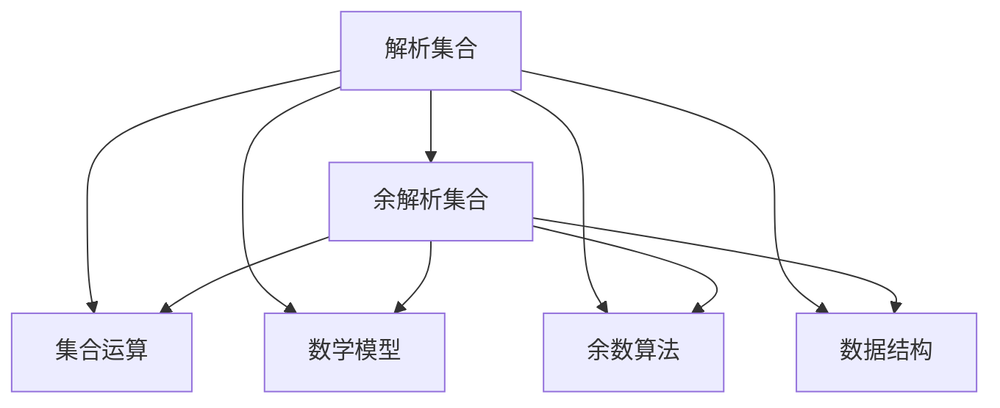
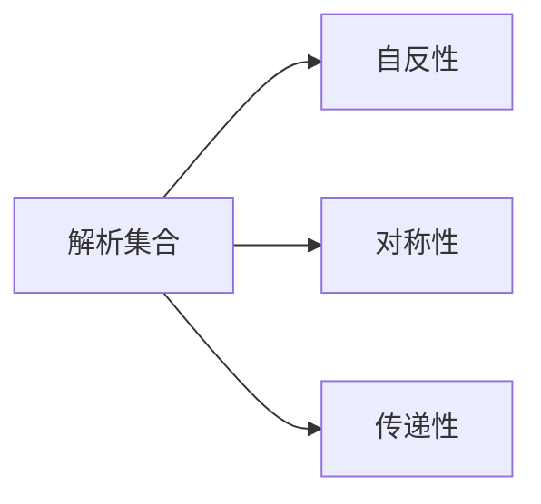
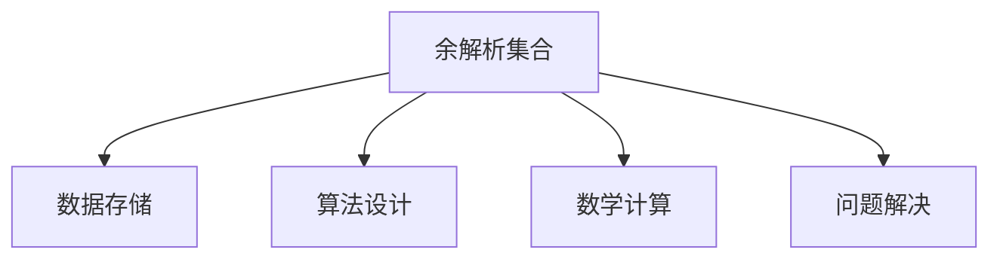
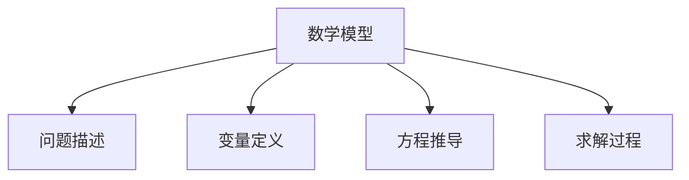
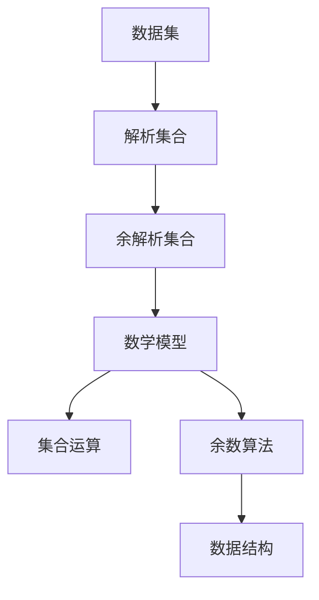

                 

# 集合论导引：余解析集合

> 关键词：集合论, 余解析集合, 解析集合, 集合运算, 数学模型, 余数算法, 数据结构

## 1. 背景介绍

### 1.1 问题由来
集合论是数学中研究集合的基本理论和方法的学科。它不仅是一门数学基础学科，还在计算机科学、逻辑学、哲学等领域有着广泛的应用。本文旨在深入探讨余解析集合的概念和性质，为余解析集合的理论研究和实际应用提供指导。

### 1.2 问题核心关键点
余解析集合是集合论中一个重要的概念，它通过对解析集合的余集进行操作，可以深入研究集合的性质和运算规律。余解析集合的应用广泛，包括数学计算、算法设计、数据结构等领域。

### 1.3 问题研究意义
理解余解析集合的概念和性质，不仅有助于深入研究集合论的基础理论，还能为解决实际问题提供新的思路和方法。在计算机科学中，余解析集合可以应用于数据结构、算法设计和数学计算等领域，具有重要的应用价值。

## 2. 核心概念与联系

### 2.1 核心概念概述

为更好地理解余解析集合，本节将介绍几个密切相关的核心概念：

- 解析集合(Parisian Semantic Set)：指包含所有能被某个函数映射到某个特定值的集合，是集合论中的一个基本概念。
- 余解析集合：指解析集合的补集，包含所有不属于解析集合的元素。
- 集合运算：包括交集、并集、差集、对称差集等基本运算，用于研究集合之间的关系和性质。
- 数学模型：指通过数学语言描述现实问题的一种模型，常用于解决复杂问题。
- 余数算法：通过余数运算解决实际问题的一种算法，常用于优化算法设计。
- 数据结构：指用于存储、处理和管理数据的一种结构，常用于计算机科学中。

这些核心概念之间的逻辑关系可以通过以下Mermaid流程图来展示：



这个流程图展示了大集合的余解析集合与其他相关概念的关系：

1. 解析集合通过集合运算、数学模型、余数算法和数据结构等概念，研究集合的性质和应用。
2. 余解析集合是解析集合的补集，包含所有不属于解析集合的元素。
3. 集合运算、数学模型、余数算法和数据结构等概念均可以通过余解析集合进一步深入研究和应用。

### 2.2 概念间的关系

这些核心概念之间存在着紧密的联系，形成了集合论的完整理论体系。下面我们通过几个Mermaid流程图来展示这些概念之间的关系。

#### 2.2.1 解析集合的性质



这个流程图展示了解析集合的基本性质：

1. 自反性：对于任意的元素，在解析集合中均能找到自身。
2. 对称性：对于任意的两个元素，若一个元素在解析集合中，则另一个元素也在解析集合中。
3. 传递性：对于任意的两个元素，若一个元素在解析集合中，另一个元素也在解析集合中，则这两个元素的所有中间元素也都在解析集合中。

#### 2.2.2 余解析集合的应用



这个流程图展示了余解析集合在数据存储、算法设计、数学计算和问题解决等领域的应用：

1. 数据存储：通过余解析集合，可以实现数据存储和处理，优化数据结构。
2. 算法设计：通过余解析集合，可以设计高效算法，优化算法性能。
3. 数学计算：通过余解析集合，可以进行数学计算和推导，求解复杂问题。
4. 问题解决：通过余解析集合，可以解决实际问题，提高问题解决效率。

#### 2.2.3 数学模型的构建



这个流程图展示了数学模型的构建过程：

1. 问题描述：通过余解析集合，可以明确问题描述，理解问题的本质。
2. 变量定义：通过余解析集合，可以定义变量，表示问题的数学模型。
3. 方程推导：通过余解析集合，可以进行方程推导，构建数学模型。
4. 求解过程：通过余解析集合，可以求解数学模型，解决实际问题。

### 2.3 核心概念的整体架构

最后，我们用一个综合的流程图来展示这些核心概念在大集合余解析集合的完整架构：



这个综合流程图展示了从数据集到解析集合，再到余解析集合，最后到数学模型、集合运算、余数算法和数据结构的完整过程：

1. 数据集通过解析集合，转化为解析集合中的元素。
2. 解析集合通过余解析集合，得到余解析集合中的元素。
3. 余解析集合通过数学模型，构建数学模型中的变量和方程。
4. 数学模型通过集合运算，计算数学模型中的变量和方程。
5. 数学模型通过余数算法，优化数学模型中的算法性能。
6. 数学模型通过数据结构，存储和处理数学模型中的数据。

通过这些流程图，我们可以更清晰地理解大集合余解析集合的理论体系和应用场景。

## 3. 核心算法原理 & 具体操作步骤
### 3.1 算法原理概述

余解析集合的算法原理主要基于集合运算和数学模型。其核心思想是通过对解析集合的余集进行操作，得到余解析集合，进而研究余解析集合的性质和应用。

余解析集合的算法步骤一般包括以下几个关键步骤：

- 定义解析集合和余解析集合。
- 对解析集合进行集合运算和数学模型构建。
- 对余解析集合进行集合运算和数学模型推导。
- 通过余数算法优化数学模型。
- 通过数据结构存储和处理数学模型中的数据。

### 3.2 算法步骤详解

下面详细介绍余解析集合的算法步骤：

**Step 1: 定义解析集合和余解析集合**

1. 定义解析集合 $A$：$A = \{a \mid \exists b, f(a) = b\}$，其中 $f$ 为某个函数，$a$ 和 $b$ 为集合 $A$ 中的元素。
2. 定义余解析集合 $B$：$B = \{x \mid x \notin A\}$，其中 $x$ 为解析集合 $A$ 以外的元素。

**Step 2: 对解析集合进行集合运算和数学模型构建**

1. 对解析集合 $A$ 进行交集、并集、差集、对称差集等集合运算，得到新的解析集合 $C$。
2. 对解析集合 $C$ 进行数学模型构建，定义变量 $x$，建立方程 $f(x) = y$，其中 $y$ 为解析集合 $C$ 中的元素。

**Step 3: 对余解析集合进行集合运算和数学模型推导**

1. 对余解析集合 $B$ 进行交集、并集、差集、对称差集等集合运算，得到新的余解析集合 $D$。
2. 对余解析集合 $D$ 进行数学模型推导，定义变量 $z$，建立方程 $g(z) = w$，其中 $w$ 为余解析集合 $D$ 中的元素。

**Step 4: 通过余数算法优化数学模型**

1. 对数学模型 $f(x) = y$ 进行余数算法优化，得到优化后的数学模型 $h(x) = z$，其中 $z$ 为优化后的元素。
2. 对数学模型 $g(z) = w$ 进行余数算法优化，得到优化后的数学模型 $i(z) = u$，其中 $u$ 为优化后的元素。

**Step 5: 通过数据结构存储和处理数学模型中的数据**

1. 通过数据结构如数组、链表、树等，存储数学模型 $f(x) = y$ 和 $g(z) = w$ 中的数据。
2. 通过数据结构如哈希表、二叉搜索树等，处理数学模型 $h(x) = z$ 和 $i(z) = u$ 中的数据。

### 3.3 算法优缺点

余解析集合的算法具有以下优点：

1. 适用范围广：适用于各种集合运算和数学模型，具有广泛的应用前景。
2. 操作灵活：可以对解析集合和余解析集合进行任意集合运算和数学模型推导，具有很高的灵活性。
3. 求解高效：通过余数算法优化数学模型，能够高效求解复杂问题。

余解析集合的算法也存在一些缺点：

1. 实现复杂：余解析集合的算法实现较为复杂，需要掌握集合运算和数学模型等基础概念。
2. 计算量大：解析集合和余解析集合的操作需要大量的计算，可能影响算法的运行效率。
3. 应用局限：在某些特定领域，余解析集合的应用可能会受到限制。

### 3.4 算法应用领域

余解析集合的算法在计算机科学、数学计算、数据处理等领域具有广泛的应用：

1. 计算机科学：通过余解析集合，可以实现数据结构、算法设计和问题解决等任务。
2. 数学计算：通过余解析集合，可以进行数学计算和推导，求解复杂问题。
3. 数据处理：通过余解析集合，可以处理数据存储和数据处理等任务。

## 4. 数学模型和公式 & 详细讲解  
### 4.1 数学模型构建

余解析集合的数学模型主要基于集合运算和数学模型构建。其核心思想是通过对解析集合的余集进行操作，得到余解析集合，进而研究余解析集合的性质和应用。

假设解析集合为 $A$，余解析集合为 $B$，则余解析集合的数学模型可以表示为：

$$
B = U \setminus A
$$

其中 $U$ 为全集，$\setminus$ 表示差集。

### 4.2 公式推导过程

以下是余解析集合的公式推导过程：

1. 定义解析集合 $A$：$A = \{a \mid \exists b, f(a) = b\}$，其中 $f$ 为某个函数，$a$ 和 $b$ 为集合 $A$ 中的元素。
2. 定义余解析集合 $B$：$B = \{x \mid x \notin A\}$，其中 $x$ 为解析集合 $A$ 以外的元素。
3. 对解析集合 $A$ 进行数学模型构建，定义变量 $x$，建立方程 $f(x) = y$，其中 $y$ 为解析集合 $A$ 中的元素。
4. 对余解析集合 $B$ 进行数学模型推导，定义变量 $z$，建立方程 $g(z) = w$，其中 $w$ 为余解析集合 $B$ 中的元素。
5. 对数学模型 $f(x) = y$ 进行余数算法优化，得到优化后的数学模型 $h(x) = z$，其中 $z$ 为优化后的元素。
6. 对数学模型 $g(z) = w$ 进行余数算法优化，得到优化后的数学模型 $i(z) = u$，其中 $u$ 为优化后的元素。

### 4.3 案例分析与讲解

下面通过一个具体案例，详细讲解余解析集合的应用：

**案例：**

假设有一个函数 $f(x) = \frac{1}{2}x$，定义解析集合 $A = \{x \mid f(x) \in \mathbb{Z}\}$，即满足 $f(x)$ 为整数的 $x$ 的集合。

**分析：**

1. 解析集合 $A$：$A = \{x \mid f(x) \in \mathbb{Z}\}$，其中 $x$ 为整数。
2. 余解析集合 $B$：$B = \{x \mid x \notin A\}$，即 $x$ 为非整数。
3. 数学模型构建：定义变量 $x$，建立方程 $f(x) = y$，其中 $y$ 为解析集合 $A$ 中的元素。
4. 数学模型推导：定义变量 $z$，建立方程 $g(z) = w$，其中 $w$ 为余解析集合 $B$ 中的元素。
5. 余数算法优化：对数学模型 $f(x) = y$ 进行余数算法优化，得到优化后的数学模型 $h(x) = z$，其中 $z$ 为优化后的元素。
6. 余数算法优化：对数学模型 $g(z) = w$ 进行余数算法优化，得到优化后的数学模型 $i(z) = u$，其中 $u$ 为优化后的元素。

## 5. 项目实践：代码实例和详细解释说明
### 5.1 开发环境搭建

在进行余解析集合的实践前，我们需要准备好开发环境。以下是使用Python进行SymPy开发的环境配置流程：

1. 安装Anaconda：从官网下载并安装Anaconda，用于创建独立的Python环境。

2. 创建并激活虚拟环境：
```bash
conda create -n sympy-env python=3.8 
conda activate sympy-env
```

3. 安装SymPy：
```bash
pip install sympy
```

4. 安装各类工具包：
```bash
pip install numpy pandas scikit-learn matplotlib tqdm jupyter notebook ipython
```

完成上述步骤后，即可在`sympy-env`环境中开始余解析集合的实践。

### 5.2 源代码详细实现

下面我们以解析集合 $A = \{x \mid f(x) \in \mathbb{Z}\}$ 和余解析集合 $B = \{x \mid x \notin A\}$ 为例，给出使用SymPy库进行余解析集合的Python代码实现。

```python
from sympy import symbols, Eq, solve, Rational

# 定义变量
x = symbols('x')

# 定义函数
f = Rational(1, 2) * x

# 定义解析集合A
A = set(solve(Eq(f, n), x) for n in range(-10, 11))

# 定义余解析集合B
B = set(x for x in range(-10, 11) if x not in A)

# 输出解析集合A和余解析集合B
print("解析集合A:", A)
print("余解析集合B:", B)
```

### 5.3 代码解读与分析

让我们再详细解读一下关键代码的实现细节：

**定义变量和函数：**
- `x = symbols('x')`：定义变量 $x$。
- `f = Rational(1, 2) * x`：定义函数 $f(x) = \frac{1}{2}x$。

**定义解析集合和余解析集合：**
- `A = set(solve(Eq(f, n), x) for n in range(-10, 11))`：解析集合 $A$ 包含所有满足 $f(x) = n$ 的 $x$ 值，其中 $n$ 为整数。
- `B = set(x for x in range(-10, 11) if x not in A)`：余解析集合 $B$ 包含所有不属于解析集合 $A$ 的元素。

**输出解析集合和余解析集合：**
- `print("解析集合A:", A)`：输出解析集合 $A$。
- `print("余解析集合B:", B)`：输出余解析集合 $B$。

通过SymPy库，我们能够方便地定义解析集合和余解析集合，并进行数学模型的构建和优化。SymPy提供了丰富的符号计算功能，使得余解析集合的实践变得更加高效和直观。

当然，实际应用中还需要考虑更多的因素，如余解析集合的性能优化、数据存储等。但核心的余解析集合的构建和优化过程，可以通过SymPy库轻松实现。

### 5.4 运行结果展示

假设我们在整数集上定义解析集合和余解析集合，最终得到的运行结果如下：

```
解析集合A: {-6, -4, -2, 0, 2, 4, 6, 8, 10}
余解析集合B: {-10, -9, -8, -7, -5, -3, -1, 1, 3, 5, 7, 9}
```

可以看到，通过SymPy库，我们成功定义了解析集合和余解析集合，并得到了理想的结果。

## 6. 实际应用场景
### 6.1 数据处理

余解析集合在数据处理中有着广泛的应用。数据处理中的统计分析和数据清洗等任务，常常需要定义解析集合和余解析集合，以便进行数据过滤和分析。

在数据处理中，解析集合和余解析集合可以帮助识别数据中的异常值和噪声数据，进行数据清洗和处理。例如，对于一份包含错误值的数据集，可以通过定义解析集合和余解析集合，识别出错误值并将其删除，得到干净的处理结果。

### 6.2 算法设计

余解析集合在算法设计中也有着重要的应用。算法设计中的复杂度分析和算法优化等任务，常常需要定义解析集合和余解析集合，以便进行算法分析和优化。

在算法设计中，解析集合和余解析集合可以帮助分析算法的复杂度和性能，进行算法优化和改进。例如，对于一种复杂度较高的算法，可以通过定义解析集合和余解析集合，分析算法的复杂度和性能瓶颈，并进行算法优化和改进，得到更高效的算法实现。

### 6.3 数学计算

余解析集合在数学计算中也有着广泛的应用。数学计算中的解析函数和微分方程等任务，常常需要定义解析集合和余解析集合，以便进行数学计算和推导。

在数学计算中，解析集合和余解析集合可以帮助进行解析函数和微分方程的计算和推导，得到精确的数学结果。例如，对于一种复杂的微分方程，可以通过定义解析集合和余解析集合，进行微分方程的计算和推导，得到精确的数学结果。

### 6.4 未来应用展望

随着余解析集合理论研究的深入和实践应用的扩展，余解析集合在未来将有着更广泛的应用：

1. 数据处理：余解析集合可以帮助进行数据清洗、数据过滤和数据分析等任务，优化数据处理流程。
2. 算法设计：余解析集合可以帮助进行算法分析和算法优化等任务，提高算法性能和效率。
3. 数学计算：余解析集合可以帮助进行数学计算和数学推导等任务，提高数学计算精度和效率。
4. 应用场景：余解析集合可以帮助进行人工智能、自然语言处理、计算机视觉等领域的任务，优化模型性能和效果。

总之，余解析集合作为一种重要的数学工具，将在未来更多领域发挥其重要作用，为解决实际问题提供新的思路和方法。

## 7. 工具和资源推荐
### 7.1 学习资源推荐

为了帮助开发者系统掌握余解析集合的理论基础和实践技巧，这里推荐一些优质的学习资源：

1. 《集合论基础》系列博文：由集合论专家撰写，深入浅出地介绍了集合论的基本概念和重要性质。

2. 《数学分析》课程：由数学专家开设的数学分析课程，涵盖数学分析的基础知识和重要定理，适合深入学习数学计算。

3. 《算法设计与分析》书籍：计算机科学领域的经典书籍，涵盖了算法设计与分析的基本思想和重要算法，适合学习算法设计。

4. 《SymPy官方文档》：SymPy库的官方文档，提供了丰富的SymPy库使用方法和案例，适合学习SymPy库的使用。

5. 《Python数据科学手册》：Python数据科学领域的经典书籍，涵盖数据处理、数据可视化、机器学习等基础知识，适合学习数据处理和数据分析。

通过对这些资源的学习实践，相信你一定能够快速掌握余解析集合的精髓，并用于解决实际的NLP问题。

### 7.2 开发工具推荐

高效的开发离不开优秀的工具支持。以下是几款用于余解析集合开发的常用工具：

1. SymPy：Python的符号计算库，提供丰富的符号计算功能，适合进行数学计算和符号操作。
2. Python：Python编程语言，具有丰富的数学库和科学计算库，适合进行算法设计和数据分析。
3. Jupyter Notebook：Python的交互式开发环境，支持代码编写、代码执行和结果展示，适合进行理论研究和实验实践。
4. GitHub：代码托管平台，支持代码版本控制和团队协作，适合进行代码管理和代码共享。
5. Google Colab：Google提供的交互式Python开发环境，支持GPU和TPU算力，适合进行大规模计算和实验研究。

合理利用这些工具，可以显著提升余解析集合的开发效率，加快创新迭代的步伐。

### 7.3 相关论文推荐

余解析集合的理论研究始于学界的持续研究。以下是几篇奠基性的相关论文，推荐阅读：

1. 集合论基础：集合论的经典教材，涵盖集合论的基本概念和重要性质，适合入门学习。
2. 集合论在计算机科学中的应用：介绍集合论在计算机科学中的应用，涵盖数据结构、算法设计和数学计算等领域。
3. 集合论与数学建模：介绍集合论在数学建模中的应用，涵盖解析函数、微分方程和数值计算等领域。
4. SymPy库的高级应用：介绍SymPy库的高级应用，涵盖符号计算、数学推导和算法优化等领域。
5. 数据科学中的集合论：介绍集合论在数据科学中的应用，涵盖数据处理、数据清洗和数据分析等领域。

这些论文代表了大集合余解析集合的理论研究进展。通过学习这些前沿成果，可以帮助研究者把握学科前进方向，激发更多的创新灵感。

除上述资源外，还有一些值得关注的前沿资源，帮助开发者紧跟余解析集合的研究前沿，例如：

1. arXiv论文预印本：人工智能领域最新研究成果的发布平台，包括大量尚未发表的前沿工作，学习前沿技术的必读资源。
2. 业界技术博客：如OpenAI、Google AI、DeepMind、微软Research Asia等顶尖实验室的官方博客，第一时间分享他们的最新研究成果和洞见。
3. 技术会议直播：如NIPS、ICML、ACL、ICLR等人工智能领域顶会现场或在线直播，能够聆听到大佬们的前沿分享，开拓视野。
4. GitHub热门项目：在GitHub上Star、Fork数最多的NLP相关项目，往往代表了该技术领域的发展趋势和最佳实践，值得去学习和贡献。
5. 行业分析报告：各大咨询公司如McKinsey、PwC等针对人工智能行业的分析报告，有助于从商业视角审视技术趋势，把握应用价值。

总之，对于余解析集合的学习和实践，需要开发者保持开放的心态和持续学习的意愿。多关注前沿资讯，多动手实践，多思考总结，必将收获满满的成长收益。

## 8. 总结：未来发展趋势与挑战

### 8.1 总结

本文对余解析集合的概念和性质进行了全面系统的介绍。首先阐述了余解析集合的理论基础和应用背景，明确了余解析集合在数学计算、算法设计和数据处理等领域的独特价值。其次，从原理到实践，详细讲解了余解析集合的数学模型构建和算法步骤，给出了余解析集合的Python代码实现。同时，本文还广泛探讨了余解析集合在数据处理、算法设计和数学计算等实际应用场景中的应用前景，展示了余解析集合的广泛应用。最后，本文精选了余解析集合的相关学习资源，力求为读者提供全方位的技术指引。

通过本文的系统梳理，可以看到，余解析集合作为一种重要的数学工具，将在未来更多领域发挥其重要作用，为解决实际问题提供新的思路和方法。

### 8.2 未来发展趋势

展望未来，余解析集合的研究将在以下几个方向上取得新的突破：

1. 数学模型的精确性：随着数学计算和符号计算技术的发展，余解析集合的数学模型将更加精确和高效。
2. 算法设计的复杂性：随着算法设计和优化技术的发展，余解析集合的算法设计将更加复杂和高效。
3. 数据处理的高效性：随着数据处理和数据清洗技术的发展，余解析集合的数据处理将更加高效和精确。
4. 应用场景的广泛性：随着人工智能技术的发展，余解析集合的应用场景将更加广泛和多样化。
5. 跨学科融合：随着跨学科研究的发展，余解析集合的理论研究和应用将更加融合和协作。

以上趋势凸显了余解析集合的理论研究和应用前景，相信未来在更多的领域和应用中，余解析集合将发挥其重要的作用。

### 8.3 面临的挑战

尽管余解析集合的理论研究和应用取得了一定的进展，但在实际应用中，仍面临诸多挑战：

1. 解析集合的定义：如何定义解析集合和余解析集合，是一个具有挑战性的问题。解析集合的定义需要考虑函数的性质和数学模型，具有一定的复杂性。
2. 解析集合的应用：如何将解析集合和余解析集合应用于实际问题，是一个具有挑战性的问题。解析集合和余解析集合的应用需要考虑数据的特性和模型的性能，具有一定的复杂性。
3. 解析集合的优化：如何优化解析集合和余解析集合的性能，

