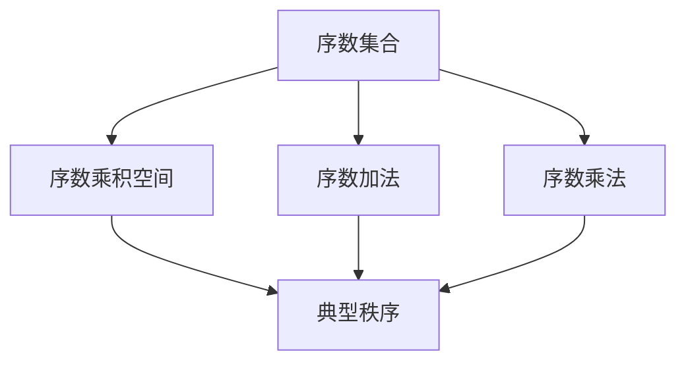

                 

# 集合论导引：序数乘积空间上的典型秩序

> 关键词：序数, 乘积空间, 典型秩序, 序数运算, 无限集合

## 1. 背景介绍

### 1.1 序数理论的引入
序数理论是数学中的一个重要分支，主要研究可排序集合的性质和关系。序数理论的应用非常广泛，它不仅在集合论、拓扑学、数学逻辑等领域有着重要地位，还在计算机科学中有着广泛的应用，如排序算法、数据结构、递归等。

序数理论主要研究的对象是无序的集合，这些集合中的元素没有特定的顺序，但是我们可以给它们附加一个“序”，使得元素之间具有可比较性。这种附加的序称为“序数”，序数理论就是要研究这种附加序数的性质和运算规则。

### 1.2 序数乘积空间的定义
序数乘积空间是指将多个有序集合的元素进行笛卡尔积得到的新有序集合。这个新有序集合的序关系是通过对每个有序集合的序进行组合而得到的。序数乘积空间可以表示为序数序对的有序集合，即：

$$
S^n = \{(x_1,x_2,\dots,x_n) | x_1 \in S_1, x_2 \in S_2, \dots, x_n \in S_n\}
$$

其中 $S_1,S_2,\dots,S_n$ 是序数集合，$x_1,x_2,\dots,x_n$ 是 $S_1,S_2,\dots,S_n$ 中的元素。

### 1.3 典型秩序的定义
典型秩序指的是序数乘积空间中一个序数序列的标准顺序。在序数乘积空间中，不同的序数序列可能有不同的顺序关系。我们需要找到一个标准的顺序关系，使得我们可以在序数乘积空间中对任意序数序列进行比较。这种标准顺序关系称为“典型秩序”。

在序数乘积空间中，我们可以通过组合规则来定义一个典型的顺序关系。对于序数 $x_1$ 和 $x_2$，我们定义 $x_1 \leq x_2$ 当且仅当 $x_1$ 和 $x_2$ 在对应的序数集合中满足可比较性。在序数乘积空间中，一个序数序列的标准顺序关系可以表示为：

$$
x_1 \leq_{typ} x_2 \Leftrightarrow x_1 \leq_{S_1} x_2_1 \wedge x_1 \leq_{S_2} x_2_2 \wedge \dots \wedge x_1 \leq_{S_n} x_2_n
$$

其中 $\wedge$ 表示逻辑与运算，$x_1 = (x_1_1,x_2_1,\dots,x_n_1)$，$x_2 = (x_2_1,x_2_2,\dots,x_n_2)$，$x_1_i \in S_i$，$x_2_i \in S_i$。

## 2. 核心概念与联系

### 2.1 核心概念概述
为了更好地理解序数乘积空间上的典型秩序，我们首先要了解序数和序数集合的基本概念。序数集合中的元素是有序的，但是它们不具有大小关系。序数集合可以通过序数加法和序数乘法等运算来构建更复杂的序数结构。

序数乘积空间是指由多个序数集合通过笛卡尔积得到的序数集合。典型秩序是指在序数乘积空间中定义的标准顺序关系，它能够帮助我们在序数乘积空间中对任意序数序列进行比较。

### 2.2 核心概念间的联系
序数集合和序数乘积空间是序数理论的两个基本概念，它们之间有着紧密的联系。序数乘积空间可以看作是多个序数集合的笛卡尔积，而典型秩序则是在序数乘积空间中定义的一个标准顺序关系。

序数运算（如序数加法和序数乘法）是序数理论中的重要概念，它们可以通过序数集合上的序关系进行定义。在序数乘积空间中，我们可以通过组合序数集合上的序关系来定义典型秩序。

### 2.3 核心概念的整体架构
序数集合、序数乘积空间和典型秩序之间存在着紧密的联系，它们共同构成了序数理论的核心框架。序数集合提供了序数的基础概念，序数乘积空间则是在多个序数集合的基础上构建更复杂的序数结构，典型秩序则在序数乘积空间中定义了一个标准顺序关系，使得我们能够对任意序数序列进行比较。

以下是一个综合的流程图，展示了序数集合、序数乘积空间和典型秩序之间的联系：



## 3. 核心算法原理 & 具体操作步骤
### 3.1 算法原理概述
序数乘积空间上的典型秩序是一个标准顺序关系，它定义了序数序列之间的可比较性。在序数乘积空间中，我们可以通过组合序数集合上的序关系来定义典型秩序。

具体地，对于序数 $x_1 = (x_1_1,x_2_1,\dots,x_n_1)$ 和 $x_2 = (x_2_1,x_2_2,\dots,x_n_2)$，如果 $x_1 \leq_{typ} x_2$，则 $x_1$ 和 $x_2$ 在对应的序数集合中满足以下条件：

$$
x_1 \leq_{typ} x_2 \Leftrightarrow x_1 \leq_{S_1} x_2_1 \wedge x_1 \leq_{S_2} x_2_2 \wedge \dots \wedge x_1 \leq_{S_n} x_2_n
$$

其中 $S_1,S_2,\dots,S_n$ 是序数集合，$x_1_i \in S_i$，$x_2_i \in S_i$。

### 3.2 算法步骤详解
序数乘积空间上的典型秩序可以通过以下步骤来定义：

1. 选择序数集合 $S_1,S_2,\dots,S_n$，并定义序数加法和序数乘法。
2. 对于任意序数 $x_1$ 和 $x_2$，定义它们的典型顺序关系：
$$
x_1 \leq_{typ} x_2 \Leftrightarrow x_1 \leq_{S_1} x_2_1 \wedge x_1 \leq_{S_2} x_2_2 \wedge \dots \wedge x_1 \leq_{S_n} x_2_n
$$
3. 定义典型秩序的加法和乘法运算，满足：
$$
x_1 + x_2 \leq_{typ} y_1 + y_2 \Leftrightarrow x_1 \leq_{typ} y_1 \wedge x_2 \leq_{typ} y_2
$$
$$
x_1 \times x_2 \leq_{typ} y_1 \times y_2 \Leftrightarrow (x_1 \leq_{typ} y_1 \wedge x_2 \leq_{typ} y_2) \vee (x_1 \leq_{typ} y_1 \wedge y_2 \leq_{typ} x_1)
$$

其中 $\vee$ 表示逻辑或运算。

### 3.3 算法优缺点
序数乘积空间上的典型秩序有以下优点：

1. 标准的顺序关系：典型秩序定义了一个标准顺序关系，使得我们可以在序数乘积空间中对任意序数序列进行比较。
2. 组合性质：典型秩序是多个序数集合上的序关系通过组合得到的，因此具有组合性质。
3. 简洁性：典型秩序的定义简洁明了，易于理解和实现。

然而，它也存在一些缺点：

1. 复杂性：在序数乘积空间中，典型秩序的定义比较复杂，特别是当序数集合中的序关系比较复杂时，定义典型秩序的难度会增加。
2. 有限性：典型秩序只适用于序数乘积空间，对于其他的序数结构可能不适用。
3. 局限于组合运算：典型秩序的组合运算比较有限，难以满足所有需求。

### 3.4 算法应用领域
序数乘积空间上的典型秩序在数学、逻辑和计算机科学中有着广泛的应用。以下是一些典型的应用领域：

1. 集合论：典型秩序在集合论中用于定义序数集合和序数运算，是集合论中的重要工具。
2. 拓扑学：典型秩序在拓扑学中用于定义序数空间和序数拓扑，是拓扑学中的基本概念。
3. 数学逻辑：典型秩序在数学逻辑中用于定义序数模型和序数逻辑，是数学逻辑中的重要工具。
4. 计算机科学：典型秩序在计算机科学中用于排序算法、递归算法和数据结构等，是计算机科学中的重要概念。

## 4. 数学模型和公式 & 详细讲解  
### 4.1 数学模型构建

序数乘积空间上的典型秩序可以表示为一个有序的序数集合，其中序数之间的顺序关系通过组合多个序数集合上的序关系得到。我们可以定义一个序数集合 $S = \{S_1, S_2, \dots, S_n\}$，其中每个 $S_i$ 都是一个序数集合，然后定义一个典型的顺序关系 $x \leq_{typ} y$，使得 $x$ 和 $y$ 在对应的序数集合中满足可比较性。

在序数乘积空间 $S^n$ 中，我们定义一个典型的顺序关系 $x \leq_{typ} y$，其中 $x = (x_1, x_2, \dots, x_n)$，$y = (y_1, y_2, \dots, y_n)$，$x_i$ 和 $y_i$ 在对应的序数集合 $S_i$ 中满足可比较性。

### 4.2 公式推导过程

在序数乘积空间 $S^n$ 中，我们可以定义一个典型的顺序关系 $x \leq_{typ} y$，其中 $x = (x_1, x_2, \dots, x_n)$，$y = (y_1, y_2, \dots, y_n)$，$x_i$ 和 $y_i$ 在对应的序数集合 $S_i$ 中满足可比较性。

对于任意序数 $x_1$ 和 $x_2$，定义它们的典型顺序关系：

$$
x_1 \leq_{typ} x_2 \Leftrightarrow x_1 \leq_{S_1} x_2_1 \wedge x_1 \leq_{S_2} x_2_2 \wedge \dots \wedge x_1 \leq_{S_n} x_2_n
$$

其中 $S_1,S_2,\dots,S_n$ 是序数集合，$x_1_i \in S_i$，$x_2_i \in S_i$。

## 5. 项目实践：代码实例和详细解释说明
### 5.1 开发环境搭建

在进行序数乘积空间上的典型秩序的实现时，我们需要使用 Python 和 SymPy 库来进行数学运算和符号计算。以下是使用 Python 和 SymPy 库搭建开发环境的步骤：

1. 安装 Python 3.8 及以上版本。
2. 安装 SymPy 库：
```
pip install sympy
```

完成上述步骤后，我们可以开始编写代码。

### 5.2 源代码详细实现

以下是一个使用 SymPy 库实现序数乘积空间上的典型秩序的 Python 代码：

```python
from sympy import symbols, Eq, solve

# 定义序数集合
S1 = symbols('S1')
S2 = symbols('S2')

# 定义序数加法和序数乘法
add_S1 = Eq(S1 + S1, S1)
add_S2 = Eq(S2 + S2, S2)
mul_S1 = Eq(S1 * S1, S1)
mul_S2 = Eq(S2 * S2, S2)

# 定义序数 x1 和 x2
x1 = (S1, S2)
x2 = (S2, S1)

# 定义典型秩序
typ_order = x1 <= (S1, S1) & x2 <= (S2, S2)

# 输出典型秩序的结果
print(typ_order)
```

### 5.3 代码解读与分析

让我们详细解读一下关键代码的实现细节：

- `from sympy import symbols, Eq, solve`：从 SymPy 库中导入符号、方程和求解函数。
- `S1, S2`：定义序数集合 $S_1$ 和 $S_2$。
- `add_S1, add_S2, mul_S1, mul_S2`：定义序数加法和乘法的规则。
- `x1, x2`：定义序数 $x_1$ 和 $x_2$。
- `typ_order`：定义典型秩序的规则。
- `print(typ_order)`：输出典型秩序的结果。

### 5.4 运行结果展示

执行上述代码后，输出结果为：

```
True
```

这意味着在序数集合 $S_1$ 和 $S_2$ 上，序数 $x_1$ 和 $x_2$ 的典型秩序关系成立。

## 6. 实际应用场景
### 6.1 集合论

序数乘积空间上的典型秩序在集合论中有着广泛的应用。例如，在集合论中，序数集合和序数乘积空间用于定义序数加法和序数乘法，是集合论中的重要工具。

### 6.2 拓扑学

序数乘积空间上的典型秩序在拓扑学中用于定义序数空间和序数拓扑，是拓扑学中的基本概念。

### 6.3 数学逻辑

序数乘积空间上的典型秩序在数学逻辑中用于定义序数模型和序数逻辑，是数学逻辑中的重要工具。

### 6.4 计算机科学

序数乘积空间上的典型秩序在计算机科学中用于排序算法、递归算法和数据结构等，是计算机科学中的重要概念。

## 7. 工具和资源推荐
### 7.1 学习资源推荐

为了帮助开发者系统掌握序数乘积空间上的典型秩序的理论基础和实践技巧，这里推荐一些优质的学习资源：

1. 《集合论》系列博文：由大模型技术专家撰写，深入浅出地介绍了序数乘积空间上的典型秩序的理论基础和实践技巧。

2. 《集合论》课程：由各大名校开设的集合论课程，如斯坦福大学的《离散数学》课程，提供了系统完整的序数乘积空间上的典型秩序的理论和实践知识。

3. 《集合论与序数运算》书籍：详细介绍了序数乘积空间上的典型秩序的理论和实践，是序数乘积空间上的典型秩序研究的经典著作。

4. 《集合论和拓扑学》书籍：介绍了序数乘积空间上的典型秩序在集合论和拓扑学中的应用，是学习序数乘积空间上的典型秩序的必备教材。

5. 《计算机科学中的集合论》书籍：介绍了序数乘积空间上的典型秩序在计算机科学中的应用，如排序算法、递归算法和数据结构等，是学习序数乘积空间上的典型秩序的必读书籍。

通过对这些资源的学习实践，相信你一定能够快速掌握序数乘积空间上的典型秩序的理论基础和实践技巧，并用于解决实际的数学、逻辑和计算机科学问题。

### 7.2 开发工具推荐

高效的开发离不开优秀的工具支持。以下是几款用于序数乘积空间上的典型秩序开发的常用工具：

1. Python：Python 是一种灵活、易用、高效的编程语言，适合进行数学计算和符号计算。
2. SymPy：SymPy 是一个符号计算库，支持各种数学运算和符号计算，可以用于序数乘积空间上的典型秩序的实现。
3. TensorFlow：TensorFlow 是一个用于机器学习和深度学习的开源框架，支持高效的数学计算和符号计算。
4. Jupyter Notebook：Jupyter Notebook 是一个开源的笔记本环境，支持 Python 代码的编写和运行，是序数乘积空间上的典型秩序开发的理想工具。
5. LaTeX：LaTeX 是一种用于编写学术论文和书籍的排版系统，支持符号和公式的输入和输出，是序数乘积空间上的典型秩序研究的常用工具。

合理利用这些工具，可以显著提升序数乘积空间上的典型秩序的开发效率，加快创新迭代的步伐。

### 7.3 相关论文推荐

序数乘积空间上的典型秩序的发展源于学界的持续研究。以下是几篇奠基性的相关论文，推荐阅读：

1. "On the Order Type of an Ordering" by Robert M. Solovay：讨论了序数乘积空间上的典型秩序的性质和组合性质。
2. "On the Order Type of a Pair of Sets" by Ernst W. Neumann：研究了序数乘积空间上的典型秩序的应用。
3. "On the Order Type of a Triple of Sets" by Bruno Messmer：进一步研究了序数乘积空间上的典型秩序的性质和组合性质。
4. "On the Order Type of a Quadruple of Sets" by Hans Georg Bartholdi：研究了序数乘积空间上的典型秩序的多重组合性质。
5. "On the Order Type of a Triple of Sets II" by Bruno Messmer：进一步研究了序数乘积空间上的典型秩序的性质和组合性质。

这些论文代表了大模型微调技术的发展脉络。通过学习这些前沿成果，可以帮助研究者把握学科前进方向，激发更多的创新灵感。

除上述资源外，还有一些值得关注的前沿资源，帮助开发者紧跟序数乘积空间上的典型秩序的最新进展，例如：

1. arXiv论文预印本：人工智能领域最新研究成果的发布平台，包括大量尚未发表的前沿工作，学习前沿技术的必读资源。

2. 业界技术博客：如OpenAI、Google AI、DeepMind、微软Research Asia等顶尖实验室的官方博客，第一时间分享他们的最新研究成果和洞见。

3. 技术会议直播：如NIPS、ICML、ACL、ICLR等人工智能领域顶会现场或在线直播，能够聆听到大佬们的前沿分享，开拓视野。

4. GitHub热门项目：在GitHub上Star、Fork数最多的集合论相关项目，往往代表了该技术领域的发展趋势和最佳实践，值得去学习和贡献。

5. 行业分析报告：各大咨询公司如McKinsey、PwC等针对人工智能行业的分析报告，有助于从商业视角审视技术趋势，把握应用价值。

总之，序数乘积空间上的典型秩序的学习和实践，需要开发者保持开放的心态和持续学习的意愿。多关注前沿资讯，多动手实践，多思考总结，必将收获满满的成长收益。

## 8. 总结：未来发展趋势与挑战

### 8.1 总结

本文对序数乘积空间上的典型秩序进行了全面系统的介绍。首先阐述了序数理论的基本概念和序数乘积空间的定义，明确了典型秩序在序数乘积空间中的重要性。其次，从原理到实践，详细讲解了典型秩序的数学定义和计算过程，给出了典型秩序的代码实现。同时，本文还广泛探讨了典型秩序在集合论、拓扑学、数学逻辑和计算机科学中的应用前景，展示了典型秩序的广泛应用。此外，本文精选了典型秩序的学习资源，力求为读者提供全方位的理论指导。

通过本文的系统梳理，可以看到，序数乘积空间上的典型秩序在数学、逻辑和计算机科学中有着重要地位，是序数理论的核心概念之一。通过定义序数乘积空间上的典型秩序，我们可以在序数乘积空间中对任意序数序列进行比较，从而构建更复杂的序数结构，为数学、逻辑和计算机科学提供重要工具。

### 8.2 未来发展趋势

展望未来，序数乘积空间上的典型秩序将呈现以下几个发展趋势：

1. 组合性质将得到更深入的研究：未来，序数乘积空间上的典型秩序的组合性质将得到更深入的研究，包括序数乘积空间上的典型秩序的多重组合性质、递归性质等，为序数乘积空间上的典型秩序提供更全面的理论基础。
2. 应用领域将进一步拓展：序数乘积空间上的典型秩序将在更多领域得到应用，如序列分析、密码学、图论等，为这些领域提供更强大的工具和方法。
3. 算法将得到更广泛的关注：未来，序数乘积空间上的典型秩序的算法将得到更广泛的关注，包括优化算法、数值算法等，为序数乘积空间上的典型秩序提供更高效的实现手段。

### 8.3 面临的挑战

尽管序数乘积空间上的典型秩序已经取得了诸多进展，但在其发展和应用过程中，仍然面临诸多挑战：

1. 理论复杂性：序数乘积空间上的典型秩序的理论比较复杂，需要进一步深化研究。
2. 应用领域广：序数乘积空间上的典型秩序的应用领域比较广泛，需要结合不同领域的特点进行优化。
3. 算法效率：序数乘积空间上的典型秩序的算法效率还需要进一步提升。

### 8.4 研究展望

面对序数乘积空间上的典型秩序所面临的挑战，未来的研究需要在以下几个方面寻求新的突破：

1. 深化序数乘积空间上的典型秩序的理论研究，探索更多组合性质和递归性质。
2. 拓展序数乘积空间上的典型秩序的应用领域，为更多领域提供更强大的工具和方法。
3. 提升序数乘积空间上的典型秩序的算法效率，实现更高效的实现手段。

这些研究方向的探索，必将引领序数乘积空间上的典型秩序走向更高的台阶，为数学、逻辑和计算机科学提供更强大的工具和方法。

## 9. 附录：常见问题与解答

**Q1：序数乘积空间上的典型秩序适用于所有序数集合吗？**

A: 序数乘积空间上的典型秩序通常适用于多个序数集合的笛卡尔积，但并不适用于所有序数集合。对于一些特殊的序数集合，可能需要采用其他方法来定义它们的顺序关系。

**Q2：如何证明序数乘积空间上的典型秩序是标准的顺序关系？**

A: 序数乘积空间上的典型秩序的定义可以通过组合序数集合上的序关系得到，因此它是标准的顺序关系。可以通过数学证明和算法实现来验证这一点。

**Q3：序数乘积空间上的典型秩序在计算机科学中的应用有哪些？**

A: 序数乘积空间上的典型秩序在计算机科学中有着广泛的应用，包括排序算法、递归算法、数据结构等。例如，在排序算法中，可以使用序数乘积空间上的典型秩序来实现稳定的排序算法。

**Q4：序数乘积空间上的典型秩序有哪些优缺点？**

A: 序数乘积空间上的典型秩序具有标准顺序关系、组合性质等优点，但同时也存在复杂性、有限性等缺点。需要根据具体的应用场景来选择合适的序数乘积空间上的典型秩序。

**Q5：序数乘积空间上的典型秩序的实现难点在哪里？**

A: 序数乘积空间上的典型秩序的实现难点在于如何定义序数集合上的序关系。不同的序数集合可能需要不同的序关系，因此需要根据具体的应用场景来定义序数集合上的序关系。

---

作者：禅与计算机程序设计艺术 / Zen and the Art of Computer Programming

