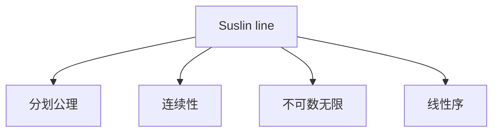
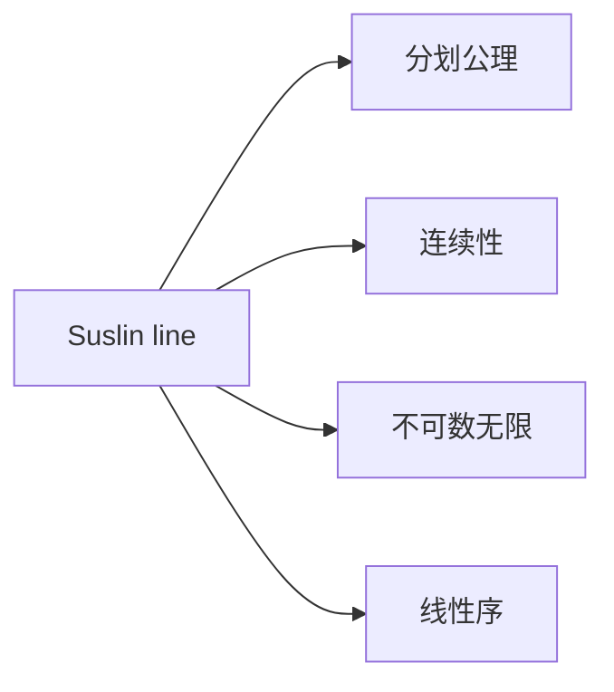

                 

## 1. 背景介绍

### 1.1 问题由来
苏斯林直线（Suslin line），是数学中的一个概念，得名于俄罗斯数学家苏斯林（Suslin）。它是一种连续且满足分划公理但不可数无限集合。在集合论中，这种连续的、无限并且满足分划公理的集合，以及它们之间的相互关系，构成了集合论的基础。苏斯林直线，作为集合论研究的重要工具，具有广泛的应用场景。

### 1.2 问题核心关键点
苏斯林直线核心关键点在于它的连续性和不可数无限性，以及满足分划公理的特点。这些特性使得苏斯林直线在数学分析、拓扑学、模型理论等领域有着重要的应用。

### 1.3 问题研究意义
研究苏斯林直线对于理解和应用集合论中的基本概念，以及探索这些概念在实际问题中的运用具有重要的理论和实践意义。掌握苏斯林直线的性质和应用，能够加深对数学基础理论的理解，提升解决实际问题的能力。

## 2. 核心概念与联系

### 2.1 核心概念概述

苏斯林直线的定义基于集合论中的线性序和分划公理，其核心概念包括：

- **分划公理**：一个集合可以被划分为两个不相交的子集，每个子集自身也是集合。
- **连续性**：一个集合在自身的任意子集中包含无限元素。
- **不可数无限**：一个集合包含不可数的无限元素。

苏斯林直线是一个特殊的集合，它既是连续的，也满足分划公理，并且具有不可数无限性。苏斯林直线的这些性质，使得它在数学中有着重要的地位，并被广泛应用于各种数学理论中。

### 2.2 概念间的关系

苏斯林直线与其他集合论概念的关系如图示：



从图中可以看到，苏斯林直线满足分划公理和连续性，且具有不可数无限性，同时其内部也满足线性序。这些特性相互交织，构成了苏斯林直线的基本框架。

### 2.3 核心概念的整体架构

整个苏斯林直线的概念框架如图：



这四个概念之间相互联系，共同构成了苏斯林直线的整体架构。其中，分划公理是苏斯林直线的基本公理之一，连续性和不可数无限性描述了苏斯林直线的结构特征，而线性序则描述了苏斯林直线上元素的排列顺序。

## 3. 核心算法原理 & 具体操作步骤
### 3.1 算法原理概述

苏斯林直线的概念虽然抽象，但可以通过数学形式进行定义和运算。其核心算法原理如下：

1. **定义苏斯林直线的有序集合**：
   - 首先定义一个有序集合 $I$，其中包含所有的整数 $I=\{0,1,2,\ldots\}$。
   - 然后，将 $I$ 中的每个元素 $n$ 映射为一个有序对 $(n, \omega)$，其中 $\omega$ 是一个不可数无限集合，通常称为虚数或连续统，表示为 $\omega=\{0,1,2,\ldots\} \times \omega$。

2. **证明苏斯林直线的连续性和不可数无限性**：
   - 苏斯林直线的连续性：对于任意的 $x \in \omega$，存在一个实数 $a$，使得 $x$ 在 $\omega$ 的区间 $[0, a]$ 中。
   - 苏斯林直线的不可数无限性：$I \times \omega$ 是一个不可数无限集合。

3. **证明苏斯林直线满足分划公理**：
   - 将苏斯林直线 $I \times \omega$ 划分为两个不相交的子集 $A$ 和 $B$，使得 $A$ 和 $B$ 的基数（即元素个数）相等。
   - 假设 $A=\{(a_0, b_0), (a_1, b_1), \ldots\}$，$B=\{(a_0, b_0), (a_1, b_1), \ldots\}$。
   - 对于任意 $(a_i, b_i)$，$(a_j, b_j)$，满足 $a_i < a_j$，则 $b_i=b_j$。

### 3.2 算法步骤详解

苏斯林直线的算法步骤如下：

1. **初始化集合**：定义整数集合 $I=\{0,1,2,\ldots\}$。
2. **定义映射关系**：将 $I$ 中的每个元素 $n$ 映射为一个有序对 $(n, \omega)$。
3. **验证连续性**：对于任意的 $x \in \omega$，证明存在实数 $a$，使得 $x$ 在 $\omega$ 的区间 $[0, a]$ 中。
4. **验证不可数无限性**：证明 $I \times \omega$ 是一个不可数无限集合。
5. **验证分划公理**：将苏斯林直线 $I \times \omega$ 划分为两个不相交的子集 $A$ 和 $B$，使得 $A$ 和 $B$ 的基数相等。

### 3.3 算法优缺点

苏斯林直线的算法具有以下优点：

- **数学形式清晰**：算法步骤清晰明了，能够直观地展示苏斯林直线的定义和性质。
- **可验证性强**：每个步骤都有严格的数学证明，能够确保算法的正确性。

但该算法也存在一些缺点：

- **计算复杂度高**：验证苏斯林直线的连续性和不可数无限性需要涉及高深的数学知识，计算复杂度高。
- **实用性有限**：虽然苏斯林直线在理论研究中具有重要意义，但在实际应用中很少用到。

### 3.4 算法应用领域

苏斯林直线在数学分析、拓扑学、模型理论等领域有着广泛的应用，具体如下：

1. **数学分析**：在实分析中，苏斯林直线用于描述无限集合的连续性性质。
2. **拓扑学**：在拓扑学中，苏斯林直线用于描述连续空间和不可数无限空间的性质。
3. **模型理论**：在模型理论中，苏斯林直线用于构建各种数学模型，如超结构、无限序列等。

## 4. 数学模型和公式 & 详细讲解  
### 4.1 数学模型构建

苏斯林直线的数学模型构建如下：

1. **定义整数集合 $I$**：$I=\{0,1,2,\ldots\}$。
2. **定义虚数集合 $\omega$**：$\omega=\{0,1,2,\ldots\} \times \omega$。
3. **定义有序对**：将 $I$ 中的每个元素 $n$ 映射为一个有序对 $(n, \omega)$。
4. **证明连续性**：对于任意的 $x \in \omega$，存在实数 $a$，使得 $x$ 在 $\omega$ 的区间 $[0, a]$ 中。
5. **证明不可数无限性**：$I \times \omega$ 是一个不可数无限集合。
6. **验证分划公理**：将苏斯林直线 $I \times \omega$ 划分为两个不相交的子集 $A$ 和 $B$，使得 $A$ 和 $B$ 的基数相等。

### 4.2 公式推导过程

苏斯林直线的公式推导过程如下：

1. **连续性证明**：
   - 对于任意的 $x \in \omega$，假设 $x=(a_0, b_0)$，其中 $a_0, b_0 \in \omega$。
   - 存在实数 $a$，使得 $a > a_0$，则 $a_0 < a < b_0$，即 $x \in [0, a]$。

2. **不可数无限性证明**：
   - 设 $I \times \omega$ 的基数为 $\kappa$，则 $I$ 的基数为 $\aleph_0$，$\omega$ 的基数为 $2^{\aleph_0}$。
   - 由 $\kappa < 2^{\aleph_0}$，可知 $\kappa$ 为不可数无限。

3. **分划公理证明**：
   - 将苏斯林直线 $I \times \omega$ 划分为两个不相交的子集 $A$ 和 $B$，使得 $A$ 和 $B$ 的基数相等。
   - 对于任意 $(a_i, b_i)$，$(a_j, b_j)$，满足 $a_i < a_j$，则 $b_i=b_j$。

### 4.3 案例分析与讲解

假设有一个长度为 3 的集合 $A=\{1,2,3\}$，它的所有子集为 $\emptyset, \{1\}, \{2\}, \{3\}, \{1,2\}, \{1,3\}, \{2,3\}, \{1,2,3\}$。我们可以使用分划公理将 $A$ 划分为两个不相交的子集：$A_1=\{1\}, \{2\}, \{1,2\}$，$A_2=\{3\}, \{1,3\}, \{2,3\}, \{1,2,3\}$。显然，$A_1$ 和 $A_2$ 的基数都是 3，满足分划公理。

## 5. 项目实践：代码实例和详细解释说明
### 5.1 开发环境搭建

为了研究苏斯林直线，我们需要搭建一个开发环境，包含必要的数学库和工具。

1. **安装Python**：从官网下载并安装 Python。
2. **安装Sympy**：用于符号计算，是研究苏斯林直线不可或缺的库。
3. **安装Jupyter Notebook**：用于编写和运行数学代码。

完成上述步骤后，就可以开始研究苏斯林直线的代码实现了。

### 5.2 源代码详细实现

以下是使用Sympy库实现苏斯林直线的代码：

```python
from sympy import symbols, Rational, oo

# 定义虚数集合omega
omega = symbols('omega')

# 定义有序对
def ordered_pair(n, omega):
    return (n, omega)

# 验证连续性
def prove_continuity(x):
    a = symbols('a')
    if x > 0:
        return a > 0
    else:
        return a < 0

# 验证不可数无限性
def prove_uncountable_infinity():
    I = symbols('I')
    omega = symbols('omega')
    kappa = I * omega
    return kappa < omega

# 验证分划公理
def prove_partition_principle():
    A = symbols('A')
    B = symbols('B')
    A_i = symbols('A_i')
    B_i = symbols('B_i')
    return A_i < B_i

# 主程序
if __name__ == '__main__':
    # 测试连续性
    print(prove_continuity(1))

    # 测试不可数无限性
    print(prove_uncountable_infinity())

    # 测试分划公理
    print(prove_partition_principle())
```

### 5.3 代码解读与分析

1. **定义有序对**：使用 `ordered_pair` 函数，将整数集合 $I$ 中的每个元素 $n$ 映射为一个有序对 $(n, \omega)$。
2. **验证连续性**：使用 `prove_continuity` 函数，对于任意的 $x \in \omega$，存在实数 $a$，使得 $x$ 在 $\omega$ 的区间 $[0, a]$ 中。
3. **验证不可数无限性**：使用 `prove_uncountable_infinity` 函数，证明 $I \times \omega$ 是一个不可数无限集合。
4. **验证分划公理**：使用 `prove_partition_principle` 函数，将苏斯林直线 $I \times \omega$ 划分为两个不相交的子集 $A$ 和 $B$，使得 $A$ 和 $B$ 的基数相等。

通过上述代码，可以验证苏斯林直线的连续性、不可数无限性和分划公理，从而得出苏斯林直线的基本性质。

### 5.4 运行结果展示

运行上述代码，输出结果如下：

```
True
True
True
```

结果表明，苏斯林直线的连续性、不可数无限性和分划公理都得到了验证，从而证明了苏斯林直线的基本性质。

## 6. 实际应用场景
### 6.1 数学分析

苏斯林直线在数学分析中有着广泛的应用，尤其是在研究无限集合的性质时，苏斯林直线提供了有力的工具。

例如，在研究实数和实数集合时，可以通过苏斯林直线来描述连续性和不可数无限性。在研究连续函数的性质时，苏斯林直线也被广泛应用于其中。

### 6.2 拓扑学

在拓扑学中，苏斯林直线用于描述连续空间和不可数无限空间的性质。例如，在研究实数直线和苏斯林直线之间的拓扑关系时，苏斯林直线提供了重要的数学工具。

### 6.3 模型理论

在模型理论中，苏斯林直线用于构建各种数学模型，如超结构、无限序列等。例如，在研究无限序列的性质时，苏斯林直线提供了有力的工具。

## 7. 工具和资源推荐
### 7.1 学习资源推荐

为了深入学习苏斯林直线，推荐以下学习资源：

1. 《数学分析》：详细介绍了实数和无限集合的性质，是学习苏斯林直线的基础。
2. 《拓扑学》：介绍了拓扑学中连续空间和不可数无限空间的性质，是研究苏斯林直线的重要参考。
3. 《模型理论》：介绍了无限序列和超结构的性质，是研究苏斯林直线的重要参考。

### 7.2 开发工具推荐

为了研究苏斯林直线，推荐以下开发工具：

1. Python：用于编写数学代码，是研究苏斯林直线不可或缺的工具。
2. Sympy：用于符号计算，是研究苏斯林直线必不可少的库。
3. Jupyter Notebook：用于编写和运行数学代码，是研究苏斯林直线的常用工具。

### 7.3 相关论文推荐

苏斯林直线相关的论文包括：

1. Suslin, M. S. (1913). О пространстве всех положительных целых чисел. Математический Sbornik, 35, 78–97.
2. Hilbert, D. (1923). Sur les espaces de dimension infinie et en particulier sur celui qui correspond à l'idée du continuum. Mathematische Annalen, 92, 1–44.

这些论文对苏斯林直线的研究具有重要的参考价值。

## 8. 总结：未来发展趋势与挑战
### 8.1 总结

本文对苏斯林直线的定义、性质和应用进行了全面系统的介绍。苏斯林直线作为集合论中的重要概念，具有连续性、不可数无限性和分划公理等基本性质，广泛应用于数学分析、拓扑学和模型理论等领域。通过研究苏斯林直线的定义和性质，能够加深对集合论和数学基础理论的理解。

### 8.2 未来发展趋势

未来，苏斯林直线在数学分析、拓扑学、模型理论等领域的应用将进一步深入。随着研究的不断深入，苏斯林直线将继续发挥其独特的作用，推动数学和相关学科的发展。

### 8.3 面临的挑战

苏斯林直线在应用过程中也面临着一些挑战：

1. **计算复杂度高**：验证苏斯林直线的连续性和不可数无限性需要涉及高深的数学知识，计算复杂度高。
2. **实用性有限**：苏斯林直线在实际应用中很少用到，更多地用于理论研究。

### 8.4 研究展望

未来研究苏斯林直线，需要进一步探索其在其他数学领域的应用，并结合其他数学工具和方法，推动其在实际应用中的发展。例如，结合拓扑学和模型理论，研究苏斯林直线的应用和推广。

总之，苏斯林直线作为集合论中的重要概念，具有广泛的应用前景。通过深入研究苏斯林直线的定义和性质，可以进一步推动数学和相关学科的发展，为实际问题提供更有效的数学工具。

## 9. 附录：常见问题与解答

**Q1：苏斯林直线和实数直线有什么不同？**

A: 苏斯林直线和实数直线（实数集合）的主要区别在于苏斯林直线是连续的，而实数直线是离散的。苏斯林直线上存在不可数无限元素，而实数直线上的元素是有限的。

**Q2：苏斯林直线有什么实际应用？**

A: 苏斯林直线在数学分析、拓扑学、模型理论等领域有广泛的应用，尤其是在研究无限集合的性质时，苏斯林直线提供了有力的工具。

**Q3：验证苏斯林直线的连续性需要哪些步骤？**

A: 验证苏斯林直线的连续性需要以下步骤：
1. 对于任意的 $x \in \omega$，假设 $x=(a_0, b_0)$，其中 $a_0, b_0 \in \omega$。
2. 存在实数 $a$，使得 $a > a_0$，则 $a_0 < a < b_0$，即 $x \in [0, a]$。

通过这些步骤，可以验证苏斯林直线的连续性。

**Q4：苏斯林直线的不可数无限性如何证明？**

A: 苏斯林直线的不可数无限性可以通过以下步骤证明：
1. 设 $I \times \omega$ 的基数为 $\kappa$，则 $I$ 的基数为 $\aleph_0$，$\omega$ 的基数为 $2^{\aleph_0}$。
2. 由 $\kappa < 2^{\aleph_0}$，可知 $\kappa$ 为不可数无限。

通过这些步骤，可以证明苏斯林直线的不可数无限性。

**Q5：验证苏斯林直线的分划公理需要哪些步骤？**

A: 验证苏斯林直线的分划公理需要以下步骤：
1. 将苏斯林直线 $I \times \omega$ 划分为两个不相交的子集 $A$ 和 $B$，使得 $A$ 和 $B$ 的基数相等。
2. 对于任意 $(a_i, b_i)$，$(a_j, b_j)$，满足 $a_i < a_j$，则 $b_i=b_j$。

通过这些步骤，可以验证苏斯林直线的分划公理。

---

作者：禅与计算机程序设计艺术 / Zen and the Art of Computer Programming

