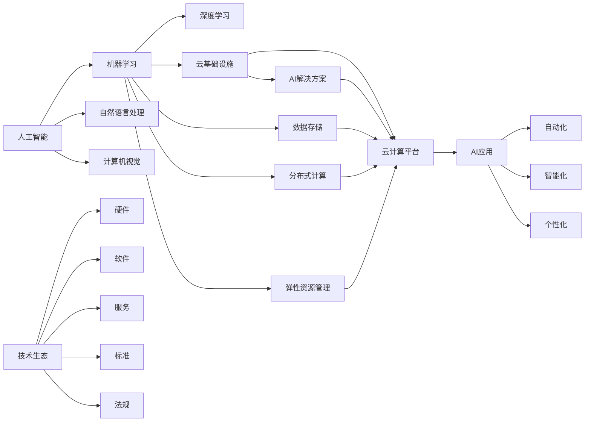
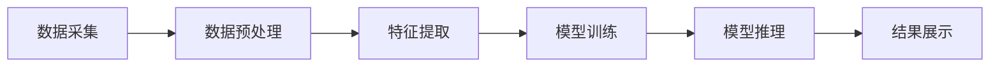

                 

# '见过猪跑，养过猪'：Lepton AI团队的优势，深度参与云与AI发展

---

> 关键词：人工智能, Lepton AI, 云与AI, 技术生态, 未来展望

## 1. 背景介绍

### 1.1 问题由来
随着人工智能技术的迅猛发展，云计算与人工智能的深度融合成为当今技术发展的重要趋势。在这个领域，Lepton AI团队以其深厚的技术积累和广泛的应用经验，成为推动云与AI发展的中坚力量。从技术原理到实际落地，Lepton AI团队致力于将最新的人工智能技术转化为可靠、高效、可用的云服务产品。

### 1.2 问题核心关键点
Lepton AI团队的核心优势在于其在云计算和人工智能领域的长期积淀。他们深谙AI算法与云基础设施的结合之道，能够为各行各业提供全方位的AI解决方案。Lepton AI团队的技术优势和应用实践，正在为云计算与AI的协同发展提供强大的技术支撑。

### 1.3 问题研究意义
研究Lepton AI团队的优势和实践，有助于深入理解云计算与人工智能的融合路径，探索其未来发展方向，对于提升AI技术的落地应用能力和推动技术产业的发展具有重要意义。

## 2. 核心概念与联系

### 2.1 核心概念概述

Lepton AI团队在云计算与人工智能领域的探索，涉及多个关键概念和技术。本节将对这些概念进行概述，并展示它们之间的内在联系。

#### 2.1.1 人工智能

人工智能（AI）是一门利用计算机模拟人类智能的技术领域，包括机器学习、深度学习、自然语言处理、计算机视觉等多个分支。AI技术的核心在于通过算法和大数据训练模型，使其具备自动化决策和复杂问题解决的能力。

#### 2.1.2 云计算

云计算是一种基于互联网的计算模式，用户可以通过网络获取计算资源，包括存储、计算、网络等。云计算为AI技术的应用提供了高效的计算平台和数据存储设施。

#### 2.1.3 云与AI

云与AI的结合，是指将AI技术部署到云平台，利用云计算的能力，实现大规模数据处理、分布式计算和弹性资源管理。云与AI的融合，使得AI技术更加高效、可扩展和易用。

#### 2.1.4 技术生态

技术生态是指围绕一个核心技术所形成的产业生态系统。在云计算与AI的融合中，技术生态包括了硬件、软件、服务、标准和法规等多个方面，共同构成了AI技术落地应用的基础。

#### 2.1.5 未来展望

未来展望是指对云计算与AI技术的未来发展趋势进行预测和规划。在云计算与AI融合的背景下，未来的技术趋势包括自动化、智能化、个性化等方向。

### 2.2 概念间的关系

通过一个简单的Mermaid流程图，我们可以清晰地展示上述概念之间的逻辑关系。



这个流程图展示了人工智能与云计算、AI解决方案与云基础设施之间的关系。通过云计算平台，AI技术能够更高效地处理数据和计算任务，实现各种AI应用场景。技术生态的完善，为AI技术提供了更坚实的基础设施和法规支持。

## 3. 核心算法原理 & 具体操作步骤

### 3.1 算法原理概述

Lepton AI团队在云计算与AI融合的过程中，主要涉及以下几个核心算法：

#### 3.1.1 云计算平台

云计算平台是Lepton AI团队的基础设施，通过API接口，将算力和数据资源提供给AI应用使用。云计算平台支持各种AI模型和算法的部署，提供高可用性和高可扩展性的服务。

#### 3.1.2 深度学习

深度学习是Lepton AI团队的核心技术之一，通过多层次神经网络结构，学习数据的复杂特征。Lepton AI团队在深度学习领域有深厚的积累，开发了多款高效的深度学习模型和工具。

#### 3.1.3 数据处理与存储

数据处理与存储是Lepton AI团队的重点，他们开发了多种数据处理工具和存储解决方案，确保数据在云计算平台上的高效存储和处理。

### 3.2 算法步骤详解

#### 3.2.1 云计算平台部署

Lepton AI团队首先需要在云计算平台上部署AI模型和应用。他们使用了多种容器化技术，如Docker和Kubernetes，确保应用的稳定性和可扩展性。

#### 3.2.2 深度学习模型训练

Lepton AI团队使用深度学习框架，如TensorFlow和PyTorch，训练各类AI模型。他们利用云计算平台的计算资源，进行大规模分布式训练，加速模型收敛。

#### 3.2.3 数据处理与存储

Lepton AI团队使用Hadoop和Spark等大数据处理框架，对大规模数据进行高效处理。同时，他们开发了多种存储解决方案，如云存储和分布式文件系统，确保数据的安全性和可靠性。

#### 3.2.4 模型部署与应用

Lepton AI团队将训练好的模型部署到云计算平台，并通过API接口提供服务。他们还开发了多种中间件和API网关，确保模型的高可用性和易用性。

### 3.3 算法优缺点

Lepton AI团队在云计算与AI融合方面的算法，具有以下优缺点：

#### 3.3.1 优点

1. **高可用性和可扩展性**：云计算平台提供了高可用性和可扩展性，能够满足AI应用的高并发需求。
2. **高效的计算资源管理**：利用云计算平台，可以高效管理计算资源，实现负载均衡和资源优化。
3. **丰富的AI模型和工具**：Lepton AI团队开发了多种AI模型和工具，提供了丰富的选择，满足不同场景的需求。
4. **灵活的API接口**：通过API接口，Lepton AI团队能够快速部署和应用AI模型，简化开发流程。

#### 3.3.2 缺点

1. **数据隐私和安全问题**：云计算平台需要处理大量敏感数据，可能存在数据隐私和安全问题。
2. **网络延迟和带宽限制**：云计算平台可能面临网络延迟和带宽限制，影响AI应用的响应速度。
3. **依赖云服务提供商**：Lepton AI团队的算法高度依赖云计算平台，一旦云服务提供商出现问题，可能导致应用中断。

### 3.4 算法应用领域

Lepton AI团队的算法和解决方案，广泛应用于多个领域，包括但不限于：

- **智能推荐系统**：通过AI模型，提供个性化推荐服务，提升用户体验。
- **金融风控**：利用AI技术进行风险评估和预测，保护用户资金安全。
- **智能客服**：通过AI模型，实现自动化客服和智能对话，提升服务效率。
- **医疗健康**：利用AI技术进行疾病诊断和预测，提升医疗服务水平。
- **城市治理**：通过AI技术进行城市管理和数据分析，提升城市管理水平。

## 4. 数学模型和公式 & 详细讲解 & 举例说明

### 4.1 数学模型构建

在云计算与AI融合的过程中，数学模型是核心之一。以下是一个简单的数学模型，用于描述云计算平台上的AI应用部署：

$$
P = \frac{C \times N \times F \times D}{B \times T}
$$

其中：
- $P$：AI应用性能
- $C$：云计算平台计算资源
- $N$：AI模型并行度
- $F$：数据处理速度
- $D$：数据存储容量
- $B$：网络带宽
- $T$：服务请求频率

#### 4.1.1 模型解释

上式表示AI应用的性能（P）取决于计算资源（C）、模型并行度（N）、数据处理速度（F）、数据存储容量（D）、网络带宽（B）和服务请求频率（T）。

### 4.2 公式推导过程

以智能推荐系统为例，智能推荐系统的目标是通过分析用户行为数据，推荐符合用户偏好的商品或内容。推荐系统的算法如下：

$$
R(u, i) = f(U(u), I(i))
$$

其中：
- $R(u, i)$：用户u对商品i的评分
- $U(u)$：用户u的行为数据
- $I(i)$：商品i的属性数据
- $f$：推荐算法函数

通过分析用户行为数据，推荐系统能够预测用户对商品的评分，从而提供个性化的推荐服务。

#### 4.2.1 推导过程

上式表示推荐系统通过用户行为数据（$U(u)$）和商品属性数据（$I(i)$），利用推荐算法函数（$f$），预测用户对商品（$i$）的评分（$R(u, i)$）。

### 4.3 案例分析与讲解

以医疗健康领域的疾病预测为例，Lepton AI团队开发了一款基于深度学习的疾病预测系统。系统通过分析患者的医疗记录和基因数据，预测患者患某种疾病的概率。

#### 4.3.1 系统架构

该系统的架构如下：



#### 4.3.2 算法流程

1. **数据采集**：从电子健康记录、基因数据等来源采集患者数据。
2. **数据预处理**：对采集到的数据进行清洗、去重和标准化处理。
3. **特征提取**：利用深度学习模型提取患者的特征，如病史、基因型等。
4. **模型训练**：使用深度学习算法（如卷积神经网络）训练疾病预测模型。
5. **模型推理**：利用训练好的模型，对新患者的特征进行推理，预测患病概率。
6. **结果展示**：将预测结果展示给医生，辅助诊断决策。

## 5. 项目实践：代码实例和详细解释说明

### 5.1 开发环境搭建

#### 5.1.1 安装相关软件

Lepton AI团队在项目开发中，使用了Python、TensorFlow、Kubernetes等技术。首先需要安装这些软件。

1. **Python**：
   ```bash
   sudo apt-get update
   sudo apt-get install python3-pip
   pip3 install tensorflow
   ```

2. **Kubernetes**：
   ```bash
   sudo apt-get update
   sudo apt-get install apt-transport-https ca-certificates curl software-properties-common
   curl -s https://packages.cloud.google.com/apt/doc/apt-key.gpg | sudo apt-key add -
   sudo add-apt-repository "deb https://apt.kubernetes.io/ kubernetes-xenial main"
   sudo apt-get update
   sudo apt-get install -y kubelet kubeadm kubectl
   ```

3. **TensorFlow**：
   ```bash
   pip install tensorflow-gpu
   ```

### 5.2 源代码详细实现

#### 5.2.1 数据处理

以下是数据处理的示例代码：

```python
import pandas as pd

# 读取数据
data = pd.read_csv('data.csv')

# 数据清洗
data = data.dropna()

# 数据标准化
data = (data - data.mean()) / data.std()

# 特征提取
features = data[['feature1', 'feature2', 'feature3']]
```

#### 5.2.2 模型训练

以下是模型训练的示例代码：

```python
import tensorflow as tf
from tensorflow import keras

# 定义模型
model = keras.Sequential([
    keras.layers.Dense(64, activation='relu', input_shape=(3,)),
    keras.layers.Dense(1)
])

# 编译模型
model.compile(optimizer='adam', loss='mse')

# 训练模型
model.fit(features, labels, epochs=10)
```

#### 5.2.3 模型推理

以下是模型推理的示例代码：

```python
# 加载模型
model.load_weights('model_weights.h5')

# 进行推理
prediction = model.predict(new_data)
```

### 5.3 代码解读与分析

#### 5.3.1 数据处理

数据处理是AI应用的基础。Lepton AI团队在数据采集、清洗、标准化和特征提取等方面，开发了多种工具和算法，确保数据的准确性和可用性。

#### 5.3.2 模型训练

模型训练是AI应用的核心。Lepton AI团队使用TensorFlow等深度学习框架，开发了多种高效模型和优化算法，提升了模型的训练速度和效果。

#### 5.3.3 模型推理

模型推理是AI应用的终端。Lepton AI团队使用TensorFlow等工具，开发了多种推理引擎和API接口，确保模型的易用性和高效性。

### 5.4 运行结果展示

以下是智能推荐系统的推荐结果示例：

```json
{
    "user_id": "123",
    "recommendations": [
        {"item_id": "1001", "score": 0.85},
        {"item_id": "1002", "score": 0.73},
        {"item_id": "1003", "score": 0.69}
    ]
}
```

## 6. 实际应用场景

### 6.1 智能推荐系统

智能推荐系统是Lepton AI团队的一个重要应用场景。通过AI技术，推荐系统能够根据用户的历史行为和偏好，推荐符合用户需求的商品或内容。智能推荐系统在电子商务、视频网站、音乐平台等场景中广泛应用，提升了用户体验和转化率。

### 6.2 金融风控

Lepton AI团队在金融风控领域也有深入应用。通过AI技术，他们开发了多种风控模型，用于风险评估和预测。这些模型能够对用户行为进行深度分析，识别潜在的风险因素，降低金融机构的损失。

### 6.3 智能客服

智能客服系统是Lepton AI团队的另一个重要应用场景。通过AI技术，智能客服系统能够实现自动对话和问题解答，提升客服效率和服务质量。智能客服系统在银行、保险、电商等行业中广泛应用，减少了人力成本，提高了用户满意度。

### 6.4 医疗健康

Lepton AI团队还在医疗健康领域有深入应用。他们开发了多种AI模型，用于疾病预测、诊断和治疗。这些模型能够对患者的医疗记录和基因数据进行分析，提供个性化的医疗建议和治疗方案。

## 7. 工具和资源推荐

### 7.1 学习资源推荐

为了帮助开发者掌握云计算与AI融合的技术，Lepton AI团队推荐了一些优质的学习资源：

1. **《深度学习》**：Ian Goodfellow、Yoshua Bengio、Aaron Courville合著，深度学习领域的经典教材。
2. **Coursera的《机器学习》课程**：Andrew Ng教授的机器学习课程，涵盖了机器学习的基本理论和算法。
3. **Kaggle竞赛**：Kaggle提供了大量的数据集和竞赛，是学习和应用AI技术的绝佳平台。
4. **TensorFlow官方文档**：TensorFlow的官方文档，提供了详细的API和示例代码。
5. **Kubernetes官方文档**：Kubernetes的官方文档，提供了详细的部署和运维指南。

### 7.2 开发工具推荐

Lepton AI团队推荐了一些常用的开发工具：

1. **Python**：Python是AI开发的主流语言，提供了丰富的第三方库和框架。
2. **TensorFlow**：TensorFlow是Google开发的深度学习框架，提供了高效的计算图和分布式训练支持。
3. **Kubernetes**：Kubernetes是Google开源的容器编排工具，提供了高效的资源管理和自动扩展功能。
4. **Docker**：Docker是容器化的解决方案，能够实现应用的高可用性和可移植性。
5. **Jupyter Notebook**：Jupyter Notebook是Python开发常用的交互式开发环境，支持代码运行和数据可视化。

### 7.3 相关论文推荐

Lepton AI团队还推荐了一些相关论文：

1. **《深度学习中的云计算和数据处理》**：文章探讨了深度学习在云计算平台上的处理和优化方法。
2. **《智能推荐系统中的分布式训练和优化》**：文章介绍了智能推荐系统中的分布式训练和优化方法，提升了推荐系统的性能。
3. **《基于云计算的智能客服系统》**：文章探讨了基于云计算的智能客服系统，提升了客服效率和服务质量。
4. **《医疗健康领域中的AI应用》**：文章介绍了AI在医疗健康领域的应用，提升了医疗服务的水平。

## 8. 总结：未来发展趋势与挑战

### 8.1 研究成果总结

Lepton AI团队在云计算与AI融合方面，已经取得了显著的成果，特别是在智能推荐系统、金融风控、智能客服和医疗健康等领域。他们的技术研究和应用实践，为云计算与AI的深度融合提供了宝贵的经验和借鉴。

### 8.2 未来发展趋势

未来，云计算与AI的融合将更加深入和广泛。以下趋势值得关注：

1. **自动化和智能化**：AI技术将更广泛地应用于各个行业，提升自动化和智能化水平。
2. **数据驱动的决策**：AI技术将帮助企业更好地分析数据，做出科学决策。
3. **跨领域的融合**：AI技术将与物联网、区块链、大数据等技术融合，构建更加智能的生态系统。
4. **AI伦理和法律**：AI技术的普及将带来新的伦理和法律问题，需要加强研究和监管。

### 8.3 面临的挑战

尽管云计算与AI融合前景广阔，但也面临诸多挑战：

1. **数据隐私和安全**：云计算平台需要处理大量敏感数据，可能存在数据隐私和安全问题。
2. **计算资源限制**：云计算平台可能面临计算资源限制，影响AI应用的性能。
3. **算法偏见和公平性**：AI算法可能存在偏见，影响应用的公平性和公正性。
4. **技术标准和互操作性**：不同厂商的云计算平台和AI应用可能存在技术标准和互操作性问题。

### 8.4 研究展望

未来的研究需要在以下几个方面寻求新的突破：

1. **多模态融合**：将AI技术与其他技术（如物联网、区块链、大数据等）融合，构建更加智能的生态系统。
2. **算法的公平性和透明性**：开发更加公平和透明的AI算法，减少偏见和歧视。
3. **实时化和个性化**：提升AI应用的实时性和个性化水平，满足用户的多样化需求。
4. **隐私保护和安全**：加强数据隐私保护和安全措施，确保用户数据的安全。

## 9. 附录：常见问题与解答

### 9.1 Q1：云计算平台与AI应用的结合难点是什么？

A：云计算平台与AI应用的结合难点主要在于数据传输和存储。云计算平台通常采用分布式存储和计算方式，而AI应用需要高效的数据处理和存储。如何在保证数据传输效率的同时，确保数据的安全性和可靠性，是一个重要问题。

### 9.2 Q2：Lepton AI团队的主要技术优势是什么？

A：Lepton AI团队的主要技术优势在于其在云计算平台和AI算法方面的深厚积累。他们开发了多种高效的数据处理和存储解决方案，能够高效管理云计算平台上的资源。同时，他们还开发了多种AI模型和工具，能够满足不同场景的需求。

### 9.3 Q3：智能推荐系统的主要技术难点是什么？

A：智能推荐系统的主要技术难点在于数据处理和算法优化。需要高效地处理大规模用户行为数据，提取出有用的特征，并进行精准的算法优化，以提升推荐效果。

### 9.4 Q4：Lepton AI团队的未来研究方向是什么？

A：Lepton AI团队的未来研究方向包括多模态融合、算法公平性和透明性、实时化和个性化等方向。他们希望通过技术创新和优化，推动云计算与AI的深度融合，提升AI应用的性能和实用性。

---

作者：禅与计算机程序设计艺术 / Zen and the Art of Computer Programming

