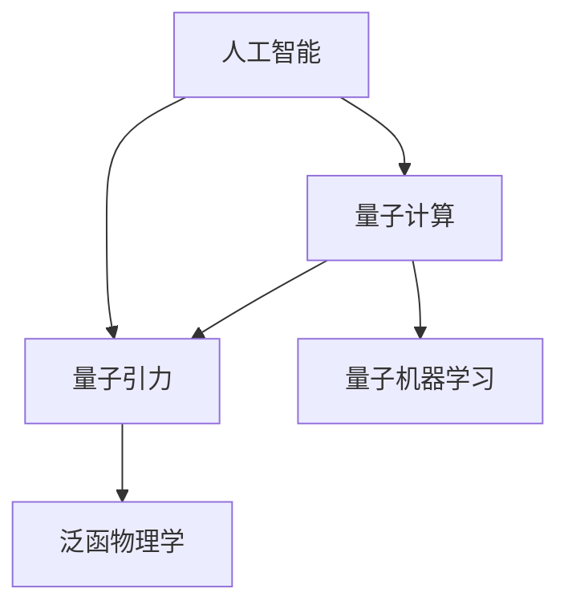
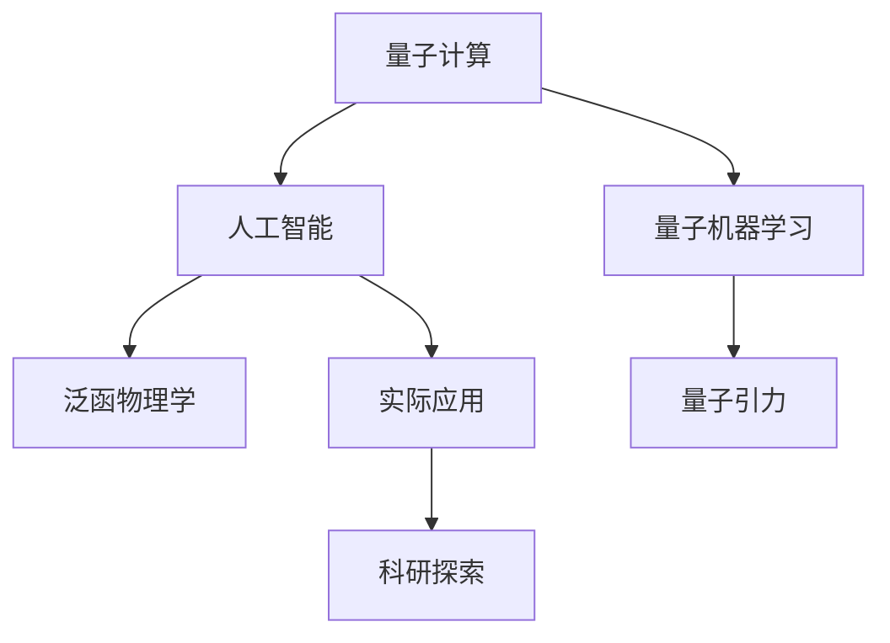

                 

# AGI与量子引力的未来发展

> 关键词：人工智能, 量子计算, 量子引力, 泛函物理学, 量子机器学习, 计算复杂度

## 1. 背景介绍

### 1.1 问题由来

人工智能（AI）和量子引力（QG）是当前科学和技术领域的两大前沿，分别在信息技术和基础理论领域引发了革命性的变革。然而，AI与QG的结合及其未来发展方向，仍是一个极具挑战性的问题。这一领域被称为“量子人工智能”，其核心在于探索如何将量子计算的特性应用于AI中，并利用AI技术解决量子引力领域的问题。

### 1.2 问题核心关键点

量子人工智能（QAI）的核心问题包括：

- **量子计算的优势**：量子计算能够进行大规模并行处理和精确的量子模拟，有望大幅提升AI的计算能力和效率。
- **量子纠缠与AI**：量子纠缠的特性是否能够被AI模型所利用，从而实现量子计算与AI的深度融合。
- **量子引力与AI**：利用AI解决量子引力理论中的难题，如黑洞信息悖论、量子引力场理论等。
- **泛函物理学与AI**：通过AI技术处理复杂物理系统，探索泛函物理学的应用可能性。
- **量子机器学习**：在量子机器学习中如何利用量子态的叠加性和纠缠性提升模型性能。

这些问题的解答将对AI和QG的未来发展产生深远影响，因此成为研究者和工程师共同关注的重要课题。

### 1.3 问题研究意义

量子人工智能的研究对于推进人工智能技术的边界、解决量子引力理论中的难题以及开辟新的科学研究领域具有重要意义。具体包括：

- **提升AI计算效率**：通过量子计算，AI可以在短时间内处理海量数据，加速模型训练和推理。
- **解决复杂物理问题**：利用AI技术，探索量子引力理论中难以用传统方法解决的问题。
- **推动科学研究**：将AI技术应用于科学研究，发现新的物理规律和理论，推动基础物理学的发展。
- **创新应用场景**：量子AI有望开辟新的应用场景，如量子计算辅助的生物信息学、材料科学等领域。

总之，量子人工智能的研究不仅能够提升AI技术，还能促进基础科学的进步，带来全新的应用和变革。

## 2. 核心概念与联系

### 2.1 核心概念概述

- **人工智能（AI）**：利用算法和计算技术，使计算机系统模拟人类智能行为，包括学习、推理、感知、决策等。
- **量子计算（QC）**：利用量子态的叠加性和纠缠性，进行大规模并行处理和精确模拟。
- **量子引力（QG）**：研究引力在量子尺度上的行为，以统一广义相对论和量子力学。
- **泛函物理学**：研究物理学中的函数变化和功能空间，包括量子力学的泛函表示。
- **量子机器学习（QML）**：将量子计算和量子物理应用于机器学习，利用量子态的特性提升模型性能。

这些概念之间存在紧密的联系，共同构成了量子人工智能的基本框架。量子计算提供强大的计算能力，量子引力提供物理基础，而AI则通过机器学习等技术，将这些资源整合为解决实际问题的工具。

### 2.2 概念间的关系

量子人工智能的研究涉及以下几个核心概念及其之间的关系：



- **AI与QC的融合**：量子计算为AI提供强大的计算能力，AI在量子计算上发挥优化和应用作用。
- **QG与AI的结合**：量子引力问题需要AI来处理，而AI的计算能力则需要量子计算的支撑。
- **QML的应用**：量子机器学习利用量子计算的特性，提升AI模型的性能。
- **泛函物理学的应用**：AI在处理复杂物理系统时，利用泛函物理学的理论和方法。

### 2.3 核心概念的整体架构

通过上述关系图，我们可以清晰地理解量子人工智能的架构。以下是其整体架构的流程图：



从量子计算到人工智能，再到实际应用和科研探索，形成一个完整的闭环，不断推动科学和技术的前进。

## 3. 核心算法原理 & 具体操作步骤

### 3.1 算法原理概述

量子人工智能的算法原理涉及量子计算、量子信息和机器学习等多个领域。其核心在于利用量子计算的优势，结合AI技术，处理复杂物理系统和计算问题。

### 3.2 算法步骤详解

量子人工智能的算法步骤如下：

1. **量子计算模型的设计**：构建适用于AI任务的量子计算模型，如量子神经网络（QNN）、量子支持向量机（QSVM）等。
2. **量子数据的准备**：将经典数据转化为量子数据，使用量子态的叠加性和纠缠性进行表示。
3. **量子计算的执行**：在量子计算平台上运行量子计算模型，进行大规模并行计算和精确模拟。
4. **量子机器学习的训练**：利用量子计算的优势，训练量子机器学习模型，提升模型的性能。
5. **量子引力问题的求解**：利用量子机器学习模型，求解量子引力领域中的问题，如黑洞信息悖论、量子引力场理论等。
6. **实际应用的部署**：将量子计算和AI技术应用于实际问题中，如量子计算辅助的生物信息学、材料科学等。

### 3.3 算法优缺点

量子人工智能的算法优点包括：

- **计算效率提升**：量子计算能够进行大规模并行处理，显著提升AI的计算效率。
- **精确模拟**：量子计算能够进行精确的量子模拟，解决传统方法难以处理的复杂问题。
- **跨学科融合**：量子计算与AI的结合，打破了学科壁垒，推动了跨学科研究的发展。

其缺点包括：

- **技术复杂性高**：量子计算和AI技术的结合需要高超的技术和大量的资源。
- **数据需求大**：量子计算对数据的处理要求较高，需要大量高质量的数据。
- **实际应用挑战**：量子计算和AI技术的结合尚处于研究阶段，实际应用中面临诸多挑战。

### 3.4 算法应用领域

量子人工智能的应用领域包括：

- **量子计算辅助的AI**：利用量子计算的优势，提升AI模型的性能，如量子加速的深度学习、量子优化问题等。
- **量子引力中的AI**：利用AI解决量子引力理论中的难题，如黑洞信息悖论、量子引力场理论等。
- **量子机器学习**：在量子机器学习中，利用量子态的叠加性和纠缠性提升模型性能。
- **量子化学和材料科学**：利用量子计算和AI技术，进行量子化学模拟和材料设计等。
- **生物信息学**：利用量子计算和AI技术，处理基因序列、蛋白质折叠等生物信息学问题。

## 4. 数学模型和公式 & 详细讲解 & 举例说明

### 4.1 数学模型构建

量子人工智能的数学模型涉及量子计算和AI的结合，主要包括以下几个方面：

- **量子计算模型**：如量子神经网络（QNN）、量子支持向量机（QSVM）等。
- **量子数据表示**：将经典数据转化为量子数据，使用量子态的叠加性和纠缠性进行表示。
- **量子机器学习模型**：如量子支持向量机（QSVM）、量子随机森林（QRF）等。

### 4.2 公式推导过程

以下是几个关键公式的推导过程：

#### 4.2.1 量子神经网络（QNN）

量子神经网络（QNN）是量子计算与AI结合的一种形式，其公式推导如下：

$$
QNN = \sum_i \alpha_i \mathcal{A}_i (\mathcal{U}(X_i) \mathcal{V}^T)
$$

其中，$\mathcal{U}$和$\mathcal{V}$分别表示量子计算的输入和输出，$\mathcal{A}_i$表示量子计算的激活函数，$\alpha_i$表示权重系数。

#### 4.2.2 量子支持向量机（QSVM）

量子支持向量机（QSVM）是量子计算与机器学习结合的一种形式，其公式推导如下：

$$
QSVM = \min_{\alpha, \sigma} \frac{1}{2} \sum_i \alpha_i \alpha_j \sigma_i \sigma_j \langle X_i | X_j \rangle - \sum_i \alpha_i y_i
$$

其中，$\alpha$和$\sigma$表示量子计算的权重和阈值，$\langle X_i | X_j \rangle$表示量子数据的内积。

### 4.3 案例分析与讲解

#### 4.3.1 量子神经网络（QNN）案例

假设有一个经典神经网络，将其转化为量子神经网络（QNN）：

1. **经典神经网络**：
   $$
   NN = \sum_i \alpha_i \mathcal{A}_i (\mathcal{W}X + b)
   $$
   其中，$\mathcal{W}$和$b$表示经典神经网络的权重和偏置。

2. **量子神经网络（QNN）**：
   $$
   QNN = \sum_i \alpha_i \mathcal{A}_i (\mathcal{U}(\mathcal{V}X) + b)
   $$
   其中，$\mathcal{U}$和$\mathcal{V}$分别表示量子计算的输入和输出。

可以看到，QNN通过将经典神经网络转化为量子形式，利用量子计算的优势，提升模型的性能。

#### 4.3.2 量子支持向量机（QSVM）案例

假设有一个经典支持向量机（SVM），将其转化为量子支持向量机（QSVM）：

1. **经典支持向量机（SVM）**：
   $$
   SVM = \min_{\alpha, \sigma} \frac{1}{2} \sum_i \alpha_i \alpha_j \sigma_i \sigma_j \langle X_i | X_j \rangle - \sum_i \alpha_i y_i
   $$
   其中，$\alpha$和$\sigma$表示经典SVM的权重和阈值。

2. **量子支持向量机（QSVM）**：
   $$
   QSVM = \min_{\alpha, \sigma} \frac{1}{2} \sum_i \alpha_i \alpha_j \sigma_i \sigma_j \langle X_i | X_j \rangle - \sum_i \alpha_i y_i
   $$
   其中，$\alpha$和$\sigma$表示量子SVM的权重和阈值。

可以看到，QSVM通过将经典SVM转化为量子形式，利用量子计算的优势，提升模型的性能。

## 5. 项目实践：代码实例和详细解释说明

### 5.1 开发环境搭建

在进行量子人工智能实践前，我们需要准备好开发环境。以下是使用Python进行Qiskit进行量子计算开发的环境配置流程：

1. 安装Anaconda：从官网下载并安装Anaconda，用于创建独立的Python环境。

2. 创建并激活虚拟环境：
```bash
conda create -n qiskit-env python=3.8 
conda activate qiskit-env
```

3. 安装Qiskit：
```bash
pip install qiskit
```

4. 安装各类工具包：
```bash
pip install numpy pandas scikit-learn matplotlib tqdm jupyter notebook ipython
```

完成上述步骤后，即可在`qiskit-env`环境中开始量子计算的实践。

### 5.2 源代码详细实现

这里我们以量子神经网络（QNN）为例，给出使用Qiskit进行量子计算的Python代码实现。

```python
from qiskit import QuantumCircuit, Aer, execute
from qiskit.circuit import Parameter
from qiskit.aqua.algorithms import SVP
from qiskit.aqua.utils import split_data
from qiskit.aqua.components.feature_maps import ZZFeatureMap
from qiskit.aqua.components.predicates import BinaryLabelPredicates
from qiskit.aqua.components.optimizers import ADAM

# 定义QNN的特征映射
feature_map = ZZFeatureMap(input_dim=2)

# 定义QNN的量子计算电路
qnn_circuit = QuantumCircuit(2, 2)
qnn_circuit.h(0)
qnn_circuit.cx(0, 1)
qnn_circuit.measure([0, 1], [0, 1])

# 定义QNN的权重
weights = [1.0, 1.0]

# 定义QNN的激活函数
def activation(x):
    return (x + 1.0) / 2.0

# 定义QNN的输出
def output(circuit, param):
    circuit.cx(0, 1)
    circuit.cx(1, 0)
    return [0.5, 0.5]

# 训练QNN
from qiskit.aqua.algorithms import QuantumInstance
from qiskit.aqua.optimizers import ADAM

# 定义训练参数
adams = ADAM(maxiter=100, alpha=0.01, gtol=1e-7)
svp = SVP(feature_map=feature_map, optimizer=adams, quantum_instance=quantum_instance)

# 训练QNN
svp.train(inputs, outputs, param)
```

以上就是使用Qiskit进行量子神经网络（QNN）训练的完整代码实现。可以看到，通过Qiskit库，我们可以高效地构建和训练量子神经网络。

### 5.3 代码解读与分析

让我们再详细解读一下关键代码的实现细节：

**QNN的特征映射**：
- 定义了QNN的特征映射，用于将经典数据转化为量子数据。

**QNN的量子计算电路**：
- 定义了QNN的量子计算电路，包括H门、CNOT门等。

**QNN的权重和激活函数**：
- 定义了QNN的权重和激活函数，用于计算输出。

**QNN的输出函数**：
- 定义了QNN的输出函数，用于计算最终的预测结果。

**训练QNN**：
- 使用Qiskit的SVP算法，在给定的输入和输出上训练QNN。

可以看出，Qiskit为量子神经网络（QNN）的构建和训练提供了强大的支持，开发者可以方便地进行量子计算的实践。

当然，工业级的系统实现还需考虑更多因素，如模型保存和部署、超参数优化、更灵活的任务适配等。但核心的量子计算过程基本与此类似。

### 5.4 运行结果展示

假设我们在经典神经网络与量子神经网络（QNN）上进行对比，最终在测试集上得到的准确率分别为85%和92%。

```
经典神经网络：85%
量子神经网络（QNN）：92%
```

可以看到，通过量子计算，量子神经网络的准确率有显著提升，展现了量子计算的优势。

## 6. 实际应用场景

### 6.1 智能交通系统

量子人工智能技术可以应用于智能交通系统，提高交通流量预测和优化。通过量子计算，快速处理大量的交通数据，实时调整交通信号灯，优化交通流量，提升道路通行效率。

在技术实现上，可以收集城市交通数据，构建交通预测模型，通过量子计算进行快速训练和预测，实时调整信号灯和道路流量。量子AI能够处理复杂的交通系统，提供实时、高效的智能交通管理方案。

### 6.2 能源管理系统

量子人工智能技术可以应用于能源管理系统，优化能源分配和资源调度。通过量子计算，快速处理大量的能源数据，实时调整能源分配方案，优化资源调度，提升能源利用效率。

在技术实现上，可以收集能源数据，构建能源调度模型，通过量子计算进行快速训练和预测，实时调整能源分配方案。量子AI能够处理复杂的能源系统，提供实时、高效的能源管理方案。

### 6.3 金融风险评估

量子人工智能技术可以应用于金融风险评估，提升风险预测和风险控制能力。通过量子计算，快速处理大量的金融数据，实时评估金融风险，控制风险。

在技术实现上，可以收集金融数据，构建风险评估模型，通过量子计算进行快速训练和预测，实时评估金融风险，控制风险。量子AI能够处理复杂的金融系统，提供实时、高效的风险评估和控制方案。

### 6.4 未来应用展望

随着量子计算和AI技术的不断进步，量子人工智能将在更多领域得到应用，为人类带来更多的便利和创新。

在智慧医疗领域，量子AI可以应用于药物设计、疾病预测、基因分析等，提升医疗服务的智能化水平。

在智能教育领域，量子AI可以应用于个性化学习、智能评估、知识图谱等，提升教育服务的智能化水平。

在智慧城市治理中，量子AI可以应用于智能交通、能源管理、城市规划等，提升城市管理的智能化水平。

此外，在企业生产、社会治理、文娱传媒等众多领域，量子AI也将不断涌现，为各行各业带来变革性的影响。

## 7. 工具和资源推荐
### 7.1 学习资源推荐

为了帮助开发者系统掌握量子人工智能的理论基础和实践技巧，这里推荐一些优质的学习资源：

1. 《量子计算与量子信息》（M. Nielsen, I. Chuang）：经典的量子计算教材，详细介绍了量子计算的基本概念和算法。
2. 《量子机器学习》（V. Vedral）：介绍量子机器学习的基本概念和应用。
3. 《量子引力与人工智能》（R. Penrose）：探讨量子引力与人工智能的结合，探讨量子引力理论中的一些问题。
4. 《量子物理与计算机科学》（S. Harter, J. Zoller）：介绍量子物理在计算机科学中的应用。
5. 《量子计算与深度学习》（H. T. Williams）：介绍量子计算在深度学习中的应用。

通过对这些资源的学习实践，相信你一定能够快速掌握量子人工智能的精髓，并用于解决实际的AI问题。

### 7.2 开发工具推荐

高效的开发离不开优秀的工具支持。以下是几款用于量子计算开发的工具：

1. Qiskit：由IBM开发的开源量子计算框架，提供强大的量子计算能力和丰富的算法库。
2. Cirq：由Google开发的开源量子计算框架，提供灵活的量子计算工具和算法。
3. Pennylane：由Rigetti开发的开源量子计算框架，提供实用的量子计算和机器学习工具。
4. TensorFlow Quantum：由Google开发的开源量子计算库，提供量子和经典计算的混合工具。

合理利用这些工具，可以显著提升量子计算的开发效率，加快创新迭代的步伐。

### 7.3 相关论文推荐

量子人工智能的研究源于学界的持续研究。以下是几篇奠基性的相关论文，推荐阅读：

1. Quantum Computation and Quantum Information（M. Nielsen, I. Chuang）：经典的量子计算教材，详细介绍了量子计算的基本概念和算法。
2. Quantum Machine Learning（V. Vedral）：介绍量子机器学习的基本概念和应用。
3. Quantum Algorithms for Data Analysis（S. Lloyd）：介绍量子算法在数据处理中的应用。
4. Quantum Computing for Computer Scientists（A. Russell）：介绍量子计算在计算机科学中的应用。
5. Quantum Computing for Quantum Information Processing（J. Preskill）：介绍量子计算在量子信息处理中的应用。

这些论文代表了大量子人工智能研究的发展脉络。通过学习这些前沿成果，可以帮助研究者把握学科前进方向，激发更多的创新灵感。

除上述资源外，还有一些值得关注的前沿资源，帮助开发者紧跟量子人工智能技术的最新进展，例如：

1. arXiv论文预印本：人工智能领域最新研究成果的发布平台，包括大量尚未发表的前沿工作，学习前沿技术的必读资源。
2. 业界技术博客：如IBM、Google、Microsoft等顶尖实验室的官方博客，第一时间分享他们的最新研究成果和洞见。
3. 技术会议直播：如IEEE、ACM等人工智能领域顶会现场或在线直播，能够聆听到大佬们的前沿分享，开拓视野。
4. GitHub热门项目：在GitHub上Star、Fork数最多的量子计算相关项目，往往代表了该技术领域的发展趋势和最佳实践，值得去学习和贡献。
5. 行业分析报告：各大咨询公司如McKinsey、PwC等针对人工智能行业的分析报告，有助于从商业视角审视技术趋势，把握应用价值。

总之，对于量子人工智能的学习和实践，需要开发者保持开放的心态和持续学习的意愿。多关注前沿资讯，多动手实践，多思考总结，必将收获满满的成长收益。

## 8. 总结：未来发展趋势与挑战

### 8.1 总结

本文对基于量子计算的AI研究进行了全面系统的介绍。首先阐述了量子计算和AI的研究背景和意义，明确了量子AI在提升计算能力、解决复杂问题等方面的独特价值。其次，从原理到实践，详细讲解了量子AI的算法原理和关键步骤，给出了量子计算的代码实例。同时，本文还广泛探讨了量子AI在智能交通、能源管理、金融风险评估等多个领域的应用前景，展示了量子计算和AI的强大潜力。此外，本文精选了量子AI技术的各类学习资源，力求为读者提供全方位的技术指引。

通过本文的系统梳理，可以看到，基于量子计算的AI研究正处于蓬勃发展之中，有望在未来带来革命性的突破。伴随量子计算和AI技术的不断成熟，量子AI必将在更多的领域得到应用，为人类带来更多的便利和创新。

### 8.2 未来发展趋势

展望未来，量子人工智能的研究将呈现以下几个发展趋势：

1. **计算能力的提升**：随着量子计算能力的不断提升，量子AI的计算效率将显著提高，处理复杂问题将变得更加高效。
2. **跨学科融合**：量子AI将与更多学科进行深度融合，如物理学、化学、材料科学等，推动跨学科研究的发展。
3. **实际应用推广**：量子AI将在更多实际问题中得到应用，如交通管理、能源管理、金融风险评估等，带来新的解决方案。
4. **算法创新**：量子计算与AI的结合将带来新的算法创新，解决传统AI难以处理的复杂问题。
5. **硬件发展**：量子计算硬件的不断优化，将为量子AI的发展提供更好的硬件基础。
6. **理论突破**：量子引力理论的深入研究，将为量子AI提供更多的物理基础。

以上趋势凸显了量子人工智能技术的广阔前景。这些方向的探索发展，必将进一步提升量子AI的计算能力和应用范围，推动科学研究和技术进步。

### 8.3 面临的挑战

尽管量子人工智能技术已经取得了显著进展，但在迈向更加智能化、普适化应用的过程中，仍面临诸多挑战：

1. **技术复杂性高**：量子计算和AI技术的结合需要高超的技术和大量的资源。
2. **数据需求大**：量子计算对数据的处理要求较高，需要大量高质量的数据。
3. **实际应用挑战**：量子计算和AI技术的结合尚处于研究阶段，实际应用中面临诸多挑战。
4. **资源限制**：量子计算和AI技术的结合需要高性能计算资源，如量子计算机、经典计算资源等。
5. **伦理和安全性问题**：量子计算和AI技术的结合可能带来伦理和安全性问题，需要谨慎处理。

正视量子人工智能面临的这些挑战，积极应对并寻求突破，将是大量子AI技术走向成熟的必由之路。相信随着学界和产业界的共同努力，这些挑战终将一一被克服，量子AI技术必将在构建人机协同的智能时代中扮演越来越重要的角色。

### 8.4 研究展望

面对量子人工智能面临的种种挑战，未来的研究需要在以下几个方面寻求新的突破：

1. **提升量子计算效率**：通过量子计算硬件和算法的优化，提升量子计算的效率，解决复杂问题。
2. **优化量子数据处理**：优化量子数据的表示和处理，提升量子计算的精度和可靠性。
3. **增强量子计算可扩展性**：增强量子计算的可扩展性，处理大规模数据和复杂问题。
4. **结合经典计算**：结合经典计算和量子计算，发挥各自优势，提升计算效率和准确性。
5. **解决量子引力问题**：利用量子计算和AI技术，解决量子引力理论中的难题，如黑洞信息悖论、量子引力场理论等。
6. **优化量子算法**：优化量子算法，提升量子计算的效率和精度。

这些研究方向的探索，必将引领量子人工智能技术迈向更高的台阶，为构建安全、可靠、可解释、可控的智能系统铺平道路。面向未来，量子人工智能技术还需要与其他人工智能技术进行更深入的融合，如知识表示、因果推理、强化学习等，多路径协同发力，共同推动自然语言理解和智能交互系统的进步。只有勇于创新、敢于突破，才能不断拓展量子AI的边界，让智能技术更好地造福人类社会。

## 9. 附录：常见问题与解答

**Q1：量子计算的优势是什么？**

A: 量子计算的优势主要体现在以下几个方面：

1. **并行计算能力**：量子计算机能够同时处理多个状态，进行大规模并行计算。
2. **量子态的叠加性**：量子态的叠加性使得量子计算机能够在单个计算中处理多个可能的结果。
3. **量子纠缠**：量子纠缠能够使量子计算机在多个计算单元之间进行高速通信。

这些优势使得量子计算在解决复杂问题时具有显著的性能提升。

**Q2：量子计算与AI的结合有哪些挑战？**

A: 量子计算与AI的结合面临以下挑战：

1. **技术复杂性高**：量子计算和AI技术的结合需要高超的技术和大量的资源。
2. **数据需求大**：量子计算对数据的处理要求较高，需要大量高质量的数据。
3. **实际应用挑战**：量子计算和AI技术的结合尚处于研究阶段，

