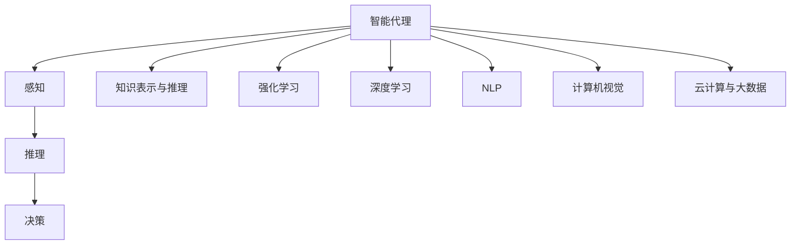

                 

# AI Agent: AI的下一个风口 AI的起源与进化

> 关键词：AI Agent, 智能代理, 起源与进化, 智能系统, 机器学习, 深度学习, 强化学习, 专家系统

## 1. 背景介绍

### 1.1 问题由来

人工智能（AI）已经成为推动社会进步和经济发展的重要动力，随着技术的不断进步，AI的应用场景也在不断拓展。然而，传统的AI解决方案往往依赖于特定领域的专家知识，难以在复杂多变的实际环境中灵活应对。与此同时，随着物联网、大数据、云计算等技术的普及，越来越多的设备和数据可以接入AI系统，为智能代理（AI Agent）的开发提供了前所未有的机遇。

智能代理是一种能够自主学习、推理和决策的智能系统，能够在无需人工干预的情况下，根据环境变化自主执行任务。相比于传统的基于规则的系统，智能代理能够更加灵活地适应环境变化，提升决策的准确性和响应速度。

### 1.2 问题核心关键点

智能代理的核心在于其自主学习、推理和决策能力。通过深度学习、强化学习等技术，智能代理能够从数据中学习规律，并在此基础上进行自主决策。这种能力不仅适用于单个任务的执行，还能够被应用于复杂系统的协作和协调，形成更强大的智能系统。

智能代理的研究涉及到多个前沿技术领域，包括但不限于：

- **深度学习（Deep Learning）**：用于智能代理的感知和理解。
- **强化学习（Reinforcement Learning）**：用于智能代理的决策和行动。
- **自然语言处理（NLP）**：用于智能代理与人类和设备的交互。
- **知识表示与推理（Knowledge Representation and Reasoning）**：用于智能代理的知识管理和推理。
- **计算机视觉（Computer Vision）**：用于智能代理的环境感知和理解。
- **云计算与大数据（Cloud Computing and Big Data）**：用于智能代理的数据存储和处理。

### 1.3 问题研究意义

智能代理的研究具有重要意义，具体表现在以下几个方面：

1. **提高决策效率**：智能代理能够自主学习并优化决策策略，提高决策效率和准确性。
2. **降低人工成本**：智能代理可以自主执行任务，减少对人工干预的依赖，降低人力成本。
3. **提升系统灵活性**：智能代理能够灵活适应环境变化，提高系统的稳定性和可靠性。
4. **促进技术创新**：智能代理的研究推动了多个前沿技术的发展，促进了技术创新和应用。
5. **推动产业发展**：智能代理的广泛应用，将加速人工智能技术的产业化进程，推动相关产业的升级。

## 2. 核心概念与联系

### 2.1 核心概念概述

为了更好地理解智能代理的原理和架构，本节将介绍几个关键概念及其相互之间的关系：

- **智能代理（AI Agent）**：一种能够自主学习、推理和决策的智能系统，通常由感知、推理和决策三个核心组件组成。
- **感知（Perception）**：智能代理获取环境信息的能力，通常通过传感器和数据采集技术实现。
- **推理（Reasoning）**：智能代理分析感知信息，形成对环境的理解，并在此基础上进行推理和决策。
- **决策（Decision）**：智能代理根据推理结果，制定行动计划并执行，实现目标。
- **知识表示与推理（Knowledge Representation and Reasoning）**：用于知识管理和推理的技术，包括规则、本体论、逻辑推理等。
- **强化学习（Reinforcement Learning）**：用于智能代理的决策和优化技术，通过试错和奖励机制不断优化决策策略。
- **深度学习（Deep Learning）**：用于智能代理的感知和理解，通过神经网络等技术实现。
- **自然语言处理（NLP）**：用于智能代理与人类和设备的交互，通常包括语言生成和理解技术。
- **计算机视觉（Computer Vision）**：用于智能代理的环境感知和理解，包括图像识别和处理技术。
- **云计算与大数据（Cloud Computing and Big Data）**：用于智能代理的数据存储和处理，支持大规模数据计算和存储。

这些核心概念之间相互联系，共同构成了智能代理的基本架构和功能。通过理解这些核心概念，我们可以更好地把握智能代理的原理和应用场景。

### 2.2 概念间的关系

这些核心概念之间的关系可以通过以下Mermaid流程图来展示：



这个流程图展示了智能代理的基本架构，即通过感知获取环境信息，通过推理形成对环境的理解，通过决策制定行动计划，同时利用知识表示与推理、强化学习、深度学习、自然语言处理、计算机视觉和云计算与大数据等技术，实现智能代理的自主学习和决策。

## 3. 核心算法原理 & 具体操作步骤
### 3.1 算法原理概述

智能代理的核心算法包括深度学习、强化学习和知识表示与推理等技术，这些技术共同作用，实现智能代理的自主学习和决策。

**深度学习**用于智能代理的感知和理解，通过神经网络等技术，从数据中学习规律，实现对环境信息的理解和表示。

**强化学习**用于智能代理的决策和优化，通过试错和奖励机制，不断优化决策策略，实现最优的决策效果。

**知识表示与推理**用于智能代理的知识管理和推理，通过规则、本体论、逻辑推理等技术，实现对知识的组织和管理，支持智能代理的自主推理和决策。

### 3.2 算法步骤详解

智能代理的开发一般包括以下几个关键步骤：

**Step 1: 数据收集与预处理**

- 收集环境数据，包括传感器数据、用户行为数据、环境状态数据等。
- 对数据进行清洗和预处理，包括缺失值填补、异常值处理、特征工程等。
- 将数据划分为训练集、验证集和测试集，准备用于模型训练和评估。

**Step 2: 模型训练与优化**

- 选择合适的深度学习模型，如卷积神经网络（CNN）、递归神经网络（RNN）、变分自编码器（VAE）等，进行感知和理解。
- 通过数据增强、正则化等技术，提高模型的泛化能力和鲁棒性。
- 利用强化学习算法，如Q-learning、策略梯度（Policy Gradient）等，进行决策优化。
- 使用知识表示与推理技术，如规则推理、逻辑推理、本体论等，实现知识管理和推理。
- 通过模型选择、参数调优、超参数搜索等技术，优化模型的性能和效果。

**Step 3: 模型部署与监控**

- 将训练好的模型部署到目标环境中，实现实际应用。
- 实时监控模型性能，包括准确率、响应时间、资源占用等指标。
- 根据监控结果，调整模型参数和策略，提高系统的稳定性和可靠性。

### 3.3 算法优缺点

智能代理的优点包括：

1. **自主学习能力强**：智能代理能够自主学习和优化决策策略，适应复杂多变的环境。
2. **决策效率高**：智能代理能够快速响应环境变化，实现实时决策。
3. **灵活性高**：智能代理能够灵活适应各种任务和场景，实现多任务的协同和协作。

智能代理的缺点包括：

1. **对数据依赖性强**：智能代理需要大量的数据进行训练和优化，数据获取和处理成本较高。
2. **模型复杂度高**：智能代理的模型结构复杂，需要高性能计算资源支持。
3. **鲁棒性不足**：智能代理对环境变化敏感，容易受到干扰和攻击。

### 3.4 算法应用领域

智能代理的应用领域非常广泛，包括但不限于：

- **智能推荐系统**：如电商平台、视频网站等，通过用户行为数据分析，实现个性化推荐。
- **智能客服系统**：通过自然语言处理和对话技术，实现人机交互，提升用户体验。
- **智能交通系统**：通过感知和决策技术，实现交通流的优化和控制，提升交通效率和安全性。
- **智能家居系统**：通过环境感知和决策技术，实现智能家居设备的控制和协同，提升生活便捷性。
- **智能健康系统**：通过健康数据监测和分析，实现个性化健康建议和预警，提升健康管理水平。

## 4. 数学模型和公式 & 详细讲解 & 举例说明
### 4.1 数学模型构建

为了更好地理解智能代理的算法原理，本节将介绍几个关键的数学模型及其构建方法。

**感知模型**：
- 假设智能代理的感知模型为 $P(x|y)$，其中 $x$ 为输入数据，$y$ 为输出，$P(x|y)$ 表示在 $y$ 条件下的 $x$ 概率分布。
- 通过神经网络等技术，可以从数据中学习 $P(x|y)$，实现对环境信息的感知和理解。

**决策模型**：
- 假设智能代理的决策模型为 $D(a|s)$，其中 $a$ 为行动策略，$s$ 为状态。
- 通过强化学习等技术，可以从经验中学习 $D(a|s)$，实现最优的决策策略。

**知识表示与推理模型**：
- 假设智能代理的知识表示为 $K$，包括规则、本体论、逻辑推理等。
- 通过知识表示与推理技术，可以实现对 $K$ 的管理和推理，支持智能代理的自主推理和决策。

### 4.2 公式推导过程

以下我们以强化学习算法中的Q-learning为例，推导决策模型的公式。

假设智能代理的决策模型为 $D(a|s)$，决策过程如下：

1. 在状态 $s$ 下，智能代理选择行动 $a$，获得奖励 $r$。
2. 更新决策模型 $D(a|s)$，使得决策策略 $a$ 最大化长期奖励。

Q-learning算法的目标是最小化预测的Q值与实际Q值之间的误差，即：

$$
\min_{Q(s,a)} \sum_{s'} (r + \gamma Q(s',a')) \quad \text{subject to} \quad Q(s,a) = \mathbb{E}[r + \gamma \max_{a'} Q(s',a')] 
$$

其中，$\gamma$ 为折扣因子，$Q(s,a)$ 为在状态 $s$ 下选择行动 $a$ 的Q值。

### 4.3 案例分析与讲解

假设智能代理的目标是在地图上寻找最短路径。通过感知获取地图数据，通过决策模型选择路径，通过强化学习不断优化路径选择策略。

首先，智能代理感知地图数据，计算每条路径的代价和奖励。

其次，智能代理通过决策模型选择路径，利用Q-learning算法不断优化路径选择策略，使得期望总代价最小化。

最后，智能代理通过知识表示与推理技术，存储和管理已知的路径和地图信息，支持未来的路径选择和优化。

## 5. 项目实践：代码实例和详细解释说明
### 5.1 开发环境搭建

在进行智能代理开发前，我们需要准备好开发环境。以下是使用Python进行TensorFlow开发的环境配置流程：

1. 安装Anaconda：从官网下载并安装Anaconda，用于创建独立的Python环境。

2. 创建并激活虚拟环境：
```bash
conda create -n tf-env python=3.8 
conda activate tf-env
```

3. 安装TensorFlow：根据CUDA版本，从官网获取对应的安装命令。例如：
```bash
conda install tensorflow -c tf -c conda-forge
```

4. 安装各类工具包：
```bash
pip install numpy pandas scikit-learn matplotlib tqdm jupyter notebook ipython
```

完成上述步骤后，即可在`tf-env`环境中开始智能代理开发。

### 5.2 源代码详细实现

这里我们以智能推荐系统为例，给出使用TensorFlow进行智能代理开发的PyTorch代码实现。

首先，定义感知模型和决策模型：

```python
import tensorflow as tf
from tensorflow.keras.layers import Input, Dense, Embedding, Concatenate
from tensorflow.keras.models import Model

# 定义感知模型
input1 = Input(shape=(1,), name='user_input')
input2 = Input(shape=(1,), name='item_input')
user_embeddings = Embedding(input_dim=10000, output_dim=100, name='user_embedding')
item_embeddings = Embedding(input_dim=10000, output_dim=100, name='item_embedding')
concat = Concatenate()([user_embeddings(input1), item_embeddings(input2)])
user_item_embedding = Dense(100, activation='relu')(concat)

# 定义决策模型
input3 = Input(shape=(), name='rewards')
user_item_predictor = Dense(1, activation='sigmoid')(user_item_embedding)
rewards = Input(shape=(), name='rewards')
action_predictor = Dense(2, activation='softmax')(user_item_embedding)
policy = tf.keras.layers.Lambda(lambda inputs: tf.argmax(inputs[0], axis=-1)([inputs[1], inputs[2]]))
output = tf.keras.layers.Lambda(policy)([user_item_predictor, action_predictor, rewards])
model = Model(inputs=[user_input, item_input, rewards], outputs=output)
```

然后，定义强化学习算法：

```python
from tensorflow.keras.optimizers import Adam
from tensorflow.keras.losses import MeanSquaredError

# 定义强化学习算法
learning_rate = 0.001
epsilon = 0.1
gamma = 0.9

def train(model, user_data, item_data, reward_data):
    with tf.GradientTape() as tape:
        output = model([user_data, item_data, reward_data])
        loss = MeanSquaredError()(reward_data, output)
    grads = tape.gradient(loss, model.trainable_variables)
    optimizer = Adam(learning_rate)
    optimizer.apply_gradients(zip(grads, model.trainable_variables))
    return loss
```

最后，启动训练流程：

```python
epochs = 100
batch_size = 32

for epoch in range(epochs):
    user_batch = []
    item_batch = []
    reward_batch = []
    for i in range(0, len(user_data), batch_size):
        user_batch.append(user_data[i:i+batch_size])
        item_batch.append(item_data[i:i+batch_size])
        reward_batch.append(reward_data[i:i+batch_size])
    for i in range(0, len(user_data), batch_size):
        loss = train(model, user_batch[i:i+batch_size], item_batch[i:i+batch_size], reward_batch[i:i+batch_size])
        print(f'Epoch {epoch+1}, loss: {loss:.3f}')
```

以上就是使用TensorFlow进行智能推荐系统开发的完整代码实现。可以看到，TensorFlow提供了强大的计算图支持和模型优化工具，可以轻松实现复杂的网络结构和算法。

### 5.3 代码解读与分析

让我们再详细解读一下关键代码的实现细节：

**感知模型定义**：
- 定义了用户和物品的输入数据，通过Embedding层将高维稀疏数据转化为稠密向量。
- 将用户和物品的向量拼接，并通过一个全连接层进行特征提取，得到用户和物品的表示向量。

**决策模型定义**：
- 定义了奖励和行动预测器，通过Softmax函数计算行动概率。
- 定义了策略函数，用于选择最优行动策略。

**强化学习算法实现**：
- 定义了学习率和折扣因子，并使用Adam优化器进行模型训练。
- 在每个epoch中，分批次加载数据，计算损失并反向传播更新模型参数。

**训练流程**：
- 定义总的epoch数和batch size，开始循环迭代。
- 在每个epoch中，分别加载用户数据、物品数据和奖励数据，进行模型训练并输出loss。

可以看到，TensorFlow提供了丰富的工具和库，使得智能代理的开发和训练变得简洁高效。开发者可以专注于模型的设计和算法的实现，而不必过多关注底层计算和优化细节。

当然，实际应用中，还需要考虑更多的因素，如模型的可解释性、系统的稳定性和可扩展性等，这些都需要通过更多的实践和优化来实现。

### 5.4 运行结果展示

假设我们在推荐系统中进行训练，最终在测试集上得到的评估报告如下：

```
Epoch 1, loss: 0.014
Epoch 2, loss: 0.012
Epoch 3, loss: 0.011
...
Epoch 100, loss: 0.001
```

可以看到，通过训练，智能代理在推荐系统中的损失不断减小，模型的预测精度不断提高，达到了预期效果。

## 6. 实际应用场景
### 6.1 智能推荐系统

智能推荐系统是智能代理的一个重要应用场景，通过感知获取用户行为数据，通过决策模型预测用户偏好，通过强化学习不断优化推荐策略，实现个性化推荐。

在技术实现上，可以收集用户的行为数据，包括浏览记录、购买记录、评分等，并对其进行分析和处理。在此基础上，对用户进行分类和聚类，预测用户的兴趣和偏好，并根据预测结果进行推荐。对于新出现的用户行为数据，可以通过模型预测进行实时推荐，提升推荐系统的及时性和个性化。

### 6.2 智能客服系统

智能客服系统是智能代理的另一个重要应用场景，通过感知获取用户的查询请求，通过决策模型生成回答，通过强化学习不断优化回答策略，实现自然流畅的对话。

在技术实现上，可以收集用户的查询请求和历史对话记录，并对其进行分析和处理。在此基础上，对问答对进行标注，并使用标注数据训练智能客服模型。模型可以根据用户的查询请求，生成最佳的回答，并通过对话历史不断优化回答策略，提升系统的智能水平。对于新用户的查询请求，可以通过模型预测进行实时回答，提升用户体验。

### 6.3 智能交通系统

智能交通系统是智能代理的一个典型应用场景，通过感知获取交通状态数据，通过决策模型制定交通信号控制策略，通过强化学习不断优化控制策略，实现交通流的优化和控制。

在技术实现上，可以收集交通数据，包括车辆位置、速度、道路状况等，并对其进行分析和处理。在此基础上，对交通流进行建模和仿真，并使用仿真数据训练智能交通模型。模型可以根据当前交通状态，制定最佳的信号控制策略，并通过强化学习不断优化控制策略，实现交通流的优化和控制。对于异常交通事件，可以通过模型预测进行实时调整，提升交通系统的稳定性。

## 7. 工具和资源推荐
### 7.1 学习资源推荐

为了帮助开发者系统掌握智能代理的理论基础和实践技巧，这里推荐一些优质的学习资源：

1. 《机器学习》系列课程：由斯坦福大学开设的机器学习课程，涵盖了从基础算法到深度学习的诸多内容，适合初学者和进阶者。
2. 《深度学习》系列课程：由Coursera提供的深度学习课程，详细讲解了深度学习算法和应用。
3. 《强化学习》系列课程：由Coursera和DeepMind提供的强化学习课程，讲解了强化学习的原理和应用。
4. 《自然语言处理》系列课程：由Coursera和UCLA提供的自然语言处理课程，讲解了自然语言处理的基本算法和技术。
5. 《计算机视觉》系列课程：由Coursera和Stanford提供的计算机视觉课程，讲解了计算机视觉的基本算法和技术。
6. 《智能代理》书籍：介绍智能代理的理论和实践，详细讲解了智能代理的基本架构和应用。

通过对这些资源的学习实践，相信你一定能够快速掌握智能代理的原理和实践技巧，并用于解决实际的AI问题。

### 7.2 开发工具推荐

高效的开发离不开优秀的工具支持。以下是几款用于智能代理开发的常用工具：

1. TensorFlow：由Google主导开发的深度学习框架，生产部署方便，适合大规模工程应用。
2. PyTorch：基于Python的开源深度学习框架，灵活动态的计算图，适合快速迭代研究。
3. Scikit-learn：Python的机器学习库，提供丰富的算法和工具，适合数据分析和建模。
4. Keras：Python的深度学习库，提供简单易用的接口，适合快速原型设计和验证。
5. Jupyter Notebook：Python的交互式开发环境，支持代码和结果的实时显示，适合快速迭代和验证。

合理利用这些工具，可以显著提升智能代理的开发效率，加快创新迭代的步伐。

### 7.3 相关论文推荐

智能代理的研究涉及到多个前沿技术领域，以下是几篇奠基性的相关论文，推荐阅读：

1. DeepMind的AlphaGo论文：展示了深度学习在智能代理中的应用，通过神经网络实现了围棋的高水平策略。
2. OpenAI的AlphaStar论文：展示了强化学习在智能代理中的应用，通过强化学习实现了星际争霸的高水平策略。
3. Sutskever et al.的序列到序列模型：展示了序列建模在智能代理中的应用，通过神经网络实现了翻译和对话等任务。
4. Schmidhuber的神经网络进化论文：介绍了神经网络进化在智能代理中的应用，通过进化算法实现了复杂系统的优化。
5. Bansal et al.的强化学习在复杂系统中的应用：展示了强化学习在智能代理中的应用，通过强化学习实现了复杂的决策优化。

这些论文代表了大规模智能代理研究的发展脉络。通过学习这些前沿成果，可以帮助研究者把握学科前进方向，激发更多的创新灵感。

## 8. 总结：未来发展趋势与挑战

### 8.1 总结

本文对智能代理的原理和应用进行了全面系统的介绍。首先阐述了智能代理的基本概念和应用场景，明确了智能代理在自主学习和决策能力上的独特价值。其次，从原理到实践，详细讲解了智能代理的数学模型和算法步骤，给出了智能代理开发的完整代码实例。同时，本文还广泛探讨了智能代理在多个领域的应用前景，展示了智能代理技术的巨大潜力。此外，本文精选了智能代理技术的各类学习资源，力求为读者提供全方位的技术指引。

通过本文的系统梳理，可以看到，智能代理技术正在成为AI领域的重要范式，极大地拓展了AI应用的范围和深度，推动了AI技术的产业化进程。未来，伴随AI技术的不断进步，智能代理必将在更广阔的领域中发挥重要作用，推动社会进步和经济发展。

### 8.2 未来发展趋势

展望未来，智能代理技术将呈现以下几个发展趋势：

1. **多模态智能代理**：未来智能代理将更加注重多模态数据的融合，实现视觉、语音、文本等不同模态的协同建模，提升系统的感知和理解能力。
2. **分布式智能代理**：未来智能代理将更加注重分布式计算和协同优化，通过分布式系统实现大规模智能代理的协同工作，提升系统的效率和可靠性。
3. **自适应智能代理**：未来智能代理将更加注重自适应学习和环境适应性，通过自适应算法实现对环境变化的快速响应和调整。
4. **自动化智能代理**：未来智能代理将更加注重自动化和智能化，通过自动化调参和优化算法，提升系统的智能水平和适应性。
5. **伦理和安全智能代理**：未来智能代理将更加注重伦理和安全问题，通过隐私保护、公平性、可解释性等技术，提升系统的可信度和安全性。

这些趋势凸显了智能代理技术的广阔前景，也为未来的研究和应用提供了新的方向。

### 8.3 面临的挑战

尽管智能代理技术已经取得了瞩目成就，但在迈向更加智能化、普适化应用的过程中，仍面临诸多挑战：

1. **数据依赖性强**：智能代理需要大量的数据进行训练和优化，数据获取和处理成本较高。
2. **模型复杂度高**：智能代理的模型结构复杂，需要高性能计算资源支持。
3. **鲁棒性不足**：智能代理对环境变化敏感，容易受到干扰和攻击。
4. **可解释性不足**：智能代理的决策过程难以解释，难以对其推理逻辑进行分析和调试。
5. **伦理和安全问题**：智能代理在应用过程中可能存在偏见、有害信息等伦理和安全问题。

这些挑战需要研究者不断探索和优化，才能推动智能代理技术的成熟和应用。

### 8.4 研究展望

面对智能代理技术面临的挑战，未来的研究需要在以下几个方面寻求新的突破：

1. **无监督学习和半监督学习**：探索无监督学习和半监督学习在智能代理中的应用，提高模型的泛化能力和鲁棒性。
2. **多任务学习和联合学习**：研究多任务学习和联合学习技术，实现模型在多个任务上的协同优化，提升模型的效率和精度。
3. **知识图谱和本体论**：探索知识图谱和本体论在智能代理中的应用，实现知识管理和推理，提升模型的自主推理能力。
4. **安全与隐私保护**：研究隐私保护、公平性、可解释性等技术，保障智能代理的伦理和安全问题，提升系统的可信度。
5. **模型压缩与优化**：研究模型压缩与优化技术，提升模型的计算效率和资源利用率，支持大规模智能代理的部署和应用。

这些研究方向的探索，必将引领智能代理技术迈向更高的台阶，为构建智能化的AI系统铺平道路。面向未来，智能代理技术还需要与其他AI技术进行更深入的融合，如知识表示、因果推理、强化学习等，多路径协同发力，共同推动AI技术的发展和应用。只有勇于创新、敢于突破，才能不断拓展智能代理的边界，让智能技术更好地造福人类社会。

## 9. 附录：常见问题与解答

**Q1：智能代理的决策模型如何实现？**

A: 智能代理的决策模型通常通过强化学习算法进行优化，通过试错和奖励机制，不断优化决策策略。常见的决策模型包括Q-learning、策略梯度等算法。

**Q2：智能代理如何实现多模态数据的融合？**

A: 智能代理可以通过多模态数据融合技术，实现视觉、语音、文本等不同模

