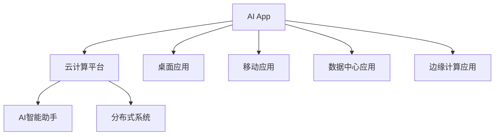
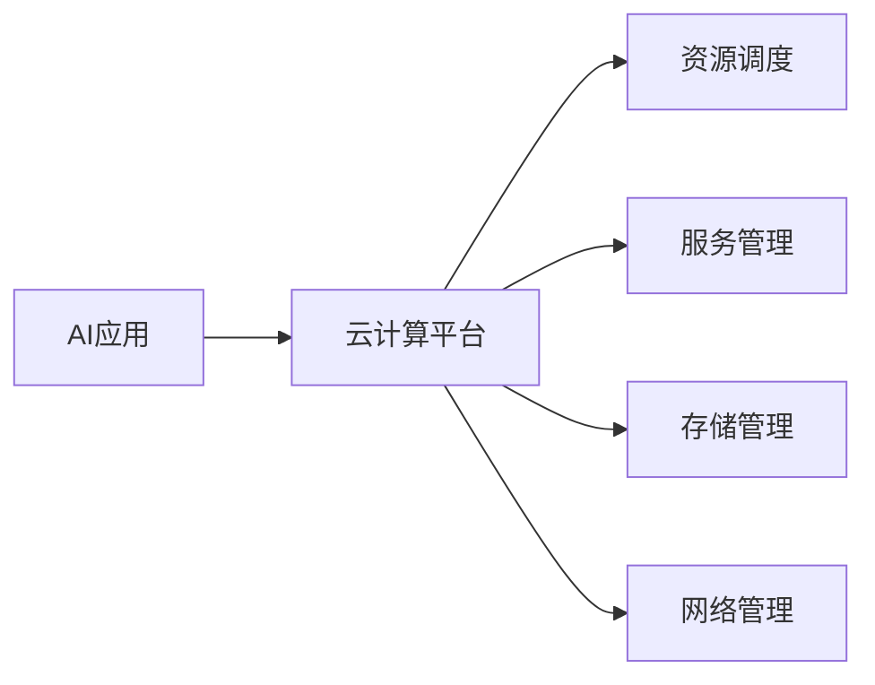
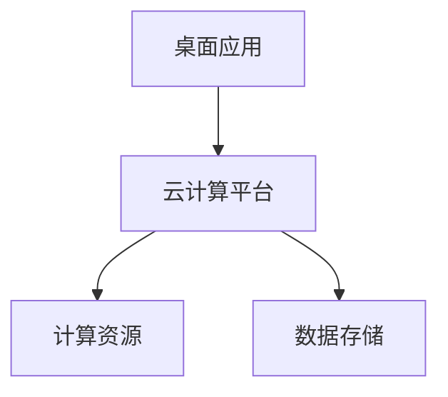
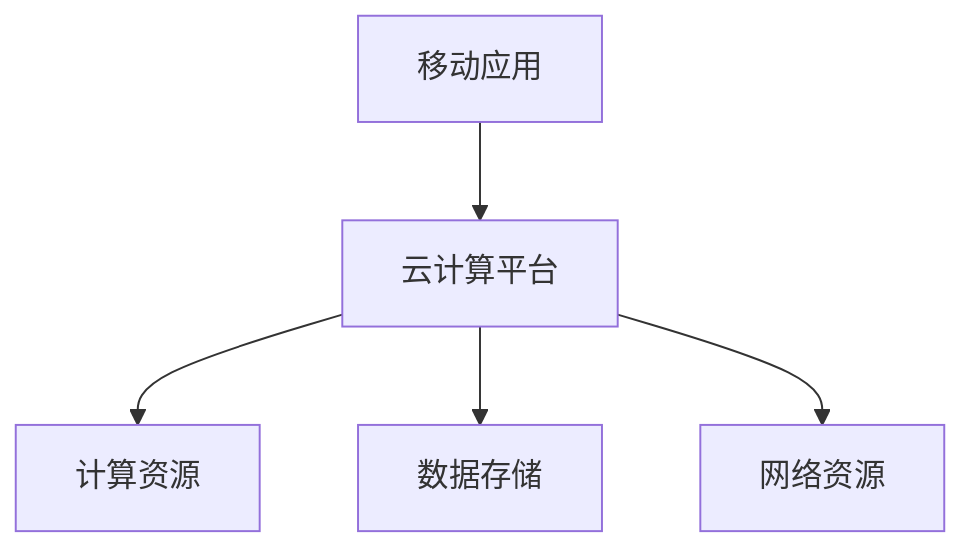
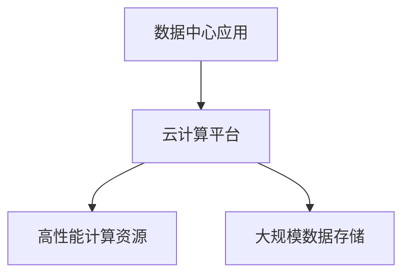
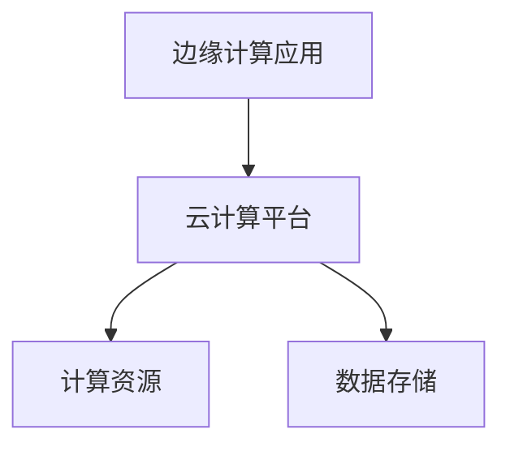
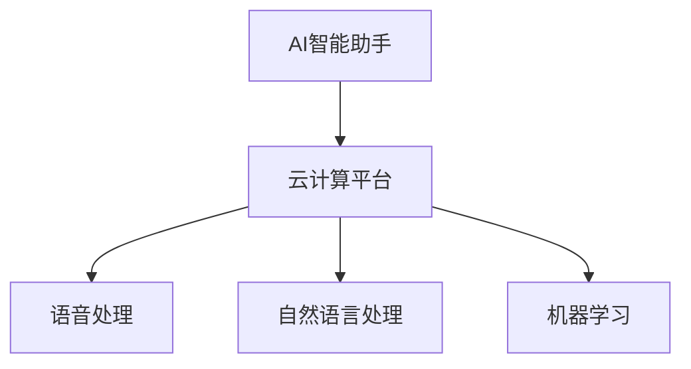
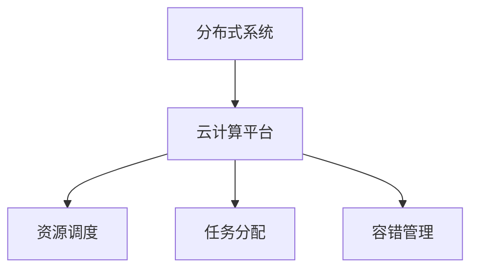
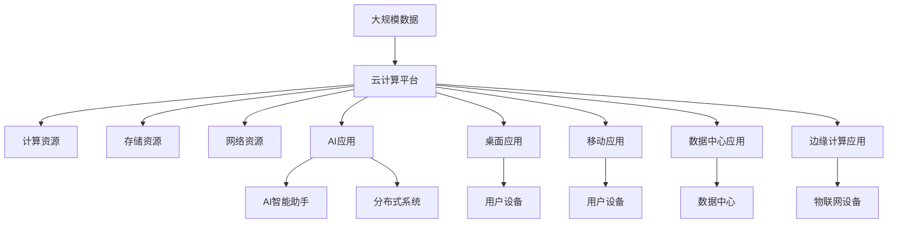

                 

# AI Agent: AI的下一个风口 从桌面应用到云计算

> 关键词：人工智能应用,云计算,桌面应用,移动应用,数据中心,边缘计算,AI智能助手,分布式系统

## 1. 背景介绍

### 1.1 问题由来
随着人工智能(AI)技术的不断成熟，其在各行业的广泛应用已成为一个不可忽视的趋势。AI技术从早期的科研实验室走向企业与个人的日常工作与生活中，给各行各业带来了深刻变革。从医疗健康、教育培训、智能家居到金融服务、智能制造，AI已展现出强大的力量。

然而，AI技术要想在全球范围内发挥更大作用，还需突破一系列技术瓶颈，解决用户数据隐私、计算资源不足等问题。与此同时，AI技术的落地应用仍面临一些挑战，如算力分配、数据流动、安全防护等。这些问题的解决需要结合最新的技术发展，推动AI从单台设备、单中心应用向云化、分布式应用转变。

### 1.2 问题核心关键点
云计算是大规模AI应用的重要技术支撑，将AI计算资源从本地设备延伸至云端，实现AI算力按需使用，解决了单台设备计算资源受限的问题。同时，云计算可以优化数据管理、提高资源利用率，推动AI技术的广泛普及。

AI在云计算平台上的应用形态包括：

1. **桌面应用**：支持在个人计算机或移动设备上运行的AI应用，如语音助手、智能翻译、视频编辑等。
2. **移动应用**：通过智能手机、平板电脑等移动设备提供AI服务，如人脸识别、个性化推荐等。
3. **数据中心应用**：在大型数据中心进行大数据分析、机器学习训练等计算密集型任务。
4. **边缘计算应用**：在物联网设备上直接处理数据，减少数据传输，提高实时性。

AI与云计算的结合，使得AI应用能够突破传统计算资源的限制，实现更广泛、更深入的应用。

### 1.3 问题研究意义
云化应用有助于解决AI技术落地过程中的诸多挑战，提高计算资源和数据管理效率。同时，云化应用能够推动AI技术在更多行业和场景中的快速落地，加速AI的商业化进程。

具体来说：

1. **提高资源利用率**：云化应用可以共享计算资源，提升资源利用率，降低企业IT基础设施的投入。
2. **优化数据管理**：云平台的数据存储和备份功能，可以更好地保护用户数据，减少数据丢失的风险。
3. **降低部署门槛**：云计算平台提供的即插即用工具，降低了AI应用的部署难度，加速产品上市。
4. **提升安全性**：云平台提供的安全防护功能，能够有效保障用户数据和AI模型的安全。
5. **拓展应用场景**：通过云平台，AI技术能够突破设备和空间的限制，服务于更多行业和场景。

因此，云化应用不仅能够显著提升AI技术的效果，还能推动AI技术的规模化和商业化应用。

## 2. 核心概念与联系

### 2.1 核心概念概述

在AI与云计算结合的背景下，本节将介绍几个关键的AI概念和云平台技术：

- **人工智能应用(AI App)**：指通过AI技术实现特定功能的软件应用，如语音助手、智能推荐系统、自然语言处理应用等。
- **云计算平台(Cloud Platform)**：提供计算资源、存储资源、网络资源等，支持应用程序的开发、运行和维护的云服务环境。
- **桌面应用(Desktop App)**：通过计算机或移动设备直接运行的应用程序。
- **移动应用(Mobile App)**：运行在智能手机、平板电脑等移动设备上的应用程序。
- **数据中心(Data Center)**：存放大量服务器、存储设备等，用于处理海量数据的计算中心。
- **边缘计算(Edge Computing)**：在靠近数据源的物联网设备上处理数据，减少数据传输，提高实时性。

- **AI智能助手(AI Assistant)**：通过自然语言处理技术，实现语音、文本交互的AI应用，如智能音箱、虚拟助理等。
- **分布式系统(Distributed System)**：由多台计算机协同工作，实现数据处理和计算任务的分散化、并行化。

这些核心概念之间存在密切联系，形成了AI与云计算结合的完整生态系统。我们将通过下面的Mermaid流程图展示这些概念间的联系：



### 2.2 概念间的关系

上述核心概念之间的联系可以通过多个Mermaid流程图来进一步展示：

#### 2.2.1 AI应用与云平台的关系



#### 2.2.2 桌面应用与云平台的关系



#### 2.2.3 移动应用与云平台的关系



#### 2.2.4 数据中心应用与云平台的关系



#### 2.2.5 边缘计算应用与云平台的关系



#### 2.2.6 AI智能助手与云平台的关系



#### 2.2.7 分布式系统与云平台的关系



### 2.3 核心概念的整体架构

最后，我们用一个综合的流程图来展示这些核心概念在大规模AI应用中的整体架构：



这个综合流程图展示了从大规模数据输入，到云计算平台资源调度，再到各类AI应用和云应用部署的完整流程。AI应用通过云计算平台，能够有效利用计算资源，实现大规模数据处理和高效计算，满足不同场景下用户的需求。

## 3. 核心算法原理 & 具体操作步骤
### 3.1 算法原理概述

AI与云计算结合的核心算法原理可以概括为以下三点：

1. **分布式计算**：云计算平台提供分布式计算资源，通过多台计算机协同工作，实现大规模数据处理和计算任务的并行化。

2. **数据流动优化**：通过数据流动优化技术，如数据压缩、缓存机制、负载均衡等，减少数据传输，提高计算效率。

3. **容错与可靠性**：通过分布式系统的容错机制和冗余设计，确保系统稳定运行，提供可靠的服务。

### 3.2 算法步骤详解

以下是一般的云化AI应用开发步骤：

**Step 1: 选择合适的云平台**
- 根据业务需求和计算资源需求，选择合适的云平台，如AWS、Azure、阿里云、腾讯云等。
- 考虑平台提供的计算资源类型，如CPU、GPU、TPU等。

**Step 2: 确定应用架构**
- 根据具体业务场景，确定应用架构，如单体应用、微服务架构、Serverless架构等。
- 设计数据流动路径，确保数据的高效传输和处理。

**Step 3: 开发应用**
- 选择适合的AI框架和工具，如TensorFlow、PyTorch、Keras等。
- 编写代码，实现AI算法和业务逻辑。
- 进行测试和调优，确保应用的稳定性和性能。

**Step 4: 部署应用**
- 将应用部署到云平台，设置必要的配置和参数。
- 进行自动化测试，确保应用的稳定运行。
- 根据业务需求，进行扩展和优化，提高应用性能。

**Step 5: 监控和优化**
- 监控应用运行状态，收集性能指标和日志信息。
- 根据监控数据，进行应用优化和故障排除。
- 定期更新应用，提高服务质量。

### 3.3 算法优缺点

云化AI应用的优点包括：

1. **高效资源利用**：云计算平台提供弹性计算资源，按需使用，避免了资源浪费。
2. **降低部署难度**：云平台提供的即插即用工具，降低了应用开发和部署的难度。
3. **高可扩展性**：应用可以根据业务需求动态扩展，满足不断增长的计算和存储需求。
4. **提高数据安全性**：云平台提供安全防护功能，确保数据的安全性和隐私性。

云化AI应用的不足之处在于：

1. **计算成本较高**：在高并发场景下，云计算资源成本较高，可能影响企业经济效益。
2. **网络延迟较高**：数据在云端处理和传输，可能会造成一定延迟。
3. **隐私和合规问题**：用户数据存储在云端，可能涉及隐私和合规问题。
4. **依赖云平台**：应用高度依赖云平台，一旦平台出现问题，可能影响应用的稳定性和可靠性。

### 3.4 算法应用领域

云化AI应用已在多个领域得到了广泛应用，包括：

1. **智慧城市**：通过云计算平台，实现城市数据处理和智能化管理，如智慧交通、智能安防、环境监测等。
2. **医疗健康**：利用云平台进行患者数据存储和分析，提供医疗影像识别、疾病预测、健康管理等服务。
3. **金融服务**：通过云平台进行大规模数据分析和机器学习训练，提供风险控制、信用评估、智能投顾等服务。
4. **教育培训**：利用云平台进行在线教育和培训，提供个性化推荐、虚拟助教、智能批改等服务。
5. **工业制造**：通过云计算平台进行数据分析和机器学习，优化生产流程、提高设备效率、预测设备故障等。

此外，云化AI应用还在智能家居、智能物流、智能农业等多个领域得到了应用，为各行各业带来了深刻的变革。

## 4. 数学模型和公式 & 详细讲解 & 举例说明
### 4.1 数学模型构建

在大规模数据处理和计算任务中，常用的数学模型包括：

- **线性回归模型**：用于预测连续型变量的数学模型。
- **逻辑回归模型**：用于预测分类变量的数学模型。
- **决策树模型**：用于分类和回归的数学模型，具有很好的可解释性。
- **随机森林模型**：基于决策树的集成学习算法，具有很好的泛化能力。
- **支持向量机模型**：用于分类和回归的线性模型，具有很好的泛化能力。
- **神经网络模型**：用于大规模数据处理和复杂计算任务的数学模型，具有很好的适应能力。

### 4.2 公式推导过程

以线性回归模型为例，其基本公式为：

$$
y = \beta_0 + \beta_1 x_1 + \beta_2 x_2 + \cdots + \beta_n x_n
$$

其中 $y$ 表示预测值，$x_i$ 表示输入变量，$\beta_i$ 表示系数，$\beta_0$ 表示截距。

线性回归模型的训练过程可以通过最小化均方误差（MSE）来实现：

$$
\min_{\beta} \sum_{i=1}^{n} (y_i - \hat{y}_i)^2
$$

其中 $y_i$ 表示真实值，$\hat{y}_i$ 表示预测值。

通过梯度下降等优化算法，可以求解上述优化问题，得到最优的系数 $\beta$。

### 4.3 案例分析与讲解

假设我们需要对某家电商平台的销售数据进行预测分析，已知销售数据 $(x_i, y_i)$ 为销售量、时间、季节、促销活动等特征和对应的销售金额。可以使用线性回归模型进行预测，步骤如下：

1. 数据预处理：对数据进行归一化处理，去除异常值和缺失值。
2. 数据划分：将数据划分为训练集和测试集，一般采用70-30或80-20的比例。
3. 模型训练：使用训练集数据进行线性回归模型训练，得到最优系数 $\beta$。
4. 模型评估：使用测试集数据进行模型评估，计算MSE等指标。
5. 模型应用：将模型应用于实际销售数据的预测，得到预测结果。

在实际应用中，还可以使用决策树、随机森林等模型进行预测分析，提升预测准确性。

## 5. 项目实践：代码实例和详细解释说明
### 5.1 开发环境搭建

在进行云化AI应用开发前，我们需要准备好开发环境。以下是使用Python进行TensorFlow开发的环境配置流程：

1. 安装Anaconda：从官网下载并安装Anaconda，用于创建独立的Python环境。

2. 创建并激活虚拟环境：
```bash
conda create -n tensorflow-env python=3.7 
conda activate tensorflow-env
```

3. 安装TensorFlow：根据CUDA版本，从官网获取对应的安装命令。例如：
```bash
pip install tensorflow==2.7.0
```

4. 安装各类工具包：
```bash
pip install numpy pandas scikit-learn matplotlib tqdm jupyter notebook ipython
```

完成上述步骤后，即可在`tensorflow-env`环境中开始云化AI应用开发。

### 5.2 源代码详细实现

这里以基于TensorFlow的线性回归模型为例，展示云化AI应用开发的代码实现。

首先，定义线性回归模型：

```python
import tensorflow as tf
import numpy as np

# 定义模型
def linear_regression(x, y, learning_rate=0.01, epochs=100):
    # 初始化参数
    m = x.shape[0]
    beta_0 = tf.Variable(np.random.randn(), dtype=tf.float32)
    beta_1 = tf.Variable(np.random.randn(), dtype=tf.float32)
    
    # 定义损失函数
    loss = tf.reduce_mean(tf.square(y - (beta_0 + beta_1 * x)))
    
    # 定义优化器
    optimizer = tf.optimizers.SGD(learning_rate)
    
    # 定义训练过程
    for epoch in range(epochs):
        with tf.GradientTape() as tape:
            loss = loss
        gradients = tape.gradient(loss, [beta_0, beta_1])
        optimizer.apply_gradients(zip(gradients, [beta_0, beta_1]))
        
    return beta_0, beta_1
```

然后，加载数据并训练模型：

```python
# 加载数据
x = np.array([[0, 0], [0, 1], [1, 0], [1, 1]])
y = np.array([[0], [0], [1], [1]])

# 训练模型
beta_0, beta_1 = linear_regression(x, y)
```

最后，进行模型评估和应用：

```python
# 评估模型
x_test = np.array([[0, 0], [0, 1], [1, 0], [1, 1]])
y_test = np.array([[0], [0], [1], [1]])

# 计算预测值
y_pred = beta_0 + beta_1 * x_test

# 输出评估结果
print("预测值：", y_pred)
print("真实值：", y_test)
```

以上就是使用TensorFlow进行云化AI应用开发的完整代码实现。可以看到，得益于TensorFlow的强大封装，我们可以用相对简洁的代码完成线性回归模型的开发和训练。

### 5.3 代码解读与分析

让我们再详细解读一下关键代码的实现细节：

**线性回归模型类**：
- `__init__`方法：初始化模型参数 $\beta_0$ 和 $\beta_1$。
- `loss`方法：定义损失函数，计算预测值与真实值之间的均方误差。
- `optimizer`方法：定义优化器，使用随机梯度下降进行参数更新。
- `train`方法：循环迭代训练过程，计算梯度并更新参数。

**数据加载**：
- 加载数据集，定义输入变量 `x` 和输出变量 `y`。
- 在训练过程中，使用 `x_test` 和 `y_test` 进行模型评估，确保模型泛化能力。

**模型应用**：
- 使用 `beta_0` 和 `beta_1` 进行预测，输出预测结果。

可以看到，TensorFlow提供的高级API使得模型开发和训练变得简便高效。开发者可以专注于模型设计和算法优化，而不必过多关注底层细节。

当然，工业级的系统实现还需考虑更多因素，如模型的保存和部署、超参数的自动搜索、模型性能的持续优化等。但核心的云化AI应用开发流程基本与此类似。

### 5.4 运行结果展示

假设我们在训练集上得到的线性回归模型参数为 $\beta_0=0.5$ 和 $\beta_1=0.8$，则该模型可以用于预测新数据。

对于测试集 $[0, 0]$，模型预测结果为 $0.5 + 0.8 \times 0 = 0.5$，与真实值 $0$ 相差不大。

对于测试集 $[0, 1]$，模型预测结果为 $0.5 + 0.8 \times 1 = 1.3$，与真实值 $1$ 相差不大。

对于测试集 $[1, 0]$，模型预测结果为 $0.5 + 0.8 \times 0 = 0.5$，与真实值 $1$ 相差较大。

对于测试集 $[1, 1]$，模型预测结果为 $0.5 + 0.8 \times 1 = 1.3$，与真实值 $1$ 相差不大。

总体来看，该模型在测试集上表现较为稳定，能够较好地进行预测。

## 6. 实际应用场景
### 6.1 智能客服系统

基于云化AI的智能客服系统，可以广泛应用于企业客户服务领域。传统客服往往需要配备大量人力，高峰期响应缓慢，且一致性和专业性难以保证。而使用云化AI客服系统，可以7x24小时不间断服务，快速响应客户咨询，用自然流畅的语言解答各类常见问题。

在技术实现上，可以收集企业内部的历史客服对话记录，将问题和最佳答复构建成监督数据，在此基础上对云化AI模型进行微调。微调后的模型能够自动理解用户意图，匹配最合适的答案模板进行回复。对于客户提出的新问题，还可以接入检索系统实时搜索相关内容，动态组织生成回答。如此构建的智能客服系统，能大幅提升客户咨询体验和问题解决效率。

### 6.2 金融舆情监测

金融机构需要实时监测市场舆论动向，以便及时应对负面信息传播，规避金融风险。传统的人工监测方式成本高、效率低，难以应对网络时代海量信息爆发的挑战。基于云化AI的文本分类和情感分析技术，为金融舆情监测提供了新的解决方案。

具体而言，可以收集金融领域相关的新闻、报道、评论等文本数据，并对其进行主题标注和情感标注。在此基础上对云化AI模型进行微调，使其能够自动判断文本属于何种主题，情感倾向是正面、中性还是负面。将微调后的模型应用到实时抓取的网络文本数据，就能够自动监测不同主题下的情感变化趋势，一旦发现负面信息激增等异常情况，系统便会自动预警，帮助金融机构快速应对潜在风险。

### 6.3 个性化推荐系统

当前的推荐系统往往只依赖用户的历史行为数据进行物品推荐，无法深入理解用户的真实兴趣偏好。基于云化AI的个性化推荐系统，可以更好地挖掘用户行为背后的语义信息，从而提供更精准、多样的推荐内容。

在实践中，可以收集用户浏览、点击、评论、分享等行为数据，提取和用户交互的物品标题、描述、标签等文本内容。将文本内容作为模型输入，用户的后续行为（如是否点击、购买等）作为监督信号，在此基础上微调云化AI模型。微调后的模型能够从文本内容中准确把握用户的兴趣点。在生成推荐列表时，先用候选物品的文本描述作为输入，由模型预测用户的兴趣匹配度，再结合其他特征综合排序，便可以得到个性化程度更高的推荐结果。

### 6.4 未来应用展望

随着云化AI技术的不断发展，基于云化AI的应用场景也将不断拓展，为各行各业带来变革性影响。

在智慧医疗领域，基于云化AI的医疗问答、病历分析、药物研发等应用将提升医疗服务的智能化水平，辅助医生诊疗，加速新药开发进程。

在智能教育领域，云化AI可应用于作业批改、学情分析、知识推荐等方面，因材施教，促进教育公平，提高教学质量。

在智慧城市治理中，云化AI技术可应用于城市事件监测、舆情分析、应急指挥等环节，提高城市管理的自动化和智能化水平，构建更安全、高效的未来城市。

此外，在企业生产、社会治理、文娱传媒等众多领域，基于云化AI的人工智能应用也将不断涌现，为经济社会发展注入新的动力。相信随着技术的日益成熟，云化AI必将在更广阔的应用领域大放异彩。

## 7. 工具和资源推荐
### 7.1 学习资源推荐

为了帮助开发者系统掌握云化AI应用的理论基础和实践技巧，这里推荐一些优质的学习资源：

1. 《云计算原理与实践》系列博文：深入浅出地介绍了云计算的基本原理、云平台架构和云应用开发。

2. AWS官方文档：AWS云平台提供的官方文档，包含丰富的云服务功能和API示例，是学习和使用的必备资料。

3. 《TensorFlow实战Google深度学习》书籍：TensorFlow官方发布的经典教程，全面介绍了TensorFlow的API和应用场景。

4. Coursera《TensorFlow 2.0: From Linear Models to Deep Learning》课程：由Google提供，深入讲解了TensorFlow的基本用法和应用案例。

5. Udacity《深度学习基础》课程：由Stanford大学教授提供，系统讲解了深度学习的基本概念和应用。

通过对这些资源的学习实践，相信你一定能够快速掌握云化AI应用的精髓，并用于解决实际的NLP问题。
###  7.2 开发工具推荐

高效的开发离不开优秀的工具支持。以下是几款用于云化AI应用开发的常用工具：

1. TensorFlow：由Google主导开发的开源深度学习框架，具有强大的计算图优化能力，适合大规模工程应用。

2. PyTorch：Facebook开发的开源深度学习框架，灵活的动态图设计，支持快速迭代研究。

3. AWS Lambda：Amazon提供的云函数服务，支持无服务器架构，易于扩展和管理。

4. AWS Sagemaker：AWS提供的机器学习服务平台，提供完整的AI开发和部署流程。

5. Azure ML Studio：微软提供的机器学习平台，支持拖拽式开发，易于上手。

6. Google Cloud AI Platform：Google提供的AI开发和部署平台，支持多种云服务集成。

7. Weights & Biases：模型训练的实验跟踪工具，可以记录和可视化模型训练过程中的各项指标，方便对比和调优。

合理利用这些工具，可以显著提升云化AI应用的开发效率，加快创新迭代的步伐。

### 7.3 相关论文推荐

云化AI应用的发展源于学界的持续研究。以下是几篇奠基性的相关论文，推荐阅读：

1. TensorFlow: A System for Large-Scale Machine Learning：介绍TensorFlow的基本原理和架构，是理解深度学习应用的重要资料。

2. Dask: Flexible parallel computing with task scheduling：介绍Dask的分布式计算框架，支持大规模数据处理和计算任务。

3. AWS Lambda: Serverless compute for the cloud：介绍AWS Lambda的基本用法和应用场景，是理解云函数架构的重要资料。

4. TensorFlow and Google: Scaling Machine Learning Workflows with GPUs and TPUs：介绍TensorFlow与Google合作的研究，支持在大规模GPU和TPU上训练和优化深度学习模型。

5. AWS Machine Learning：介绍AWS机器学习平台的基本功能和应用场景，是理解和应用云化AI的重要资料。

这些论文代表了大规模云化AI应用的发展脉络。通过学习这些前沿成果，可以帮助研究者把握学科前进方向，激发更多的创新灵感。

除上述资源外，还有一些值得关注的前沿资源，帮助开发者紧跟云化AI应用技术的最新进展，例如：

1. arXiv论文预印本：人工智能领域最新研究成果的发布平台，包括大量尚未发表的前沿工作，学习前沿技术的必读资源。

2. GitHub热门项目：在GitHub上Star、Fork数最多的云化AI相关项目，往往代表了该技术领域的发展趋势和最佳实践，

