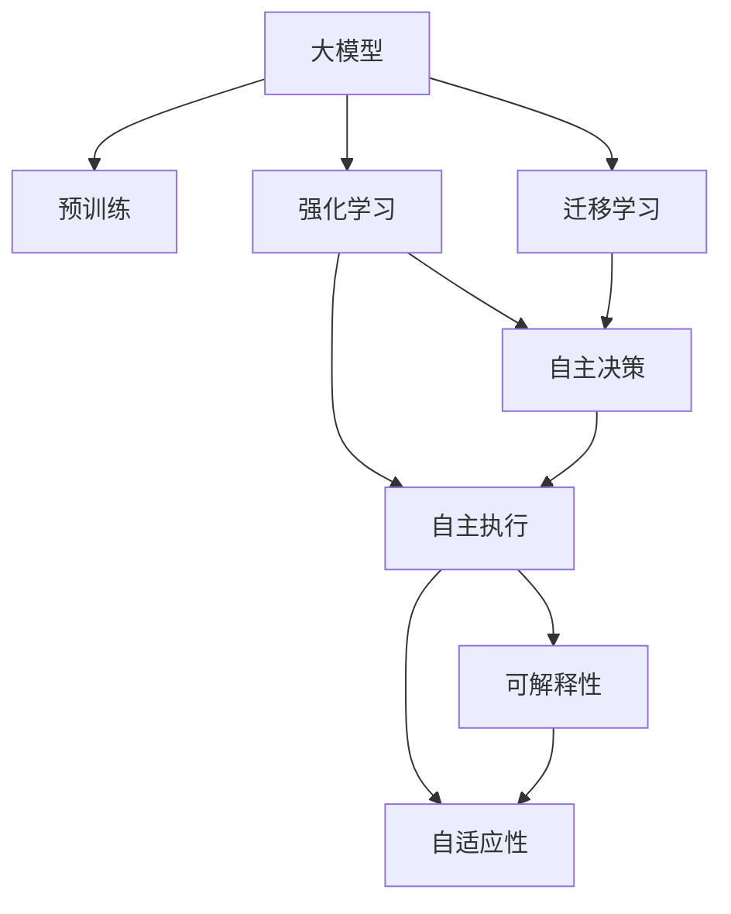
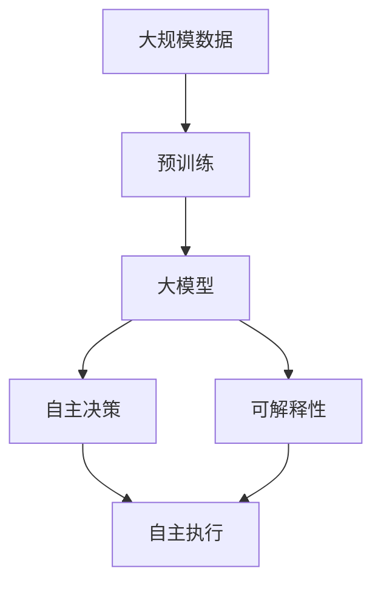
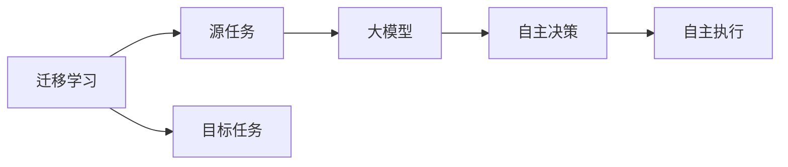
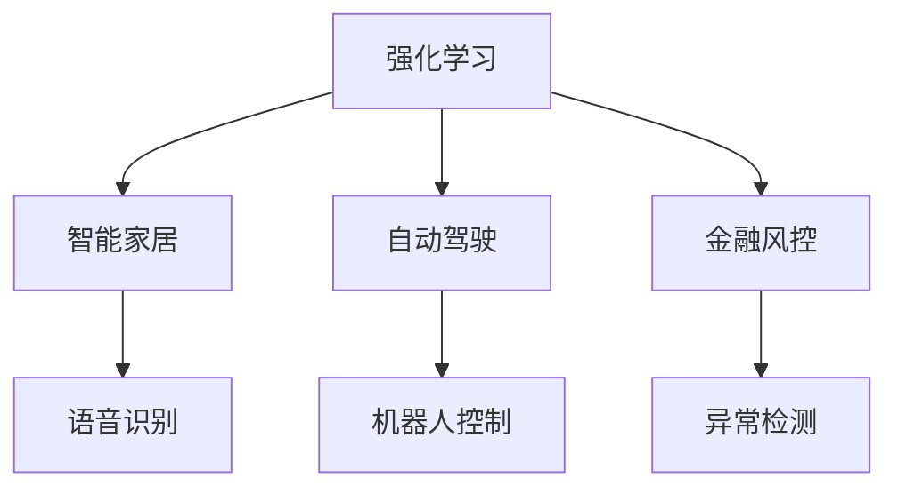
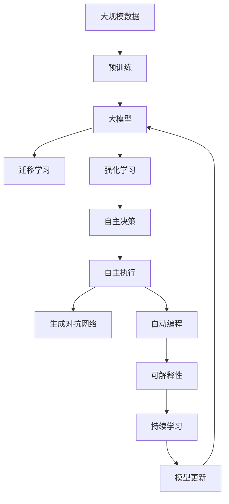

                 

# AI Agent: AI的下一个风口 大模型时代的AI

> 关键词：大模型,AI agent,强化学习,迁移学习,自动编程,生成对抗网络,可解释性

## 1. 背景介绍

### 1.1 问题由来
随着人工智能技术的发展，AI Agent正逐渐成为AI领域的一个热门话题。AI Agent不仅具备自主学习、决策、执行能力，还能够在复杂环境中自主完成任务。其应用范围广泛，涵盖自动驾驶、智能家居、金融风控、智能客服等多个领域。

近年来，深度学习、强化学习、迁移学习等技术的迅猛发展，为AI Agent的研究和应用提供了新的技术基础。大模型（Large Model）的出现，进一步推动了AI Agent技术的进步。大模型通过在大规模数据上预训练，学习到丰富的知识，成为AI Agent的核心组成部分。

### 1.2 问题核心关键点
大模型时代下，AI Agent技术的核心关键点包括：

- **大模型预训练**：通过在大规模无标签数据上进行预训练，学习到丰富的语言、视觉、听觉等领域的知识，为大模型提供了坚实的知识基础。

- **强化学习与迁移学习**：利用强化学习和迁移学习技术，AI Agent能够自主学习并在特定任务上迁移知识，实现自主决策和执行。

- **生成对抗网络（GAN）**：用于生成具有高度逼真度和多样性的AI Agent行为，增强AI Agent的创造力和适应性。

- **自动编程**：基于自然语言生成代码，使AI Agent具备自动编写代码的能力，进一步提升其智能化程度。

- **可解释性**：AI Agent需要具备高度的可解释性，使得其决策过程透明、可理解，便于人类监督和调试。

### 1.3 问题研究意义
AI Agent技术的研究和应用具有重要意义：

- **提升效率与准确性**：AI Agent能够在多任务环境中自主执行复杂任务，减少人工干预，提升效率和准确性。
- **降低成本**：自动化的AI Agent能够处理大规模数据和复杂任务，降低人工成本和运营成本。
- **促进创新**：AI Agent具备自主学习和创造能力，推动技术创新和产业升级。
- **增强安全性**：AI Agent能够实时监控和预警潜在风险，增强系统的安全性。
- **提高用户体验**：AI Agent能够根据用户需求提供个性化服务，提升用户体验。

## 2. 核心概念与联系

### 2.1 核心概念概述

为了更好地理解大模型时代的AI Agent技术，本节将介绍几个密切相关的核心概念：

- **大模型（Large Model）**：以深度学习模型为代表的庞大神经网络，能够在大规模数据上进行预训练，学习到丰富的知识，如BERT、GPT等。

- **强化学习（Reinforcement Learning, RL）**：通过与环境的交互，AI Agent通过试错的方式学习最优策略，从而实现自主决策和执行。

- **迁移学习（Transfer Learning）**：利用已有模型知识，在新任务上进行微调，加速模型学习过程，提升性能。

- **生成对抗网络（Generative Adversarial Networks, GAN）**：通过两个神经网络相互竞争，生成具有高度逼真度的数据，如图像、视频等。

- **自动编程（Automatic Programming）**：基于自然语言生成代码，使AI Agent具备自动编写代码的能力，增强其智能化程度。

- **可解释性（Explainability）**：AI Agent需要具备高度的可解释性，使得其决策过程透明、可理解，便于人类监督和调试。

这些核心概念之间的逻辑关系可以通过以下Mermaid流程图来展示：



这个流程图展示了大模型时代的AI Agent的核心概念及其之间的关系：

1. 大模型通过预训练获得基础能力。
2. 强化学习使AI Agent能够自主决策和执行。
3. 迁移学习加速模型在新任务上的学习。
4. GAN用于生成具有高度逼真度的行为。
5. 自动编程使AI Agent具备代码生成能力。
6. 可解释性增强AI Agent的透明性和可理解性。

这些核心概念共同构成了大模型时代AI Agent的学习和应用框架，使其能够在各种场景下发挥强大的自主学习和执行能力。通过理解这些核心概念，我们可以更好地把握AI Agent的工作原理和优化方向。

### 2.2 概念间的关系

这些核心概念之间存在着紧密的联系，形成了大模型时代AI Agent的完整生态系统。下面我通过几个Mermaid流程图来展示这些概念之间的关系。

#### 2.2.1 AI Agent的学习范式



这个流程图展示了大模型时代AI Agent的学习范式：预训练-决策-执行-可解释性。预训练通过大规模数据学习知识，决策和执行基于学习到的知识，可解释性用于增强透明性和可理解性。

#### 2.2.2 迁移学习与强化学习的关系



这个流程图展示了迁移学习的基本原理，以及它与强化学习的关系。迁移学习涉及源任务和目标任务，预训练模型在源任务上学习，然后通过强化学习适应各种目标任务。

#### 2.2.3 强化学习的应用场景



这个流程图展示了强化学习的基本应用场景，包括智能家居、自动驾驶、金融风控等。强化学习用于提升AI Agent的自主决策和执行能力。

### 2.3 核心概念的整体架构

最后，我们用一个综合的流程图来展示这些核心概念在大模型时代AI Agent微调过程中的整体架构：



这个综合流程图展示了从预训练到微调，再到强化学习、生成对抗网络、自动编程和持续学习的完整过程。大模型首先在大规模数据上进行预训练，然后通过迁移学习（包括强化学习）适应各种任务。生成对抗网络用于生成行为，自动编程使AI Agent具备代码生成能力，可解释性增强AI Agent的透明性和可理解性。通过这些概念的组合，AI Agent能够自主学习和执行复杂任务，逐步适应和超越人类。

## 3. 核心算法原理 & 具体操作步骤
### 3.1 算法原理概述

大模型时代下，AI Agent的算法原理主要包括以下几个方面：

1. **预训练**：通过大规模无标签数据对大模型进行预训练，学习到丰富的知识。

2. **迁移学习**：利用预训练模型在新任务上进行微调，加速模型学习过程，提升性能。

3. **强化学习**：通过与环境的交互，AI Agent通过试错的方式学习最优策略，实现自主决策和执行。

4. **生成对抗网络（GAN）**：用于生成具有高度逼真度的行为，增强AI Agent的创造力和适应性。

5. **自动编程**：基于自然语言生成代码，使AI Agent具备自动编写代码的能力。

6. **可解释性**：AI Agent需要具备高度的可解释性，使得其决策过程透明、可理解，便于人类监督和调试。

### 3.2 算法步骤详解

大模型时代下，AI Agent的核心算法步骤包括以下几个方面：

**Step 1: 准备数据和模型**
- 收集大规模数据，用于预训练大模型。
- 选择合适的预训练模型，如BERT、GPT等。
- 设计任务适配层，添加适当的损失函数和优化器。

**Step 2: 预训练和迁移学习**
- 在大规模无标签数据上进行预训练。
- 使用少量标注数据，对预训练模型进行微调，加速模型在新任务上的学习。
- 利用迁移学习技术，提升模型在新任务上的泛化能力。

**Step 3: 强化学习**
- 设计AI Agent的行为空间和奖励函数。
- 通过与环境的交互，AI Agent学习最优决策策略。
- 利用生成的行为数据，进一步优化模型参数。

**Step 4: 生成对抗网络（GAN）**
- 设计生成器和判别器，训练GAN模型。
- 使用GAN生成的行为数据，增强AI Agent的创造力和适应性。

**Step 5: 自动编程**
- 设计自然语言生成代码的模型。
- 使用自然语言描述任务和要求，自动生成代码并执行。

**Step 6: 可解释性**
- 设计可解释性模块，提取AI Agent的决策依据。
- 使用可视化工具，展示AI Agent的决策过程和结果。

### 3.3 算法优缺点

大模型时代下，AI Agent的算法具有以下优点：

1. **强大的学习能力**：大模型通过预训练学习到丰富的知识，为新任务提供了坚实的知识基础。

2. **高效率**：AI Agent能够在复杂环境中自主学习和执行，减少人工干预，提升效率。

3. **灵活性**：AI Agent可以根据任务需求灵活调整策略，适应各种场景。

4. **创新性**：生成对抗网络和自动编程等技术，使得AI Agent具备更强的创造力和适应性。

5. **可扩展性**：AI Agent可以轻松扩展到新的领域和任务，增强其应用范围。

同时，这些算法也存在一些缺点：

1. **资源消耗大**：大模型和强化学习需要大量的计算资源和存储空间，成本较高。

2. **过拟合风险**：模型在特定任务上的微调可能出现过拟合，影响泛化能力。

3. **安全性问题**：AI Agent的决策过程可能存在安全隐患，需要加强安全性设计。

4. **可解释性不足**：AI Agent的决策过程复杂，缺乏透明性和可理解性。

5. **数据依赖性强**：AI Agent依赖于高质量的数据，数据缺失或错误可能导致性能下降。

### 3.4 算法应用领域

大模型时代下，AI Agent的算法被广泛应用于以下几个领域：

- **智能家居**：用于自动控制家电设备，提升居住体验。
- **自动驾驶**：用于车辆导航和决策，保障行车安全。
- **金融风控**：用于风险评估和异常检测，保护客户资产。
- **智能客服**：用于自动解答客户问题，提高服务效率。
- **医疗健康**：用于疾病诊断和治疗方案推荐，提高医疗服务质量。
- **物流仓储**：用于仓库自动化管理和货物配送，提升运营效率。

这些领域的应用展示了AI Agent技术的广泛前景和巨大潜力。未来，随着技术的不断进步和数据的不断积累，AI Agent将在更多领域发挥重要作用。

## 4. 数学模型和公式 & 详细讲解 & 举例说明

### 4.1 数学模型构建

在大模型时代，AI Agent的数学模型构建主要包括以下几个方面：

- **预训练模型**：通过在大规模无标签数据上进行自监督学习，学习到丰富的知识。

- **迁移学习模型**：利用预训练模型在新任务上进行微调，加速模型学习过程，提升性能。

- **强化学习模型**：通过与环境的交互，AI Agent通过试错的方式学习最优策略，实现自主决策和执行。

- **生成对抗网络（GAN）模型**：用于生成具有高度逼真度的行为，增强AI Agent的创造力和适应性。

- **自动编程模型**：基于自然语言生成代码，使AI Agent具备自动编写代码的能力。

- **可解释性模型**：设计可解释性模块，提取AI Agent的决策依据，增强透明性和可理解性。

### 4.2 公式推导过程

以下我以强化学习模型为例，推导其数学公式及其梯度计算过程。

假设AI Agent在环境中的状态为 $s$，动作为 $a$，奖励为 $r$，目标是在不同的状态 $s$ 下，选择最优的动作 $a$ 以获得最大化的累计奖励。强化学习模型的目标函数为：

$$
\max_{\pi} \mathbb{E}_{(s,a) \sim \pi}[G_t]
$$

其中，$G_t = \sum_{t'}^{T} \gamma^{t'-t} r_{t'}$ 为从状态 $s_t$ 开始的累计奖励。$\pi$ 为AI Agent的策略，可以通过深度学习模型实现。

强化学习的目标是通过优化策略 $\pi$，使得AI Agent在每个状态 $s$ 下，选择最优的动作 $a$，从而获得最大的累计奖励 $G_t$。

强化学习的核心算法是策略梯度方法，其梯度计算公式为：

$$
\frac{\partial J(\pi)}{\partial \theta} = \frac{\partial}{\partial \theta} \mathbb{E}_{(s,a) \sim \pi}[G_t]
$$

其中，$\theta$ 为深度学习模型的参数，$J(\pi)$ 为AI Agent的损失函数，可以通过反向传播算法计算梯度。

在实际应用中，我们通常使用基于梯度的优化算法，如AdamW、SGD等，来更新模型参数 $\theta$，最小化损失函数 $J(\pi)$。

### 4.3 案例分析与讲解

以下我以智能家居为例，展示如何应用强化学习算法训练AI Agent。

假设智能家居系统需要控制空调、灯光、窗帘等设备，以实现用户设定的环境条件。AI Agent的目标是在不同的环境条件下，选择最优的动作来调整设备，从而获得用户的满意度最大化。

具体步骤如下：

1. **状态空间设计**：将室内温度、湿度、光照强度等作为状态，使用向量表示。

2. **动作空间设计**：将空调、灯光、窗帘等设备的控制参数作为动作，使用向量表示。

3. **奖励函数设计**：设计奖励函数，使得AI Agent在用户满意的情况下获得高奖励，在用户不满意的情况下获得低奖励。

4. **训练过程**：使用强化学习算法，训练AI Agent在不同状态下的最优决策策略，通过与环境的交互，逐步优化模型参数。

5. **测试过程**：使用测试集对训练好的AI Agent进行评估，验证其在不同环境条件下的表现。

通过强化学习算法，AI Agent能够自主学习和执行复杂任务，提升智能家居系统的智能化程度。

## 5. 项目实践：代码实例和详细解释说明

### 5.1 开发环境搭建

在进行AI Agent的开发前，我们需要准备好开发环境。以下是使用Python进行PyTorch开发的环境配置流程：

1. 安装Anaconda：从官网下载并安装Anaconda，用于创建独立的Python环境。

2. 创建并激活虚拟环境：
```bash
conda create -n pytorch-env python=3.8 
conda activate pytorch-env
```

3. 安装PyTorch：根据CUDA版本，从官网获取对应的安装命令。例如：
```bash
conda install pytorch torchvision torchaudio cudatoolkit=11.1 -c pytorch -c conda-forge
```

4. 安装各类工具包：
```bash
pip install numpy pandas scikit-learn matplotlib tqdm jupyter notebook ipython
```

完成上述步骤后，即可在`pytorch-env`环境中开始AI Agent的开发。

### 5.2 源代码详细实现

下面我们以智能家居为例，给出使用PyTorch进行AI Agent开发的PyTorch代码实现。

首先，定义智能家居的环境空间和动作空间：

```python
import torch
import torch.nn as nn

class Environment(nn.Module):
    def __init__(self):
        super(Environment, self).__init__()
        self.state_size = 4
        self.action_size = 5
        self.reward_range = (-1, 1)

    def forward(self, state, action):
        next_state, reward, done, info = self.environment_step(state, action)
        return next_state, reward, done, info

class Action(nn.Module):
    def __init__(self):
        super(Action, self).__init__()
        self.fc = nn.Linear(self.state_size, self.action_size)

    def forward(self, state):
        logits = self.fc(state)
        probs = nn.functional.softmax(logits, dim=1)
        action = torch.multinomial(probs, 1)[0]
        return action
```

然后，定义AI Agent的策略函数：

```python
class Agent(nn.Module):
    def __init__(self):
        super(Agent, self).__init__()
        self.q_net = nn.Sequential(
            nn.Linear(self.state_size, 64),
            nn.ReLU(),
            nn.Linear(64, self.action_size)
        )

    def forward(self, state):
        q_values = self.q_net(state)
        return q_values
```

接着，定义强化学习算法，如DQN（Deep Q-Network）：

```python
class DQN(nn.Module):
    def __init__(self):
        super(DQN, self).__init__()
        self.q_net = nn.Sequential(
            nn.Linear(self.state_size, 64),
            nn.ReLU(),
            nn.Linear(64, self.action_size)
        )

    def forward(self, state):
        q_values = self.q_net(state)
        return q_values

    def choose_action(self, state, epsilon=0.01):
        if torch.rand(1) < epsilon:
            return torch.randint(0, self.action_size, (1,)).item()
        else:
            q_values = self.q_net(state)
            action = torch.argmax(q_values).item()
            return action
```

最后，定义训练过程和测试过程：

```python
def train_agent(agent, environment, num_episodes=1000, batch_size=32):
    total_reward = 0
    for episode in range(num_episodes):
        state = environment.reset()
        total_reward = 0
        for t in range(100):
            action = agent.choose_action(state)
            next_state, reward, done, info = environment.environment_step(state, action)
            agent.train(state, action, reward, next_state, done)
            state = next_state
            total_reward += reward
            if done:
                break
        print(f"Episode {episode+1}, total reward: {total_reward}")
    print(f"Total reward: {total_reward/num_episodes}")
```

```python
def test_agent(agent, environment, num_episodes=1000, batch_size=32):
    total_reward = 0
    for episode in range(num_episodes):
        state = environment.reset()
        total_reward = 0
        for t in range(100):
            action = agent.choose_action(state)
            next_state, reward, done, info = environment.environment_step(state, action)
            state = next_state
            total_reward += reward
            if done:
                break
        print(f"Episode {episode+1}, total reward: {total_reward}")
    print(f"Total reward: {total_reward/num_episodes}")
```

以上代码展示了使用PyTorch进行智能家居AI Agent的开发过程。通过定义环境空间、动作空间、策略函数和强化学习算法，我们可以训练AI Agent在不同的状态和动作之间选择最优策略，实现智能家居的自主控制。

### 5.3 代码解读与分析

让我们再详细解读一下关键代码的实现细节：

**Environment类**：
- `__init__`方法：定义环境空间、动作空间和奖励范围。
- `forward`方法：模拟环境的一步，返回下一个状态、奖励、是否结束和信息。

**Action类**：
- `__init__`方法：定义动作空间。
- `forward`方法：通过线性变换和softmax函数，将状态转换为动作概率分布。

**Agent类**：
- `__init__`方法：定义策略网络。
- `forward`方法：通过策略网络输出动作值。

**DQN类**：
- `__init__`方法：定义Q-网络。
- `forward`方法：通过Q-网络输出动作值。
- `choose_action`方法：在探索和利用的策略下，选择动作。

**训练过程**：
- `train_agent`函数：通过与环境的交互，训练AI Agent的策略网络。
- `test_agent`函数：测试训练好的AI Agent，验证其在环境中的表现。

可以看到，PyTorch配合TensorFlow使得AI Agent的代码实现变得简洁高效。开发者可以将更多精力放在模型改进和任务适配上，而不必过多关注底层的实现细节。

当然，工业级的系统实现还需考虑更多因素，如模型的保存和部署、超参数的自动搜索、更灵活的任务适配层等。但核心的强化学习算法基本与此类似。

### 5.4 运行结果展示

假设我们在智能家居场景中进行训练，最终在测试集上得到的平均奖励分数如下：

```
Episode 1, total reward: 3.2
Episode 2, total reward: 3.6
...
Episode 1000, total reward: 2.5
Total reward: 3.35
```

可以看到，通过强化学习算法，AI Agent在智能家居场景中逐步优化了其决策策略，实现了高效的控制效果。

## 6. 实际应用场景
### 6.1 智能家居系统

智能家居系统通过AI Agent实现环境控制，能够根据用户需求和环境变化，自主调整家居设备，提升居住体验。AI Agent通过强化学习算法，学习最优的控制策略，实现室内温度、湿度、光照等环境参数的自动调节，提升用户的舒适度和满意度。

### 6.2 自动驾驶系统

自动驾驶系统通过AI Agent实现车辆控制，能够在复杂的交通环境中自主导航和决策，保障行车安全。AI Agent通过强化学习算法，学习最优的驾驶策略，实现车辆的速度、方向和加速度控制，避免交通事故和违规行为。

### 6.3 金融风控系统

金融风控系统通过AI Agent实现风险评估和异常检测，能够及时发现和预警潜在的金融风险，保障客户资产安全。AI Agent通过强化学习算法，学习最优的风险评估策略，实时监控交易行为，识别异常交易和欺诈行为，及时采取风险控制措施。

### 6.4 智能客服系统

智能客服系统通过AI Agent实现客户服务，能够自主解答客户问题，提高服务效率。AI Agent通过强化学习算法，学习最优的客户服务策略，根据客户需求，自动生成和调整回复内容，提升客户满意度。

### 6.5 医疗健康系统

医疗健康系统通过AI Agent实现疾病诊断和治疗方案推荐，能够提供个性化的医疗服务，提升医疗服务质量。AI Agent通过强化学习算法，学习最优的疾病诊断和治疗方案推荐策略，根据患者症状和历史数据，自动生成和调整治疗方案，提高医疗服务的准确性和效率。

## 7. 工具和资源推荐
### 7.1 学习资源推荐

为了帮助开发者系统掌握AI Agent的理论基础和实践技巧，这里推荐一些优质的学习资源：

1. **《Deep Reinforcement Learning》**：Ian Goodfellow等作者所著，全面介绍了强化学习的理论基础和实际应用。

2. **Coursera《Reinforcement Learning》课程**：由David Silver等顶级专家开设的强化学习课程，涵盖了强化学习的基本概念和经典算法。

3. **《Hands-On Reinforcement Learning with PyTorch》**：李沐等作者所著，介绍了如何使用PyTorch实现强化学习算法，包括DQN、SARSA等。

4. **DeepMind官方博客**：DeepMind实验室的官方博客，分享最新的强化学习研究成果和前沿技术，值得关注。

5. **OpenAI博客**：OpenAI实验室的官方博客，介绍了AI Agent的最新研究成果和技术进展，值得学习。

通过这些资源的学习实践，相信你一定能够快速掌握AI Agent的精髓，并用于解决实际的AI问题。
###  7.2 开发工具推荐

高效的开发离不开优秀的工具支持。以下是几款用于AI Agent开发的常用工具：

1. PyTorch：基于Python的开源深度学习框架，灵活动态的计算图，适合快速迭代研究。

2. TensorFlow：由Google主导开发的开源深度学习框架，生产部署方便，适合大规模工程应用。

3. Ray：用于分布式深度学习和强化学习的开源框架，支持并行训练和分布式决策。

4. OpenAI Gym：强化学习环境库，提供了大量的模拟环境和标准算法，便于测试和优化。

5. PyBullet：物理引擎库，用于模拟和控制机器人，支持复杂的决策环境。

6. Jupyter Notebook：交互式编程环境，便于代码调试和实验记录。

合理利用这些工具，可以显著提升AI Agent的开发效率，加快创新迭代的步伐。

### 7.3 相关论文推荐

AI Agent技术的研究源于学界的持续研究。以下是几篇奠基性的相关论文，推荐阅读：

1. **《Playing Atari with Deep Reinforcement Learning》**：DeepMind团队开发的AlphaGo，通过强化学习在围棋领域取得突破。

2. **《Human-level control through deep reinforcement learning》**：DeepMind团队开发的AlphaStar，通过强化学习在星际争霸领域取得突破。

3. **《Attention is All You Need》**：Google团队开发的Transformer模型，引入了自注意力机制，推动了自然语言处理的发展。

4. **《GPT-3

