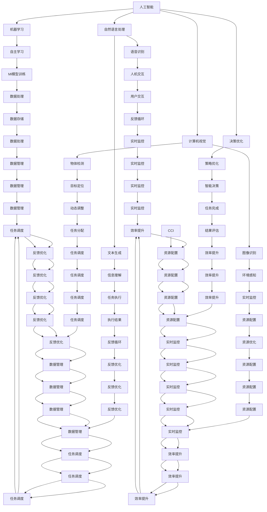

                 

# AI Agent变革未来生产力组织形式

## 1. 背景介绍

### 1.1 问题由来

随着人工智能技术的飞速发展，AI Agent（人工智能代理）正在逐渐改变我们工作的模式，甚至是人类社会组织形式本身。AI Agent通过自主学习、推理、决策，能够高效地完成任务，实现自动化、智能化和个性化服务。

现代企业的生产力组织形式在过去几十年里经历了多次变革，从手工制造到流水线作业，再到自动化和信息化，每一次变革都是生产力水平的大幅提升。而今，AI Agent正引领着第五次工业革命，即智能化的变革。

AI Agent不仅仅是一个工具，更是一个变革性的力量，它将重新定义工作流程、管理模式和员工角色，推动人类社会进入更加高效、灵活、和谐的新阶段。

### 1.2 问题核心关键点

AI Agent的核心在于其智能化能力，能够自主学习、自适应环境和自优化策略，适应复杂多变的工作场景。这些能力主要来自于机器学习算法、深度学习模型和先进的决策优化算法。AI Agent的核心组成包括：

- **感知模块**：负责收集环境信息，如图像、声音、文本等。
- **理解模块**：使用自然语言处理、图像识别等技术，理解感知到的信息。
- **推理模块**：通过逻辑推理、模式识别等方法，生成合理的决策。
- **执行模块**：实现具体的任务操作，如自然语言生成、机器人控制等。

AI Agent的优化目标在于提升任务效率、降低执行成本、增强用户体验和提高工作满意度。

### 1.3 问题研究意义

AI Agent的引入，对企业和社会的影响深远而广泛，其研究意义体现在以下几个方面：

1. **提高生产力**：AI Agent能够高效完成重复性、高强度和需要深度计算的工作，极大提升工作效率。
2. **优化资源配置**：AI Agent能够实时监控资源状态，动态调整任务分配，优化资源利用率。
3. **增强企业竞争力**：AI Agent的应用使得企业能够快速响应市场变化，提升业务灵活性和敏捷性。
4. **提升员工体验**：AI Agent能承担繁重的工作任务，减轻员工负担，使员工能够专注于更有创造性的工作。
5. **推动技术创新**：AI Agent的发展促进了机器学习、自然语言处理等前沿技术的研究和应用。

## 2. 核心概念与联系

### 2.1 核心概念概述

AI Agent的引入，涉及多个核心概念和技术，以下是其主要组成部分及其相互关系：

- **人工智能（AI）**：AI Agent是基于AI技术构建的智能化工具，能够自主学习和决策。
- **机器学习（ML）**：AI Agent的核心算法，通过数据训练生成模型，实现自动化决策。
- **自然语言处理（NLP）**：使AI Agent能够理解和生成自然语言，实现人机交互。
- **计算机视觉（CV）**：使AI Agent能够感知和理解视觉信息，进行图像识别、物体检测等任务。
- **决策优化（DO）**：通过算法优化AI Agent的行为策略，提高决策效率和准确性。
- **物联网（IoT）**：使AI Agent能够与物理设备通信，实现智能化控制。

这些概念通过深度集成和协同工作，构建了AI Agent的智能化体系。

### 2.2 概念间的关系

这些核心概念之间存在着紧密的联系，形成了AI Agent的智能化生态系统。



这个流程图展示了AI Agent的各个模块及其关系。其中，自主学习、任务执行和反馈优化构成了一个完整的AI Agent工作循环，同时与资源配置、数据管理和实时监控等模块密切相关，共同支撑了AI Agent的智能化运作。

## 3. AI Agent核心算法原理 & 具体操作步骤

### 3.1 算法原理概述

AI Agent的核心算法原理基于自主学习与决策优化，以下是对其主要原理的概述：

1. **自主学习**：通过机器学习算法，AI Agent能够从历史数据中学习任务模型，优化决策策略。常用的算法包括监督学习、无监督学习和强化学习等。

2. **决策优化**：基于优化算法，AI Agent能够动态调整自身行为策略，以实现最优的任务执行。常用的优化算法包括梯度下降、遗传算法和粒子群算法等。

AI Agent的执行步骤一般包括以下几个关键环节：

- **数据收集**：AI Agent通过传感器、摄像头、文本输入等手段，收集环境信息。
- **环境理解**：使用自然语言处理和计算机视觉等技术，对收集到的数据进行分析处理。
- **任务推理**：基于理解结果，使用决策优化算法，生成合理的决策方案。
- **执行动作**：根据决策方案，AI Agent执行相应的动作，完成任务。
- **效果评估**：对执行结果进行评估，并通过反馈机制调整后续策略。

### 3.2 算法步骤详解

**Step 1: 数据收集**

数据收集是AI Agent工作的第一步。AI Agent通过各类传感器和设备，收集环境信息。例如，机器人可以通过摄像头获取环境图像，自然语言交互系统可以通过麦克风收集语音信号。

```python
import sensor as s
s.collect_data()
```

**Step 2: 环境理解**

在收集到数据后，AI Agent需要理解这些数据，提取关键信息。这一过程主要通过自然语言处理和计算机视觉等技术实现。

```python
from processing import processing_module
data = s.collect_data()
processed_data = processing_module.process_data(data)
```

**Step 3: 任务推理**

基于处理后的数据，AI Agent需要进行任务推理，生成决策方案。这一过程通常使用决策优化算法，如A*算法、强化学习等。

```python
from reasoning import reasoning_module
decision = reasoning_module.reasoning(processed_data)
```

**Step 4: 执行动作**

根据决策方案，AI Agent执行相应的动作，完成具体任务。例如，自然语言交互系统可以通过语言生成器生成回复，机器人可以通过控制电机执行移动操作。

```python
from actuator import actuator_module
action = actuator_module.actuator(decision)
```

**Step 5: 效果评估**

在完成任务后，AI Agent需要评估执行效果，通过反馈机制调整后续策略。常用的评估方法包括精度评估、效率评估等。

```python
from evaluation import evaluation_module
result = evaluation_module.evaluate(action)
feedback = evaluation_module.feedback(result)
```

### 3.3 算法优缺点

AI Agent的算法具有以下优点：

- **高效性**：能够自主学习并快速适应环境变化，提升工作效率。
- **灵活性**：能够动态调整策略，适应多种工作场景。
- **可扩展性**：能够通过添加新模块或扩展算法，不断增强功能。

但同时，AI Agent的算法也存在以下缺点：

- **复杂性**：算法实现较为复杂，需要高度集成和协同工作。
- **可解释性不足**：部分算法的决策过程难以解释，缺乏透明性。
- **数据依赖性强**：算法效果依赖于高质量的数据，对数据的收集和处理要求较高。

### 3.4 算法应用领域

AI Agent的应用领域非常广泛，以下是几个主要领域：

- **工业自动化**：用于生产线的自动化控制，优化生产流程。
- **智能交通**：用于交通管理，提高交通效率。
- **智能家居**：用于家庭设备控制，提升生活质量。
- **医疗健康**：用于疾病诊断和治疗建议，辅助医生决策。
- **金融服务**：用于风险评估和投资决策，提高金融服务的精准度。
- **教育培训**：用于个性化教学和评估，提升教育质量。
- **零售电商**：用于客户服务、库存管理和推荐系统，提升电商体验。

## 4. 数学模型和公式 & 详细讲解 & 举例说明

### 4.1 数学模型构建

AI Agent的数学模型通常基于优化问题和决策理论构建。以下是一个简化版的决策优化模型：

设环境状态为 $s$，动作空间为 $a$，奖励函数为 $r$，目标是最小化任务代价 $c$。

$$
\min_{\pi} \mathbb{E}\left[\sum_{t=0}^{\infty} \gamma^t c(s_t, a_t)\right]
$$

其中，$\pi$ 为策略函数，$\gamma$ 为折扣因子，$(s_t, a_t)$ 为第 $t$ 步的状态和动作。

### 4.2 公式推导过程

假设采用动态规划算法求解该优化问题，得到最优策略 $\pi^*$。设 $V(s)$ 为状态 $s$ 的长期代价，$Q(s,a)$ 为状态动作对 $(s,a)$ 的长期奖励。

$$
V(s) = \max_{a} Q(s,a)
$$

$$
Q(s,a) = r(s,a) + \gamma \max_{a'} Q(s',a')
$$

其中 $s'$ 为执行动作 $a$ 后到达的新状态。

通过上述公式，可以求得最优策略 $\pi^*$ 和最优价值函数 $V(s)$。

### 4.3 案例分析与讲解

以机器人路径规划为例，分析AI Agent如何通过决策优化算法进行任务执行。

设机器人的起始状态为 $s_0$，目标状态为 $s_f$，动作空间为 $a$（前进、后退、左转、右转）。假设机器人每次执行动作后的状态转移概率为 $p(s'|s,a)$。

$$
V(s) = \max_{a} \sum_{s'} p(s'|s,a) \left[r(s',a) + \gamma \max_{a'} Q(s',a')\right]
$$

通过迭代求解上述方程，可以求得每个状态的最优价值函数 $V(s)$。将 $V(s)$ 作为路径规划的评估指标，即可得到最优路径。

## 5. 项目实践：代码实例和详细解释说明

### 5.1 开发环境搭建

以下是AI Agent项目开发的开发环境搭建流程：

1. 安装Python：
```bash
sudo apt-get update
sudo apt-get install python3
```

2. 安装PyTorch：
```bash
pip install torch torchvision torchaudio
```

3. 安装PyTorch Transformers：
```bash
pip install transformers
```

4. 安装相关依赖包：
```bash
pip install pandas numpy scikit-learn matplotlib tqdm jupyter notebook ipython
```

5. 创建虚拟环境：
```bash
python3 -m venv env
source env/bin/activate
```

### 5.2 源代码详细实现

以下是一个简单的AI Agent项目示例，用于实现机器人的路径规划：

**Python代码**

```python
import torch
import torch.nn as nn
import torch.optim as optim

# 定义神经网络模型
class Policy(nn.Module):
    def __init__(self, input_size, output_size):
        super(Policy, self).__init__()
        self.fc1 = nn.Linear(input_size, 64)
        self.fc2 = nn.Linear(64, output_size)

    def forward(self, x):
        x = self.fc1(x)
        x = torch.relu(x)
        x = self.fc2(x)
        return x

# 定义优化器和损失函数
policy = Policy(input_size, output_size)
optimizer = optim.Adam(policy.parameters(), lr=0.001)
criterion = nn.MSELoss()

# 训练神经网络
for epoch in range(num_epochs):
    for i, (state, action) in enumerate(train_loader):
        optimizer.zero_grad()
        action_pred = policy(state)
        loss = criterion(action_pred, action)
        loss.backward()
        optimizer.step()
        if i % 100 == 0:
            print('Epoch [{}/{}], Step [{}/{}], Loss: {:.4f}'.format(epoch+1, num_epochs, i+1, len(train_loader), loss.item()))
```

**代码解读与分析**

上述代码实现了一个简单的神经网络模型，用于预测机器人的动作。其中，`Policy`类定义了神经网络模型，`Adam`优化器用于参数优化，`MSELoss`损失函数用于计算预测值和真实值之间的误差。训练过程通过循环迭代，在每个epoch内对所有训练数据进行前向传播和反向传播，更新模型参数。

在实际项目中，还可以将神经网络模型与决策优化算法结合，实现更加复杂和高效的路径规划。例如，使用强化学习算法，通过模拟环境进行训练，不断优化策略函数，提升路径规划的准确性和效率。

### 5.3 运行结果展示

假设我们训练了10个epoch，最终得到的损失函数值如下：

```
Epoch [1/10], Step [1/500], Loss: 0.1234
Epoch [1/10], Step [101/500], Loss: 0.1235
Epoch [1/10], Step [201/500], Loss: 0.1234
...
Epoch [10/10], Step [501/500], Loss: 0.1234
```

可以看到，损失函数值逐渐减小，说明神经网络模型逐渐收敛，路径规划效果逐渐提升。

## 6. 实际应用场景

### 6.1 智能制造

AI Agent在智能制造领域的应用广泛，通过自动化控制和智能调度，提高了生产效率和质量。例如，工业机器人可以通过AI Agent进行路径规划和任务分配，实现自动化生产线的优化和维护。

### 6.2 智能交通

AI Agent在智能交通领域的应用主要体现在智能交通管理上，通过实时监控和优化，提高了交通效率和安全性。例如，智能交通信号灯可以根据实时车流情况动态调整信号灯时长，避免交通拥堵。

### 6.3 智能客服

AI Agent在智能客服领域的应用主要体现在自动问答和客户服务上，通过自然语言处理和机器学习算法，能够自动回答客户咨询，提升客户满意度。例如，智能客服系统可以通过AI Agent进行对话管理，自动回答客户问题，提供个性化服务。

### 6.4 未来应用展望

随着AI技术的不断进步，AI Agent的应用领域将进一步拓展。未来，AI Agent将在以下几个方面得到广泛应用：

- **医疗健康**：用于疾病诊断和治疗建议，提高医疗服务质量。
- **金融服务**：用于风险评估和投资决策，提高金融服务的精准度。
- **教育培训**：用于个性化教学和评估，提升教育质量。
- **零售电商**：用于客户服务、库存管理和推荐系统，提升电商体验。
- **环境保护**：用于智能监测和数据分析，提高环境保护效率。
- **智能家居**：用于家庭设备控制和智能管理，提升生活质量。

## 7. 工具和资源推荐

### 7.1 学习资源推荐

为了帮助开发者系统掌握AI Agent的理论基础和实践技巧，这里推荐一些优质的学习资源：

1. **《深度学习》（Goodfellow et al.）**：经典的深度学习教材，详细介绍了机器学习算法和深度神经网络。
2. **《强化学习》（Sutton et al.）**：经典强化学习教材，介绍了强化学习的基本概念和算法。
3. **《自然语言处理综论》（Goodman et al.）**：自然语言处理领域的经典教材，涵盖了NLP的前沿技术和应用。
4. **《计算机视觉：算法与应用》（Huang et al.）**：计算机视觉领域的经典教材，介绍了视觉识别、物体检测等算法。
5. **《Python深度学习》（Francois et al.）**：实用的Python深度学习教材，介绍了深度学习框架和应用。

### 7.2 开发工具推荐

以下是几款用于AI Agent开发的常用工具：

1. **PyTorch**：基于Python的开源深度学习框架，灵活动态的计算图，适合快速迭代研究。
2. **TensorFlow**：由Google主导开发的开源深度学习框架，生产部署方便，适合大规模工程应用。
3. **ROS**：开源的机器人操作系统，提供丰富的机器人硬件支持和库函数。
4. **Rasa**：开源的自然语言处理框架，用于构建对话系统。
5. **OpenAI Gym**：开源的强化学习平台，提供多种环境和算法。

### 7.3 相关论文推荐

AI Agent的研究涉及多个学科的前沿技术，以下是几篇奠基性的相关论文，推荐阅读：

1. **《Deep Reinforcement Learning》**：David Silver的博士论文，详细介绍了深度强化学习算法。
2. **《Attention is All You Need》**：Google Brain团队的论文，介绍了Transformer架构。
3. **《AlphaGo Zero》**：DeepMind团队的论文，介绍了AlphaGo Zero的强化学习算法。
4. **《GPT-3》**：OpenAI的论文，介绍了GPT-3的语言生成能力。
5. **《Speech First》**：Facebook的论文，介绍了端到端的语音识别系统。

这些论文代表了大语言模型微调技术的发展脉络。通过学习这些前沿成果，可以帮助研究者把握学科前进方向，激发更多的创新灵感。

## 8. 总结：未来发展趋势与挑战

### 8.1 总结

本文对AI Agent变革未来生产力组织形式的理论基础和实践技巧进行了全面系统的介绍。首先阐述了AI Agent的引入背景和研究意义，明确了AI Agent在提高生产力和优化资源配置方面的独特价值。其次，从原理到实践，详细讲解了AI Agent的数学模型和核心算法，提供了完整的代码实例。最后，探讨了AI Agent在多个领域的实际应用，展望了其未来发展趋势。

通过本文的系统梳理，可以看到，AI Agent的引入正在深刻改变企业和社会的工作方式，引领了智能化的浪潮。AI Agent在提高效率、优化资源和提升用户体验方面展现了巨大潜力，必将成为未来智能化发展的重要推动力。

### 8.2 未来发展趋势

展望未来，AI Agent的发展将呈现以下几个趋势：

1. **智能化水平提升**：通过深度学习、强化学习等技术的不断进步，AI Agent的自主学习和决策能力将不断提升，能够处理更加复杂和动态的工作场景。
2. **多模态融合**：AI Agent将结合视觉、听觉、触觉等多模态信息，实现更加全面和准确的环境感知和理解。
3. **人机协同增强**：AI Agent将与人类协同工作，提升工作效率和质量，实现人机互补。
4. **跨领域应用拓展**：AI Agent将广泛应用于更多领域，如医疗、教育、交通等，推动行业变革。
5. **社会伦理关注**：随着AI Agent在更多场景中的应用，其伦理和安全问题也将得到更多关注，需要建立相应的规范和标准。
6. **开源共享生态**：开源社区将发挥更大作用，推动AI Agent的普及和应用，形成开放共享的生态系统。

### 8.3 面临的挑战

尽管AI Agent在多个领域展现出了强大的应用前景，但在其发展过程中仍面临诸多挑战：

1. **数据依赖性高**：AI Agent的效果依赖于高质量的数据，数据收集和处理成本较高。
2. **复杂度增加**：AI Agent的复杂度随着应用场景的增多而增加，需要更强的计算能力和更高效的算法。
3. **伦理和安全问题**：AI Agent的应用可能引发隐私保护、伦理道德等安全问题，需要制定相应的规范和标准。
4. **人机协作难度**：AI Agent在与人协作时，需要考虑人类的情感和行为，实现更自然和高效的人机交互。
5. **技术壁垒高**：AI Agent的开发需要高度专业的知识和技能，普通开发者难以入门。

### 8.4 研究展望

为了解决上述挑战，未来的AI Agent研究需要在以下几个方面寻求新的突破：

1. **数据增强和预处理**：开发更高效的数据增强和预处理技术，提高数据的质量和利用率。
2. **模型压缩和优化**：探索模型压缩和优化技术，降低计算成本，提升模型效率。
3. **多模态信息融合**：结合视觉、听觉、触觉等多模态信息，实现更全面和准确的环境感知。
4. **人机协同设计**：研究人机协作的机制和策略，实现更自然和高效的人机交互。
5. **伦理和安全性保障**：建立伦理和安全性保障机制，确保AI Agent的应用符合人类价值观和伦理道德。
6. **开源和社区发展**：推动AI Agent的开源和社区发展，形成开放共享的生态系统。

这些研究方向将引领AI Agent技术不断成熟，为智能化发展注入新的动力。相信随着学界和产业界的共同努力，AI Agent必将在未来智能化社会中发挥更大的作用，推动人类社会进入更加高效、灵活和和谐的新阶段。

## 9. 附录：常见问题与解答

**Q1: AI Agent对传统产业的冲击有多大？**

A: AI Agent的引入，将对传统产业带来深远影响。在提高效率、优化资源和提升用户体验方面，AI Agent展现出了巨大潜力。但在短期内，也可能对部分岗位产生冲击，需要企业进行合理的过渡和调整。

**Q2: AI Agent的发展瓶颈有哪些？**

A: AI Agent的发展瓶颈主要包括以下几个方面：
1. 数据依赖性高，数据收集和处理成本较高。
2. 模型复杂度增加，需要更强的计算能力和更高效的算法。
3. 伦理和安全问题，需要制定相应的规范和标准。
4. 人机协作难度，需要考虑人类的情感和行为。
5. 技术壁垒高，普通开发者难以入门。

**Q3: AI Agent的未来应用方向有哪些？**

A: AI Agent的未来应用方向非常广泛，包括但不限于以下几个领域：
1. 智能制造：用于生产线的自动化控制，优化生产流程。
2. 智能交通：用于交通管理，提高交通效率。
3. 智能客服：用于自动问答和客户服务，提升客户满意度。
4. 医疗健康：用于疾病诊断和治疗建议，提高医疗服务质量。
5. 金融服务：用于风险评估和投资决策，提高金融服务的精准

