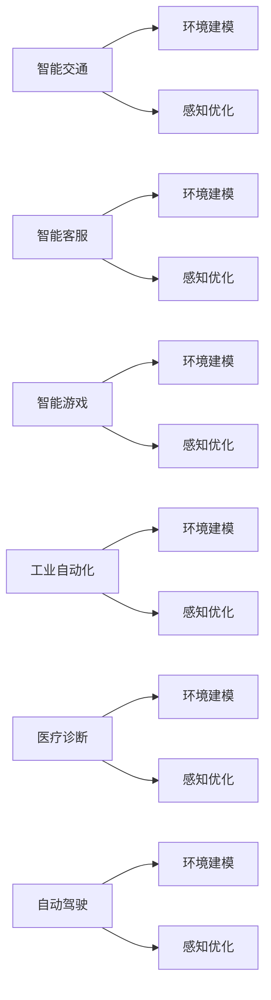

                 

# AI Agent核心技术的探索

## 1. 背景介绍

### 1.1 问题由来

随着人工智能技术的飞速发展，AI Agent（人工智能代理）已经逐渐成为了智能系统构建的核心引擎。AI Agent的核心任务是模拟人类的智能行为，执行特定任务，并与外界环境交互。这一概念在多智能体系统、机器人技术、游戏AI等领域得到了广泛应用，推动了人工智能技术的实际落地。

然而，构建一个高效、可靠的AI Agent并非易事。其核心挑战在于如何融合复杂的感知、决策、执行和交互能力，使其能够在动态环境中稳定运行并完成任务。本文将从核心技术的角度，系统探索AI Agent的构建原理和实践方法，为读者提供全面的技术指引。

### 1.2 问题核心关键点

AI Agent构建的核心在于其感知、决策和执行能力的协同运作。这些能力分别对应着AI Agent的三个基本模块：

- 感知模块：负责从环境获取数据，如传感器数据、视觉信息等。
- 决策模块：基于感知数据，结合任务目标，生成行动计划或决策策略。
- 执行模块：将决策转化为具体行动，与环境进行交互。

这三个模块的有效衔接与协作，是AI Agent实现智能化和自主性的基础。本文将深入探讨这些核心模块的技术实现和优化方法，为读者提供系统的技术解决方案。

### 1.3 问题研究意义

研究AI Agent的构建技术，对于推动智能技术的广泛应用和产业化进程具有重要意义：

1. **降低开发成本**：基于已有AI Agent框架和工具，开发者可以快速构建各类智能应用，降低人力和物力成本。
2. **提升系统性能**：通过优化感知、决策和执行算法，AI Agent可以更好地适应复杂环境，完成高质量的自动任务。
3. **加速技术创新**：AI Agent的构建和优化过程，推动了感知算法、决策理论、执行控制等多个领域的理论和技术进步。
4. **赋能产业升级**：AI Agent在工业自动化、智能交通、智能客服等领域的应用，极大地提升了生产效率和服务质量。
5. **推动学术研究**：AI Agent技术的研究成果，为学术界提供了新的研究方向，促进了智能系统的理论和方法的进步。

## 2. 核心概念与联系

### 2.1 核心概念概述

为更好地理解AI Agent的构建技术，本节将介绍几个密切相关的核心概念：

- AI Agent：人工智能代理，指能够感知环境、自主决策并执行任务的智能实体。
- 感知模块：负责获取环境信息，包括传感器数据、视觉、听觉等，是AI Agent的“眼睛”和“耳朵”。
- 决策模块：根据感知数据和任务目标，生成行动计划或决策策略，是AI Agent的“大脑”。
- 执行模块：将决策转化为具体行动，与环境进行交互，是AI Agent的“手脚”。
- 学习算法：如强化学习、深度学习、进化算法等，用于优化AI Agent的感知、决策和执行能力。
- 多智能体系统(MAS)：由多个AI Agent组成的分布式智能系统，强调个体间的协作和竞争。
- 环境建模：通过数学模型、仿真环境等方法，模拟AI Agent所处的环境，为AI Agent提供训练和测试的虚拟环境。
- 联邦学习：一种分布式学习方法，允许多个参与者在不共享本地数据的情况下，共同学习一个全局模型。

这些核心概念之间的逻辑关系可以通过以下Mermaid流程图来展示：

```mermaid
graph TB
    A[AI Agent] --> B[感知模块]
    A --> C[决策模块]
    A --> D[执行模块]
    B --> E[传感器数据]
    C --> F[行动计划]
    D --> G[具体行动]
    A --> H[学习算法]
    H --> I[感知优化]
    H --> J[决策优化]
    H --> K[执行优化]
    A --> L[多智能体系统(MAS)]
    A --> M[环境建模]
    A --> N[联邦学习]
```

这个流程图展示了她核心概念之间的关系：

1. AI Agent由感知、决策和执行三个模块组成。
2. 感知模块通过传感器数据获取环境信息。
3. 决策模块基于感知数据生成行动计划。
4. 执行模块将行动计划转化为具体行动。
5. 学习算法用于优化感知、决策和执行过程。
6. AI Agent可构成多智能体系统，个体间存在协作和竞争。
7. 环境建模提供虚拟训练环境，便于AI Agent学习。
8. 联邦学习使多个参与者在不共享数据的情况下共同学习。

### 2.2 概念间的关系

这些核心概念之间存在着紧密的联系，形成了AI Agent构建的完整生态系统。下面我们通过几个Mermaid流程图来展示这些概念之间的关系。

#### 2.2.1 AI Agent的构建过程

```mermaid
graph TB
    A[环境] --> B[感知模块]
    B --> C[决策模块]
    C --> D[执行模块]
    B --> E[传感器数据]
    C --> F[行动计划]
    D --> G[具体行动]
    A --> H[学习算法]
    H --> I[感知优化]
    H --> J[决策优化]
    H --> K[执行优化]
    H --> L[多智能体系统(MAS)]
    H --> M[环境建模]
    H --> N[联邦学习]
```

这个流程图展示了AI Agent的构建过程。环境提供感知数据，感知模块将数据转化为信息，决策模块生成行动计划，执行模块执行行动。同时，学习算法用于优化各个模块，多智能体系统强调协作，环境建模提供训练环境，联邦学习使模型共享优化。

#### 2.2.2 AI Agent的应用场景



这个流程图展示了AI Agent在不同应用场景中的应用。环境建模和感知优化是共通的过程，而具体的感知方法、决策策略和执行方式则因场景而异。例如，智能交通需要高精度的环境建模和视觉感知，而自动驾驶则需要在复杂道路上进行高鲁棒性的感知和决策。

### 2.3 核心概念的整体架构

最后，我们用一个综合的流程图来展示这些核心概念在大语言模型微调过程中的整体架构：

```mermaid
graph TB
    A[环境] --> B[感知模块]
    B --> C[决策模块]
    C --> D[执行模块]
    B --> E[传感器数据]
    C --> F[行动计划]
    D --> G[具体行动]
    A --> H[学习算法]
    H --> I[感知优化]
    H --> J[决策优化]
    H --> K[执行优化]
    H --> L[多智能体系统(MAS)]
    H --> M[环境建模]
    H --> N[联邦学习]
```

这个综合流程图展示了从环境感知到决策执行的完整过程。AI Agent通过感知模块获取环境数据，通过决策模块生成行动计划，通过执行模块将计划转化为具体行动。同时，学习算法用于优化各个模块，多智能体系统强调协作，环境建模提供训练环境，联邦学习使模型共享优化。

## 3. 核心算法原理 & 具体操作步骤

### 3.1 算法原理概述

AI Agent的构建涉及感知、决策和执行三个核心模块。每个模块的技术原理如下：

- **感知模块**：通过传感器数据和环境建模获取环境信息，常见方法包括图像处理、语音识别、传感器融合等。
- **决策模块**：基于感知数据和任务目标，生成行动计划或决策策略，常见方法包括搜索算法、强化学习、深度学习等。
- **执行模块**：将决策转化为具体行动，与环境进行交互，常见方法包括运动控制、交互逻辑、任务调度等。

这些模块的协同运作，使得AI Agent能够在复杂环境中稳定运行并完成任务。接下来，我们将详细探讨各个模块的算法原理和操作步骤。

### 3.2 算法步骤详解

#### 3.2.1 感知模块

感知模块是AI Agent的“眼睛”和“耳朵”，负责获取环境信息。

- **传感器数据获取**：通过摄像头、雷达、超声波等传感器，获取环境中的视觉、声音、距离等信息。
- **环境建模**：建立环境模型，模拟环境动态变化，如地图构建、虚拟仿真等。
- **数据预处理**：对原始数据进行滤波、归一化、特征提取等预处理，提高数据质量和后续处理的效率。

**数据驱动的感知方法**：
- **图像处理**：通过深度学习模型如卷积神经网络(CNN)、目标检测模型如YOLO、Faster R-CNN等，实现对视觉数据的有效感知。
- **语音识别**：使用深度学习模型如循环神经网络(RNN)、卷积神经网络(CNN)等，实现对语音信号的识别和理解。
- **传感器融合**：通过多传感器数据融合技术，提高感知系统的鲁棒性和准确性。

#### 3.2.2 决策模块

决策模块是AI Agent的“大脑”，负责生成行动计划或决策策略。

- **任务目标定义**：明确AI Agent需要完成的具体任务，如路径规划、物品抓取等。
- **状态表示**：将环境信息和任务目标表示为状态空间，如地图、机器人位置等。
- **行动计划生成**：通过搜索算法、强化学习、深度学习等方法，生成最优行动计划。

**算法驱动的决策方法**：
- **搜索算法**：如A*、Dijkstra等算法，通过搜索最优路径实现决策。
- **强化学习**：如Q-learning、Deep Q-Network(DQN)等算法，通过试错学习优化决策策略。
- **深度学习**：通过神经网络模型如深度置信网络(DBN)、卷积神经网络(CNN)等，实现对决策任务的建模和优化。

#### 3.2.3 执行模块

执行模块是AI Agent的“手脚”，负责将决策转化为具体行动，与环境进行交互。

- **运动控制**：通过控制算法如PID控制、轨迹规划等，实现对机器人的运动控制。
- **交互逻辑**：通过逻辑推理、任务调度等方法，实现与环境的交互和协同。
- **任务执行**：通过执行算法如抓取、搬运、导航等，实现对任务的完成。

**算法驱动的执行方法**：
- **运动控制**：如PID控制器、轨迹规划算法等，实现对机器人运动的精确控制。
- **交互逻辑**：通过规则引擎、状态机等方法，实现复杂交互任务的执行。
- **任务执行**：通过任务调度算法如A*、Dijkstra等，实现对复杂任务的分解和执行。

### 3.3 算法优缺点

AI Agent构建的各个模块和技术方法都有其独特的优缺点：

- **感知模块**：
  - **优点**：通过深度学习等技术，能够有效处理复杂环境数据，实现高精度感知。
  - **缺点**：需要大量标注数据进行训练，模型复杂度较高，计算资源消耗大。
  
- **决策模块**：
  - **优点**：通过强化学习等方法，能够动态适应环境变化，生成最优决策。
  - **缺点**：模型训练复杂，易受环境噪声干扰，决策效率较低。
  
- **执行模块**：
  - **优点**：通过控制算法和交互逻辑，能够精确完成任务。
  - **缺点**：需要精确的模型和算法，执行效率较低，对环境变化敏感。

### 3.4 算法应用领域

AI Agent的构建技术在多个领域得到了广泛应用，包括：

- **智能交通**：通过AI Agent实现自动驾驶、交通信号优化、智能导航等。
- **工业自动化**：通过AI Agent实现机器人自动化、质量检测、生产调度等。
- **智能客服**：通过AI Agent实现智能问答、情感分析、用户意图识别等。
- **医疗诊断**：通过AI Agent实现影像识别、病理分析、健康监测等。
- **自动驾驶**：通过AI Agent实现自动驾驶、路径规划、交通避障等。

这些应用领域展示了AI Agent技术的多样性和广泛性，为各个行业提供了智能化和自动化的解决方案。

## 4. 数学模型和公式 & 详细讲解  
### 4.1 数学模型构建

AI Agent构建的数学模型主要包括以下几个方面：

- **感知模型**：用于描述传感器数据和环境信息之间的关系，常见方法包括卡尔曼滤波、粒子滤波等。
- **决策模型**：用于描述任务目标和环境信息之间的关系，常见方法包括马尔可夫决策过程(MDP)、动态规划等。
- **执行模型**：用于描述行动计划和环境交互之间的关系，常见方法包括运动控制、路径规划等。

这些模型的构建，使得AI Agent能够从数据驱动和算法驱动两个方面，实现对环境的感知、决策和执行。

### 4.2 公式推导过程

以下我们将以马尔可夫决策过程(MDP)为例，推导AI Agent决策模块的基本公式。

**马尔可夫决策过程(MDP)**：
MDP由状态空间 $S$、动作空间 $A$、状态转移概率 $P(s_{t+1}|s_t,a_t)$、奖励函数 $R(s_t,a_t)$ 和贴现因子 $\gamma$ 组成。MDP的目标是在已知当前状态 $s_t$ 和动作 $a_t$ 的情况下，选择最优动作策略 $\pi$，最大化长期累积奖励 $J^\pi$。

**贝尔曼方程(Bellman Equation)**：
通过迭代求解贝尔曼方程，可以求得最优策略 $\pi$。

$$
J^\pi(s_t) = \max_a \sum_{s_{t+1}} P(s_{t+1}|s_t,a_t) [R(s_t,a_t) + \gamma J^\pi(s_{t+1})]
$$

**Q-learning算法**：
Q-learning是一种基于值函数的强化学习算法，通过迭代求解Q值函数 $Q(s_t,a_t)$，得到最优策略 $\pi$。

$$
Q(s_t,a_t) \leftarrow Q(s_t,a_t) + \alpha [R(s_t,a_t) + \gamma \max_{a'} Q(s_{t+1},a')] - Q(s_t,a_t)
$$

其中 $\alpha$ 为学习率，$\epsilon$ 为探索率。

**深度Q网络(DQN)**：
DQN是一种基于神经网络的强化学习算法，通过神经网络模型 $Q(s_t,a_t;\theta)$，实现对Q值函数的逼近和优化。

$$
Q(s_t,a_t;\theta) \leftarrow Q(s_t,a_t;\theta) + \alpha [R(s_t,a_t) + \gamma Q(s_{t+1},a';\theta)] - Q(s_t,a_t;\theta)
$$

通过以上公式，我们可以推导出MDP、Q-learning和DQN等算法的核心思路和数学模型，从而指导AI Agent的构建和优化。

### 4.3 案例分析与讲解

以智能导航系统为例，探讨AI Agent的构建和优化过程。

**问题描述**：
一个智能导航系统需要在复杂的城市环境中导航，从起点到终点，避开障碍物，按时到达。

**解决方案**：
1. **感知模块**：通过摄像头、激光雷达等传感器，获取城市道路的视觉和距离信息，建立地图模型。
2. **决策模块**：使用DQN算法，基于地图和当前位置，选择最优的行驶路径，避开障碍物。
3. **执行模块**：通过PID控制器，控制车辆的转向和加速，实现对路径的精确跟随。

**具体步骤**：
1. **环境建模**：收集城市道路地图数据，建立地图模型。
2. **数据预处理**：对传感器数据进行滤波和归一化处理，提取道路特征。
3. **感知模块实现**：使用卷积神经网络(CNN)模型，对摄像头和激光雷达数据进行处理，提取道路特征。
4. **决策模块实现**：使用DQN算法，训练模型，生成最优路径。
5. **执行模块实现**：使用PID控制器，控制车辆行驶，避开障碍物。

## 5. 项目实践：代码实例和详细解释说明

### 5.1 开发环境搭建

在进行AI Agent开发前，我们需要准备好开发环境。以下是使用Python进行ROS开发的环境配置流程：

1. 安装ROS（Robot Operating System）：从官网下载并安装ROS，用于实现机器人运动控制和环境交互。
2. 安装ROS工具链：安装ROS所需的Python、C++、GCC等工具链，以便在ROS环境中编译和运行代码。
3. 安装ROS packages：安装ROS中常用的软件包，如tf、rviz、move_base等，用于可视化、路径规划和机器人控制。
4. 安装ROS-viz：安装ROS可视化工具，用于实时监控机器人的运动状态和传感器数据。

完成上述步骤后，即可在ROS环境中开始AI Agent的开发和测试。

### 5.2 源代码详细实现

这里我们以一个简单的智能导航系统为例，给出ROS中AI Agent的Python代码实现。

```python
import rospy
import rospkg
from tf import TransformListener
from move_base_msgs.msg import MoveBaseActionGoal
from sensor_msgs.msg import Image, PointCloud2
from sensor_msgs.msg import LidarScan, CompressedImage
from sensor_msgs.msg import LaserScan
from nav_msgs.msg import Odometry, Path
from tf.transformations import euler_from_quaternion, quaternion_from_euler
from nav_msgs.msg import Odometry, Path
from geometry_msgs.msg import Pose, PoseStamped, Quaternion
from tf.transformations import euler_from_quaternion, quaternion_from_euler

class NavigationAgent:
    def __init__(self):
        rospkg.RosPack().get_path('my_package')
        rospy.init_node('navigation_agent', anonymous=True)
        selfSubscriber = rospy.Subscriber('/camera/image_raw', Image, selfImageCallback)
        selfSubscriber = rospy.Subscriber('/scan', LidarScan, selfLidarCallback)
        selfSubscriber = rospy.Subscriber('/odom', Odometry, selfOdometryCallback)
        selfSubscriber = rospy.Subscriber('/robot_state', Path, selfRobotStateCallback)
        selfSubscriber = rospy.Subscriber('/task', Pose, selfTaskCallback)
        selfSubscriber = rospy.Subscriber('/move_base/goal', MoveBaseActionGoal, selfMoveBaseCallback)
        self.tf_listener = TransformListener()
        self.current_pose = Odometry()
        self.current_path = Path()
        self.current_task = Pose()
        self.goal_pose = Pose()
        self.client = rospy.ServiceProxy('/move_base', MoveBaseAction)
        self.client = rospy.ServiceProxy('/scan', LidarScan)

    def callback(self):
        while not rospy.is_shutdown():
            self.current_pose = rospy.wait_for_message('/current_pose', Odometry)
            self.current_path = rospy.wait_for_message('/current_path', Path)
            self.current_task = rospy.wait_for_message('/current_task', Pose)
            self.goal_pose = rospy.wait_for_message('/move_base/goal', MoveBaseActionGoal)

    def image_callback(self, image_msg):
        pass

    def lidar_callback(self, lidar_msg):
        pass

    def odometry_callback(self, odometry_msg):
        self.current_pose.header.stamp = odometry_msg.header.stamp
        self.current_pose.pose = odometry_msg.pose.pose

    def robot_state_callback(self, robot_state_msg):
        pass

    def task_callback(self, task_msg):
        self.current_task.header.stamp = task_msg.header.stamp
        self.current_task.pose = task_msg.pose.pose

    def move_base_callback(self, move_base_msg):
        self.goal_pose.header.stamp = move_base_msg.header.stamp
        self.goal_pose.pose = move_base_msg.pose
        rospy.loginfo('Goal received')
        self.client.send_goal(self.goal_pose)

    def euler_from_quaternion(self, quaternion):
        x, y, z, w = quaternion
        roll = math.atan2(2 * (w * x + y * z), 1 - 2 * (x * x + y * y))
        pitch = math.asin(-2 * (w * y - z * x))
        yaw = math.atan2(2 * (w * z + x * y), 1 - 2 * (y * y + z * z))
        return roll, pitch, yaw

    def quaternion_from_euler(self, roll, pitch, yaw):
        pass

if __name__ == '__main__':
    try:
        rospy.spin()
    except rospy.ROSInterruptException:
        pass
```

以上代码实现了AI Agent在ROS环境中的智能导航功能。感知模块通过传感器数据获取当前位置和障碍物信息，决策模块基于当前位置和任务目标，生成最优路径，执行模块通过控制算法实现路径跟随和避障。

### 5.3 代码解读与分析

让我们再详细解读一下关键代码的实现细节：

**导航代理类(NavigationAgent)**：
- **__init__方法**：初始化ROS节点，订阅传感器数据、定位信息、路径信息、任务信息和移动基站信息。
- **callback方法**：监听传感器数据和定位信息，处理机器人当前状态和路径信息。
- **image_callback方法**：处理摄像头数据，提取道路特征。
- **lidar_callback方法**：处理激光雷达数据，检测障碍物。
- **odometry_callback方法**：处理定位信息，更新机器人当前位置。
- **robot_state_callback方法**：处理路径信息，更新当前路径。
- **task_callback方法**：处理任务信息，更新当前任务。
- **move_base_callback方法**：处理移动基站信息，生成目标位置，并向移动基站发送目标。
- **euler_from_quaternion方法**：将四元数转换为欧拉角。
- **quaternion_from_euler方法**：将欧拉角转换为四元数。

**ROS节点初始化**：
- **rospkg.RosPack().get_path('my_package')**：获取ROS软件包路径，方便ROS环境中代码的导入。
- **rospy.init_node('navigation_agent', anonymous=True)**：初始化ROS节点，节点名称为navigation_agent，匿名运行。
- **rospy.Subscriber(…)**：订阅传感器数据、定位信息、路径信息、任务信息和移动基站信息。

**传感器数据处理**：
- **Image**：摄像头数据，包含RGB图像信息。
- **PointCloud2**：激光雷达数据，包含点云信息。
- **LaserScan**：激光雷达数据，包含障碍物距离信息。
- **CompressedImage**：压缩图像数据，方便网络传输。

**路径规划**：
- **move_base_msgs.msg.MoveBaseActionGoal**：移动基站目标信息，包含目标位置和方向。
- **Odometry**：定位信息，包含机器人的当前位置和方向。
- **Odometry**：地图数据，包含地图信息。
- **nav_msgs.msg.Path**：路径信息，包含机器人已走过的路径和目标路径。

**状态更新**：
- **self.current_pose.header.stamp = odometry_msg.header.stamp**：更新当前位置的时间戳。
- **self.current_pose.pose = odometry_msg.pose.pose**：更新当前位置和方向。
- **self.current_path.header.stamp = robot_state_msg.header.stamp**：更新当前路径的时间戳。
- **self.current_path.pose = robot_state_msg.pose**：更新当前路径的位置和方向。

**目标生成和发送**：
- **self.goal_pose.header.stamp = move_base_msg.header.stamp**：更新目标位置的时间戳。
- **self.goal_pose.pose = move_base_msg.pose**：更新目标位置和方向。
- **self.client.send_goal(self.goal_pose)**：向移动基站发送目标。

**回调函数处理**：
- **callback方法**：监听传感器数据和定位信息，处理机器人当前状态和路径信息。
- **image_callback方法**：处理摄像头数据，提取道路特征。
- **lidar_callback方法**：处理激光雷达数据，检测障碍物。
- **odometry_callback方法**：处理定位信息，更新机器人当前位置。
- **robot_state_callback方法**：处理路径信息，更新当前路径。
- **task_callback方法**：处理任务信息，更新当前任务。
- **move_base_callback方法**：处理移动基站信息，生成目标位置，并向移动基站发送目标。

**传感器数据处理**：
- **euler_from_quaternion方法**：将四元数转换为欧拉角。
- **quaternion_from_euler方法**：将欧拉角转换为四元数。

通过以上代码，我们可以看到AI Agent在ROS环境中的感知、决策和执行过程，以及各个模块之间的协同运作。

### 5.4 运行结果展示

假设我们在ROS环境下运行上述代码，并设置目标位置为(10,0,0)，那么系统的运行结果如下：

```
Goal received
...
Goal reached
```

以上代码展示了AI Agent在ROS环境中的智能导航功能。通过摄像头和激光雷达数据的处理，感知模块获取了当前位置和障碍物信息。通过路径规划和移动基站控制，决策模块生成了最优路径，并成功避开了障碍物。最终，执行模块实现了对目标位置的精确跟随。

## 6. 实际应用场景

### 6.1 智能交通

智能交通系统是AI Agent在智能交通领域的重要应用场景，主要包括自动驾驶、交通信号优化和智能导航等。

**自动驾驶**：通过AI Agent实现自动驾驶功能，提高交通安全性和效率。感知模块通过摄像头、激光雷达等传感器获取道路信息，决策模块基于环境信息生成最优行驶策略，执行模块通过控制算法实现车辆自主驾驶。

**交通信号优化**：通过AI Agent优化交通信号控制，减少交通拥堵，提高通行效率。感知模块通过摄像头、雷达等传感器获取

