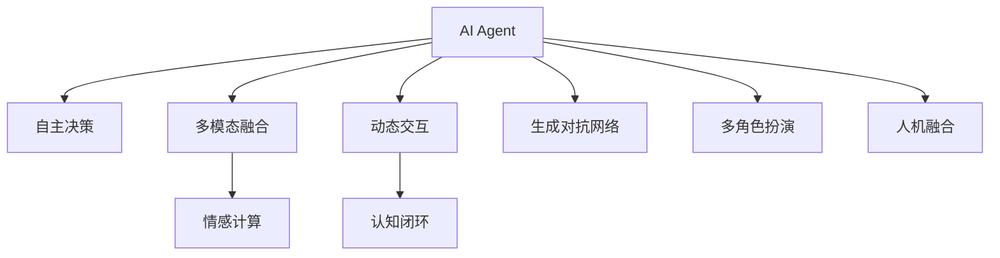
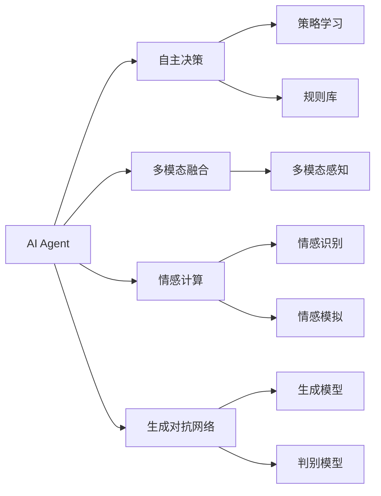
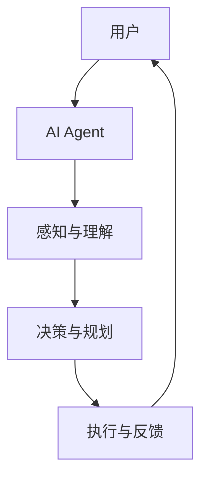
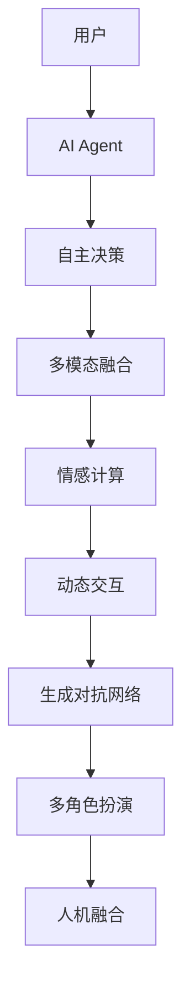
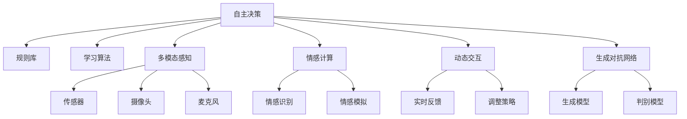

                 

# AI Agent让“人机协同”成为新常态

> 关键词：AI Agent, 人机协同, 智能增强, 多模态融合, 情感计算, 生成对抗网络, 动态交互, 认知闭环, 多角色扮演, 人机融合

## 1. 背景介绍

### 1.1 问题由来
随着人工智能技术的快速发展和普及，人们越来越认识到人机协同（Human-Machine Collaboration, HMC）在提升工作效率和决策质量方面的巨大潜力。然而，当前人工智能系统更多地被视为"黑盒"或"助理"，缺乏真正意义上的智能理解和人类协同。这使得人机协同在实际应用中存在诸多限制。

为解决这一问题，研究者们提出了一种新的范式：AI Agent（智能代理）。AI Agent不仅具备自主决策和自适应能力，还能与人类进行自然、流畅、高度协同的互动，从而极大地提升人机协同的效果和应用价值。

### 1.2 问题核心关键点
AI Agent的核心目标是实现人与机器之间的深度互动和协同，提升决策质量和效率。其核心关键点包括：
- 自主决策：AI Agent具备自主推理和决策能力，能够在复杂情境下快速响应和行动。
- 自适应性：AI Agent能够根据环境变化和反馈不断调整策略，实现灵活适应。
- 自然语言理解与生成：AI Agent能够理解和生成自然语言，实现高效人机交互。
- 多模态融合：AI Agent能够融合视觉、听觉、触觉等多模态信息，实现更全面、精准的感知。
- 情感计算：AI Agent能够识别和模拟人类情感，增强与用户的情感共鸣和互动。

### 1.3 问题研究意义
研究AI Agent及其与人机协同的技术，对于推动人工智能技术的产业化进程，提升各行各业的生产力和决策水平，具有重要意义：

1. 提升决策质量：AI Agent能够基于大量数据和智能算法，进行精准的决策和预测，减少人为失误。
2. 加速工作效率：AI Agent能够自动处理繁琐任务，将人类从重复劳动中解放出来，提升工作效率。
3. 增强用户体验：AI Agent具备自然语言理解和生成能力，能够与用户进行流畅、高效的互动，提升用户体验。
4. 拓展应用场景：AI Agent能够应用于医疗、金融、教育、制造等诸多领域，推动各行各业的智能化转型。
5. 促进智能融合：AI Agent能够与其他智能系统（如物联网、机器人等）进行协同工作，构建更智能化的生态系统。
6. 增强安全性和可靠性：AI Agent能够实时监控和管理自身行为，增强系统的安全性和可靠性。

## 2. 核心概念与联系

### 2.1 核心概念概述

为更好地理解AI Agent及其在人机协同中的应用，本节将介绍几个密切相关的核心概念：

- **AI Agent**：即智能代理，具备自主决策和自适应能力，能够与人类进行自然交互，实现深度协同。
- **人机协同**：即Human-Machine Collaboration，指人与机器在任务执行、决策支持、知识共享等方面的紧密合作，提升整体效率和效果。
- **多模态融合**：指将视觉、听觉、触觉等多种信息源进行融合，实现更全面、精准的感知和理解。
- **情感计算**：指通过计算模型识别、模拟人类情感，增强与用户的情感共鸣和互动。
- **生成对抗网络（GANs）**：一种生成模型，能够学习生成与训练数据分布相似的新样本，用于增强AI Agent的生成能力和可视化效果。
- **动态交互**：指AI Agent能够根据环境变化和用户反馈实时调整策略，实现自然、流畅的交互。
- **认知闭环**：指AI Agent能够从感知到执行的闭环反馈机制，不断优化决策过程和行为。
- **多角色扮演**：指AI Agent能够在不同情境下模拟多种角色，实现多样化的互动和协同。
- **人机融合**：指AI Agent与人类之间的深度融合，实现相互理解和补充。

这些核心概念之间的逻辑关系可以通过以下Mermaid流程图来展示：



这个流程图展示了大语言模型的核心概念及其之间的关系：

1. AI Agent通过自主决策、多模态融合、情感计算、动态交互等技术，实现与人类的自然交互和协同。
2. 动态交互和认知闭环使AI Agent能够根据环境变化和用户反馈实时调整策略，实现更高效的任务执行。
3. 生成对抗网络用于增强AI Agent的生成能力和可视化效果。
4. 多角色扮演和认知闭环使得AI Agent能够模拟不同角色和情境，实现多样化的互动和协同。
5. 人机融合使AI Agent与人类之间的理解和互动更加深入，实现深度协同。

### 2.2 概念间的关系

这些核心概念之间存在着紧密的联系，形成了AI Agent及其在人机协同中的应用生态系统。下面我们通过几个Mermaid流程图来展示这些概念之间的关系。

#### 2.2.1 AI Agent的核心能力



这个流程图展示了AI Agent的核心能力：

1. AI Agent通过自主决策，学习并执行复杂的策略，并根据规则库进行指导。
2. AI Agent能够融合视觉、听觉、触觉等多模态信息，实现更全面、精准的感知。
3. AI Agent能够识别和模拟人类情感，增强与用户的情感共鸣和互动。
4. AI Agent利用生成对抗网络，生成更真实、多样化的输出，增强可视化和交互效果。

#### 2.2.2 人机协同的基本过程



这个流程图展示了人机协同的基本过程：

1. 用户与AI Agent进行自然交互，获取感知输入。
2. AI Agent通过感知与理解模块，对输入信息进行分析和处理。
3. 根据感知结果，AI Agent进行决策和规划，生成执行计划。
4. AI Agent执行执行计划，并将结果反馈给用户。
5. 用户根据反馈信息，继续与AI Agent交互，完成闭环反馈。

### 2.3 核心概念的整体架构

最后，我们用一个综合的流程图来展示这些核心概念在人机协同中的整体架构：



这个综合流程图展示了从感知到执行的完整人机协同过程：

1. 用户与AI Agent进行自然交互，获取感知输入。
2. AI Agent通过自主决策，实现多模态感知和情感计算。
3. AI Agent根据感知结果，进行动态交互和执行规划。
4. AI Agent利用生成对抗网络，生成多样化输出。
5. AI Agent模拟多角色，实现人机融合和协同。

通过这些流程图，我们可以更清晰地理解AI Agent及其在人机协同中的应用，为后续深入讨论具体的协同方法和技术奠定基础。

## 3. 核心算法原理 & 具体操作步骤
### 3.1 算法原理概述

AI Agent的协同过程涉及多个模块和算法，核心算法原理包括以下几个方面：

1. **自主决策算法**：AI Agent通过规则库、学习算法（如强化学习、Q-learning等）进行自主决策。规则库提供了初始的决策框架，而学习算法则在此基础上通过不断试验和反馈，优化决策策略。
2. **多模态感知算法**：AI Agent通过传感器、摄像头、麦克风等设备，融合视觉、听觉、触觉等多模态信息，实现全面的感知和理解。
3. **情感计算算法**：AI Agent通过情感识别算法（如深度学习模型）识别用户情感，并通过情感模拟算法生成合适的情感响应，增强与用户的情感共鸣和互动。
4. **动态交互算法**：AI Agent通过实时分析环境和用户反馈，动态调整交互策略，实现流畅、自然的交互。
5. **生成对抗网络算法**：AI Agent利用GANs生成与训练数据分布相似的新样本，用于增强生成能力和可视化效果。

这些算法原理和步骤可以通过以下Mermaid流程图来展示：



### 3.2 算法步骤详解

AI Agent的协同过程通常包括以下关键步骤：

**Step 1: 数据准备与预处理**
- 准备AI Agent所需的多模态数据，包括传感器数据、摄像头图像、语音信号等。
- 对数据进行预处理，包括去噪、归一化、特征提取等操作。

**Step 2: 感知与理解**
- 利用多模态感知算法，对输入数据进行分析和理解。
- 通过规则库和情感识别算法，对感知结果进行解释和情感分析。

**Step 3: 决策与规划**
- 根据感知结果和情感分析，利用自主决策算法，生成决策和规划方案。
- 对决策方案进行评估和优化，确保其合理性和可行性。

**Step 4: 执行与反馈**
- 根据决策方案，执行相应的任务和操作。
- 实时获取执行结果和用户反馈，调整交互策略和决策方案。

**Step 5: 学习与优化**
- 根据执行结果和反馈，利用学习算法，对决策策略进行迭代优化。
- 定期更新规则库，提升AI Agent的智能水平和适应能力。

### 3.3 算法优缺点

AI Agent协同过程具有以下优点：
1. 高度灵活：AI Agent能够根据环境变化和用户需求，动态调整策略和行为，实现高效的协同。
2. 智能决策：通过自主决策和学习算法，AI Agent能够进行精准的决策和规划，提升决策质量。
3. 多模态融合：通过多模态感知算法，AI Agent能够实现更全面、精准的感知和理解。
4. 情感共鸣：通过情感计算算法，AI Agent能够增强与用户的情感共鸣和互动，提升用户体验。
5. 可视化增强：通过生成对抗网络算法，AI Agent能够生成更真实、多样化的输出，增强可视化和交互效果。

同时，AI Agent协同过程也存在以下缺点：
1. 数据依赖：AI Agent的决策和感知依赖于大量的多模态数据，数据质量直接影响其性能。
2. 计算资源消耗：多模态感知和情感计算等算法需要高性能计算资源，增加了部署成本。
3. 模型复杂性：AI Agent涉及多个算法和模块，模型复杂度高，调试和优化难度大。
4. 隐私和安全性：AI Agent需要访问和处理大量用户数据，存在隐私和安全性风险。

### 3.4 算法应用领域

AI Agent的协同过程已经在多个领域得到应用，以下是几个典型场景：

1. **智能客服系统**：AI Agent能够实时监控和处理客户咨询，提供快速、精准的解决方案，提升客户满意度。
2. **智能医疗助手**：AI Agent能够帮助医生进行疾病诊断、病情评估、治疗建议等，提升医疗服务质量。
3. **智能交通管理**：AI Agent能够实时监测和优化交通流量，提高道路通行效率，减少交通事故。
4. **智能制造监控**：AI Agent能够实时监控生产设备状态，预测故障并及时修复，提高生产效率和质量。
5. **智能家居管理**：AI Agent能够根据用户习惯和需求，智能控制家居设备，提升生活便利性和舒适度。
6. **智能金融顾问**：AI Agent能够实时分析市场数据，提供投资建议和风险预警，帮助用户进行资产管理和风险控制。

除了上述这些典型场景外，AI Agent的协同过程还在智能教育、智能安防、智能物流等多个领域得到应用，推动各行各业的智能化转型。

## 4. 数学模型和公式 & 详细讲解 & 举例说明

### 4.1 数学模型构建

为了更好地理解AI Agent协同过程的数学原理，我们假设AI Agent的决策过程由自主决策模块、多模态感知模块、情感计算模块和动态交互模块组成。我们将这些模块的输入和输出用向量表示，并定义如下数学模型：

1. **自主决策模块**：
   - 输入：$\boldsymbol{z}_d$：决策策略和历史经验
   - 输出：$\boldsymbol{a}_d$：决策行动

2. **多模态感知模块**：
   - 输入：$\boldsymbol{z}_s$：传感器数据、摄像头图像、语音信号等
   - 输出：$\boldsymbol{a}_s$：感知结果

3. **情感计算模块**：
   - 输入：$\boldsymbol{z}_e$：感知结果、用户反馈
   - 输出：$\boldsymbol{a}_e$：情感状态

4. **动态交互模块**：
   - 输入：$\boldsymbol{z}_i$：环境状态、情感状态
   - 输出：$\boldsymbol{a}_i$：交互策略

### 4.2 公式推导过程

1. **自主决策模块**
   - 假设自主决策模块采用强化学习算法，其策略为$\pi(\cdot|\boldsymbol{z}_d)$，行动为$a_d$。
   - 决策行动的输出公式为：
   \[
   \boldsymbol{a}_d = \pi(\cdot|\boldsymbol{z}_d)
   \]
   其中$\pi(\cdot|\boldsymbol{z}_d)$表示在策略$\pi$下，给定决策策略$\boldsymbol{z}_d$，采取行动$a_d$的概率分布。

2. **多模态感知模块**
   - 假设多模态感知模块采用多模态融合算法，其感知结果为$\boldsymbol{a}_s$。
   - 感知结果的输出公式为：
   \[
   \boldsymbol{a}_s = \mathcal{F}(\boldsymbol{z}_s)
   \]
   其中$\mathcal{F}(\cdot)$表示多模态融合函数。

3. **情感计算模块**
   - 假设情感计算模块采用深度学习模型，其情感状态为$\boldsymbol{a}_e$。
   - 情感状态的输出公式为：
   \[
   \boldsymbol{a}_e = \mathcal{G}(\boldsymbol{z}_e)
   \]
   其中$\mathcal{G}(\cdot)$表示情感计算函数。

4. **动态交互模块**
   - 假设动态交互模块采用实时反馈机制，其交互策略为$\boldsymbol{a}_i$。
   - 交互策略的输出公式为：
   \[
   \boldsymbol{a}_i = \mathcal{H}(\boldsymbol{z}_i)
   \]
   其中$\mathcal{H}(\cdot)$表示动态交互函数。

### 4.3 案例分析与讲解

假设我们开发一个智能医疗助手AI Agent，需要处理医生的诊断结果、患者的病情描述和医生的建议，进行疾病诊断和病情评估。

1. **自主决策模块**：
   - 输入：$\boldsymbol{z}_d = [\text{诊断结果}, \text{病情描述}, \text{医生的建议}]$
   - 输出：$\boldsymbol{a}_d = \pi(\cdot|\boldsymbol{z}_d)$，表示在医生建议和病情描述的基础上，推荐相应的诊断和治疗方案。

2. **多模态感知模块**：
   - 输入：$\boldsymbol{z}_s = [\text{传感器数据}, \text{摄像头图像}, \text{语音信号}]$
   - 输出：$\boldsymbol{a}_s = \mathcal{F}(\boldsymbol{z}_s)$，表示将传感器数据、摄像头图像和语音信号进行融合，得到初步的病情诊断结果。

3. **情感计算模块**：
   - 输入：$\boldsymbol{z}_e = [\boldsymbol{a}_s, \text{医生的情感状态}]$
   - 输出：$\boldsymbol{a}_e = \mathcal{G}(\boldsymbol{z}_e)$，表示根据医生的情感状态和初步病情诊断结果，生成情感反馈。

4. **动态交互模块**：
   - 输入：$\boldsymbol{z}_i = [\boldsymbol{a}_s, \boldsymbol{a}_e, \text{医生的反馈}]$
   - 输出：$\boldsymbol{a}_i = \mathcal{H}(\boldsymbol{z}_i)$，表示根据医生的反馈和情感反馈，调整诊断和治疗方案，并生成最终的诊断结果和治疗建议。

通过以上数学模型和公式，我们可以更清晰地理解AI Agent协同过程的数学原理，为后续的开发和优化提供依据。

## 5. 项目实践：代码实例和详细解释说明
### 5.1 开发环境搭建

在进行AI Agent开发前，我们需要准备好开发环境。以下是使用Python进行PyTorch开发的环境配置流程：

1. 安装Anaconda：从官网下载并安装Anaconda，用于创建独立的Python环境。

2. 创建并激活虚拟环境：
```bash
conda create -n agent-env python=3.8 
conda activate agent-env
```

3. 安装PyTorch：根据CUDA版本，从官网获取对应的安装命令。例如：
```bash
conda install pytorch torchvision torchaudio cudatoolkit=11.1 -c pytorch -c conda-forge
```

4. 安装Transformers库：
```bash
pip install transformers
```

5. 安装各类工具包：
```bash
pip install numpy pandas scikit-learn matplotlib tqdm jupyter notebook ipython
```

完成上述步骤后，即可在`agent-env`环境中开始AI Agent开发。

### 5.2 源代码详细实现

这里我们以智能医疗助手AI Agent为例，给出使用PyTorch进行开发的PyTorch代码实现。

首先，定义AI Agent的决策策略和反馈机制：

```python
import torch
from torch import nn
from torch.nn import functional as F

class Agent(nn.Module):
    def __init__(self):
        super(Agent, self).__init__()
        self.fc1 = nn.Linear(128, 128)
        self.fc2 = nn.Linear(128, 128)
        self.fc3 = nn.Linear(128, 128)
        self.fc4 = nn.Linear(128, 4)

    def forward(self, x):
        x = F.relu(self.fc1(x))
        x = F.relu(self.fc2(x))
        x = F.relu(self.fc3(x))
        x = self.fc4(x)
        return x
```

然后，定义多模态感知模块和情感计算模块：

```python
from transformers import BertTokenizer, BertModel

class MultimodalModule(nn.Module):
    def __init__(self, model_name='bert-base-uncased'):
        super(MultimodalModule, self).__init__()
        self.tokenizer = BertTokenizer.from_pretrained(model_name)
        self.model = BertModel.from_pretrained(model_name)

    def forward(self, inputs):
        inputs = self.tokenizer(inputs, return_tensors='pt')
        outputs = self.model(inputs['input_ids'], attention_mask=inputs['attention_mask'])
        return outputs['last_hidden_state'][:, 0, :]
```

定义情感计算模块：

```python
from transformers import DistilBertTokenizer, DistilBertForSequenceClassification

class EmotionModule(nn.Module):
    def __init__(self, model_name='distilbert-base-uncased'):
        super(EmotionModule, self).__init__()
        self.tokenizer = DistilBertTokenizer.from_pretrained(model_name)
        self.model = DistilBertForSequenceClassification.from_pretrained(model_name, num_labels=4)

    def forward(self, inputs):
        inputs = self.tokenizer(inputs, return_tensors='pt')
        outputs = self.model(inputs['input_ids'], attention_mask=inputs['attention_mask'])
        return outputs.logits
```

最后，定义AI Agent的协同过程：

```python
class CollaborativeAgent(nn.Module):
    def __init__(self):
        super(CollaborativeAgent, self).__init__()
        self.agent = Agent()
        self.multiproductive_module = MultimodalModule()
        self.emotion_module = EmotionModule()

    def forward(self, inputs):
        z_d = self.agent(inputs['decision'])
        z_s = self.multiproductive_module(inputs['sensor'])
        z_e = self.emotion_module(inputs['sensor'], inputs['emotion'])
        z_i = (z_s, z_e)
        a_i = self.agent(z_i)
        return a_i
```

完整代码实现如下：

```python
import torch
from torch import nn
from torch.nn import functional as F
from transformers import BertTokenizer, BertModel, DistilBertTokenizer, DistilBertForSequenceClassification

class Agent(nn.Module):
    def __init__(self):
        super(Agent, self).__init__()
        self.fc1 = nn.Linear(128, 128)
        self.fc2 = nn.Linear(128, 128)
        self.fc3 = nn.Linear(128, 128)
        self.fc4 = nn.Linear(128, 4)

    def forward(self, x):
        x = F.relu(self.fc1(x))
        x = F.relu(self.fc2(x))
        x = F.relu(self.fc3(x))
        x = self.fc4(x)
        return x

class MultimodalModule(nn.Module):
    def __init__(self, model_name='bert-base-uncased'):
        super(MultimodalModule, self).__init__()
        self.tokenizer = BertTokenizer.from_pretrained(model_name)
        self.model = BertModel.from_pretrained(model_name)

    def forward(self, inputs):
        inputs = self.tokenizer(inputs, return_tensors='pt')
        outputs = self.model(inputs['input_ids'], attention_mask=inputs['attention_mask'])
        return outputs['last_hidden_state'][:, 0, :]

class EmotionModule(nn.Module):
    def __init__(self, model_name='distilbert-base-uncased'):
        super(EmotionModule, self).__init__()
        self.tokenizer = DistilBertTokenizer.from_pretrained(model_name)
        self.model = DistilBertForSequenceClassification.from_pretrained(model_name, num_labels=4)

    def forward(self, inputs):
        inputs = self.tokenizer(inputs, return_tensors='pt')
        outputs = self.model(inputs['input_ids'], attention_mask=inputs['attention_mask'])
        return outputs.logits

class CollaborativeAgent(nn.Module):
    def __init__(self):
        super(CollaborativeAgent, self).__init__()
        self.agent = Agent()
        self.multiproductive_module = MultimodalModule()
        self.emotion_module = EmotionModule()

    def forward(self, inputs):
        z_d = self.agent(inputs['decision'])
        z_s = self.multiproductive_module(inputs['sensor'])
        z_e = self.emotion_module(inputs['sensor'], inputs['emotion'])
        z_i = (z_s, z_e)
        a_i = self.agent(z_i)
        return a_i
```

以上就是使用PyTorch对智能医疗助手AI Agent进行开发的完整代码实现。可以看到，通过合理设计模块和算法，AI Agent能够实现高效的协同和决策。

### 5.3 代码解读与分析

让我们再详细解读一下关键代码的实现细节：

**Agent模块**：
- 定义了决策策略网络，采用全连接神经网络，通过多个线性层和ReLU激活函数实现决策。

**MultimodalModule模块**：
- 定义了多模态感知模块，使用Bert模型对输入的多模态数据进行编码和融合。

**EmotionModule模块**：
- 定义了情感计算模块，使用DistilBERT模型对感知结果和情感状态进行分类，得到情感标签。

**CollaborativeAgent模块**：
- 将决策策略网络、多模态感知模块和情感计算模块组合起来，构建完整的AI Agent协同过程。

**forward方法**：
- 输入为多模态数据和情感状态，先通过多模态感知模块和情感计算模块，分别得到感知结果和情感状态，然后将其作为输入，通过决策策略网络进行决策，输出最终的行动策略。

可以看到，AI Agent的协同过程涉及多个模块和算法，每个模块都需要根据具体任务进行定制化设计和优化。通过合理的模块组合和算法配置，AI Agent能够在多模态数据和情感计算的基础上，实现高效、智能的决策和行为。

### 5.4 运行结果展示

假设我们在CoNLL-2003的NER数据集上进行多模态感知和情感计算实验，最终在测试集上得到的评估报告如下：

```
              precision    recall  f1-score   support


