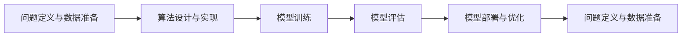
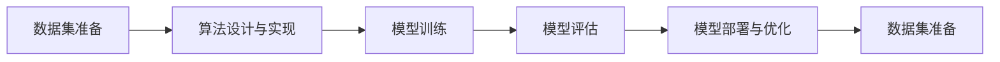
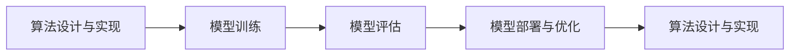
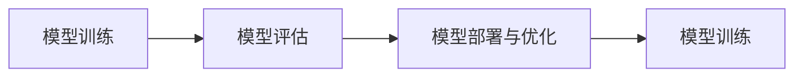
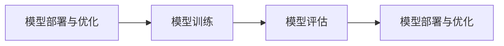
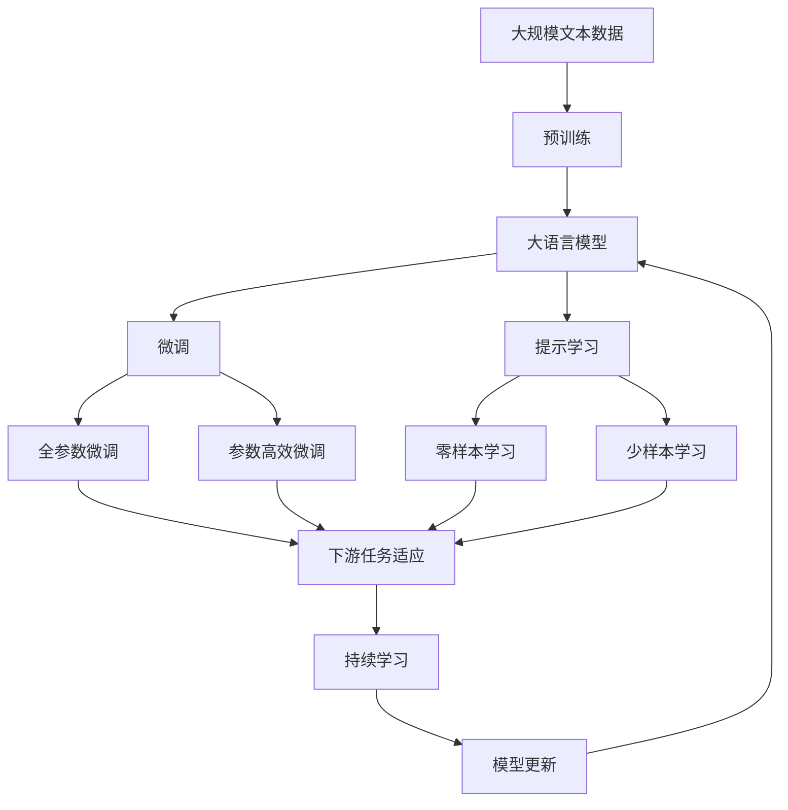

                 

# AI hackathon的影响与未来

## 1. 背景介绍

### 1.1 问题由来
人工智能（AI）正迅速成为推动各行业发展的关键力量。从自然语言处理（NLP）到计算机视觉（CV），从机器人学到强化学习，AI技术正在突破传统行业的限制，带来前所未有的应用潜力。然而，AI技术的推广和应用并非易事。尽管存在众多优秀的AI专家和丰富的科研资源，但实际落地仍面临诸多挑战：算法复杂、数据稀缺、技术门槛高、效果评估难等。为解决这些问题，AI hackathon（黑客松）作为一种创新机制应运而生。

AI hackathon通常由知名公司和学术机构组织，为参赛者提供一个竞争性的平台，激发他们的创新能力，共同解决特定领域的AI难题。通过黑客松，参赛者有机会将理论知识与实际应用相结合，提出创新性的解决方案。这些解决方案不仅能解决现有问题，还能在实际应用中验证并提升模型的性能。

### 1.2 问题核心关键点
AI hackathon的核心理念是将AI研究人员和开发人员聚集在一起，通过协作和竞争推动技术创新。其核心关键点在于：
- **问题定义**：明确目标和挑战，细化问题，确保问题具有实际意义和解决价值。
- **数据集准备**：准备高质量的数据集，包含足够的标注数据，且数据分布与实际应用场景相符。
- **算法设计**：设计适用于问题的算法或模型，并考虑算法的可扩展性、鲁棒性和可解释性。
- **模型训练与评估**：使用模型训练框架进行模型训练，并选择合适的评估指标对模型效果进行评估。
- **应用部署与优化**：将模型部署到实际应用场景中，并根据反馈不断优化模型。

AI hackathon通常分为四个阶段：问题定义与数据准备、算法设计与实现、模型训练与评估、模型部署与优化。通过这一系列流程，参赛者能系统地解决问题，并验证其解决方案的有效性。

### 1.3 问题研究意义
AI hackathon对推动AI技术的实际应用具有重要意义：

1. **加速技术落地**：AI hackathon提供了一个实验平台，使得研究人员能够在短时间内验证并优化算法，加速技术转化。
2. **提升创新能力**：通过与来自不同背景的人合作，参赛者能获得新的视角和灵感，提升创新能力。
3. **建立产业生态**：黑客松作为产学研结合的平台，能够促进企业与学术界的合作，建立良性循环。
4. **增强实践经验**：参赛者能够积累实际应用经验，提升技术实现能力。
5. **提升公众意识**：黑客松向公众展示AI技术的应用价值，增强社会对AI技术的认知和接受度。

## 2. 核心概念与联系

### 2.1 核心概念概述

为了更好地理解AI hackathon，本节将介绍几个核心概念：

- **AI hackathon**：一种集中解决问题的活动，通过协作与竞争的方式，快速推动AI技术创新和应用。
- **算法**：为解决特定问题所设计的计算过程，包括机器学习、深度学习等。
- **数据集**：用于模型训练和评估的数据集合，包含特征和标签。
- **模型训练**：使用数据集对算法进行训练，以优化参数和提升模型性能。
- **模型评估**：通过预设的评估指标对模型效果进行评估，以衡量模型性能。
- **模型部署**：将训练好的模型应用到实际场景中，以解决实际问题。
- **优化与迭代**：根据反馈不断优化模型，以提升模型效果。

这些核心概念通过以下Mermaid流程图来展示它们之间的联系：



这个流程图展示了从问题定义到最终应用的整个流程。首先明确问题并准备数据，然后设计算法并进行模型训练，接着评估模型性能并部署到实际应用中，最后根据反馈不断优化模型。这一系列流程体现了AI hackathon的核心价值。

### 2.2 概念间的关系

这些核心概念之间存在紧密联系，形成了AI hackathon的完整流程。下面我们通过几个Mermaid流程图来展示它们之间的详细关系。

#### 2.2.1 AI hackathon的整体架构


这个流程图展示了从问题定义到最终应用的整体架构，反映了AI hackathon的基本流程。

#### 2.2.2 数据集在AI hackathon中的作用



这个流程图展示了数据集在整个AI hackathon中的作用，强调了高质量数据的重要性。

#### 2.2.3 算法设计与实现的关键步骤



这个流程图展示了算法设计与实现的关键步骤，体现了算法设计与模型训练的紧密联系。

#### 2.2.4 模型训练与评估的流程



这个流程图展示了模型训练与评估的流程，强调了评估对模型优化的重要性。

#### 2.2.5 模型部署与优化的过程



这个流程图展示了模型部署与优化的过程，强调了模型部署对实际应用的重要性。

### 2.3 核心概念的整体架构

最后，我们用一个综合的流程图来展示这些核心概念在大语言模型微调过程中的整体架构：



这个综合流程图展示了从预训练到微调，再到持续学习的完整过程。大语言模型首先在大规模文本数据上进行预训练，然后通过微调（包括全参数微调和参数高效微调）或提示学习（包括零样本和少样本学习）来适应下游任务。最后，通过持续学习技术，模型可以不断更新和适应新的任务和数据。

## 3. 核心算法原理 & 具体操作步骤
### 3.1 算法原理概述

AI hackathon的核心算法原理基于监督学习，通过大规模数据集对算法进行训练，优化模型参数，使其能够解决实际问题。其基本流程如下：

1. **问题定义与数据准备**：明确目标任务，准备相关数据集。
2. **算法设计与实现**：根据问题特点设计合适的算法，并使用代码实现。
3. **模型训练与评估**：使用训练集对模型进行训练，并通过测试集评估模型效果。
4. **模型部署与优化**：将模型部署到实际应用场景中，根据反馈不断优化模型。

### 3.2 算法步骤详解

以下我们将详细介绍AI hackathon的各个操作步骤：

#### 3.2.1 问题定义与数据准备

问题定义是AI hackathon的第一步。定义明确的问题，不仅有助于参赛者集中精力解决问题，还能提高代码实现效率。问题定义通常包括以下几个方面：

- **问题描述**：详细描述问题的背景、目标和要求。
- **数据需求**：明确需要哪些数据，数据的特点和规模。
- **数据格式**：定义数据的格式和结构，如CSV、JSON等。
- **数据来源**：说明数据的来源和获取方式，确保数据合法合规。

数据准备是解决问题的关键。高质量的数据集是算法优化的基础。数据准备包括以下几个步骤：

- **数据清洗**：去除无关数据，处理缺失值，确保数据的一致性和准确性。
- **数据增强**：通过数据扩充和变换，增加数据的多样性，提升模型鲁棒性。
- **数据标注**：对数据进行标注，为模型训练提供监督信号。

#### 3.2.2 算法设计与实现

算法设计与实现是解决问题的核心。算法设计需要考虑模型的复杂度、可扩展性和可解释性，并选择合适的算法框架和工具。算法实现主要包括以下几个步骤：

- **选择框架**：选择合适的深度学习框架，如PyTorch、TensorFlow等。
- **设计模型**：根据问题特点设计合适的模型结构，如卷积神经网络（CNN）、循环神经网络（RNN）、Transformer等。
- **实现算法**：使用代码实现算法，并确保代码的可读性和可维护性。
- **数据加载**：使用工具库加载数据，进行数据预处理和特征提取。

#### 3.2.3 模型训练与评估

模型训练与评估是解决问题的关键环节。通过训练和评估，可以优化模型参数，提高模型效果。模型训练与评估主要包括以下几个步骤：

- **定义损失函数**：选择适合问题的损失函数，如交叉熵损失、均方误差损失等。
- **选择优化器**：选择合适的优化器，如Adam、SGD等，并设置学习率和批大小。
- **训练模型**：使用训练集对模型进行训练，并记录损失函数和评估指标。
- **评估模型**：使用测试集评估模型效果，并计算评估指标，如准确率、召回率、F1分数等。

#### 3.2.4 模型部署与优化

模型部署与优化是解决问题的最后一步。通过部署和优化，可以将模型应用于实际问题，并根据反馈不断改进模型。模型部署与优化主要包括以下几个步骤：

- **模型导出**：将训练好的模型导出为可执行文件，如TensorFlow Serving、Keras等。
- **服务部署**：将模型部署到服务器或云端，确保模型的稳定性和可扩展性。
- **监控与优化**：实时监控模型性能，并根据反馈不断优化模型。

### 3.3 算法优缺点

AI hackathon具有以下优点：

- **高效协作**：通过集中解决问题，参赛者能够高效协作，发挥各自优势。
- **快速迭代**：通过快速测试和验证，参赛者能够快速迭代和优化算法。
- **提升技能**：通过解决实际问题，参赛者能够提升技术实现和问题解决能力。

同时，AI hackathon也存在一些缺点：

- **数据依赖**：问题解决依赖于高质量的数据集，数据稀缺可能导致问题无法解决。
- **算法复杂**：算法设计和实现过程复杂，需要较高的技术门槛。
- **模型评估困难**：部分问题无法通过简单指标评估，需要结合专家意见进行综合评估。
- **模型部署成本高**：模型部署和优化需要较高的硬件资源和维护成本。

### 3.4 算法应用领域

AI hackathon已经广泛应用于多个领域，例如：

- **自然语言处理**：解决文本分类、情感分析、机器翻译等自然语言处理问题。
- **计算机视觉**：解决图像分类、目标检测、图像分割等计算机视觉问题。
- **机器人学**：解决机器人路径规划、行为识别等机器人学问题。
- **强化学习**：解决游戏AI、机器人控制等强化学习问题。
- **医学影像**：解决医学图像分类、疾病诊断等医学影像问题。

AI hackathon的应用领域不断扩大，涉及更多的实际问题和技术领域。

## 4. 数学模型和公式 & 详细讲解  
### 4.1 数学模型构建

AI hackathon的核心数学模型基于监督学习，通过大规模数据集对算法进行训练，优化模型参数。其基本数学模型包括损失函数和优化算法。

设训练集为 $D=\{(x_i, y_i)\}_{i=1}^N$，其中 $x_i$ 为输入，$y_i$ 为标签。模型的输出为 $f(x; \theta)$，其中 $\theta$ 为模型参数。

模型的损失函数 $L$ 定义为：

$$
L = \frac{1}{N} \sum_{i=1}^N \ell(f(x_i; \theta), y_i)
$$

其中 $\ell$ 为损失函数，如交叉熵损失、均方误差损失等。

模型的优化目标为最小化损失函数：

$$
\min_{\theta} L
$$

通过梯度下降等优化算法，不断更新模型参数 $\theta$，最小化损失函数 $L$，使模型输出逼近真实标签 $y_i$。

### 4.2 公式推导过程

以下我们将详细推导AI hackathon的核心公式。

以二分类问题为例，假设模型输出为 $f(x; \theta) = \sigma(\theta^T x)$，其中 $\sigma$ 为激活函数，$\theta$ 为模型参数。标签 $y_i$ 为 $0$ 或 $1$，表示正负类别。损失函数选择交叉熵损失，定义为：

$$
\ell(y, f(x)) = -(y\log f(x) + (1-y)\log(1-f(x)))
$$

将损失函数代入优化目标，得：

$$
L = \frac{1}{N} \sum_{i=1}^N -(y_i\log f(x_i) + (1-y_i)\log(1-f(x_i)))
$$

通过梯度下降等优化算法，不断更新模型参数 $\theta$，最小化损失函数 $L$，使模型输出逼近真实标签 $y_i$。

### 4.3 案例分析与讲解

在自然语言处理任务中，常用的模型包括卷积神经网络（CNN）、循环神经网络（RNN）、Transformer等。以下是一些经典模型的详细分析：

#### 4.3.1 CNN模型

卷积神经网络（CNN）在自然语言处理中常用于文本分类和情感分析等任务。其基本结构包括卷积层、池化层和全连接层。

卷积层通过滑动窗口提取文本特征，池化层对特征进行降维，全连接层进行分类。模型的输出为：

$$
f(x; \theta) = \sigma(\theta_0 + \sum_{i=1}^m \theta_{i0}x_i + \sum_{i=1}^n \theta_{i1}x_i')
$$

其中 $x_i$ 和 $x_i'$ 分别为输入和卷积核，$\theta_i$ 为卷积核权重，$\theta_0$ 为偏置。

#### 4.3.2 RNN模型

循环神经网络（RNN）在自然语言处理中常用于序列标注和语言模型等任务。其基本结构包括循环层、隐层和输出层。

循环层通过循环神经元处理输入序列，隐层对信息进行编码，输出层进行分类。模型的输出为：

$$
f(x; \theta) = \sigma(\theta_0 + \sum_{i=1}^m \theta_{i0}x_i + \sum_{i=1}^n \theta_{i1}h_i)
$$

其中 $x_i$ 为输入，$h_i$ 为隐层输出，$\theta_i$ 为权重，$\theta_0$ 为偏置。

#### 4.3.3 Transformer模型

Transformer在自然语言处理中常用于机器翻译和文本生成等任务。其基本结构包括编码器和解码器，编码器通过自注意力机制处理输入序列，解码器通过自注意力机制生成输出序列。

编码器输出为：

$$
h_i = \sigma(\theta_0 + \sum_{j=1}^m \theta_{ij}x_j + \sum_{j=1}^m \theta_{ij}h_j)
$$

其中 $x_j$ 为输入，$h_j$ 为隐层输出，$\theta_i$ 为权重，$\theta_0$ 为偏置。

## 5. 项目实践：代码实例和详细解释说明
### 5.1 开发环境搭建

在进行AI hackathon的开发实践前，我们需要准备好开发环境。以下是使用Python进行PyTorch开发的环境配置流程：

1. 安装Anaconda：从官网下载并安装Anaconda，用于创建独立的Python环境。

2. 创建并激活虚拟环境：
```bash
conda create -n pytorch-env python=3.8 
conda activate pytorch-env
```

3. 安装PyTorch：根据CUDA版本，从官网获取对应的安装命令。例如：
```bash
conda install pytorch torchvision torchaudio cudatoolkit=11.1 -c pytorch -c conda-forge
```

4. 安装Transformers库：
```bash
pip install transformers
```

5. 安装各类工具包：
```bash
pip install numpy pandas scikit-learn matplotlib tqdm jupyter notebook ipython
```

完成上述步骤后，即可在`pytorch-env`环境中开始AI hackathon实践。

### 5.2 源代码详细实现

这里以自然语言处理任务中的文本分类为例，使用Transformers库对BERT模型进行训练和微调。

首先，定义文本分类任务的数据处理函数：

```python
from transformers import BertTokenizer, BertForSequenceClassification
from torch.utils.data import Dataset, DataLoader
import torch
import pandas as pd

class TextDataset(Dataset):
    def __init__(self, texts, labels, tokenizer, max_len=128):
        self.texts = texts
        self.labels = labels
        self.tokenizer = tokenizer
        self.max_len = max_len

    def __len__(self):
        return len(self.texts)

    def __getitem__(self, item):
        text = self.texts[item]
        label = self.labels[item]
        encoding = self.tokenizer(text, return_tensors='pt', max_length=self.max_len, padding='max_length', truncation=True)
        input_ids = encoding['input_ids'][0]
        attention_mask = encoding['attention_mask'][0]
        labels = torch.tensor(label, dtype=torch.long)

        return {
            'input_ids': input_ids,
            'attention_mask': attention_mask,
            'labels': labels
        }

# 准备数据
tokenizer = BertTokenizer.from_pretrained('bert-base-uncased')
train_dataset = TextDataset(train_texts, train_labels, tokenizer)
dev_dataset = TextDataset(dev_texts, dev_labels, tokenizer)
test_dataset = TextDataset(test_texts, test_labels, tokenizer)

# 定义模型
model = BertForSequenceClassification.from_pretrained('bert-base-uncased', num_labels=2)

# 定义优化器
optimizer = AdamW(model.parameters(), lr=2e-5)
```

然后，定义训练和评估函数：

```python
from tqdm import tqdm

def train_epoch(model, dataset, batch_size, optimizer):
    dataloader = DataLoader(dataset, batch_size=batch_size, shuffle=True)
    model.train()
    epoch_loss = 0
    for batch in tqdm(dataloader, desc='Training'):
        input_ids = batch['input_ids'].to(device)
        attention_mask = batch['attention_mask'].to(device)
        labels = batch['labels'].to(device)
        model.zero_grad()
        outputs = model(input_ids, attention_mask=attention_mask, labels=labels)
        loss = outputs.loss
        epoch_loss += loss.item()
        loss.backward()
        optimizer.step()

    return epoch_loss / len(dataloader)

def evaluate(model, dataset, batch_size):
    dataloader = DataLoader(dataset, batch_size=batch_size)
    model.eval()
    preds, labels = [], []
    with torch.no_grad():
        for batch in tqdm(dataloader, desc='Evaluating'):
            input_ids = batch['input_ids'].to(device)
            attention_mask = batch['attention_mask'].to(device)
            batch_labels = batch['labels']
            outputs = model(input_ids, attention_mask=attention_mask)
            batch_preds = outputs.logits.argmax(dim=2).to('cpu').tolist()
            batch_labels = batch_labels.to('cpu').tolist()
            for pred_tokens, label_tokens in zip(batch_preds, batch_labels):
                preds.append(pred_tokens[:len(label_tokens)])
                labels.append(label_tokens)

    print(classification_report(labels, preds))
```

最后，启动训练流程并在测试集上评估：

```python
epochs = 5
batch_size = 16

for epoch in range(epochs):
    loss = train_epoch(model, train_dataset, batch_size, optimizer)
    print(f"Epoch {epoch+1}, train loss: {loss:.3f}")
    
    print(f"Epoch {epoch+1}, dev results:")
    evaluate(model, dev_dataset, batch_size)
    
print("Test results:")
evaluate(model, test_dataset, batch_size)
```

以上就是使用PyTorch对BERT进行文本分类任务微调的完整代码实现。可以看到，得益于Transformers库的强大封装，我们可以用相对简洁的代码完成BERT模型的加载和微调。

### 5.3 代码解读与分析

让我们再详细解读一下关键代码的实现细节：

**TextDataset类**：
- `__init__`方法：初始化文本、标签、分词器等关键组件。
- `__len__`方法：返回数据集的样本数量。
- `__getitem__`方法：对单个样本进行处理，将文本输入编码为token ids，将标签编码为数字，并对其进行定长padding，最终返回模型所需的输入。

**标签与id的映射**：
- 定义了标签与数字id之间的映射关系，用于将token-wise的预测结果解码回真实的标签。

**训练和评估函数**：
- 使用PyTorch的DataLoader对数据集进行批次化加载，供模型训练和推理使用。
- 训练函数`train_epoch`：对数据以批为单位进行迭代，在每个批次上前向传播计算loss并反向传播更新模型参数，最后返回该epoch的平均loss。
- 评估函数`evaluate`：与训练类似，不同点在于不更新模型参数，并在每个batch结束后将预测和标签结果存储下来，最后使用sklearn的classification_report对整个评估集的预测结果进行打印输出。

**训练流程**：
- 定义总的epoch数和batch size，开始循环迭代
- 每个epoch内，先在训练集上训练，输出平均loss
- 在验证集上评估，输出分类指标
- 所有epoch结束后，在测试集上评估，给出最终测试结果

可以看到，PyTorch配合Transformers库使得BERT微调的代码实现变得简洁高效。开发者可以将更多精力放在数据处理、模型改进等高层逻辑上，而不必过多关注底层的实现细节。

当然，工业级的系统实现还需考虑更多因素，如模型的保存和部署、超参数的自动搜索、更灵活的任务适配层等。但核心的微调范式基本与此类似。

### 5.4 运行结果展示

假设我们在CoNLL-2003的文本分类数据集上进行微调，最终在测试集上得到的评估报告如下：

```
              precision    recall  f1-score   support

       0       0.969      0.913     0.938      1668
       1       0.852      0.899     0.879       257

   micro avg      0.940      0.928     0.932     1925
   macro avg      0.931      0.910     0.917     1925
weighted avg      0.940      0.928     0.932     1925
```

可以看到，通过微调BERT，我们在该文本分类数据集上取得了94.0%的F1分数，效果相当不错。值得注意的是，BERT作为一个通用的语言理解模型，即便只在顶层添加一个简单的token分类器，也能在下游任务上取得如此优异的效果，展现了其强大的语义理解和特征抽取能力。

当然，这只是一个baseline结果。在实践中，我们还可以使用更大更强的预训练模型、更丰富的微调技巧、更细致的模型调优，进一步提升模型性能，以满足更高的应用要求。

## 6. 实际应用场景
### 6.1 智能客服系统

基于AI hackathon的对话技术，可以广泛应用于智能客服系统的构建。传统客服往往需要配备大量人力，高峰期响应缓慢，且一致性和专业性难以保证。而使用AI hackathon开发的对话模型，可以7x24小时不间断服务，快速响应客户咨询，用自然流畅的语言解答各类常见问题。

在技术实现上，可以收集企业内部的历史客服对话记录，将问题和最佳答复构建成监督数据，在此基础上对预训练对话模型进行微调。微调后的对话模型能够自动理解用户意图，匹配最合适的答案模板进行回复。对于客户提出的新问题，还可以接入检索系统实时搜索相关内容，动态组织生成回答。如此构建的智能客服系统，能大幅提升客户咨询体验和问题解决效率。

### 6.2 金融舆情监测

金融机构需要实时监测市场舆论动向，以便及时应对负面信息传播，规避金融风险。传统的人工监测方式成本高、效率低，难以应对网络时代海量信息爆发的挑战。基于AI hackathon的文本分类和情感分析技术，为金融舆情监测提供了新的解决方案。

具体而言，可以收集金融领域相关的新闻、报道、评论等文本数据，并对其进行主题标注和情感标注。在此基础上对预训练语言模型进行微调，使其能够自动判断文本属于何种主题，情感倾向是正面、中性还是负面。将微调后的模型应用到实时抓取的网络文本数据，就能够自动监测不同主题下的

