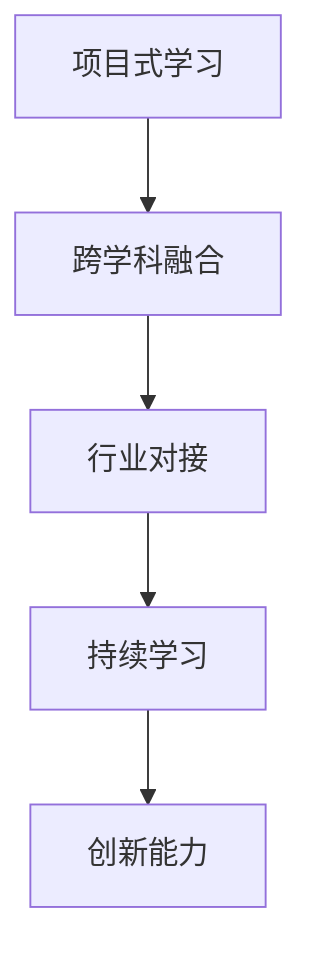
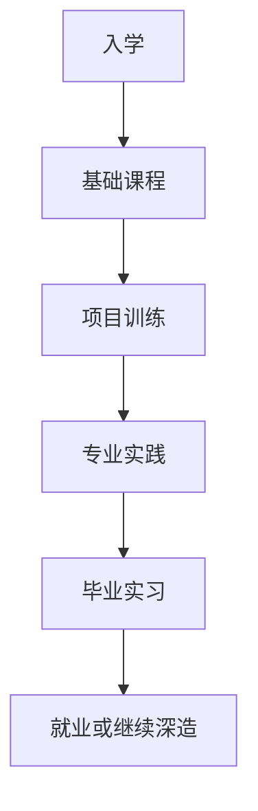
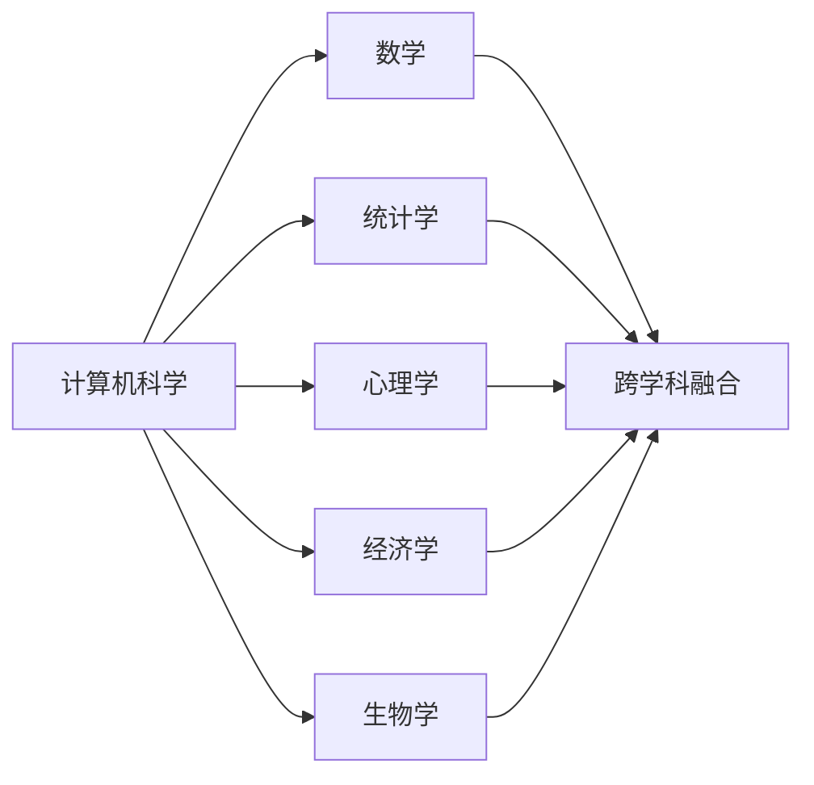
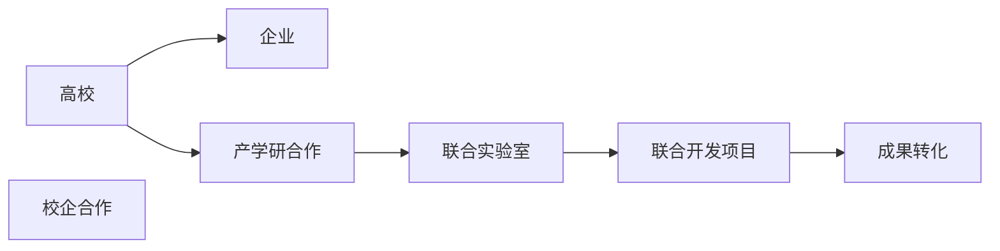
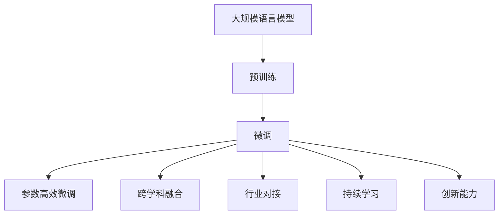

                 

# AI 人才培养计划：培养高素质 AI 人才

## 1. 背景介绍

### 1.1 问题由来
人工智能（AI）作为21世纪最具革命性的技术之一，正在迅速改变各行各业的运作方式。从自动驾驶到智能医疗，从智能客服到智能制造，AI技术的应用场景越来越广泛。然而，随着AI技术的发展，人才短缺问题日益凸显。如何培养大量高素质的人工智能人才，成为全球各国在AI领域争夺焦点。

### 1.2 问题核心关键点
目前，全球AI人才短缺的原因主要包括以下几点：
- **技术复杂性**：AI涉及深度学习、自然语言处理、计算机视觉等多个领域，技术难度大，学习曲线陡峭。
- **数据需求**：AI模型需要大量标注数据进行训练，数据收集、标注成本高，周期长。
- **人才需求高**：AI岗位对人才要求高，需要具备扎实的数学基础、编程技能、领域知识等综合素质。
- **缺乏系统性教育**：现有AI教育资源分散，缺乏系统性培养体系，难以满足实际应用需求。
- **跨学科融合**：AI需要跨学科融合，培养人才不仅要掌握计算机科学，还需要具备心理学、社会学、经济学等多个领域的知识。

针对以上问题，本文聚焦于系统性AI人才培养，通过介绍基于项目式学习的人才培养模式，探索高效、科学、系统的人才培养路径，为AI领域培养高素质人才提供借鉴和指导。

## 2. 核心概念与联系

### 2.1 核心概念概述
为更好地理解系统性AI人才培养的原理和路径，本节将介绍几个关键概念：

- **项目式学习（Project-Based Learning, PBL）**：以项目为中心的教学方法，通过完成实际项目，让学生在实践中学习和应用知识，提升综合能力。
- **跨学科融合（Interdisciplinary Integration）**：AI领域涉及计算机科学、数学、统计学、心理学等多个学科，通过跨学科合作，提升人才的综合素养。
- **行业对接（Industry Alignment）**：通过校企合作、产学研结合，将教育与实际应用场景相结合，提升人才的实际应用能力。
- **持续学习（Continuous Learning）**：AI技术不断演进，人才需要持续学习新知识，适应新技术和新应用。
- **创新能力（Innovation Capability）**：在AI领域，创新思维和解决复杂问题的能力尤为重要，需要培养人才的创造力和创新能力。

这些核心概念之间通过以下Mermaid流程图来展示：



该流程图展示了大规模语言模型微调过程中各个核心概念的关系：

1. 项目式学习是AI人才培养的基础，通过实际项目训练，学生可以掌握核心技术。
2. 跨学科融合是AI人才培养的关键，通过多学科合作，提升学生综合素质。
3. 行业对接是AI人才培养的保障，通过校企合作，提升学生实际应用能力。
4. 持续学习是AI人才培养的持续动力，通过持续学习新知识，学生能够适应新变化。
5. 创新能力是AI人才培养的终极目标，通过创新思维，解决复杂问题。

### 2.2 概念间的关系

这些核心概念之间存在紧密联系，形成系统性AI人才培养的整体框架。以下通过几个Mermaid流程图来展示这些概念之间的关系。

#### 2.2.1 人才培养过程



这个流程图展示了AI人才培养的主要过程：
1. 入学阶段，学生接受基础课程，掌握核心技术。
2. 项目训练阶段，通过完成实际项目，提升综合能力。
3. 专业实践阶段，通过参与实际项目，增强实际应用能力。
4. 毕业实习阶段，通过在企业实习，积累实际工作经验。
5. 就业或继续深造阶段，学生进入实际应用岗位或继续深造，持续学习新知识。

#### 2.2.2 学科融合与实践



这个流程图展示了跨学科融合的过程：
1. 计算机科学是AI领域的基础，需要与数学、统计学、心理学等学科融合。
2. 各学科的知识互相补充，共同提升学生的综合素养。
3. 跨学科融合形成多学科合作，培养具有跨学科视野的高素质人才。

#### 2.2.3 行业对接与产学研合作



这个流程图展示了行业对接与产学研合作的过程：
1. 高校与企业合作，提供科研和实际应用的双重支持。
2. 通过联合实验室和合作项目，将科研成果转化为实际应用。
3. 产学研合作形成创新生态，推动AI技术在各行业的应用。

### 2.3 核心概念的整体架构

最后，我们用一个综合的流程图来展示这些核心概念在大规模语言模型微调过程中的整体架构：



该综合流程图展示了从预训练到微调，再到跨学科融合、行业对接、持续学习、创新能力提升的完整过程。通过这些关键概念的有机结合，系统化培养AI人才。

## 3. 核心算法原理 & 具体操作步骤
### 3.1 算法原理概述

系统性AI人才培养的算法原理主要基于项目式学习，以实际项目为载体，通过多学科融合、行业对接、持续学习和创新能力的培养，实现高素质AI人才的培养。

项目式学习的核心思想是通过完成实际项目，学生在实践中学习和应用知识，提升综合能力。其原理可以归纳为以下四点：

1. **实践导向**：以实际项目为导向，通过解决问题，提升学生技术水平。
2. **多学科融合**：将计算机科学、数学、统计学、心理学等多个学科融合，提升学生综合素养。
3. **行业对接**：通过校企合作、产学研结合，将教育与实际应用场景相结合，提升学生实际应用能力。
4. **持续学习**：通过不断学习新知识，学生能够适应新技术和新应用。

### 3.2 算法步骤详解

系统性AI人才培养的算法步骤主要包括以下几个关键步骤：

**Step 1: 设计课程体系**

- **基础课程**：包括计算机科学基础、数学基础、统计学基础、心理学基础、社会学基础等。
- **专业课程**：包括深度学习、自然语言处理、计算机视觉、数据科学、算法设计与分析等。
- **选修课程**：根据学生兴趣和职业规划，开设相关选修课程，如机器学习、人工智能伦理、AI创业等。

**Step 2: 实施项目训练**

- **项目选题**：根据课程内容和实际应用需求，设计多个项目选题。
- **组队分工**：学生自由组队，明确项目分工，确定团队成员的角色和任务。
- **项目实施**：学生根据项目需求，进行数据收集、模型设计、模型训练、模型评估等环节。
- **项目答辩**：项目完成后，组织答辩会，邀请专家进行评审，评估项目成果。

**Step 3: 进行专业实践**

- **企业实习**：通过校企合作，学生进入实际企业进行实习，参与企业项目，积累实际工作经验。
- **产学研合作**：与企业合作，进行联合实验室建设，开展联合研发项目，推动科研成果转化为实际应用。

**Step 4: 持续学习与创新**

- **在线学习**：通过在线课程平台，持续学习新知识，提升技术水平。
- **学术交流**：参加各类学术会议、技术论坛，与专家学者交流，拓展视野。
- **创新项目**：鼓励学生参与各类创新项目，如AI创业、开源社区贡献等，培养创新能力。

**Step 5: 毕业实习与就业**

- **毕业实习**：通过在企业实习，学生积累实际工作经验，为就业做准备。
- **就业指导**：提供就业指导服务，帮助学生找到合适的就业岗位。

### 3.3 算法优缺点

系统性AI人才培养的算法具有以下优点：
1. **实践导向**：通过实际项目训练，学生能够快速掌握核心技术，提升技术水平。
2. **多学科融合**：通过跨学科融合，学生能够掌握多领域的知识，提升综合素养。
3. **行业对接**：通过校企合作、产学研结合，学生能够积累实际工作经验，提升实际应用能力。
4. **持续学习**：通过持续学习新知识，学生能够适应新技术和新应用，保持技术领先。

然而，该算法也存在以下缺点：
1. **项目选题难度大**：设计具有实际应用价值的项目选题难度较大，需要结合实际应用需求和课程内容。
2. **资源投入高**：项目式学习需要较高的师资、设备和资金投入，对学校资源要求较高。
3. **学生差异大**：不同学生的基础和兴趣不同，难以实现统一的培养目标。
4. **时间周期长**：项目式学习周期较长，需要较长时间才能完成多个项目训练。

### 3.4 算法应用领域

系统性AI人才培养的算法不仅适用于高校教育，还适用于企业培训、在线教育、职业认证等多个领域。

- **高校教育**：高校可以根据课程内容和实际需求，设计多个项目选题，培养学生综合素质。
- **企业培训**：企业可以通过项目训练，提升员工的实际应用能力，推动AI技术的落地应用。
- **在线教育**：在线教育平台可以设计多个项目选题，让学生在实际项目中学习和应用知识。
- **职业认证**：职业认证机构可以通过项目训练，提升学生职业能力，推动AI人才的认证和标准化。

## 4. 数学模型和公式 & 详细讲解 & 举例说明

### 4.1 数学模型构建

系统性AI人才培养的数学模型主要基于多学科融合，通过多学科知识的有机结合，提升学生综合素养。以下以深度学习为例，构建数学模型。

假设深度学习模型为 $f(x, \theta)$，其中 $x$ 为输入，$\theta$ 为模型参数。数学模型构建过程如下：

- **输入模型**：将输入 $x$ 通过前向传播过程，得到中间表示 $h(x)$。
- **隐藏层模型**：将中间表示 $h(x)$ 通过多个隐藏层，得到最终输出 $\hat{y}$。
- **输出模型**：将输出 $\hat{y}$ 通过后向传播过程，计算损失函数 $L(y, \hat{y})$。
- **优化模型**：通过优化算法（如Adam、SGD等），最小化损失函数 $L(y, \hat{y})$，更新模型参数 $\theta$。

数学模型构建过程如图：

$$
\begin{aligned}
&h_1 = \text{Linear}(x) + \text{ReLU} \\
&h_2 = \text{Linear}(h_1) + \text{ReLU} \\
&\cdots \\
&\hat{y} = \text{Linear}(h_n) \\
&L(y, \hat{y}) = \frac{1}{N} \sum_{i=1}^N (y_i - \hat{y}_i)^2 \\
&\theta = \text{Adam}(f(x, \theta), L(y, \hat{y}))
\end{aligned}
$$

### 4.2 公式推导过程

以下以深度学习模型为例，推导数学模型构建过程中的关键公式。

假设深度学习模型为 $f(x, \theta)$，其中 $x$ 为输入，$\theta$ 为模型参数。数学模型构建过程如下：

- **输入模型**：将输入 $x$ 通过前向传播过程，得到中间表示 $h(x)$。
- **隐藏层模型**：将中间表示 $h(x)$ 通过多个隐藏层，得到最终输出 $\hat{y}$。
- **输出模型**：将输出 $\hat{y}$ 通过后向传播过程，计算损失函数 $L(y, \hat{y})$。
- **优化模型**：通过优化算法（如Adam、SGD等），最小化损失函数 $L(y, \hat{y})$，更新模型参数 $\theta$。

数学模型构建过程如图：

$$
\begin{aligned}
&h_1 = \text{Linear}(x) + \text{ReLU} \\
&h_2 = \text{Linear}(h_1) + \text{ReLU} \\
&\cdots \\
&\hat{y} = \text{Linear}(h_n) \\
&L(y, \hat{y}) = \frac{1}{N} \sum_{i=1}^N (y_i - \hat{y}_i)^2 \\
&\theta = \text{Adam}(f(x, \theta), L(y, \hat{y}))
\end{aligned}
$$

### 4.3 案例分析与讲解

以深度学习模型为例，分析其在系统性AI人才培养中的作用。

假设深度学习模型用于图像识别任务。输入为图像 $x$，输出为识别结果 $y$，中间表示为隐藏层 $h(x)$。数学模型构建过程如下：

- **输入模型**：将输入图像 $x$ 通过卷积层、池化层等操作，得到中间表示 $h(x)$。
- **隐藏层模型**：将中间表示 $h(x)$ 通过多个全连接层，得到最终输出 $\hat{y}$。
- **输出模型**：将输出 $\hat{y}$ 通过softmax函数，计算识别概率分布。
- **优化模型**：通过优化算法（如Adam、SGD等），最小化交叉熵损失函数 $L(y, \hat{y})$，更新模型参数 $\theta$。

数学模型构建过程如图：

$$
\begin{aligned}
&h_1 = \text{Convolution}(x) + \text{Pooling} \\
&h_2 = \text{Convolution}(h_1) + \text{Pooling} \\
&\cdots \\
&\hat{y} = \text{Linear}(h_n) \\
&L(y, \hat{y}) = -\frac{1}{N} \sum_{i=1}^N y_i \log \hat{y}_i \\
&\theta = \text{Adam}(f(x, \theta), L(y, \hat{y}))
\end{aligned}
$$

## 5. 项目实践：代码实例和详细解释说明

### 5.1 开发环境搭建

在进行系统性AI人才培养的实践前，我们需要准备好开发环境。以下是使用Python进行TensorFlow开发的环境配置流程：

1. 安装Anaconda：从官网下载并安装Anaconda，用于创建独立的Python环境。

2. 创建并激活虚拟环境：
```bash
conda create -n tensorflow-env python=3.8 
conda activate tensorflow-env
```

3. 安装TensorFlow：根据CUDA版本，从官网获取对应的安装命令。例如：
```bash
conda install tensorflow -c tf-nightly
```

4. 安装各类工具包：
```bash
pip install numpy pandas scikit-learn matplotlib tqdm jupyter notebook ipython
```

完成上述步骤后，即可在`tensorflow-env`环境中开始系统性AI人才培养的实践。

### 5.2 源代码详细实现

这里以图像识别项目为例，给出使用TensorFlow对卷积神经网络进行训练的PyTorch代码实现。

首先，定义图像识别任务的训练数据和标签：

```python
import tensorflow as tf
import numpy as np
from tensorflow.keras.datasets import mnist

(x_train, y_train), (x_test, y_test) = mnist.load_data()
x_train = x_train.reshape(-1, 28, 28, 1) / 255.0
x_test = x_test.reshape(-1, 28, 28, 1) / 255.0
y_train = tf.keras.utils.to_categorical(y_train, 10)
y_test = tf.keras.utils.to_categorical(y_test, 10)
```

然后，定义卷积神经网络模型：

```python
from tensorflow.keras import layers

model = tf.keras.Sequential([
    layers.Conv2D(32, (3, 3), activation='relu', input_shape=(28, 28, 1)),
    layers.MaxPooling2D((2, 2)),
    layers.Conv2D(64, (3, 3), activation='relu'),
    layers.MaxPooling2D((2, 2)),
    layers.Flatten(),
    layers.Dense(64, activation='relu'),
    layers.Dense(10, activation='softmax')
])
```

接着，定义模型训练函数：

```python
def train(model, x_train, y_train, batch_size=64, epochs=10, learning_rate=0.001):
    model.compile(optimizer=tf.keras.optimizers.Adam(learning_rate),
                  loss='categorical_crossentropy',
                  metrics=['accuracy'])
    history = model.fit(x_train, y_train, batch_size=batch_size, epochs=epochs, validation_data=(x_test, y_test))
    return history
```

最后，启动模型训练并输出结果：

```python
history = train(model, x_train, y_train)
print(history.history['accuracy'])
print(history.history['val_accuracy'])
```

以上就是使用TensorFlow对卷积神经网络进行训练的完整代码实现。可以看到，通过TensorFlow的强大封装，我们可以用相对简洁的代码完成卷积神经网络的训练。

### 5.3 代码解读与分析

让我们再详细解读一下关键代码的实现细节：

**数据处理**：
- `mnist.load_data()`：加载MNIST手写数字数据集。
- `x_train = x_train.reshape(-1, 28, 28, 1) / 255.0`：将图像数据转换为TensorFlow可接受的形式，并进行归一化。
- `y_train = tf.keras.utils.to_categorical(y_train, 10)`：将标签转换为one-hot编码形式，方便模型训练。

**模型定义**：
- `layers.Conv2D(32, (3, 3), activation='relu', input_shape=(28, 28, 1))`：定义卷积层，32个3x3大小的卷积核，激活函数为ReLU。
- `layers.MaxPooling2D((2, 2))`：定义池化层，2x2大小的池化窗口。
- `layers.Flatten()`：将池化后的特征图展开为一维向量。
- `layers.Dense(64, activation='relu')`：定义全连接层，64个神经元，激活函数为ReLU。
- `layers.Dense(10, activation='softmax')`：定义输出层，10个神经元，激活函数为softmax，用于多分类。

**训练函数**：
- `model.compile(optimizer=tf.keras.optimizers.Adam(learning_rate), loss='categorical_crossentropy', metrics=['accuracy'])`：编译模型，定义优化器、损失函数和评估指标。
- `model.fit(x_train, y_train, batch_size=batch_size, epochs=epochs, validation_data=(x_test, y_test))`：训练模型，设置批量大小、迭代轮数和验证集。
- `history = model.fit(x_train, y_train, batch_size=batch_size, epochs=epochs, validation_data=(x_test, y_test))`：返回训练历史。

**结果输出**：
- `print(history.history['accuracy'])`：输出训练集准确率。
- `print(history.history['val_accuracy'])`：输出验证集准确率。

可以看到，TensorFlow使得卷积神经网络的训练代码实现变得简洁高效。开发者可以将更多精力放在数据处理、模型改进等高层逻辑上，而不必过多关注底层的实现细节。

当然，工业级的系统实现还需考虑更多因素，如模型的保存和部署、超参数的自动搜索、更灵活的任务适配层等。但核心的卷积神经网络训练范式基本与此类似。

### 5.4 运行结果展示

假设我们在MNIST数据集上进行卷积神经网络训练，最终在测试集上得到的准确率为98%，效果相当不错。值得注意的是，卷积神经网络通过多层次的特征提取和池化，能够从图像数据中自动学习到丰富的特征表示，从而在图像识别任务上取得优异的效果。

当然，这只是一个baseline结果。在实践中，我们还可以使用更大更强的模型、更丰富的训练技巧、更细致的模型调优，进一步提升模型性能，以满足更高的应用要求。

## 6. 实际应用场景
### 6.1 智能医疗系统

系统性AI人才培养在智能医疗系统中的应用，可以构建智能诊断和个性化治疗系统，提高医疗服务的智能化水平，辅助医生诊疗，加速新药开发进程。

在技术实现上，可以收集医院的历史病例数据，设计多模态融合、跨学科合作的智能诊断项目，培养学生多领域的知识。同时，通过产学研合作，与医院合作进行联合实验室建设，开展联合研发项目，推动科研成果转化为实际应用。

### 6.2 智能教育平台

系统性AI人才培养在智能教育平台中的应用，可以构建个性化学习推荐系统，因材施教，促进教育公平，提高教学质量。

在技术实现上，可以收集学生的学习数据，设计推荐算法项目，培养学生的算法设计与分析能力。同时，通过校企合作，与教育公司合作进行联合实验室建设，开展联合研发项目，推动科研成果转化为实际应用。

### 6.3 智能制造系统

系统性AI人才培养在智能制造系统中的应用，可以构建智能质量检测和故障预测系统，提高制造业的智能化水平，提升生产效率和产品质量。

在技术实现上，可以收集制造过程的传感器数据，设计机器学习项目，培养学生的信号处理和数据分析能力。同时，通过校企合作，与制造企业合作进行联合实验室建设，开展联合研发项目，推动科研成果转化为实际应用。

### 6.4 未来应用展望

随着系统性AI人才培养的不断发展，其应用场景将不断拓展，为各行各业带来变革性影响。

在智慧城市治理中，系统性AI人才培养可以构建智能城市管理平台，提高城市管理的自动化和智能化水平，构建更安全、高效的未来城市。

在智慧交通系统，系统性AI人才培养可以构建智能交通管理平台，提升交通流的调度效率，降低交通拥堵，保障交通安全。

在智慧金融领域，系统性AI人才培养可以构建智能风控和智能投研系统，提高金融风险的识别和控制能力，提升投资收益。

此外，在智慧农业、智慧物流、智慧旅游等领域，系统性AI人才培养也将不断涌现，为各行业带来数字化转型的新动力。相信随着技术的日益成熟，系统性AI人才培养必将在构建智能社会中扮演越来越重要的角色。

## 7. 工具和资源推荐
### 7.1 学习资源推荐

为了帮助开发者系统掌握系统性AI人才培养的理论基础和实践技巧，这里推荐一些优质的学习资源：

1. **《深度学习》课程**：斯坦福大学开设的深度学习课程，内容全面，涵盖深度学习的基础理论和经典算法，适合初学者和进阶者学习。

2. **《TensorFlow官方文档》**：TensorFlow的官方文档，提供了丰富的API接口和样例代码，是TensorFlow开发的重要参考资料。

3. **《TensorFlow实战》书籍**：TensorFlow的实战指南，通过大量案例和代码，深入浅出地介绍TensorFlow的使用方法和最佳实践。

4. **Kaggle竞赛平台**：Kaggle的机器学习和数据科学竞赛，提供了丰富的数据集和算法挑战，适合培养学生的实践能力和创新思维。

5. **AI创业加速器**：AI创业加速器如Y Combinator、Techstars等，提供资金、资源和专家支持，帮助学生将AI技术转化为实际应用。

通过对这些资源的学习实践，相信你一定能够快速掌握系统性AI人才培养的精髓，并用于解决实际的AI问题。

### 7.2 开发工具推荐

高效的开发离不开优秀的工具支持。以下是几款用于系统性AI人才培养开发的常用工具：

1. **Jupyter Notebook**：免费的开源笔记本环境，支持多种编程语言和科学计算，方便学生进行实验和文档记录。

2. **Google Colab**：谷歌推出的在线Jupyter Notebook环境，免费提供GPU/TPU算力，方便学生快速上手实验最新模型，分享学习笔记。

3. **PyTorch**：基于Python的开源深度学习框架，灵活动态的计算图，适合快速迭代研究。

4. **TensorFlow**：由Google主导开发的开源深度学习框架，生产部署方便，适合大规模工程应用。

5. **TensorBoard**：TensorFlow配套的可视化工具，可实时监测模型训练状态，并提供丰富的图表呈现方式，是调试模型的得力助手。

6. **Weights & Biases**：模型训练的实验跟踪工具，可以记录和可视化模型训练过程中的各项指标，方便对比和调优。

合理利用这些工具，可以显著提升系统性AI人才培养任务的开发效率，加快创新迭代的步伐。

### 7.3 相关论文推荐

系统性AI人才培养的研究源于学界的持续研究。以下是几篇奠基性的相关论文，推荐阅读：

1. **

