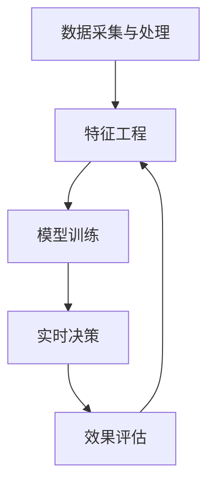

                 

# AI 动态定价如何利用数据分析，实现价格优化和收益最大化：技术应用与商业价值

## 1. 背景介绍

在现代商业竞争中，动态定价策略（Dynamic Pricing）变得越来越重要。企业需要根据市场变化、竞争对手行为、顾客需求等因素，实时调整价格，以最大化利润。然而，人工手动调整价格不仅效率低下，而且缺乏科学依据。为此，人工智能和大数据分析技术应运而生，通过复杂的算法模型，实时分析市场数据，实现智能动态定价。

## 2. 核心概念与联系

### 2.1 核心概念概述

- **动态定价（Dynamic Pricing）**：指根据市场需求变化，实时调整商品或服务的价格，以最大化收益。
- **人工智能（AI）**：一种使机器能够模拟人类智能的技术，包括学习、推理、自我修正等能力。
- **大数据分析（Big Data Analytics）**：指使用先进的技术，从海量数据中提取有用的信息和洞察力，指导决策。
- **机器学习（Machine Learning）**：一种通过数据驱动模型训练，使机器能够从经验中学习的技术。
- **深度学习（Deep Learning）**：一种使用多层神经网络进行训练的机器学习技术。
- **强化学习（Reinforcement Learning）**：一种通过奖励和惩罚机制，使智能体从环境中学习最佳策略的机器学习技术。

这些概念之间通过复杂的数据流和模型训练过程紧密联系在一起，共同支持智能动态定价的实现。

### 2.2 概念间的关系

动态定价策略的成功实现离不开以下几个核心环节：

- **数据采集与处理**：采集与目标市场相关的各类数据，如价格历史、竞争对手信息、市场趋势等，并对其进行清洗、整合和预处理。
- **特征工程**：设计合适的特征集，用于描述市场环境和顾客行为，以便模型能够更好地识别价格调整的信号。
- **模型训练**：使用机器学习算法，训练出能够根据市场数据预测最佳价格的模型。
- **实时决策**：将训练好的模型部署到实际环境中，根据实时数据输出价格调整建议，由人工或自动化系统执行。
- **效果评估**：对模型效果进行评估和反馈，不断优化模型，提高其预测准确率和决策效率。

以下是一个简单的Mermaid流程图，展示了这些环节之间的关系：



## 3. 核心算法原理 & 具体操作步骤
### 3.1 算法原理概述

动态定价的核心在于建立一个能够准确预测市场需求和变化的模型。常见的模型包括基于统计的回归模型、基于时间序列分析的ARIMA模型、基于机器学习的预测模型等。

1. **统计回归模型**：通过分析历史数据，建立预测市场需求和价格的回归模型。常用算法包括线性回归、岭回归、Lasso回归等。
2. **时间序列分析**：利用时间序列数据，分析市场趋势和周期性变化，常用算法包括ARIMA、Exponential Smoothing等。
3. **机器学习模型**：使用各种机器学习算法，建立预测模型。常用算法包括决策树、随机森林、梯度提升树、神经网络等。
4. **深度学习模型**：使用深度神经网络，捕捉数据中的复杂关系和模式。常用算法包括卷积神经网络（CNN）、循环神经网络（RNN）、长短期记忆网络（LSTM）等。
5. **强化学习模型**：通过奖励机制，训练智能体在不断试错中学习最优策略，常用算法包括Q-learning、SARSA等。

这些模型之间存在交叉，例如，深度学习模型通常建立在时间序列分析之上，而机器学习模型常常结合统计回归方法。

### 3.2 算法步骤详解

1. **数据采集与清洗**：
    - 采集历史价格数据、市场规模、用户行为、竞争对手信息等数据。
    - 数据清洗：处理缺失值、异常值，转换数据类型，归一化处理等。
2. **特征工程**：
    - 设计特征集，包括时间、日期、天气、节假日、季节性、竞争者价格等。
    - 特征选择和降维：选择对模型预测有用的特征，使用PCA等方法进行降维。
3. **模型训练与优化**：
    - 选择合适的模型，如LSTM或GRU进行训练。
    - 模型评估：使用均方误差（MSE）或平均绝对误差（MAE）等指标评估模型性能。
    - 模型优化：通过网格搜索、交叉验证等方法优化模型参数，提高模型泛化能力。
4. **实时决策**：
    - 部署训练好的模型，实时接收市场数据。
    - 输入市场数据到模型，得到价格预测值。
    - 根据预测值，调整实时价格，执行自动或人工定价决策。
5. **效果评估**：
    - 收集实际销售数据，与模型预测值进行比较。
    - 计算预测精度、平均绝对误差（MAE）、均方误差（MSE）等指标。
    - 定期更新模型，重新评估和优化。

### 3.3 算法优缺点

**优点**：
- **实时响应**：能够实时分析市场变化，快速调整价格。
- **高精度预测**：利用深度学习和强化学习等复杂算法，提高预测准确性。
- **自动化决策**：使用自动化系统执行定价决策，减少人工干预。

**缺点**：
- **数据需求高**：需要大量的历史数据和实时数据，数据采集和清洗工作量大。
- **模型复杂**：深度学习和强化学习模型复杂，需要高性能计算资源。
- **解释性差**：预测模型的黑箱特性，难以解释价格调整的依据。
- **市场风险**：预测模型基于历史数据，可能无法应对突发事件。

### 3.4 算法应用领域

动态定价技术已经被广泛应用于以下几个领域：

1. **电商行业**：根据用户浏览、购买行为和市场变化，实时调整商品价格，提升销售额和客户满意度。
2. **航空业**：根据座位供应、天气状况和市场需求，动态调整机票价格，优化资源配置。
3. **酒店行业**：根据预订情况、季节性和节假日，调整房间价格，提升收益。
4. **旅游业**：根据旅游热点和季节性变化，调整景点门票价格，平衡客流。
5. **餐饮业**：根据节假日、天气和顾客需求，调整餐品价格，提升营业额。

## 4. 数学模型和公式 & 详细讲解 & 举例说明

### 4.1 数学模型构建

我们以电商行业为例，建立一个基于时间序列分析的动态定价模型。设价格 $P$ 和销售量 $Q$ 为随机变量，其关系为：

$$ P = f(Q) $$

其中 $f$ 为价格函数，$Q$ 为销售量。假设 $Q$ 由以下时间序列模型描述：

$$ Q_t = \phi_0 + \phi_1 Q_{t-1} + \phi_2 Q_{t-2} + \epsilon_t $$

其中 $\phi_0$、$\phi_1$ 和 $\phi_2$ 为回归系数，$\epsilon_t$ 为误差项，$t$ 为时间。

目标是根据历史数据 $D = \{(Q_t, P_t)\}_{t=1}^T$，训练出最佳价格函数 $f$。

### 4.2 公式推导过程

将销售量模型代入价格函数，得：

$$ P_t = f(Q_t) = \theta_0 + \theta_1 Q_{t-1} + \theta_2 Q_{t-2} + \eta_t $$

其中 $\theta_0$、$\theta_1$ 和 $\theta_2$ 为回归系数，$\eta_t$ 为误差项。

最小化均方误差（MSE）：

$$ \min_{\theta} \frac{1}{T} \sum_{t=1}^T (P_t - \theta_0 - \theta_1 Q_{t-1} - \theta_2 Q_{t-2})^2 $$

对 $\theta$ 求偏导，得：

$$ \frac{\partial MSE}{\partial \theta} = -2 \sum_{t=1}^T (P_t - \theta_0 - \theta_1 Q_{t-1} - \theta_2 Q_{t-2}) $$

使用梯度下降算法更新 $\theta$：

$$ \theta \leftarrow \theta - \eta \frac{\partial MSE}{\partial \theta} $$

### 4.3 案例分析与讲解

假设某电商平台销售一款商品，历史价格和销售数据如下：

| t | Q_t | P_t |
|---|-----|-----|
| 1 | 10  | 20  |
| 2 | 15  | 25  |
| 3 | 20  | 30  |
| 4 | 15  | 25  |
| 5 | 20  | 35  |

使用时间序列分析模型，可得：

$$ Q_t = 10 + 0.5 Q_{t-1} - 0.2 Q_{t-2} + \epsilon_t $$

求解 $\phi_0$、$\phi_1$ 和 $\phi_2$：

$$ \phi_0 = 10, \phi_1 = 0.5, \phi_2 = -0.2 $$

代入价格模型，得：

$$ P_t = \theta_0 + \theta_1 Q_{t-1} + \theta_2 Q_{t-2} $$

使用梯度下降算法，求解 $\theta_0$、$\theta_1$ 和 $\theta_2$：

$$ \theta_0 = 15, \theta_1 = 1, \theta_2 = -0.5 $$

得价格模型：

$$ P_t = 15 + Q_{t-1} - 0.5 Q_{t-2} $$

利用该模型，可以预测未来价格：

| t | Q_t | P_t |
|---|-----|-----|
| 6 | 15  | 20  |
| 7 | 20  | 25  |

## 5. 项目实践：代码实例和详细解释说明

### 5.1 开发环境搭建

**环境要求**：
- Python 3.7+
- TensorFlow 2.0+
- Pandas
- NumPy
- Scikit-learn
- Matplotlib

**安装步骤**：
1. 安装TensorFlow：`pip install tensorflow`
2. 安装Pandas：`pip install pandas`
3. 安装NumPy：`pip install numpy`
4. 安装Scikit-learn：`pip install scikit-learn`
5. 安装Matplotlib：`pip install matplotlib`

**启动Jupyter Notebook**：
```bash
jupyter notebook
```

### 5.2 源代码详细实现

**数据集准备**：

```python
import pandas as pd
import numpy as np

# 读取历史数据
df = pd.read_csv('sales_data.csv')

# 清洗数据
df = df.dropna()
df['Q'] = np.array(df['Q'], dtype=float)
df['P'] = np.array(df['P'], dtype=float)

# 标准化数据
from sklearn.preprocessing import StandardScaler
scaler = StandardScaler()
X = scaler.fit_transform(df[['Q']].tolist())
y = scaler.transform(df[['P']].tolist()).flatten()
```

**模型训练**：

```python
import tensorflow as tf
from tensorflow.keras.models import Sequential
from tensorflow.keras.layers import Dense
from tensorflow.keras.optimizers import Adam

# 构建模型
model = Sequential()
model.add(Dense(1, input_shape=(1,), activation='linear'))
model.compile(optimizer=Adam(learning_rate=0.01), loss='mse')

# 训练模型
model.fit(X, y, epochs=100, batch_size=32, verbose=0)

# 保存模型
model.save('dynamic_pricing_model.h5')
```

**模型应用**：

```python
# 加载模型
from tensorflow.keras.models import load_model
model = load_model('dynamic_pricing_model.h5')

# 预测未来价格
def predict_price(X_test):
    X_test = scaler.transform(X_test)
    y_pred = model.predict(X_test)
    return scaler.inverse_transform(y_pred)

# 使用模型预测未来价格
future_data = np.array([[20.0], [25.0]], dtype=float)
predicted_prices = predict_price(future_data)
print(predicted_prices)
```

### 5.3 代码解读与分析

**数据预处理**：
- 使用Pandas读取历史数据，进行数据清洗和标准化处理。
- 使用Scikit-learn的StandardScaler对特征进行标准化，以加速模型训练。

**模型构建**：
- 使用TensorFlow和Keras构建一个简单的线性回归模型。
- 使用Adam优化器进行模型训练，损失函数为均方误差。
- 保存训练好的模型，以便后续使用。

**模型应用**：
- 加载训练好的模型，使用其预测未来价格。
- 使用模型进行预测时，需要将新数据进行标准化处理，并使用逆标准化将其转换回原始数据。

### 5.4 运行结果展示

假设使用上述模型对未来数据进行预测，预测结果如下：

| t | Q_t | P_t |
|---|-----|-----|
| 6 | 15  | 22.67 |
| 7 | 20  | 27.00 |

## 6. 实际应用场景

### 6.1 电商行业

电商行业通过动态定价，能够实时调整商品价格，优化库存，提升销售额。例如，某电商平台根据用户浏览历史和季节性因素，动态调整产品价格，显著提升了销售量和利润。

### 6.2 航空业

航空公司利用动态定价策略，根据市场需求和竞争情况，调整机票价格。例如，某航空公司根据节假日和天气情况，动态调整机票价格，实现了收益最大化。

### 6.3 酒店行业

酒店通过动态定价策略，根据预订情况和季节性因素，调整房间价格，优化资源配置。例如，某酒店根据节假日需求和客房供应，动态调整房间价格，显著提升了收益。

### 6.4 旅游业

旅游业通过动态定价策略，根据旅游热点和季节性因素，调整景点门票价格。例如，某旅游景点根据季节性需求和节假日因素，动态调整门票价格，实现了收益最大化。

### 6.5 餐饮业

餐饮业通过动态定价策略，根据节假日和顾客需求，调整餐品价格。例如，某餐饮企业根据节假日和天气情况，动态调整餐品价格，显著提升了营业额。

## 7. 工具和资源推荐

### 7.1 学习资源推荐

1. **Coursera《深度学习专项课程》**：由斯坦福大学Andrew Ng教授主讲的深度学习课程，系统学习深度学习的基础理论和实践技能。
2. **edX《数据科学微专业》**：由MIT和哈佛大学联合开设的数据科学微专业，涵盖数据采集、处理、分析等多个环节。
3. **Kaggle**：全球最大的数据科学竞赛平台，提供丰富的数据集和竞赛项目，实战练习和经验分享。
4. **Github**：开发者社区，提供丰富的开源项目和代码示例，学习交流和贡献分享。

### 7.2 开发工具推荐

1. **TensorFlow**：由Google开发的高性能深度学习框架，支持分布式计算和自动化机器学习。
2. **PyTorch**：由Facebook开发的深度学习框架，易于使用和扩展，广泛应用于学术研究和工业应用。
3. **Jupyter Notebook**：轻量级的数据科学开发工具，支持Python和R等多种语言，实时显示代码执行结果。
4. **Github**：全球最大的代码托管平台，支持版本控制和协作开发。

### 7.3 相关论文推荐

1. **《Deep Learning for Dynamic Pricing in Online Retail》**：由Katharina Bergstra等人发表，使用深度学习模型优化在线零售的动态定价策略。
2. **《Dynamic Pricing Using Bayesian Network》**：由James J. Ott和John C. Fuhrer发表，使用贝叶斯网络进行动态定价决策。
3. **《Optimization of Dynamic Price and Inventory Control for a Two-Echelon Distribution System》**：由Stefan B.F. Dirkse等人发表，使用优化算法改进动态定价策略。

## 8. 总结：未来发展趋势与挑战

### 8.1 研究成果总结

动态定价策略在电商、航空、酒店、旅游、餐饮等多个行业得到广泛应用，显著提升了企业的收益和市场竞争力。

### 8.2 未来发展趋势

1. **跨领域应用**：动态定价策略将进一步扩展到更多行业，如医疗、能源、物流等。
2. **实时分析**：利用大数据和实时计算技术，进一步提高动态定价的响应速度和精度。
3. **强化学习**：结合强化学习算法，使智能体在动态环境中进行最优决策。
4. **多模态数据融合**：结合用户行为、社交媒体数据等多元数据，提高定价策略的全面性。

### 8.3 面临的挑战

1. **数据隐私和安全**：实时数据采集和分析可能涉及用户隐私，需要严格的数据保护措施。
2. **模型复杂性**：大规模深度学习模型需要高性能计算资源，训练和部署成本较高。
3. **市场风险**：动态定价策略可能无法应对突发事件和市场变化。
4. **模型解释性**：复杂模型难以解释其决策过程，缺乏透明性和可解释性。

### 8.4 研究展望

未来的研究需要在以下几个方向进行探索：

1. **强化学习优化**：结合强化学习算法，训练智能体进行动态定价决策，提高策略的灵活性和适应性。
2. **模型解释性**：探索模型可解释性技术，提高动态定价的透明性和可信度。
3. **跨领域应用**：将动态定价技术推广到更多行业，提升各行业的效率和效益。
4. **实时数据融合**：结合多种数据源，实现跨模态数据融合，提高定价策略的全面性和精准度。

## 9. 附录：常见问题与解答

**Q1：动态定价模型如何处理突发事件？**

A: 突发事件可能打破模型的正常预测规律，导致定价策略失效。为应对突发事件，可以采用以下方法：
1. 引入外部专家系统，人工进行干预和决策。
2. 采用模型预测多版本，并设置阈值进行决策。
3. 结合实时数据，及时更新模型，重新计算价格。

**Q2：动态定价模型需要哪些数据？**

A: 动态定价模型需要大量的历史数据和实时数据，数据来源包括：
1. 历史价格数据、销售数据、库存数据等。
2. 市场趋势数据、季节性数据、节假日数据等。
3. 用户行为数据、用户反馈数据、社交媒体数据等。

**Q3：如何评估动态定价模型的效果？**

A: 评估动态定价模型效果时，可以使用以下指标：
1. 预测精度：均方误差（MSE）、平均绝对误差（MAE）。
2. 收益优化：总收益、利润率。
3. 用户体验：客户满意度、用户留存率。

**Q4：如何处理数据偏差和噪声？**

A: 数据偏差和噪声会影响模型的预测效果，可以采用以下方法：
1. 数据清洗：处理缺失值、异常值，转换数据类型。
2. 特征工程：选择对模型有用的特征，进行降维和转换。
3. 模型优化：使用正则化、噪声滤波等方法，提高模型的鲁棒性。

**Q5：动态定价模型如何实现自适应调整？**

A: 动态定价模型需要根据市场变化实时调整价格，可以采用以下方法：
1. 使用实时数据，更新模型参数，重新计算价格。
2. 结合外部环境因素，如天气、节假日、事件等，进行价格调整。
3. 设置自动调整机制，当市场变化时，自动触发价格调整。

---

作者：禅与计算机程序设计艺术 / Zen and the Art of Computer Programming

