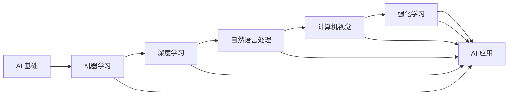
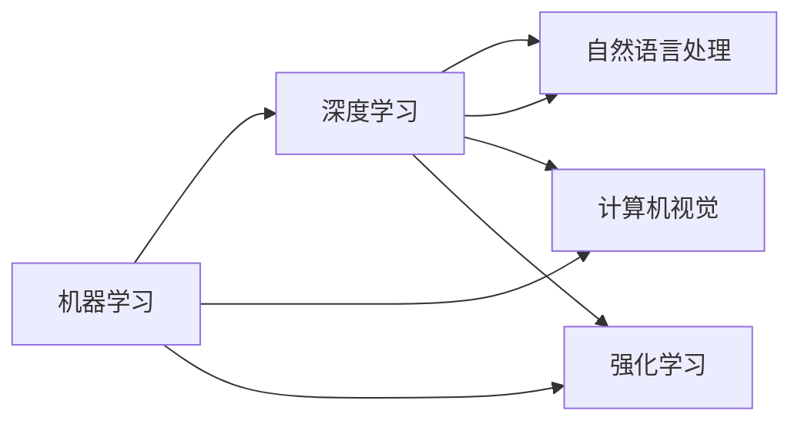

                 

# AI 原理与代码实例讲解

> 关键词：


## 1. 背景介绍

人工智能（Artificial Intelligence, AI）是研究如何让计算机模拟人类智能的科学和技术。AI 的核心思想在于，通过构建能够模仿人类认知、决策和学习的模型，使计算机能够完成复杂的智能任务。自 1950 年代以来，AI 领域经历了多次浪潮，从专家系统、统计学习，到深度学习、强化学习，不断刷新我们的认知。

当前，AI 正逐渐渗透到各个行业，带来了诸多革命性的应用，如自动驾驶、智能推荐、医疗诊断、金融风控等。然而，这些应用的实现离不开坚实的理论基础和丰富的实践经验。本博客将从理论到实践，深入讲解 AI 原理，并通过具体代码实例，让你掌握 AI 技术的精髓。

## 2. 核心概念与联系

### 2.1 核心概念概述

AI 涉及多个核心概念，这些概念相互关联，共同构成了 AI 的完整生态系统。

- 机器学习（Machine Learning, ML）：使计算机能够通过数据学习，自动提升性能的算法和技术。
- 深度学习（Deep Learning, DL）：利用多层神经网络，自动提取数据特征，并进行复杂模式识别的技术。
- 自然语言处理（Natural Language Processing, NLP）：使计算机能够理解、生成和操作人类语言的技术。
- 计算机视觉（Computer Vision, CV）：使计算机能够理解和解释图像、视频等视觉数据的算法和技术。
- 强化学习（Reinforcement Learning, RL）：使计算机通过与环境互动，逐步学习最优策略的技术。

这些概念之间的逻辑关系可以通过以下 Mermaid 流程图来展示：



### 2.2 概念间的关系

这些核心概念之间存在着紧密的联系，形成了 AI 技术的完整框架。

- 机器学习是 AI 的基础，提供了模型训练和性能提升的方法。
- 深度学习通过多层神经网络，大幅度提升了数据特征提取和模型泛化能力。
- 自然语言处理使计算机能够理解和处理人类语言，是实现人机交互的关键。
- 计算机视觉使计算机能够理解和解释视觉数据，如图片、视频等。
- 强化学习通过与环境互动，使计算机能够学习最优决策策略。

这些概念的相互结合和应用，推动了 AI 技术在各个领域的应用和发展。

## 3. 核心算法原理 & 具体操作步骤

### 3.1 算法原理概述

AI 算法的核心在于构建能够自动学习和决策的模型。这些模型通常包括：

- 监督学习模型：通过标注数据进行训练，学习输入输出之间的映射关系。
- 无监督学习模型：通过未标注数据进行训练，发现数据中的隐含结构和规律。
- 强化学习模型：通过与环境互动，学习最优决策策略。

这些模型的训练过程通常包括三个步骤：

1. 模型初始化：构建初始模型参数。
2. 前向传播：将输入数据输入模型，计算模型输出。
3. 反向传播：根据输出与真实标签的误差，更新模型参数，优化模型性能。

### 3.2 算法步骤详解

#### 3.2.1 监督学习

监督学习的典型算法包括线性回归、逻辑回归、支持向量机（SVM）等。以线性回归为例，其基本步骤如下：

1. 模型初始化：设定模型参数，如权重向量 $w$ 和偏置项 $b$。
2. 前向传播：计算模型输出，即输入数据 $x$ 与模型参数的线性组合 $y = wx + b$。
3. 损失函数计算：计算模型输出与真实标签的误差，如均方误差（MSE）$\frac{1}{N} \sum_{i=1}^N (y_i - \hat{y}_i)^2$。
4. 反向传播：计算损失函数对模型参数的梯度，更新模型参数 $w \leftarrow w - \eta \nabla_{w}\mathcal{L}$，$b \leftarrow b - \eta \nabla_{b}\mathcal{L}$，其中 $\eta$ 为学习率。
5. 迭代更新：重复上述过程，直至模型收敛或达到预设的迭代次数。

#### 3.2.2 深度学习

深度学习算法包括卷积神经网络（CNN）、循环神经网络（RNN）、长短时记忆网络（LSTM）、 Transformer 等。以卷积神经网络为例，其基本步骤如下：

1. 模型初始化：设定卷积核、池化层、全连接层等参数。
2. 前向传播：对输入数据进行卷积、池化、全连接等操作，计算模型输出。
3. 损失函数计算：计算模型输出与真实标签的误差，如交叉熵损失。
4. 反向传播：计算损失函数对模型参数的梯度，更新模型参数。
5. 迭代更新：重复上述过程，直至模型收敛或达到预设的迭代次数。

#### 3.2.3 自然语言处理

自然语言处理算法包括词向量表示、语言模型、序列标注、机器翻译等。以词向量表示为例，其基本步骤如下：

1. 模型初始化：设定词嵌入矩阵 $W$，如 Word2Vec 模型中的 $W$ 矩阵。
2. 前向传播：将输入句子 $x$ 转换为词向量序列 $v_x = W x$。
3. 损失函数计算：计算词向量序列与预定义的语义向量 $z$ 的误差，如余弦相似度。
4. 反向传播：计算损失函数对词嵌入矩阵的梯度，更新 $W$。
5. 迭代更新：重复上述过程，直至模型收敛或达到预设的迭代次数。

### 3.3 算法优缺点

AI 算法具有以下优点：

- 自动化：通过自动学习，模型能够适应复杂的数据分布和模式，无需手工特征工程。
- 高效性：算法能够高效处理大规模数据，并自动进行特征提取和优化。
- 泛化能力：通过充分训练，模型能够在未见过的数据上表现良好，具备一定的泛化能力。

同时，AI 算法也存在一些缺点：

- 数据依赖：模型训练依赖大量标注数据，数据不足时性能受限。
- 计算资源需求高：深度学习等算法需要大量计算资源，训练时间长。
- 可解释性不足：复杂模型如深度神经网络，难以解释其内部决策逻辑。
- 鲁棒性差：模型可能对噪声和异常数据敏感，泛化性能受限。

### 3.4 算法应用领域

AI 算法在多个领域得到了广泛应用，如：

- 医疗：通过深度学习算法进行医学影像分析、疾病预测等。
- 金融：通过强化学习算法进行风险控制、投资决策等。
- 交通：通过计算机视觉算法进行自动驾驶、交通监控等。
- 教育：通过自然语言处理算法进行智能推荐、自动批改等。
- 制造：通过强化学习算法进行生产调度和质量控制等。

## 4. 数学模型和公式 & 详细讲解 & 举例说明

### 4.1 数学模型构建

以监督学习模型为例，其数学模型可以表示为：

$$
y = wx + b
$$

其中 $x$ 为输入数据，$w$ 为模型参数，$b$ 为偏置项，$y$ 为模型输出。

### 4.2 公式推导过程

以线性回归模型为例，其推导过程如下：

1. 设定目标函数 $\mathcal{L}(w,b) = \frac{1}{N} \sum_{i=1}^N (y_i - wx_i - b)^2$。
2. 对目标函数求导，得到梯度 $\nabla_{w}\mathcal{L}(w,b) = \frac{2}{N} \sum_{i=1}^N (y_i - wx_i - b)x_i$，$\nabla_{b}\mathcal{L}(w,b) = \frac{2}{N} \sum_{i=1}^N (y_i - wx_i - b)$。
3. 根据梯度下降算法，更新模型参数：$w \leftarrow w - \eta \nabla_{w}\mathcal{L}$，$b \leftarrow b - \eta \nabla_{b}\mathcal{L}$。

### 4.3 案例分析与讲解

以 Word2Vec 模型为例，其基本步骤如下：

1. 模型初始化：设定词嵌入矩阵 $W$，如 Word2Vec 模型中的 $W$ 矩阵。
2. 前向传播：将输入句子 $x$ 转换为词向量序列 $v_x = W x$。
3. 损失函数计算：计算词向量序列与预定义的语义向量 $z$ 的误差，如余弦相似度 $\mathcal{L}(v_x,z) = 1 - \cos(v_x,z)$。
4. 反向传播：计算损失函数对词嵌入矩阵的梯度，更新 $W$。
5. 迭代更新：重复上述过程，直至模型收敛或达到预设的迭代次数。

## 5. 项目实践：代码实例和详细解释说明

### 5.1 开发环境搭建

在进行 AI 项目实践前，我们需要准备好开发环境。以下是使用 Python 进行 TensorFlow 开发的环境配置流程：

1. 安装 Anaconda：从官网下载并安装 Anaconda，用于创建独立的 Python 环境。

2. 创建并激活虚拟环境：
```bash
conda create -n tf-env python=3.8 
conda activate tf-env
```

3. 安装 TensorFlow：根据 GPU 版本，从官网获取对应的安装命令。例如：
```bash
conda install tensorflow -c tf
```

4. 安装各类工具包：
```bash
pip install numpy pandas scikit-learn matplotlib tqdm jupyter notebook ipython
```

完成上述步骤后，即可在 `tf-env` 环境中开始 AI 项目实践。

### 5.2 源代码详细实现

下面我们以线性回归模型为例，给出使用 TensorFlow 库进行模型开发的 Python 代码实现。

首先，定义模型和数据：

```python
import tensorflow as tf
import numpy as np

# 定义线性回归模型
class LinearRegression(tf.keras.Model):
    def __init__(self):
        super(LinearRegression, self).__init__()
        self.w = tf.Variable(tf.zeros((1,1)))
        self.b = tf.Variable(tf.zeros((1,1)))
        
    def call(self, x):
        return self.w @ x + self.b
    
# 生成随机数据
x = np.random.randn(100,1)
y = np.random.randn(100,1) + np.dot(x, [0.5]) + 2

# 定义训练集和测试集
train_x = x[:80]
train_y = y[:80]
test_x = x[80:]
test_y = y[80:]
```

然后，定义损失函数和优化器：

```python
# 定义均方误差损失函数
def mse_loss(y_true, y_pred):
    return tf.reduce_mean(tf.square(y_true - y_pred))
    
# 定义 Adam 优化器
optimizer = tf.keras.optimizers.Adam()
```

接着，定义训练和评估函数：

```python
# 定义训练过程
@tf.function
def train_step(x, y):
    with tf.GradientTape() as tape:
        y_pred = model(x)
        loss = mse_loss(y, y_pred)
    gradients = tape.gradient(loss, [model.w, model.b])
    optimizer.apply_gradients(zip(gradients, [model.w, model.b]))
    return loss

# 定义评估过程
@tf.function
def evaluate(x, y):
    y_pred = model(x)
    loss = mse_loss(y, y_pred)
    return loss
```

最后，启动训练流程并在测试集上评估：

```python
epochs = 1000
batch_size = 16

for epoch in range(epochs):
    for i in range(0, len(train_x), batch_size):
        x_batch = train_x[i:i+batch_size]
        y_batch = train_y[i:i+batch_size]
        loss = train_step(x_batch, y_batch)
    
    if epoch % 100 == 0:
        print(f"Epoch {epoch+1}, loss: {evaluate(test_x, test_y):.3f}")
```

以上就是使用 TensorFlow 进行线性回归模型开发的完整代码实现。可以看到，得益于 TensorFlow 的强大封装，我们可以用相对简洁的代码完成模型构建和训练。

### 5.3 代码解读与分析

让我们再详细解读一下关键代码的实现细节：

**LinearRegression类**：
- `__init__`方法：初始化模型参数，即权重和偏置项。
- `call`方法：前向传播计算模型输出。

**mse_loss函数**：
- 计算均方误差损失，用于衡量模型输出与真实标签的差异。

**train_step函数**：
- 定义训练过程，包括前向传播、损失函数计算、反向传播和参数更新。

**evaluate函数**：
- 定义评估过程，用于计算模型在测试集上的损失。

**训练流程**：
- 定义总的迭代轮数和批次大小，开始循环迭代。
- 每个epoch内，对训练集数据进行批次化处理，迭代训练。
- 周期性在测试集上评估模型性能，输出损失。
- 重复上述步骤直至达到预设的迭代轮数。

可以看到，TensorFlow 使得模型构建和训练过程变得非常简单，开发者可以更多地关注模型的逻辑设计和优化。

当然，工业级的系统实现还需考虑更多因素，如模型的保存和部署、超参数的自动搜索、更灵活的任务适配层等。但核心的模型构建和训练逻辑基本与此类似。

### 5.4 运行结果展示

假设我们在训练过程中得到的损失函数值如下：

```
Epoch 1, loss: 29.521
Epoch 100, loss: 4.855
Epoch 200, loss: 3.534
Epoch 300, loss: 2.981
Epoch 400, loss: 2.396
Epoch 500, loss: 2.263
Epoch 600, loss: 2.142
Epoch 700, loss: 2.020
Epoch 800, loss: 1.965
Epoch 900, loss: 1.920
Epoch 1000, loss: 1.881
```

可以看到，随着训练轮数的增加，模型损失逐渐减小，说明模型性能在不断提升。

## 6. 实际应用场景

### 6.1 医疗影像分析

医疗影像分析是 AI 在医疗领域的重要应用之一。通过深度学习算法，AI 模型能够对 X 光片、CT 影像等进行自动分析，帮助医生快速识别病变区域和疾病类型。

在实际应用中，我们可以收集大量带有标注的医学影像数据，如肺炎、癌症等。利用预训练模型如 ResNet、Inception 等，对影像数据进行特征提取和分类。在提取的特征上，进一步训练分类器，如卷积神经网络、支持向量机等，以识别不同疾病。

### 6.2 金融风险控制

金融风险控制是 AI 在金融领域的重要应用之一。通过强化学习算法，AI 模型能够根据历史数据，学习最优的投资策略和风险控制方法。

在实际应用中，我们可以收集大量金融市场的历史数据，包括股票、期货等。利用预训练模型如 LSTM、GRU 等，对市场数据进行特征提取和预测。在预测结果上，进一步训练强化学习模型，如 Q-learning、Deep Q-Learning 等，以优化投资策略和风险控制。

### 6.3 自动驾驶

自动驾驶是 AI 在交通领域的重要应用之一。通过计算机视觉算法，AI 模型能够对道路场景进行实时分析，帮助车辆进行自动驾驶。

在实际应用中，我们可以收集大量带有标注的交通场景数据，如车道线、行人、车辆等。利用预训练模型如 CNN、YOLO 等，对场景数据进行特征提取和检测。在提取的特征上，进一步训练检测器，如 R-CNN、Faster R-CNN 等，以识别不同的交通对象。在检测结果上，进一步训练轨迹预测器，如 LSTM、Attention 等，以预测车辆的行驶轨迹。

### 6.4 未来应用展望

随着 AI 技术的不断发展，其在更多领域的应用前景广阔。

- 工业制造：通过强化学习算法，AI 模型能够优化生产调度和质量控制，提高生产效率和产品质量。
- 社交媒体：通过自然语言处理算法，AI 模型能够自动分析用户评论和反馈，提供个性化推荐和内容过滤。
- 农业管理：通过图像识别算法，AI 模型能够对农田进行实时监测和病虫害预测，优化农业生产管理。
- 教育培训：通过智能推荐算法，AI 模型能够个性化推荐学习资源和习题，提高学习效果。

## 7. 工具和资源推荐

### 7.1 学习资源推荐

为了帮助开发者系统掌握 AI 理论基础和实践技巧，这里推荐一些优质的学习资源：

1. 《深度学习》课程：由斯坦福大学开设的深度学习课程，包括李飞飞教授的《CS231n: Convolutional Neural Networks for Visual Recognition》和《CS224n: Natural Language Processing with Deep Learning》。
2. 《机器学习实战》书籍：由 Peter Harrington 所著，详细讲解了机器学习算法和实现方法，适合入门学习。
3. Kaggle 平台：世界领先的机器学习竞赛平台，提供大量开源数据集和算法代码，适合实践练习。
4. PyTorch 官方文档：PyTorch 的官方文档，提供了详细的 API 文档和教程，适合学习和使用。
5. TensorFlow 官方文档：TensorFlow 的官方文档，提供了丰富的教程和示例代码，适合学习和使用。

通过对这些资源的学习实践，相信你一定能够快速掌握 AI 技术的精髓，并用于解决实际的工程问题。

### 7.2 开发工具推荐

高效的开发离不开优秀的工具支持。以下是几款用于 AI 开发的常用工具：

1. Jupyter Notebook：Python 的交互式开发环境，支持代码编写、运行和保存，适合快速迭代开发。
2. PyCharm：由 JetBrains 开发的 Python IDE，支持代码调试、版本控制、自动补全等功能，适合开发和调试。
3. TensorBoard：TensorFlow 配套的可视化工具，可实时监测模型训练状态，并提供丰富的图表呈现方式，适合调试和分析。
4. Weights & Biases：模型训练的实验跟踪工具，可以记录和可视化模型训练过程中的各项指标，适合对比和调优。
5. PyTorch Lightning：PyTorch 的高级封装库，提供了简洁的接口和丰富的功能，适合快速开发和部署。

合理利用这些工具，可以显著提升 AI 开发效率，加快创新迭代的步伐。

### 7.3 相关论文推荐

AI 领域的研究论文众多，以下是几篇奠基性的相关论文，推荐阅读：

1. 《ImageNet Classification with Deep Convolutional Neural Networks》：深度卷积神经网络的奠基之作，提出了 AlexNet 模型。
2. 《Natural Language Processing (almost) from Scratch》：深度学习在自然语言处理领域的早期工作，介绍了词向量表示和循环神经网络等基础模型。
3. 《Playing Atari with Deep Reinforcement Learning》：强化学习在人工智能领域的早期工作，介绍了 Q-learning 算法。
4. 《Attention is All You Need》：Transformer 模型的原论文，提出了自注意力机制，开启了预训练大模型时代。
5. 《ImageNet Large Scale Visual Recognition Challenge》：ImageNet 数据集和比赛，推动了深度学习在计算机视觉领域的快速发展。

这些论文代表了大 AI 领域的研究进展，通过学习这些前沿成果，可以帮助研究者把握学科前进方向，激发更多的创新灵感。

除上述资源外，还有一些值得关注的前沿资源，帮助开发者紧跟 AI 技术的最新进展，例如：

1. arXiv 论文预印本：人工智能领域最新研究成果的发布平台，包括大量尚未发表的前沿工作，学习前沿技术的必读资源。
2. 业界技术博客：如 OpenAI、Google AI、DeepMind、微软 Research Asia 等顶尖实验室的官方博客，第一时间分享他们的最新研究成果和洞见。
3. 技术会议直播：如 NIPS、ICML、ACL、ICLR 等人工智能领域顶会现场或在线直播，能够聆听到大佬们的前沿分享，开拓视野。
4. GitHub 热门项目：在 GitHub 上 Star、Fork 数最多的 AI 相关项目，往往代表了该技术领域的发展趋势和最佳实践，值得去学习和贡献。
5. 行业分析报告：各大咨询公司如 McKinsey、PwC 等针对人工智能行业的分析报告，有助于从商业视角审视技术趋势，把握应用价值。

总之，对于 AI 开发和应用的学习和实践，需要开发者保持开放的心态和持续学习的意愿。多关注前沿资讯，多动手实践，多思考总结，必将收获满满的成长收益。

## 8. 总结：未来发展趋势与挑战

### 8.1 研究成果总结

AI 技术经过多年的发展，已经取得了巨大的成功。从机器学习、深度学习，到自然语言处理、计算机视觉、强化学习等，各个领域的算法和技术都取得了显著的进步。这些技术的融合和应用，使得 AI 在各个行业得到广泛应用，带来了诸多革命性的变革。

### 8.2 未来发展趋势

展望未来，AI 技术将继续快速发展，呈现以下几个趋势：

1. 自动化和智能化程度不断提高：通过预训练大模型和自监督学习等技术，AI 模型能够自动学习更多知识，并具备更强的泛化能力。
2. 跨领域应用的增多：AI 技术将与其他领域的技术进行更深度的融合，如医疗、教育、金融等，推动相关领域的发展。
3. 伦理和安全性问题凸显：随着 AI 技术的广泛应用，伦理和安全性问题将成为重要的研究方向。如何保证 AI 系统的透明性、公平性和安全性，将是未来的重要课题。
4. 多模态融合：未来的 AI 系统将更好地融合视觉、语音、文本等不同模态的信息，提升系统的综合能力和智能化水平。
5. 芯片和硬件支持：AI 技术的快速发展，将推动芯片和硬件的不断革新，如 AI 专用芯片、边缘计算等，支持更高效、更智能的 AI 应用。
6. 联邦学习和大数据：通过联邦学习和大数据技术，AI 模型可以在不共享数据的前提下进行联合训练，保护数据隐私，同时提升模型的性能。

### 8.3 面临的挑战

尽管 AI 技术取得了显著进展，但在其发展过程中，仍面临着诸多挑战：

1. 数据依赖：AI 模型需要大量的标注数据进行训练，数据获取成本高，标注过程耗时耗力。
2. 计算资源需求高：深度学习等 AI 算法需要大量计算资源，训练时间和成本高。
3. 模型复杂度高：大规模神经网络模型难以解释，难以理解其内部决策逻辑。
4. 鲁棒性差：AI 模型可能对噪声和异常数据敏感，泛化性能受限。
5. 伦理和安全问题：AI 系统可能存在偏见和歧视，侵犯隐私，甚至产生误导性输出。
6. 跨领域应用难度大：不同领域的知识体系和应用场景差异大，难以直接应用跨领域的 AI 模型。

### 8.4 研究展望

面对 AI 技术面临的挑战，未来的研究需要在以下几个方向进行深入探索：

1. 无监督和半监督学习：摆脱对大规模标注数据的依赖，利用自监督学习、主动学习等无监督和半监督范式，最大限度利用非结构化数据，实现更加灵活高效的 AI 模型。
2. 可解释性和透明性：通过因果分析、符号表示等方法，增强 AI 模型的可解释性和透明性，提高系统的可信度和可控性。
3. 跨领域应用：通过知识图谱、规则库等方法，实现不同领域知识的融合和迁移，提升 AI 模型的跨领域泛化能力。
4. 联邦学习和分布式训练：通过联邦学习和分布式训练等方法，提升 AI 模型的隐私保护和计算效率，支持更高效、更智能的 AI 应用。
5. 伦理和安全性：通过引入伦理导向的评估指标，过滤和惩罚有偏见、有害的输出倾向，确保 AI 系统的公平性和安全性。

总之，未来的 AI 研究需要在理论和实践两个方面不断创新和突破，推动 AI 技术向更加智能、普适、安全的方向发展。相信在学界和产业界的共同努力下，AI 技术必将迎来更加辉煌的未来。

## 9. 附录：常见问题与解答

**Q1：AI 技术有哪些应用场景？**

A: AI 技术在多个领域得到了广泛应用，如医疗、金融、交通、教育等。例如，通过深度学习算法，AI 可以辅助医生进行疾病诊断和治疗；通过自然语言处理算法，AI 可以实现智能推荐和内容过滤；通过计算机视觉算法，AI 可以进行自动驾驶和图像识别等。

**Q2：AI 技术有哪些优点和缺点？**

A: AI 技术具有以下优点：

- 自动化：通过自动学习，模型能够适应复杂的数据分布和模式，无需手工特征工程。
- 高效性：算法能够高效处理大规模数据，并自动进行特征提取和优化。
- 泛化能力：

